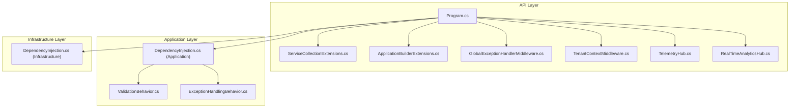
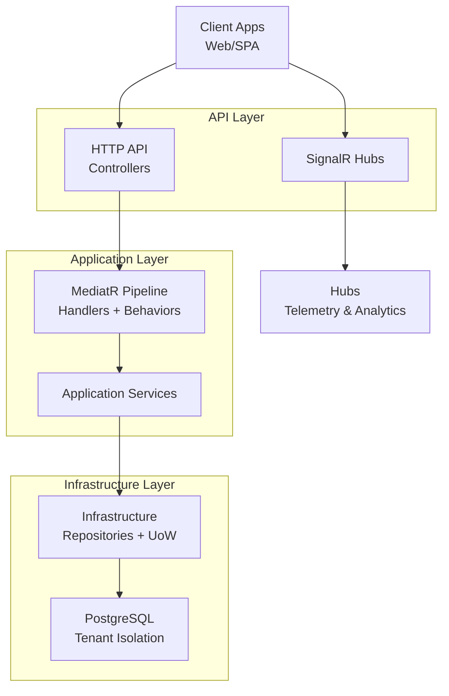
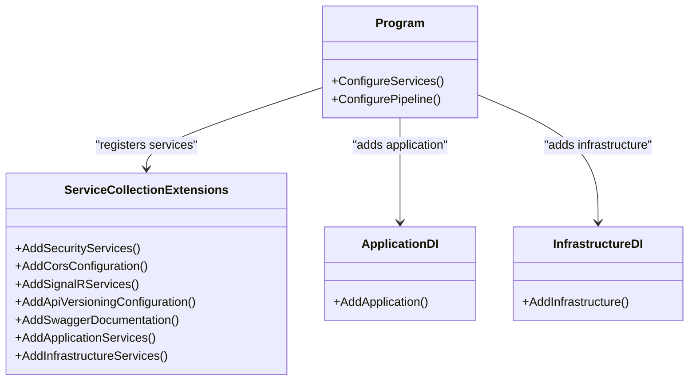
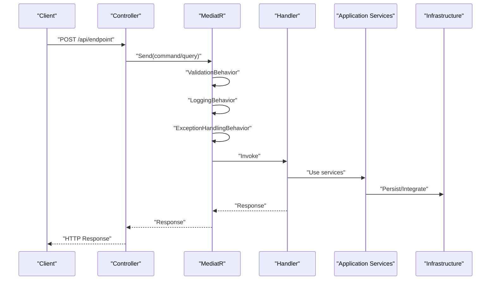
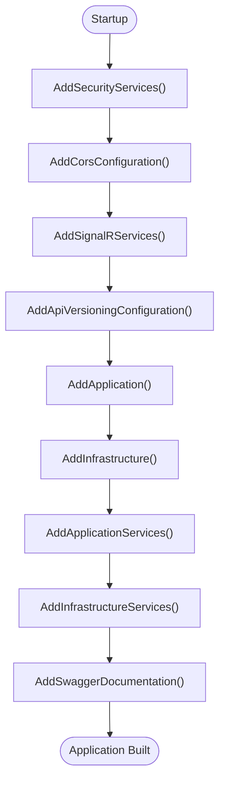
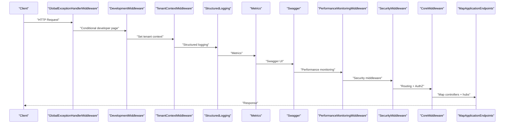
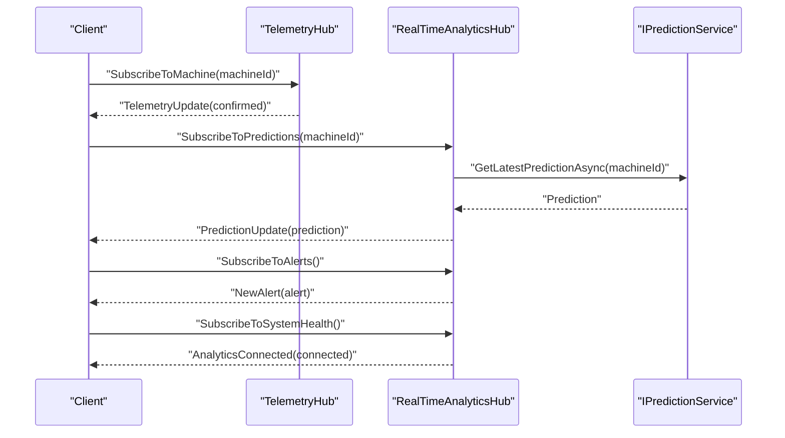
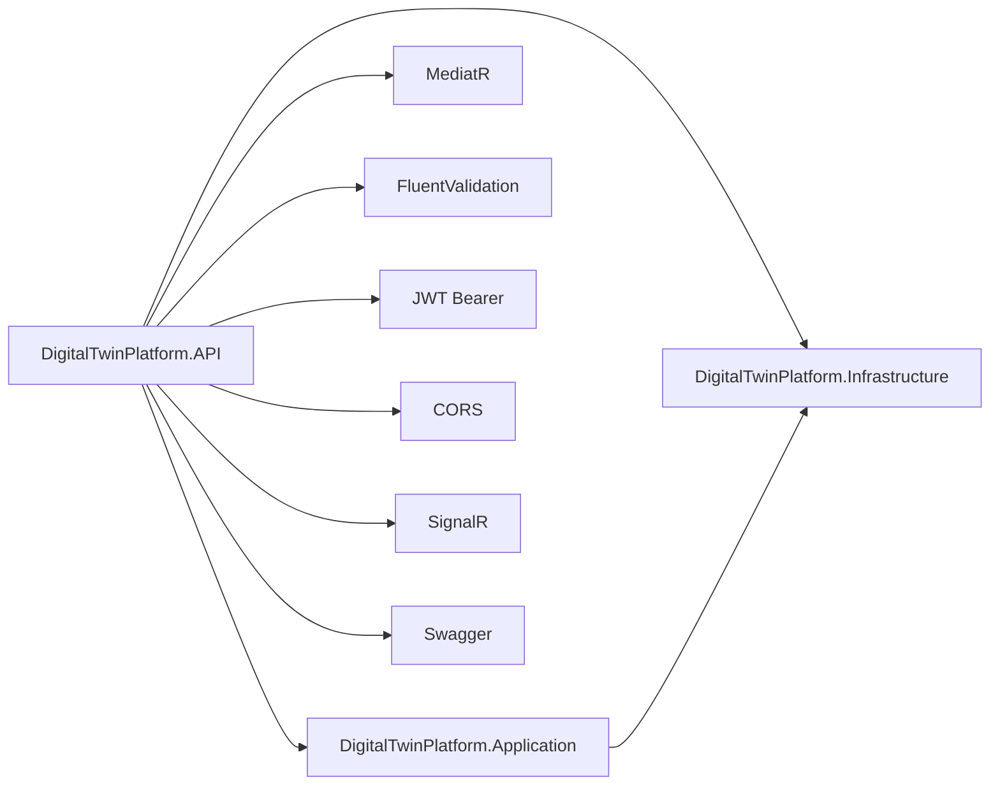

# API Architecture and Design Patterns

<cite>
**Referenced Files in This Document**
- [Program.cs](file://src/api/DigitalTwinPlatform.API/Program.cs)
- [ServiceCollectionExtensions.cs](file://src/api/DigitalTwinPlatform.API/Extensions/ServiceCollectionExtensions.cs)
- [ApplicationBuilderExtensions.cs](file://src/api/DigitalTwinPlatform.API/Extensions/ApplicationBuilderExtensions.cs)
- [GlobalExceptionHandlerMiddleware.cs](file://src/api/DigitalTwinPlatform.API/Middleware/GlobalExceptionHandlerMiddleware.cs)
- [TenantContextMiddleware.cs](file://src/api/DigitalTwinPlatform.API/Middleware/TenantContextMiddleware.cs)
- [DependencyInjection.cs (Application)](file://src/api/DigitalTwinPlatform.Application/DependencyInjection.cs)
- [DependencyInjection.cs (Infrastructure)](file://src/api/DigitalTwinPlatform.Infrastructure/DependencyInjection.cs)
- [TelemetryHub.cs](file://src/api/DigitalTwinPlatform.API/Hubs/TelemetryHub.cs)
- [RealTimeAnalyticsHub.cs](file://src/api/DigitalTwinPlatform.API/Hubs/RealTimeAnalyticsHub.cs)
- [ApiErrorDto.cs](file://src/api/DigitalTwinPlatform.API/Models/ApiErrorDto.cs)
- [ValidationBehavior.cs](file://src/api/DigitalTwinPlatform.Application/Behaviors/ValidationBehavior.cs)
- [ExceptionHandlingBehavior.cs](file://src/api/DigitalTwinPlatform.Application/Behaviors/ExceptionHandlingBehavior.cs)
- [appsettings.json](file://src/api/DigitalTwinPlatform.API/appsettings.json)
</cite>

## Table of Contents
1. [Introduction](#introduction)
2. [Project Structure](#project-structure)
3. [Core Components](#core-components)
4. [Architecture Overview](#architecture-overview)
5. [Detailed Component Analysis](#detailed-component-analysis)
6. [Dependency Analysis](#dependency-analysis)
7. [Performance Considerations](#performance-considerations)
8. [Troubleshooting Guide](#troubleshooting-guide)
9. [Conclusion](#conclusion)

## Introduction
This document presents the API architecture and design patterns for the Digital Twin Platform. It explains the Clean Architecture implementation with layered separation, the CQRS pattern usage, and MediatR integration. It documents dependency injection configuration, service registration patterns, and application layer composition. It also details the middleware pipeline including global exception handling, tenant context management, performance monitoring, and security middleware. SignalR integration for real-time communication, CORS configuration, and API versioning strategy are covered, along with architectural diagrams illustrating component relationships, data flow patterns, and integration boundaries. Design principles, architectural decisions, and scalability considerations are addressed throughout.

## Project Structure
The API surface is implemented in the DigitalTwinPlatform.API project with clear separation of concerns:
- Entry point and hosting configuration in Program.cs
- Dependency injection extensions for services, security, CORS, SignalR, and API versioning
- Middleware pipeline configuration and endpoint mapping
- Real-time capabilities via SignalR hubs
- Application and Infrastructure layers implementing Clean Architecture
- Centralized error handling and DTOs

**Diagram sources**
- [Program.cs](file://src/api/DigitalTwinPlatform.API/Program.cs#L1-L87)
- [ServiceCollectionExtensions.cs](file://src/api/DigitalTwinPlatform.API/Extensions/ServiceCollectionExtensions.cs#L1-L418)
- [ApplicationBuilderExtensions.cs](file://src/api/DigitalTwinPlatform.API/Extensions/ApplicationBuilderExtensions.cs#L1-L89)
- [GlobalExceptionHandlerMiddleware.cs](file://src/api/DigitalTwinPlatform.API/Middleware/GlobalExceptionHandlerMiddleware.cs#L1-L257)
- [TenantContextMiddleware.cs](file://src/api/DigitalTwinPlatform.API/Middleware/TenantContextMiddleware.cs#L1-L18)
- [TelemetryHub.cs](file://src/api/DigitalTwinPlatform.API/Hubs/TelemetryHub.cs#L1-L211)
- [RealTimeAnalyticsHub.cs](file://src/api/DigitalTwinPlatform.API/Hubs/RealTimeAnalyticsHub.cs#L1-L310)
- [DependencyInjection.cs (Application)](file://src/api/DigitalTwinPlatform.Application/DependencyInjection.cs#L1-L58)
- [ValidationBehavior.cs](file://src/api/DigitalTwinPlatform.Application/Behaviors/ValidationBehavior.cs#L1-L42)
- [ExceptionHandlingBehavior.cs](file://src/api/DigitalTwinPlatform.Application/Behaviors/ExceptionHandlingBehavior.cs#L1-L42)
- [DependencyInjection.cs (Infrastructure)](file://src/api/DigitalTwinPlatform.Infrastructure/DependencyInjection.cs#L1-L47)

**Section sources**
- [Program.cs](file://src/api/DigitalTwinPlatform.API/Program.cs#L1-L87)
- [ServiceCollectionExtensions.cs](file://src/api/DigitalTwinPlatform.API/Extensions/ServiceCollectionExtensions.cs#L1-L418)
- [ApplicationBuilderExtensions.cs](file://src/api/DigitalTwinPlatform.API/Extensions/ApplicationBuilderExtensions.cs#L1-L89)

## Core Components
- Program.cs orchestrates builder initialization, service registration, database initialization, and middleware pipeline configuration. It wires up controllers, Swagger, SignalR hubs, and health checks.
- ServiceCollectionExtensions.cs centralizes service registrations for security (JWT, Identity, Antiforgery), CORS, SignalR, API versioning, Swagger, and application-specific services.
- Application layer DependencyInjection.cs registers MediatR with cross-cutting behaviors (validation, logging, exception handling, performance, retry, authorization, audit, caching) and core services.
- Infrastructure layer DependencyInjection.cs configures Entity Framework DbContext, repositories, unit of work, and tenant isolation.
- Middleware stack includes global exception handling, development diagnostics, tenant context propagation, structured logging, metrics, Swagger, performance monitoring, security, and core pipeline.

**Section sources**
- [Program.cs](file://src/api/DigitalTwinPlatform.API/Program.cs#L11-L87)
- [ServiceCollectionExtensions.cs](file://src/api/DigitalTwinPlatform.API/Extensions/ServiceCollectionExtensions.cs#L35-L418)
- [DependencyInjection.cs (Application)](file://src/api/DigitalTwinPlatform.Application/DependencyInjection.cs#L13-L58)
- [DependencyInjection.cs (Infrastructure)](file://src/api/DigitalTwinPlatform.Infrastructure/DependencyInjection.cs#L14-L47)

## Architecture Overview
The platform follows Clean Architecture with three primary layers:
- API: Presentation and transport (HTTP and SignalR)
- Application: Domain services, CQRS handlers, and cross-cutting behaviors
- Infrastructure: Persistence, external integrations, and tenant isolation

MediatR is used for CQRS with handlers for commands and queries. Validation and exception handling are implemented as pipeline behaviors. Dependency injection composes services across layers and registers application services and hosted services for simulations and telemetry.

**Diagram sources**
- [Program.cs](file://src/api/DigitalTwinPlatform.API/Program.cs#L52-L80)
- [DependencyInjection.cs (Application)](file://src/api/DigitalTwinPlatform.Application/DependencyInjection.cs#L15-L56)
- [DependencyInjection.cs (Infrastructure)](file://src/api/DigitalTwinPlatform.Infrastructure/DependencyInjection.cs#L16-L44)

## Detailed Component Analysis

### Clean Architecture Implementation and Layered Separation
- API layer exposes controllers and SignalR hubs, delegates business logic to Application layer, and coordinates with Infrastructure for persistence and external systems.
- Application layer encapsulates domain services, CQRS handlers, and cross-cutting behaviors, maintaining independence from frameworks.
- Infrastructure layer manages persistence, external integrations (Azure Digital Twins, Blob Storage), and tenant schema isolation.

**Diagram sources**
- [Program.cs](file://src/api/DigitalTwinPlatform.API/Program.cs#L14-L47)
- [ServiceCollectionExtensions.cs](file://src/api/DigitalTwinPlatform.API/Extensions/ServiceCollectionExtensions.cs#L35-L418)
- [DependencyInjection.cs (Application)](file://src/api/DigitalTwinPlatform.Application/DependencyInjection.cs#L15-L56)
- [DependencyInjection.cs (Infrastructure)](file://src/api/DigitalTwinPlatform.Infrastructure/DependencyInjection.cs#L16-L44)

**Section sources**
- [Program.cs](file://src/api/DigitalTwinPlatform.API/Program.cs#L14-L47)
- [DependencyInjection.cs (Application)](file://src/api/DigitalTwinPlatform.Application/DependencyInjection.cs#L15-L56)
- [DependencyInjection.cs (Infrastructure)](file://src/api/DigitalTwinPlatform.Infrastructure/DependencyInjection.cs#L16-L44)

### CQRS Pattern and MediatR Integration
- MediatR is registered in the Application layer with ordered pipeline behaviors for validation, logging, exception handling, performance, retry, authorization, audit, and caching.
- Handlers are auto-registered from the Application assembly; validators are auto-registered from the same assembly.
- This enables separation of commands and queries, centralized cross-cutting concerns, and testable handler composition.

**Diagram sources**
- [DependencyInjection.cs (Application)](file://src/api/DigitalTwinPlatform.Application/DependencyInjection.cs#L20-L36)
- [ValidationBehavior.cs](file://src/api/DigitalTwinPlatform.Application/Behaviors/ValidationBehavior.cs#L7-L41)
- [ExceptionHandlingBehavior.cs](file://src/api/DigitalTwinPlatform.Application/Behaviors/ExceptionHandlingBehavior.cs#L7-L41)

**Section sources**
- [DependencyInjection.cs (Application)](file://src/api/DigitalTwinPlatform.Application/DependencyInjection.cs#L20-L36)
- [ValidationBehavior.cs](file://src/api/DigitalTwinPlatform.Application/Behaviors/ValidationBehavior.cs#L7-L41)
- [ExceptionHandlingBehavior.cs](file://src/api/DigitalTwinPlatform.Application/Behaviors/ExceptionHandlingBehavior.cs#L7-L41)

### Dependency Injection Configuration and Service Registration
- Security services: Identity, JWT bearer authentication, and Antiforgery are configured with environment-aware validation and cookie policy.
- CORS: Policy supports configurable origins with credentials and wildcard headers/methods.
- SignalR: JSON protocol configuration, hub options for timeouts, message sizes, and parallel invocations per client.
- API versioning: Default version and assumption when unspecified.
- Swagger: OpenAPI documentation with JWT Bearer security scheme and XML comments.
- Application services: Machine configuration, simulation engine, ML predictors, SHAP service, drift detection, uncertainty quantification, mathematical modeling, advanced analytics, workflows, and external system integration.
- Infrastructure services: Hub publisher, data archival, hosted services for telemetry mocking, and Azure clients.

**Diagram sources**
- [ServiceCollectionExtensions.cs](file://src/api/DigitalTwinPlatform.API/Extensions/ServiceCollectionExtensions.cs#L43-L321)
- [DependencyInjection.cs (Application)](file://src/api/DigitalTwinPlatform.Application/DependencyInjection.cs#L15-L56)
- [DependencyInjection.cs (Infrastructure)](file://src/api/DigitalTwinPlatform.Infrastructure/DependencyInjection.cs#L16-L44)

**Section sources**
- [ServiceCollectionExtensions.cs](file://src/api/DigitalTwinPlatform.API/Extensions/ServiceCollectionExtensions.cs#L43-L321)
- [DependencyInjection.cs (Application)](file://src/api/DigitalTwinPlatform.Application/DependencyInjection.cs#L15-L56)
- [DependencyInjection.cs (Infrastructure)](file://src/api/DigitalTwinPlatform.Infrastructure/DependencyInjection.cs#L16-L44)

### Middleware Pipeline and Control Flow
- Global exception handling: Centralized error mapping to structured API responses with environment-aware details.
- Development middleware: Developer exception page in development.
- Tenant context: Propagates tenant identifier from request header to tenant service.
- Structured logging and metrics: Observability hooks.
- Swagger: Exposure of API documentation.
- Performance monitoring: Dedicated middleware.
- Security and core pipeline: Cookie policy, HTTPS redirection (non-development), Antiforgery, routing, CORS, authentication, and authorization.
- Endpoint mapping: Controllers and SignalR hubs.

**Diagram sources**
- [Program.cs](file://src/api/DigitalTwinPlatform.API/Program.cs#L59-L78)
- [ApplicationBuilderExtensions.cs](file://src/api/DigitalTwinPlatform.API/Extensions/ApplicationBuilderExtensions.cs#L15-L89)
- [GlobalExceptionHandlerMiddleware.cs](file://src/api/DigitalTwinPlatform.API/Middleware/GlobalExceptionHandlerMiddleware.cs#L13-L45)
- [TenantContextMiddleware.cs](file://src/api/DigitalTwinPlatform.API/Middleware/TenantContextMiddleware.cs#L7-L16)

**Section sources**
- [Program.cs](file://src/api/DigitalTwinPlatform.API/Program.cs#L59-L78)
- [ApplicationBuilderExtensions.cs](file://src/api/DigitalTwinPlatform.API/Extensions/ApplicationBuilderExtensions.cs#L15-L89)
- [GlobalExceptionHandlerMiddleware.cs](file://src/api/DigitalTwinPlatform.API/Middleware/GlobalExceptionHandlerMiddleware.cs#L25-L63)
- [TenantContextMiddleware.cs](file://src/api/DigitalTwinPlatform.API/Middleware/TenantContextMiddleware.cs#L7-L16)

### SignalR Integration for Real-Time Communication
- TelemetryHub: Manages machine-specific telemetry subscriptions, broadcasting to groups, and lifecycle events with logging and cleanup.
- RealTimeAnalyticsHub: Manages prediction, alert, and system health subscriptions, and broadcasts predictions via application services.
- Client interfaces define contract methods for real-time updates.

**Diagram sources**
- [TelemetryHub.cs](file://src/api/DigitalTwinPlatform.API/Hubs/TelemetryHub.cs#L33-L118)
- [RealTimeAnalyticsHub.cs](file://src/api/DigitalTwinPlatform.API/Hubs/RealTimeAnalyticsHub.cs#L37-L222)

**Section sources**
- [TelemetryHub.cs](file://src/api/DigitalTwinPlatform.API/Hubs/TelemetryHub.cs#L12-L184)
- [RealTimeAnalyticsHub.cs](file://src/api/DigitalTwinPlatform.API/Hubs/RealTimeAnalyticsHub.cs#L14-L245)

### CORS Configuration and API Versioning Strategy
- CORS: Default policy allows configured origins with credentials and wildcard headers/methods.
- API versioning: Reports versions, assumes default version when unspecified, and sets default API version.

**Section sources**
- [ServiceCollectionExtensions.cs](file://src/api/DigitalTwinPlatform.API/Extensions/ServiceCollectionExtensions.cs#L77-L146)
- [Program.cs](file://src/api/DigitalTwinPlatform.API/Program.cs#L39-L39)

### Application Layer Composition
- Memory cache for caching behavior
- MediatR with ordered behaviors
- ML services, workflows, simulations, numerical solvers, and core services
- Auto-registration of validators and handlers from assembly

**Section sources**
- [DependencyInjection.cs (Application)](file://src/api/DigitalTwinPlatform.Application/DependencyInjection.cs#L17-L54)

### Infrastructure Layer Composition
- DbContext with Npgsql provider and tenant schema interceptor
- Unit of Work and generic repository pattern
- Tenant service and schema isolation
- Repository registrations for entities

**Section sources**
- [DependencyInjection.cs (Infrastructure)](file://src/api/DigitalTwinPlatform.Infrastructure/DependencyInjection.cs#L22-L43)

## Dependency Analysis
The following diagram shows the primary dependencies among the API, Application, and Infrastructure layers, focusing on service registration and runtime composition.

**Diagram sources**
- [Program.cs](file://src/api/DigitalTwinPlatform.API/Program.cs#L42-L47)
- [DependencyInjection.cs (Application)](file://src/api/DigitalTwinPlatform.Application/DependencyInjection.cs#L20-L36)
- [DependencyInjection.cs (Infrastructure)](file://src/api/DigitalTwinPlatform.Infrastructure/DependencyInjection.cs#L16-L44)

**Section sources**
- [Program.cs](file://src/api/DigitalTwinPlatform.API/Program.cs#L42-L47)
- [DependencyInjection.cs (Application)](file://src/api/DigitalTwinPlatform.Application/DependencyInjection.cs#L20-L36)
- [DependencyInjection.cs (Infrastructure)](file://src/api/DigitalTwinPlatform.Infrastructure/DependencyInjection.cs#L16-L44)

## Performance Considerations
- Prediction caching: Enabled with TTL configuration to reduce repeated computations.
- Simulation orchestration: Batched processing with configurable interval and batch size.
- SignalR limits: Configurable handshake timeout, keep-alive interval, maximum receive message size, and parallel invocations per client.
- Latency thresholds: Configurable thresholds for critical operations to drive performance monitoring.
- Hosted services: Background processing for telemetry and simulations to decouple from request-response cycles.

**Section sources**
- [appsettings.json](file://src/api/DigitalTwinPlatform.API/appsettings.json#L58-L78)
- [ServiceCollectionExtensions.cs](file://src/api/DigitalTwinPlatform.API/Extensions/ServiceCollectionExtensions.cs#L105-L131)
- [ServiceCollectionExtensions.cs](file://src/api/DigitalTwinPlatform.API/Extensions/ServiceCollectionExtensions.cs#L248-L252)

## Troubleshooting Guide
- Global exception handling: Centralized mapping of domain and framework exceptions to structured API error responses with request correlation identifiers. Logs are emitted at warning level for expected failures and error level for unhandled exceptions.
- Tenant context middleware: Reads tenant identifier from request header and sets the tenant context for downstream services.
- JWT configuration validation: Ensures minimum key length and presence of issuer/audience values; otherwise throws descriptive exceptions during authentication setup.
- CORS and SignalR configuration: Validates and applies policy and hub options from configuration; defaults are applied when keys are missing.
- Swagger documentation: Adds security scheme and requirement for JWT Bearer; includes XML comments if present.

**Section sources**
- [GlobalExceptionHandlerMiddleware.cs](file://src/api/DigitalTwinPlatform.API/Middleware/GlobalExceptionHandlerMiddleware.cs#L25-L249)
- [ApiErrorDto.cs](file://src/api/DigitalTwinPlatform.API/Models/ApiErrorDto.cs#L3-L44)
- [TenantContextMiddleware.cs](file://src/api/DigitalTwinPlatform.API/Middleware/TenantContextMiddleware.cs#L7-L16)
- [ServiceCollectionExtensions.cs](file://src/api/DigitalTwinPlatform.API/Extensions/ServiceCollectionExtensions.cs#L355-L396)
- [ServiceCollectionExtensions.cs](file://src/api/DigitalTwinPlatform.API/Extensions/ServiceCollectionExtensions.cs#L77-L131)
- [ApplicationBuilderExtensions.cs](file://src/api/DigitalTwinPlatform.API/Extensions/ApplicationBuilderExtensions.cs#L79-L88)

## Conclusion
The Digital Twin Platform API employs Clean Architecture with clear separation between presentation, application, and infrastructure layers. CQRS and MediatR enable scalable command and query handling with robust cross-cutting behaviors. The middleware pipeline ensures consistent security, observability, and error handling. SignalR hubs deliver real-time telemetry and analytics updates. Dependency injection composes services across layers, while CORS, API versioning, and Swagger provide operational and developer experience enhancements. These design choices support maintainability, testability, and scalability.