# Analytics and Machine Learning Controllers

<cite>
**Referenced Files in This Document**
- [AdvancedAnalyticsController.cs](file://src/api/DigitalTwinPlatform.API/Controllers/AdvancedAnalyticsController.cs)
- [AIModelController.cs](file://src/api/DigitalTwinPlatform.API/Controllers/AIModelController.cs)
- [MathematicalModelingController.cs](file://src/api/DigitalTwinPlatform.API/Controllers/MathematicalModelingController.cs)
- [PredictionsController.cs](file://src/api/DigitalTwinPlatform.API/Controllers/PredictionsController.cs)
- [UncertaintyController.cs](file://src/api/DigitalTwinPlatform.API/Controllers/UncertaintyController.cs)
- [DriftController.cs](file://src/api/DigitalTwinPlatform.API/Controllers/DriftController.cs)
- [RealTimeAnalyticsHub.cs](file://src/api/DigitalTwinPlatform.API/Hubs/RealTimeAnalyticsHub.cs)
- [IShapService.cs](file://src/api/DigitalTwinPlatform.API/Services/Analytics/IShapService.cs)
- [ShapServiceClient.cs](file://src/api/DigitalTwinPlatform.API/Services/Analytics/ShapServiceClient.cs)
- [PredictiveAnalyticsService.cs](file://src/api/DigitalTwinPlatform.API/Services/Analytics/PredictiveAnalyticsService.cs)
- [UncertaintyQuantificationService.cs](file://src/api/DigitalTwinPlatform.API/Services/Analytics/UncertaintyQuantificationService.cs)
- [DataDriftService.cs](file://src/api/DigitalTwinPlatform.API/Services/Analytics/DataDriftService.cs)
- [ModelLifecycleService.cs](file://src/api/DigitalTwinPlatform.API/Services/Analytics/ModelLifecycleService.cs)
- [BenchmarkValidationService.cs](file://src/api/DigitalTwinPlatform.API/Services/Analytics/BenchmarkValidationService.cs)
- [ModelRetrainingService.cs](file://src/api/DigitalTwinPlatform.API/Services/Analytics/ModelRetrainingService.cs)
</cite>

## Table of Contents
1. [Introduction](#introduction)
2. [Project Structure](#project-structure)
3. [Core Components](#core-components)
4. [Architecture Overview](#architecture-overview)
5. [Detailed Component Analysis](#detailed-component-analysis)
6. [Dependency Analysis](#dependency-analysis)
7. [Performance Considerations](#performance-considerations)
8. [Troubleshooting Guide](#troubleshooting-guide)
9. [Conclusion](#conclusion)

## Introduction
This document provides comprehensive technical documentation for the analytics and machine learning API controllers that power the Digital Twin Platform. It covers Advanced Analytics, AI Model Management, Mathematical Modeling, Predictions, Uncertainty Quantification, and Drift Detection controllers. The documentation explains specialized endpoints for ML model training, inference, validation, and interpretation, integrates the SHAP explanation service, describes ensemble modeling capabilities, and outlines real-time analytics processing. It also includes examples of complex analytical workflows, batch processing endpoints, and interactive analysis APIs. Model lifecycle management, performance metrics exposure, and explainability features are documented alongside computational resource requirements, asynchronous processing patterns, and result caching strategies.

## Project Structure
The analytics and ML controllers reside in the API project under the Controllers folder, with supporting services in the Services/Analytics and Services/Analytics/ML namespaces. Real-time streaming is implemented via SignalR hubs. The controllers coordinate with application-layer services and repositories to deliver predictions, uncertainty quantification, drift detection, and model lifecycle management.

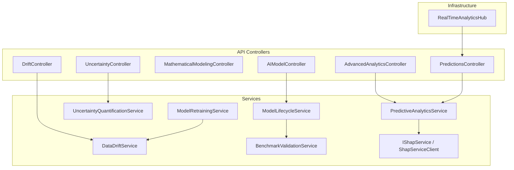

**Diagram sources**
- [AdvancedAnalyticsController.cs](file://src/api/DigitalTwinPlatform.API/Controllers/AdvancedAnalyticsController.cs#L10-L301)
- [AIModelController.cs](file://src/api/DigitalTwinPlatform.API/Controllers/AIModelController.cs#L17-L425)
- [MathematicalModelingController.cs](file://src/api/DigitalTwinPlatform.API/Controllers/MathematicalModelingController.cs#L8-L384)
- [PredictionsController.cs](file://src/api/DigitalTwinPlatform.API/Controllers/PredictionsController.cs#L22-L434)
- [UncertaintyController.cs](file://src/api/DigitalTwinPlatform.API/Controllers/UncertaintyController.cs#L8-L418)
- [DriftController.cs](file://src/api/DigitalTwinPlatform.API/Controllers/DriftController.cs#L10-L228)
- [PredictiveAnalyticsService.cs](file://src/api/DigitalTwinPlatform.API/Services/Analytics/PredictiveAnalyticsService.cs#L15-L261)
- [UncertaintyQuantificationService.cs](file://src/api/DigitalTwinPlatform.API/Services/Analytics/UncertaintyQuantificationService.cs#L6-L383)
- [DataDriftService.cs](file://src/api/DigitalTwinPlatform.API/Services/Analytics/DataDriftService.cs#L17-L524)
- [ModelLifecycleService.cs](file://src/api/DigitalTwinPlatform.API/Services/Analytics/ModelLifecycleService.cs#L9-L260)
- [BenchmarkValidationService.cs](file://src/api/DigitalTwinPlatform.API/Services/Analytics/BenchmarkValidationService.cs#L10-L222)
- [ModelRetrainingService.cs](file://src/api/DigitalTwinPlatform.API/Services/Analytics/ModelRetrainingService.cs#L15-L68)
- [RealTimeAnalyticsHub.cs](file://src/api/DigitalTwinPlatform.API/Hubs/RealTimeAnalyticsHub.cs#L14-L310)

**Section sources**
- [AdvancedAnalyticsController.cs](file://src/api/DigitalTwinPlatform.API/Controllers/AdvancedAnalyticsController.cs#L10-L301)
- [AIModelController.cs](file://src/api/DigitalTwinPlatform.API/Controllers/AIModelController.cs#L17-L425)
- [MathematicalModelingController.cs](file://src/api/DigitalTwinPlatform.API/Controllers/MathematicalModelingController.cs#L8-L384)
- [PredictionsController.cs](file://src/api/DigitalTwinPlatform.API/Controllers/PredictionsController.cs#L22-L434)
- [UncertaintyController.cs](file://src/api/DigitalTwinPlatform.API/Controllers/UncertaintyController.cs#L8-L418)
- [DriftController.cs](file://src/api/DigitalTwinPlatform.API/Controllers/DriftController.cs#L10-L228)

## Core Components
This section summarizes the primary controllers and their responsibilities:

- AdvancedAnalyticsController: Ensemble predictions, deep learning forecasts, anomaly detection, time series forecasting, and prescriptive recommendations. Also exposes an advanced analytics dashboard endpoint.
- AIModelController: Full lifecycle management for ML models including deployment, validation, prediction testing, metrics retrieval, retraining, and deployment to machines.
- MathematicalModelingController: Numerical solutions for ODE systems, system dynamics, and parameter optimization using gradient-based, genetic, and multi-objective approaches.
- PredictionsController: RUL and health classification predictions, training orchestration, model status, manual prediction requests, anomaly detection, and search functionality.
- UncertaintyController: Monte Carlo, Bayesian, bootstrap, and model uncertainty quantification, plus comprehensive uncertainty reports and risk assessments.
- DriftController: Drift detection status, history, thresholds, configuration, manual detection, and monitoring configuration.

**Section sources**
- [AdvancedAnalyticsController.cs](file://src/api/DigitalTwinPlatform.API/Controllers/AdvancedAnalyticsController.cs#L26-L287)
- [AIModelController.cs](file://src/api/DigitalTwinPlatform.API/Controllers/AIModelController.cs#L33-L383)
- [MathematicalModelingController.cs](file://src/api/DigitalTwinPlatform.API/Controllers/MathematicalModelingController.cs#L24-L307)
- [PredictionsController.cs](file://src/api/DigitalTwinPlatform.API/Controllers/PredictionsController.cs#L32-L434)
- [UncertaintyController.cs](file://src/api/DigitalTwinPlatform.API/Controllers/UncertaintyController.cs#L21-L284)
- [DriftController.cs](file://src/api/DigitalTwinPlatform.API/Controllers/DriftController.cs#L13-L227)

## Architecture Overview
The controllers act as API entry points, delegating to domain-specific services. PredictiveAnalyticsService orchestrates feature extraction, ML inference, XAI contributions, and alerting. UncertaintyQuantificationService performs Monte Carlo, Bayesian, and bootstrap analyses. DataDriftService detects feature and prediction drift with configurable thresholds. ModelLifecycleService manages model registration, promotion, and performance summaries. BenchmarkValidationService validates models against benchmark datasets. ModelRetrainingService automates retraining based on drift checks. RealTimeAnalyticsHub streams predictions and alerts to clients.

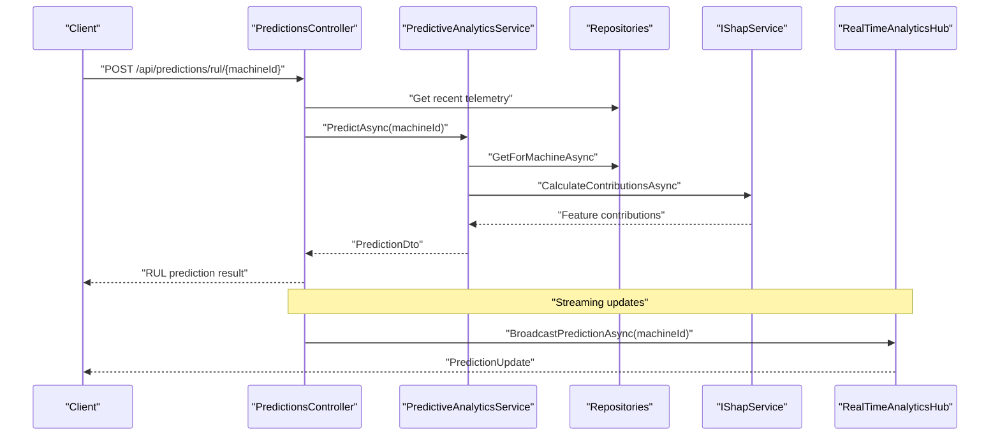

**Diagram sources**
- [PredictionsController.cs](file://src/api/DigitalTwinPlatform.API/Controllers/PredictionsController.cs#L39-L75)
- [PredictiveAnalyticsService.cs](file://src/api/DigitalTwinPlatform.API/Services/Analytics/PredictiveAnalyticsService.cs#L49-L134)
- [IShapService.cs](file://src/api/DigitalTwinPlatform.API/Services/Analytics/IShapService.cs#L3-L24)
- [RealTimeAnalyticsHub.cs](file://src/api/DigitalTwinPlatform.API/Hubs/RealTimeAnalyticsHub.cs#L196-L222)

## Detailed Component Analysis

### Advanced Analytics Controller
Endpoints:
- Ensemble prediction: POST api/advanced-analytics/predictions/{machineId}/ensemble
- Deep learning prediction: POST api/advanced-analytics/predictions/{machineId}/deep-learning
- Anomaly detection: POST api/advanced-analytics/anomaly-detection/{machineId}
- Time series forecasting: POST api/advanced-analytics/forecasting/{machineId}/{metric}
- Prescriptive maintenance recommendations: POST api/advanced-analytics/prescriptive/maintenance/{machineId}
- Production scheduling optimization: POST api/advanced-analytics/prescriptive/scheduling
- Resource allocation optimization: POST api/advanced-analytics/prescriptive/resource-allocation
- Cost optimization: POST api/advanced-analytics/prescriptive/cost-optimization
- Advanced analytics dashboard: GET api/advanced-analytics/dashboard/{machineId}

Processing logic:
- Uses IAdvancedPredictiveService for ensemble and deep learning predictions, anomaly detection, and forecasting.
- Uses IPrescriptiveAnalyticsService for maintenance, scheduling, resource allocation, and cost optimization recommendations.
- Dashboard endpoint aggregates ensemble prediction, anomaly detection, and maintenance recommendation into a single payload with a composite health score.

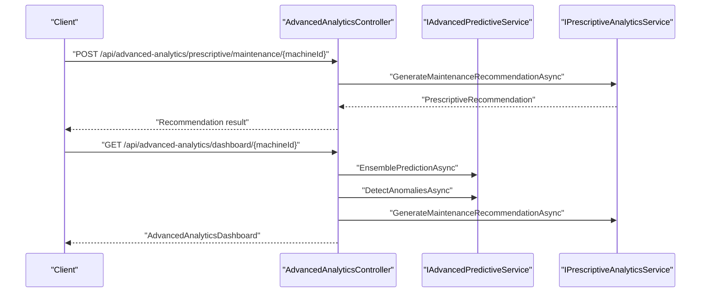

**Diagram sources**
- [AdvancedAnalyticsController.cs](file://src/api/DigitalTwinPlatform.API/Controllers/AdvancedAnalyticsController.cs#L129-L287)

**Section sources**
- [AdvancedAnalyticsController.cs](file://src/api/DigitalTwinPlatform.API/Controllers/AdvancedAnalyticsController.cs#L26-L287)

### AI Model Management Controller
Endpoints:
- List models: GET api/ai-models
- Get model by ID: GET api/ai-models/{id}
- Deploy model: POST api/ai-models (multipart/form-data)
- Update model: PUT api/ai-models/{id}
- Delete model: DELETE api/ai-models/{id}
- Test model prediction: POST api/ai-models/{id}/predict
- Get model metrics: GET api/ai-models/{id}/metrics
- Retrain model: POST api/ai-models/{id}/retrain
- Get compatible machines: GET api/ai-models/{id}/compatible-machines
- Deploy to machines: POST api/ai-models/{id}/deploy-to-machines
- Get deployment status: GET api/ai-models/{id}/deployment-status
- Validate model file: POST api/ai-models/validate-model

Processing logic:
- Uses MediatR for commands and queries (e.g., DeployAIModelCommand, GetAIModelByIdQuery).
- Uses IAIService for prediction, metrics, compatibility, deployment, and validation.
- Supports JSON arrays for features, tags, and target machines via deserialization helpers.

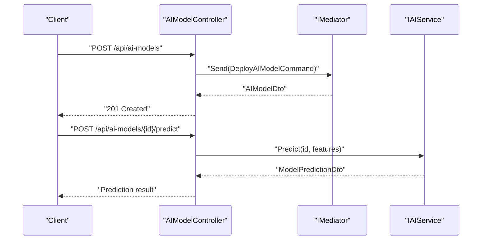

**Diagram sources**
- [AIModelController.cs](file://src/api/DigitalTwinPlatform.API/Controllers/AIModelController.cs#L81-L135)
- [AIModelController.cs](file://src/api/DigitalTwinPlatform.API/Controllers/AIModelController.cs#L213-L242)

**Section sources**
- [AIModelController.cs](file://src/api/DigitalTwinPlatform.API/Controllers/AIModelController.cs#L33-L383)

### Mathematical Modeling Controller
Endpoints:
- ODE solve: POST api/mathematical-modeling/ode/solve
- System dynamics solve: POST api/mathematical-modeling/system-dynamics/solve
- Gradient optimization: POST api/mathematical-modeling/optimization/gradient
- Genetic optimization: POST api/mathematical-modeling/optimization/genetic
- Multi-objective optimization: POST api/mathematical-modeling/optimization/multi-objective
- Get system models catalog: GET api/mathematical-modeling/models

Processing logic:
- Solves ODEs and system dynamics with derived quantities and stability/energy analysis.
- Performs gradient-based, genetic algorithm, and NSGA-II multi-objective optimizations.
- Provides predefined system models (mass-spring-damper, RC circuit, chemical reaction).

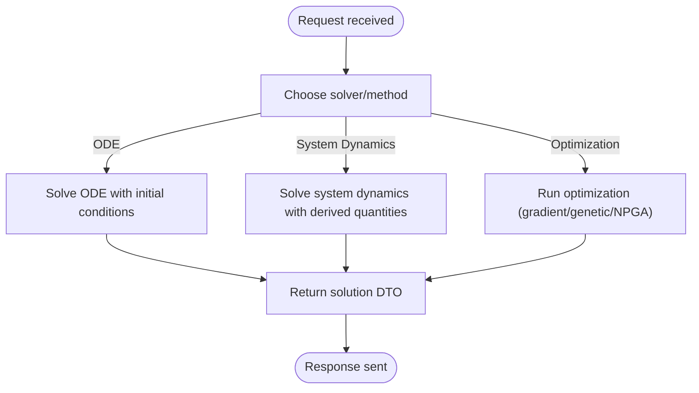

**Diagram sources**
- [MathematicalModelingController.cs](file://src/api/DigitalTwinPlatform.API/Controllers/MathematicalModelingController.cs#L27-L307)

**Section sources**
- [MathematicalModelingController.cs](file://src/api/DigitalTwinPlatform.API/Controllers/MathematicalModelingController.cs#L24-L307)

### Predictions Controller
Endpoints:
- RUL prediction: POST /api/predictions/rul/{machineId} and GET /api/predictions/rul/{machineId}
- Health classification: GET /api/predictions/health/{machineId}
- Quick RUL summary: GET /api/predictions/rul/{machineId}/summary
- Train models: POST /api/predictions/train and POST /api/predictions/ai/train
- Model status: GET /api/predictions/status
- Manual prediction: POST /api/predictions
- Prediction history/search: GET /api/predictions and GET /api/predictions/search
- Anomaly prediction: GET /api/predictions/anomaly/{machineId}

Processing logic:
- Validates telemetry availability (minimum points threshold).
- Extracts features and runs RUL predictor and health classifier.
- Supports training orchestration via MediatR command.
- Exposes search and history endpoints for predictions.

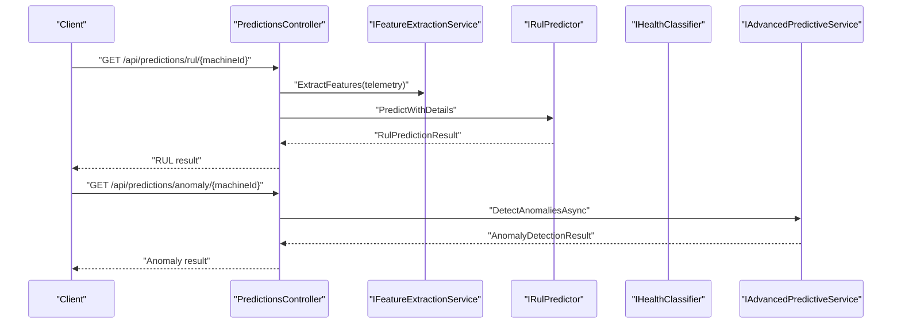

**Diagram sources**
- [PredictionsController.cs](file://src/api/DigitalTwinPlatform.API/Controllers/PredictionsController.cs#L39-L120)
- [PredictionsController.cs](file://src/api/DigitalTwinPlatform.API/Controllers/PredictionsController.cs#L332-L359)

**Section sources**
- [PredictionsController.cs](file://src/api/DigitalTwinPlatform.API/Controllers/PredictionsController.cs#L32-L434)

### Uncertainty Quantification Controller
Endpoints:
- Monte Carlo analysis: POST api/uncertainty/{machineId}/monte-carlo
- Bayesian analysis: POST api/uncertainty/{machineId}/bayesian
- Bootstrap intervals: GET api/uncertainty/{machineId}/bootstrap-intervals
- Model uncertainty: POST api/uncertainty/{machineId}/model-uncertainty
- Comprehensive report: GET api/uncertainty/{machineId}/comprehensive-report

Processing logic:
- Monte Carlo simulation with Gaussian perturbations and confidence intervals.
- Bayesian inference with prior distributions and posterior sampling.
- Bootstrap confidence intervals using historical predictions.
- Model uncertainty decomposition into aleatoric and epistemic components.

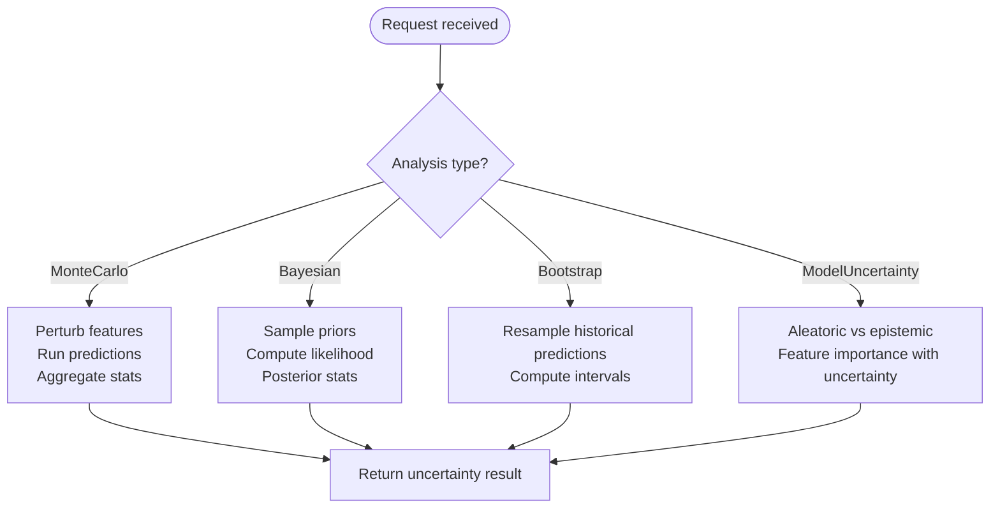

**Diagram sources**
- [UncertaintyController.cs](file://src/api/DigitalTwinPlatform.API/Controllers/UncertaintyController.cs#L21-L284)
- [UncertaintyQuantificationService.cs](file://src/api/DigitalTwinPlatform.API/Services/Analytics/UncertaintyQuantificationService.cs#L15-L301)

**Section sources**
- [UncertaintyController.cs](file://src/api/DigitalTwinPlatform.API/Controllers/UncertaintyController.cs#L21-L284)
- [UncertaintyQuantificationService.cs](file://src/api/DigitalTwinPlatform.API/Services/Analytics/UncertaintyQuantificationService.cs#L15-L301)

### Drift Detection Controller
Endpoints:
- Current drift status: GET api/drift/status
- Drift history: GET api/drift/history/{modelName}?hours=...
- Thresholds: GET api/drift/thresholds/{modelName} and PUT api/drift/thresholds/{modelName}
- Drift report: GET api/drift/report?modelName&days=...
- Manual drift detection: POST api/drift/detect
- Monitoring config: GET api/drift/monitoring/config

Processing logic:
- Detects drift using KS test, Wasserstein distance, or PSI.
- Stores drift history per model and supports alerting with cooldown.
- Generates drift reports and recommendations based on severity.

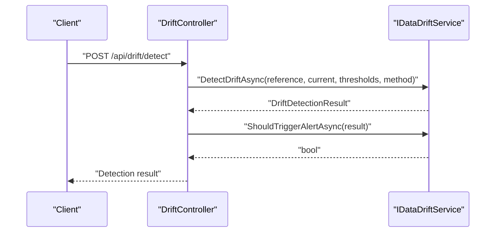

**Diagram sources**
- [DriftController.cs](file://src/api/DigitalTwinPlatform.API/Controllers/DriftController.cs#L164-L205)
- [DataDriftService.cs](file://src/api/DigitalTwinPlatform.API/Services/Analytics/DataDriftService.cs#L47-L137)

**Section sources**
- [DriftController.cs](file://src/api/DigitalTwinPlatform.API/Controllers/DriftController.cs#L13-L227)
- [DataDriftService.cs](file://src/api/DigitalTwinPlatform.API/Services/Analytics/DataDriftService.cs#L17-L524)

### Real-Time Analytics Streaming
RealTimeAnalyticsHub provides:
- Subscription to predictions, alerts, and system health.
- Broadcasting of prediction updates to subscribed groups.
- Connection lifecycle management and error handling.

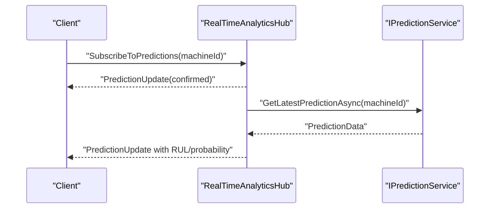

**Diagram sources**
- [RealTimeAnalyticsHub.cs](file://src/api/DigitalTwinPlatform.API/Hubs/RealTimeAnalyticsHub.cs#L37-L222)

**Section sources**
- [RealTimeAnalyticsHub.cs](file://src/api/DigitalTwinPlatform.API/Hubs/RealTimeAnalyticsHub.cs#L14-L310)

### SHAP Explanation Service Integration
The platform integrates with an external SHAP service for model interpretability:
- IShapService defines methods for computing SHAP values, updating background data, and checking service availability.
- ShapServiceClient implements HTTP communication with the SHAP service, including timeouts and error handling.

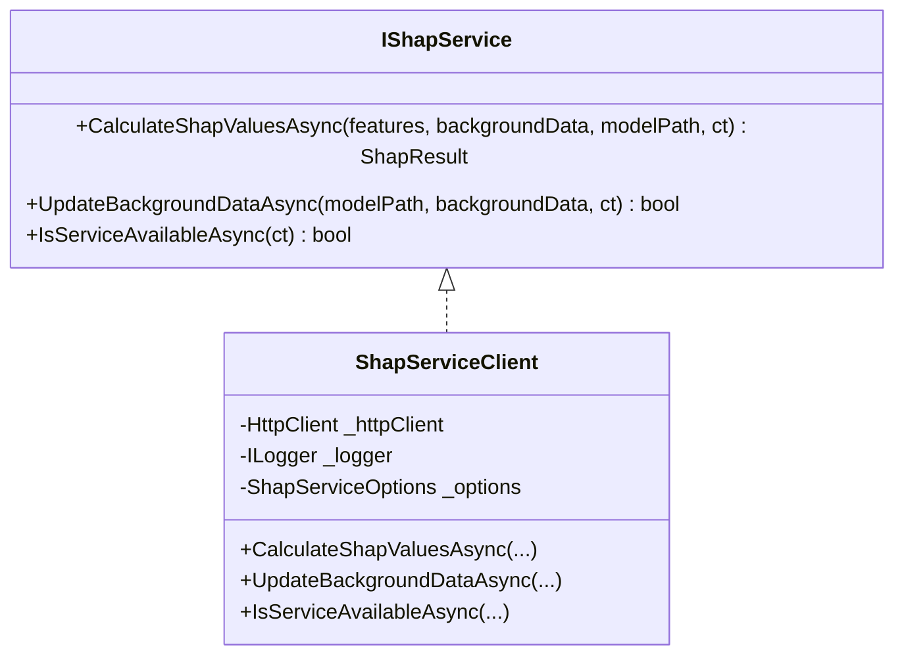

**Diagram sources**
- [IShapService.cs](file://src/api/DigitalTwinPlatform.API/Services/Analytics/IShapService.cs#L3-L24)
- [ShapServiceClient.cs](file://src/api/DigitalTwinPlatform.API/Services/Analytics/ShapServiceClient.cs#L15-L158)

**Section sources**
- [IShapService.cs](file://src/api/DigitalTwinPlatform.API/Services/Analytics/IShapService.cs#L3-L24)
- [ShapServiceClient.cs](file://src/api/DigitalTwinPlatform.API/Services/Analytics/ShapServiceClient.cs#L15-L158)

### Model Lifecycle Management
ModelLifecycleService handles:
- Registration of new model versions with metrics and training metadata.
- Promotion of models to production with automatic deprecation of previous production versions.
- Listing versions, retrieving production version, comparing models, and computing performance summaries.

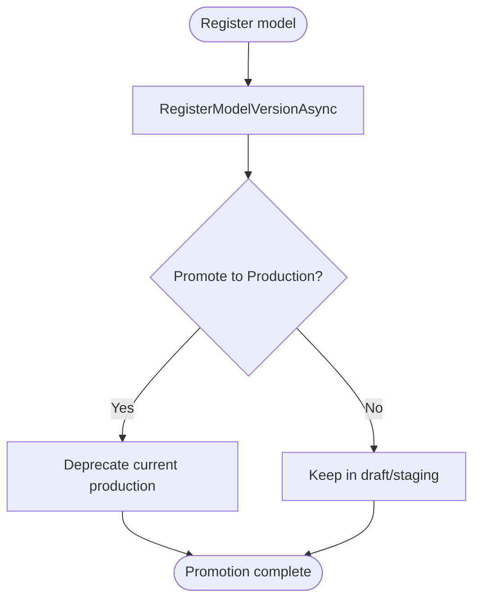

**Diagram sources**
- [ModelLifecycleService.cs](file://src/api/DigitalTwinPlatform.API/Services/Analytics/ModelLifecycleService.cs#L28-L118)

**Section sources**
- [ModelLifecycleService.cs](file://src/api/DigitalTwinPlatform.API/Services/Analytics/ModelLifecycleService.cs#L9-L260)

### Benchmark Validation and Retraining
BenchmarkValidationService:
- Loads benchmark datasets and validates models using ML.NET evaluation metrics (MAE, RMSE, R², MAPE).
- Compares predictions against actual values and generates detailed metrics.

ModelRetrainingService:
- Checks for drift using benchmark validation and triggers retraining when significant drift is detected.
- Simulates fetching data, training with LightGBM, and deploying a new model version.

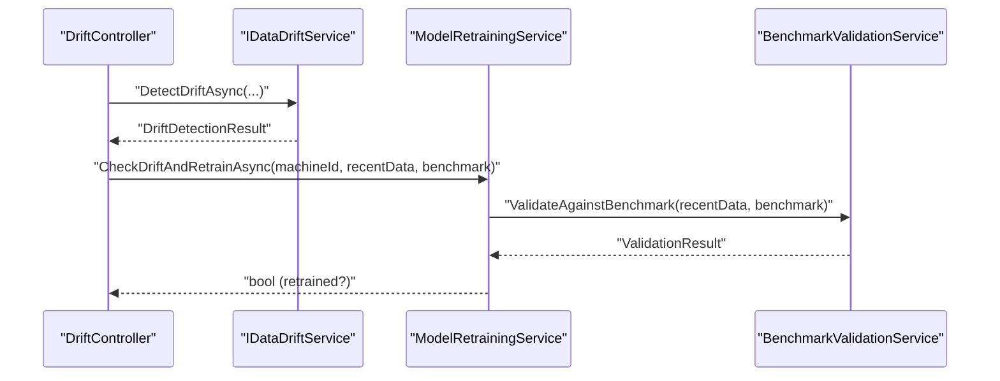

**Diagram sources**
- [DriftController.cs](file://src/api/DigitalTwinPlatform.API/Controllers/DriftController.cs#L164-L205)
- [ModelRetrainingService.cs](file://src/api/DigitalTwinPlatform.API/Services/Analytics/ModelRetrainingService.cs#L31-L67)
- [BenchmarkValidationService.cs](file://src/api/DigitalTwinPlatform.API/Services/Analytics/BenchmarkValidationService.cs#L26-L161)

**Section sources**
- [BenchmarkValidationService.cs](file://src/api/DigitalTwinPlatform.API/Services/Analytics/BenchmarkValidationService.cs#L10-L222)
- [ModelRetrainingService.cs](file://src/api/DigitalTwinPlatform.API/Services/Analytics/ModelRetrainingService.cs#L15-L68)

## Dependency Analysis
The controllers depend on services that encapsulate analytics logic, while services depend on repositories and external integrations. The dependency graph highlights the separation of concerns and the direction of data flow.

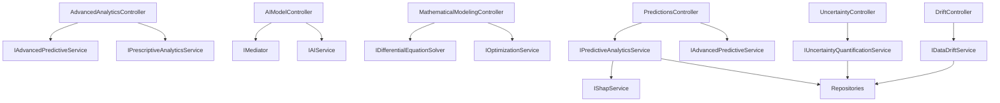

**Diagram sources**
- [AdvancedAnalyticsController.cs](file://src/api/DigitalTwinPlatform.API/Controllers/AdvancedAnalyticsController.cs#L12-L24)
- [AIModelController.cs](file://src/api/DigitalTwinPlatform.API/Controllers/AIModelController.cs#L19-L31)
- [MathematicalModelingController.cs](file://src/api/DigitalTwinPlatform.API/Controllers/MathematicalModelingController.cs#L10-L22)
- [PredictionsController.cs](file://src/api/DigitalTwinPlatform.API/Controllers/PredictionsController.cs#L22-L30)
- [UncertaintyController.cs](file://src/api/DigitalTwinPlatform.API/Controllers/UncertaintyController.cs#L10-L19)
- [DriftController.cs](file://src/api/DigitalTwinPlatform.API/Controllers/DriftController.cs#L10-L10)
- [PredictiveAnalyticsService.cs](file://src/api/DigitalTwinPlatform.API/Services/Analytics/PredictiveAnalyticsService.cs#L15-L47)
- [UncertaintyQuantificationService.cs](file://src/api/DigitalTwinPlatform.API/Services/Analytics/UncertaintyQuantificationService.cs#L6-L11)
- [DataDriftService.cs](file://src/api/DigitalTwinPlatform.API/Services/Analytics/DataDriftService.cs#L17-L37)

**Section sources**
- [PredictiveAnalyticsService.cs](file://src/api/DigitalTwinPlatform.API/Services/Analytics/PredictiveAnalyticsService.cs#L15-L47)
- [UncertaintyQuantificationService.cs](file://src/api/DigitalTwinPlatform.API/Services/Analytics/UncertaintyQuantificationService.cs#L6-L11)
- [DataDriftService.cs](file://src/api/DigitalTwinPlatform.API/Services/Analytics/DataDriftService.cs#L17-L37)

## Performance Considerations
- Asynchronous processing: All controllers and services leverage async/await patterns to avoid blocking operations and improve throughput.
- Feature extraction and inference: PredictiveAnalyticsService extracts features from telemetry and runs ML inference; ensure telemetry volume and feature computation are optimized.
- Monte Carlo and bootstrap: These methods can be computationally intensive; tune iteration counts and use cancellation tokens for long-running requests.
- Drift detection: KS test, Wasserstein distance, and PSI calculations scale with data size; consider batching and windowing strategies.
- Real-time streaming: SignalR groups and broadcasting should be monitored for connection churn and group membership management overhead.
- Model lifecycle: Version promotion and deprecation should be coordinated to minimize downtime and ensure smooth transitions.

[No sources needed since this section provides general guidance]

## Troubleshooting Guide
Common issues and resolutions:
- Insufficient telemetry data: Predictions require a minimum number of telemetry points; controllers return 400 with a descriptive message when insufficient data is present.
- Model validation errors: AIModelController returns 400 for invalid arguments and 500 for internal errors; check model file upload and JSON arrays.
- SHAP service unavailability: ShapServiceClient logs timeout and HTTP errors; verify service health endpoint and network connectivity.
- Drift detection failures: DataDriftService logs exceptions and returns 500; validate input arrays and thresholds.
- Uncertainty analysis failures: UncertaintyQuantificationService uses fallbacks and logging; reduce iteration counts or adjust noise levels.

**Section sources**
- [PredictionsController.cs](file://src/api/DigitalTwinPlatform.API/Controllers/PredictionsController.cs#L55-L59)
- [AIModelController.cs](file://src/api/DigitalTwinPlatform.API/Controllers/AIModelController.cs#L126-L134)
- [ShapServiceClient.cs](file://src/api/DigitalTwinPlatform.API/Services/Analytics/ShapServiceClient.cs#L91-L105)
- [DataDriftService.cs](file://src/api/DigitalTwinPlatform.API/Services/Analytics/DataDriftService.cs#L132-L136)
- [UncertaintyQuantificationService.cs](file://src/api/DigitalTwinPlatform.API/Services/Analytics/UncertaintyQuantificationService.cs#L53-L58)

## Conclusion
The analytics and machine learning controllers provide a robust foundation for predictive maintenance, uncertainty quantification, drift detection, and model lifecycle management. They integrate seamlessly with SHAP for explainability, support real-time streaming, and expose comprehensive endpoints for batch and interactive analysis. By leveraging asynchronous processing, configurable thresholds, and modular services, the platform scales to industrial workloads while maintaining reliability and transparency.