# Authentication and Security Controllers

<cite>
**Referenced Files in This Document**
- [AuthController.cs](file://src/api/DigitalTwinPlatform.API/Controllers/AuthController.cs)
- [TokenController.cs](file://src/api/DigitalTwinPlatform.API/Controllers/TokenController.cs)
- [AntiForgeryController.cs](file://src/api/DigitalTwinPlatform.API/Controllers/AntiForgeryController.cs)
- [TenantsController.cs](file://src/api/DigitalTwinPlatform.API/Controllers/TenantsController.cs)
- [AlertRulesController.cs](file://src/api/DigitalTwinPlatform.API/Controllers/AlertRulesController.cs)
- [RefreshTokenService.cs](file://src/api/DigitalTwinPlatform.API/Services/Auth/RefreshTokenService.cs)
- [TenantContextMiddleware.cs](file://src/api/DigitalTwinPlatform.API/Middleware/TenantContextMiddleware.cs)
- [GlobalExceptionHandlerMiddleware.cs](file://src/api/DigitalTwinPlatform.API/Middleware/GlobalExceptionHandlerMiddleware.cs)
- [Program.cs](file://src/api/DigitalTwinPlatform.API/Program.cs)
- [ApplicationBuilderExtensions.cs](file://src/api/DigitalTwinPlatform.API/Extensions/ApplicationBuilderExtensions.cs)
- [ServiceCollectionExtensions.cs](file://src/api/DigitalTwinPlatform.API/Extensions/ServiceCollectionExtensions.cs)
- [CSRF-Protection.md](file://src/api/DigitalTwinPlatform.API/Documentation/CSRF-Protection.md)
- [Security-Enhancements.md](file://src/ui/digital-twin-dashboard/docs/Security-Enhancements.md)
- [appsettings.json](file://src/api/DigitalTwinPlatform.API/appsettings.json)
</cite>

## Table of Contents
1. [Introduction](#introduction)
2. [Project Structure](#project-structure)
3. [Core Components](#core-components)
4. [Architecture Overview](#architecture-overview)
5. [Detailed Component Analysis](#detailed-component-analysis)
6. [Dependency Analysis](#dependency-analysis)
7. [Performance Considerations](#performance-considerations)
8. [Troubleshooting Guide](#troubleshooting-guide)
9. [Conclusion](#conclusion)

## Introduction
This document provides comprehensive documentation for the authentication and security controllers in the Digital Twin Platform API. It covers user authentication, token management, anti-forgery protection, tenant management, and alert rule configuration. It explains JWT token authentication, refresh token handling, session management, and role-based access control. It also documents tenant isolation patterns, multi-tenancy implementation, and permission-based authorization. Examples of authentication flows, token refresh cycles, and secure API consumption are included. Security middleware, CORS policies, and CSRF protection mechanisms are addressed, along with audit logging, security headers, and compliance considerations for enterprise deployments.

## Project Structure
The authentication and security functionality is organized across controllers, services, middleware, and extension methods. The controllers expose endpoints for authentication, token refresh/revoke, anti-forgery token management, tenant administration, and alert rule management. The service layer handles token generation and refresh logic. Middleware enforces security policies and tenant context. Extensions configure authentication, authorization, CORS, and Swagger documentation.

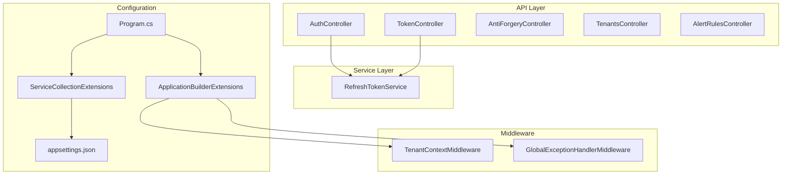

**Diagram sources**
- [AuthController.cs](file://src/api/DigitalTwinPlatform.API/Controllers/AuthController.cs#L1-L854)
- [TokenController.cs](file://src/api/DigitalTwinPlatform.API/Controllers/TokenController.cs#L1-L57)
- [AntiForgeryController.cs](file://src/api/DigitalTwinPlatform.API/Controllers/AntiForgeryController.cs#L1-L60)
- [TenantsController.cs](file://src/api/DigitalTwinPlatform.API/Controllers/TenantsController.cs#L1-L260)
- [AlertRulesController.cs](file://src/api/DigitalTwinPlatform.API/Controllers/AlertRulesController.cs#L1-L284)
- [RefreshTokenService.cs](file://src/api/DigitalTwinPlatform.API/Services/Auth/RefreshTokenService.cs#L1-L150)
- [TenantContextMiddleware.cs](file://src/api/DigitalTwinPlatform.API/Middleware/TenantContextMiddleware.cs#L1-L18)
- [GlobalExceptionHandlerMiddleware.cs](file://src/api/DigitalTwinPlatform.API/Middleware/GlobalExceptionHandlerMiddleware.cs#L1-L257)
- [Program.cs](file://src/api/DigitalTwinPlatform.API/Program.cs#L1-L87)
- [ApplicationBuilderExtensions.cs](file://src/api/DigitalTwinPlatform.API/Extensions/ApplicationBuilderExtensions.cs#L1-L89)
- [ServiceCollectionExtensions.cs](file://src/api/DigitalTwinPlatform.API/Extensions/ServiceCollectionExtensions.cs#L1-L423)
- [appsettings.json](file://src/api/DigitalTwinPlatform.API/appsettings.json#L1-L93)

**Section sources**
- [Program.cs](file://src/api/DigitalTwinPlatform.API/Program.cs#L1-L87)
- [ApplicationBuilderExtensions.cs](file://src/api/DigitalTwinPlatform.API/Extensions/ApplicationBuilderExtensions.cs#L1-L89)
- [ServiceCollectionExtensions.cs](file://src/api/DigitalTwinPlatform.API/Extensions/ServiceCollectionExtensions.cs#L1-L423)

## Core Components
- Authentication Controller: Manages user registration, login, profile updates, password changes, two-factor authentication, and logout.
- Token Controller: Provides token refresh and revoke endpoints.
- Anti-Forgery Controller: Supplies CSRF tokens and validates them for SPA applications.
- Tenants Controller: Implements multi-tenant management including tenant CRUD, activation/deactivation, user assignment, role updates, and tenant settings.
- Alert Rules Controller: Manages alert threshold rules and notification configurations with authorization applied.
- Refresh Token Service: Generates JWT access tokens, refresh tokens, and handles refresh/revoke operations.
- Tenant Context Middleware: Sets tenant context via request headers for multi-tenancy.
- Global Exception Handler: Centralized error handling with structured logging and standardized error responses.
- Security Extensions: Configure JWT authentication, Antiforgery, CORS, SignalR, and Swagger.

**Section sources**
- [AuthController.cs](file://src/api/DigitalTwinPlatform.API/Controllers/AuthController.cs#L1-L854)
- [TokenController.cs](file://src/api/DigitalTwinPlatform.API/Controllers/TokenController.cs#L1-L57)
- [AntiForgeryController.cs](file://src/api/DigitalTwinPlatform.API/Controllers/AntiForgeryController.cs#L1-L60)
- [TenantsController.cs](file://src/api/DigitalTwinPlatform.API/Controllers/TenantsController.cs#L1-L260)
- [AlertRulesController.cs](file://src/api/DigitalTwinPlatform.API/Controllers/AlertRulesController.cs#L1-L284)
- [RefreshTokenService.cs](file://src/api/DigitalTwinPlatform.API/Services/Auth/RefreshTokenService.cs#L1-L150)
- [TenantContextMiddleware.cs](file://src/api/DigitalTwinPlatform.API/Middleware/TenantContextMiddleware.cs#L1-L18)
- [GlobalExceptionHandlerMiddleware.cs](file://src/api/DigitalTwinPlatform.API/Middleware/GlobalExceptionHandlerMiddleware.cs#L1-L257)
- [ServiceCollectionExtensions.cs](file://src/api/DigitalTwinPlatform.API/Extensions/ServiceCollectionExtensions.cs#L44-L73)

## Architecture Overview
The authentication and security architecture integrates ASP.NET Core Identity for user management, JWT Bearer tokens for stateless authentication, Antiforgery for CSRF protection, and middleware for tenant isolation and global error handling. CORS is configured centrally, and Swagger documentation includes JWT Bearer authentication.

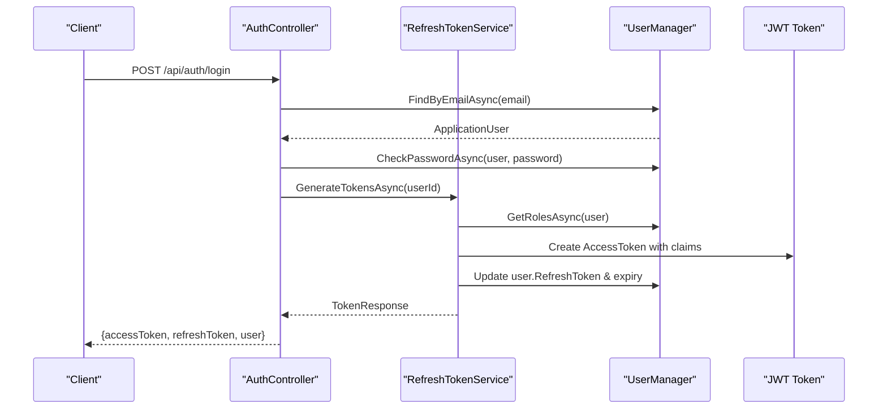

**Diagram sources**
- [AuthController.cs](file://src/api/DigitalTwinPlatform.API/Controllers/AuthController.cs#L120-L156)
- [RefreshTokenService.cs](file://src/api/DigitalTwinPlatform.API/Services/Auth/RefreshTokenService.cs#L15-L85)
- [ServiceCollectionExtensions.cs](file://src/api/DigitalTwinPlatform.API/Extensions/ServiceCollectionExtensions.cs#L377-L401)

**Section sources**
- [AuthController.cs](file://src/api/DigitalTwinPlatform.API/Controllers/AuthController.cs#L114-L156)
- [RefreshTokenService.cs](file://src/api/DigitalTwinPlatform.API/Services/Auth/RefreshTokenService.cs#L15-L85)
- [ServiceCollectionExtensions.cs](file://src/api/DigitalTwinPlatform.API/Extensions/ServiceCollectionExtensions.cs#L377-L401)

## Detailed Component Analysis

### Authentication Controller
The authentication controller provides comprehensive user lifecycle management:
- Registration: Validates password confirmation and terms acceptance, creates users with Identity.
- Login: Authenticates users and generates JWT access and refresh tokens via RefreshTokenService.
- Token Refresh: Validates refresh tokens and issues new access tokens.
- Token Revoke: Revokes refresh tokens for logout or security events.
- Profile Management: Retrieves and updates current user profile.
- Password Management: Supports forgot/reset/change password flows.
- Two-Factor Authentication: Enables/disables TOTP-based 2FA with QR code generation.

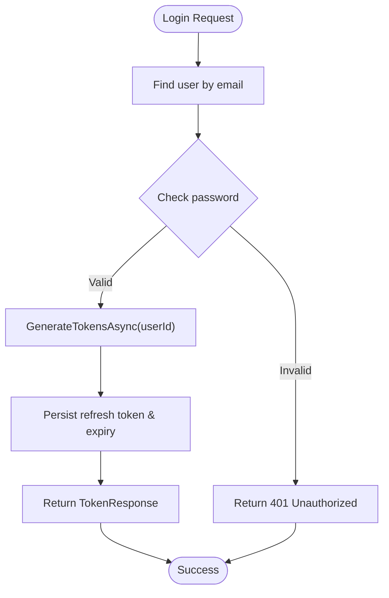

**Diagram sources**
- [AuthController.cs](file://src/api/DigitalTwinPlatform.API/Controllers/AuthController.cs#L120-L156)
- [RefreshTokenService.cs](file://src/api/DigitalTwinPlatform.API/Services/Auth/RefreshTokenService.cs#L15-L85)

**Section sources**
- [AuthController.cs](file://src/api/DigitalTwinPlatform.API/Controllers/AuthController.cs#L46-L422)
- [RefreshTokenService.cs](file://src/api/DigitalTwinPlatform.API/Services/Auth/RefreshTokenService.cs#L15-L125)

### Token Controller
Provides dedicated endpoints for token refresh and revoke:
- Refresh Token: Validates refresh token and returns new access/refresh tokens.
- Revoke Token: Revokes refresh tokens (placeholder implementation).

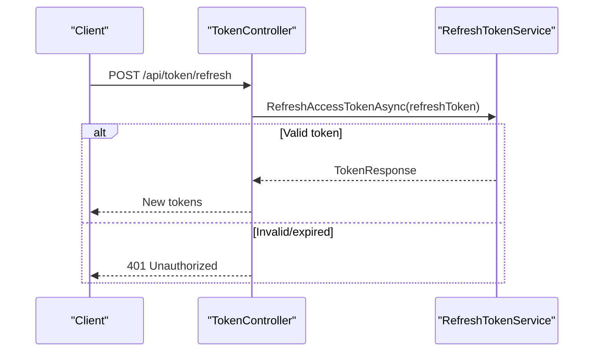

**Diagram sources**
- [TokenController.cs](file://src/api/DigitalTwinPlatform.API/Controllers/TokenController.cs#L20-L35)
- [RefreshTokenService.cs](file://src/api/DigitalTwinPlatform.API/Services/Auth/RefreshTokenService.cs#L87-L99)

**Section sources**
- [TokenController.cs](file://src/api/DigitalTwinPlatform.API/Controllers/TokenController.cs#L16-L51)
- [RefreshTokenService.cs](file://src/api/DigitalTwinPlatform.API/Services/Auth/RefreshTokenService.cs#L87-L125)

### Anti-Forgery Protection
Anti-forgery tokens are configured and exposed via a dedicated controller:
- Backend configuration sets header/form field names and cookie policy.
- Token endpoint returns header name, request token, and form field name.
- Validation endpoint tests token validity.

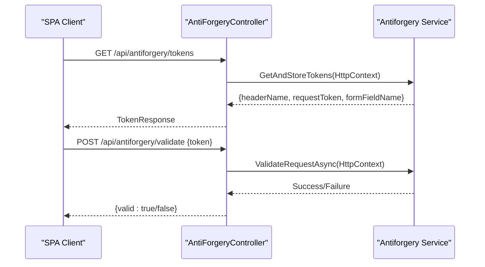

**Diagram sources**
- [AntiForgeryController.cs](file://src/api/DigitalTwinPlatform.API/Controllers/AntiForgeryController.cs#L16-L47)
- [ServiceCollectionExtensions.cs](file://src/api/DigitalTwinPlatform.API/Extensions/ServiceCollectionExtensions.cs#L62-L71)
- [CSRF-Protection.md](file://src/api/DigitalTwinPlatform.API/Documentation/CSRF-Protection.md#L1-L53)

**Section sources**
- [AntiForgeryController.cs](file://src/api/DigitalTwinPlatform.API/Controllers/AntiForgeryController.cs#L14-L47)
- [ServiceCollectionExtensions.cs](file://src/api/DigitalTwinPlatform.API/Extensions/ServiceCollectionExtensions.cs#L62-L71)
- [CSRF-Protection.md](file://src/api/DigitalTwinPlatform.API/Documentation/CSRF-Protection.md#L1-L53)

### Tenant Management
The tenants controller supports multi-tenant operations:
- Tenant CRUD: Get all/active/by-id/by-slug, create, update, delete.
- Activation: Activate/deactivate tenants.
- Tenant Users: List/add/remove users; update user roles.
- Tenant Settings: List/create/update/delete settings and fetch by key.

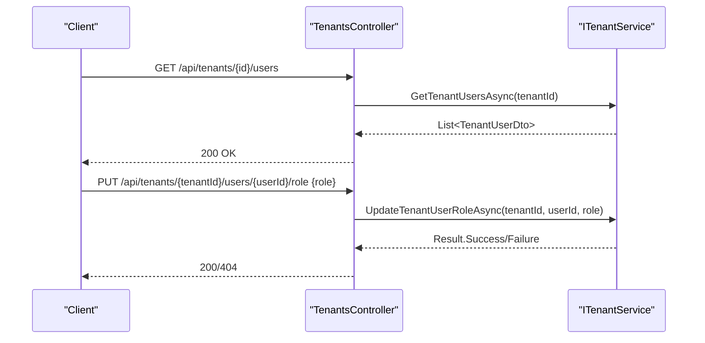

**Diagram sources**
- [TenantsController.cs](file://src/api/DigitalTwinPlatform.API/Controllers/TenantsController.cs#L143-L193)

**Section sources**
- [TenantsController.cs](file://src/api/DigitalTwinPlatform.API/Controllers/TenantsController.cs#L25-L260)

### Alert Rule Configuration
The alert rules controller manages alert threshold rules and notifications:
- CRUD operations for alert rules with validation.
- Toggle rule enabled status.
- Authorization applied to protect endpoints.

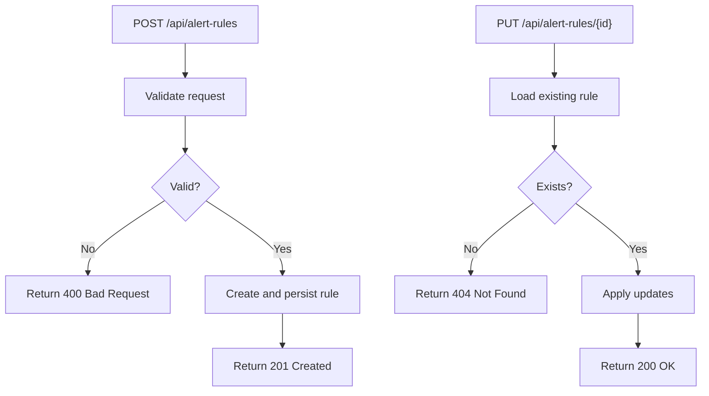

**Diagram sources**
- [AlertRulesController.cs](file://src/api/DigitalTwinPlatform.API/Controllers/AlertRulesController.cs#L71-L153)

**Section sources**
- [AlertRulesController.cs](file://src/api/DigitalTwinPlatform.API/Controllers/AlertRulesController.cs#L22-L204)

### Token Refresh Cycle
The refresh cycle ensures secure and continuous access:
- Access tokens expire after configured duration.
- Refresh tokens are persisted on the user entity with expiry.
- On refresh, the service validates the refresh token and issues new tokens.

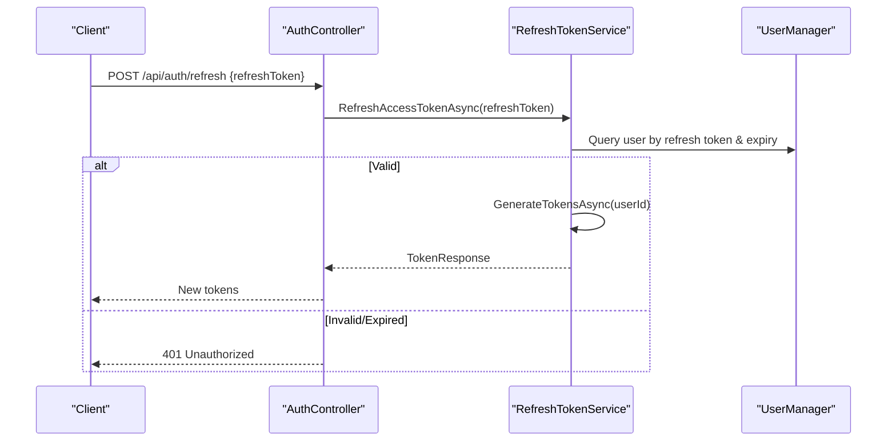

**Diagram sources**
- [AuthController.cs](file://src/api/DigitalTwinPlatform.API/Controllers/AuthController.cs#L176-L196)
- [RefreshTokenService.cs](file://src/api/DigitalTwinPlatform.API/Services/Auth/RefreshTokenService.cs#L87-L125)

**Section sources**
- [AuthController.cs](file://src/api/DigitalTwinPlatform.API/Controllers/AuthController.cs#L171-L215)
- [RefreshTokenService.cs](file://src/api/DigitalTwinPlatform.API/Services/Auth/RefreshTokenService.cs#L87-L125)

### Multi-Tenancy and Tenant Isolation
Multi-tenancy is enforced via middleware and tenant settings:
- TenantContextMiddleware reads X-Tenant-Id header and sets tenant context.
- Tenant settings include activation/deactivation and user-role management.
- JWT roles are included in access tokens for role-based authorization.

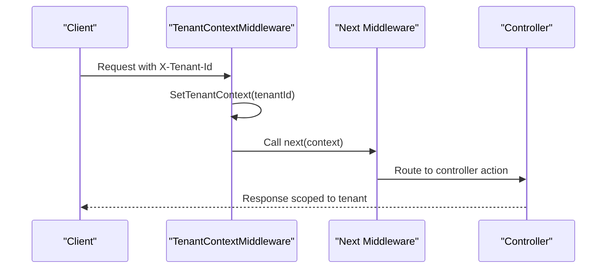

**Diagram sources**
- [TenantContextMiddleware.cs](file://src/api/DigitalTwinPlatform.API/Middleware/TenantContextMiddleware.cs#L7-L16)

**Section sources**
- [TenantContextMiddleware.cs](file://src/api/DigitalTwinPlatform.API/Middleware/TenantContextMiddleware.cs#L1-L18)
- [RefreshTokenService.cs](file://src/api/DigitalTwinPlatform.API/Services/Auth/RefreshTokenService.cs#L24-L36)

### Security Middleware and Policies
Security middleware and policies are configured in the application pipeline:
- Cookie policy: HttpOnly and SameSite=Strict.
- HTTPS redirection in non-development environments.
- Antiforgery middleware for CSRF protection.
- CORS policy configured with allowed origins and credentials.
- Authentication and Authorization middleware.
- Structured logging and metrics.

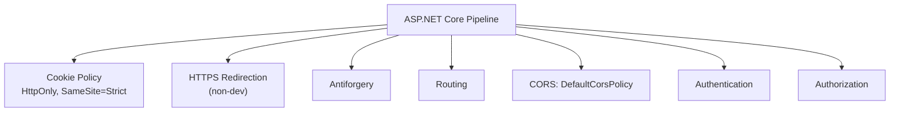

**Diagram sources**
- [ApplicationBuilderExtensions.cs](file://src/api/DigitalTwinPlatform.API/Extensions/ApplicationBuilderExtensions.cs#L15-L47)
- [ServiceCollectionExtensions.cs](file://src/api/DigitalTwinPlatform.API/Extensions/ServiceCollectionExtensions.cs#L78-L101)

**Section sources**
- [ApplicationBuilderExtensions.cs](file://src/api/DigitalTwinPlatform.API/Extensions/ApplicationBuilderExtensions.cs#L15-L47)
- [ServiceCollectionExtensions.cs](file://src/api/DigitalTwinPlatform.API/Extensions/ServiceCollectionExtensions.cs#L78-L101)

### JWT Configuration and Claims
JWT configuration includes symmetric key signing, issuer/audience validation, and claim population:
- Symmetric key validation and minimum length enforcement.
- Token validation parameters for lifetime and signing key.
- Claims include user identity, email, full name, and roles.
- Access token expiry configured via appsettings.

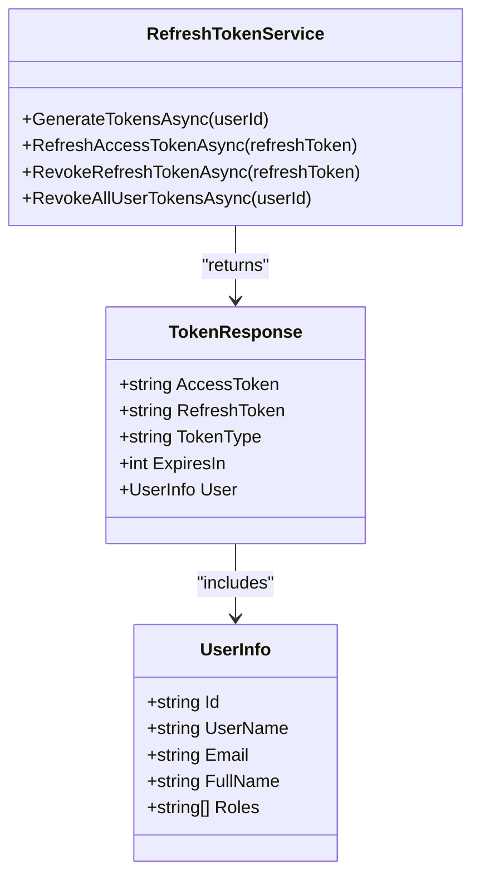

**Diagram sources**
- [RefreshTokenService.cs](file://src/api/DigitalTwinPlatform.API/Services/Auth/RefreshTokenService.cs#L10-L132)
- [RefreshTokenService.cs](file://src/api/DigitalTwinPlatform.API/Services/Auth/RefreshTokenService.cs#L134-L150)

**Section sources**
- [ServiceCollectionExtensions.cs](file://src/api/DigitalTwinPlatform.API/Extensions/ServiceCollectionExtensions.cs#L377-L401)
- [appsettings.json](file://src/api/DigitalTwinPlatform.API/appsettings.json#L64-L69)

### Frontend Security Enhancements
Frontend improvements focus on secure token storage and session management:
- Tokens stored in sessionStorage (cleared on tab close) instead of localStorage.
- Enhanced auth store with automatic initialization and role-based access.
- API configuration security with environment-aware settings and centralized management.

**Section sources**
- [Security-Enhancements.md](file://src/ui/digital-twin-dashboard/docs/Security-Enhancements.md#L1-L106)

## Dependency Analysis
The authentication and security components depend on:
- ASP.NET Core Identity for user management and claims.
- JWT Bearer authentication for token validation.
- Antiforgery for CSRF protection.
- Entity Framework for user persistence and refresh token storage.
- Middleware pipeline for enforcing security policies.

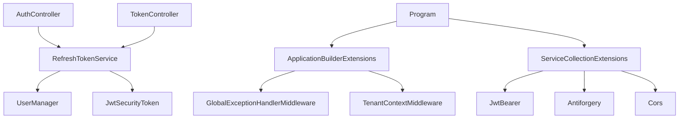

**Diagram sources**
- [AuthController.cs](file://src/api/DigitalTwinPlatform.API/Controllers/AuthController.cs#L23-L27)
- [TokenController.cs](file://src/api/DigitalTwinPlatform.API/Controllers/TokenController.cs#L9)
- [RefreshTokenService.cs](file://src/api/DigitalTwinPlatform.API/Services/Auth/RefreshTokenService.cs#L10-L13)
- [Program.cs](file://src/api/DigitalTwinPlatform.API/Program.cs#L59-L74)
- [ApplicationBuilderExtensions.cs](file://src/api/DigitalTwinPlatform.API/Extensions/ApplicationBuilderExtensions.cs#L15-L47)
- [ServiceCollectionExtensions.cs](file://src/api/DigitalTwinPlatform.API/Extensions/ServiceCollectionExtensions.cs#L44-L101)

**Section sources**
- [AuthController.cs](file://src/api/DigitalTwinPlatform.API/Controllers/AuthController.cs#L1-L854)
- [TokenController.cs](file://src/api/DigitalTwinPlatform.API/Controllers/TokenController.cs#L1-L57)
- [RefreshTokenService.cs](file://src/api/DigitalTwinPlatform.API/Services/Auth/RefreshTokenService.cs#L1-L150)
- [Program.cs](file://src/api/DigitalTwinPlatform.API/Program.cs#L1-L87)
- [ApplicationBuilderExtensions.cs](file://src/api/DigitalTwinPlatform.API/Extensions/ApplicationBuilderExtensions.cs#L1-L89)
- [ServiceCollectionExtensions.cs](file://src/api/DigitalTwinPlatform.API/Extensions/ServiceCollectionExtensions.cs#L1-L423)

## Performance Considerations
- Token generation and refresh operations should be optimized to minimize database round-trips.
- Use efficient claims-based authorization to avoid heavy computation in authorization policies.
- Configure SignalR keep-alive intervals and message sizes appropriately for real-time telemetry.
- Monitor JWT token lifetimes to balance security and performance.

## Troubleshooting Guide
Common issues and resolutions:
- Invalid or expired refresh token: Ensure refresh token is valid and not expired; regenerate tokens on login.
- Unauthorized access: Verify JWT bearer token presence and correctness; check authorization policies.
- CSRF validation failures: Retrieve fresh tokens from the anti-forgery endpoint and include the token in headers.
- Multi-tenancy issues: Confirm X-Tenant-Id header is present and valid; ensure tenant context is set.
- CORS errors: Verify allowed origins and credentials configuration; ensure preflight requests are handled.

**Section sources**
- [AuthController.cs](file://src/api/DigitalTwinPlatform.API/Controllers/AuthController.cs#L176-L196)
- [AntiForgeryController.cs](file://src/api/DigitalTwinPlatform.API/Controllers/AntiForgeryController.cs#L36-L47)
- [TenantContextMiddleware.cs](file://src/api/DigitalTwinPlatform.API/Middleware/TenantContextMiddleware.cs#L9-L13)
- [ServiceCollectionExtensions.cs](file://src/api/DigitalTwinPlatform.API/Extensions/ServiceCollectionExtensions.cs#L78-L101)
- [GlobalExceptionHandlerMiddleware.cs](file://src/api/DigitalTwinPlatform.API/Middleware/GlobalExceptionHandlerMiddleware.cs#L25-L63)

## Conclusion
The Digital Twin Platform API implements robust authentication and security controls through JWT-based stateless authentication, refresh token management, anti-forgery protection, and multi-tenant isolation. The architecture leverages ASP.NET Core Identity, middleware pipelines, and centralized configuration to enforce security policies, provide structured error handling, and support enterprise-grade compliance. Frontend enhancements further strengthen session management and token security. Together, these components deliver a secure, scalable foundation for the platform’s APIs.