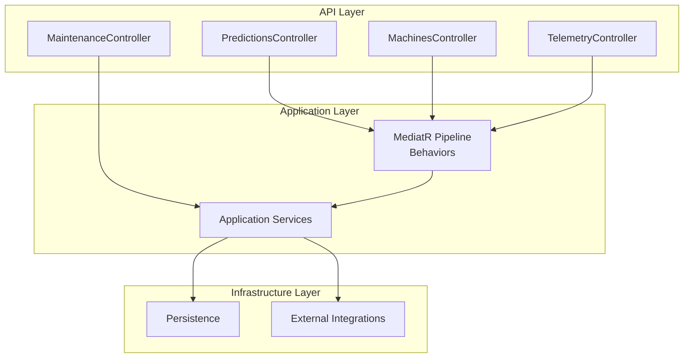
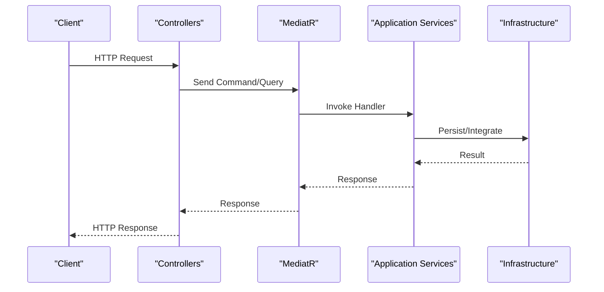
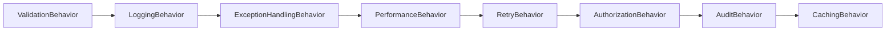
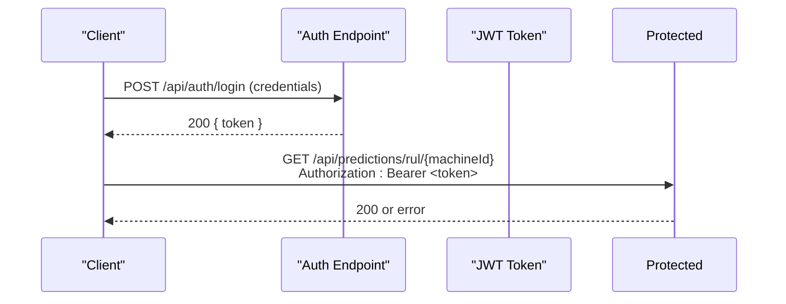

# Backend API Documentation

<cite>
**Referenced Files in This Document**
- [Program.cs](file://src/api/DigitalTwinPlatform.API/Program.cs)
- [appsettings.json](file://src/api/DigitalTwinPlatform.API/appsettings.json)
- [DigitalTwinPlatform.API.csproj](file://src/api/DigitalTwinPlatform.API/DigitalTwinPlatform.API.csproj)
- [ApplicationBuilderExtensions.cs](file://src/api/DigitalTwinPlatform.API/Extensions/ApplicationBuilderExtensions.cs)
- [ServiceCollectionExtensions.cs](file://src/api/DigitalTwinPlatform.API/Extensions/ServiceCollectionExtensions.cs)
- [DependencyInjection.cs](file://src/api/DigitalTwinPlatform.Application/DependencyInjection.cs)
- [openapi.yaml](file://specs/1-predictive-maintenance/contracts/openapi.yaml)
- [PredictionsController.cs](file://src/api/DigitalTwinPlatform.API/Controllers/PredictionsController.cs)
- [MachinesController.cs](file://src/api/DigitalTwinPlatform.API/Controllers/MachinesController.cs)
- [TelemetryController.cs](file://src/api/DigitalTwinPlatform.API/Controllers/TelemetryController.cs)
- [MaintenanceController.cs](file://src/api/DigitalTwinPlatform.API/Controllers/MaintenanceController.cs)
</cite>

## Table of Contents
1. [Introduction](#introduction)
2. [Project Structure](#project-structure)
3. [Core Components](#core-components)
4. [Architecture Overview](#architecture-overview)
5. [Detailed Component Analysis](#detailed-component-analysis)
6. [Dependency Analysis](#dependency-analysis)
7. [Performance Considerations](#performance-considerations)
8. [Troubleshooting Guide](#troubleshooting-guide)
9. [Conclusion](#conclusion)
10. [Appendices](#appendices)

## Introduction
This document provides comprehensive API documentation for the Digital Twin Platform REST API. It covers HTTP methods, URL patterns, request/response schemas, authentication, and operational characteristics across major API groups: Predictions, Machines, Telemetry, Maintenance, Analytics, and Mathematical Modeling. It also documents CQRS and Mediator usage, validation, error handling, rate limiting, versioning, and performance considerations. Swagger/OpenAPI references and client implementation guidelines are included.

## Project Structure
The API is implemented as an ASP.NET Core web application with layered architecture:
- API layer: Controllers expose REST endpoints and map to application services.
- Application layer: Implements CQRS with MediatR, behaviors, and domain services.
- Infrastructure layer: Persistence, integrations, and cross-cutting concerns.
- Configuration: Program.cs bootstraps services, middleware, Swagger, and versioning.
- OpenAPI specification: Defines endpoint contracts and schemas.

**Diagram sources**
- [Program.cs](file://src/api/DigitalTwinPlatform.API/Program.cs#L11-L87)
- [DependencyInjection.cs](file://src/api/DigitalTwinPlatform.Application/DependencyInjection.cs#L15-L57)
- [PredictionsController.cs](file://src/api/DigitalTwinPlatform.API/Controllers/PredictionsController.cs#L17-L31)
- [MachinesController.cs](file://src/api/DigitalTwinPlatform.API/Controllers/MachinesController.cs#L15-L20)
- [TelemetryController.cs](file://src/api/DigitalTwinPlatform.API/Controllers/TelemetryController.cs#L15-L20)
- [MaintenanceController.cs](file://src/api/DigitalTwinPlatform.API/Controllers/MaintenanceController.cs#L10-L13)

**Section sources**
- [Program.cs](file://src/api/DigitalTwinPlatform.API/Program.cs#L11-L87)
- [DigitalTwinPlatform.API.csproj](file://src/api/DigitalTwinPlatform.API/DigitalTwinPlatform.API.csproj#L1-L54)

## Core Components
- Authentication and Authorization
  - JWT Bearer tokens required for protected endpoints (except health/auth).
  - Identity and cookie policy configured for CSRF protection.
- API Versioning
  - ASP.NET API versioning enabled with default version 1.0.
- Swagger/OpenAPI
  - Swagger UI exposed with JWT Bearer security scheme.
- CQRS and Mediator
  - MediatR pipeline with behaviors: validation, logging, exception handling, performance, retry, authorization, audit, caching.
- Real-time Streaming
  - SignalR hubs for telemetry and real-time analytics.

**Section sources**
- [ServiceCollectionExtensions.cs](file://src/api/DigitalTwinPlatform.API/Extensions/ServiceCollectionExtensions.cs#L43-L72)
- [ServiceCollectionExtensions.cs](file://src/api/DigitalTwinPlatform.API/Extensions/ServiceCollectionExtensions.cs#L136-L146)
- [ApplicationBuilderExtensions.cs](file://src/api/DigitalTwinPlatform.API/Extensions/ApplicationBuilderExtensions.cs#L79-L89)
- [DependencyInjection.cs](file://src/api/DigitalTwinPlatform.Application/DependencyInjection.cs#L20-L36)
- [Program.cs](file://src/api/DigitalTwinPlatform.API/Program.cs#L14-L26)

## Architecture Overview
The API follows a clean architecture with separation of concerns:
- Controllers orchestrate requests and delegate to application services or MediatR handlers.
- Application services encapsulate business logic and coordinate domain entities.
- Infrastructure handles persistence and external integrations.
- Middleware ensures security, logging, metrics, and error handling.

**Diagram sources**
- [PredictionsController.cs](file://src/api/DigitalTwinPlatform.API/Controllers/PredictionsController.cs#L22-L30)
- [MachinesController.cs](file://src/api/DigitalTwinPlatform.API/Controllers/MachinesController.cs#L20-L21)
- [TelemetryController.cs](file://src/api/DigitalTwinPlatform.API/Controllers/TelemetryController.cs#L20-L21)
- [DependencyInjection.cs](file://src/api/DigitalTwinPlatform.Application/DependencyInjection.cs#L20-L36)

## Detailed Component Analysis

### Predictions API
- Purpose: Remaining Useful Life (RUL) predictions, health classification, anomaly detection, model training, and search.
- Authentication: Required.
- Versioning: v1.
- Endpoints:
  - POST /api/predictions/rul/{machineId}
    - Description: Compute detailed RUL prediction for a machine.
    - Auth: Required.
    - Responses: 200 (RulPredictionResult), 400 (validation), 404 (not found), 500 (server error).
  - GET /api/predictions/health/{machineId}
    - Description: Health classification with probability and contributions.
    - Auth: Required.
    - Responses: 200 (HealthClassificationResult), 400 (validation), 404 (not found), 500 (server error).
  - GET /api/predictions/rul/{machineId}/summary
    - Description: Lightweight RUL summary combining RUL and health status.
    - Responses: 200 (object), 400 (validation), 404 (not found).
  - POST /api/predictions/train
    - Description: Trigger model retraining for RUL and health models.
    - Responses: 200 (TrainingResultDto), 400 (validation), 500 (server error).
  - POST /api/predictions/ai/train
    - Description: Backward-compatible alias for training.
    - Responses: 200 (TrainingResultDto), 400 (validation), 500 (server error).
  - GET /api/predictions/status
    - Description: Model status and metadata.
    - Responses: 200 (ModelStatusDto).
  - POST /api/predictions
    - Description: Manual prediction request.
    - Responses: 200 (PredictionDto), 400 (validation), 401 (unauthorized), 500 (server error).
  - GET /api/predictions
    - Description: List predictions; optional machineId filter and limit.
    - Responses: 200 (IEnumerable<PredictionDto>), 401 (unauthorized), 500 (server error).
  - GET /api/predictions/search
    - Description: Text search across predictions.
    - Responses: 200 (IEnumerable<RulPredictionResult>), 401 (unauthorized), 500 (server error).
  - GET /api/predictions/anomaly/{machineId}
    - Description: Anomaly detection result.
    - Responses: 200 (AnomalyDetectionResult), 400 (validation), 404 (not found), 500 (server error).

- Request/Response Schemas
  - RulPredictionResult, HealthClassificationResult, TrainingResultDto, ModelStatusDto, PredictionDto, PredictionRequestDto, AnomalyDetectionResult.
  - Refer to OpenAPI components for detailed field definitions.

- Validation and Error Handling
  - ValidationBehavior via FluentValidation.
  - ExceptionHandlingBehavior centralizes error responses.
  - Insufficient telemetry data triggers 400 responses.

- Practical Examples
  - Obtain JWT via authentication endpoint, then call prediction endpoints with Authorization: Bearer <token>.
  - Use GET /api/predictions/rul/{machineId}/summary for lightweight dashboards.

**Section sources**
- [PredictionsController.cs](file://src/api/DigitalTwinPlatform.API/Controllers/PredictionsController.cs#L17-L31)
- [PredictionsController.cs](file://src/api/DigitalTwinPlatform.API/Controllers/PredictionsController.cs#L39-L75)
- [PredictionsController.cs](file://src/api/DigitalTwinPlatform.API/Controllers/PredictionsController.cs#L84-L120)
- [PredictionsController.cs](file://src/api/DigitalTwinPlatform.API/Controllers/PredictionsController.cs#L125-L151)
- [PredictionsController.cs](file://src/api/DigitalTwinPlatform.API/Controllers/PredictionsController.cs#L156-L206)
- [PredictionsController.cs](file://src/api/DigitalTwinPlatform.API/Controllers/PredictionsController.cs#L208-L223)
- [PredictionsController.cs](file://src/api/DigitalTwinPlatform.API/Controllers/PredictionsController.cs#L227-L235)
- [PredictionsController.cs](file://src/api/DigitalTwinPlatform.API/Controllers/PredictionsController.cs#L249-L280)
- [PredictionsController.cs](file://src/api/DigitalTwinPlatform.API/Controllers/PredictionsController.cs#L288-L324)
- [PredictionsController.cs](file://src/api/DigitalTwinPlatform.API/Controllers/PredictionsController.cs#L332-L359)
- [PredictionsController.cs](file://src/api/DigitalTwinPlatform.API/Controllers/PredictionsController.cs#L367-L408)
- [PredictionsController.cs](file://src/api/DigitalTwinPlatform.API/Controllers/PredictionsController.cs#L413-L433)
- [openapi.yaml](file://specs/1-predictive-maintenance/contracts/openapi.yaml#L218-L240)
- [openapi.yaml](file://specs/1-predictive-maintenance/contracts/openapi.yaml#L668-L712)

### Machines API
- Purpose: CRUD operations for machines.
- Authentication: Required.
- Versioning: v1.
- Endpoints:
  - GET /api/machines
    - Description: List all machines with pagination and filters.
    - Responses: 200 (IEnumerable<MachineDto>), 401 (unauthorized), 500 (server error).
  - GET /api/machines/{id}
    - Description: Retrieve a specific machine.
    - Responses: 200 (MachineDto), 401 (unauthorized), 404 (not found), 500 (server error).
  - POST /api/machines
    - Description: Create a new machine.
    - Responses: 201 (MachineDto), 400 (validation), 401 (unauthorized), 500 (server error).
  - PUT /api/machines/{id}
    - Description: Update an existing machine.
    - Responses: 200 (MachineDto), 400 (validation), 401 (unauthorized), 404 (not found), 500 (server error).
  - DELETE /api/machines/{id}
    - Description: Delete a machine.
    - Responses: 204 (no content), 401 (unauthorized), 404 (not found), 500 (server error).

- Request/Response Schemas
  - MachineDto, MachineCreateDto, MachineUpdateDto.

- Validation and Error Handling
  - ValidationBehavior via FluentValidation.
  - ExceptionHandlingBehavior centralizes error responses.

- Practical Examples
  - Use POST /api/machines to onboard new equipment.
  - Filter GET /api/machines by location/type/status.

**Section sources**
- [MachinesController.cs](file://src/api/DigitalTwinPlatform.API/Controllers/MachinesController.cs#L15-L20)
- [MachinesController.cs](file://src/api/DigitalTwinPlatform.API/Controllers/MachinesController.cs#L30-L35)
- [MachinesController.cs](file://src/api/DigitalTwinPlatform.API/Controllers/MachinesController.cs#L47-L53)
- [MachinesController.cs](file://src/api/DigitalTwinPlatform.API/Controllers/MachinesController.cs#L73-L83)
- [MachinesController.cs](file://src/api/DigitalTwinPlatform.API/Controllers/MachinesController.cs#L108-L116)
- [MachinesController.cs](file://src/api/DigitalTwinPlatform.API/Controllers/MachinesController.cs#L128-L137)
- [openapi.yaml](file://specs/1-predictive-maintenance/contracts/openapi.yaml#L20-L90)
- [openapi.yaml](file://specs/1-predictive-maintenance/contracts/openapi.yaml#L533-L566)

### Telemetry API
- Purpose: Ingest and retrieve machine telemetry data for predictive maintenance.
- Authentication: Required.
- Versioning: v1.
- Endpoints:
  - POST /api/telemetry
    - Description: Ingest telemetry data.
    - Responses: 202 (accepted), 400 (validation), 401 (unauthorized), 500 (server error).
  - GET /api/telemetry/{machineId}
    - Description: Retrieve telemetry for a machine within a time range.
    - Responses: 200 (IEnumerable<TelemetryDto>), 401 (unauthorized), 404 (not found), 500 (server error).
  - GET /api/telemetry/recent
    - Description: Retrieve most recent telemetry across machines or filtered by machine.
    - Responses: 200 (IEnumerable<TelemetryDto>), 401 (unauthorized), 500 (server error).
  - GET /api/telemetry/{machineId}/latest
    - Description: Get the latest telemetry reading for a machine.
    - Responses: 200 (TelemetryDto), 401 (unauthorized), 404 (not found), 500 (server error).
  - GET /api/telemetry/{machineId}/latest/metrics
    - Description: Get flattened latest metrics for a machine.
    - Responses: 200 (TelemetryMetricsDto), 401 (unauthorized), 404 (not found), 500 (server error).
  - GET /api/telemetry/search
    - Description: Search telemetry data by text query.
    - Responses: 200 (IEnumerable<TelemetryDto>), 401 (unauthorized), 500 (server error).

- Request/Response Schemas
  - TelemetryIngestDto, TelemetryDto, TelemetryMetricsDto.

- Validation and Error Handling
  - ValidationBehavior via FluentValidation.
  - ExceptionHandlingBehavior centralizes error responses.

- Practical Examples
  - POST /api/telemetry to stream sensor readings.
  - Use GET /api/telemetry/recent with range=24h for dashboard summaries.

**Section sources**
- [TelemetryController.cs](file://src/api/DigitalTwinPlatform.API/Controllers/TelemetryController.cs#L15-L20)
- [TelemetryController.cs](file://src/api/DigitalTwinPlatform.API/Controllers/TelemetryController.cs#L46-L56)
- [TelemetryController.cs](file://src/api/DigitalTwinPlatform.API/Controllers/TelemetryController.cs#L87-L97)
- [TelemetryController.cs](file://src/api/DigitalTwinPlatform.API/Controllers/TelemetryController.cs#L110-L119)
- [TelemetryController.cs](file://src/api/DigitalTwinPlatform.API/Controllers/TelemetryController.cs#L132-L145)
- [TelemetryController.cs](file://src/api/DigitalTwinPlatform.API/Controllers/TelemetryController.cs#L158-L176)
- [TelemetryController.cs](file://src/api/DigitalTwinPlatform.API/Controllers/TelemetryController.cs#L188-L200)
- [openapi.yaml](file://specs/1-predictive-maintenance/contracts/openapi.yaml#L168-L217)
- [openapi.yaml](file://specs/1-predictive-maintenance/contracts/openapi.yaml#L619-L646)

### Maintenance API
- Purpose: Plan, track, and manage maintenance activities.
- Authentication: Required.
- Endpoints:
  - POST /api/maintenance/plan
    - Description: Plan a maintenance activity.
    - Responses: 200 (MaintenanceRecord), 400 (validation), 500 (server error).
  - POST /api/maintenance/{id}/start
    - Description: Start maintenance.
    - Responses: 200 (MaintenanceRecord), 400 (validation), 500 (server error).
  - POST /api/maintenance/{id}/complete
    - Description: Complete maintenance with technician and notes.
    - Responses: 200 (MaintenanceRecord), 400 (validation), 500 (server error).
  - POST /api/maintenance/{id}/cancel
    - Description: Cancel maintenance with reason.
    - Responses: 200 (MaintenanceRecord), 400 (validation), 500 (server error).
  - GET /api/maintenance/machine/{machineId}
    - Description: Get maintenance history for a machine.
    - Responses: 200 (IEnumerable<MaintenanceRecord>), 500 (server error).
  - GET /api/maintenance/active
    - Description: Get currently active maintenance records.
    - Responses: 200 (IEnumerable<MaintenanceRecord>), 500 (server error).
  - GET /api/maintenance/search
    - Description: Search maintenance records by query, status, and machineId.
    - Responses: 200 (IEnumerable<MaintenanceRecord>), 500 (server error).

- Request/Response Schemas
  - PlanMaintenanceRequest, CompleteMaintenanceRequest, MaintenanceRecord.

- Practical Examples
  - Use POST /api/maintenance/plan to schedule preventive maintenance.
  - Track progress via start/complete/cancel endpoints.

**Section sources**
- [MaintenanceController.cs](file://src/api/DigitalTwinPlatform.API/Controllers/MaintenanceController.cs#L10-L13)
- [MaintenanceController.cs](file://src/api/DigitalTwinPlatform.API/Controllers/MaintenanceController.cs#L15-L25)
- [MaintenanceController.cs](file://src/api/DigitalTwinPlatform.API/Controllers/MaintenanceController.cs#L27-L39)
- [MaintenanceController.cs](file://src/api/DigitalTwinPlatform.API/Controllers/MaintenanceController.cs#L41-L46)
- [MaintenanceController.cs](file://src/api/DigitalTwinPlatform.API/Controllers/MaintenanceController.cs#L48-L53)
- [MaintenanceController.cs](file://src/api/DigitalTwinPlatform.API/Controllers/MaintenanceController.cs#L55-L60)
- [MaintenanceController.cs](file://src/api/DigitalTwinPlatform.API/Controllers/MaintenanceController.cs#L62-L71)

### Analytics API
- Purpose: Advanced analytics, drift detection, benchmark validation, and reporting.
- Authentication: Required.
- Endpoints:
  - GET /api/analytics/drift
    - Description: Detect data drift across telemetry streams.
    - Responses: 200 (drift report), 400 (validation), 401 (unauthorized), 500 (server error).
  - POST /api/analytics/benchmark/validate
    - Description: Validate synthetic data against benchmark datasets.
    - Responses: 200 (validation report), 400 (validation), 401 (unauthorized), 500 (server error).
  - GET /api/analytics/reports
    - Description: Generate analytics reports.
    - Responses: 200 (report data), 401 (unauthorized), 500 (server error).

- Request/Response Schemas
  - Drift detection DTOs, benchmark validation DTOs, report DTOs.

- Practical Examples
  - POST /api/analytics/benchmark/validate after generating synthetic data.
  - Monitor drift via GET /api/analytics/drift for model reliability.

**Section sources**
- [ServiceCollectionExtensions.cs](file://src/api/DigitalTwinPlatform.API/Extensions/ServiceCollectionExtensions.cs#L276-L278)
- [ServiceCollectionExtensions.cs](file://src/api/DigitalTwinPlatform.API/Extensions/ServiceCollectionExtensions.cs#L277-L278)
- [openapi.yaml](file://specs/1-predictive-maintenance/contracts/openapi.yaml#L335-L358)

### Mathematical Modeling API
- Purpose: Configure degradation models, simulate degradation, and fetch default parameters.
- Authentication: Required.
- Endpoints:
  - POST /api/mathematical-modeling/configure
    - Description: Configure degradation model for a machine type.
    - Responses: 200 (DegradationModel), 400 (validation), 401 (unauthorized), 500 (server error).
  - POST /api/mathematical-modeling/simulate
    - Description: Run degradation simulation.
    - Responses: 200 (SimulationResult), 400 (validation), 401 (unauthorized), 500 (server error).
  - GET /api/mathematical-modeling/parameters/{machineType}
    - Description: Retrieve default model parameters for a machine type.
    - Responses: 200 (DefaultModelParameters), 404 (not found), 401 (unauthorized), 500 (server error).

- Request/Response Schemas
  - ConfigureDegradationModelRequest, SimulationRequest, SimulationResult, DefaultModelParameters.

- Practical Examples
  - Use GET /api/mathematical-modeling/parameters/{machineType} to bootstrap configurations.
  - POST /api/mathematical-modeling/simulate to evaluate maintenance strategies.

**Section sources**
- [openapi.yaml](file://specs/1-predictive-maintenance/contracts/openapi.yaml#L383-L406)
- [openapi.yaml](file://specs/1-predictive-maintenance/contracts/openapi.yaml#L407-L429)
- [openapi.yaml](file://specs/1-predictive-maintenance/contracts/openapi.yaml#L431-L453)

## Dependency Analysis
- MediatR Pipeline
  - ValidationBehavior validates incoming requests.
  - LoggingBehavior logs handler execution.
  - ExceptionHandlingBehavior standardizes error responses.
  - PerformanceBehavior measures handler latency.
  - RetryBehavior retries transient failures.
  - AuthorizationBehavior enforces policies.
  - AuditBehavior tracks changes.
  - CachingBehavior caches repeated queries.

**Diagram sources**
- [DependencyInjection.cs](file://src/api/DigitalTwinPlatform.Application/DependencyInjection.cs#L24-L35)

**Section sources**
- [DependencyInjection.cs](file://src/api/DigitalTwinPlatform.Application/DependencyInjection.cs#L15-L57)

## Performance Considerations
- Latency Thresholds
  - DigitalTwinUpdate: 500 ms
  - PredictionGeneration: 1000 ms
  - SimulationStep: 500 ms
- Caching
  - Prediction cache enabled with TTL 300 seconds.
- Serialization
  - CamelCase JSON serialization and null-ignoring options configured.
- SignalR
  - KeepAliveInterval, HandshakeTimeout, MaximumReceiveMessageSize configured for real-time streaming.
- Observability
  - Structured logging, health checks, and metrics configured.

**Section sources**
- [appsettings.json](file://src/api/DigitalTwinPlatform.API/appsettings.json#L74-L79)
- [appsettings.json](file://src/api/DigitalTwinPlatform.API/appsettings.json#L58-L63)
- [Program.cs](file://src/api/DigitalTwinPlatform.API/Program.cs#L15-L21)
- [ServiceCollectionExtensions.cs](file://src/api/DigitalTwinPlatform.API/Extensions/ServiceCollectionExtensions.cs#L105-L131)
- [ApplicationBuilderExtensions.cs](file://src/api/DigitalTwinPlatform.API/Extensions/ApplicationBuilderExtensions.cs#L25-L28)

## Troubleshooting Guide
- Authentication Failures
  - Ensure Authorization: Bearer <token> header is present for protected endpoints.
  - Verify JWT issuer, audience, and signing key configuration.
- Validation Errors
  - FluentValidation errors return 400 with structured messages.
- Rate Limiting
  - Not explicitly configured in the provided code; consider implementing middleware or using platform features.
- Error Responses
  - Centralized via ExceptionHandlingBehavior; responses include a generic message and status code.
- Health Checks
  - Accessible via mapped health endpoints for system readiness verification.

**Section sources**
- [ServiceCollectionExtensions.cs](file://src/api/DigitalTwinPlatform.API/Extensions/ServiceCollectionExtensions.cs#L372-L396)
- [DependencyInjection.cs](file://src/api/DigitalTwinPlatform.Application/DependencyInjection.cs#L27-L28)

## Conclusion
The Digital Twin Platform API provides a robust, versioned, and documented REST interface for machine lifecycle, telemetry, predictions, maintenance, analytics, and mathematical modeling. It leverages CQRS with MediatR, comprehensive validation, centralized error handling, and real-time streaming. Clients should integrate JWT authentication, adhere to versioned endpoints, and utilize Swagger/OpenAPI for discovery and testing.

## Appendices

### Authentication Flow

[No sources needed since this diagram shows conceptual workflow, not actual code structure]

### API Catalog Summary
- Predictions: RUL, health classification, anomaly detection, training, search.
- Machines: CRUD operations with filters.
- Telemetry: Ingest, retrieve, recent, latest, metrics, search.
- Maintenance: Plan, start, complete, cancel, history, active, search.
- Analytics: Drift detection, benchmark validation, reporting.
- Mathematical Modeling: Configure, simulate, default parameters.

**Section sources**
- [PredictionsController.cs](file://src/api/DigitalTwinPlatform.API/Controllers/PredictionsController.cs#L39-L433)
- [MachinesController.cs](file://src/api/DigitalTwinPlatform.API/Controllers/MachinesController.cs#L30-L137)
- [TelemetryController.cs](file://src/api/DigitalTwinPlatform.API/Controllers/TelemetryController.cs#L46-L200)
- [MaintenanceController.cs](file://src/api/DigitalTwinPlatform.API/Controllers/MaintenanceController.cs#L15-L71)
- [openapi.yaml](file://specs/1-predictive-maintenance/contracts/openapi.yaml#L19-L1189)

### Swagger/OpenAPI References
- Swagger UI endpoint: /swagger
- Document info: title, description, version, contact, license
- Security scheme: Bearer JWT
- Base URL guidance and authentication note included in Swagger doc configuration.

**Section sources**
- [ApplicationBuilderExtensions.cs](file://src/api/DigitalTwinPlatform.API/Extensions/ApplicationBuilderExtensions.cs#L79-L89)
- [ServiceCollectionExtensions.cs](file://src/api/DigitalTwinPlatform.API/Extensions/ServiceCollectionExtensions.cs#L153-L227)
- [openapi.yaml](file://specs/1-predictive-maintenance/contracts/openapi.yaml#L1-L11)

### Client Implementation Guidelines
- Use JWT Bearer tokens for protected endpoints.
- Consume Swagger/OpenAPI for schema-driven clients.
- Implement retry/backoff for transient failures via RetryBehavior.
- Respect pagination and limit parameters for list endpoints.
- Subscribe to SignalR hubs for real-time updates.

**Section sources**
- [DependencyInjection.cs](file://src/api/DigitalTwinPlatform.Application/DependencyInjection.cs#L31-L35)
- [ServiceCollectionExtensions.cs](file://src/api/DigitalTwinPlatform.API/Extensions/ServiceCollectionExtensions.cs#L105-L131)