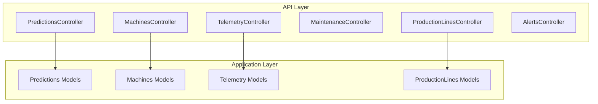
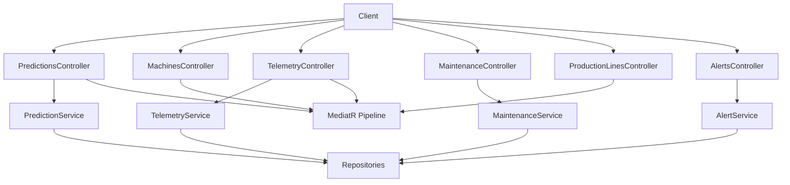
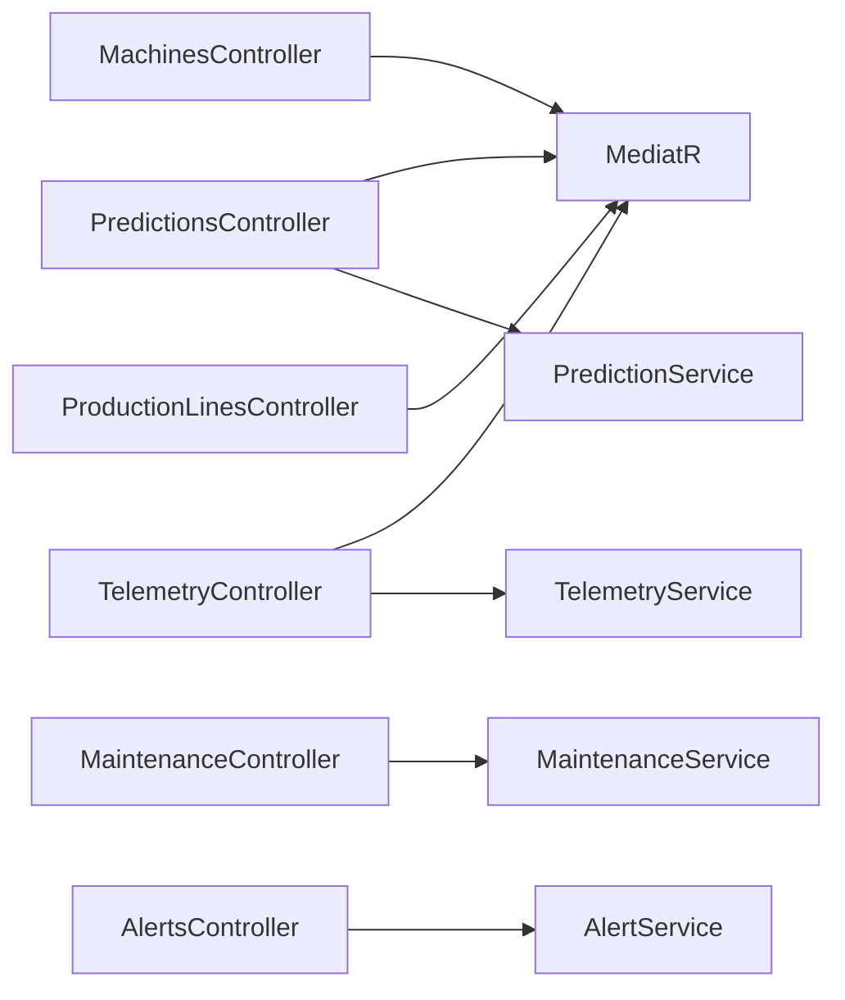

# Core Controllers and Endpoints

<cite>
**Referenced Files in This Document**
- [PredictionsController.cs](file://src/api/DigitalTwinPlatform.API/Controllers/PredictionsController.cs)
- [MachinesController.cs](file://src/api/DigitalTwinPlatform.API/Controllers/MachinesController.cs)
- [TelemetryController.cs](file://src/api/DigitalTwinPlatform.API/Controllers/TelemetryController.cs)
- [MaintenanceController.cs](file://src/api/DigitalTwinPlatform.API/Controllers/MaintenanceController.cs)
- [ProductionLinesController.cs](file://src/api/DigitalTwinPlatform.API/Controllers/ProductionLinesController.cs)
- [AlertsController.cs](file://src/api/DigitalTwinPlatform.API/Controllers/AlertsController.cs)
- [ApiErrorDto.cs](file://src/api/DigitalTwinPlatform.API/Models/ApiErrorDto.cs)
- [HealthStatusDto.cs](file://src/api/DigitalTwinPlatform.API/Models/HealthStatusDto.cs)
- [DataArchivalRequestDto.cs](file://src/api/DigitalTwinPlatform.API/Models/DataArchivalRequestDto.cs)
- [PredictionDto.cs](file://src/api/DigitalTwinPlatform.Application/Predictions/Models/PredictionDto.cs)
- [MachineDto.cs](file://src/api/DigitalTwinPlatform.Application/Machines/Models/MachineDto.cs)
- [TelemetryDto.cs](file://src/api/DigitalTwinPlatform.Application/Telemetry/Models/TelemetryDto.cs)
- [ProductionLineDto.cs](file://src/api/DigitalTwinPlatform.Application/ProductionLines/Models/ProductionLineDto.cs)
</cite>

## Table of Contents
1. [Introduction](#introduction)
2. [Project Structure](#project-structure)
3. [Core Components](#core-components)
4. [Architecture Overview](#architecture-overview)
5. [Detailed Component Analysis](#detailed-component-analysis)
6. [Dependency Analysis](#dependency-analysis)
7. [Performance Considerations](#performance-considerations)
8. [Troubleshooting Guide](#troubleshooting-guide)
9. [Conclusion](#conclusion)

## Introduction
This document provides comprehensive documentation for the core API controllers focused on Predictions, Machines, Telemetry, Maintenance, Production Lines, and Alerts. It covers HTTP methods, URL patterns, request/response schemas, parameter requirements, authentication, and operational behaviors. It also explains the CQRS pattern usage with MediatR, validation patterns, error handling strategies, pagination, filtering, sorting, search capabilities, rate limiting considerations, input validation, and security measures.

## Project Structure
The core controllers are located under the API project’s Controllers folder and delegate business operations to the Application layer via MediatR for CQRS. Data transfer objects (DTOs) define request/response shapes and are declared in the Application layer models.

**Diagram sources**
- [PredictionsController.cs](file://src/api/DigitalTwinPlatform.API/Controllers/PredictionsController.cs#L1-L435)
- [MachinesController.cs](file://src/api/DigitalTwinPlatform.API/Controllers/MachinesController.cs#L1-L139)
- [TelemetryController.cs](file://src/api/DigitalTwinPlatform.API/Controllers/TelemetryController.cs#L1-L202)
- [MaintenanceController.cs](file://src/api/DigitalTwinPlatform.API/Controllers/MaintenanceController.cs#L1-L73)
- [ProductionLinesController.cs](file://src/api/DigitalTwinPlatform.API/Controllers/ProductionLinesController.cs#L1-L46)
- [AlertsController.cs](file://src/api/DigitalTwinPlatform.API/Controllers/AlertsController.cs#L1-L187)
- [PredictionDto.cs](file://src/api/DigitalTwinPlatform.Application/Predictions/Models/PredictionDto.cs#L1-L20)
- [MachineDto.cs](file://src/api/DigitalTwinPlatform.Application/Machines/Models/MachineDto.cs#L1-L61)
- [TelemetryDto.cs](file://src/api/DigitalTwinPlatform.Application/Telemetry/Models/TelemetryDto.cs#L1-L73)
- [ProductionLineDto.cs](file://src/api/DigitalTwinPlatform.Application/ProductionLines/Models/ProductionLineDto.cs#L1-L18)

**Section sources**
- [PredictionsController.cs](file://src/api/DigitalTwinPlatform.API/Controllers/PredictionsController.cs#L1-L435)
- [MachinesController.cs](file://src/api/DigitalTwinPlatform.API/Controllers/MachinesController.cs#L1-L139)
- [TelemetryController.cs](file://src/api/DigitalTwinPlatform.API/Controllers/TelemetryController.cs#L1-L202)
- [MaintenanceController.cs](file://src/api/DigitalTwinPlatform.API/Controllers/MaintenanceController.cs#L1-L73)
- [ProductionLinesController.cs](file://src/api/DigitalTwinPlatform.API/Controllers/ProductionLinesController.cs#L1-L46)
- [AlertsController.cs](file://src/api/DigitalTwinPlatform.API/Controllers/AlertsController.cs#L1-L187)

## Core Components
- PredictionsController: Provides RUL predictions, health classification, anomaly detection, model training, status, and search endpoints.
- MachinesController: Implements CRUD operations for machines using MediatR queries and commands.
- TelemetryController: Handles ingestion and retrieval of telemetry data with time-range filters and search.
- MaintenanceController: Manages maintenance planning, start, completion, cancellation, history, active records, and search.
- ProductionLinesController: CRUD operations for production lines and search.
- AlertsController: Manages active/all alerts, acknowledgments, resolutions, statistics, and search.

**Section sources**
- [PredictionsController.cs](file://src/api/DigitalTwinPlatform.API/Controllers/PredictionsController.cs#L1-L435)
- [MachinesController.cs](file://src/api/DigitalTwinPlatform.API/Controllers/MachinesController.cs#L1-L139)
- [TelemetryController.cs](file://src/api/DigitalTwinPlatform.API/Controllers/TelemetryController.cs#L1-L202)
- [MaintenanceController.cs](file://src/api/DigitalTwinPlatform.API/Controllers/MaintenanceController.cs#L1-L73)
- [ProductionLinesController.cs](file://src/api/DigitalTwinPlatform.API/Controllers/ProductionLinesController.cs#L1-L46)
- [AlertsController.cs](file://src/api/DigitalTwinPlatform.API/Controllers/AlertsController.cs#L1-L187)

## Architecture Overview
The controllers follow a layered architecture:
- API Controllers: Define HTTP endpoints, handle authentication, and orchestrate calls to services or MediatR.
- Application Layer: Contains CQRS commands/queries and models for DTOs.
- Domain Layer: Defines entities and domain logic.
- Infrastructure: Persists data and integrates external systems.

**Diagram sources**
- [PredictionsController.cs](file://src/api/DigitalTwinPlatform.API/Controllers/PredictionsController.cs#L1-L435)
- [MachinesController.cs](file://src/api/DigitalTwinPlatform.API/Controllers/MachinesController.cs#L1-L139)
- [TelemetryController.cs](file://src/api/DigitalTwinPlatform.API/Controllers/TelemetryController.cs#L1-L202)
- [MaintenanceController.cs](file://src/api/DigitalTwinPlatform.API/Controllers/MaintenanceController.cs#L1-L73)
- [ProductionLinesController.cs](file://src/api/DigitalTwinPlatform.API/Controllers/ProductionLinesController.cs#L1-L46)
- [AlertsController.cs](file://src/api/DigitalTwinPlatform.API/Controllers/AlertsController.cs#L1-L187)

## Detailed Component Analysis

### PredictionsController
- Authentication: Requires authorization for all endpoints.
- Base route: api/Predictions
- Endpoints:
  - POST api/Predictions/rul/{machineId}
    - Description: Full RUL prediction with confidence and feature contributions.
    - Path param: machineId (Guid)
    - Response: RulPredictionResult
    - Notes: Requires minimum telemetry samples; otherwise returns 400.
  - GET api/Predictions/health/{machineId}
    - Description: Health classification with probability and recommendations.
    - Path param: machineId (Guid)
    - Response: HealthClassificationResult
  - GET api/Predictions/rul/{machineId}/summary
    - Description: Lightweight summary combining RUL and health status.
    - Path param: machineId (Guid)
    - Response: object with machineId, rul, rulUnit, confidence, healthStatus, predictionTime.
  - POST api/Predictions/train
    - Description: Trains ML models (RUL and health).
    - Body: TrainModelRequestDto (optional: ForceRetrain, ModelType)
    - Response: TrainingResultDto
  - POST api/Predictions/ai/train
    - Description: Backward-compatible training endpoint.
    - Body: TrainModelRequestDto
    - Response: TrainingResultDto
  - GET api/Predictions/status
    - Description: Model status and metadata.
    - Response: ModelStatusDto
  - POST api/Predictions
    - Description: Manual prediction request.
    - Body: PredictionRequestDto
    - Response: PredictionDto
  - GET api/Predictions
    - Description: List predictions; supports machineId filter and limit.
    - Query: machineId (optional), limit (default 50)
    - Response: IEnumerable<PredictionDto>
  - GET api/Predictions/rul/{machineId}
    - Description: GET variant of RUL prediction.
    - Path param: machineId (Guid)
    - Response: RulPredictionResult
  - GET api/Predictions/anomaly/{machineId}
    - Description: Anomaly detection result.
    - Path param: machineId (Guid)
    - Response: AnomalyDetectionResult
  - GET api/Predictions/search
    - Description: Text search across predictions.
    - Query: query (string), machineId (optional)
    - Response: IEnumerable<RulPredictionResult>

- Request/Response schemas:
  - PredictionDto: Id, MachineId, RemainingUsefulLifeDays, RulLowerBound, RulUpperBound, FailureProbability, HealthStatus, FeatureContributions, CreatedAt, UpdatedAt, ModelVersion
  - PredictionRequestDto: MachineId
  - ModelStatusDto: RulModelLoaded, HealthModelLoaded, ModelVersion, LastUpdated

- Pagination, filtering, sorting, search:
  - GET api/Predictions supports optional machineId and limit.
  - GET api/Predictions/search supports text query and machineId filter.

- Validation and error handling:
  - Insufficient telemetry triggers 400 with a descriptive message.
  - Exceptions return 500 with a generic message; specific validations return 400 with messages.

- Security and rate limiting:
  - All endpoints require authorization.
  - No explicit rate limiting observed in controller code.

- Example usage scenarios:
  - Trigger training after data updates.
  - Fetch RUL summary for dashboards.
  - Search historical predictions by machine.

**Section sources**
- [PredictionsController.cs](file://src/api/DigitalTwinPlatform.API/Controllers/PredictionsController.cs#L1-L435)
- [PredictionDto.cs](file://src/api/DigitalTwinPlatform.Application/Predictions/Models/PredictionDto.cs#L1-L20)

### MachinesController
- Authentication: Requires authorization.
- Base route: api/Machines
- Endpoints:
  - GET api/Machines
    - Response: IEnumerable<MachineDto>
  - GET api/Machines/{id:guid}
    - Path param: id (Guid)
    - Response: MachineDto
  - POST api/Machines
    - Body: MachineCreateDto
    - Response: MachineDto (201), Location header via CreatedAtAction
  - PUT api/Machines/{id:guid}
    - Path param: id (Guid)
    - Body: MachineUpdateDto
    - Response: MachineDto
  - DELETE api/Machines/{id:guid}
    - Path param: id (Guid)
    - Response: 204 No Content

- Request/Response schemas:
  - MachineDto: Id, Name, Type, Status, Properties, RemainingUsefulLifeDays, FailureProbability, HealthStatus, timestamps, location, installationDate, last/nextMaintenanceDate, warrantyExpiry, maintenanceIntervalDays, healthScore, specifications, serialNumber, manufacturer, model, criticality
  - MachineCreateDto: Name, Type, Status, Properties, optional metadata
  - MachineUpdateDto: Same as create with optional health metrics

- Pagination, filtering, sorting, search:
  - No built-in pagination or sorting; GET all returns all machines.

- Validation and error handling:
  - 400 for invalid request data; 404 for missing resource; 500 for internal errors.

- Security and rate limiting:
  - All endpoints require authorization.

**Section sources**
- [MachinesController.cs](file://src/api/DigitalTwinPlatform.API/Controllers/MachinesController.cs#L1-L139)
- [MachineDto.cs](file://src/api/DigitalTwinPlatform.Application/Machines/Models/MachineDto.cs#L1-L61)

### TelemetryController
- Authentication: Requires authorization.
- Base route: api/Telemetry
- Endpoints:
  - POST api/Telemetry
    - Body: TelemetryIngestDto (MachineId, DataType, Data as JsonDocument, optional Timestamp)
    - Response: 202 Accepted
  - GET api/Telemetry/{machineId:guid}
    - Path param: machineId (Guid)
    - Query: range (1h|6h|12h|24h), take (default 500)
    - Response: IEnumerable<TelemetryDto>
  - GET api/Telemetry/recent
    - Query: range (optional), machineId (optional), limit (default 100)
    - Response: IEnumerable<TelemetryDto>
  - GET api/Telemetry/{machineId:guid}/latest
    - Path param: machineId (Guid)
    - Response: TelemetryDto or 404
  - GET api/Telemetry/{machineId:guid}/latest/metrics
    - Path param: machineId (Guid)
    - Response: TelemetryMetricsDto or 404
  - GET api/Telemetry/search
    - Query: query (string), range (optional)
    - Response: IEnumerable<TelemetryDto>

- Request/Response schemas:
  - TelemetryDto: Id, MachineId, DataType, Data (JsonDocument), Timestamp; exposes DataObject for JSON serialization
  - TelemetryIngestDto: MachineId, DataType, Data (JsonDocument), optional Timestamp
  - TelemetryMetricsDto: MachineId, Temperature, Vibration, Pressure, Humidity, Rpm, Timestamp, LastUpdated

- Pagination, filtering, sorting, search:
  - Range filters supported via query string (1h|6h|12h|24h).
  - take/limit controls returned counts.
  - Text search across telemetry fields.

- Validation and error handling:
  - 400 for invalid telemetry payload; 404 for missing machine/latest data; 500 for internal errors.

- Security and rate limiting:
  - All endpoints require authorization.

**Section sources**
- [TelemetryController.cs](file://src/api/DigitalTwinPlatform.API/Controllers/TelemetryController.cs#L1-L202)
- [TelemetryDto.cs](file://src/api/DigitalTwinPlatform.Application/Telemetry/Models/TelemetryDto.cs#L1-L73)

### MaintenanceController
- Authentication: Requires authorization.
- Base route: api/Maintenance
- Endpoints:
  - POST api/Maintenance/plan
    - Body: PlanMaintenanceRequest (MachineId, Type, PlannedDate, Notes, AlertId)
    - Response: MaintenanceRecord
  - POST api/Maintenance/{id:guid}/start
    - Path param: id (Guid)
    - Response: MaintenanceRecord
  - POST api/Maintenance/{id:guid}/complete
    - Path param: id (Guid)
    - Body: CompleteMaintenanceRequest (Technician, FinalNotes)
    - Response: MaintenanceRecord
  - POST api/Maintenance/{id:guid}/cancel
    - Path param: id (Guid)
    - Body: string (reason)
    - Response: MaintenanceRecord
  - GET api/Maintenance/machine/{machineId:guid}
    - Path param: machineId (Guid)
    - Response: IEnumerable<MaintenanceRecord>
  - GET api/Maintenance/active
    - Response: IEnumerable<MaintenanceRecord>
  - GET api/Maintenance/search
    - Query: query (string), status (optional), machineId (optional)
    - Response: IEnumerable<MaintenanceRecord>

- Pagination, filtering, sorting, search:
  - GET /search supports text query, status, and machineId filters.

- Validation and error handling:
  - 404 for missing records; 500 for internal errors.

- Security and rate limiting:
  - All endpoints require authorization.

**Section sources**
- [MaintenanceController.cs](file://src/api/DigitalTwinPlatform.API/Controllers/MaintenanceController.cs#L1-L73)

### ProductionLinesController
- Base route: api/ProductionLines
- Endpoints:
  - GET api/ProductionLines
    - Response: IEnumerable<ProductionLineDto>
  - GET api/ProductionLines/{id:guid}
    - Path param: id (Guid)
    - Response: ProductionLineDto
  - POST api/ProductionLines
    - Body: ProductionLineCreateDto (Name, Configuration as JsonDocument)
    - Response: ProductionLineDto (201), Location header via CreatedAtAction
  - PUT api/ProductionLines/{id:guid}
    - Path param: id (Guid)
    - Body: ProductionLineUpdateDto
    - Response: ProductionLineDto
  - DELETE api/ProductionLines/{id:guid}
    - Path param: id (Guid)
    - Response: 204 No Content
  - GET api/ProductionLines/search
    - Query: query (string)
    - Response: IEnumerable<ProductionLineDto>

- Request/Response schemas:
  - ProductionLineDto: Id, Name, Configuration (JsonDocument), MachineIds
  - ProductionLineCreateDto: Name, Configuration
  - ProductionLineUpdateDto: Name, Configuration

- Pagination, filtering, sorting, search:
  - GET /search supports text query.

- Validation and error handling:
  - 404 for missing resources; 500 for internal errors.

- Security and rate limiting:
  - No authorization attribute; behavior depends on global policy.

**Section sources**
- [ProductionLinesController.cs](file://src/api/DigitalTwinPlatform.API/Controllers/ProductionLinesController.cs#L1-L46)
- [ProductionLineDto.cs](file://src/api/DigitalTwinPlatform.Application/ProductionLines/Models/ProductionLineDto.cs#L1-L18)

### AlertsController
- Authentication: Requires authorization.
- Base route: api/Alerts
- Endpoints:
  - GET api/Alerts
    - Query: machineId (optional)
    - Response: IEnumerable<AlertDto>
  - GET api/Alerts/{id:guid}
    - Path param: id (Guid)
    - Response: AlertDto or 404
  - PUT api/Alerts/{id:guid}/acknowledge
    - Path param: id (Guid)
    - Response: 204 No Content
  - DELETE api/Alerts/{id:guid}
    - Path param: id (Guid)
    - Response: 204 No Content
  - GET api/Alerts/all
    - Query: machineId (optional)
    - Response: IEnumerable<AlertDto>
  - GET api/Alerts/stats
    - Response: AlertStatsDto
  - GET api/Alerts/search
    - Query: query (string), status (optional), severity (optional), machineId (optional)
    - Response: IEnumerable<AlertDto>

- Request/Response schemas:
  - AlertDto: Defined by service; exposed via FromEntity conversion
  - AlertStatsDto: TotalActive, TotalAcknowledged, TotalResolved, CriticalCount, WarningCount, InfoCount

- Pagination, filtering, sorting, search:
  - GET /search supports text query, status, severity, and machineId filters.

- Validation and error handling:
  - 404 for missing alert; 500 for internal errors.

- Security and rate limiting:
  - All endpoints require authorization.

**Section sources**
- [AlertsController.cs](file://src/api/DigitalTwinPlatform.API/Controllers/AlertsController.cs#L1-L187)

## Dependency Analysis
- Controllers depend on:
  - MediatR for CQRS (Predictions, Machines, Telemetry, ProductionLines).
  - Application services for domain operations (Maintenance, Alerts).
  - Repositories for persistence (via services).
- DTOs are defined in the Application layer and consumed by controllers.

**Diagram sources**
- [PredictionsController.cs](file://src/api/DigitalTwinPlatform.API/Controllers/PredictionsController.cs#L1-L435)
- [MachinesController.cs](file://src/api/DigitalTwinPlatform.API/Controllers/MachinesController.cs#L1-L139)
- [TelemetryController.cs](file://src/api/DigitalTwinPlatform.API/Controllers/TelemetryController.cs#L1-L202)
- [ProductionLinesController.cs](file://src/api/DigitalTwinPlatform.API/Controllers/ProductionLinesController.cs#L1-L46)
- [MaintenanceController.cs](file://src/api/DigitalTwinPlatform.API/Controllers/MaintenanceController.cs#L1-L73)
- [AlertsController.cs](file://src/api/DigitalTwinPlatform.API/Controllers/AlertsController.cs#L1-L187)

**Section sources**
- [PredictionsController.cs](file://src/api/DigitalTwinPlatform.API/Controllers/PredictionsController.cs#L1-L435)
- [MachinesController.cs](file://src/api/DigitalTwinPlatform.API/Controllers/MachinesController.cs#L1-L139)
- [TelemetryController.cs](file://src/api/DigitalTwinPlatform.API/Controllers/TelemetryController.cs#L1-L202)
- [ProductionLinesController.cs](file://src/api/DigitalTwinPlatform.API/Controllers/ProductionLinesController.cs#L1-L46)
- [MaintenanceController.cs](file://src/api/DigitalTwinPlatform.API/Controllers/MaintenanceController.cs#L1-L73)
- [AlertsController.cs](file://src/api/DigitalTwinPlatform.API/Controllers/AlertsController.cs#L1-L187)

## Performance Considerations
- Telemetry retrieval supports take/limit and range filters to control payload sizes.
- Predictions list supports limit and optional machineId filtering.
- Search endpoints are text-based and may benefit from indexing strategies at the persistence layer.
- Consider caching for frequently accessed machine and telemetry summaries.

[No sources needed since this section provides general guidance]

## Troubleshooting Guide
- Error response format:
  - ApiErrorDto includes ErrorCode, Message, Details, Timestamp, RequestId, Metadata, and ValidationErrors.
  - ErrorCodes defines standardized codes for general, domain, and specific errors.

- Common issues:
  - 400 Bad Request: Invalid payloads or insufficient telemetry data.
  - 401 Unauthorized: Missing or invalid authentication.
  - 404 Not Found: Missing resources (machine, telemetry, alert).
  - 500 Internal Server Error: Unexpected exceptions.

- Recommendations:
  - Log request IDs and timestamps for correlation.
  - Validate inputs early and return structured ApiErrorDto for client clarity.

**Section sources**
- [ApiErrorDto.cs](file://src/api/DigitalTwinPlatform.API/Models/ApiErrorDto.cs#L1-L44)

## Conclusion
The core controllers implement a clean separation of concerns with MediatR for CQRS, robust DTOs, and consistent error handling. Predictions, Machines, Telemetry, Maintenance, Production Lines, and Alerts expose well-defined endpoints with appropriate authentication, validation, and search/filtering capabilities. For production deployments, consider adding rate limiting, input sanitization, and audit logging to further strengthen security and reliability.