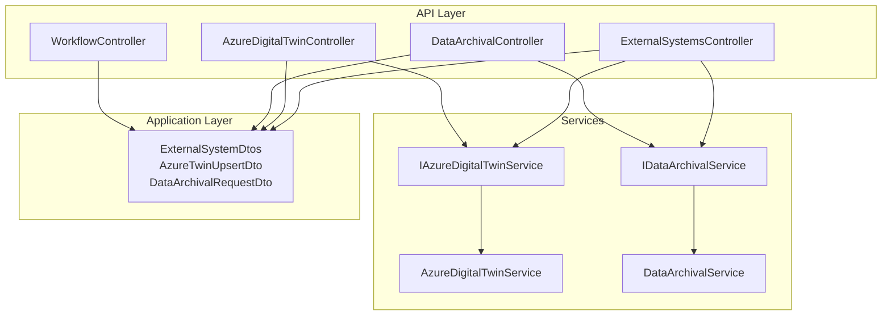
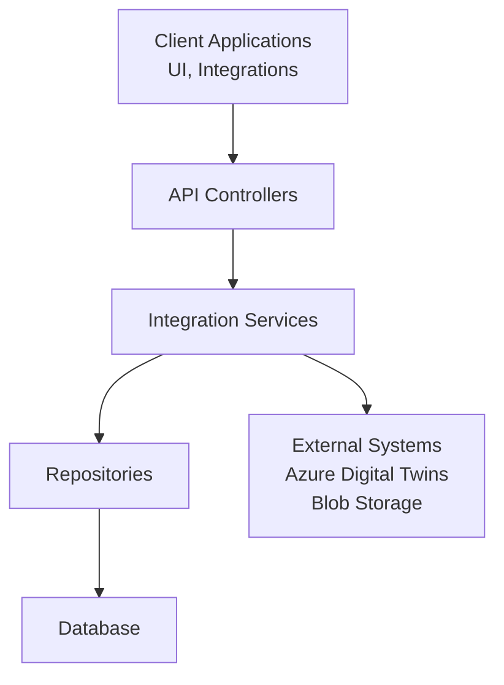
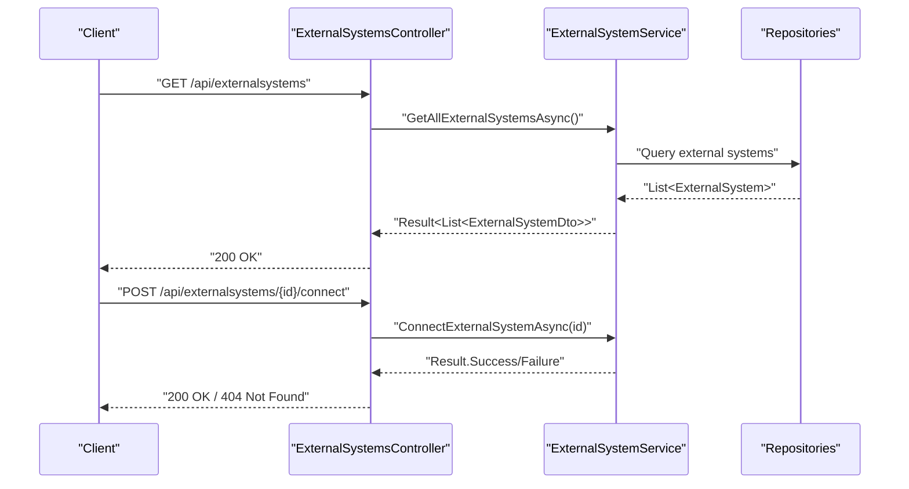
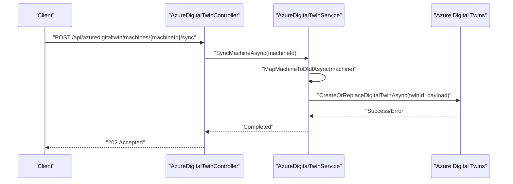
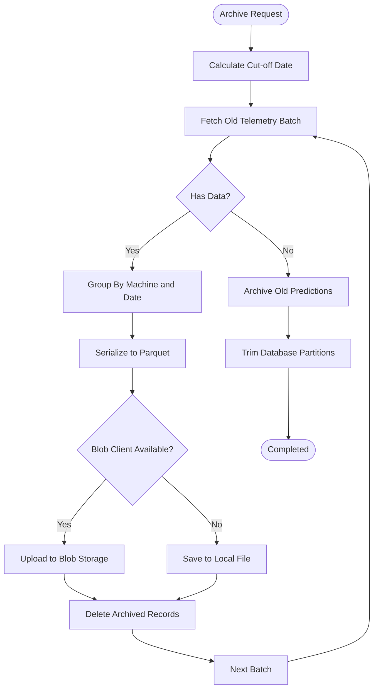
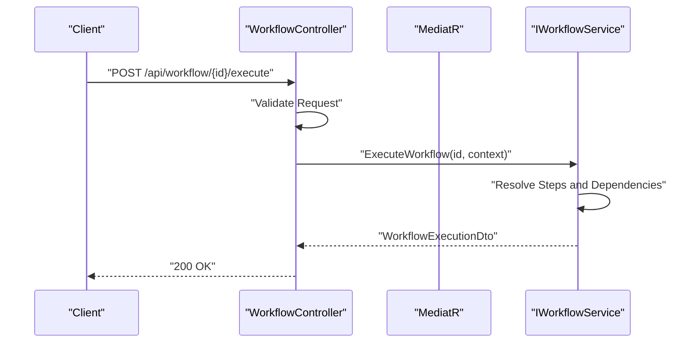
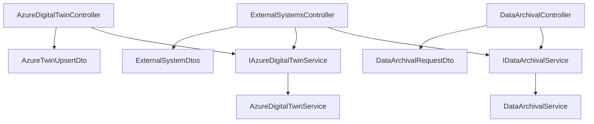

# Integration and External System Controllers

<cite>
**Referenced Files in This Document**
- [ExternalSystemsController.cs](file://src/api/DigitalTwinPlatform.API/Controllers/ExternalSystemsController.cs)
- [AzureDigitalTwinController.cs](file://src/api/DigitalTwinPlatform.API/Controllers/AzureDigitalTwinController.cs)
- [DataArchivalController.cs](file://src/api/DigitalTwinPlatform.API/Controllers/DataArchivalController.cs)
- [WorkflowController.cs](file://src/api/DigitalTwinPlatform.API/Controllers/WorkflowController.cs)
- [IAzureDigitalTwinService.cs](file://src/api/DigitalTwinPlatform.API/Services/Integration/IAzureDigitalTwinService.cs)
- [AzureDigitalTwinService.cs](file://src/api/DigitalTwinPlatform.API/Services/Integration/AzureDigitalTwinService.cs)
- [IDataArchivalService.cs](file://src/api/DigitalTwinPlatform.API/Services/Infrastructure/IDataArchivalService.cs)
- [DataArchivalService.cs](file://src/api/DigitalTwinPlatform.API/Services/Infrastructure/DataArchivalService.cs)
- [ExternalSystemDtos.cs](file://src/api/DigitalTwinPlatform.Application/ExternalSystems/Dtos/ExternalSystemDtos.cs)
- [AzureTwinUpsertDto.cs](file://src/api/DigitalTwinPlatform.API/Models/AzureTwinUpsertDto.cs)
- [DataArchivalRequestDto.cs](file://src/api/DigitalTwinPlatform.API/Models/DataArchivalRequestDto.cs)
</cite>

## Table of Contents
1. [Introduction](#introduction)
2. [Project Structure](#project-structure)
3. [Core Components](#core-components)
4. [Architecture Overview](#architecture-overview)
5. [Detailed Component Analysis](#detailed-component-analysis)
6. [Dependency Analysis](#dependency-analysis)
7. [Performance Considerations](#performance-considerations)
8. [Troubleshooting Guide](#troubleshooting-guide)
9. [Conclusion](#conclusion)

## Introduction
This document provides comprehensive documentation for integration and external system controllers within the Digital Twin Platform. It covers External Systems Management, Azure Digital Twin Integration, Data Archival Services, and Workflow Orchestration. The documentation explains APIs for third-party system connectivity, data synchronization endpoints, and workflow automation. It also details integration patterns, webhook handling, and asynchronous processing for external communications. Examples of system onboarding, data mapping, and real-time synchronization are included, along with error handling, retry policies, fallback mechanisms, security considerations, API key management, and audit logging for integration activities.

## Project Structure
The integration-related functionality is organized across controllers, services, DTOs, and supporting models:

- Controllers expose REST endpoints for managing external systems, synchronizing data with Azure Digital Twins, archiving telemetry data, and orchestrating workflows.
- Services encapsulate integration logic, including Azure Digital Twin operations and data archival routines.
- DTOs define request/response contracts for external system management, integrations, and data synchronization.
- Models represent request DTOs for controller actions.

**Diagram sources**
- [ExternalSystemsController.cs](file://src/api/DigitalTwinPlatform.API/Controllers/ExternalSystemsController.cs#L1-L341)
- [AzureDigitalTwinController.cs](file://src/api/DigitalTwinPlatform.API/Controllers/AzureDigitalTwinController.cs#L1-L32)
- [DataArchivalController.cs](file://src/api/DigitalTwinPlatform.API/Controllers/DataArchivalController.cs#L1-L18)
- [WorkflowController.cs](file://src/api/DigitalTwinPlatform.API/Controllers/WorkflowController.cs#L1-L380)
- [IAzureDigitalTwinService.cs](file://src/api/DigitalTwinPlatform.API/Services/Integration/IAzureDigitalTwinService.cs#L1-L9)
- [AzureDigitalTwinService.cs](file://src/api/DigitalTwinPlatform.API/Services/Integration/AzureDigitalTwinService.cs#L1-L446)
- [IDataArchivalService.cs](file://src/api/DigitalTwinPlatform.API/Services/Infrastructure/IDataArchivalService.cs#L1-L7)
- [DataArchivalService.cs](file://src/api/DigitalTwinPlatform.API/Services/Infrastructure/DataArchivalService.cs#L1-L418)
- [ExternalSystemDtos.cs](file://src/api/DigitalTwinPlatform.Application/ExternalSystems/Dtos/ExternalSystemDtos.cs#L1-L110)
- [AzureTwinUpsertDto.cs](file://src/api/DigitalTwinPlatform.API/Models/AzureTwinUpsertDto.cs#L1-L7)
- [DataArchivalRequestDto.cs](file://src/api/DigitalTwinPlatform.API/Models/DataArchivalRequestDto.cs#L1-L4)

**Section sources**
- [ExternalSystemsController.cs](file://src/api/DigitalTwinPlatform.API/Controllers/ExternalSystemsController.cs#L1-L341)
- [AzureDigitalTwinController.cs](file://src/api/DigitalTwinPlatform.API/Controllers/AzureDigitalTwinController.cs#L1-L32)
- [DataArchivalController.cs](file://src/api/DigitalTwinPlatform.API/Controllers/DataArchivalController.cs#L1-L18)
- [WorkflowController.cs](file://src/api/DigitalTwinPlatform.API/Controllers/WorkflowController.cs#L1-L380)
- [ExternalSystemDtos.cs](file://src/api/DigitalTwinPlatform.Application/ExternalSystems/Dtos/ExternalSystemDtos.cs#L1-L110)

## Core Components
This section outlines the primary integration components and their responsibilities:

- External Systems Management Controller: Provides CRUD operations for external systems, connection/disconnection, testing connections, and managing system integrations and data synchronizations.
- Azure Digital Twin Integration Controller and Service: Handles machine and production line synchronization to Azure Digital Twins, upsert operations, and connection validation.
- Data Archival Controller and Service: Manages archival of telemetry and prediction data to Azure Blob Storage or local storage, with statistics and restoration capabilities.
- Workflow Orchestration Controller: Supports workflow lifecycle management, execution, validation, templates, duplication, and statistics retrieval.

Key responsibilities:
- External Systems Management: Onboarding third-party systems, configuring credentials, enabling/disabling integrations, and scheduling data synchronization.
- Azure Digital Twin Integration: Mapping domain entities to DTDL, performing upsert operations, and validating connectivity.
- Data Archival Services: Batch archival of telemetry data to Parquet format, predictions to JSON, and cleanup of database records.
- Workflow Orchestration: Executing workflows with context, retrieving execution history and statistics, and validating definitions.

**Section sources**
- [ExternalSystemsController.cs](file://src/api/DigitalTwinPlatform.API/Controllers/ExternalSystemsController.cs#L14-L341)
- [AzureDigitalTwinController.cs](file://src/api/DigitalTwinPlatform.API/Controllers/AzureDigitalTwinController.cs#L11-L31)
- [AzureDigitalTwinService.cs](file://src/api/DigitalTwinPlatform.API/Services/Integration/AzureDigitalTwinService.cs#L37-L143)
- [DataArchivalController.cs](file://src/api/DigitalTwinPlatform.API/Controllers/DataArchivalController.cs#L11-L16)
- [DataArchivalService.cs](file://src/api/DigitalTwinPlatform.API/Services/Infrastructure/DataArchivalService.cs#L56-L122)
- [WorkflowController.cs](file://src/api/DigitalTwinPlatform.API/Controllers/WorkflowController.cs#L33-L358)

## Architecture Overview
The integration architecture follows a layered pattern with clear separation of concerns:

- Controllers: Expose REST endpoints and delegate to services.
- Services: Encapsulate integration logic, handle external dependencies, and manage data transformations.
- DTOs: Define contracts for requests and responses across layers.
- Repositories and Unit of Work: Persist and retrieve domain entities.

**Diagram sources**
- [ExternalSystemsController.cs](file://src/api/DigitalTwinPlatform.API/Controllers/ExternalSystemsController.cs#L1-L341)
- [AzureDigitalTwinController.cs](file://src/api/DigitalTwinPlatform.API/Controllers/AzureDigitalTwinController.cs#L1-L32)
- [DataArchivalController.cs](file://src/api/DigitalTwinPlatform.API/Controllers/DataArchivalController.cs#L1-L18)
- [WorkflowController.cs](file://src/api/DigitalTwinPlatform.API/Controllers/WorkflowController.cs#L1-L380)
- [AzureDigitalTwinService.cs](file://src/api/DigitalTwinPlatform.API/Services/Integration/AzureDigitalTwinService.cs#L1-L446)
- [DataArchivalService.cs](file://src/api/DigitalTwinPlatform.API/Services/Infrastructure/DataArchivalService.cs#L1-L418)

## Detailed Component Analysis

### External Systems Management
The External Systems Management component provides comprehensive control over third-party system integration:

- System Management Endpoints:
  - Retrieve all systems, connected systems, systems by type, and individual system details.
  - Create, update, and delete external systems with optional API keys and credentials.
  - Connect/disconnect systems and test connections.
- Integration Management Endpoints:
  - Manage system integrations linking external systems to platform entities.
  - Enable/disable integrations and retrieve active integrations.
- Data Synchronization Endpoints:
  - Query synchronizations by status (pending, failed, recent).
  - Create synchronization jobs and process pending synchronizations.

**Diagram sources**
- [ExternalSystemsController.cs](file://src/api/DigitalTwinPlatform.API/Controllers/ExternalSystemsController.cs#L14-L155)
- [ExternalSystemDtos.cs](file://src/api/DigitalTwinPlatform.Application/ExternalSystems/Dtos/ExternalSystemDtos.cs#L3-L29)

**Section sources**
- [ExternalSystemsController.cs](file://src/api/DigitalTwinPlatform.API/Controllers/ExternalSystemsController.cs#L14-L341)
- [ExternalSystemDtos.cs](file://src/api/DigitalTwinPlatform.Application/ExternalSystems/Dtos/ExternalSystemDtos.cs#L3-L110)

### Azure Digital Twin Integration
The Azure Digital Twin Integration enables synchronization of machine and production line data to Azure Digital Twins:

- Endpoint:
  - POST /api/azuredigital twin/machines/{machineId}/sync
  - POST /api/azuredigital twin/production-lines/{lineId}/sync
  - POST /api/azuredigital twin/twins/upsert
- Implementation:
  - Maps machine and production line entities to DTDL-compliant payloads.
  - Performs upsert operations via Azure Digital Twins client.
  - Validates connectivity and retrieves available models.

**Diagram sources**
- [AzureDigitalTwinController.cs](file://src/api/DigitalTwinPlatform.API/Controllers/AzureDigitalTwinController.cs#L11-L16)
- [AzureDigitalTwinService.cs](file://src/api/DigitalTwinPlatform.API/Services/Integration/AzureDigitalTwinService.cs#L37-L104)

**Section sources**
- [AzureDigitalTwinController.cs](file://src/api/DigitalTwinPlatform.API/Controllers/AzureDigitalTwinController.cs#L11-L31)
- [IAzureDigitalTwinService.cs](file://src/api/DigitalTwinPlatform.API/Services/Integration/IAzureDigitalTwinService.cs#L4-L8)
- [AzureDigitalTwinService.cs](file://src/api/DigitalTwinPlatform.API/Services/Integration/AzureDigitalTwinService.cs#L37-L143)
- [AzureTwinUpsertDto.cs](file://src/api/DigitalTwinPlatform.API/Models/AzureTwinUpsertDto.cs#L3-L6)

### Data Archival Services
The Data Archival Services component manages long-term storage of telemetry and prediction data:

- Endpoint:
  - POST /api/dataarchival
- Implementation:
  - Archives telemetry data in batches to Parquet format.
  - Archives predictions to JSON format.
  - Supports Azure Blob Storage or local file system fallback.
  - Provides archival statistics and restoration capabilities.

**Diagram sources**
- [DataArchivalController.cs](file://src/api/DigitalTwinPlatform.API/Controllers/DataArchivalController.cs#L11-L16)
- [DataArchivalService.cs](file://src/api/DigitalTwinPlatform.API/Services/Infrastructure/DataArchivalService.cs#L56-L122)

**Section sources**
- [DataArchivalController.cs](file://src/api/DigitalTwinPlatform.API/Controllers/DataArchivalController.cs#L11-L16)
- [IDataArchivalService.cs](file://src/api/DigitalTwinPlatform.API/Services/Infrastructure/IDataArchivalService.cs#L4-L6)
- [DataArchivalService.cs](file://src/api/DigitalTwinPlatform.API/Services/Infrastructure/DataArchivalService.cs#L56-L306)
- [DataArchivalRequestDto.cs](file://src/api/DigitalTwinPlatform.API/Models/DataArchivalRequestDto.cs#L3-L4)

### Workflow Orchestration
The Workflow Orchestration component provides lifecycle management and execution of automated workflows:

- Endpoints:
  - GET/POST/PUT/DELETE /api/workflow
  - POST /api/workflow/{id}/execute
  - GET /api/workflow/{id}/executions
  - GET /api/workflow/{id}/statistics
  - POST /api/workflow/validate
  - GET /api/workflow/templates
  - POST /api/workflow/{id}/duplicate
- Implementation:
  - Uses MediatR for command/query handling.
  - Executes workflows with context and tracks execution history.
  - Validates workflow definitions and provides statistics.

**Diagram sources**
- [WorkflowController.cs](file://src/api/DigitalTwinPlatform.API/Controllers/WorkflowController.cs#L196-L224)

**Section sources**
- [WorkflowController.cs](file://src/api/DigitalTwinPlatform.API/Controllers/WorkflowController.cs#L33-L358)

## Dependency Analysis
The integration components exhibit clear separation of concerns with well-defined dependencies:

- Controllers depend on services for business logic.
- Services depend on repositories and external clients.
- DTOs provide loose coupling between layers.
- External dependencies include Azure Digital Twins client and Azure Blob Storage client.

**Diagram sources**
- [ExternalSystemsController.cs](file://src/api/DigitalTwinPlatform.API/Controllers/ExternalSystemsController.cs#L1-L341)
- [AzureDigitalTwinController.cs](file://src/api/DigitalTwinPlatform.API/Controllers/AzureDigitalTwinController.cs#L1-L32)
- [DataArchivalController.cs](file://src/api/DigitalTwinPlatform.API/Controllers/DataArchivalController.cs#L1-L18)
- [IAzureDigitalTwinService.cs](file://src/api/DigitalTwinPlatform.API/Services/Integration/IAzureDigitalTwinService.cs#L1-L9)
- [AzureDigitalTwinService.cs](file://src/api/DigitalTwinPlatform.API/Services/Integration/AzureDigitalTwinService.cs#L1-L446)
- [IDataArchivalService.cs](file://src/api/DigitalTwinPlatform.API/Services/Infrastructure/IDataArchivalService.cs#L1-L7)
- [DataArchivalService.cs](file://src/api/DigitalTwinPlatform.API/Services/Infrastructure/DataArchivalService.cs#L1-L418)
- [ExternalSystemDtos.cs](file://src/api/DigitalTwinPlatform.Application/ExternalSystems/Dtos/ExternalSystemDtos.cs#L1-L110)
- [AzureTwinUpsertDto.cs](file://src/api/DigitalTwinPlatform.API/Models/AzureTwinUpsertDto.cs#L1-L7)
- [DataArchivalRequestDto.cs](file://src/api/DigitalTwinPlatform.API/Models/DataArchivalRequestDto.cs#L1-L4)

**Section sources**
- [ExternalSystemsController.cs](file://src/api/DigitalTwinPlatform.API/Controllers/ExternalSystemsController.cs#L1-L341)
- [AzureDigitalTwinController.cs](file://src/api/DigitalTwinPlatform.API/Controllers/AzureDigitalTwinController.cs#L1-L32)
- [DataArchivalController.cs](file://src/api/DigitalTwinPlatform.API/Controllers/DataArchivalController.cs#L1-L18)
- [WorkflowController.cs](file://src/api/DigitalTwinPlatform.API/Controllers/WorkflowController.cs#L1-L380)
- [ExternalSystemDtos.cs](file://src/api/DigitalTwinPlatform.Application/ExternalSystems/Dtos/ExternalSystemDtos.cs#L1-L110)

## Performance Considerations
- Batch Processing: Data archival processes telemetry in configurable batches to balance throughput and resource usage.
- Asynchronous Operations: Azure Digital Twin upsert operations and blob uploads are performed asynchronously to avoid blocking requests.
- Connection Validation: Azure Digital Twin service validates connectivity before attempting operations to prevent unnecessary failures.
- Transaction Management: Data archival wraps operations in transactions to maintain consistency and enable rollbacks on errors.
- Caching and Statistics: Archival statistics provide insights into storage utilization and help optimize retention policies.

[No sources needed since this section provides general guidance]

## Troubleshooting Guide
Common issues and resolutions:

- Azure Digital Twins Client Not Configured:
  - Symptom: Warnings logged indicating client is not configured.
  - Resolution: Ensure Azure Digital Twins client is properly initialized and credentials are provided.
- External System Connection Failures:
  - Symptom: External system status shows error after connection attempts.
  - Resolution: Verify API keys, usernames, passwords, and connection URLs. Use test connection endpoint to diagnose issues.
- Data Archival Failures:
  - Symptom: Errors during archival or restoration.
  - Resolution: Check blob storage credentials and container existence. Review logs for detailed error messages and retry failed operations.
- Workflow Execution Errors:
  - Symptom: Workflow execution fails or returns validation errors.
  - Resolution: Validate workflow definitions, check dependencies, and review execution history for detailed error information.

Security and Audit Considerations:
- API Key Management: External system credentials are handled securely; ensure proper encryption and rotation policies.
- Audit Logging: Integration activities are logged with timestamps and operation details for compliance and troubleshooting.
- Error Handling: Comprehensive error handling ensures that failures are captured and reported without exposing sensitive information.

**Section sources**
- [AzureDigitalTwinService.cs](file://src/api/DigitalTwinPlatform.API/Services/Integration/AzureDigitalTwinService.cs#L31-L35)
- [DataArchivalService.cs](file://src/api/DigitalTwinPlatform.API/Services/Infrastructure/DataArchivalService.cs#L42-L54)
- [WorkflowController.cs](file://src/api/DigitalTwinPlatform.API/Controllers/WorkflowController.cs#L46-L50)

## Conclusion
The integration and external system controllers provide a robust foundation for connecting third-party systems, synchronizing data with Azure Digital Twins, archiving telemetry efficiently, and orchestrating workflows. The architecture emphasizes separation of concerns, asynchronous processing, and comprehensive error handling. By following the documented patterns and guidelines, teams can onboard new systems, configure integrations, and maintain reliable data synchronization with minimal operational overhead.