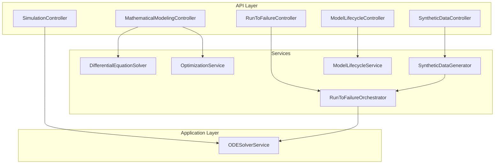
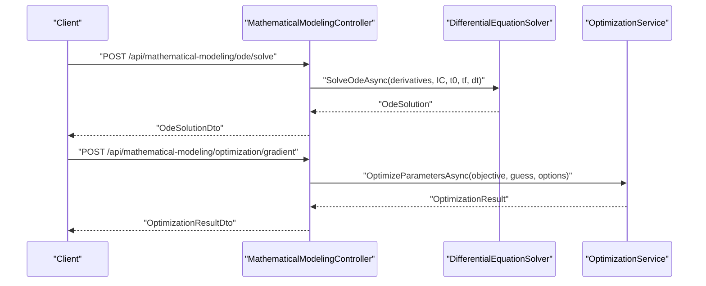
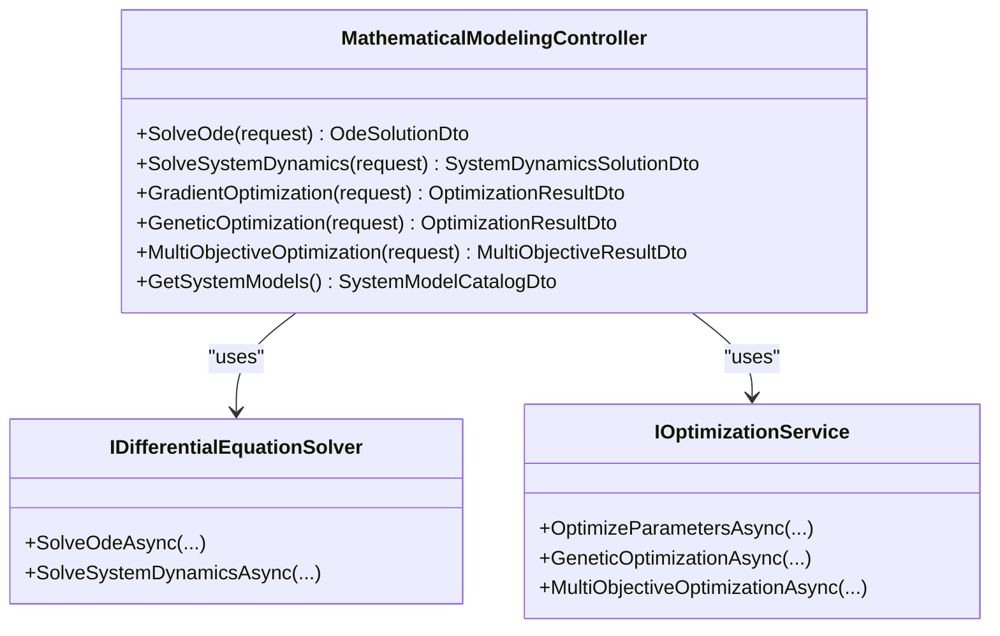
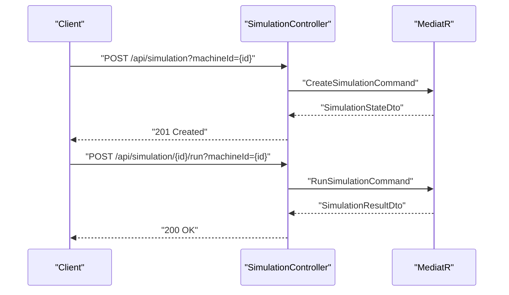
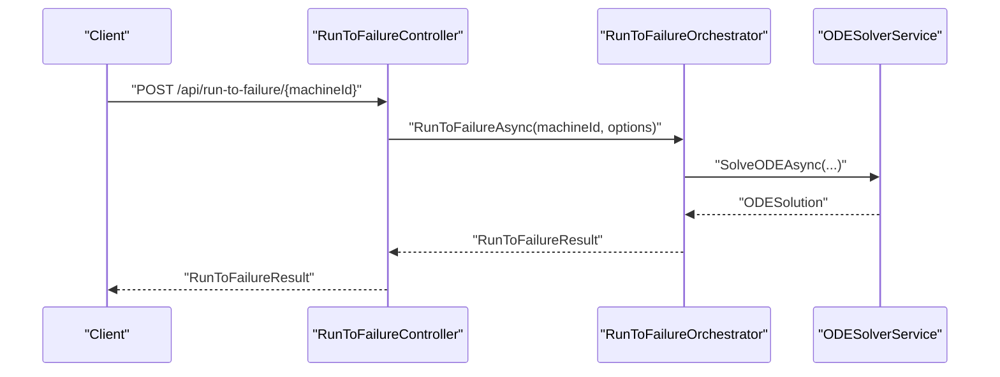
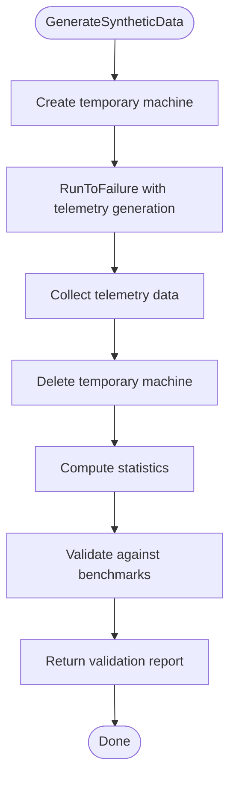
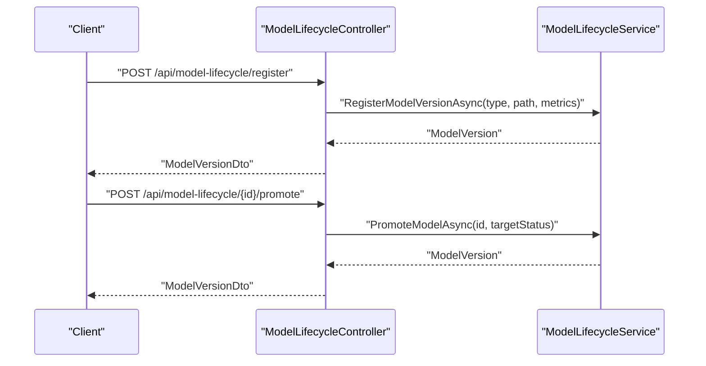
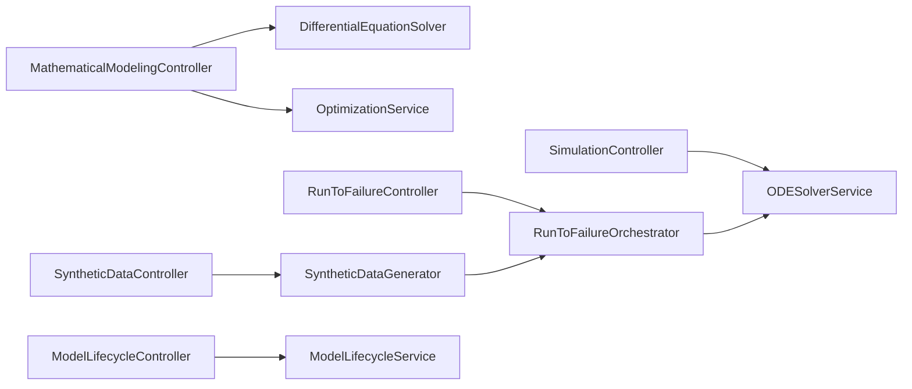

# Simulation and Mathematical Modeling Controllers

<cite>
**Referenced Files in This Document**
- [MathematicalModelingController.cs](file://src/api/DigitalTwinPlatform.API/Controllers/MathematicalModelingController.cs)
- [SimulationController.cs](file://src/api/DigitalTwinPlatform.API/Controllers/SimulationController.cs)
- [RunToFailureController.cs](file://src/api/DigitalTwinPlatform.API/Controllers/RunToFailureController.cs)
- [SyntheticDataController.cs](file://src/api/DigitalTwinPlatform.API/Controllers/SyntheticDataController.cs)
- [ModelLifecycleController.cs](file://src/api/DigitalTwinPlatform.API/Controllers/ModelLifecycleController.cs)
- [MathematicalModelingServices.cs](file://src/api/DigitalTwinPlatform.API/Services/MathematicalModeling/MathematicalModelingServices.cs)
- [RunToFailureOrchestrator.cs](file://src/api/DigitalTwinPlatform.API/Services/Simulation/RunToFailureOrchestrator.cs)
- [SyntheticDataGenerator.cs](file://src/api/DigitalTwinPlatform.API/Services/Simulation/SyntheticDataGenerator.cs)
- [ModelLifecycleService.cs](file://src/api/DigitalTwinPlatform.API/Services/Analytics/ModelLifecycleService.cs)
- [ODESolverService.cs](file://src/api/DigitalTwinPlatform.Application/Services/ODESolverService.cs)
</cite>

## Table of Contents
1. [Introduction](#introduction)
2. [Project Structure](#project-structure)
3. [Core Components](#core-components)
4. [Architecture Overview](#architecture-overview)
5. [Detailed Component Analysis](#detailed-component-analysis)
6. [Dependency Analysis](#dependency-analysis)
7. [Performance Considerations](#performance-considerations)
8. [Troubleshooting Guide](#troubleshooting-guide)
9. [Conclusion](#conclusion)

## Introduction
This document provides comprehensive documentation for simulation and mathematical modeling controllers within the platform. It covers:
- Simulation Management: creation, orchestration, and lifecycle control of simulations
- Run-to-Failure Analysis: degradation modeling, trajectory generation, and failure-time prediction
- Synthetic Data Generation: high-fidelity telemetry generation and validation against benchmarks
- Model Lifecycle Management: registration, promotion, comparison, and performance monitoring of models
- ODE Solver Integration: numerical computation endpoints for physics-informed modeling
- Parameter Estimation and Optimization: gradient-based, genetic, and multi-objective optimization APIs
- Benchmark Dataset Comparison and Quality Assurance: validation workflows and result interpretation

The goal is to enable both technical and non-technical users to understand capabilities, usage patterns, and operational characteristics of the simulation and modeling subsystems.

## Project Structure
The simulation and mathematical modeling functionality spans API controllers, services, and application-layer solvers:
- Controllers expose HTTP endpoints for orchestration and data generation
- Services encapsulate domain-specific workflows (simulation orchestration, synthetic data generation, model lifecycle)
- Application services provide numerical ODE/SDE solvers and optimization routines

**Diagram sources**
- [MathematicalModelingController.cs](file://src/api/DigitalTwinPlatform.API/Controllers/MathematicalModelingController.cs#L1-L514)
- [SimulationController.cs](file://src/api/DigitalTwinPlatform.API/Controllers/SimulationController.cs#L1-L140)
- [RunToFailureController.cs](file://src/api/DigitalTwinPlatform.API/Controllers/RunToFailureController.cs#L1-L122)
- [SyntheticDataController.cs](file://src/api/DigitalTwinPlatform.API/Controllers/SyntheticDataController.cs#L1-L143)
- [ModelLifecycleController.cs](file://src/api/DigitalTwinPlatform.API/Controllers/ModelLifecycleController.cs#L1-L220)
- [MathematicalModelingServices.cs](file://src/api/DigitalTwinPlatform.API/Services/MathematicalModeling/MathematicalModelingServices.cs#L1-L822)
- [RunToFailureOrchestrator.cs](file://src/api/DigitalTwinPlatform.API/Services/Simulation/RunToFailureOrchestrator.cs#L1-L502)
- [SyntheticDataGenerator.cs](file://src/api/DigitalTwinPlatform.API/Services/Simulation/SyntheticDataGenerator.cs#L1-L415)
- [ModelLifecycleService.cs](file://src/api/DigitalTwinPlatform.API/Services/Analytics/ModelLifecycleService.cs#L1-L261)
- [ODESolverService.cs](file://src/api/DigitalTwinPlatform.Application/Services/ODESolverService.cs#L1-L226)

**Section sources**
- [MathematicalModelingController.cs](file://src/api/DigitalTwinPlatform.API/Controllers/MathematicalModelingController.cs#L1-L514)
- [MathematicalModelingServices.cs](file://src/api/DigitalTwinPlatform.API/Services/MathematicalModeling/MathematicalModelingServices.cs#L1-L822)
- [RunToFailureOrchestrator.cs](file://src/api/DigitalTwinPlatform.API/Services/Simulation/RunToFailureOrchestrator.cs#L1-L502)
- [SyntheticDataGenerator.cs](file://src/api/DigitalTwinPlatform.API/Services/Simulation/SyntheticDataGenerator.cs#L1-L415)
- [ModelLifecycleService.cs](file://src/api/DigitalTwinPlatform.API/Services/Analytics/ModelLifecycleService.cs#L1-L261)
- [ODESolverService.cs](file://src/api/DigitalTwinPlatform.Application/Services/ODESolverService.cs#L1-L226)

## Core Components
- MathematicalModelingController: Exposes ODE solving, system dynamics, and optimization endpoints; integrates with numerical solvers and optimization services
- SimulationController: Manages simulation lifecycle (create, run, pause, resume, cancel, list, status)
- RunToFailureController: Executes run-to-failure simulations, generates degradation trajectories, and retrieves results
- SyntheticDataController: Generates synthetic telemetry data and validates against benchmarks
- ModelLifecycleController: Registers model versions, promotes to production, compares versions, and retrieves performance summaries

**Section sources**
- [MathematicalModelingController.cs](file://src/api/DigitalTwinPlatform.API/Controllers/MathematicalModelingController.cs#L1-L514)
- [SimulationController.cs](file://src/api/DigitalTwinPlatform.API/Controllers/SimulationController.cs#L1-L140)
- [RunToFailureController.cs](file://src/api/DigitalTwinPlatform.API/Controllers/RunToFailureController.cs#L1-L122)
- [SyntheticDataController.cs](file://src/api/DigitalTwinPlatform.API/Controllers/SyntheticDataController.cs#L1-L143)
- [ModelLifecycleController.cs](file://src/api/DigitalTwinPlatform.API/Controllers/ModelLifecycleController.cs#L1-L220)

## Architecture Overview
The system follows a layered architecture:
- API Controllers: HTTP entry points and request/response DTO mapping
- Services: Orchestration and domain logic (simulation orchestration, synthetic data generation, model lifecycle)
- Application Services: Numerical solvers and optimization routines
- Data Access: Repositories and unit of work for persistence

**Diagram sources**
- [MathematicalModelingController.cs](file://src/api/DigitalTwinPlatform.API/Controllers/MathematicalModelingController.cs#L24-L166)
- [MathematicalModelingServices.cs](file://src/api/DigitalTwinPlatform.API/Services/MathematicalModeling/MathematicalModelingServices.cs#L57-L238)
- [MathematicalModelingServices.cs](file://src/api/DigitalTwinPlatform.API/Services/MathematicalModeling/MathematicalModelingServices.cs#L240-L726)

## Detailed Component Analysis

### MathematicalModelingController
Endpoints:
- ODE solving: POST api/mathematical-modeling/ode/solve
- System dynamics: POST api/mathematical-modeling/system-dynamics/solve
- Parameter optimization: gradient-based, genetic, and multi-objective variants
- Catalog of predefined system models: GET api/mathematical-modeling/models

Processing logic:
- Accepts requests with system equations, initial conditions, and parameters
- Delegates to numerical ODE solver and optimization services
- Returns structured solutions with time series, derived quantities, stability, and energy balance

**Diagram sources**
- [MathematicalModelingController.cs](file://src/api/DigitalTwinPlatform.API/Controllers/MathematicalModelingController.cs#L8-L22)
- [MathematicalModelingServices.cs](file://src/api/DigitalTwinPlatform.API/Services/MathematicalModeling/MathematicalModelingServices.cs#L5-L55)

**Section sources**
- [MathematicalModelingController.cs](file://src/api/DigitalTwinPlatform.API/Controllers/MathematicalModelingController.cs#L24-L384)

### SimulationController
Endpoints:
- Create simulation: POST api/simulation
- Get simulation: GET api/simulation/{id}
- Run simulation: POST api/simulation/{id}/run
- Pause/resume/cancel: POST api/simulation/{id}/pause | /resume | /cancel
- List simulations: GET api/simulation
- Get status: GET api/simulation/status/{machineId} | /status

Processing logic:
- Uses MediatR to handle commands and queries for simulation state management
- Supports per-machine simulation orchestration and status retrieval

**Diagram sources**
- [SimulationController.cs](file://src/api/DigitalTwinPlatform.API/Controllers/SimulationController.cs#L14-L140)

**Section sources**
- [SimulationController.cs](file://src/api/DigitalTwinPlatform.API/Controllers/SimulationController.cs#L16-L140)

### RunToFailureController
Endpoints:
- Single run-to-failure: POST api/run-to-failure/{machineId}
- Generate trajectories: POST api/run-to-failure/generate-trajectories
- Retrieve results: GET api/run-to-failure/{machineId}/results

Processing logic:
- Orchestrates degradation simulation until failure threshold or termination conditions
- Generates telemetry and optionally stores snapshots
- Supports batch trajectory generation with varying random seeds

**Diagram sources**
- [RunToFailureController.cs](file://src/api/DigitalTwinPlatform.API/Controllers/RunToFailureController.cs#L30-L51)
- [RunToFailureOrchestrator.cs](file://src/api/DigitalTwinPlatform.API/Services/Simulation/RunToFailureOrchestrator.cs#L43-L56)
- [ODESolverService.cs](file://src/api/DigitalTwinPlatform.Application/Services/ODESolverService.cs#L34-L61)

**Section sources**
- [RunToFailureController.cs](file://src/api/DigitalTwinPlatform.API/Controllers/RunToFailureController.cs#L23-L114)
- [RunToFailureOrchestrator.cs](file://src/api/DigitalTwinPlatform.API/Services/Simulation/RunToFailureOrchestrator.cs#L43-L147)

### SyntheticDataController
Endpoints:
- Generate synthetic data: POST api/synthetic-data/generate
- Validate synthetic data: POST api/synthetic-data/validate
- Get statistics: GET api/synthetic-data/statistics/{machineType} | /statistics

Processing logic:
- Generates synthetic telemetry via run-to-failure trajectories
- Computes statistics and validates against benchmark datasets
- Aggregates validation results with pass/fail criteria

**Diagram sources**
- [SyntheticDataController.cs](file://src/api/DigitalTwinPlatform.API/Controllers/SyntheticDataController.cs#L36-L86)
- [SyntheticDataGenerator.cs](file://src/api/DigitalTwinPlatform.API/Services/Simulation/SyntheticDataGenerator.cs#L33-L117)

**Section sources**
- [SyntheticDataController.cs](file://src/api/DigitalTwinPlatform.API/Controllers/SyntheticDataController.cs#L29-L143)
- [SyntheticDataGenerator.cs](file://src/api/DigitalTwinPlatform.API/Services/Simulation/SyntheticDataGenerator.cs#L33-L165)

### ModelLifecycleController
Endpoints:
- Register model version: POST api/model-lifecycle/register
- Promote model: POST api/model-lifecycle/{id}/promote
- List versions: GET api/model-lifecycle
- Get production version: GET api/model-lifecycle/production/{modelType}
- Compare models: POST api/model-lifecycle/compare
- Get performance: GET api/model-lifecycle/{id}/performance

Processing logic:
- Registers new model versions with metadata and metrics
- Promotes versions to production, deprecating prior production versions
- Compares models across metrics and summarizes performance

**Diagram sources**
- [ModelLifecycleController.cs](file://src/api/DigitalTwinPlatform.API/Controllers/ModelLifecycleController.cs#L26-L73)
- [ModelLifecycleService.cs](file://src/api/DigitalTwinPlatform.API/Services/Analytics/ModelLifecycleService.cs#L28-L118)

**Section sources**
- [ModelLifecycleController.cs](file://src/api/DigitalTwinPlatform.API/Controllers/ModelLifecycleController.cs#L22-L182)
- [ModelLifecycleService.cs](file://src/api/DigitalTwinPlatform.API/Services/Analytics/ModelLifecycleService.cs#L28-L259)

## Dependency Analysis
Key dependencies and relationships:
- Controllers depend on services for orchestration and computation
- RunToFailureOrchestrator depends on ODESolverService for numerical integration
- SyntheticDataGenerator composes RunToFailureOrchestrator for trajectory generation
- ModelLifecycleService coordinates repositories for model metadata and predictions

**Diagram sources**
- [MathematicalModelingController.cs](file://src/api/DigitalTwinPlatform.API/Controllers/MathematicalModelingController.cs#L10-L22)
- [RunToFailureController.cs](file://src/api/DigitalTwinPlatform.API/Controllers/RunToFailureController.cs#L12-L21)
- [SyntheticDataController.cs](file://src/api/DigitalTwinPlatform.API/Controllers/SyntheticDataController.cs#L18-L27)
- [ModelLifecycleController.cs](file://src/api/DigitalTwinPlatform.API/Controllers/ModelLifecycleController.cs#L11-L19)
- [MathematicalModelingServices.cs](file://src/api/DigitalTwinPlatform.API/Services/MathematicalModeling/MathematicalModelingServices.cs#L57-L238)
- [RunToFailureOrchestrator.cs](file://src/api/DigitalTwinPlatform.API/Services/Simulation/RunToFailureOrchestrator.cs#L15-L41)
- [SyntheticDataGenerator.cs](file://src/api/DigitalTwinPlatform.API/Services/Simulation/SyntheticDataGenerator.cs#L11-L31)
- [ModelLifecycleService.cs](file://src/api/DigitalTwinPlatform.API/Services/Analytics/ModelLifecycleService.cs#L9-L26)
- [ODESolverService.cs](file://src/api/DigitalTwinPlatform.Application/Services/ODESolverService.cs#L15-L29)

**Section sources**
- [MathematicalModelingServices.cs](file://src/api/DigitalTwinPlatform.API/Services/MathematicalModeling/MathematicalModelingServices.cs#L1-L822)
- [RunToFailureOrchestrator.cs](file://src/api/DigitalTwinPlatform.API/Services/Simulation/RunToFailureOrchestrator.cs#L1-L502)
- [SyntheticDataGenerator.cs](file://src/api/DigitalTwinPlatform.API/Services/Simulation/SyntheticDataGenerator.cs#L1-L415)
- [ModelLifecycleService.cs](file://src/api/DigitalTwinPlatform.API/Services/Analytics/ModelLifecycleService.cs#L1-L261)
- [ODESolverService.cs](file://src/api/DigitalTwinPlatform.Application/Services/ODESolverService.cs#L1-L226)

## Performance Considerations
- ODE Solving: Runge-Kutta 4th order method provides good accuracy and stability for moderate-scale problems; computational cost scales linearly with time steps
- Optimization: Gradient-based methods converge quickly near optima; genetic and multi-objective algorithms scale with population size and generations
- Trajectory Generation: Synthetic data generation creates multiple run-to-failure trajectories; performance depends on step interval, maximum steps, and telemetry generation
- Validation: Statistical comparisons and correlation calculations are efficient; benchmark loading is currently placeholder and should be optimized in production

[No sources needed since this section provides general guidance]

## Troubleshooting Guide
Common issues and resolutions:
- ODE solver failures: Check initial conditions and step size; validate derivative functions; inspect NaN or infinite values in solutions
- Simulation timeouts: Increase max steps or simulation time; reduce step interval; enable cancellation tokens
- Model promotion errors: Ensure model exists and is eligible for promotion; verify production deprecation logic
- Synthetic data validation failures: Adjust tolerance thresholds; confirm benchmark statistics availability; review feature extraction logic

**Section sources**
- [MathematicalModelingServices.cs](file://src/api/DigitalTwinPlatform.API/Services/MathematicalModeling/MathematicalModelingServices.cs#L165-L213)
- [ODESolverService.cs](file://src/api/DigitalTwinPlatform.Application/Services/ODESolverService.cs#L166-L183)
- [ModelLifecycleService.cs](file://src/api/DigitalTwinPlatform.API/Services/Analytics/ModelLifecycleService.cs#L69-L118)
- [SyntheticDataGenerator.cs](file://src/api/DigitalTwinPlatform.API/Services/Simulation/SyntheticDataGenerator.cs#L183-L303)

## Conclusion
The simulation and mathematical modeling controllers provide a robust foundation for:
- Physics-informed modeling with ODE/SDE solvers
- Run-to-failure analysis and synthetic data generation
- Parameter estimation and multi-objective optimization
- Model lifecycle management and benchmark-driven validation

These components integrate seamlessly across layers, enabling scalable and maintainable simulation workflows tailored to industrial digital twin applications.