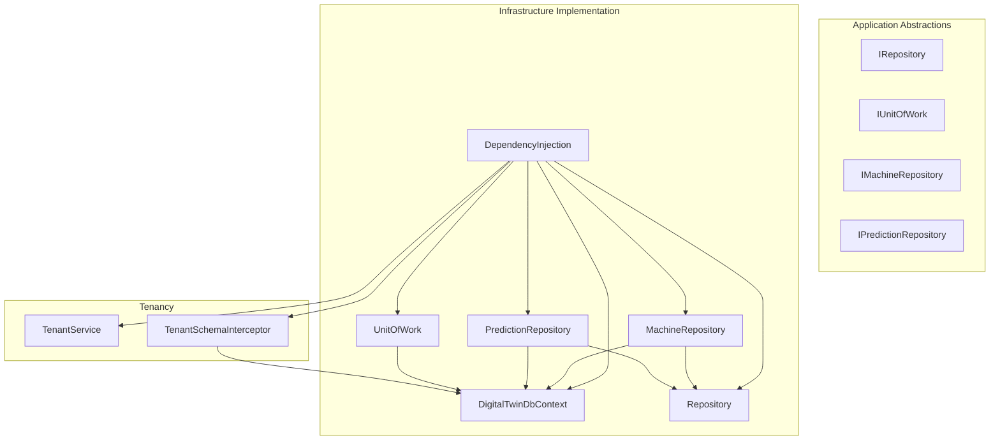
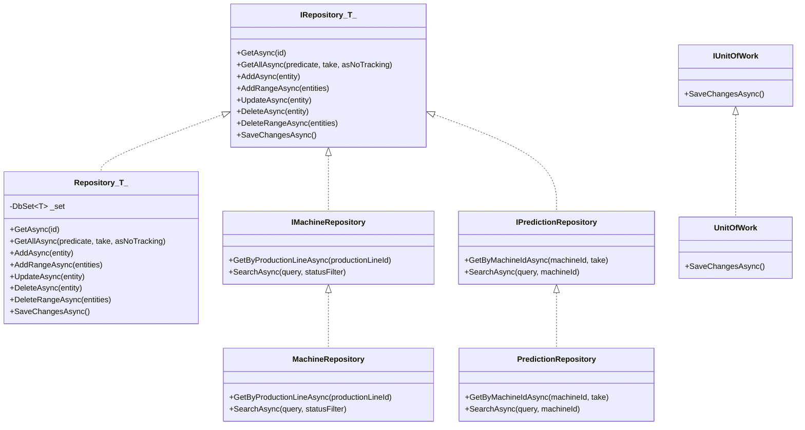
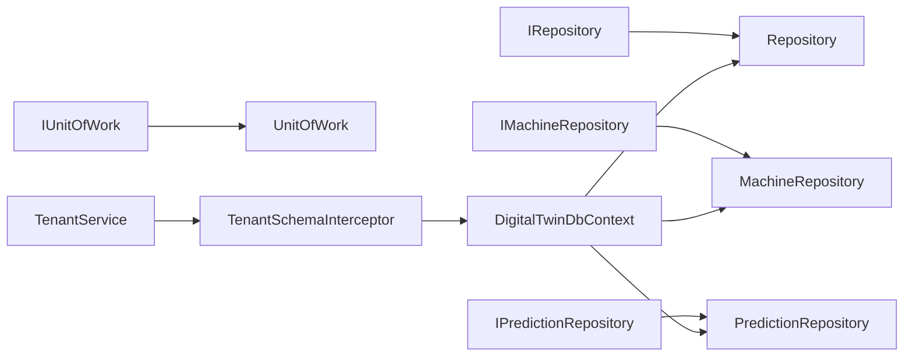

# Data Access Layer

<cite>
**Referenced Files in This Document**
- [DependencyInjection.cs](file://src/api/DigitalTwinPlatform.Infrastructure/DependencyInjection.cs)
- [IRepository.cs](file://src/api/DigitalTwinPlatform.Application/Abstractions/Repositories/IRepository.cs)
- [Repository.cs](file://src/api/DigitalTwinPlatform.Infrastructure/Persistence/Repositories/Repository.cs)
- [IMachineRepository.cs](file://src/api/DigitalTwinPlatform.Application/Abstractions/Repositories/IMachineRepository.cs)
- [MachineRepository.cs](file://src/api/DigitalTwinPlatform.Infrastructure/Persistence/Repositories/MachineRepository.cs)
- [IPredictionRepository.cs](file://src/api/DigitalTwinPlatform.Application/Abstractions/Repositories/IPredictionRepository.cs)
- [PredictionRepository.cs](file://src/api/DigitalTwinPlatform.Infrastructure/Persistence/Repositories/PredictionRepository.cs)
- [IUnitOfWork.cs](file://src/api/DigitalTwinPlatform.Application/Abstractions/UnitOfWork/IUnitOfWork.cs)
- [UnitOfWork.cs](file://src/api/DigitalTwinPlatform.Infrastructure/Persistence/UnitOfWork/UnitOfWork.cs)
- [DigitalTwinDbContext.cs](file://src/api/DigitalTwinPlatform.Infrastructure/Persistence/DigitalTwinDbContext.cs)
- [DesignTimeDbContextFactory.cs](file://src/api/DigitalTwinPlatform.Infrastructure/Persistence/DesignTimeDbContextFactory.cs)
- [DigitalTwinDbContextModelSnapshot.cs](file://src/api/DigitalTwinPlatform.Infrastructure/Migrations/DigitalTwinDbContextModelSnapshot.cs)
- [TenantSchemaInterceptor.cs](file://src/api/DigitalTwinPlatform.Infrastructure/Tenancy/TenantSchemaInterceptor.cs)
- [TenantService.cs](file://src/api/DigitalTwinPlatform.Infrastructure/Tenancy/TenantService.cs)
</cite>

## Table of Contents
1. [Introduction](#introduction)
2. [Project Structure](#project-structure)
3. [Core Components](#core-components)
4. [Architecture Overview](#architecture-overview)
5. [Detailed Component Analysis](#detailed-component-analysis)
6. [Dependency Analysis](#dependency-analysis)
7. [Performance Considerations](#performance-considerations)
8. [Troubleshooting Guide](#troubleshooting-guide)
9. [Conclusion](#conclusion)

## Introduction
This document describes the data access layer built on Entity Framework Core using the Repository pattern and Unit of Work. It explains the generic Repository<T> base class with common CRUD operations, pagination support, and query composition. It also documents specialized repositories for Machine, TelemetryData, Prediction, and other domain entities, along with transaction management via Unit of Work. The document covers Entity Framework configuration, connection pooling, performance optimization techniques, LINQ query patterns, async/await usage, dependency injection registration, and strategies to prevent N+1 queries.

## Project Structure
The data access layer is organized into three primary areas:
- Application Abstractions: Defines repository interfaces and the Unit of Work abstraction.
- Infrastructure Implementation: Provides Entity Framework DbContext, generic repository base, specialized repositories, and Unit of Work implementation.
- Tenancy: Adds tenant-aware schema routing via interceptors.

**Diagram sources**
- [DependencyInjection.cs](file://src/api/DigitalTwinPlatform.Infrastructure/DependencyInjection.cs#L16-L44)
- [IRepository.cs](file://src/api/DigitalTwinPlatform.Application/Abstractions/Repositories/IRepository.cs#L5-L15)
- [Repository.cs](file://src/api/DigitalTwinPlatform.Infrastructure/Persistence/Repositories/Repository.cs#L7-L60)
- [IMachineRepository.cs](file://src/api/DigitalTwinPlatform.Application/Abstractions/Repositories/IMachineRepository.cs#L5-L9)
- [MachineRepository.cs](file://src/api/DigitalTwinPlatform.Infrastructure/Persistence/Repositories/MachineRepository.cs#L7-L44)
- [IPredictionRepository.cs](file://src/api/DigitalTwinPlatform.Application/Abstractions/Repositories/IPredictionRepository.cs#L5-L9)
- [PredictionRepository.cs](file://src/api/DigitalTwinPlatform.Infrastructure/Persistence/Repositories/PredictionRepository.cs#L8-L51)
- [IUnitOfWork.cs](file://src/api/DigitalTwinPlatform.Application/Abstractions/UnitOfWork/IUnitOfWork.cs)
- [UnitOfWork.cs](file://src/api/DigitalTwinPlatform.Infrastructure/Persistence/UnitOfWork/UnitOfWork.cs)
- [DigitalTwinDbContext.cs](file://src/api/DigitalTwinPlatform.Infrastructure/Persistence/DigitalTwinDbContext.cs)
- [TenantSchemaInterceptor.cs](file://src/api/DigitalTwinPlatform.Infrastructure/Tenancy/TenantSchemaInterceptor.cs)
- [TenantService.cs](file://src/api/DigitalTwinPlatform.Infrastructure/Tenancy/TenantService.cs)

**Section sources**
- [DependencyInjection.cs](file://src/api/DigitalTwinPlatform.Infrastructure/DependencyInjection.cs#L16-L44)

## Core Components
- Generic Repository<T>: Provides common CRUD operations and optional predicate-based filtering, no-tracking mode, and take-based pagination.
- Specialized Repositories: Extend the generic repository to add domain-specific queries (e.g., Machine search, Prediction history and search).
- Unit of Work: Coordinates transactions and change tracking across repositories, exposing SaveChangesAsync at the boundary.

Key repository method signatures (async):
- GetAsync(id): Retrieve by Id.
- GetAllAsync(predicate, take, asNoTracking): Filtered, optionally no-tracking, paginated retrieval.
- AddAsync(entity), AddRangeAsync(entities): Insert single or multiple entities.
- UpdateAsync(entity), DeleteAsync(entity), DeleteRangeAsync(entities): Modify state for later SaveChanges.
- SaveChangesAsync(): Persist tracked changes.

**Section sources**
- [IRepository.cs](file://src/api/DigitalTwinPlatform.Application/Abstractions/Repositories/IRepository.cs#L5-L15)
- [Repository.cs](file://src/api/DigitalTwinPlatform.Infrastructure/Persistence/Repositories/Repository.cs#L12-L59)

## Architecture Overview
The data access layer follows a layered architecture:
- Application Abstractions define contracts for repositories and Unit of Work.
- Infrastructure implements these contracts using Entity Framework Core.
- Dependency Injection registers DbContext, repositories, and Unit of Work as scoped services.
- Tenancy is enforced via an interceptor that modifies schema routing per tenant.

**Diagram sources**
- [IRepository.cs](file://src/api/DigitalTwinPlatform.Application/Abstractions/Repositories/IRepository.cs#L5-L15)
- [Repository.cs](file://src/api/DigitalTwinPlatform.Infrastructure/Persistence/Repositories/Repository.cs#L7-L60)
- [IMachineRepository.cs](file://src/api/DigitalTwinPlatform.Application/Abstractions/Repositories/IMachineRepository.cs#L5-L9)
- [MachineRepository.cs](file://src/api/DigitalTwinPlatform.Infrastructure/Persistence/Repositories/MachineRepository.cs#L7-L44)
- [IPredictionRepository.cs](file://src/api/DigitalTwinPlatform.Application/Abstractions/Repositories/IPredictionRepository.cs#L5-L9)
- [PredictionRepository.cs](file://src/api/DigitalTwinPlatform.Infrastructure/Persistence/Repositories/PredictionRepository.cs#L8-L51)
- [IUnitOfWork.cs](file://src/api/DigitalTwinPlatform.Application/Abstractions/UnitOfWork/IUnitOfWork.cs)
- [UnitOfWork.cs](file://src/api/DigitalTwinPlatform.Infrastructure/Persistence/UnitOfWork/UnitOfWork.cs)

## Detailed Component Analysis

### Generic Repository<T>
- Purpose: Centralize common CRUD and query composition logic.
- Features:
  - Predicate-based filtering via LINQ expressions.
  - Optional no-tracking queries for read-only scenarios.
  - Take-based pagination to limit result sets.
  - Batch insert and delete helpers.
  - Defer SaveChanges to Unit of Work boundary.

Implementation highlights:
- Uses DbSet<T> for EF Core operations.
- GetAllAsync composes Where, AsNoTracking, and Take dynamically.
- SaveChangesAsync is a no-op here; delegated to Unit of Work.

**Section sources**
- [Repository.cs](file://src/api/DigitalTwinPlatform.Infrastructure/Persistence/Repositories/Repository.cs#L7-L60)
- [IRepository.cs](file://src/api/DigitalTwinPlatform.Application/Abstractions/Repositories/IRepository.cs#L5-L15)

### MachineRepository
- Extends Repository<Machine>.
- Domain-specific methods:
  - GetByProductionLineAsync: Fetch machines filtered by production line.
  - SearchAsync: Full-text search across name, type, location, properties, and Id; supports optional status filter; orders by name.

Query patterns:
- Uses Where clauses for filters.
- Normalizes search terms to lowercase for case-insensitive matching.
- Orders results deterministically.

**Section sources**
- [MachineRepository.cs](file://src/api/DigitalTwinPlatform.Infrastructure/Persistence/Repositories/MachineRepository.cs#L7-L44)
- [IMachineRepository.cs](file://src/api/DigitalTwinPlatform.Application/Abstractions/Repositories/IMachineRepository.cs#L5-L9)

### PredictionRepository
- Extends Repository<Prediction>.
- Domain-specific methods:
  - GetByMachineIdAsync: Retrieves recent predictions for a machine with a configurable take count and sorts by creation date descending.
  - SearchAsync: Filters by optional machine Id and performs full-text search across machine name/type and prediction health/model fields; sorts by creation date descending.

Query patterns:
- Applies joins implicitly via navigation property Machine for cross-field searches.
- Uses Take for pagination and OrderByDescending for recency.

**Section sources**
- [PredictionRepository.cs](file://src/api/DigitalTwinPlatform.Infrastructure/Persistence/Repositories/PredictionRepository.cs#L8-L51)
- [IPredictionRepository.cs](file://src/api/DigitalTwinPlatform.Application/Abstractions/Repositories/IPredictionRepository.cs#L5-L9)

### Unit of Work
- Contract: IUnitOfWork exposes SaveChangesAsync to persist all pending changes from repositories within a transactional boundary.
- Implementation: Coordinates EF Core change tracking and persists changes in a single unit.

Usage pattern:
- Resolve IUnitOfWork alongside repositories.
- Perform multiple repository operations.
- Call SaveChangesAsync once to commit atomically.

**Section sources**
- [IUnitOfWork.cs](file://src/api/DigitalTwinPlatform.Application/Abstractions/UnitOfWork/IUnitOfWork.cs)
- [UnitOfWork.cs](file://src/api/DigitalTwinPlatform.Infrastructure/Persistence/UnitOfWork/UnitOfWork.cs)

### DbContext and EF Configuration
- DbContext: DigitalTwinDbContext is configured with Npgsql provider and tenant schema interceptor.
- Connection string: Resolved from configuration under the "DefaultConnection" key.
- Warnings: Suppresses specific relational warnings during model initialization.
- Design-time factory: DesignTimeDbContextFactory enables EF Core tooling (migrations, scaffolding).

**Section sources**
- [DependencyInjection.cs](file://src/api/DigitalTwinPlatform.Infrastructure/DependencyInjection.cs#L22-L31)
- [DigitalTwinDbContext.cs](file://src/api/DigitalTwinPlatform.Infrastructure/Persistence/DigitalTwinDbContext.cs)
- [DesignTimeDbContextFactory.cs](file://src/api/DigitalTwinPlatform.Infrastructure/Persistence/DesignTimeDbContextFactory.cs)
- [DigitalTwinDbContextModelSnapshot.cs](file://src/api/DigitalTwinPlatform.Infrastructure/Migrations/DigitalTwinDbContextModelSnapshot.cs)

### Dependency Injection and Lifetime Management
- DbContext: Added with AddDbContext and configured with Npgsql; registered with tenant interceptor.
- Unit of Work: Scoped registration.
- Generic repository: Open generic registration IRepository<T> -> Repository<T>.
- Specialized repositories: Scoped registrations for IMachineRepository, ITelemetryRepository, IPredictionRepository, IModelVersionRepository, IAlertRepository, IMaintenanceRepository, IProductionLineRepository.
- Tenancy: TenantService and TenantSchemaInterceptor registered as scoped.

Lifetime: All repositories and Unit of Work are registered as Scoped, aligning with HTTP request lifetime.

**Section sources**
- [DependencyInjection.cs](file://src/api/DigitalTwinPlatform.Infrastructure/DependencyInjection.cs#L16-L44)

## Dependency Analysis
The following diagram shows how abstractions are implemented and how services are wired via dependency injection.

**Diagram sources**
- [IRepository.cs](file://src/api/DigitalTwinPlatform.Application/Abstractions/Repositories/IRepository.cs#L5-L15)
- [Repository.cs](file://src/api/DigitalTwinPlatform.Infrastructure/Persistence/Repositories/Repository.cs#L7-L60)
- [IMachineRepository.cs](file://src/api/DigitalTwinPlatform.Application/Abstractions/Repositories/IMachineRepository.cs#L5-L9)
- [MachineRepository.cs](file://src/api/DigitalTwinPlatform.Infrastructure/Persistence/Repositories/MachineRepository.cs#L7-L44)
- [IPredictionRepository.cs](file://src/api/DigitalTwinPlatform.Application/Abstractions/Repositories/IPredictionRepository.cs#L5-L9)
- [PredictionRepository.cs](file://src/api/DigitalTwinPlatform.Infrastructure/Persistence/Repositories/PredictionRepository.cs#L8-L51)
- [IUnitOfWork.cs](file://src/api/DigitalTwinPlatform.Application/Abstractions/UnitOfWork/IUnitOfWork.cs)
- [UnitOfWork.cs](file://src/api/DigitalTwinPlatform.Infrastructure/Persistence/UnitOfWork/UnitOfWork.cs)
- [DigitalTwinDbContext.cs](file://src/api/DigitalTwinPlatform.Infrastructure/Persistence/DigitalTwinDbContext.cs)
- [TenantSchemaInterceptor.cs](file://src/api/DigitalTwinPlatform.Infrastructure/Tenancy/TenantSchemaInterceptor.cs)
- [TenantService.cs](file://src/api/DigitalTwinPlatform.Infrastructure/Tenancy/TenantService.cs)

## Performance Considerations
- Async/await everywhere: All repository methods are async to avoid blocking threads and improve scalability.
- No-tracking reads: Use asNoTracking in GetAllAsync for read-only scenarios to reduce change tracking overhead.
- Pagination: Use take parameter in GetAllAsync and Take in specialized repositories to limit result sets.
- Efficient filtering: Prefer predicate-based filtering and composed Where clauses for server-side evaluation.
- Eager loading: Use Include for related entities when necessary to prevent N+1 queries; ensure projections minimize data transfer.
- Projections: Select only required fields to reduce payload size and network bandwidth.
- Connection pooling: Entity Framework Core manages connection pooling automatically; ensure appropriate command timeout and avoid long-running transactions.
- Indexes: Ensure database indexes exist on frequently filtered columns (e.g., Machine.ProductionLineId, Prediction.MachineId, Prediction.CreatedAt).
- Query composition: Build LINQ queries incrementally and avoid client evaluation by keeping expressions on the server side.

## Troubleshooting Guide
Common issues and resolutions:
- Missing connection string: The configuration resolver throws if "DefaultConnection" is absent. Verify appsettings and environment configuration.
- Pending model changes warning: Suppressed in configuration to avoid noise during development; review model changes if unexpected behavior occurs.
- N+1 query symptoms: Inspect queries for repeated fetching of related entities. Use Include for eager loading or switch to explicit joins/projections.
- Change tracking overhead: For read-heavy workloads, use no-tracking queries to reduce memory pressure.
- Transaction isolation: Use Unit of Work to group operations; avoid holding transactions open longer than necessary.

**Section sources**
- [DependencyInjection.cs](file://src/api/DigitalTwinPlatform.Infrastructure/DependencyInjection.cs#L22-L31)

## Conclusion
The data access layer leverages a clean separation of concerns with Repository and Unit of Work abstractions, backed by Entity Framework Core. The generic repository centralizes common operations while specialized repositories encapsulate domain-specific queries. Dependency injection wiring ensures proper lifetimes and extensibility. By following the recommended query patterns and performance strategies, the system achieves maintainability, scalability, and predictable behavior.