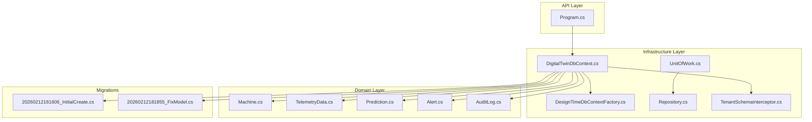
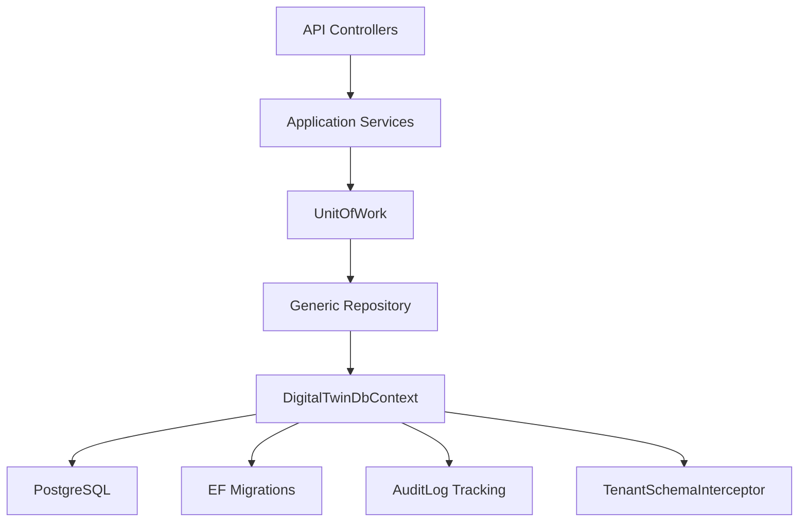
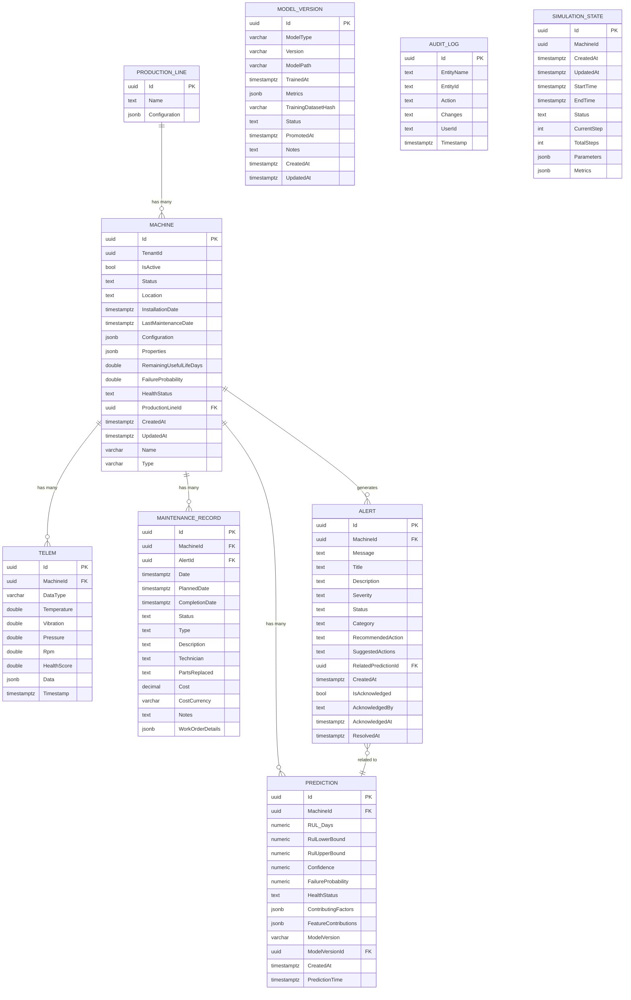
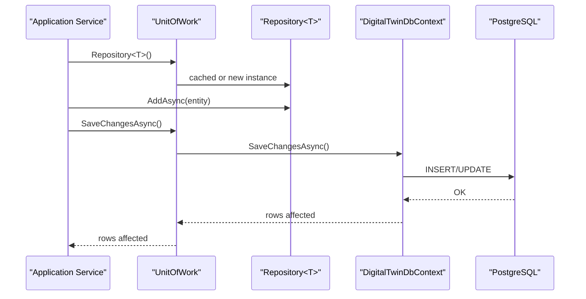
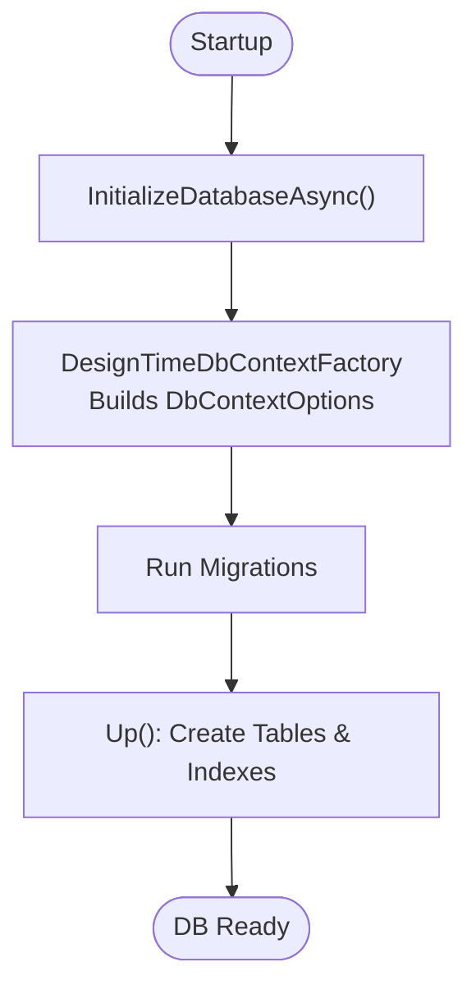
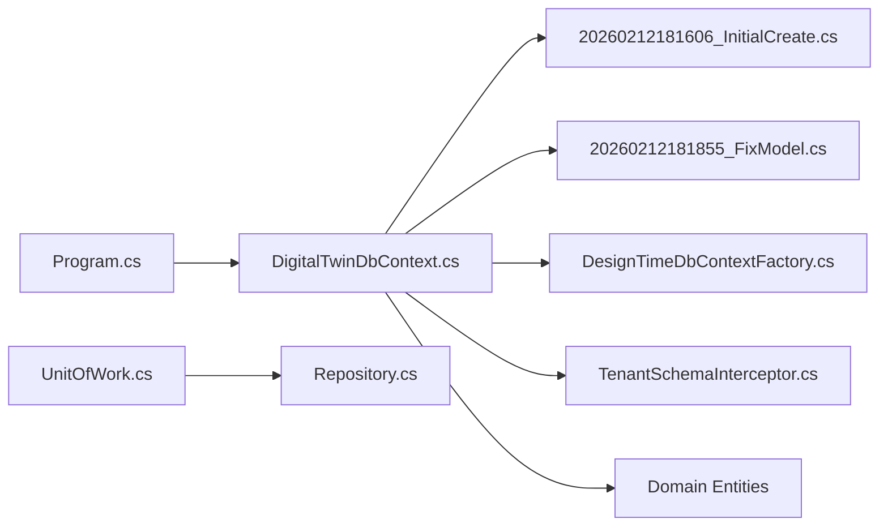

# Database Design

<cite>
**Referenced Files in This Document**
- [DigitalTwinDbContext.cs](file://src/api/DigitalTwinPlatform.Infrastructure/Persistence/DigitalTwinDbContext.cs)
- [20260212181606_InitialCreate.cs](file://src/api/DigitalTwinPlatform.Infrastructure/Migrations/20260212181606_InitialCreate.cs)
- [20260212181855_FixModel.cs](file://src/api/DigitalTwinPlatform.Infrastructure/Migrations/20260212181855_FixModel.cs)
- [Machine.cs](file://src/api/DigitalTwinPlatform.Domain/Entities/Machine.cs)
- [TelemetryData.cs](file://src/api/DigitalTwinPlatform.Domain/Entities/TelemetryData.cs)
- [Prediction.cs](file://src/api/DigitalTwinPlatform.Domain/Entities/Prediction.cs)
- [Alert.cs](file://src/api/DigitalTwinPlatform.Domain/Entities/Alert.cs)
- [AuditLog.cs](file://src/api/DigitalTwinPlatform.Domain/Entities/AuditLog.cs)
- [Repository.cs](file://src/api/DigitalTwinPlatform.Infrastructure/Persistence/Repositories/Repository.cs)
- [IRepository.cs](file://src/api/DigitalTwinPlatform.Application/Abstractions/Repositories/IRepository.cs)
- [UnitOfWork.cs](file://src/api/DigitalTwinPlatform.Infrastructure/Persistence/UnitOfWork/UnitOfWork.cs)
- [IUnitOfWork.cs](file://src/api/DigitalTwinPlatform.Application/Abstractions/UnitOfWork/IUnitOfWork.cs)
- [DesignTimeDbContextFactory.cs](file://src/api/DigitalTwinPlatform.Infrastructure/Persistence/DesignTimeDbContextFactory.cs)
- [TenantSchemaInterceptor.cs](file://src/api/DigitalTwinPlatform.Infrastructure/Tenancy/TenantSchemaInterceptor.cs)
- [Program.cs](file://src/api/DigitalTwinPlatform.API/Program.cs)
- [appsettings.json](file://src/api/DigitalTwinPlatform.API/appsettings.json)
</cite>

## Table of Contents
1. [Introduction](#introduction)
2. [Project Structure](#project-structure)
3. [Core Components](#core-components)
4. [Architecture Overview](#architecture-overview)
5. [Detailed Component Analysis](#detailed-component-analysis)
6. [Dependency Analysis](#dependency-analysis)
7. [Performance Considerations](#performance-considerations)
8. [Troubleshooting Guide](#troubleshooting-guide)
9. [Conclusion](#conclusion)
10. [Appendices](#appendices)

## Introduction
This document provides comprehensive database design documentation for the Digital Twin Platform. It covers the relational schema, entity relationships, JSONB-based flexible fields, indexes and constraints, validation and business rules, referential integrity, data access patterns via repositories and Unit of Work, Entity Framework configuration, schema evolution through migrations, and tenant isolation. It also outlines data lifecycle considerations and operational guidance for maintainability and performance.

## Project Structure
The database layer is implemented using Entity Framework Core with PostgreSQL and the Npgsql provider. The design-time factory configures migrations assembly and connection string resolution. The DbContext defines strongly-typed DbSets and applies value converters and indexes. Migrations capture the evolving schema over time.



**Diagram sources**
- [Program.cs](file://src/api/DigitalTwinPlatform.API/Program.cs#L55-L58)
- [DigitalTwinDbContext.cs](file://src/api/DigitalTwinPlatform.Infrastructure/Persistence/DigitalTwinDbContext.cs#L15-L48)
- [DesignTimeDbContextFactory.cs](file://src/api/DigitalTwinPlatform.Infrastructure/Persistence/DesignTimeDbContextFactory.cs#L7-L27)
- [UnitOfWork.cs](file://src/api/DigitalTwinPlatform.Infrastructure/Persistence/UnitOfWork/UnitOfWork.cs#L9-L26)
- [Repository.cs](file://src/api/DigitalTwinPlatform.Infrastructure/Persistence/Repositories/Repository.cs#L7-L10)
- [TenantSchemaInterceptor.cs](file://src/api/DigitalTwinPlatform.Infrastructure/Tenancy/TenantSchemaInterceptor.cs#L8-L36)
- [Machine.cs](file://src/api/DigitalTwinPlatform.Domain/Entities/Machine.cs#L9-L74)
- [TelemetryData.cs](file://src/api/DigitalTwinPlatform.Domain/Entities/TelemetryData.cs#L5-L24)
- [Prediction.cs](file://src/api/DigitalTwinPlatform.Domain/Entities/Prediction.cs#L7-L38)
- [Alert.cs](file://src/api/DigitalTwinPlatform.Domain/Entities/Alert.cs#L11-L41)
- [AuditLog.cs](file://src/api/DigitalTwinPlatform.Domain/Entities/AuditLog.cs#L3-L12)
- [20260212181606_InitialCreate.cs](file://src/api/DigitalTwinPlatform.Infrastructure/Migrations/20260212181606_InitialCreate.cs#L15-L615)
- [20260212181855_FixModel.cs](file://src/api/DigitalTwinPlatform.Infrastructure/Migrations/20260212181855_FixModel.cs#L13-L74)

**Section sources**
- [Program.cs](file://src/api/DigitalTwinPlatform.API/Program.cs#L55-L58)
- [DigitalTwinDbContext.cs](file://src/api/DigitalTwinPlatform.Infrastructure/Persistence/DigitalTwinDbContext.cs#L15-L48)
- [DesignTimeDbContextFactory.cs](file://src/api/DigitalTwinPlatform.Infrastructure/Persistence/DesignTimeDbContextFactory.cs#L7-L27)
- [20260212181606_InitialCreate.cs](file://src/api/DigitalTwinPlatform.Infrastructure/Migrations/20260212181606_InitialCreate.cs#L15-L615)
- [20260212181855_FixModel.cs](file://src/api/DigitalTwinPlatform.Infrastructure/Migrations/20260212181855_FixModel.cs#L13-L74)

## Core Components
- DbContext: Centralized persistence configuration, audit logging hooks, value converters, and entity configurations with indexes.
- Domain Entities: Strongly typed models with validation and domain methods.
- Repository Pattern: Generic repository abstraction and implementation for CRUD operations.
- Unit of Work: Transaction boundary management and shared DbContext across repositories.
- Migrations: Versioned schema evolution captured in migration files.
- Design-Time Factory: Configures migrations assembly and connection string for EF Core tools.
- Tenant Isolation: Command interceptor that sets Postgres search_path per tenant.

**Section sources**
- [DigitalTwinDbContext.cs](file://src/api/DigitalTwinPlatform.Infrastructure/Persistence/DigitalTwinDbContext.cs#L15-L48)
- [Machine.cs](file://src/api/DigitalTwinPlatform.Domain/Entities/Machine.cs#L9-L74)
- [TelemetryData.cs](file://src/api/DigitalTwinPlatform.Domain/Entities/TelemetryData.cs#L5-L24)
- [Prediction.cs](file://src/api/DigitalTwinPlatform.Domain/Entities/Prediction.cs#L7-L38)
- [Alert.cs](file://src/api/DigitalTwinPlatform.Domain/Entities/Alert.cs#L11-L41)
- [AuditLog.cs](file://src/api/DigitalTwinPlatform.Domain/Entities/AuditLog.cs#L3-L12)
- [Repository.cs](file://src/api/DigitalTwinPlatform.Infrastructure/Persistence/Repositories/Repository.cs#L7-L10)
- [IRepository.cs](file://src/api/DigitalTwinPlatform.Application/Abstractions/Repositories/IRepository.cs#L5-L15)
- [UnitOfWork.cs](file://src/api/DigitalTwinPlatform.Infrastructure/Persistence/UnitOfWork/UnitOfWork.cs#L9-L26)
- [IUnitOfWork.cs](file://src/api/DigitalTwinPlatform.Application/Abstractions/UnitOfWork/IUnitOfWork.cs#L9-L37)
- [DesignTimeDbContextFactory.cs](file://src/api/DigitalTwinPlatform.Infrastructure/Persistence/DesignTimeDbContextFactory.cs#L7-L27)
- [TenantSchemaInterceptor.cs](file://src/api/DigitalTwinPlatform.Infrastructure/Tenancy/TenantSchemaInterceptor.cs#L8-L36)

## Architecture Overview
The platform uses a layered architecture with a clear separation between API, Application, Infrastructure, and Domain layers. The database layer is encapsulated in the Infrastructure layer, exposing repositories and Unit of Work to the Application layer. Entity Framework handles mapping, migrations, and tenant isolation via a command interceptor.



**Diagram sources**
- [Program.cs](file://src/api/DigitalTwinPlatform.API/Program.cs#L42-L47)
- [IUnitOfWork.cs](file://src/api/DigitalTwinPlatform.Application/Abstractions/UnitOfWork/IUnitOfWork.cs#L9-L37)
- [IRepository.cs](file://src/api/DigitalTwinPlatform.Application/Abstractions/Repositories/IRepository.cs#L5-L15)
- [Repository.cs](file://src/api/DigitalTwinPlatform.Infrastructure/Persistence/Repositories/Repository.cs#L7-L10)
- [DigitalTwinDbContext.cs](file://src/api/DigitalTwinPlatform.Infrastructure/Persistence/DigitalTwinDbContext.cs#L15-L48)
- [TenantSchemaInterceptor.cs](file://src/api/DigitalTwinPlatform.Infrastructure/Tenancy/TenantSchemaInterceptor.cs#L8-L36)

## Detailed Component Analysis

### Database Schema and Entity Relationships
The schema centers around Machines, TelemetryData, Predictions, Alerts, MaintenanceRecords, ProductionLines, ModelVersions, AuditLogs, SimulationStates, and related entities. Relationships are defined via foreign keys and indexes optimize common queries.



**Diagram sources**
- [DigitalTwinDbContext.cs](file://src/api/DigitalTwinPlatform.Infrastructure/Persistence/DigitalTwinDbContext.cs#L102-L392)
- [20260212181606_InitialCreate.cs](file://src/api/DigitalTwinPlatform.Infrastructure/Migrations/20260212181606_InitialCreate.cs#L244-L401)

**Section sources**
- [DigitalTwinDbContext.cs](file://src/api/DigitalTwinPlatform.Infrastructure/Persistence/DigitalTwinDbContext.cs#L102-L392)
- [20260212181606_InitialCreate.cs](file://src/api/DigitalTwinPlatform.Infrastructure/Migrations/20260212181606_InitialCreate.cs#L244-L401)

### Data Types, Constraints, and JSONB Fields
- JSONB fields: Machines.Configuration, Machines.Properties, TelemetryData.Data, Predictions.ContributingFactors/FeatureContributions, ModelVersions.Metrics, SimulationStates.Parameters/Metrics, MaintenanceRecords.WorkOrderDetails, ProductionLines.Configuration.
- Numeric precision: decimal(18,2) for costs, decimal(5,4) for confidence/probability, decimal(18,4) for RUL bounds.
- Timestamps: timestamptz for timezone-aware timestamps.
- Enum conversions: Status, Severity, HealthStatus, Type fields mapped to text via value converters.
- Defaults: JsonDocument defaults for JSONB fields; empty string defaults for text fields where applicable.

**Section sources**
- [DigitalTwinDbContext.cs](file://src/api/DigitalTwinPlatform.Infrastructure/Persistence/DigitalTwinDbContext.cs#L130-L135)
- [DigitalTwinDbContext.cs](file://src/api/DigitalTwinPlatform.Infrastructure/Persistence/DigitalTwinDbContext.cs#L175-L177)
- [DigitalTwinDbContext.cs](file://src/api/DigitalTwinPlatform.Infrastructure/Persistence/DigitalTwinDbContext.cs#L209-L213)
- [DigitalTwinDbContext.cs](file://src/api/DigitalTwinPlatform.Infrastructure/Persistence/DigitalTwinDbContext.cs#L239-L239)
- [DigitalTwinDbContext.cs](file://src/api/DigitalTwinPlatform.Infrastructure/Persistence/DigitalTwinDbContext.cs#L285-L290)
- [DigitalTwinDbContext.cs](file://src/api/DigitalTwinPlatform.Infrastructure/Persistence/DigitalTwinDbContext.cs#L387-L390)

### Indexes and Performance Considerations
Indexes are defined to accelerate frequent queries:
- Machines: Status, IsActive, Location, HealthStatus, RemainingUsefulLifeDays.
- TelemetryData: MachineId, Timestamp, MachineId+Timestamp, HealthScore.
- MaintenanceRecords: MachineId, Date, Status, Type, Technician.
- Predictions: MachineId, CreatedAt, Confidence, HealthStatus, MachineId+CreatedAt, HealthStatus+FailureProbability.
- Alerts: MachineId, CreatedAt, Severity, Status, IsAcknowledged, MachineId+IsAcknowledged.
- AuditLogs: Timestamp, EntityName, UserId.
- ModelVersions: ModelType+Version (unique), ModelType+Status.

These indexes align with typical analytical and operational workloads (time-series queries, filtering by status, and join-heavy analytics).

**Section sources**
- [DigitalTwinDbContext.cs](file://src/api/DigitalTwinPlatform.Infrastructure/Persistence/DigitalTwinDbContext.cs#L155-L161)
- [DigitalTwinDbContext.cs](file://src/api/DigitalTwinPlatform.Infrastructure/Persistence/DigitalTwinDbContext.cs#L189-L194)
- [DigitalTwinDbContext.cs](file://src/api/DigitalTwinPlatform.Infrastructure/Persistence/DigitalTwinDbContext.cs#L224-L230)
- [DigitalTwinDbContext.cs](file://src/api/DigitalTwinPlatform.Infrastructure/Persistence/DigitalTwinDbContext.cs#L272-L279)
- [DigitalTwinDbContext.cs](file://src/api/DigitalTwinPlatform.Infrastructure/Persistence/DigitalTwinDbContext.cs#L318-L325)
- [DigitalTwinDbContext.cs](file://src/api/DigitalTwinPlatform.Infrastructure/Persistence/DigitalTwinDbContext.cs#L337-L340)
- [DigitalTwinDbContext.cs](file://src/api/DigitalTwinPlatform.Infrastructure/Persistence/DigitalTwinDbContext.cs#L246-L249)
- [20260212181606_InitialCreate.cs](file://src/api/DigitalTwinPlatform.Infrastructure/Migrations/20260212181606_InitialCreate.cs#L403-L615)

### Data Validation and Business Rules
- Machine:
  - Activation/deactivation toggles IsActive.
  - Status updates enforce invariants.
  - Health metrics validation: non-negative RUL, 0–1 failure probability.
  - Property/configuration updates reject null documents.
  - Location non-empty, installation date not in the future, maintenance dates validated accordingly.
- TelemetryData:
  - HealthScore computed from raw sensors with bounded scoring.
- Prediction:
  - Confidence and failure probability clamped to [0,1].
  - RUL bounds computed from confidence intervals.
  - Validity checks ensure meaningful predictions.
- Alert:
  - Severity-based criticality checks.
  - Acknowledgement and resolution state transitions.
- AuditLog:
  - Automatic capture of entity changes with JSON of modified properties.

**Section sources**
- [Machine.cs](file://src/api/DigitalTwinPlatform.Domain/Entities/Machine.cs#L76-L210)
- [TelemetryData.cs](file://src/api/DigitalTwinPlatform.Domain/Entities/TelemetryData.cs#L53-L92)
- [Prediction.cs](file://src/api/DigitalTwinPlatform.Domain/Entities/Prediction.cs#L67-L92)
- [Alert.cs](file://src/api/DigitalTwinPlatform.Domain/Entities/Alert.cs#L78-L112)
- [DigitalTwinDbContext.cs](file://src/api/DigitalTwinPlatform.Infrastructure/Persistence/DigitalTwinDbContext.cs#L50-L86)

### Referential Integrity and Cascade Behavior
- Machines → ProductionLines (one-to-many).
- Machines → TelemetryData, Predictions, MaintenanceRecords (one-to-many).
- Alerts → Predictions (optional, delete set null).
- Predictions → ModelVersions (optional FK).
- MaintenanceRecords → Alerts (optional FK).

Cascading deletes are applied where appropriate to maintain consistency for child records.

**Section sources**
- [DigitalTwinDbContext.cs](file://src/api/DigitalTwinPlatform.Infrastructure/Persistence/DigitalTwinDbContext.cs#L142-L154)
- [DigitalTwinDbContext.cs](file://src/api/DigitalTwinPlatform.Infrastructure/Persistence/DigitalTwinDbContext.cs#L185-L187)
- [DigitalTwinDbContext.cs](file://src/api/DigitalTwinPlatform.Infrastructure/Persistence/DigitalTwinDbContext.cs#L268-L270)
- [DigitalTwinDbContext.cs](file://src/api/DigitalTwinPlatform.Infrastructure/Persistence/DigitalTwinDbContext.cs#L310-L316)
- [20260212181606_InitialCreate.cs](file://src/api/DigitalTwinPlatform.Infrastructure/Migrations/20260212181606_InitialCreate.cs#L268-L307)

### Data Access Patterns, Repository, and Unit of Work
- Generic Repository<T>: Provides Get, GetAll, Add, AddRange, Update, Delete, DeleteRange, SaveChanges with optional predicate, paging, and NoTracking.
- Unit of Work: Shared DbContext, transaction control, and repository caching per type.
- Usage: Application services resolve IUnitOfWork, call Repository<T>(), perform operations, then SaveChangesAsync within a transaction boundary.



**Diagram sources**
- [IRepository.cs](file://src/api/DigitalTwinPlatform.Application/Abstractions/Repositories/IRepository.cs#L5-L15)
- [Repository.cs](file://src/api/DigitalTwinPlatform.Infrastructure/Persistence/Repositories/Repository.cs#L7-L40)
- [IUnitOfWork.cs](file://src/api/DigitalTwinPlatform.Application/Abstractions/UnitOfWork/IUnitOfWork.cs#L9-L37)
- [UnitOfWork.cs](file://src/api/DigitalTwinPlatform.Infrastructure/Persistence/UnitOfWork/UnitOfWork.cs#L9-L36)

**Section sources**
- [IRepository.cs](file://src/api/DigitalTwinPlatform.Application/Abstractions/Repositories/IRepository.cs#L5-L15)
- [Repository.cs](file://src/api/DigitalTwinPlatform.Infrastructure/Persistence/Repositories/Repository.cs#L7-L40)
- [IUnitOfWork.cs](file://src/api/DigitalTwinPlatform.Application/Abstractions/UnitOfWork/IUnitOfWork.cs#L9-L37)
- [UnitOfWork.cs](file://src/api/DigitalTwinPlatform.Infrastructure/Persistence/UnitOfWork/UnitOfWork.cs#L9-L36)

### Entity Framework Configuration and Migrations
- DbContext: Registers value converters for value objects, configures audit logging hooks, and defines entity mappings and indexes.
- DesignTimeDbContextFactory: Builds options with Npgsql provider, sets migrations assembly, and reads connection string from appsettings.
- Migrations:
  - InitialCreate: Creates all tables, indexes, and foreign keys.
  - FixModel: Adjusts default values for JSONB fields to JsonDocument defaults.



**Diagram sources**
- [Program.cs](file://src/api/DigitalTwinPlatform.API/Program.cs#L55-L58)
- [DesignTimeDbContextFactory.cs](file://src/api/DigitalTwinPlatform.Infrastructure/Persistence/DesignTimeDbContextFactory.cs#L7-L27)
- [20260212181606_InitialCreate.cs](file://src/api/DigitalTwinPlatform.Infrastructure/Migrations/20260212181606_InitialCreate.cs#L15-L615)
- [20260212181855_FixModel.cs](file://src/api/DigitalTwinPlatform.Infrastructure/Migrations/20260212181855_FixModel.cs#L13-L74)

**Section sources**
- [DigitalTwinDbContext.cs](file://src/api/DigitalTwinPlatform.Infrastructure/Persistence/DigitalTwinDbContext.cs#L88-L393)
- [DesignTimeDbContextFactory.cs](file://src/api/DigitalTwinPlatform.Infrastructure/Persistence/DesignTimeDbContextFactory.cs#L7-L27)
- [20260212181606_InitialCreate.cs](file://src/api/DigitalTwinPlatform.Infrastructure/Migrations/20260212181606_InitialCreate.cs#L15-L615)
- [20260212181855_FixModel.cs](file://src/api/DigitalTwinPlatform.Infrastructure/Migrations/20260212181855_FixModel.cs#L13-L74)

### Tenant Isolation and Multi-Tenancy
TenantSchemaInterceptor modifies each command to set Postgres search_path dynamically:
- For tenant-specific schemas: tenant_{TenantId}, public.
- For public tenant: public only.
This ensures data isolation and allows per-tenant customization while sharing common schema objects.

```mermaid
sequenceDiagram
participant APP as "Application"
participant INT as "TenantSchemaInterceptor"
participant CMD as "NpgsqlCommand"
participant DB as "PostgreSQL"
APP->>INT : ReaderExecuting(...)
INT->>CMD : ApplySchema()
CMD->>DB : SET search_path TO tenant_{id}, public; [SQL]
DB-->>APP : Results
```

**Diagram sources**
- [TenantSchemaInterceptor.cs](file://src/api/DigitalTwinPlatform.Infrastructure/Tenancy/TenantSchemaInterceptor.cs#L8-L36)

**Section sources**
- [TenantSchemaInterceptor.cs](file://src/api/DigitalTwinPlatform.Infrastructure/Tenancy/TenantSchemaInterceptor.cs#L8-L36)

### Sample Data Structures
- Machine: Contains identification, location, dates, JSONB configuration/properties, health metrics, and relationships to telemetry, predictions, and maintenance.
- TelemetryData: Sensor readings (temperature, vibration, pressure, rpm), computed health score, JSONB payload, and timestamp.
- Prediction: RUL estimates with confidence bounds, health classification, JSONB feature contributions, and model metadata.
- Alert: Severity, status, acknowledgment fields, and optional relationship to a prediction.
- AuditLog: Captures entity changes with JSON of modified properties.

**Section sources**
- [Machine.cs](file://src/api/DigitalTwinPlatform.Domain/Entities/Machine.cs#L40-L74)
- [TelemetryData.cs](file://src/api/DigitalTwinPlatform.Domain/Entities/TelemetryData.cs#L10-L24)
- [Prediction.cs](file://src/api/DigitalTwinPlatform.Domain/Entities/Prediction.cs#L13-L38)
- [Alert.cs](file://src/api/DigitalTwinPlatform.Domain/Entities/Alert.cs#L17-L41)
- [AuditLog.cs](file://src/api/DigitalTwinPlatform.Domain/Entities/AuditLog.cs#L3-L12)

## Dependency Analysis
The following diagram shows key dependencies among database-related components:



**Diagram sources**
- [Program.cs](file://src/api/DigitalTwinPlatform.API/Program.cs#L55-L58)
- [DigitalTwinDbContext.cs](file://src/api/DigitalTwinPlatform.Infrastructure/Persistence/DigitalTwinDbContext.cs#L15-L48)
- [20260212181606_InitialCreate.cs](file://src/api/DigitalTwinPlatform.Infrastructure/Migrations/20260212181606_InitialCreate.cs#L15-L615)
- [20260212181855_FixModel.cs](file://src/api/DigitalTwinPlatform.Infrastructure/Migrations/20260212181855_FixModel.cs#L13-L74)
- [DesignTimeDbContextFactory.cs](file://src/api/DigitalTwinPlatform.Infrastructure/Persistence/DesignTimeDbContextFactory.cs#L7-L27)
- [TenantSchemaInterceptor.cs](file://src/api/DigitalTwinPlatform.Infrastructure/Tenancy/TenantSchemaInterceptor.cs#L8-L36)
- [UnitOfWork.cs](file://src/api/DigitalTwinPlatform.Infrastructure/Persistence/UnitOfWork/UnitOfWork.cs#L9-L26)
- [Repository.cs](file://src/api/DigitalTwinPlatform.Infrastructure/Persistence/Repositories/Repository.cs#L7-L10)

**Section sources**
- [Program.cs](file://src/api/DigitalTwinPlatform.API/Program.cs#L55-L58)
- [DigitalTwinDbContext.cs](file://src/api/DigitalTwinPlatform.Infrastructure/Persistence/DigitalTwinDbContext.cs#L15-L48)
- [20260212181606_InitialCreate.cs](file://src/api/DigitalTwinPlatform.Infrastructure/Migrations/20260212181606_InitialCreate.cs#L15-L615)
- [20260212181855_FixModel.cs](file://src/api/DigitalTwinPlatform.Infrastructure/Migrations/20260212181855_FixModel.cs#L13-L74)
- [DesignTimeDbContextFactory.cs](file://src/api/DigitalTwinPlatform.Infrastructure/Persistence/DesignTimeDbContextFactory.cs#L7-L27)
- [TenantSchemaInterceptor.cs](file://src/api/DigitalTwinPlatform.Infrastructure/Tenancy/TenantSchemaInterceptor.cs#L8-L36)
- [UnitOfWork.cs](file://src/api/DigitalTwinPlatform.Infrastructure/Persistence/UnitOfWork/UnitOfWork.cs#L9-L26)
- [Repository.cs](file://src/api/DigitalTwinPlatform.Infrastructure/Persistence/Repositories/Repository.cs#L7-L10)

## Performance Considerations
- Prefer filtered and indexed queries using MachineId+Timestamp for telemetry, MachineId+CreatedAt for predictions, and Status/Health filters.
- Use AsNoTracking for read-only projections to reduce change tracking overhead.
- Batch inserts via AddRangeAsync to minimize round-trips.
- Keep JSONB payloads concise; avoid storing redundant fields.
- Monitor slow query logs and add composite indexes for frequently filtered predicates.

[No sources needed since this section provides general guidance]

## Troubleshooting Guide
- Audit Trail: Review AuditLog entries for detected changes and action timestamps to diagnose unexpected updates.
- Tenant Isolation: If queries return unexpected data, verify TenantSchemaInterceptor is applied and search_path is set correctly.
- Migration Issues: Use DesignTimeDbContextFactory to regenerate migrations and ensure migrations assembly matches the compiled assembly.
- Concurrency: UnitOfWork wraps SaveChangesAsync and handles concurrency exceptions; inspect tracked entries for conflicting modifications.

**Section sources**
- [DigitalTwinDbContext.cs](file://src/api/DigitalTwinPlatform.Infrastructure/Persistence/DigitalTwinDbContext.cs#L50-L86)
- [TenantSchemaInterceptor.cs](file://src/api/DigitalTwinPlatform.Infrastructure/Tenancy/TenantSchemaInterceptor.cs#L22-L35)
- [DesignTimeDbContextFactory.cs](file://src/api/DigitalTwinPlatform.Infrastructure/Persistence/DesignTimeDbContextFactory.cs#L7-L27)
- [UnitOfWork.cs](file://src/api/DigitalTwinPlatform.Infrastructure/Persistence/UnitOfWork/UnitOfWork.cs#L30-L36)

## Conclusion
The Digital Twin Platform database design leverages PostgreSQL’s JSONB capabilities for flexible sensor data, robust indexing for performance, and strong domain models with validation. The Entity Framework configuration centralizes auditing and tenant isolation, while migrations provide a clear evolution path. Together, these elements support scalable, maintainable, and secure operations across multi-tenant environments.

[No sources needed since this section summarizes without analyzing specific files]

## Appendices

### Appendix A: Connection Strings and Configuration
- DefaultConnection: Host, Database, Username, Password configured in appsettings.
- SignalR and JWT settings influence runtime behavior but do not alter schema.

**Section sources**
- [appsettings.json](file://src/api/DigitalTwinPlatform.API/appsettings.json#L2-L6)

### Appendix B: Schema Evolution Checklist
- After adding new tables/columns, define indexes and constraints in OnModelCreating and create a new migration.
- For JSONB defaults, ensure JsonDocument defaults match the model configuration.
- Test tenant isolation with TenantSchemaInterceptor enabled.
- Validate audit log coverage for sensitive entities.

**Section sources**
- [DigitalTwinDbContext.cs](file://src/api/DigitalTwinPlatform.Infrastructure/Persistence/DigitalTwinDbContext.cs#L88-L393)
- [20260212181606_InitialCreate.cs](file://src/api/DigitalTwinPlatform.Infrastructure/Migrations/20260212181606_InitialCreate.cs#L15-L615)
- [20260212181855_FixModel.cs](file://src/api/DigitalTwinPlatform.Infrastructure/Migrations/20260212181855_FixModel.cs#L13-L74)
- [TenantSchemaInterceptor.cs](file://src/api/DigitalTwinPlatform.Infrastructure/Tenancy/TenantSchemaInterceptor.cs#L22-L35)