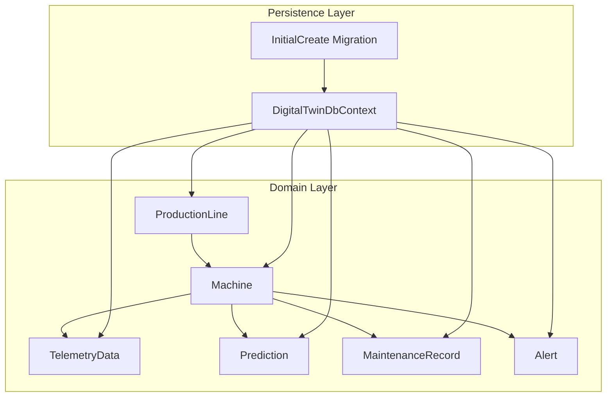
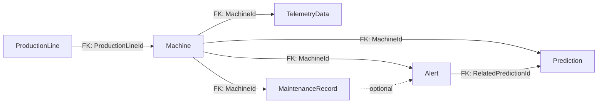

# Entity Relationship Model

<cite>
**Referenced Files in This Document**
- [DigitalTwinDbContext.cs](file://src/api/DigitalTwinPlatform.Infrastructure/Persistence/DigitalTwinDbContext.cs)
- [20260212181606_InitialCreate.cs](file://src/api/DigitalTwinPlatform.Infrastructure/Migrations/20260212181606_InitialCreate.cs)
- [Machine.cs](file://src/api/DigitalTwinPlatform.Domain/Entities/Machine.cs)
- [ProductionLine.cs](file://src/api/DigitalTwinPlatform.Domain/Entities/ProductionLine.cs)
- [TelemetryData.cs](file://src/api/DigitalTwinPlatform.Domain/Entities/TelemetryData.cs)
- [Prediction.cs](file://src/api/DigitalTwinPlatform.Domain/Entities/Prediction.cs)
- [MaintenanceRecord.cs](file://src/api/DigitalTwinPlatform.Domain/Entities/MaintenanceRecord.cs)
- [Alert.cs](file://src/api/DigitalTwinPlatform.Domain/Entities/Alert.cs)
- [MachineName.cs](file://src/api/DigitalTwinPlatform.Domain/ValueObjects/MachineName.cs)
- [MachineType.cs](file://src/api/DigitalTwinPlatform.Domain/ValueObjects/MachineType.cs)
</cite>

## Table of Contents
1. [Introduction](#introduction)
2. [Project Structure](#project-structure)
3. [Core Components](#core-components)
4. [Architecture Overview](#architecture-overview)
5. [Detailed Component Analysis](#detailed-component-analysis)
6. [Dependency Analysis](#dependency-analysis)
7. [Performance Considerations](#performance-considerations)
8. [Troubleshooting Guide](#troubleshooting-guide)
9. [Conclusion](#conclusion)

## Introduction
This document provides a comprehensive entity relationship model for the Digital Twin Platform database schema. It focuses on the core domain entities: ProductionLine, Machine, TelemetryData, Prediction, MaintenanceRecord, and Alert. It documents primary keys, foreign keys, referential integrity, cascade behaviors, indexes, JSONB usage, value object conversions, and tenant-related fields. The goal is to enable both technical and non-technical stakeholders to understand how data is structured, related, and constrained.

## Project Structure
The database schema is defined in the infrastructure persistence layer and reflected in migrations. The domain entities define the business model and relationships, while the persistence layer translates these into relational constraints and indexes.



**Diagram sources**
- [DigitalTwinDbContext.cs](file://src/api/DigitalTwinPlatform.Infrastructure/Persistence/DigitalTwinDbContext.cs#L88-L394)
- [20260212181606_InitialCreate.cs](file://src/api/DigitalTwinPlatform.Infrastructure/Migrations/20260212181606_InitialCreate.cs#L15-L670)

**Section sources**
- [DigitalTwinDbContext.cs](file://src/api/DigitalTwinPlatform.Infrastructure/Persistence/DigitalTwinDbContext.cs#L15-L41)
- [20260212181606_InitialCreate.cs](file://src/api/DigitalTwinPlatform.Infrastructure/Migrations/20260212181606_InitialCreate.cs#L15-L670)

## Core Components
This section summarizes the six core entities and their roles in the platform.

- ProductionLine: Top-level grouping of machines on a production line. Supports flexible configuration via JSONB.
- Machine: Core asset with identity, status, location, health metrics, and lifecycle timestamps. Links to ProductionLine and contains collections of TelemetryData, Predictions, and MaintenanceRecords.
- TelemetryData: Time-series telemetry records per machine, with JSONB for flexible metric storage and computed health scores.
- Prediction: Predictive analytics outputs for Remaining Useful Life (RUL), confidence, failure probability, and contributing factors.
- MaintenanceRecord: Records of maintenance actions linked to machines and optionally to Alerts.
- Alert: Operational notifications with severity, status, acknowledgment, and optional linkage to Predictions.

**Section sources**
- [ProductionLine.cs](file://src/api/DigitalTwinPlatform.Domain/Entities/ProductionLine.cs#L5-L11)
- [Machine.cs](file://src/api/DigitalTwinPlatform.Domain/Entities/Machine.cs#L9-L74)
- [TelemetryData.cs](file://src/api/DigitalTwinPlatform.Domain/Entities/TelemetryData.cs#L5-L24)
- [Prediction.cs](file://src/api/DigitalTwinPlatform.Domain/Entities/Prediction.cs#L7-L38)
- [MaintenanceRecord.cs](file://src/api/DigitalTwinPlatform.Domain/Entities/MaintenanceRecord.cs#L21-L49)
- [Alert.cs](file://src/api/DigitalTwinPlatform.Domain/Entities/Alert.cs#L11-L41)

## Architecture Overview
The persistence layer defines entity shapes, relationships, and constraints. The migration script reflects the initial schema creation and indexes. Value converters transform value objects into database columns, and JSONB columns store flexible data.

```mermaid
erDiagram
PRODUCTION_LINE {
uuid Id PK
text Name
jsonb Configuration
}
MACHINE {
uuid Id PK
uuid TenantId
boolean IsActive
text Status
text Location
timestamptz InstallationDate
timestamptz LastMaintenanceDate
jsonb Configuration
jsonb Properties
double RemainingUsefulLifeDays
double FailureProbability
text HealthStatus
uuid ProductionLineId FK
timestamptz CreatedAt
timestamptz UpdatedAt
text Name
text Type
}
TELEMETRY_DATA {
uuid Id PK
uuid MachineId FK
text DataType
double Temperature
double Vibration
double Pressure
double Rpm
double HealthScore
jsonb Data
timestamptz Timestamp
}
PREDICTION {
uuid Id PK
uuid MachineId FK
double RemainingUsefulLifeDays
double RulLowerBound
double RulUpperBound
numeric(5,4) Confidence
numeric(5,4) FailureProbability
text HealthStatus
jsonb ContributingFactors
jsonb FeatureContributions
text ModelVersion
uuid ModelVersionId
timestamptz CreatedAt
timestamptz PredictionTime
}
MAINTENANCE_RECORD {
uuid Id PK
uuid MachineId FK
uuid AlertId FK
timestamptz Date
timestamptz PlannedDate
timestamptz CompletionDate
text Status
text Type
text Description
text Technician
text PartsReplaced
decimal(18,2) Cost
text CostCurrency
text Notes
jsonb WorkOrderDetails
}
ALERT {
uuid Id PK
uuid MachineId FK
text Message
text Severity
uuid RelatedPredictionId FK
timestamptz CreatedAt
boolean IsAcknowledged
text AcknowledgedBy
timestamptz AcknowledgedAt
}
PRODUCTION_LINE ||--o{ MACHINE : "has many"
MACHINE ||--o{ TELEMETRY_DATA : "has many"
MACHINE ||--o{ PREDICTION : "has many"
MACHINE ||--o{ MAINTENANCE_RECORD : "has many"
MACHINE ||--o{ ALERT : "has many"
ALERT }o--|| PREDICTION : "references"
```

**Diagram sources**
- [DigitalTwinDbContext.cs](file://src/api/DigitalTwinPlatform.Infrastructure/Persistence/DigitalTwinDbContext.cs#L102-L325)
- [20260212181606_InitialCreate.cs](file://src/api/DigitalTwinPlatform.Infrastructure/Migrations/20260212181606_InitialCreate.cs#L104-L401)

## Detailed Component Analysis

### ProductionLine
- Purpose: Group machines by production line with configurable metadata.
- Primary key: Id
- Constraints: None beyond standard primary key.
- JSONB: Configuration supports flexible metadata storage.
- Cardinality: One ProductionLine to many Machines.

**Section sources**
- [ProductionLine.cs](file://src/api/DigitalTwinPlatform.Domain/Entities/ProductionLine.cs#L5-L11)
- [DigitalTwinDbContext.cs](file://src/api/DigitalTwinPlatform.Infrastructure/Persistence/DigitalTwinDbContext.cs#L163-L169)
- [20260212181606_InitialCreate.cs](file://src/api/DigitalTwinPlatform.Infrastructure/Migrations/20260212181606_InitialCreate.cs#L104-L114)

### Machine
- Purpose: Represents physical equipment with status, health metrics, configuration, and lifecycle.
- Primary key: Id
- Foreign keys:
  - ProductionLineId → ProductionLine.Id
- Value object conversions:
  - Name → string via MachineName converter
  - Type → string via MachineType converter
- JSONB columns:
  - Configuration: flexible machine configuration
  - Properties: runtime or operational properties
- Cascade behavior:
  - Predictions: DeleteBehavior.Cascade (refer to migration FK)
  - TelemetryData: DeleteBehavior.Cascade (refer to migration FK)
  - MaintenanceRecords: DeleteBehavior.Cascade (refer to migration FK)
  - Alerts: DeleteBehavior.Cascade (refer to migration FK)
- Indexes: Status, IsActive, Location, HealthStatus, RemainingUsefulLifeDays.
- Cardinality:
  - Many Machines under one ProductionLine
  - One Machine to many TelemetryData
  - One Machine to many Predictions
  - One Machine to many MaintenanceRecords
  - One Machine to many Alerts

**Section sources**
- [Machine.cs](file://src/api/DigitalTwinPlatform.Domain/Entities/Machine.cs#L9-L74)
- [DigitalTwinDbContext.cs](file://src/api/DigitalTwinPlatform.Infrastructure/Persistence/DigitalTwinDbContext.cs#L102-L161)
- [20260212181606_InitialCreate.cs](file://src/api/DigitalTwinPlatform.Infrastructure/Migrations/20260212181606_InitialCreate.cs#L244-L273)

### TelemetryData
- Purpose: Stores time-stamped telemetry readings and computed health metrics.
- Primary key: Id
- Foreign key: MachineId → Machine.Id
- JSONB: Data for additional metrics beyond core sensors.
- Indexes: MachineId, Timestamp, MachineId+Timestamp, HealthScore.
- Cascade behavior: DeleteBehavior.Cascade (refer to migration FK).
- Cardinality: One Machine to many TelemetryData.

**Section sources**
- [TelemetryData.cs](file://src/api/DigitalTwinPlatform.Domain/Entities/TelemetryData.cs#L5-L24)
- [DigitalTwinDbContext.cs](file://src/api/DigitalTwinPlatform.Infrastructure/Persistence/DigitalTwinDbContext.cs#L171-L194)
- [20260212181606_InitialCreate.cs](file://src/api/DigitalTwinPlatform.Infrastructure/Migrations/20260212181606_InitialCreate.cs#L311-L334)

### Prediction
- Purpose: Predictive analytics outputs including RUL, confidence, failure probability, and contributing factors.
- Primary key: Id
- Foreign keys:
  - MachineId → Machine.Id
  - ModelVersionId → ModelVersions.Id (not part of this document’s scope)
- JSONB: ContributingFactors, FeatureContributions.
- Indexes: MachineId, CreatedAt, Confidence, HealthStatus, MachineId+CreatedAt, HealthStatus+FailureProbability.
- Cascade behavior: DeleteBehavior.Cascade (refer to migration FK).
- Cardinality: One Machine to many Predictions.

**Section sources**
- [Prediction.cs](file://src/api/DigitalTwinPlatform.Domain/Entities/Prediction.cs#L7-L38)
- [DigitalTwinDbContext.cs](file://src/api/DigitalTwinPlatform.Infrastructure/Persistence/DigitalTwinDbContext.cs#L251-L279)
- [20260212181606_InitialCreate.cs](file://src/api/DigitalTwinPlatform.Infrastructure/Migrations/20260212181606_InitialCreate.cs#L276-L308)

### MaintenanceRecord
- Purpose: Tracks maintenance events against machines and optionally linked to Alerts.
- Primary key: Id
- Foreign keys:
  - MachineId → Machine.Id
  - AlertId → Alert.Id
- JSONB: WorkOrderDetails.
- Indexes: MachineId, Date, Status, Type, Technician.
- Cascade behavior:
  - MachineId: DeleteBehavior.Cascade (refer to migration FK)
  - AlertId: No explicit cascade in migration; depends on domain usage.
- Cardinality: One Machine to many MaintenanceRecords; optional Alert linkage.

**Section sources**
- [MaintenanceRecord.cs](file://src/api/DigitalTwinPlatform.Domain/Entities/MaintenanceRecord.cs#L21-L49)
- [DigitalTwinDbContext.cs](file://src/api/DigitalTwinPlatform.Infrastructure/Persistence/DigitalTwinDbContext.cs#L196-L230)
- [20260212181606_InitialCreate.cs](file://src/api/DigitalTwinPlatform.Infrastructure/Migrations/20260212181606_InitialCreate.cs#L368-L401)

### Alert
- Purpose: Operational notifications with severity, status, acknowledgment, and optional linkage to Predictions.
- Primary key: Id
- Foreign keys:
  - MachineId → Machine.Id
  - RelatedPredictionId → Prediction.Id (DeleteBehavior.SetNull)
- Indexes: MachineId, CreatedAt, Severity, Status, IsAcknowledged, MachineId+IsAcknowledged.
- Cascade behavior:
  - MachineId: DeleteBehavior.Cascade (refer to migration FK)
  - RelatedPredictionId: DeleteBehavior.SetNull (refer to migration FK)
- Cardinality: One Machine to many Alerts; optional Prediction linkage.

**Section sources**
- [Alert.cs](file://src/api/DigitalTwinPlatform.Domain/Entities/Alert.cs#L11-L41)
- [DigitalTwinDbContext.cs](file://src/api/DigitalTwinPlatform.Infrastructure/Persistence/DigitalTwinDbContext.cs#L294-L325)
- [20260212181606_InitialCreate.cs](file://src/api/DigitalTwinPlatform.Infrastructure/Migrations/20260212181606_InitialCreate.cs#L337-L365)

### Value Objects and JSONB Columns
- Value object conversions:
  - MachineName → string conversion applied to Machine._name
  - MachineType → string conversion applied to Machine._type
- JSONB usage:
  - Machine.Configuration and Machine.Properties
  - TelemetryData.Data
  - Prediction.ContributingFactors, Prediction.FeatureContributions
  - MaintenanceRecord.WorkOrderDetails
  - Other entities with JSONB columns as defined in the persistence layer.

**Section sources**
- [DigitalTwinDbContext.cs](file://src/api/DigitalTwinPlatform.Infrastructure/Persistence/DigitalTwinDbContext.cs#L94-L101)
- [DigitalTwinDbContext.cs](file://src/api/DigitalTwinPlatform.Infrastructure/Persistence/DigitalTwinDbContext.cs#L130-L136)
- [DigitalTwinDbContext.cs](file://src/api/DigitalTwinPlatform.Infrastructure/Persistence/DigitalTwinDbContext.cs#L175-L177)
- [DigitalTwinDbContext.cs](file://src/api/DigitalTwinPlatform.Infrastructure/Persistence/DigitalTwinDbContext.cs#L262-L266)
- [DigitalTwinDbContext.cs](file://src/api/DigitalTwinPlatform.Infrastructure/Persistence/DigitalTwinDbContext.cs#L214-L215)

### Tenant Isolation Pattern
- TenantId field exists on Machine and User entities, enabling tenant scoping.
- Tenant schema interceptor and tenant context middleware are configured in the API startup pipeline, indicating tenant-aware operations.
- This pattern isolates data per tenant at the application level, complemented by database-level TenantId fields.

**Section sources**
- [DigitalTwinDbContext.cs](file://src/api/DigitalTwinPlatform.Infrastructure/Persistence/DigitalTwinDbContext.cs#L25-L31)
- [20260212181606_InitialCreate.cs](file://src/api/DigitalTwinPlatform.Infrastructure/Migrations/20260212181606_InitialCreate.cs#L41-L43)
- [Program.cs](file://src/api/DigitalTwinPlatform.API/Program.cs#L62-L62)

## Dependency Analysis
This section maps foreign key dependencies and cascade behaviors across entities.



**Diagram sources**
- [DigitalTwinDbContext.cs](file://src/api/DigitalTwinPlatform.Infrastructure/Persistence/DigitalTwinDbContext.cs#L142-L153)
- [20260212181606_InitialCreate.cs](file://src/api/DigitalTwinPlatform.Infrastructure/Migrations/20260212181606_InitialCreate.cs#L268-L364)

**Section sources**
- [DigitalTwinDbContext.cs](file://src/api/DigitalTwinPlatform.Infrastructure/Persistence/DigitalTwinDbContext.cs#L142-L153)
- [20260212181606_InitialCreate.cs](file://src/api/DigitalTwinPlatform.Infrastructure/Migrations/20260212181606_InitialCreate.cs#L268-L364)

## Performance Considerations
- Indexes are defined on frequently queried columns:
  - Machine: Status, IsActive, Location, HealthStatus, RemainingUsefulLifeDays
  - TelemetryData: MachineId, Timestamp, MachineId+Timestamp, HealthScore
  - Predictions: MachineId, CreatedAt, Confidence, HealthStatus, MachineId+CreatedAt, HealthStatus+FailureProbability
  - MaintenanceRecords: MachineId, Date, Status, Type, Technician
  - Alerts: MachineId, CreatedAt, Severity, Status, IsAcknowledged, MachineId+IsAcknowledged
- JSONB columns enable flexible storage but may require GIN indexing for complex queries; current migrations define standard B-tree indexes on scalar fields.

[No sources needed since this section provides general guidance]

## Troubleshooting Guide
- Cascade deletion behavior:
  - Deleting a Machine cascades to TelemetryData, Predictions, MaintenanceRecords, and Alerts.
  - Deleting an Alert does not cascade to MaintenanceRecords; only the Alert row is removed.
  - RelatedPredictionId on Alert uses DeleteBehavior.SetNull, allowing Alerts to persist without a related Prediction.
- Value object conversion errors:
  - Ensure MachineName and MachineType values conform to expected formats; conversion failures will occur if values are invalid.
- JSONB constraints:
  - Ensure JSONB fields are valid JSON; malformed JSON may cause deserialization errors at the application layer.
- Tenant scoping:
  - Verify TenantId is set on Machine and User entities; otherwise, cross-tenant data leakage may occur.

**Section sources**
- [20260212181606_InitialCreate.cs](file://src/api/DigitalTwinPlatform.Infrastructure/Migrations/20260212181606_InitialCreate.cs#L302-L302)
- [20260212181606_InitialCreate.cs](file://src/api/DigitalTwinPlatform.Infrastructure/Migrations/20260212181606_InitialCreate.cs#L333-L333)
- [20260212181606_InitialCreate.cs](file://src/api/DigitalTwinPlatform.Infrastructure/Migrations/20260212181606_InitialCreate.cs#L400-L400)
- [20260212181606_InitialCreate.cs](file://src/api/DigitalTwinPlatform.Infrastructure/Migrations/20260212181606_InitialCreate.cs#L364-L364)
- [DigitalTwinDbContext.cs](file://src/api/DigitalTwinPlatform.Infrastructure/Persistence/DigitalTwinDbContext.cs#L94-L101)

## Conclusion
The Digital Twin Platform schema establishes clear, normalized relationships among ProductionLine, Machine, TelemetryData, Prediction, MaintenanceRecord, and Alert. Value object conversions and JSONB columns provide flexibility while maintaining strong referential integrity. Cascade behaviors and indexes are configured to support typical analytical and operational workloads. Tenant-aware fields and middleware enable multi-tenant isolation.