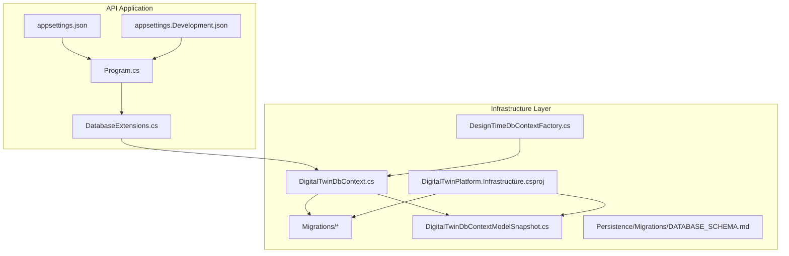
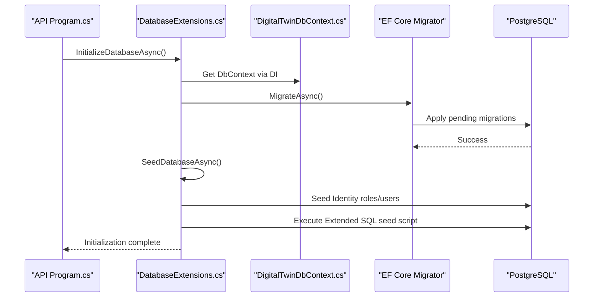
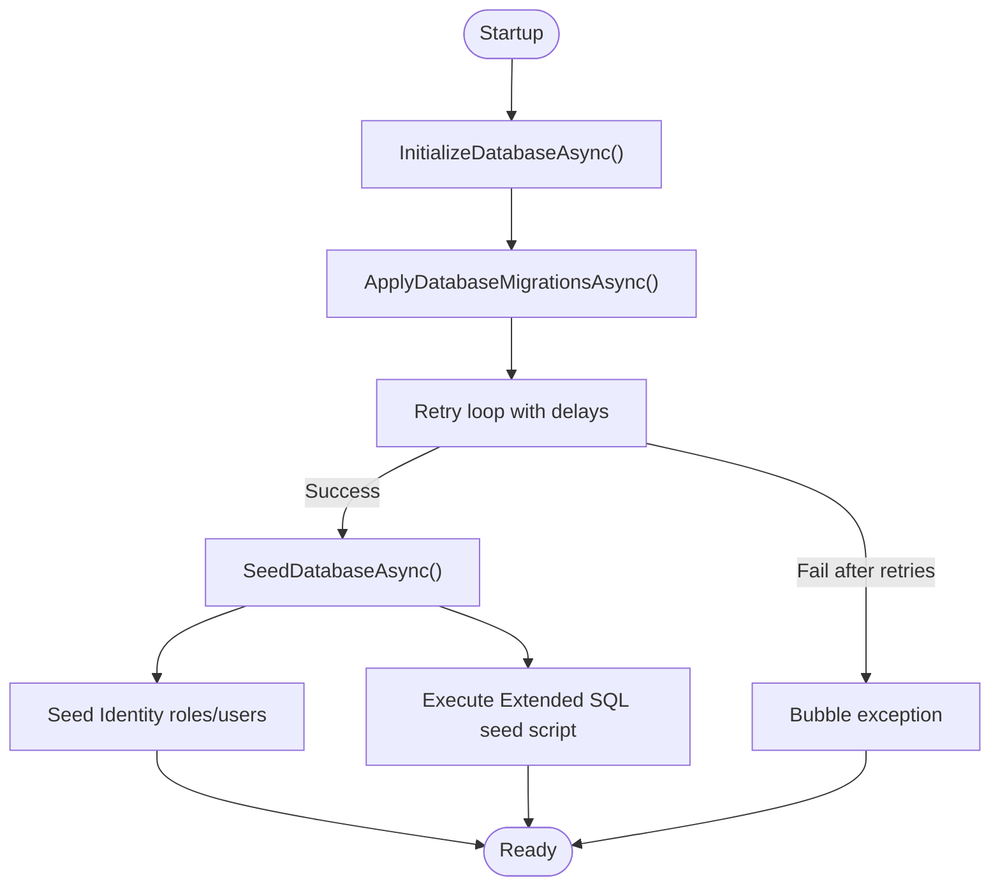
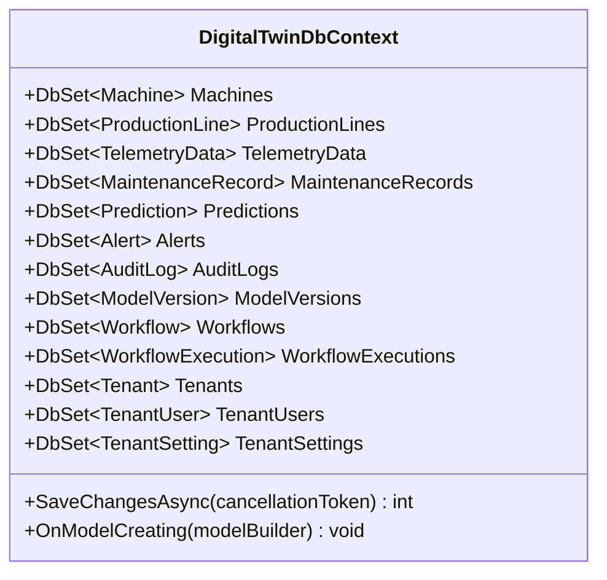
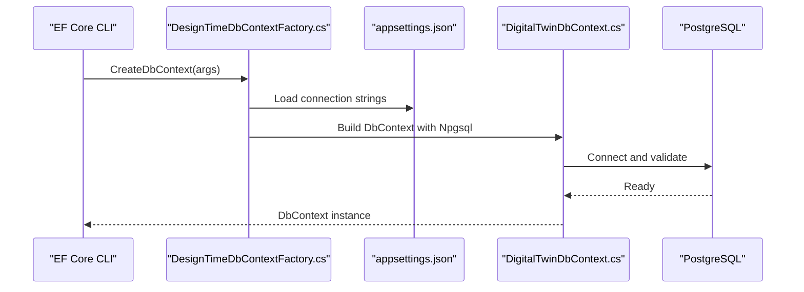
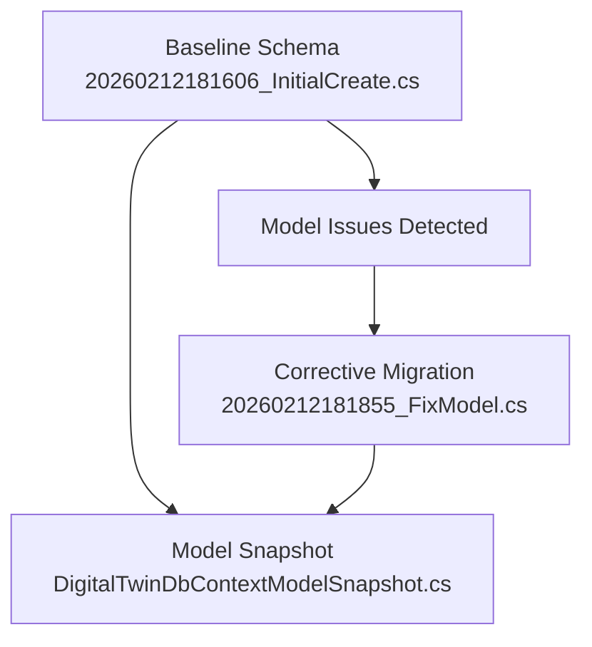
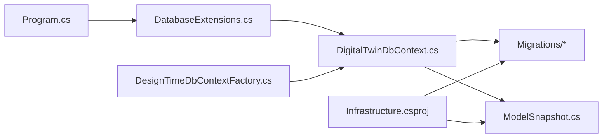

# Migration Strategy

<cite>
**Referenced Files in This Document**
- [Program.cs](file://src/api/DigitalTwinPlatform.API/Program.cs)
- [DatabaseExtensions.cs](file://src/api/DigitalTwinPlatform.API/Extensions/DatabaseExtensions.cs)
- [appsettings.json](file://src/api/DigitalTwinPlatform.API/appsettings.json)
- [appsettings.Development.json](file://src/api/DigitalTwinPlatform.API/appsettings.Development.json)
- [DesignTimeDbContextFactory.cs](file://src/api/DigitalTwinPlatform.Infrastructure/Persistence/DesignTimeDbContextFactory.cs)
- [DigitalTwinDbContext.cs](file://src/api/DigitalTwinPlatform.Infrastructure/Persistence/DigitalTwinDbContext.cs)
- [DigitalTwinPlatform.Infrastructure.csproj](file://src/api/DigitalTwinPlatform.Infrastructure/DigitalTwinPlatform.Infrastructure.csproj)
- [20260212181606_InitialCreate.cs](file://src/api/DigitalTwinPlatform.Infrastructure/Migrations/20260212181606_InitialCreate.cs)
- [20260212181855_FixModel.cs](file://src/api/DigitalTwinPlatform.Infrastructure/Migrations/20260212181855_FixModel.cs)
- [DigitalTwinDbContextModelSnapshot.cs](file://src/api/DigitalTwinPlatform.Infrastructure/Migrations/DigitalTwinDbContextModelSnapshot.cs)
- [DATABASE_SCHEMA.md](file://src/api/DigitalTwinPlatform.Infrastructure/Persistence/Migrations/DATABASE_SCHEMA.md)
</cite>

## Table of Contents
1. [Introduction](#introduction)
2. [Project Structure](#project-structure)
3. [Core Components](#core-components)
4. [Architecture Overview](#architecture-overview)
5. [Detailed Component Analysis](#detailed-component-analysis)
6. [Dependency Analysis](#dependency-analysis)
7. [Performance Considerations](#performance-considerations)
8. [Troubleshooting Guide](#troubleshooting-guide)
9. [Conclusion](#conclusion)
10. [Appendices](#appendices)

## Introduction
This document defines the comprehensive migration strategy for the Digital Twin Platform database schema evolution using Entity Framework Core. It covers automatic migration generation, manual migration creation, initial database creation, model fixes, schema evolution patterns, naming conventions, version control integration, rollback procedures, DesignTimeDbContextFactory for migration tooling, model snapshot management, database initialization scripts, environment-specific migrations, zero-downtime deployment techniques, data seeding strategies, migration testing approaches, production deployment workflows, troubleshooting, conflict resolution, and best practices.

## Project Structure
The migration system spans the API application and the Infrastructure persistence layer:
- The API application initializes the database during startup and applies migrations and seeds data.
- The Infrastructure project contains the DbContext, migrations, and model snapshot.
- The DesignTimeDbContextFactory enables EF Core CLI operations outside the application lifetime.
- Environment-specific configuration drives connection strings and logging for migrations.

**Diagram sources**
- [Program.cs](file://src/api/DigitalTwinPlatform.API/Program.cs#L55-L57)
- [DatabaseExtensions.cs](file://src/api/DigitalTwinPlatform.API/Extensions/DatabaseExtensions.cs#L16-L42)
- [DesignTimeDbContextFactory.cs](file://src/api/DigitalTwinPlatform.Infrastructure/Persistence/DesignTimeDbContextFactory.cs#L7-L28)
- [DigitalTwinDbContext.cs](file://src/api/DigitalTwinPlatform.Infrastructure/Persistence/DigitalTwinDbContext.cs#L15-L24)
- [DigitalTwinPlatform.Infrastructure.csproj](file://src/api/DigitalTwinPlatform.Infrastructure/DigitalTwinPlatform.Infrastructure.csproj#L29-L30)
- [DATABASE_SCHEMA.md](file://src/api/DigitalTwinPlatform.Infrastructure/Persistence/Migrations/DATABASE_SCHEMA.md)

**Section sources**
- [Program.cs](file://src/api/DigitalTwinPlatform.API/Program.cs#L55-L57)
- [DatabaseExtensions.cs](file://src/api/DigitalTwinPlatform.API/Extensions/DatabaseExtensions.cs#L16-L42)
- [DesignTimeDbContextFactory.cs](file://src/api/DigitalTwinPlatform.Infrastructure/Persistence/DesignTimeDbContextFactory.cs#L7-L28)
- [DigitalTwinDbContext.cs](file://src/api/DigitalTwinPlatform.Infrastructure/Persistence/DigitalTwinDbContext.cs#L15-L24)
- [DigitalTwinPlatform.Infrastructure.csproj](file://src/api/DigitalTwinPlatform.Infrastructure/DigitalTwinPlatform.Infrastructure.csproj#L29-L30)

## Core Components
- Database initialization pipeline:
  - Startup triggers initialization that applies migrations with retry and seeds identity and extended data.
- DbContext and model:
  - Centralized model configuration, indexes, JSONB columns, and tenant-aware entities.
- Migration artifacts:
  - Initial migration and a fix migration, plus a model snapshot for deterministic model state tracking.
- Design-time factory:
  - Enables EF Core CLI operations using the same connection string and provider configuration as runtime.
- Environment configuration:
  - Separate connection strings and logging for development and production.

**Section sources**
- [Program.cs](file://src/api/DigitalTwinPlatform.API/Program.cs#L55-L57)
- [DatabaseExtensions.cs](file://src/api/DigitalTwinPlatform.API/Extensions/DatabaseExtensions.cs#L16-L42)
- [DigitalTwinDbContext.cs](file://src/api/DigitalTwinPlatform.Infrastructure/Persistence/DigitalTwinDbContext.cs#L93-L398)
- [20260212181606_InitialCreate.cs](file://src/api/DigitalTwinPlatform.Infrastructure/Migrations/20260212181606_InitialCreate.cs)
- [20260212181855_FixModel.cs](file://src/api/DigitalTwinPlatform.Infrastructure/Migrations/20260212181855_FixModel.cs)
- [DigitalTwinDbContextModelSnapshot.cs](file://src/api/DigitalTwinPlatform.Infrastructure/Migrations/DigitalTwinDbContextModelSnapshot.cs)
- [DesignTimeDbContextFactory.cs](file://src/api/DigitalTwinPlatform.Infrastructure/Persistence/DesignTimeDbContextFactory.cs#L7-L28)
- [appsettings.json](file://src/api/DigitalTwinPlatform.API/appsettings.json#L2-L6)
- [appsettings.Development.json](file://src/api/DigitalTwinPlatform.API/appsettings.Development.json#L9-L12)

## Architecture Overview
The migration lifecycle integrates application startup, EF Core migrations, and data seeding.

**Diagram sources**
- [Program.cs](file://src/api/DigitalTwinPlatform.API/Program.cs#L55-L57)
- [DatabaseExtensions.cs](file://src/api/DigitalTwinPlatform.API/Extensions/DatabaseExtensions.cs#L16-L42)
- [DigitalTwinDbContext.cs](file://src/api/DigitalTwinPlatform.Infrastructure/Persistence/DigitalTwinDbContext.cs#L15-L24)

## Detailed Component Analysis

### Database Initialization Pipeline
- Purpose: Ensure the database exists, is up-to-date, and seeded with baseline data.
- Retry logic: Applies migrations with bounded retries to handle transient connectivity issues.
- Seeding:
  - Identity roles and a default admin user.
  - Extended seed script executed via raw SQL.

**Diagram sources**
- [DatabaseExtensions.cs](file://src/api/DigitalTwinPlatform.API/Extensions/DatabaseExtensions.cs#L16-L74)
- [DatabaseExtensions.cs](file://src/api/DigitalTwinPlatform.API/Extensions/DatabaseExtensions.cs#L27-L33)
- [DatabaseExtensions.cs](file://src/api/DigitalTwinPlatform.API/Extensions/DatabaseExtensions.cs#L79-L133)
- [DatabaseExtensions.cs](file://src/api/DigitalTwinPlatform.API/Extensions/DatabaseExtensions.cs#L138-L161)

**Section sources**
- [Program.cs](file://src/api/DigitalTwinPlatform.API/Program.cs#L55-L57)
- [DatabaseExtensions.cs](file://src/api/DigitalTwinPlatform.API/Extensions/DatabaseExtensions.cs#L16-L74)
- [DatabaseExtensions.cs](file://src/api/DigitalTwinPlatform.API/Extensions/DatabaseExtensions.cs#L27-L33)
- [DatabaseExtensions.cs](file://src/api/DigitalTwinPlatform.API/Extensions/DatabaseExtensions.cs#L79-L133)
- [DatabaseExtensions.cs](file://src/api/DigitalTwinPlatform.API/Extensions/DatabaseExtensions.cs#L138-L161)

### DbContext and Model Snapshot
- DbContext:
  - Inherits from IdentityDbContext for ASP.NET Identity tables.
  - Defines DbSet properties for domain entities and multi-tenancy entities.
  - Overrides SaveChanges to capture audit logs.
  - Configures Postgres extensions, value converters, JSONB columns, indexes, and relationships.
- Model snapshot:
  - Captures the current model state to detect pending changes and enable deterministic migrations.

**Diagram sources**
- [DigitalTwinDbContext.cs](file://src/api/DigitalTwinPlatform.Infrastructure/Persistence/DigitalTwinDbContext.cs#L15-L45)
- [DigitalTwinDbContext.cs](file://src/api/DigitalTwinPlatform.Infrastructure/Persistence/DigitalTwinDbContext.cs#L47-L91)
- [DigitalTwinDbContext.cs](file://src/api/DigitalTwinPlatform.Infrastructure/Persistence/DigitalTwinDbContext.cs#L93-L398)

**Section sources**
- [DigitalTwinDbContext.cs](file://src/api/DigitalTwinPlatform.Infrastructure/Persistence/DigitalTwinDbContext.cs#L15-L45)
- [DigitalTwinDbContext.cs](file://src/api/DigitalTwinPlatform.Infrastructure/Persistence/DigitalTwinDbContext.cs#L47-L91)
- [DigitalTwinDbContext.cs](file://src/api/DigitalTwinPlatform.Infrastructure/Persistence/DigitalTwinDbContext.cs#L93-L398)
- [DigitalTwinDbContextModelSnapshot.cs](file://src/api/DigitalTwinPlatform.Infrastructure/Migrations/DigitalTwinDbContextModelSnapshot.cs)

### DesignTimeDbContextFactory
- Enables EF Core CLI operations (add-migration, ef migrations script, etc.) outside the application lifetime.
- Reads connection strings from appsettings files and configures Npgsql with the migrations assembly.

**Diagram sources**
- [DesignTimeDbContextFactory.cs](file://src/api/DigitalTwinPlatform.Infrastructure/Persistence/DesignTimeDbContextFactory.cs#L7-L28)
- [appsettings.json](file://src/api/DigitalTwinPlatform.API/appsettings.json#L2-L6)
- [appsettings.Development.json](file://src/api/DigitalTwinPlatform.API/appsettings.Development.json#L9-L12)

**Section sources**
- [DesignTimeDbContextFactory.cs](file://src/api/DigitalTwinPlatform.Infrastructure/Persistence/DesignTimeDbContextFactory.cs#L7-L28)
- [appsettings.json](file://src/api/DigitalTwinPlatform.API/appsettings.json#L2-L6)
- [appsettings.Development.json](file://src/api/DigitalTwinPlatform.API/appsettings.Development.json#L9-L12)

### Migrations and Schema Evolution
- Initial migration:
  - Creates the baseline schema for the platform.
- Fix migration:
  - Corrects model issues discovered after the initial release.
- Model snapshot:
  - Tracks the current model to detect pending changes and prevent divergent migrations.

**Diagram sources**
- [20260212181606_InitialCreate.cs](file://src/api/DigitalTwinPlatform.Infrastructure/Migrations/20260212181606_InitialCreate.cs)
- [20260212181855_FixModel.cs](file://src/api/DigitalTwinPlatform.Infrastructure/Migrations/20260212181855_FixModel.cs)
- [DigitalTwinDbContextModelSnapshot.cs](file://src/api/DigitalTwinPlatform.Infrastructure/Migrations/DigitalTwinDbContextModelSnapshot.cs)

**Section sources**
- [20260212181606_InitialCreate.cs](file://src/api/DigitalTwinPlatform.Infrastructure/Migrations/20260212181606_InitialCreate.cs)
- [20260212181855_FixModel.cs](file://src/api/DigitalTwinPlatform.Infrastructure/Migrations/20260212181855_FixModel.cs)
- [DigitalTwinDbContextModelSnapshot.cs](file://src/api/DigitalTwinPlatform.Infrastructure/Migrations/DigitalTwinDbContextModelSnapshot.cs)

### Environment-Specific Migrations
- Connection strings differ per environment, ensuring migrations target the correct database.
- Development settings increase logging for database commands to aid migration diagnostics.

**Section sources**
- [appsettings.json](file://src/api/DigitalTwinPlatform.API/appsettings.json#L2-L6)
- [appsettings.Development.json](file://src/api/DigitalTwinPlatform.API/appsettings.Development.json#L9-L12)

### Zero-Downtime Deployment Techniques
- Strategy overview:
  - Use idempotent migrations and avoid blocking schema changes.
  - Prefer online index creation and column additions with defaults.
  - Batch changes and validate in staging before production.
  - Use read replicas and blue/green deployments where applicable.
- Practical guidance:
  - Keep migrations reversible where feasible.
  - Avoid long-running transactions and table rebuilds.
  - Test migration order and dependencies in isolated environments.

[No sources needed since this section provides general guidance]

### Data Seeding Strategies
- Identity seeding:
  - Roles and a default admin user are created if missing.
- Extended seed script:
  - Executes a unified SQL script to populate reference data and initial configurations.

**Section sources**
- [DatabaseExtensions.cs](file://src/api/DigitalTwinPlatform.API/Extensions/DatabaseExtensions.cs#L79-L133)
- [DatabaseExtensions.cs](file://src/api/DigitalTwinPlatform.API/Extensions/DatabaseExtensions.cs#L138-L161)

### Migration Testing Approaches
- Local verification:
  - Use DesignTimeDbContextFactory to run add-migration and script commands against local databases.
- CI/CD integration:
  - Run migrations against ephemeral test databases in pipelines.
- Regression checks:
  - Compare model snapshots and ensure no unintended model changes.

**Section sources**
- [DesignTimeDbContextFactory.cs](file://src/api/DigitalTwinPlatform.Infrastructure/Persistence/DesignTimeDbContextFactory.cs#L7-L28)
- [DigitalTwinDbContextModelSnapshot.cs](file://src/api/DigitalTwinPlatform.Infrastructure/Migrations/DigitalTwinDbContextModelSnapshot.cs)

### Production Deployment Workflows
- Pre-deploy:
  - Validate migrations locally and in staging.
  - Confirm environment-specific connection strings.
- Deploy:
  - Run initialization at startup to apply migrations and seed data.
- Post-deploy:
  - Monitor logs for migration errors and audit logs for data changes.

**Section sources**
- [Program.cs](file://src/api/DigitalTwinPlatform.API/Program.cs#L55-L57)
- [DatabaseExtensions.cs](file://src/api/DigitalTwinPlatform.API/Extensions/DatabaseExtensions.cs#L16-L42)
- [appsettings.json](file://src/api/DigitalTwinPlatform.API/appsettings.json#L2-L6)

## Dependency Analysis
- API depends on Infrastructure for the DbContext and migrations.
- DesignTimeDbContextFactory depends on appsettings for connection strings.
- Migrations and model snapshot depend on the DbContext model configuration.

**Diagram sources**
- [Program.cs](file://src/api/DigitalTwinPlatform.API/Program.cs#L55-L57)
- [DatabaseExtensions.cs](file://src/api/DigitalTwinPlatform.API/Extensions/DatabaseExtensions.cs#L16-L42)
- [DesignTimeDbContextFactory.cs](file://src/api/DigitalTwinPlatform.Infrastructure/Persistence/DesignTimeDbContextFactory.cs#L7-L28)
- [DigitalTwinDbContext.cs](file://src/api/DigitalTwinPlatform.Infrastructure/Persistence/DigitalTwinDbContext.cs#L15-L24)
- [DigitalTwinPlatform.Infrastructure.csproj](file://src/api/DigitalTwinPlatform.Infrastructure/DigitalTwinPlatform.Infrastructure.csproj#L29-L30)

**Section sources**
- [Program.cs](file://src/api/DigitalTwinPlatform.API/Program.cs#L55-L57)
- [DatabaseExtensions.cs](file://src/api/DigitalTwinPlatform.API/Extensions/DatabaseExtensions.cs#L16-L42)
- [DesignTimeDbContextFactory.cs](file://src/api/DigitalTwinPlatform.Infrastructure/Persistence/DesignTimeDbContextFactory.cs#L7-L28)
- [DigitalTwinDbContext.cs](file://src/api/DigitalTwinPlatform.Infrastructure/Persistence/DigitalTwinDbContext.cs#L15-L24)
- [DigitalTwinPlatform.Infrastructure.csproj](file://src/api/DigitalTwinPlatform.Infrastructure/DigitalTwinPlatform.Infrastructure.csproj#L29-L30)

## Performance Considerations
- Indexes and JSONB:
  - The model configures indexes on frequently queried columns and uses JSONB for flexible attributes.
- Audit overhead:
  - Audit logging captures changes; monitor performance impact in write-heavy scenarios.
- Migration execution:
  - Retry logic reduces transient failure risk but adds latency; tune retry count and delays per environment.

[No sources needed since this section provides general guidance]

## Troubleshooting Guide
- Migration fails on startup:
  - Check connectivity and credentials in environment-specific appsettings.
  - Review retry logs for transient exceptions.
- Pending model changes warning:
  - Ensure the model snapshot matches the current model and re-generate if needed.
- Seed script not applied:
  - Verify the seed file path and existence; confirm successful execution logs.

**Section sources**
- [DatabaseExtensions.cs](file://src/api/DigitalTwinPlatform.API/Extensions/DatabaseExtensions.cs#L47-L74)
- [DatabaseExtensions.cs](file://src/api/DigitalTwinPlatform.API/Extensions/DatabaseExtensions.cs#L138-L161)
- [DesignTimeDbContextFactory.cs](file://src/api/DigitalTwinPlatform.Infrastructure/Persistence/DesignTimeDbContextFactory.cs#L23-L24)

## Conclusion
The Digital Twin Platform employs a robust EF Core migration strategy with automatic application startup initialization, retryable migrations, comprehensive data seeding, and design-time tooling. The system’s model snapshot and explicit migrations ensure deterministic schema evolution, while environment-specific configuration supports safe deployments across development and production. Adopting the recommended zero-downtime techniques, testing approaches, and troubleshooting practices will maintain reliability and minimize operational risk.

## Appendices

### Migration Naming Conventions
- Format: Four-part timestamp followed by a descriptive label (e.g., YYYYMMDDHHMMSS_Description).
- Example migrations present in the repository follow this convention.

**Section sources**
- [20260212181606_InitialCreate.cs](file://src/api/DigitalTwinPlatform.Infrastructure/Migrations/20260212181606_InitialCreate.cs)
- [20260212181855_FixModel.cs](file://src/api/DigitalTwinPlatform.Infrastructure/Migrations/20260212181855_FixModel.cs)

### Version Control Integration
- Treat migrations and model snapshots as code:
  - Commit generated files alongside application code.
  - Review migration diffs in pull requests.
  - Keep model snapshot synchronized with the model.

**Section sources**
- [DigitalTwinDbContextModelSnapshot.cs](file://src/api/DigitalTwinPlatform.Infrastructure/Migrations/DigitalTwinDbContextModelSnapshot.cs)

### Rollback Procedures
- Strategy:
  - Maintain reversible migrations where possible.
  - Use EF Core’s migration rollback commands in controlled environments.
  - Validate rollback against backups before production actions.

[No sources needed since this section provides general guidance]

### Database Initialization Scripts
- The extended seed script is executed during initialization to populate reference data and configurations.

**Section sources**
- [DatabaseExtensions.cs](file://src/api/DigitalTwinPlatform.API/Extensions/DatabaseExtensions.cs#L138-L161)

### Schema Evolution Patterns
- Use additive changes (new columns, indexes) and defensive defaults.
- Avoid destructive changes; prefer data corrections and schema refinements.

**Section sources**
- [DigitalTwinDbContext.cs](file://src/api/DigitalTwinPlatform.Infrastructure/Persistence/DigitalTwinDbContext.cs#L93-L398)

### Manual Migration Creation
- Use DesignTimeDbContextFactory to run EF Core CLI commands targeting the correct connection string and provider.

**Section sources**
- [DesignTimeDbContextFactory.cs](file://src/api/DigitalTwinPlatform.Infrastructure/Persistence/DesignTimeDbContextFactory.cs#L7-L28)

### Automatic Migration Generation
- The system applies migrations automatically at startup; ensure proper configuration and logging for visibility.

**Section sources**
- [Program.cs](file://src/api/DigitalTwinPlatform.API/Program.cs#L55-L57)
- [DatabaseExtensions.cs](file://src/api/DigitalTwinPlatform.API/Extensions/DatabaseExtensions.cs#L16-L42)

### Model Snapshot Management
- The snapshot captures the current model state; regenerate when model changes are made to keep migrations deterministic.

**Section sources**
- [DigitalTwinDbContextModelSnapshot.cs](file://src/api/DigitalTwinPlatform.Infrastructure/Migrations/DigitalTwinDbContextModelSnapshot.cs)

### Environment-Specific Migrations
- Use environment-specific appsettings to target the correct database and adjust logging for diagnostics.

**Section sources**
- [appsettings.json](file://src/api/DigitalTwinPlatform.API/appsettings.json#L2-L6)
- [appsettings.Development.json](file://src/api/DigitalTwinPlatform.API/appsettings.Development.json#L9-L12)

### Zero-Downtime Deployment Techniques
- Prefer online schema changes, batch updates, and validate in staging.

[No sources needed since this section provides general guidance]

### Data Seeding Strategies
- Identity roles and users, plus extended SQL seed script.

**Section sources**
- [DatabaseExtensions.cs](file://src/api/DigitalTwinPlatform.API/Extensions/DatabaseExtensions.cs#L79-L133)
- [DatabaseExtensions.cs](file://src/api/DigitalTwinPlatform.API/Extensions/DatabaseExtensions.cs#L138-L161)

### Migration Testing Approaches
- Local verification and CI/CD pipelines with ephemeral databases.

[No sources needed since this section provides general guidance]

### Production Deployment Workflows
- Pre-deploy validation, automated initialization at startup, and post-deploy monitoring.

**Section sources**
- [Program.cs](file://src/api/DigitalTwinPlatform.API/Program.cs#L55-L57)
- [DatabaseExtensions.cs](file://src/api/DigitalTwinPlatform.API/Extensions/DatabaseExtensions.cs#L16-L42)

### Migration Troubleshooting
- Connectivity, pending model changes, and seed script execution.

**Section sources**
- [DatabaseExtensions.cs](file://src/api/DigitalTwinPlatform.API/Extensions/DatabaseExtensions.cs#L47-L74)
- [DatabaseExtensions.cs](file://src/api/DigitalTwinPlatform.API/Extensions/DatabaseExtensions.cs#L138-L161)
- [DesignTimeDbContextFactory.cs](file://src/api/DigitalTwinPlatform.Infrastructure/Persistence/DesignTimeDbContextFactory.cs#L23-L24)

### Conflict Resolution
- Reconcile divergent branches by merging migration files and updating the model snapshot accordingly.

[No sources needed since this section provides general guidance]

### Best Practices for Schema Changes
- Idempotent migrations, additive changes, defensive defaults, and thorough testing.

[No sources needed since this section provides general guidance]