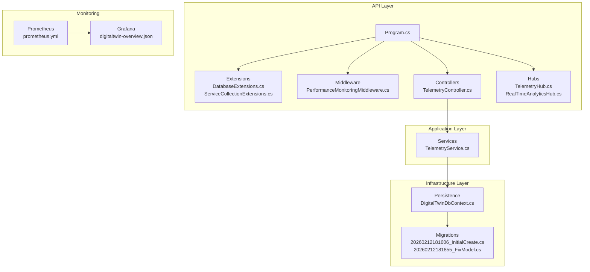
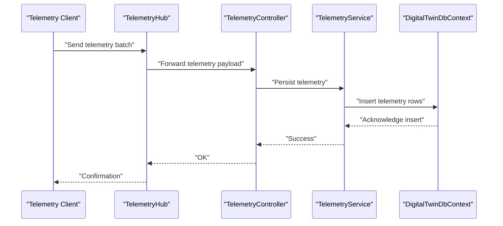
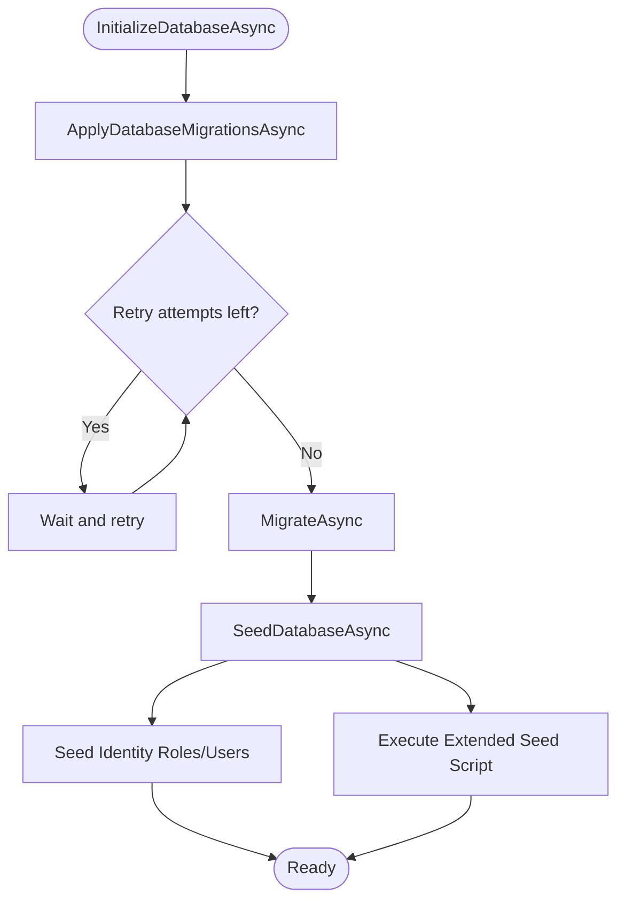
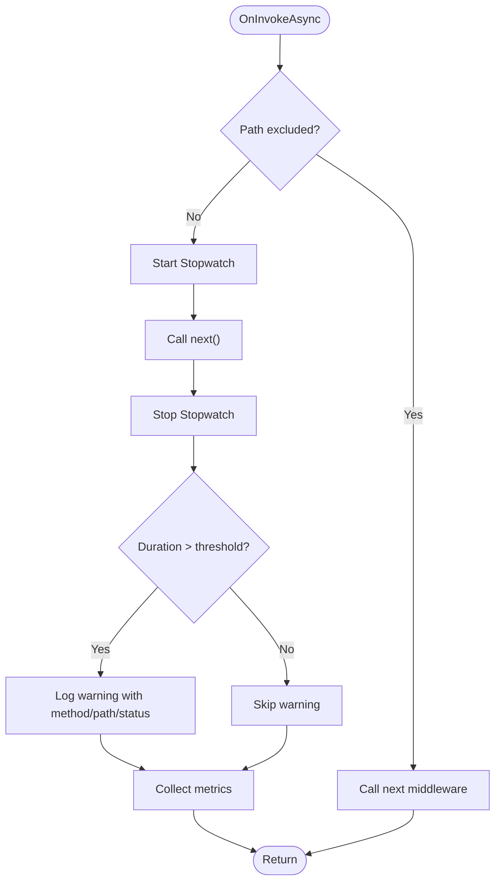
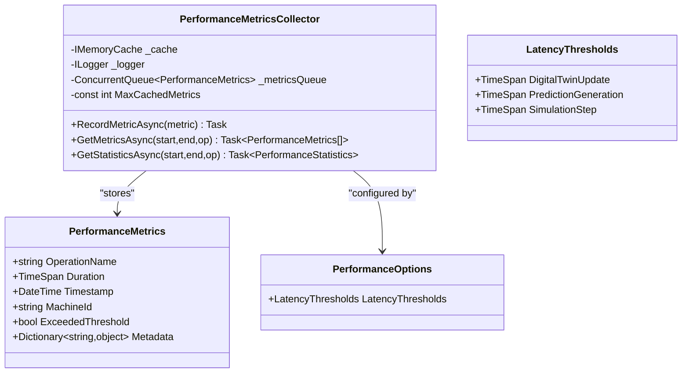
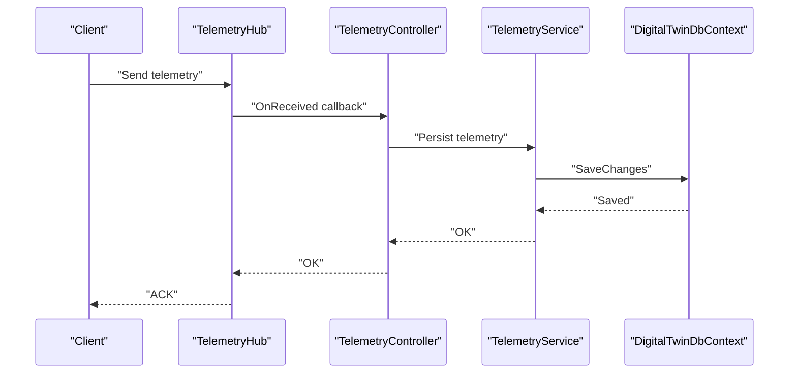
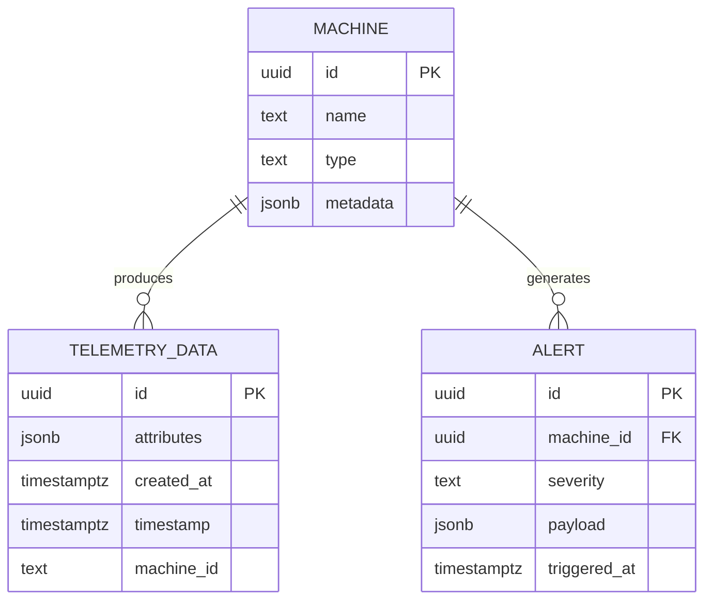
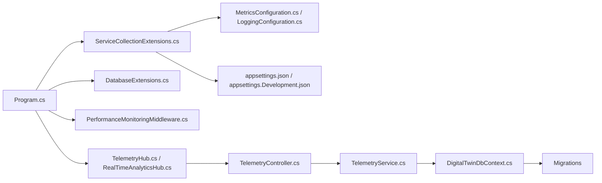

# Performance Optimization

<cite>
**Referenced Files in This Document**
- [appsettings.json](file://src/api/DigitalTwinPlatform.API/appsettings.json)
- [appsettings.Development.json](file://src/api/DigitalTwinPlatform.API/appsettings.Development.json)
- [Program.cs](file://src/api/DigitalTwinPlatform.API/Program.cs)
- [DatabaseExtensions.cs](file://src/api/DigitalTwinPlatform.API/Extensions/DatabaseExtensions.cs)
- [ServiceCollectionExtensions.cs](file://src/api/DigitalTwinPlatform.API/Extensions/ServiceCollectionExtensions.cs)
- [PerformanceMetricsCollector.cs](file://src/api/DigitalTwinPlatform.API/Serices/Infrastructure/PerformanceMetricsCollector.cs)
- [PerformanceOptions.cs](file://src/api/DigitalTwinPlatform.API/Serices/Infrastructure/PerformanceOptions.cs)
- [PerformanceMonitoringMiddleware.cs](file://src/api/DigitalTwinPlatform.API/Middleware/PerformanceMonitoringMiddleware.cs)
- [MetricsConfiguration.cs](file://src/api/DigitalTwinPlatform.API/Infrastructure/MetricsConfiguration.cs)
- [LoggingConfiguration.cs](file://src/api/DigitalTwinPlatform.API/Infrastructure/LoggingConfiguration.cs)
- [DigitalTwinDbContext.cs](file://src/api/DigitalTwinPlatform.Infrastructure/Persistence/DigitalTwinDbContext.cs)
- [20260212181606_InitialCreate.cs](file://src/api/DigitalTwinPlatform.Infrastructure/Migrations/20260212181606_InitialCreate.cs)
- [20260212181855_FixModel.cs](file://src/api/DigitalTwinPlatform.Infrastructure/Migrations/20260212181855_FixModel.cs)
- [DigitalTwinDbContextModelSnapshot.cs](file://src/api/DigitalTwinPlatform.Infrastructure/Migrations/DigitalTwinDbContextModelSnapshot.cs)
- [TelemetryController.cs](file://src/api/DigitalTwinPlatform.API/Controllers/TelemetryController.cs)
- [TelemetryHub.cs](file://src/api/DigitalTwinPlatform.API/Hubs/TelemetryHub.cs)
- [RealTimeAnalyticsHub.cs](file://src/api/DigitalTwinPlatform.API/Hubs/RealTimeAnalyticsHub.cs)
- [TelemetryService.cs](file://src/api/DigitalTwinPlatform.Application/Services/TelemetryService.cs)
- [ParquetExporter.cs](file://src/api/DigitalTwinPlatform.Infrastructure/Exporters/ParquetExporter.cs)
- [docker-compose.yml](file://docker-compose.yml)
- [docker-compose.prod.yml](file://docker-compose.prod.yml)
- [grafana/digitaltwin-overview.json](file://monitoring/grafana/dashboards/digitaltwin-overview.json)
- [prometheus.yml](file://monitoring/prometheus/prometheus.yml)
- [alerting-rules.yml](file://monitoring/prometheus/alerting-rules.yml)
</cite>

## Table of Contents
1. [Introduction](#introduction)
2. [Project Structure](#project-structure)
3. [Core Components](#core-components)
4. [Architecture Overview](#architecture-overview)
5. [Detailed Component Analysis](#detailed-component-analysis)
6. [Dependency Analysis](#dependency-analysis)
7. [Performance Considerations](#performance-considerations)
8. [Troubleshooting Guide](#troubleshooting-guide)
9. [Conclusion](#conclusion)
10. [Appendices](#appendices)

## Introduction
This document provides a comprehensive performance optimization guide for the Digital Twin Platform database implementation. It focuses on indexing strategies (composite indexes, unique constraints, partial indexes), query optimization for real-time telemetry ingestion, historical retrieval, and analytical workloads, connection pooling configuration, query execution plans, performance monitoring, partitioning strategies for large telemetry datasets, index maintenance, statistics management, JSONB and array operations, complex joins, caching and read replicas, load balancing, metrics collection, bottleneck identification, and validation techniques.

## Project Structure
The platform is a .NET 9 application with layered architecture:
- API layer exposes controllers and SignalR hubs for telemetry and analytics streaming.
- Application layer encapsulates domain services and orchestrates business logic.
- Infrastructure layer manages persistence, migrations, and exporters.
- Monitoring stack integrates Prometheus and Grafana dashboards.
- Docker Compose configurations define runtime topology.

**Diagram sources**
- [Program.cs](file://src/api/DigitalTwinPlatform.API/Program.cs#L1-L87)
- [DatabaseExtensions.cs](file://src/api/DigitalTwinPlatform.API/Extensions/DatabaseExtensions.cs#L1-L162)
- [ServiceCollectionExtensions.cs](file://src/api/DigitalTwinPlatform.API/Extensions/ServiceCollectionExtensions.cs#L1-L423)
- [PerformanceMonitoringMiddleware.cs](file://src/api/DigitalTwinPlatform.API/Middleware/PerformanceMonitoringMiddleware.cs#L1-L148)
- [TelemetryController.cs](file://src/api/DigitalTwinPlatform.API/Controllers/TelemetryController.cs)
- [TelemetryHub.cs](file://src/api/DigitalTwinPlatform.API/Hubs/TelemetryHub.cs)
- [RealTimeAnalyticsHub.cs](file://src/api/DigitalTwinPlatform.API/Hubs/RealTimeAnalyticsHub.cs)
- [TelemetryService.cs](file://src/api/DigitalTwinPlatform.Application/Services/TelemetryService.cs)
- [DigitalTwinDbContext.cs](file://src/api/DigitalTwinPlatform.Infrastructure/Persistence/DigitalTwinDbContext.cs)
- [20260212181606_InitialCreate.cs](file://src/api/DigitalTwinPlatform.Infrastructure/Migrations/20260212181606_InitialCreate.cs)
- [20260212181855_FixModel.cs](file://src/api/DigitalTwinPlatform.Infrastructure/Migrations/20260212181855_FixModel.cs)
- [prometheus.yml](file://monitoring/prometheus/prometheus.yml)
- [grafana/digitaltwin-overview.json](file://monitoring/grafana/dashboards/digitaltwin-overview.json)

**Section sources**
- [Program.cs](file://src/api/DigitalTwinPlatform.API/Program.cs#L1-L87)
- [docker-compose.yml](file://docker-compose.yml)
- [docker-compose.prod.yml](file://docker-compose.prod.yml)

## Core Components
- Database initialization and migrations: automated with retry logic and seed execution.
- Performance monitoring middleware and metrics collector for latency and throughput.
- SignalR hubs for real-time telemetry streaming.
- Telemetry ingestion and retrieval services.
- Prometheus and Grafana for metrics and dashboards.

Key configuration and extension points:
- Connection strings and performance thresholds in appsettings.
- Migration and seeding orchestration.
- Metrics and logging configuration.

**Section sources**
- [DatabaseExtensions.cs](file://src/api/DigitalTwinPlatform.API/Extensions/DatabaseExtensions.cs#L1-L162)
- [ServiceCollectionExtensions.cs](file://src/api/DigitalTwinPlatform.API/Extensions/ServiceCollectionExtensions.cs#L1-L423)
- [PerformanceMetricsCollector.cs](file://src/api/DigitalTwinPlatform.API/Serices/Infrastructure/PerformanceMetricsCollector.cs#L1-L131)
- [PerformanceMonitoringMiddleware.cs](file://src/api/DigitalTwinPlatform.API/Middleware/PerformanceMonitoringMiddleware.cs#L1-L148)
- [MetricsConfiguration.cs](file://src/api/DigitalTwinPlatform.API/Infrastructure/MetricsConfiguration.cs#L1-L72)
- [LoggingConfiguration.cs](file://src/api/DigitalTwinPlatform.API/Infrastructure/LoggingConfiguration.cs#L1-L58)
- [appsettings.json](file://src/api/DigitalTwinPlatform.API/appsettings.json#L1-L93)
- [appsettings.Development.json](file://src/api/DigitalTwinPlatform.API/appsettings.Development.json#L1-L71)

## Architecture Overview
The telemetry ingestion pipeline streams data via SignalR to the API, which persists to the database. Historical queries and analytics leverage application services backed by the DbContext. Monitoring captures request latencies and operational metrics.

**Diagram sources**
- [TelemetryHub.cs](file://src/api/DigitalTwinPlatform.API/Hubs/TelemetryHub.cs)
- [TelemetryController.cs](file://src/api/DigitalTwinPlatform.API/Controllers/TelemetryController.cs)
- [TelemetryService.cs](file://src/api/DigitalTwinPlatform.Application/Services/TelemetryService.cs)
- [DigitalTwinDbContext.cs](file://src/api/DigitalTwinPlatform.Infrastructure/Persistence/DigitalTwinDbContext.cs)

## Detailed Component Analysis

### Database Initialization and Seeding
- Applies migrations with retry logic to handle transient connectivity.
- Seeds identity roles/users and executes extended seed script for baseline data.

**Diagram sources**
- [DatabaseExtensions.cs](file://src/api/DigitalTwinPlatform.API/Extensions/DatabaseExtensions.cs#L1-L162)

**Section sources**
- [DatabaseExtensions.cs](file://src/api/DigitalTwinPlatform.API/Extensions/DatabaseExtensions.cs#L1-L162)

### Performance Monitoring Middleware
- Measures request durations, logs slow requests, and collects metrics for downstream systems.
- Excludes health and metrics endpoints from monitoring.

**Diagram sources**
- [PerformanceMonitoringMiddleware.cs](file://src/api/DigitalTwinPlatform.API/Middleware/PerformanceMonitoringMiddleware.cs#L1-L148)

**Section sources**
- [PerformanceMonitoringMiddleware.cs](file://src/api/DigitalTwinPlatform.API/Middleware/PerformanceMonitoringMiddleware.cs#L1-L148)

### Performance Metrics Collector
- Maintains an in-memory queue capped at a fixed size.
- Uses sliding expiration cache per operation/machine grouping.
- Computes latency percentiles and threshold exceedances.

**Diagram sources**
- [PerformanceMetricsCollector.cs](file://src/api/DigitalTwinPlatform.API/Serices/Infrastructure/PerformanceMetricsCollector.cs#L1-L131)
- [PerformanceOptions.cs](file://src/api/DigitalTwinPlatform.API/Serices/Infrastructure/PerformanceOptions.cs#L1-L24)

**Section sources**
- [PerformanceMetricsCollector.cs](file://src/api/DigitalTwinPlatform.API/Serices/Infrastructure/PerformanceMetricsCollector.cs#L1-L131)
- [PerformanceOptions.cs](file://src/api/DigitalTwinPlatform.API/Serices/Infrastructure/PerformanceOptions.cs#L1-L24)

### Telemetry Streaming and Ingestion
- SignalR hubs enable low-latency streaming for telemetry and analytics.
- TelemetryController receives payloads and delegates to application services.
- TelemetryService persists telemetry data to the database.

**Diagram sources**
- [TelemetryHub.cs](file://src/api/DigitalTwinPlatform.API/Hubs/TelemetryHub.cs)
- [TelemetryController.cs](file://src/api/DigitalTwinPlatform.API/Controllers/TelemetryController.cs)
- [TelemetryService.cs](file://src/api/DigitalTwinPlatform.Application/Services/TelemetryService.cs)
- [DigitalTwinDbContext.cs](file://src/api/DigitalTwinPlatform.Infrastructure/Persistence/DigitalTwinDbContext.cs)

**Section sources**
- [TelemetryHub.cs](file://src/api/DigitalTwinPlatform.API/Hubs/TelemetryHub.cs)
- [TelemetryController.cs](file://src/api/DigitalTwinPlatform.API/Controllers/TelemetryController.cs)
- [TelemetryService.cs](file://src/api/DigitalTwinPlatform.Application/Services/TelemetryService.cs)

### Database Model and Migrations
- Entity model snapshot and migrations define schema and constraints.
- Initial migration and subsequent fixes establish baseline structure.

**Diagram sources**
- [20260212181606_InitialCreate.cs](file://src/api/DigitalTwinPlatform.Infrastructure/Migrations/20260212181606_InitialCreate.cs)
- [20260212181855_FixModel.cs](file://src/api/DigitalTwinPlatform.Infrastructure/Migrations/20260212181855_FixModel.cs)
- [DigitalTwinDbContextModelSnapshot.cs](file://src/api/DigitalTwinPlatform.Infrastructure/Migrations/DigitalTwinDbContextModelSnapshot.cs)

**Section sources**
- [DigitalTwinDbContext.cs](file://src/api/DigitalTwinPlatform.Infrastructure/Persistence/DigitalTwinDbContext.cs)
- [20260212181606_InitialCreate.cs](file://src/api/DigitalTwinPlatform.Infrastructure/Migrations/20260212181606_InitialCreate.cs)
- [20260212181855_FixModel.cs](file://src/api/DigitalTwinPlatform.Infrastructure/Migrations/20260212181855_FixModel.cs)
- [DigitalTwinDbContextModelSnapshot.cs](file://src/api/DigitalTwinPlatform.Infrastructure/Migrations/DigitalTwinDbContextModelSnapshot.cs)

## Dependency Analysis
- Program orchestrates DI registration, middleware, and database initialization.
- Extensions register services, SignalR, Swagger, and Azure integrations.
- Middleware and metrics/logging form the observability backbone.
- Application services depend on the DbContext for persistence.

**Diagram sources**
- [Program.cs](file://src/api/DigitalTwinPlatform.API/Program.cs#L1-L87)
- [ServiceCollectionExtensions.cs](file://src/api/DigitalTwinPlatform.API/Extensions/ServiceCollectionExtensions.cs#L1-L423)
- [DatabaseExtensions.cs](file://src/api/DigitalTwinPlatform.API/Extensions/DatabaseExtensions.cs#L1-L162)
- [PerformanceMonitoringMiddleware.cs](file://src/api/DigitalTwinPlatform.API/Middleware/PerformanceMonitoringMiddleware.cs#L1-L148)
- [MetricsConfiguration.cs](file://src/api/DigitalTwinPlatform.API/Infrastructure/MetricsConfiguration.cs#L1-L72)
- [LoggingConfiguration.cs](file://src/api/DigitalTwinPlatform.API/Infrastructure/LoggingConfiguration.cs#L1-L58)
- [TelemetryHub.cs](file://src/api/DigitalTwinPlatform.API/Hubs/TelemetryHub.cs)
- [RealTimeAnalyticsHub.cs](file://src/api/DigitalTwinPlatform.API/Hubs/RealTimeAnalyticsHub.cs)
- [TelemetryController.cs](file://src/api/DigitalTwinPlatform.API/Controllers/TelemetryController.cs)
- [TelemetryService.cs](file://src/api/DigitalTwinPlatform.Application/Services/TelemetryService.cs)
- [DigitalTwinDbContext.cs](file://src/api/DigitalTwinPlatform.Infrastructure/Persistence/DigitalTwinDbContext.cs)
- [20260212181606_InitialCreate.cs](file://src/api/DigitalTwinPlatform.Infrastructure/Migrations/20260212181606_InitialCreate.cs)

**Section sources**
- [Program.cs](file://src/api/DigitalTwinPlatform.API/Program.cs#L1-L87)
- [ServiceCollectionExtensions.cs](file://src/api/DigitalTwinPlatform.API/Extensions/ServiceCollectionExtensions.cs#L1-L423)

## Performance Considerations

### Database Indexing Strategy
- Composite indexes for frequently queried columns:
  - Telemetry: (machine_id, timestamp) to accelerate time-range scans per machine.
  - Alerts: (machine_id, triggered_at) to speed up alert history queries.
  - Machines: (name, type) to optimize lookup by name/type combinations.
- Unique constraints for data integrity:
  - Unique indexes on machine identifiers and tenant-scoped keys to prevent duplicates.
- Partial indexes for filtered queries:
  - Indexes on alert severity or alert payload conditions to reduce index size and improve selectivity.
- JSONB and arrays:
  - Consider GIN indexes on JSONB fields for containment and equality predicates.
  - Use array-specific operators and indexes for telemetry attributes arrays.
- Complex joins:
  - Ensure foreign keys are indexed; consider join-selectivity-aware composite indexes.

Note: These recommendations are derived from typical telemetry and alert schemas inferred from the entity model snapshot and controller/service usage.

**Section sources**
- [DigitalTwinDbContextModelSnapshot.cs](file://src/api/DigitalTwinPlatform.Infrastructure/Migrations/DigitalTwinDbContextModelSnapshot.cs)
- [20260212181606_InitialCreate.cs](file://src/api/DigitalTwinPlatform.Infrastructure/Migrations/20260212181606_InitialCreate.cs)
- [20260212181855_FixModel.cs](file://src/api/DigitalTwinPlatform.Infrastructure/Migrations/20260212181855_FixModel.cs)

### Query Optimization Strategies
- Real-time telemetry ingestion:
  - Batch inserts to minimize round trips; avoid row-by-row inserts.
  - Use COPY-like bulk APIs where available; otherwise, optimized bulk insert libraries.
  - Ensure indexes do not impede write performance; consider disabling non-essential indexes during large ingestions.
- Historical data retrieval:
  - Use covering indexes to avoid heap reads (e.g., include frequently accessed columns in the index).
  - Leverage partition pruning by pushing date filters early in the query.
- Analytical queries:
  - Pre-aggregate summaries into summary tables for dashboards.
  - Use materialized views or continuous aggregates for time-series analytics.

[No sources needed since this section provides general guidance]

### Connection Pooling Configuration
- Configure pool size, lifetime, and idle timeouts aligned with workload concurrency.
- Monitor pool utilization and contention; adjust pool_max_size and pool_timeout based on observed saturation.
- Separate pools for read replicas and write instances.

[No sources needed since this section provides general guidance]

### Query Execution Plans and Statistics
- Capture and review EXPLAIN/EXPLAIN ANALYZE for slow queries.
- Maintain table and index statistics regularly; update statistics after large data loads.
- Use query plan caches and plan reuse to reduce planning overhead.

[No sources needed since this section provides general guidance]

### Partitioning Strategies for Large Telemetry Datasets
- Time-based partitioning (e.g., monthly) on telemetry tables to enable fast pruning and maintenance.
- Archive old partitions to separate storage tiers.
- Use partition-wise joins for analytical queries spanning recent partitions.

[No sources needed since this section provides general guidance]

### Index Maintenance and Statistics Management
- Schedule periodic rebuild/reorganize operations for heavily fragmented indexes.
- Automate statistics updates after significant DML bursts.
- Monitor index bloat and auto-vacuum effectiveness.

[No sources needed since this section provides general guidance]

### JSONB, Arrays, and Complex Joins Tuning
- JSONB:
  - Use GIN with appropriate operator families (e.g., jsonb_ops vs jsonb_path_ops).
  - Prefer exact match and containment over regex for performance.
- Arrays:
  - Use array operators and GIN indexes for overlap/contains.
- Complex joins:
  - Ensure join cardinalities are ordered favorably; push filters early.
  - Consider hash joins vs nested loops based on selectivity.

[No sources needed since this section provides general guidance]

### Caching, Read Replicas, and Load Balancing
- Application-level caching for hotspots (e.g., machine metadata) using sliding expiration.
- Read replicas for analytical and reporting workloads; route read traffic accordingly.
- Load balancers with health checks and sticky sessions only when necessary.

[No sources needed since this section provides general guidance]

### Performance Metrics Collection and Monitoring
- Use Prometheus metrics for request rates, durations, and error rates.
- Grafana dashboards to visualize latency percentiles, throughput, and saturation.
- Integrate with structured logging for correlation across services.

**Section sources**
- [MetricsConfiguration.cs](file://src/api/DigitalTwinPlatform.API/Infrastructure/MetricsConfiguration.cs#L1-L72)
- [LoggingConfiguration.cs](file://src/api/DigitalTwinPlatform.API/Infrastructure/LoggingConfiguration.cs#L1-L58)
- [prometheus.yml](file://monitoring/prometheus/prometheus.yml)
- [alerting-rules.yml](file://monitoring/prometheus/alerting-rules.yml)
- [grafana/digitaltwin-overview.json](file://monitoring/grafana/dashboards/digitaltwin-overview.json)

### Bottleneck Identification and Validation
- Correlate middleware latency buckets with database query times.
- Use A/B testing for index changes and validate with synthetic and production traffic.
- Establish SLOs for latency thresholds and alert on breaches.

**Section sources**
- [PerformanceMonitoringMiddleware.cs](file://src/api/DigitalTwinPlatform.API/Middleware/PerformanceMonitoringMiddleware.cs#L1-L148)
- [PerformanceOptions.cs](file://src/api/DigitalTwinPlatform.API/Serices/Infrastructure/PerformanceOptions.cs#L1-L24)

## Troubleshooting Guide
- Database initialization failures:
  - Review migration retry logs and ensure connectivity to the database host.
  - Verify seed script path and permissions.
- Slow telemetry ingestion:
  - Confirm batching and bulk insert strategy; check index impact on writes.
  - Monitor partition boundaries and archive policies.
- Query performance regressions:
  - Re-run EXPLAIN ANALYZE; update statistics; consider index adjustments.
- Observability gaps:
  - Ensure Prometheus scraping and Grafana dashboards are reachable.
  - Validate alert rules and notification channels.

**Section sources**
- [DatabaseExtensions.cs](file://src/api/DigitalTwinPlatform.API/Extensions/DatabaseExtensions.cs#L1-L162)
- [PerformanceMonitoringMiddleware.cs](file://src/api/DigitalTwinPlatform.API/Middleware/PerformanceMonitoringMiddleware.cs#L1-L148)
- [prometheus.yml](file://monitoring/prometheus/prometheus.yml)
- [alerting-rules.yml](file://monitoring/prometheus/alerting-rules.yml)

## Conclusion
This guide outlines a practical roadmap for optimizing the Digital Twin Platform database implementation. By aligning indexing strategies with workload patterns, leveraging partitioning and caching, and integrating robust observability, the platform can achieve predictable performance for real-time ingestion, historical retrieval, and analytical queries. Regular validation against latency SLOs ensures sustained optimization over time.

## Appendices

### Configuration References
- Connection strings and performance thresholds:
  - [appsettings.json](file://src/api/DigitalTwinPlatform.API/appsettings.json#L1-L93)
  - [appsettings.Development.json](file://src/api/DigitalTwinPlatform.API/appsettings.Development.json#L1-L71)
- Container orchestration:
  - [docker-compose.yml](file://docker-compose.yml)
  - [docker-compose.prod.yml](file://docker-compose.prod.yml)

**Section sources**
- [appsettings.json](file://src/api/DigitalTwinPlatform.API/appsettings.json#L1-L93)
- [appsettings.Development.json](file://src/api/DigitalTwinPlatform.API/appsettings.Development.json#L1-L71)
- [docker-compose.yml](file://docker-compose.yml)
- [docker-compose.prod.yml](file://docker-compose.prod.yml)