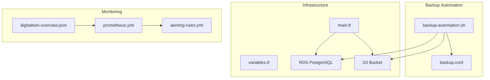
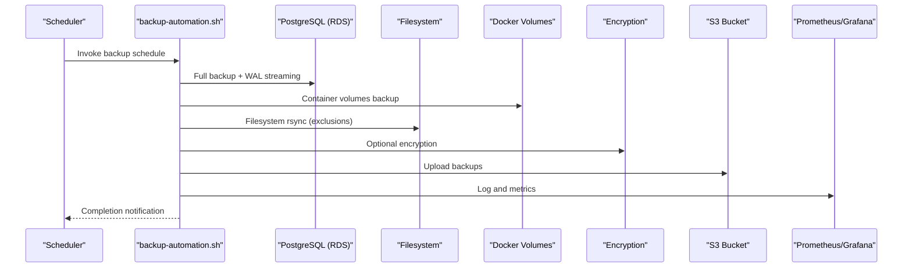
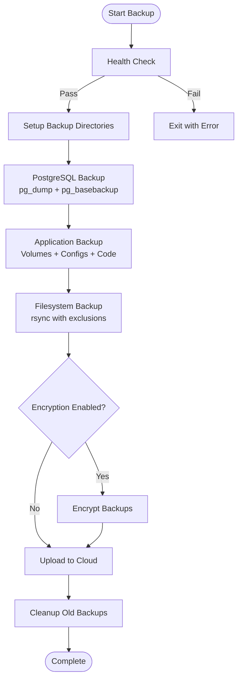
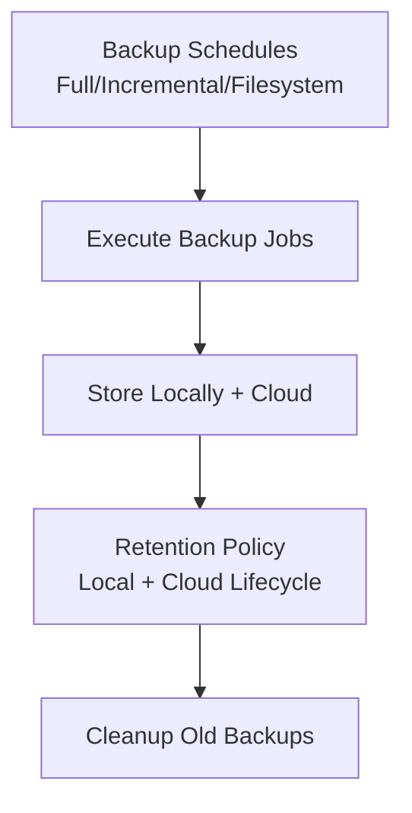
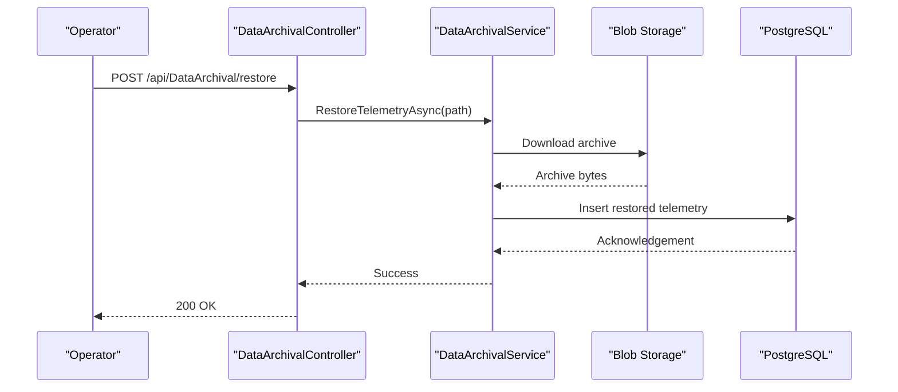
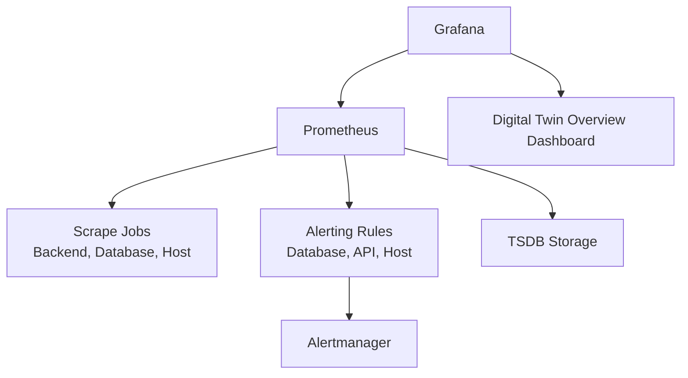
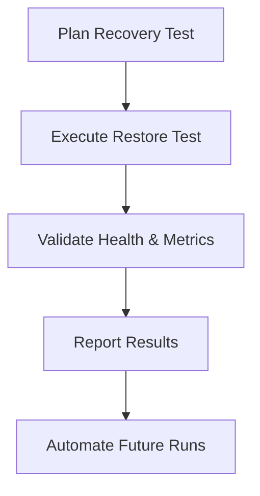
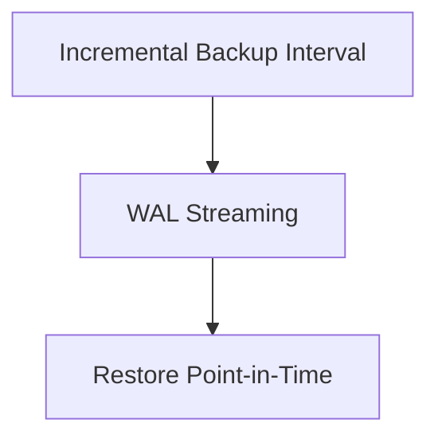
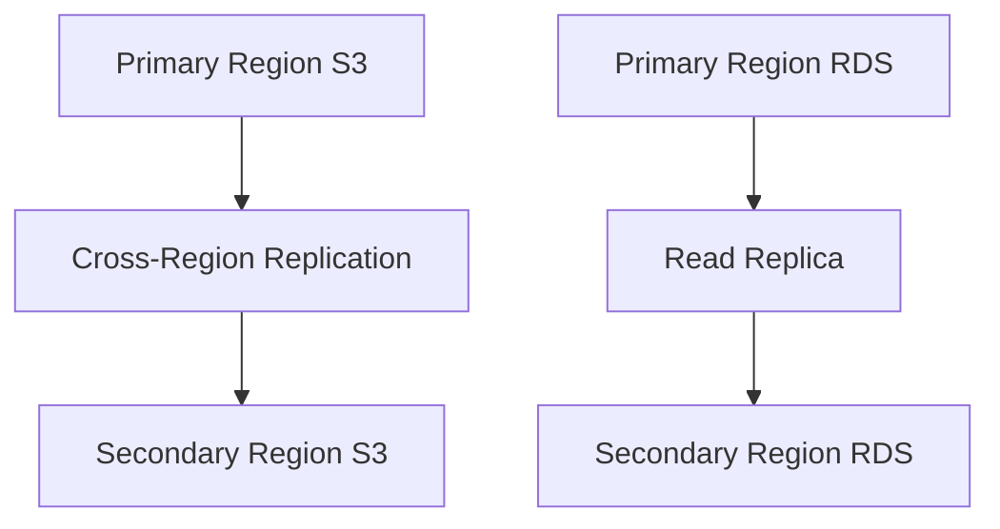
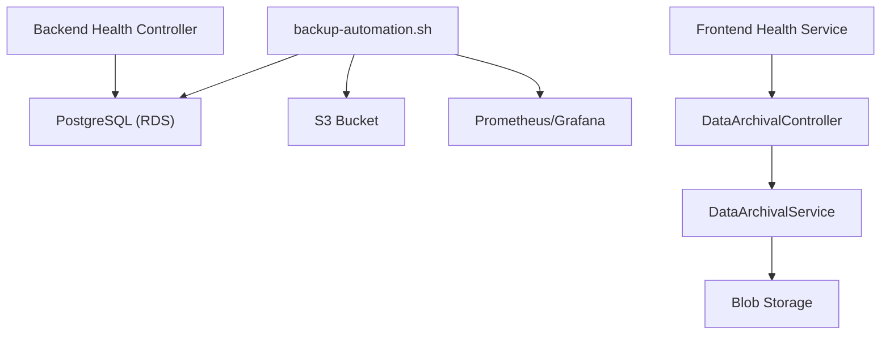

# Backup and Disaster Recovery

<cite>
**Referenced Files in This Document**
- [backup-automation.sh](file://scripts/backup-automation.sh)
- [backup.conf](file://scripts/backup.conf)
- [main.tf](file://infrastructure/main.tf)
- [variables.tf](file://infrastructure/variables.tf)
- [prometheus.yml](file://monitoring/prometheus/prometheus.yml)
- [alerting-rules.yml](file://monitoring/prometheus/alerting-rules.yml)
- [digitaltwin-overview.json](file://monitoring/grafana/dashboards/digitaltwin-overview.json)
- [docker-compose.prod.yml](file://docker-compose.prod.yml)
- [docker-compose.yml](file://docker-compose.yml)
- [DataArchivalController.cs](file://src/api/Controllers/DataArchivalController.cs)
- [DataArchivalService.cs](file://src/api/Services/Infrastructure/DataArchivalService.cs)
- [HealthController.cs](file://src/api/Controllers/HealthController.cs)
- [health.service.ts](file://src/frontend/src/services/health.ts)
- [health.service.ts](file://src/ui/digital-twin-dashboard/src/services/health.service.ts)
</cite>

## Table of Contents
1. [Introduction](#introduction)
2. [Project Structure](#project-structure)
3. [Core Components](#core-components)
4. [Architecture Overview](#architecture-overview)
5. [Detailed Component Analysis](#detailed-component-analysis)
6. [Dependency Analysis](#dependency-analysis)
7. [Performance Considerations](#performance-considerations)
8. [Troubleshooting Guide](#troubleshooting-guide)
9. [Conclusion](#conclusion)
10. [Appendices](#appendices)

## Introduction
This document defines comprehensive backup and disaster recovery procedures for the Digital Twin Platform. It covers automated backup strategies, database backup scheduling, retention policies, disaster recovery procedures, monitoring integration for backup verification and alerting, and recovery testing. Practical examples include backup verification scripts, incremental backup strategies, and cross-region replication setups. Guidance is also provided for troubleshooting backup failures, recovery time objectives, and data integrity validation processes.

## Project Structure
The backup and disaster recovery solution spans three primary areas:
- Backup automation scripts and configuration
- Infrastructure provisioning with RDS and S3
- Monitoring stack for backup verification and alerting

**Diagram sources**
- [backup-automation.sh](file://scripts/backup-automation.sh#L1-L251)
- [backup.conf](file://scripts/backup.conf#L1-L115)
- [main.tf](file://infrastructure/main.tf#L144-L190)
- [variables.tf](file://infrastructure/variables.tf#L162-L173)
- [prometheus.yml](file://monitoring/prometheus/prometheus.yml#L1-L148)
- [alerting-rules.yml](file://monitoring/prometheus/alerting-rules.yml#L1-L184)
- [digitaltwin-overview.json](file://monitoring/grafana/dashboards/digitaltwin-overview.json#L1-L279)

**Section sources**
- [backup-automation.sh](file://scripts/backup-automation.sh#L1-L251)
- [backup.conf](file://scripts/backup.conf#L1-L115)
- [main.tf](file://infrastructure/main.tf#L144-L190)
- [variables.tf](file://infrastructure/variables.tf#L162-L173)
- [prometheus.yml](file://monitoring/prometheus/prometheus.yml#L1-L148)
- [alerting-rules.yml](file://monitoring/prometheus/alerting-rules.yml#L1-L184)
- [digitaltwin-overview.json](file://monitoring/grafana/dashboards/digitaltwin-overview.json#L1-L279)

## Core Components
- Backup automation script orchestrates database, application, and filesystem backups, integrity verification, encryption, cloud upload, and cleanup.
- Configuration file centralizes environment-specific settings, schedules, retention, and notification preferences.
- Infrastructure provisions managed PostgreSQL (RDS), S3 buckets, and related security resources.
- Monitoring stack scrapes metrics and exposes alerts for backup-related health and performance.

Key responsibilities:
- Automated backup execution and integrity verification
- Database backup scheduling and retention
- Cross-region replication and cloud storage integration
- Backup verification and alerting
- Recovery testing and restoration procedures

**Section sources**
- [backup-automation.sh](file://scripts/backup-automation.sh#L63-L91)
- [backup.conf](file://scripts/backup.conf#L32-L84)
- [main.tf](file://infrastructure/main.tf#L144-L190)
- [alerting-rules.yml](file://monitoring/prometheus/alerting-rules.yml#L34-L61)

## Architecture Overview
The backup and disaster recovery architecture integrates scripted backups with managed cloud services and a monitoring stack.

**Diagram sources**
- [backup-automation.sh](file://scripts/backup-automation.sh#L63-L91)
- [backup-automation.sh](file://scripts/backup-automation.sh#L93-L119)
- [backup-automation.sh](file://scripts/backup-automation.sh#L121-L153)
- [backup-automation.sh](file://scripts/backup-automation.sh#L155-L167)
- [backup-automation.sh](file://scripts/backup-automation.sh#L169-L180)
- [backup.conf](file://scripts/backup.conf#L32-L36)
- [prometheus.yml](file://monitoring/prometheus/prometheus.yml#L48-L67)
- [digitaltwin-overview.json](file://monitoring/grafana/dashboards/digitaltwin-overview.json#L1-L279)

## Detailed Component Analysis

### Backup Automation Script Implementation
The script performs:
- Health checks (disk space, database connectivity)
- Directory setup for backup categories
- Database backup using custom format with compression and WAL streaming
- Application backup of Docker volumes and container configs
- Filesystem backup with exclusions
- Optional encryption and cloud upload
- Cleanup of old backups and empty directories

**Diagram sources**
- [backup-automation.sh](file://scripts/backup-automation.sh#L196-L217)
- [backup-automation.sh](file://scripts/backup-automation.sh#L54-L61)
- [backup-automation.sh](file://scripts/backup-automation.sh#L63-L91)
- [backup-automation.sh](file://scripts/backup-automation.sh#L93-L119)
- [backup-automation.sh](file://scripts/backup-automation.sh#L121-L153)
- [backup-automation.sh](file://scripts/backup-automation.sh#L155-L167)
- [backup-automation.sh](file://scripts/backup-automation.sh#L169-L180)
- [backup-automation.sh](file://scripts/backup-automation.sh#L182-L194)

**Section sources**
- [backup-automation.sh](file://scripts/backup-automation.sh#L27-L52)
- [backup-automation.sh](file://scripts/backup-automation.sh#L196-L217)
- [backup-automation.sh](file://scripts/backup-automation.sh#L220-L245)

### Database Backup Scheduling and Retention Policies
- Schedules are configured in the configuration file with cron-like expressions for full, incremental, and filesystem backups.
- Retention is controlled by days and automatic cleanup of old files.
- RDS backup retention is configured at the infrastructure level.

**Diagram sources**
- [backup.conf](file://scripts/backup.conf#L32-L42)
- [backup.conf](file://scripts/backup.conf#L182-L194)
- [main.tf](file://infrastructure/main.tf#L172-L174)

**Section sources**
- [backup.conf](file://scripts/backup.conf#L32-L42)
- [backup.conf](file://scripts/backup.conf#L182-L194)
- [main.tf](file://infrastructure/main.tf#L172-L174)

### Disaster Recovery Procedures
- Recovery testing is scheduled weekly to validate restore procedures.
- Restoration of telemetry archives is supported via the archival service.
- Health endpoints provide readiness and liveness checks for recovery validation.

**Diagram sources**
- [DataArchivalController.cs](file://src/api/Controllers/DataArchivalController.cs#L11-L16)
- [DataArchivalService.cs](file://src/api/Services/Infrastructure/DataArchivalService.cs#L366-L407)
- [HealthController.cs](file://src/api/Controllers/HealthController.cs#L31-L69)

**Section sources**
- [backup.conf](file://scripts/backup.conf#L48-L50)
- [DataArchivalController.cs](file://src/api/Controllers/DataArchivalController.cs#L11-L16)
- [DataArchivalService.cs](file://src/api/Services/Infrastructure/DataArchivalService.cs#L366-L407)
- [HealthController.cs](file://src/api/Controllers/HealthController.cs#L31-L69)

### Monitoring Integration for Backup Verification and Alerting
- Prometheus scrapes backend, database, and host metrics.
- Alerting rules detect database downtime, slow responses, and resource pressure.
- Grafana dashboard displays uptime, response time, error rates, and recent alerts.

**Diagram sources**
- [prometheus.yml](file://monitoring/prometheus/prometheus.yml#L18-L116)
- [alerting-rules.yml](file://monitoring/prometheus/alerting-rules.yml#L6-L61)
- [digitaltwin-overview.json](file://monitoring/grafana/dashboards/digitaltwin-overview.json#L1-L279)

**Section sources**
- [prometheus.yml](file://monitoring/prometheus/prometheus.yml#L18-L116)
- [alerting-rules.yml](file://monitoring/prometheus/alerting-rules.yml#L6-L61)
- [digitaltwin-overview.json](file://monitoring/grafana/dashboards/digitaltwin-overview.json#L1-L279)

### Recovery Testing Procedures
- Weekly recovery tests are scheduled to validate restore workflows.
- Frontend and backend health services provide readiness and liveness checks.
- Monitoring dashboards surface recent alerts for immediate triage.

**Diagram sources**
- [backup.conf](file://scripts/backup.conf#L48-L50)
- [health.service.ts](file://src/frontend/src/services/health.ts#L20-L37)
- [health.service.ts](file://src/ui/digital-twin-dashboard/src/services/health.service.ts#L21-L73)
- [digitaltwin-overview.json](file://monitoring/grafana/dashboards/digitaltwin-overview.json#L247-L266)

**Section sources**
- [backup.conf](file://scripts/backup.conf#L48-L50)
- [health.service.ts](file://src/frontend/src/services/health.ts#L20-L37)
- [health.service.ts](file://src/ui/digital-twin-dashboard/src/services/health.service.ts#L21-L73)
- [digitaltwin-overview.json](file://monitoring/grafana/dashboards/digitaltwin-overview.json#L247-L266)

### Incremental Backup Strategies
- The configuration enables incremental backups at short intervals.
- WAL streaming ensures point-in-time recoverability for PostgreSQL.

**Diagram sources**
- [backup.conf](file://scripts/backup.conf#L34-L36)
- [backup-automation.sh](file://scripts/backup-automation.sh#L78-L85)

**Section sources**
- [backup.conf](file://scripts/backup.conf#L34-L36)
- [backup-automation.sh](file://scripts/backup-automation.sh#L78-L85)

### Cross-Region Replication Setups
- Cloud storage replication can be configured at the bucket level for cross-region durability.
- RDS supports automated snapshots and cross-region read replicas for improved DR.

**Diagram sources**
- [main.tf](file://infrastructure/main.tf#L144-L190)

**Section sources**
- [main.tf](file://infrastructure/main.tf#L144-L190)

## Dependency Analysis
Backup and disaster recovery depend on:
- Database connectivity for integrity verification
- Cloud storage for offsite retention
- Monitoring for backup health and alerting
- Application health endpoints for readiness validation

**Diagram sources**
- [backup-automation.sh](file://scripts/backup-automation.sh#L213-L214)
- [DataArchivalController.cs](file://src/api/Controllers/DataArchivalController.cs#L11-L16)
- [DataArchivalService.cs](file://src/api/Services/Infrastructure/DataArchivalService.cs#L366-L407)
- [HealthController.cs](file://src/api/Controllers/HealthController.cs#L31-L69)
- [health.service.ts](file://src/frontend/src/services/health.ts#L20-L37)

**Section sources**
- [backup-automation.sh](file://scripts/backup-automation.sh#L213-L214)
- [DataArchivalController.cs](file://src/api/Controllers/DataArchivalController.cs#L11-L16)
- [DataArchivalService.cs](file://src/api/Services/Infrastructure/DataArchivalService.cs#L366-L407)
- [HealthController.cs](file://src/api/Controllers/HealthController.cs#L31-L69)
- [health.service.ts](file://src/frontend/src/services/health.ts#L20-L37)

## Performance Considerations
- Compression and parallelism are configurable to balance throughput and resource usage.
- Disk space thresholds prevent backup failures due to insufficient storage.
- Monitoring TSDB retention and query concurrency help maintain performance under load.

[No sources needed since this section provides general guidance]

## Troubleshooting Guide
Common issues and resolutions:
- Backup failures due to insufficient disk space: ensure adequate free space before backup runs.
- Database connectivity errors: verify credentials and network access to RDS.
- Encryption failures: confirm encryption key presence and permissions.
- Cloud upload failures: validate AWS credentials and bucket permissions.
- Recovery test failures: check restore paths and blob/container access.

Verification steps:
- Run integrity checks for database dumps and WAL archives.
- Confirm backup files appear in cloud storage with expected metadata.
- Validate recovery by restoring to a test environment and verifying data.

**Section sources**
- [backup-automation.sh](file://scripts/backup-automation.sh#L205-L211)
- [backup-automation.sh](file://scripts/backup-automation.sh#L213-L214)
- [backup-automation.sh](file://scripts/backup-automation.sh#L155-L167)
- [backup-automation.sh](file://scripts/backup-automation.sh#L169-L180)
- [DataArchivalService.cs](file://src/api/Services/Infrastructure/DataArchivalService.cs#L366-L407)

## Conclusion
The Digital Twin Platform implements a robust backup and disaster recovery framework combining scripted automation, managed cloud services, and comprehensive monitoring. By adhering to the documented schedules, retention policies, and verification procedures, teams can achieve reliable data protection, validated recovery testing, and timely incident response.

[No sources needed since this section summarizes without analyzing specific files]

## Appendices

### Backup Verification Scripts
- Integrity verification for database backups is performed automatically after dump creation.
- Example verification steps:
  - Confirm dump file exists and is readable.
  - Validate WAL directory contains streamed logs.
  - Check cloud sync completion and object existence.

**Section sources**
- [backup-automation.sh](file://scripts/backup-automation.sh#L87-L88)
- [backup-automation.sh](file://scripts/backup-automation.sh#L169-L180)

### Recovery Time Objectives
- Full backup frequency and retention define acceptable recovery time and point-in-time recovery windows.
- Recovery testing schedules ensure periodic validation of restore procedures.

**Section sources**
- [backup.conf](file://scripts/backup.conf#L34-L36)
- [backup.conf](file://scripts/backup.conf#L48-L50)

### Data Integrity Validation Processes
- Database integrity checks are integrated into the backup script.
- Monitoring dashboards and alerts provide visibility into backup health and performance.

**Section sources**
- [backup-automation.sh](file://scripts/backup-automation.sh#L213-L214)
- [digitaltwin-overview.json](file://monitoring/grafana/dashboards/digitaltwin-overview.json#L1-L279)