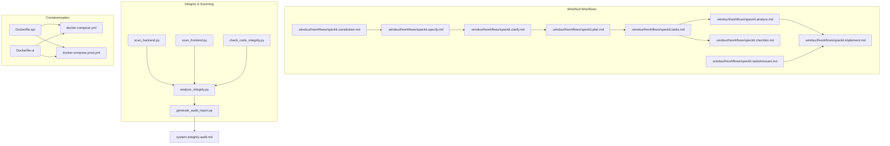
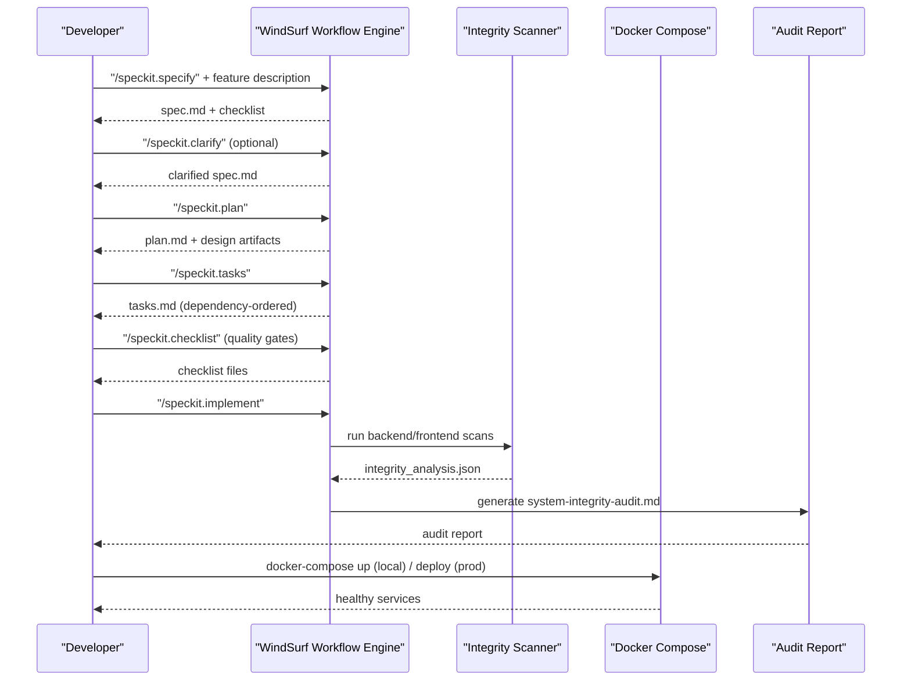
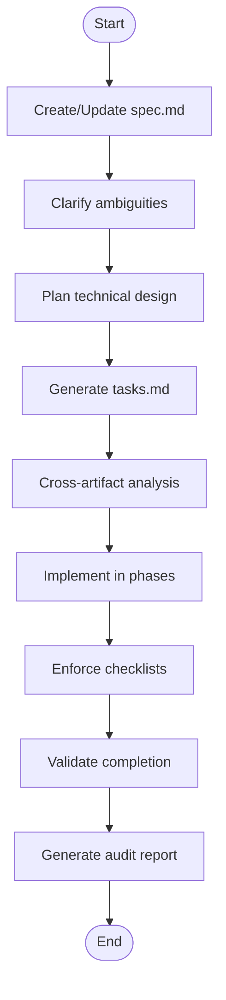
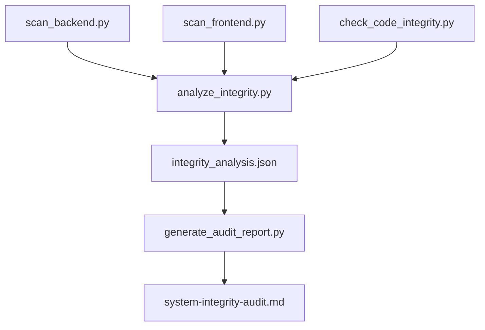
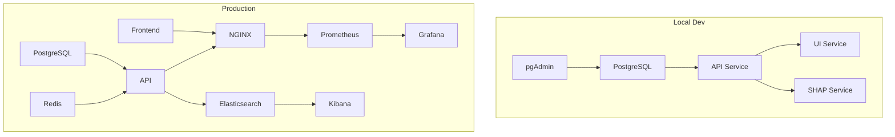
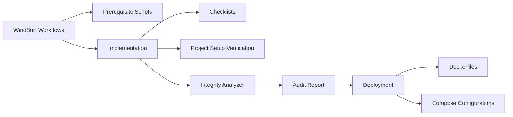

# CI/CD Pipeline and Automation

<cite>
**Referenced Files in This Document**
- [speckit.analyze.md](file://.windsurf/workflows/speckit.analyze.md)
- [speckit.plan.md](file://.windsurf/workflows/speckit.plan.md)
- [speckit.implement.md](file://.windsurf/workflows/speckit.implement.md)
- [speckit.checklist.md](file://.windsurf/workflows/speckit.checklist.md)
- [speckit.clarify.md](file://.windsurf/workflows/speckit.clarify.md)
- [speckit.constitution.md](file://.windsurf/workflows/speckit.constitution.md)
- [speckit.specify.md](file://.windsurf/workflows/speckit.specify.md)
- [speckit.tasks.md](file://.windsurf/workflows/speckit.tasks.md)
- [speckit.taskstoissues.md](file://.windsurf/workflows/speckit.taskstoissues.md)
- [check_code_integrity.py](file://check_code_integrity.py)
- [scan_backend.py](file://scan_backend.py)
- [scan_frontend.py](file://scan_frontend.py)
- [analyze_integrity.py](file://analyze_integrity.py)
- [generate_audit_report.py](file://generate_audit_report.py)
- [Dockerfile.api](file://Dockerfile.api)
- [Dockerfile.ui](file://Dockerfile.ui)
- [docker-compose.yml](file://docker-compose.yml)
- [docker-compose.prod.yml](file://docker-compose.prod.yml)
- [system-integrity-audit.md](file://system-integrity-audit.md)
</cite>

## Table of Contents
1. [Introduction](#introduction)
2. [Project Structure](#project-structure)
3. [Core Components](#core-components)
4. [Architecture Overview](#architecture-overview)
5. [Detailed Component Analysis](#detailed-component-analysis)
6. [Dependency Analysis](#dependency-analysis)
7. [Performance Considerations](#performance-considerations)
8. [Troubleshooting Guide](#troubleshooting-guide)
9. [Conclusion](#conclusion)
10. [Appendices](#appendices)

## Introduction
This document describes a comprehensive CI/CD pipeline and automation framework tailored to the Digital Twin Platform’s development workflow. It explains automated code integrity checking, backend and frontend scanning processes, and the WindSurf workflow configuration for development tasks spanning analysis, planning, and implementation. It also covers automated testing integration, code quality gates, deployment automation, practical pipeline configuration examples, branch protection rules, and automated release processes. Finally, it provides troubleshooting guidance for pipeline failures, performance optimization tips, and integration with development tools and platforms.

## Project Structure
The repository organizes automation around:
- WindSurf workflow definitions (.windsurf/workflows) that define repeatable phases for specification, planning, tasking, analysis, and implementation.
- Python-based integrity and scanning scripts for backend and frontend systems.
- Containerization and orchestration via Dockerfiles and docker-compose configurations for local and production environments.
- A generated system-integrity-audit report that consolidates findings across backend, frontend, DTO contracts, and implementation integrity.

**Diagram sources**
- [.windsurf/workflows/speckit.specify.md](file://.windsurf/workflows/speckit.specify.md#L1-L259)
- [.windsurf/workflows/speckit.clarify.md](file://.windsurf/workflows/speckit.clarify.md#L1-L182)
- [.windsurf/workflows/speckit.plan.md](file://.windsurf/workflows/speckit.plan.md#L1-L90)
- [.windsurf/workflows/speckit.tasks.md](file://.windsurf/workflows/speckit.tasks.md#L1-L138)
- [.windsurf/workflows/speckit.analyze.md](file://.windsurf/workflows/speckit.analyze.md#L1-L185)
- [.windsurf/workflows/speckit.implement.md](file://.windsurf/workflows/speckit.implement.md#L1-L136)
- [.windsurf/workflows/speckit.checklist.md](file://.windsurf/workflows/speckit.checklist.md#L1-L295)
- [.windsurf/workflows/speckit.constitution.md](file://.windsurf/workflows/speckit.constitution.md#L1-L83)
- [.windsurf/workflows/speckit.taskstoissues.md](file://.windsurf/workflows/speckit.taskstoissues.md#L1-L31)
- [check_code_integrity.py](file://check_code_integrity.py#L1-L32)
- [scan_backend.py](file://scan_backend.py#L1-L75)
- [scan_frontend.py](file://scan_frontend.py#L1-L112)
- [analyze_integrity.py](file://analyze_integrity.py#L1-L178)
- [generate_audit_report.py](file://generate_audit_report.py#L1-L90)
- [Dockerfile.api](file://Dockerfile.api#L1-L74)
- [Dockerfile.ui](file://Dockerfile.ui#L1-L13)
- [docker-compose.yml](file://docker-compose.yml#L1-L81)
- [docker-compose.prod.yml](file://docker-compose.prod.yml#L1-L274)

**Section sources**
- [.windsurf/workflows/speckit.specify.md](file://.windsurf/workflows/speckit.specify.md#L1-L259)
- [.windsurf/workflows/speckit.plan.md](file://.windsurf/workflows/speckit.plan.md#L1-L90)
- [.windsurf/workflows/speckit.tasks.md](file://.windsurf/workflows/speckit.tasks.md#L1-L138)
- [.windsurf/workflows/speckit.analyze.md](file://.windsurf/workflows/speckit.analyze.md#L1-L185)
- [.windsurf/workflows/speckit.implement.md](file://.windsurf/workflows/speckit.implement.md#L1-L136)
- [check_code_integrity.py](file://check_code_integrity.py#L1-L32)
- [scan_backend.py](file://scan_backend.py#L1-L75)
- [scan_frontend.py](file://scan_frontend.py#L1-L112)
- [analyze_integrity.py](file://analyze_integrity.py#L1-L178)
- [generate_audit_report.py](file://generate_audit_report.py#L1-L90)
- [Dockerfile.api](file://Dockerfile.api#L1-L74)
- [Dockerfile.ui](file://Dockerfile.ui#L1-L13)
- [docker-compose.yml](file://docker-compose.yml#L1-L81)
- [docker-compose.prod.yml](file://docker-compose.prod.yml#L1-L274)

## Core Components
- WindSurf workflow engine orchestrates development phases:
  - Specification creation and quality validation
  - Clarification of ambiguous requirements
  - Planning with technical context and contracts
  - Task generation with dependency ordering
  - Cross-artifact analysis for consistency and coverage
  - Implementation with checklist enforcement and project setup verification
  - Checklist-driven requirements quality validation
  - Optional conversion of tasks to GitHub issues
- Integrity and scanning pipeline:
  - Backend feature mapping and authorization detection
  - Frontend service/method mapping and component usage discovery
  - Cross-endpoint matching, dead code detection, and TODO markers
  - Aggregated integrity report generation
- Containerization and deployment:
  - Multi-stage Dockerfiles for API and UI
  - Local compose for dev and prod compose for orchestrated services

**Section sources**
- [.windsurf/workflows/speckit.specify.md](file://.windsurf/workflows/speckit.specify.md#L1-L259)
- [.windsurf/workflows/speckit.clarify.md](file://.windsurf/workflows/speckit.clarify.md#L1-L182)
- [.windsurf/workflows/speckit.plan.md](file://.windsurf/workflows/speckit.plan.md#L1-L90)
- [.windsurf/workflows/speckit.tasks.md](file://.windsurf/workflows/speckit.tasks.md#L1-L138)
- [.windsurf/workflows/speckit.analyze.md](file://.windsurf/workflows/speckit.analyze.md#L1-L185)
- [.windsurf/workflows/speckit.implement.md](file://.windsurf/workflows/speckit.implement.md#L1-L136)
- [.windsurf/workflows/speckit.checklist.md](file://.windsurf/workflows/speckit.checklist.md#L1-L295)
- [check_code_integrity.py](file://check_code_integrity.py#L1-L32)
- [scan_backend.py](file://scan_backend.py#L1-L75)
- [scan_frontend.py](file://scan_frontend.py#L1-L112)
- [analyze_integrity.py](file://analyze_integrity.py#L1-L178)
- [generate_audit_report.py](file://generate_audit_report.py#L1-L90)
- [Dockerfile.api](file://Dockerfile.api#L1-L74)
- [Dockerfile.ui](file://Dockerfile.ui#L1-L13)
- [docker-compose.yml](file://docker-compose.yml#L1-L81)
- [docker-compose.prod.yml](file://docker-compose.prod.yml#L1-L274)

## Architecture Overview
The CI/CD architecture integrates WindSurf workflows with integrity scanning and containerized deployment. The pipeline begins with specification and clarification, proceeds through planning and tasking, enforces quality gates via checklists, executes implementation with dependency-aware tasking, and validates system integrity across backend and frontend. Production deployment leverages docker-compose with orchestrated services and health checks.

**Diagram sources**
- [.windsurf/workflows/speckit.specify.md](file://.windsurf/workflows/speckit.specify.md#L1-L259)
- [.windsurf/workflows/speckit.clarify.md](file://.windsurf/workflows/speckit.clarify.md#L1-L182)
- [.windsurf/workflows/speckit.plan.md](file://.windsurf/workflows/speckit.plan.md#L1-L90)
- [.windsurf/workflows/speckit.tasks.md](file://.windsurf/workflows/speckit.tasks.md#L1-L138)
- [.windsurf/workflows/speckit.checklist.md](file://.windsurf/workflows/speckit.checklist.md#L1-L295)
- [.windsurf/workflows/speckit.implement.md](file://.windsurf/workflows/speckit.implement.md#L1-L136)
- [scan_backend.py](file://scan_backend.py#L1-L75)
- [scan_frontend.py](file://scan_frontend.py#L1-L112)
- [analyze_integrity.py](file://analyze_integrity.py#L1-L178)
- [generate_audit_report.py](file://generate_audit_report.py#L1-L90)
- [docker-compose.yml](file://docker-compose.yml#L1-L81)
- [docker-compose.prod.yml](file://docker-compose.prod.yml#L1-L274)

## Detailed Component Analysis

### WindSurf Workflow Phases
- Specification and Clarification: Establish feature scope, user scenarios, and success criteria; resolve ambiguities before planning.
- Planning: Generate technical plan, research decisions, data model, contracts, and agent context updates.
- Tasking: Produce dependency-ordered tasks per user story; validate completeness and format.
- Analysis: Cross-artifact consistency and coverage analysis; constitution alignment; duplication/ambiguity/underspecification detection.
- Implementation: Enforce checklists, project setup verification, phase-by-phase execution respecting dependencies and parallelism, and completion validation.
- Quality Gates: Checklist-driven requirements quality validation; optional conversion of tasks to GitHub issues.

**Diagram sources**
- [.windsurf/workflows/speckit.specify.md](file://.windsurf/workflows/speckit.specify.md#L1-L259)
- [.windsurf/workflows/speckit.clarify.md](file://.windsurf/workflows/speckit.clarify.md#L1-L182)
- [.windsurf/workflows/speckit.plan.md](file://.windsurf/workflows/speckit.plan.md#L1-L90)
- [.windsurf/workflows/speckit.tasks.md](file://.windsurf/workflows/speckit.tasks.md#L1-L138)
- [.windsurf/workflows/speckit.analyze.md](file://.windsurf/workflows/speckit.analyze.md#L1-L185)
- [.windsurf/workflows/speckit.implement.md](file://.windsurf/workflows/speckit.implement.md#L1-L136)
- [generate_audit_report.py](file://generate_audit_report.py#L1-L90)

**Section sources**
- [.windsurf/workflows/speckit.specify.md](file://.windsurf/workflows/speckit.specify.md#L1-L259)
- [.windsurf/workflows/speckit.clarify.md](file://.windsurf/workflows/speckit.clarify.md#L1-L182)
- [.windsurf/workflows/speckit.plan.md](file://.windsurf/workflows/speckit.plan.md#L1-L90)
- [.windsurf/workflows/speckit.tasks.md](file://.windsurf/workflows/speckit.tasks.md#L1-L138)
- [.windsurf/workflows/speckit.analyze.md](file://.windsurf/workflows/speckit.analyze.md#L1-L185)
- [.windsurf/workflows/speckit.implement.md](file://.windsurf/workflows/speckit.implement.md#L1-L136)
- [.windsurf/workflows/speckit.checklist.md](file://.windsurf/workflows/speckit.checklist.md#L1-L295)
- [.windsurf/workflows/speckit.taskstoissues.md](file://.windsurf/workflows/speckit.taskstoissues.md#L1-L31)

### Automated Code Integrity Checking
- Backend scanning extracts controllers, routes, authorization attributes, and endpoint signatures; outputs a backend feature map.
- Frontend scanning discovers service methods, HTTP verbs, URLs, and component usage; outputs a frontend usage map.
- Integrity analyzer normalizes routes and HTTP methods, matches frontend calls to backend endpoints, detects unimplemented interface methods, identifies dead endpoints, and catalogs TODO placeholders.
- Audit report synthesizes findings into a production-readiness verdict and recommendations.

**Diagram sources**
- [scan_backend.py](file://scan_backend.py#L1-L75)
- [scan_frontend.py](file://scan_frontend.py#L1-L112)
- [check_code_integrity.py](file://check_code_integrity.py#L1-L32)
- [analyze_integrity.py](file://analyze_integrity.py#L1-L178)
- [generate_audit_report.py](file://generate_audit_report.py#L1-L90)
- [system-integrity-audit.md](file://system-integrity-audit.md#L1-L90)

**Section sources**
- [scan_backend.py](file://scan_backend.py#L1-L75)
- [scan_frontend.py](file://scan_frontend.py#L1-L112)
- [check_code_integrity.py](file://check_code_integrity.py#L1-L32)
- [analyze_integrity.py](file://analyze_integrity.py#L1-L178)
- [generate_audit_report.py](file://generate_audit_report.py#L1-L90)
- [system-integrity-audit.md](file://system-integrity-audit.md#L1-L90)

### Containerization and Deployment
- API service: Multi-stage .NET 9 Alpine build with trimming, single-file publish, health checks, non-root user, and environment configuration.
- UI service: Node 20 Alpine build followed by Nginx static serving.
- Local compose: PostgreSQL, pgAdmin, API, UI, and SHAP service with health checks and inter-service dependencies.
- Production compose: Frontend, API, PostgreSQL, Redis, NGINX reverse proxy, Prometheus/Grafana, and ELK stack with resource limits, replicas, and health checks.

**Diagram sources**
- [Dockerfile.api](file://Dockerfile.api#L1-L74)
- [Dockerfile.ui](file://Dockerfile.ui#L1-L13)
- [docker-compose.yml](file://docker-compose.yml#L1-L81)
- [docker-compose.prod.yml](file://docker-compose.prod.yml#L1-L274)

**Section sources**
- [Dockerfile.api](file://Dockerfile.api#L1-L74)
- [Dockerfile.ui](file://Dockerfile.ui#L1-L13)
- [docker-compose.yml](file://docker-compose.yml#L1-L81)
- [docker-compose.prod.yml](file://docker-compose.prod.yml#L1-L274)

## Dependency Analysis
- WindSurf workflows depend on prerequisite scripts to derive feature directories and available documents, ensuring deterministic execution contexts.
- Implementation depends on checklist completion and project setup verification to enforce quality gates before code changes proceed.
- Integrity scanning depends on backend and frontend artifacts; the analyzer aggregates findings into a unified report.
- Deployment depends on Dockerfiles and compose configurations; production compose defines service dependencies, health checks, and resource allocation.

**Diagram sources**
- [.windsurf/workflows/speckit.implement.md](file://.windsurf/workflows/speckit.implement.md#L1-L136)
- [analyze_integrity.py](file://analyze_integrity.py#L1-L178)
- [generate_audit_report.py](file://generate_audit_report.py#L1-L90)
- [Dockerfile.api](file://Dockerfile.api#L1-L74)
- [Dockerfile.ui](file://Dockerfile.ui#L1-L13)
- [docker-compose.yml](file://docker-compose.yml#L1-L81)
- [docker-compose.prod.yml](file://docker-compose.prod.yml#L1-L274)

**Section sources**
- [.windsurf/workflows/speckit.implement.md](file://.windsurf/workflows/speckit.implement.md#L1-L136)
- [analyze_integrity.py](file://analyze_integrity.py#L1-L178)
- [generate_audit_report.py](file://generate_audit_report.py#L1-L90)
- [Dockerfile.api](file://Dockerfile.api#L1-L74)
- [Dockerfile.ui](file://Dockerfile.ui#L1-L13)
- [docker-compose.yml](file://docker-compose.yml#L1-L81)
- [docker-compose.prod.yml](file://docker-compose.prod.yml#L1-L274)

## Performance Considerations
- Build optimization:
  - Use multi-stage Docker builds to minimize image size and improve pull times.
  - Enable .NET publish trimming, single-file, and ReadyToRun for faster startup and reduced footprint.
  - Cache NuGet/SDK layers and copy only necessary project files to speed up dotnet restore/build.
- Runtime efficiency:
  - Configure health checks and resource limits in production compose to ensure predictable scaling.
  - Use replicas and rolling updates for high availability with controlled rollout cadence.
- Scanning performance:
  - Limit file traversal to relevant directories and skip binary caches and logs.
  - Normalize and deduplicate route matching to reduce false positives and redundant comparisons.

[No sources needed since this section provides general guidance]

## Troubleshooting Guide
- WindSurf workflow prerequisites:
  - Ensure prerequisite scripts are executed to populate FEATURE_DIR and AVAILABLE_DOCS; missing paths cause early termination.
  - Validate that tasks.md exists before running analysis and implementation phases.
- Implementation checklist failures:
  - Incomplete checklists halt execution; review checklist status tables and complete outstanding items before proceeding.
  - Project setup verification ensures ignore files are created/updated for detected technologies; confirm patterns match project structure.
- Integrity scanning issues:
  - Backend feature map shows routes, methods, DTOs, and authorization; verify controller naming and route templates.
  - Frontend service map shows HTTP verbs and URLs; confirm URL normalization and parameter placeholders.
  - Dead endpoints and broken calls indicate routing mismatches; reconcile backend routes and frontend URLs.
  - Unimplemented interface methods imply missing service logic; implement or register missing methods.
- Deployment problems:
  - Local compose: verify service health checks and port bindings; ensure database is healthy before launching dependent services.
  - Production compose: confirm environment variables, secrets, and volume mounts; validate replicas and resource limits.

**Section sources**
- [.windsurf/workflows/speckit.implement.md](file://.windsurf/workflows/speckit.implement.md#L1-L136)
- [analyze_integrity.py](file://analyze_integrity.py#L1-L178)
- [system-integrity-audit.md](file://system-integrity-audit.md#L1-L90)
- [docker-compose.yml](file://docker-compose.yml#L1-L81)
- [docker-compose.prod.yml](file://docker-compose.prod.yml#L1-L274)

## Conclusion
The CI/CD pipeline and automation framework integrates WindSurf workflows with integrity scanning and containerized deployment to enforce quality gates, ensure cross-artifact consistency, and streamline development from specification to production. By leveraging dependency-ordered tasks, checklist-driven requirements validation, and automated system audits, teams can maintain high standards while accelerating delivery. Production-grade orchestration with health checks, replicas, and resource controls ensures reliable deployments.

[No sources needed since this section summarizes without analyzing specific files]

## Appendices

### Practical Pipeline Configuration Examples
- Local development:
  - Use docker-compose.yml to spin up PostgreSQL, pgAdmin, API, UI, and SHAP service with health checks and interdependencies.
- Production deployment:
  - Use docker-compose.prod.yml to deploy frontend, API, PostgreSQL, Redis, NGINX, Prometheus/Grafana, and ELK stack with replicas, resource limits, and health checks.
- WindSurf workflow execution:
  - Start with speckit.specify to create spec.md, optionally run speckit.clarify to resolve ambiguities, then speckit.plan to generate design artifacts.
  - Generate tasks.md with speckit.tasks, run speckit.analyze for consistency checks, enforce checklists with speckit.checklist, and execute with speckit.implement.
  - Optionally convert tasks to issues with speckit.taskstoissues.

**Section sources**
- [docker-compose.yml](file://docker-compose.yml#L1-L81)
- [docker-compose.prod.yml](file://docker-compose.prod.yml#L1-L274)
- [.windsurf/workflows/speckit.specify.md](file://.windsurf/workflows/speckit.specify.md#L1-L259)
- [.windsurf/workflows/speckit.clarify.md](file://.windsurf/workflows/speckit.clarify.md#L1-L182)
- [.windsurf/workflows/speckit.plan.md](file://.windsurf/workflows/speckit.plan.md#L1-L90)
- [.windsurf/workflows/speckit.tasks.md](file://.windsurf/workflows/speckit.tasks.md#L1-L138)
- [.windsurf/workflows/speckit.analyze.md](file://.windsurf/workflows/speckit.analyze.md#L1-L185)
- [.windsurf/workflows/speckit.implement.md](file://.windsurf/workflows/speckit.implement.md#L1-L136)
- [.windsurf/workflows/speckit.checklist.md](file://.windsurf/workflows/speckit.checklist.md#L1-L295)
- [.windsurf/workflows/speckit.taskstoissues.md](file://.windsurf/workflows/speckit.taskstoissues.md#L1-L31)

### Branch Protection Rules and Automated Release Processes
- Branch naming and numbering:
  - Use speckit.specify to derive a short feature name and determine the next available number across remote branches, local branches, and specs directories.
- Release automation:
  - Tag releases in production compose (TAG variable) and promote images across environments.
  - Enforce health checks and rolling updates to minimize downtime during releases.

**Section sources**
- [.windsurf/workflows/speckit.specify.md](file://.windsurf/workflows/speckit.specify.md#L27-L70)
- [docker-compose.prod.yml](file://docker-compose.prod.yml#L1-L274)

### Integration with Development Tools and Platforms
- GitHub integration:
  - Use speckit.taskstoissues to convert tasks into GitHub issues when the repository remote is a GitHub URL.
- Monitoring and observability:
  - Prometheus and Grafana dashboards provide metrics and alerting; Kibana visualizes logs from Elasticsearch.
- Container registries:
  - Push production images with tags for traceability and reproducible deployments.

**Section sources**
- [.windsurf/workflows/speckit.taskstoissues.md](file://.windsurf/workflows/speckit.taskstoissues.md#L1-L31)
- [docker-compose.prod.yml](file://docker-compose.prod.yml#L1-L274)