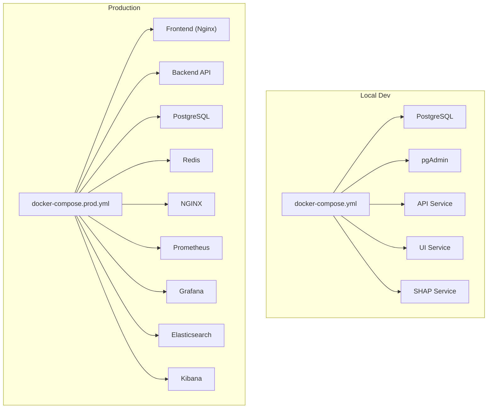
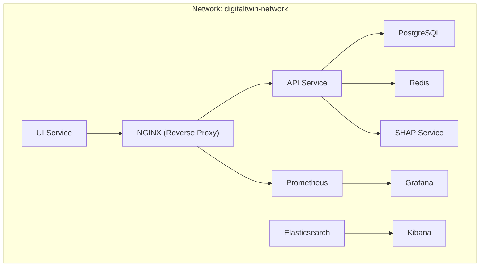
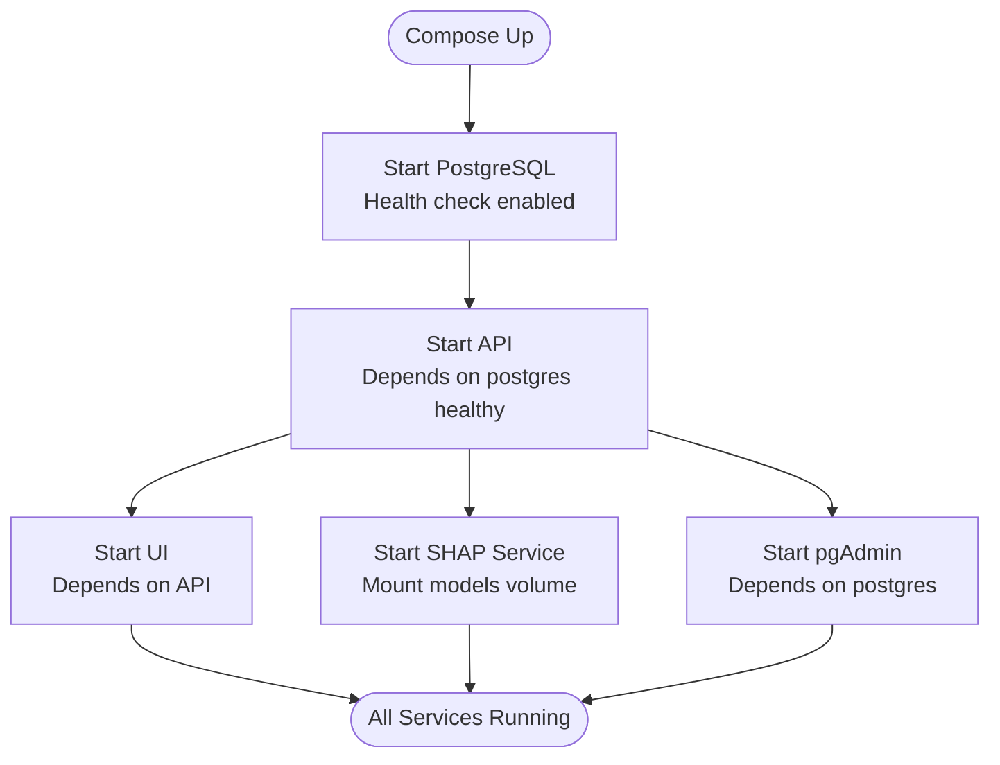
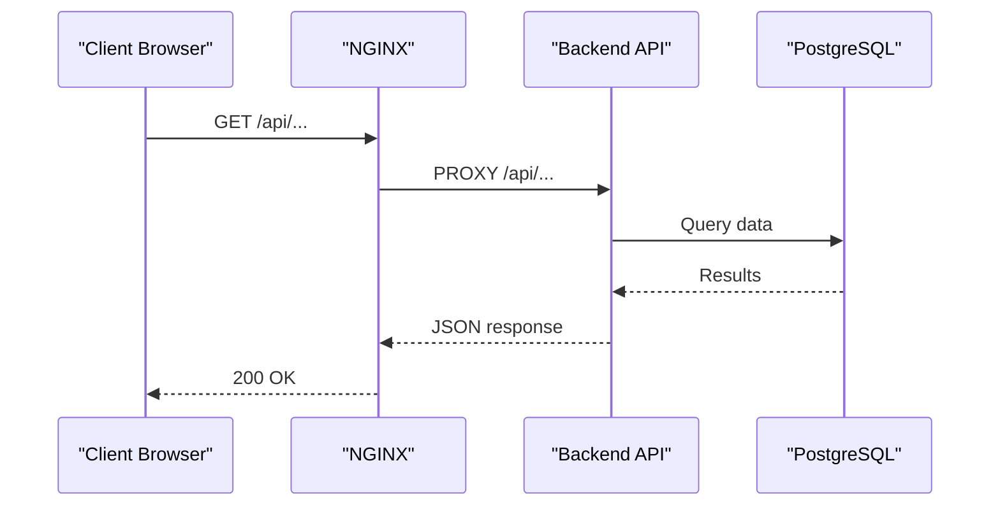
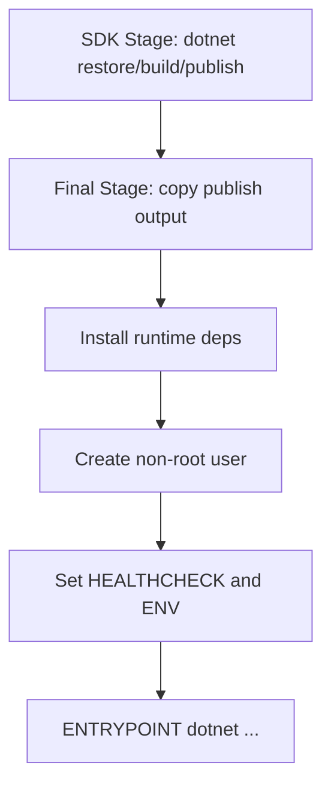
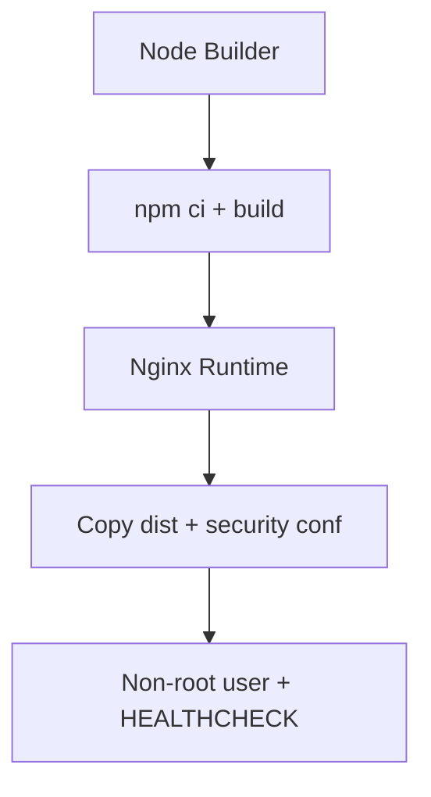
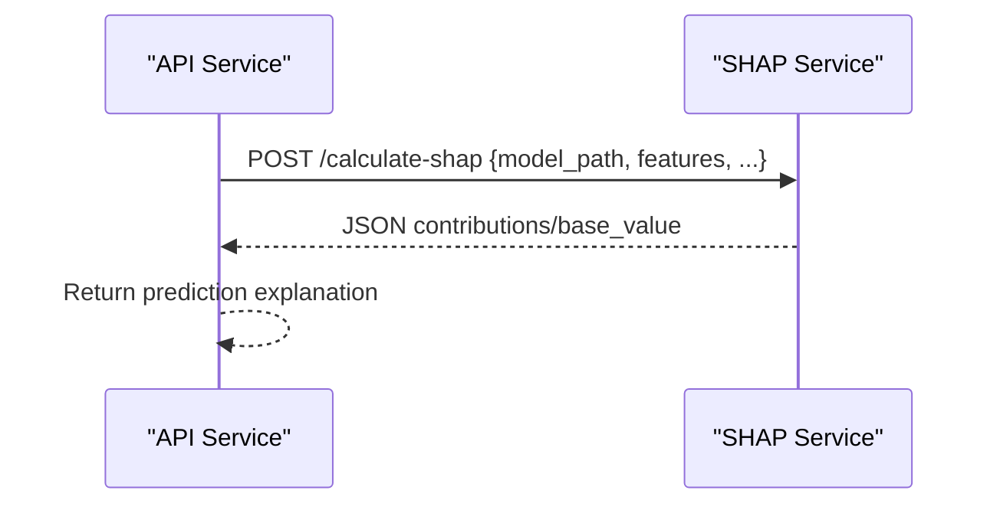
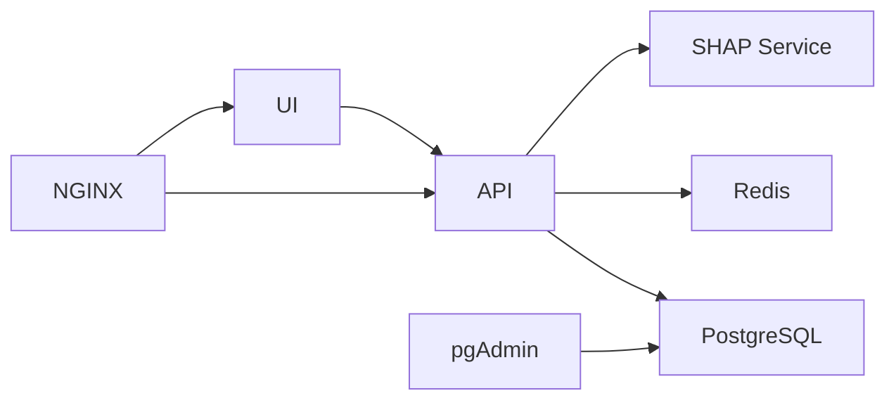

# Containerization and Docker Configuration

<cite>
**Referenced Files in This Document**
- [docker-compose.yml](file://docker-compose.yml)
- [docker-compose.prod.yml](file://docker-compose.prod.yml)
- [Dockerfile.api](file://Dockerfile.api)
- [Dockerfile.ui](file://Dockerfile.ui)
- [src/api/Dockerfile.prod](file://src/api/Dockerfile.prod)
- [src/ui/digital-twin-dashboard/Dockerfile.prod](file://src/ui/digital-twin-dashboard/Dockerfile.prod)
- [src/ui/digital-twin-dashboard/nginx.conf](file://src/ui/digital-twin-dashboard/nginx.conf)
- [src/ui/digital-twin-dashboard/nginx.prod.conf](file://src/ui/digital-twin-dashboard/nginx.prod.conf)
- [services/shap-service/Dockerfile](file://services/shap-service/Dockerfile)
- [services/shap-service/app.py](file://services/shap-service/app.py)
- [src/api/DigitalTwinPlatform.API/appsettings.json](file://src/api/DigitalTwinPlatform.API/appsettings.json)
- [src/api/DigitalTwinPlatform.API/appsettings.Development.json](file://src/api/DigitalTwinPlatform.API/appsettings.Development.json)
- [src/ui/digital-twin-dashboard/package.json](file://src/ui/digital-twin-dashboard/package.json)
</cite>

## Table of Contents
1. [Introduction](#introduction)
2. [Project Structure](#project-structure)
3. [Core Components](#core-components)
4. [Architecture Overview](#architecture-overview)
5. [Detailed Component Analysis](#detailed-component-analysis)
6. [Dependency Analysis](#dependency-analysis)
7. [Performance Considerations](#performance-considerations)
8. [Troubleshooting Guide](#troubleshooting-guide)
9. [Conclusion](#conclusion)
10. [Appendices](#appendices)

## Introduction
This document explains the containerization and Docker configuration for the Digital Twin Platform, focusing on multi-service orchestration and build strategies. It covers:
- Docker Compose setup for PostgreSQL, API, UI, and SHAP service
- Multi-stage Dockerfiles for API and UI with build optimization and security hardening
- Networking, volumes, and health checks
- Local development and production deployment patterns
- Scaling, troubleshooting, and production best practices

## Project Structure
The platform uses a combination of Docker Compose for local orchestration and multi-stage Dockerfiles for building optimized images. The primary services are:
- PostgreSQL database with persistence
- API service (ASP.NET Core) with health checks and resource limits
- UI service (Vue.js) served via Nginx
- SHAP service (Python/Flask) for ML explainability

**Diagram sources**
- [docker-compose.yml](file://docker-compose.yml#L1-L81)
- [docker-compose.prod.yml](file://docker-compose.prod.yml#L1-L274)

**Section sources**
- [docker-compose.yml](file://docker-compose.yml#L1-L81)
- [docker-compose.prod.yml](file://docker-compose.prod.yml#L1-L274)

## Core Components
- PostgreSQL: Central relational data store with named volume for persistence and health checks.
- API: ASP.NET Core service with multi-stage build, non-root user, health checks, and environment-specific configuration.
- UI: Vue.js application built with Vite and served by Nginx in production; development uses Vite’s dev server.
- SHAP Service: Python/Flask service exposing endpoints for SHAP value calculations, with health checks and gunicorn workers.

**Section sources**
- [docker-compose.yml](file://docker-compose.yml#L2-L19)
- [docker-compose.yml](file://docker-compose.yml#L34-L60)
- [docker-compose.yml](file://docker-compose.yml#L62-L74)
- [Dockerfile.api](file://Dockerfile.api#L1-L74)
- [Dockerfile.ui](file://Dockerfile.ui#L1-L13)
- [services/shap-service/Dockerfile](file://services/shap-service/Dockerfile#L1-L27)

## Architecture Overview
The system orchestrates four primary services plus supporting infrastructure. Local development uses a shared network and named volumes. Production adds Redis, NGINX reverse proxy, and monitoring/logging stacks.

**Diagram sources**
- [docker-compose.prod.yml](file://docker-compose.prod.yml#L5-L274)

**Section sources**
- [docker-compose.prod.yml](file://docker-compose.prod.yml#L5-L274)

## Detailed Component Analysis

### Docker Compose (Local Development)
- Services:
  - postgres: Named volume for data, health check using pg_isready, mapped host port 5432.
  - pgadmin: Web-based admin for PostgreSQL.
  - api: Depends on postgres being healthy, exposes 5000:80, sets connection string.
  - ui: Depends on api, serves on 3000:80.
  - shap-service: Depends on models volume, exposes 5001:5000, sets PORT.
- Network: Shared bridge network for service discovery.
- Volumes: Named volume for PostgreSQL data.

**Diagram sources**
- [docker-compose.yml](file://docker-compose.yml#L1-L81)

**Section sources**
- [docker-compose.yml](file://docker-compose.yml#L1-L81)

### Docker Compose (Production)
- Frontend:
  - Uses Dockerfile.prod with multi-stage build, Nginx static serving, health check, and replicas.
  - Environment sets API base URL pointing to backend service.
- Backend API:
  - Uses Dockerfile.api for development; Dockerfile.prod for production with runtime optimizations.
  - Health check probes /api/health, resource limits, restart policy, replicas.
- Database and Cache:
  - PostgreSQL and Redis configured with environment variables, volumes, health checks, and resource limits.
- Reverse Proxy:
  - NGINX proxies /api to backend, serves SPA, applies security headers, and health checks.
- Observability:
  - Prometheus and Grafana for metrics; Elasticsearch and Kibana for logs.

**Diagram sources**
- [docker-compose.prod.yml](file://docker-compose.prod.yml#L154-L169)
- [src/ui/digital-twin-dashboard/nginx.conf](file://src/ui/digital-twin-dashboard/nginx.conf#L12-L23)

**Section sources**
- [docker-compose.prod.yml](file://docker-compose.prod.yml#L7-L31)
- [docker-compose.prod.yml](file://docker-compose.prod.yml#L48-L95)
- [docker-compose.prod.yml](file://docker-compose.prod.yml#L96-L152)
- [docker-compose.prod.yml](file://docker-compose.prod.yml#L153-L184)
- [docker-compose.prod.yml](file://docker-compose.prod.yml#L185-L222)
- [docker-compose.prod.yml](file://docker-compose.prod.yml#L223-L252)

### API Service (Multi-stage Dockerfile)
- Build stages:
  - SDK stage copies project files, restores packages, builds and publishes with trimming and single-file publishing.
  - Final stage installs minimal runtime, creates non-root user, sets health check, environment variables, and entrypoint.
- Security and performance:
  - Non-root user, health checks, environment variables for URLs and environment, optimized runtime flags.

**Diagram sources**
- [Dockerfile.api](file://Dockerfile.api#L12-L51)
- [Dockerfile.api](file://Dockerfile.api#L53-L74)

**Section sources**
- [Dockerfile.api](file://Dockerfile.api#L1-L74)

### UI Service (Multi-stage Dockerfile)
- Build stage:
  - Node Alpine with build dependencies, installs production dependencies, builds application.
- Production stage:
  - Nginx Alpine, copies dist, applies security headers, sets health check, runs as non-root user.

**Diagram sources**
- [Dockerfile.ui](file://Dockerfile.ui#L2-L12)
- [src/ui/digital-twin-dashboard/Dockerfile.prod](file://src/ui/digital-twin-dashboard/Dockerfile.prod#L4-L62)

**Section sources**
- [Dockerfile.ui](file://Dockerfile.ui#L1-L13)
- [src/ui/digital-twin-dashboard/Dockerfile.prod](file://src/ui/digital-twin-dashboard/Dockerfile.prod#L1-L62)

### SHAP Service (Python/Flask)
- Base image: Python slim with system build tools.
- Dependencies: pip install from requirements.txt.
- Runtime: gunicorn with multiple workers and timeout settings.
- Endpoints:
  - GET /health for health checks
  - POST /calculate-shap for SHAP value computation
  - POST /update-background for caching background data

**Diagram sources**
- [services/shap-service/Dockerfile](file://services/shap-service/Dockerfile#L1-L27)
- [services/shap-service/app.py](file://services/shap-service/app.py#L51-L132)

**Section sources**
- [services/shap-service/Dockerfile](file://services/shap-service/Dockerfile#L1-L27)
- [services/shap-service/app.py](file://services/shap-service/app.py#L1-L161)

### Configuration and Environment
- API settings:
  - Default connection string for development and production
  - JWT configuration
  - SHAP service base URL and timeouts
  - Feature flags and performance tuning
- UI package configuration:
  - Node and PNPM engines
  - Scripts for dev, build, test, lint, and format

**Section sources**
- [src/api/DigitalTwinPlatform.API/appsettings.json](file://src/api/DigitalTwinPlatform.API/appsettings.json#L1-L93)
- [src/api/DigitalTwinPlatform.API/appsettings.Development.json](file://src/api/DigitalTwinPlatform.API/appsettings.Development.json#L1-L71)
- [src/ui/digital-twin-dashboard/package.json](file://src/ui/digital-twin-dashboard/package.json#L1-L87)

## Dependency Analysis
- Service dependencies:
  - UI depends on API
  - API depends on PostgreSQL (and optionally Redis and SHAP)
  - pgAdmin depends on PostgreSQL
  - Reverse proxy depends on frontend and backend
- Network isolation:
  - All services share a single bridge network for internal communication
- Volume management:
  - PostgreSQL data persisted via named volume
  - Additional volumes for logs, models, and observability data

**Diagram sources**
- [docker-compose.yml](file://docker-compose.yml#L29-L60)
- [docker-compose.prod.yml](file://docker-compose.prod.yml#L167-L169)

**Section sources**
- [docker-compose.yml](file://docker-compose.yml#L1-L81)
- [docker-compose.prod.yml](file://docker-compose.prod.yml#L1-L274)

## Performance Considerations
- Build optimization:
  - Multi-stage builds reduce final image size and attack surface.
  - Use npm ci for deterministic, faster installs in UI builds.
- Runtime efficiency:
  - API publishes trimmed, single-file binaries for reduced startup and memory footprint.
  - UI served by Nginx with gzip and long-term caching for static assets.
- Resource management:
  - Production compose defines CPU/memory limits and reservations for all services.
  - Health checks enable automatic restarts and readiness gating.
- Networking:
  - Internal proxying via NGINX reduces direct exposure and centralizes TLS termination.

[No sources needed since this section provides general guidance]

## Troubleshooting Guide
Common issues and resolutions:
- Database connectivity:
  - Verify connection string matches service name and credentials in environment variables.
  - Confirm health check passes before starting dependent services.
- API health:
  - Use curl against the health endpoint to confirm readiness.
  - Check logs volume mounts for error traces.
- UI not loading:
  - Ensure NGINX proxy configuration routes /api to backend service.
  - Confirm frontend health check responds.
- SHAP service errors:
  - Validate model path exists in mounted models directory.
  - Check gunicorn logs and health endpoint availability.
- Port conflicts:
  - Adjust host port mappings in compose files to avoid conflicts.
- Environment variables:
  - Ensure secrets (JWT, DB credentials) are set consistently across environments.

**Section sources**
- [docker-compose.yml](file://docker-compose.yml#L42-L48)
- [docker-compose.prod.yml](file://docker-compose.prod.yml#L73-L78)
- [src/ui/digital-twin-dashboard/nginx.conf](file://src/ui/digital-twin-dashboard/nginx.conf#L12-L23)
- [services/shap-service/Dockerfile](file://services/shap-service/Dockerfile#L21-L26)

## Conclusion
The platform employs robust containerization practices:
- Multi-stage builds for smaller, secure images
- Health checks and resource limits for reliability
- Clear separation of concerns across services
- Practical local and production configurations

Adopting the patterns and configurations outlined here ensures scalable, maintainable deployments with strong security and performance characteristics.

[No sources needed since this section summarizes without analyzing specific files]

## Appendices

### Local Development Setup
- Bring up services with compose:
  - Start PostgreSQL, pgAdmin, API, UI, and SHAP service
  - Access UI at http://localhost:3000
  - Access API at http://localhost:5000
  - Access pgAdmin at http://localhost:5050

**Section sources**
- [docker-compose.yml](file://docker-compose.yml#L1-L81)

### Production Deployment Configuration
- Build and run with compose:
  - Use production compose to spin up frontend, backend, database, cache, reverse proxy, and observability
  - Configure environment variables for secrets and endpoints
  - Scale services using replicas and resource constraints

**Section sources**
- [docker-compose.prod.yml](file://docker-compose.prod.yml#L1-L274)

### Container Scaling Patterns
- Horizontal scaling:
  - Use replicas for frontend, backend, NGINX, and database (with proper clustering considerations)
- Resource allocation:
  - Apply CPU/memory limits and reservations per service
- Health-based rollouts:
  - Leverage health checks and restart policies for resilient updates

**Section sources**
- [docker-compose.prod.yml](file://docker-compose.prod.yml#L30-L45)
- [docker-compose.prod.yml](file://docker-compose.prod.yml#L79-L94)
- [docker-compose.prod.yml](file://docker-compose.prod.yml#L175-L183)

### Best Practices for Production
- Security hardening:
  - Run as non-root users
  - Minimize base images and installed packages
  - Enforce health checks and restart policies
- Observability:
  - Enable metrics and logs for all services
  - Centralize logs with ELK stack
- Networking:
  - Use internal networks and reverse proxy for ingress
  - Configure CORS and security headers appropriately

**Section sources**
- [Dockerfile.api](file://Dockerfile.api#L56-L68)
- [src/ui/digital-twin-dashboard/Dockerfile.prod](file://src/ui/digital-twin-dashboard/Dockerfile.prod#L43-L52)
- [src/ui/digital-twin-dashboard/nginx.prod.conf](file://src/ui/digital-twin-dashboard/nginx.prod.conf#L18-L24)