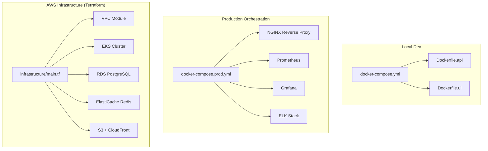
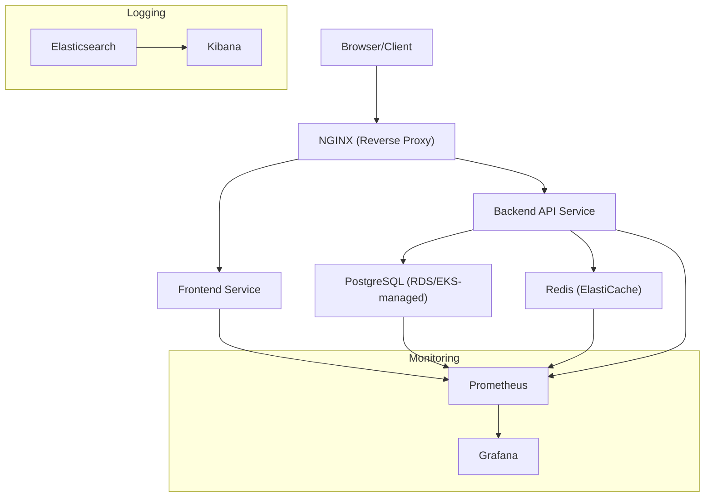
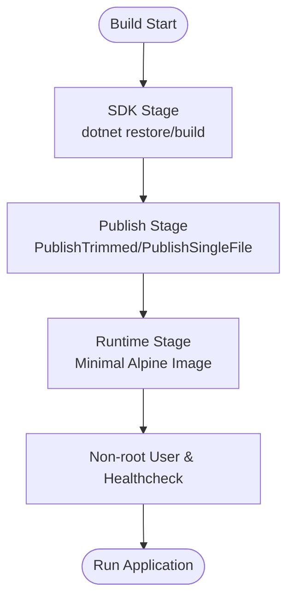
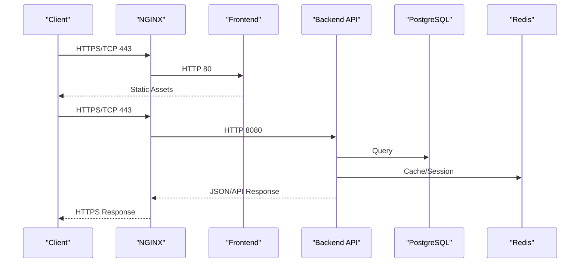
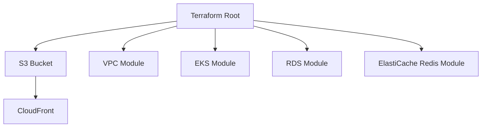
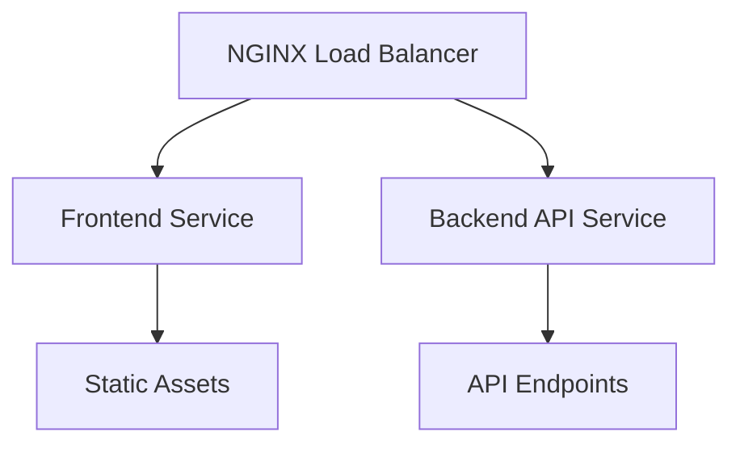
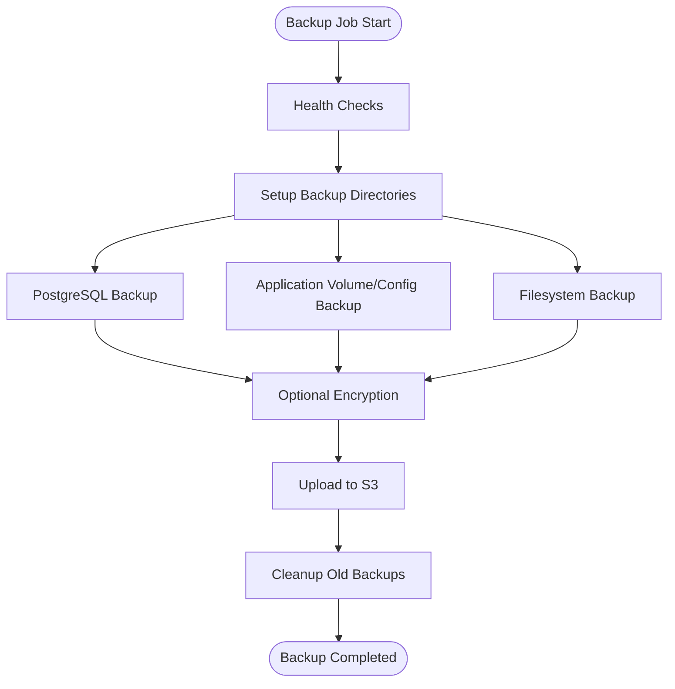
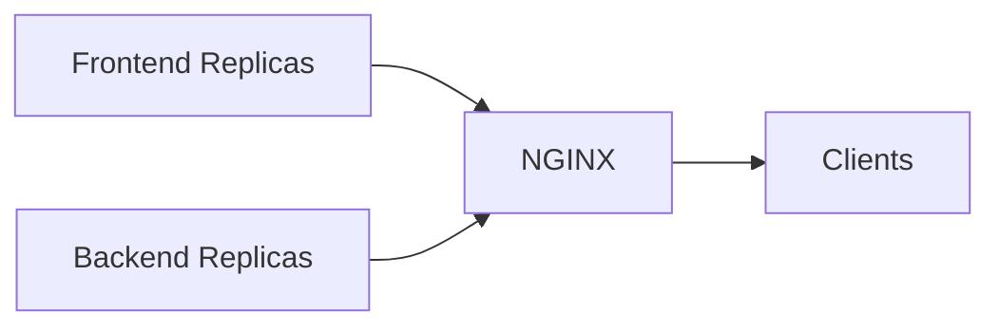
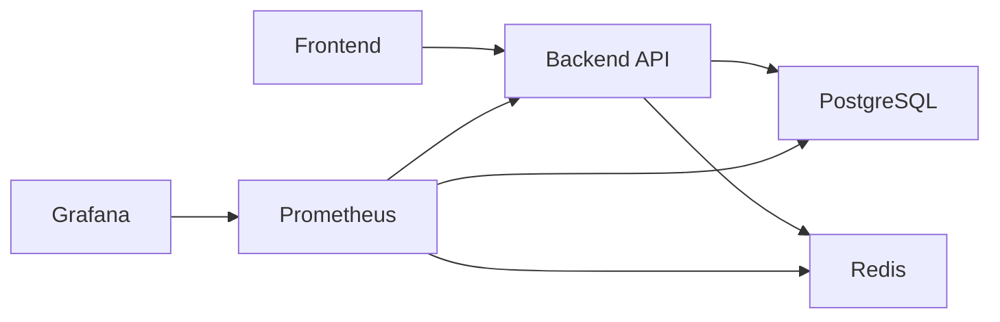

# Deployment and Operations

<cite>
**Referenced Files in This Document**
- [docker-compose.yml](file://docker-compose.yml)
- [docker-compose.prod.yml](file://docker-compose.prod.yml)
- [Dockerfile.api](file://Dockerfile.api)
- [Dockerfile.ui](file://Dockerfile.ui)
- [infrastructure/main.tf](file://infrastructure/main.tf)
- [infrastructure/variables.tf](file://infrastructure/variables.tf)
- [scripts/backup-automation.sh](file://scripts/backup-automation.sh)
- [scripts/backup.conf](file://scripts/backup.conf)
- [monitoring/prometheus/prometheus.yml](file://monitoring/prometheus/prometheus.yml)
- [monitoring/prometheus/alerting-rules.yml](file://monitoring/prometheus/alerting-rules.yml)
- [monitoring/grafana/dashboards/digitaltwin-overview.json](file://monitoring/grafana/dashboards/digitaltwin-overview.json)
- [src/api/DigitalTwinPlatform.API/appsettings.json](file://src/api/DigitalTwinPlatform.API/appsettings.json)
- [src/api/DigitalTwinPlatform.API/appsettings.Development.json](file://src/api/DigitalTwinPlatform.API/appsettings.Development.json)
</cite>

## Table of Contents
1. [Introduction](#introduction)
2. [Project Structure](#project-structure)
3. [Core Components](#core-components)
4. [Architecture Overview](#architecture-overview)
5. [Detailed Component Analysis](#detailed-component-analysis)
6. [Dependency Analysis](#dependency-analysis)
7. [Performance Considerations](#performance-considerations)
8. [Troubleshooting Guide](#troubleshooting-guide)
9. [Conclusion](#conclusion)
10. [Appendices](#appendices)

## Introduction
This document provides a comprehensive guide to deploying and operating the Digital Twin Platform across containerized and cloud-native environments. It covers Docker configuration and multi-stage builds, container orchestration strategies, Terraform infrastructure provisioning on AWS, load balancing and reverse proxying, backup automation and disaster recovery, scaling strategies, operational monitoring, CI/CD and release management, security hardening, performance optimization, and maintenance procedures for production environments.

## Project Structure
The platform consists of:
- A .NET backend API with Docker multi-stage builds
- A Vue-based frontend served via Nginx
- Supporting services: PostgreSQL, Redis, NGINX, Prometheus, Grafana, and optional ELK stack
- Terraform modules for AWS infrastructure (EKS, RDS, ElastiCache Redis, S3, CloudFront)
- Backup automation scripts and monitoring dashboards



**Diagram sources**
- [docker-compose.yml](file://docker-compose.yml#L1-L81)
- [docker-compose.prod.yml](file://docker-compose.prod.yml#L1-L274)
- [Dockerfile.api](file://Dockerfile.api#L1-L74)
- [Dockerfile.ui](file://Dockerfile.ui#L1-L13)
- [infrastructure/main.tf](file://infrastructure/main.tf#L1-L493)

**Section sources**
- [docker-compose.yml](file://docker-compose.yml#L1-L81)
- [docker-compose.prod.yml](file://docker-compose.prod.yml#L1-L274)
- [Dockerfile.api](file://Dockerfile.api#L1-L74)
- [Dockerfile.ui](file://Dockerfile.ui#L1-L13)
- [infrastructure/main.tf](file://infrastructure/main.tf#L1-L493)

## Core Components
- Container images and multi-stage builds:
  - .NET API image built with SDK, trimmed, single-file publish, and minimal runtime image
  - Frontend image built with Node and served by Nginx
- Compose-based orchestration:
  - Development compose defines services for API, UI, PostgreSQL, and SHAP service
  - Production compose adds NGINX, monitoring, logging, and resource limits
- Infrastructure provisioning:
  - Terraform modules for VPC, EKS, RDS, ElastiCache Redis, S3, and CloudFront
- Observability:
  - Prometheus scraping backend, database, Redis, and host metrics
  - Grafana dashboard for platform overview
- Backup automation:
  - Bash script orchestrating database, application, and filesystem backups with cloud upload and retention

**Section sources**
- [Dockerfile.api](file://Dockerfile.api#L1-L74)
- [Dockerfile.ui](file://Dockerfile.ui#L1-L13)
- [docker-compose.yml](file://docker-compose.yml#L1-L81)
- [docker-compose.prod.yml](file://docker-compose.prod.yml#L1-L274)
- [infrastructure/main.tf](file://infrastructure/main.tf#L1-L493)
- [monitoring/prometheus/prometheus.yml](file://monitoring/prometheus/prometheus.yml#L1-L148)
- [monitoring/grafana/dashboards/digitaltwin-overview.json](file://monitoring/grafana/dashboards/digitaltwin-overview.json#L1-L279)
- [scripts/backup-automation.sh](file://scripts/backup-automation.sh#L1-L251)

## Architecture Overview
The production architecture uses Docker Swarm/Kubernetes-style deployments orchestrated by docker-compose with NGINX as a reverse proxy terminating TLS and load balancing traffic to frontend and backend services. Monitoring and logging stacks provide observability, while Terraform provisions AWS infrastructure for compute, storage, and CDN.



**Diagram sources**
- [docker-compose.prod.yml](file://docker-compose.prod.yml#L153-L184)
- [infrastructure/main.tf](file://infrastructure/main.tf#L144-L190)
- [infrastructure/main.tf](file://infrastructure/main.tf#L250-L274)
- [monitoring/prometheus/prometheus.yml](file://monitoring/prometheus/prometheus.yml#L18-L116)

## Detailed Component Analysis

### Containerization and Multi-Stage Builds
- .NET API multi-stage build:
  - Build stage restores and compiles with Release, PublishTrimmed, PublishSingleFile, and PublishReadyToRun
  - Final stage copies artifacts, sets non-root user, exposes port, sets health checks, and runs under ASP.NET Core
- Frontend build:
  - Node Alpine stage installs dependencies and builds
  - Nginx Alpine stage serves static assets



**Diagram sources**
- [Dockerfile.api](file://Dockerfile.api#L12-L51)
- [Dockerfile.api](file://Dockerfile.api#L53-L74)

**Section sources**
- [Dockerfile.api](file://Dockerfile.api#L1-L74)
- [Dockerfile.ui](file://Dockerfile.ui#L1-L13)

### Container Orchestration Strategies
- Development:
  - docker-compose.yml defines services with healthchecks, depends_on conditions, and shared network
- Production:
  - docker-compose.prod.yml:
    - Images tagged with ${TAG}, environment variables injected via .env
    - Health checks, resource limits, restart policies, and replica counts
    - NGINX reverse proxy with TLS certs mounted
    - Monitoring and logging stacks



**Diagram sources**
- [docker-compose.prod.yml](file://docker-compose.prod.yml#L7-L31)
- [docker-compose.prod.yml](file://docker-compose.prod.yml#L47-L94)
- [docker-compose.prod.yml](file://docker-compose.prod.yml#L96-L151)
- [docker-compose.prod.yml](file://docker-compose.prod.yml#L127-L151)

**Section sources**
- [docker-compose.yml](file://docker-compose.yml#L1-L81)
- [docker-compose.prod.yml](file://docker-compose.prod.yml#L1-L274)

### Terraform Infrastructure Provisioning
- AWS provider configured with region and tags
- Backend state stored in S3 with DynamoDB locking
- Modules:
  - VPC with public/private subnets and NAT gateways
  - EKS managed node groups (SPOT and ON_DEMAND)
  - RDS PostgreSQL with automated backups and retention
  - ElastiCache Redis with snapshots and security groups
  - S3 bucket with SSE and CloudFront distribution
- Outputs expose cluster endpoints, database endpoints, and CDN domain



**Diagram sources**
- [infrastructure/main.tf](file://infrastructure/main.tf#L16-L23)
- [infrastructure/main.tf](file://infrastructure/main.tf#L72-L95)
- [infrastructure/main.tf](file://infrastructure/main.tf#L97-L142)
- [infrastructure/main.tf](file://infrastructure/main.tf#L144-L190)
- [infrastructure/main.tf](file://infrastructure/main.tf#L250-L274)
- [infrastructure/main.tf](file://infrastructure/main.tf#L376-L448)

**Section sources**
- [infrastructure/main.tf](file://infrastructure/main.tf#L1-L493)
- [infrastructure/variables.tf](file://infrastructure/variables.tf#L1-L210)

### Load Balancing and Reverse Proxying
- NGINX configured as reverse proxy in production compose:
  - Mounts proxy.conf and TLS certificates
  - Proxies to frontend and backend services
  - Health checks for readiness
- For cloud-native deployments, EKS ALB/NLB can be used; current compose uses internal routing



**Diagram sources**
- [docker-compose.prod.yml](file://docker-compose.prod.yml#L153-L174)

**Section sources**
- [docker-compose.prod.yml](file://docker-compose.prod.yml#L153-L174)

### Backup Automation and Disaster Recovery
- Script-driven backup workflow:
  - Health checks for disk space and database connectivity
  - PostgreSQL logical dump and WAL streaming backup
  - Application backup of Docker volumes and configs
  - Filesystem backup with rsync and exclusions
  - Optional encryption and cloud upload to S3
  - Cleanup of old backups locally and via lifecycle
- Configuration supports environment-specific schedules and retention



**Diagram sources**
- [scripts/backup-automation.sh](file://scripts/backup-automation.sh#L219-L245)

**Section sources**
- [scripts/backup-automation.sh](file://scripts/backup-automation.sh#L1-L251)
- [scripts/backup.conf](file://scripts/backup.conf#L1-L115)

### Scaling Strategies
- Horizontal scaling:
  - docker-compose.prod.yml defines replicas for frontend and backend services
  - Resource limits and reservations for CPU/memory
- Auto-scaling:
  - EKS node groups with SPOT and ON_DEMAND instances
  - RDS and ElastiCache sizing appropriate for workload
- Stateless services:
  - Frontend and API designed to scale horizontally behind NGINX



**Diagram sources**
- [docker-compose.prod.yml](file://docker-compose.prod.yml#L30-L45)
- [docker-compose.prod.yml](file://docker-compose.prod.yml#L79-L94)
- [infrastructure/main.tf](file://infrastructure/main.tf#L109-L137)

**Section sources**
- [docker-compose.prod.yml](file://docker-compose.prod.yml#L30-L45)
- [docker-compose.prod.yml](file://docker-compose.prod.yml#L79-L94)
- [infrastructure/main.tf](file://infrastructure/main.tf#L109-L137)

### Operational Monitoring
- Prometheus:
  - Scrapes backend, frontend, PostgreSQL exporter, Redis exporter, and node exporters
  - Alerting rules for uptime, error rates, latency, and resource thresholds
- Grafana:
  - Dashboard for API uptime, response time, error rate, active users, DB connections, Redis memory, and system resources
- Logs:
  - ELK stack for centralized logging (Elasticsearch and Kibana)

```mermaid
graph TB
subgraph "Scrape Targets"
BE["Backend API"]
FE["Frontend"]
PG["PostgreSQL Exporter"]
RC["Redis Exporter"]
NODE["Node Exporter"]
end
PROM["Prometheus"] --> BE
PROM --> FE
PROM --> PG
PROM --> RC
PROM --> NODE
ALERT["Alertmanager"] <- --> PROM
GRAF["Grafana"] <- --> PROM
```

**Diagram sources**
- [monitoring/prometheus/prometheus.yml](file://monitoring/prometheus/prometheus.yml#L18-L116)
- [monitoring/prometheus/alerting-rules.yml](file://monitoring/prometheus/alerting-rules.yml#L3-L184)
- [monitoring/grafana/dashboards/digitaltwin-overview.json](file://monitoring/grafana/dashboards/digitaltwin-overview.json#L1-L279)

**Section sources**
- [monitoring/prometheus/prometheus.yml](file://monitoring/prometheus/prometheus.yml#L1-L148)
- [monitoring/prometheus/alerting-rules.yml](file://monitoring/prometheus/alerting-rules.yml#L1-L184)
- [monitoring/grafana/dashboards/digitaltwin-overview.json](file://monitoring/grafana/dashboards/digitaltwin-overview.json#L1-L279)

### CI/CD Pipeline, Automated Testing, and Release Management
- Build and publish:
  - Multi-stage Docker builds produce optimized runtime images
- Test coverage:
  - .NET tests exist under src/api/DigitalTwinPlatform.Tests
- Release management:
  - Tag-based image tagging in docker-compose.prod.yml enables controlled rollouts
- Recommendations:
  - Integrate CI/CD (e.g., GitHub Actions) to trigger builds, tests, and image pushes
  - Use rolling updates with health checks and rollback strategies
  - Automate Terraform apply for infrastructure changes

[No sources needed since this section provides general guidance]

### Security Hardening
- Container hardening:
  - Non-root users, minimal base images, health checks, and reduced attack surface
- Secrets management:
  - Environment variables for DB credentials, JWT keys, Redis passwords, and Grafana admin password
  - Store sensitive values externally (e.g., secrets manager) and inject via compose or Kubernetes
- Network security:
  - Security groups restrict inbound access; RDS and Redis exposed only to internal subnets
  - TLS termination at NGINX with mounted certificates
- Access control:
  - Restrict S3 bucket access and use CloudFront for asset delivery

**Section sources**
- [Dockerfile.api](file://Dockerfile.api#L56-L74)
- [docker-compose.prod.yml](file://docker-compose.prod.yml#L57-L64)
- [docker-compose.prod.yml](file://docker-compose.prod.yml#L132-L133)
- [docker-compose.prod.yml](file://docker-compose.prod.yml#L213-L215)
- [infrastructure/main.tf](file://infrastructure/main.tf#L192-L248)
- [infrastructure/main.tf](file://infrastructure/main.tf#L250-L299)

### Performance Optimization
- API:
  - ReadyToRun, Trimmed, SingleFile publishing reduces startup time and footprint
  - Health checks and resource limits prevent overload
- Frontend:
  - Nginx static serving minimizes overhead
- Database and cache:
  - RDS and ElastiCache sizing aligned with workload profiles
- Observability:
  - Metrics and alerting for latency, error rates, and resource utilization

**Section sources**
- [Dockerfile.api](file://Dockerfile.api#L33-L51)
- [docker-compose.prod.yml](file://docker-compose.prod.yml#L88-L94)
- [monitoring/prometheus/alerting-rules.yml](file://monitoring/prometheus/alerting-rules.yml#L25-L32)

### Maintenance Procedures
- Regular backups and retention
- Log rotation and centralization
- Database maintenance windows and automated backups
- Review and update Terraform-managed resources periodically

**Section sources**
- [scripts/backup-automation.sh](file://scripts/backup-automation.sh#L182-L194)
- [infrastructure/main.tf](file://infrastructure/main.tf#L167-L174)

## Dependency Analysis
- Internal dependencies:
  - Backend API depends on PostgreSQL and Redis
  - Frontend communicates with backend API
  - Monitoring scrapes backend, database, cache, and host metrics
- External dependencies:
  - AWS services (EKS, RDS, ElastiCache, S3, CloudFront)
  - Public Docker images for runtime and tooling



**Diagram sources**
- [docker-compose.prod.yml](file://docker-compose.prod.yml#L47-L94)
- [monitoring/prometheus/prometheus.yml](file://monitoring/prometheus/prometheus.yml#L18-L116)

**Section sources**
- [docker-compose.prod.yml](file://docker-compose.prod.yml#L47-L94)
- [monitoring/prometheus/prometheus.yml](file://monitoring/prometheus/prometheus.yml#L18-L116)

## Performance Considerations
- Use resource limits and reservations to prevent noisy-neighbor issues
- Enable compression and caching at NGINX and in the application where applicable
- Monitor latency and error rates; adjust autoscaling thresholds accordingly
- Keep Prometheus retention and query limits balanced to avoid overconsumption

[No sources needed since this section provides general guidance]

## Troubleshooting Guide
- Health checks:
  - docker-compose healthchecks for API, frontend, database, and Redis
  - Prometheus targets and alert rules indicate service health
- Logs:
  - Centralized logs via ELK stack for debugging
- Backup failures:
  - Review backup logs, disk space, and S3 connectivity
- Environment configuration:
  - Compare development vs production appsettings for environment-specific differences

**Section sources**
- [docker-compose.prod.yml](file://docker-compose.prod.yml#L24-L28)
- [docker-compose.prod.yml](file://docker-compose.prod.yml#L73-L78)
- [docker-compose.prod.yml](file://docker-compose.prod.yml#L113-L117)
- [docker-compose.prod.yml](file://docker-compose.prod.yml#L139-L143)
- [monitoring/prometheus/alerting-rules.yml](file://monitoring/prometheus/alerting-rules.yml#L7-L14)
- [scripts/backup-automation.sh](file://scripts/backup-automation.sh#L35-L40)
- [src/api/DigitalTwinPlatform.API/appsettings.json](file://src/api/DigitalTwinPlatform.API/appsettings.json#L1-L93)
- [src/api/DigitalTwinPlatform.API/appsettings.Development.json](file://src/api/DigitalTwinPlatform.API/appsettings.Development.json#L1-L71)

## Conclusion
The Digital Twin Platform leverages modern containerization, robust orchestration, and comprehensive observability to deliver a scalable and secure production-grade solution. Terraform automates infrastructure provisioning on AWS, while Docker multi-stage builds optimize runtime performance. Backup automation, alerting, and monitoring ensure reliability and operability. By following the operational procedures and best practices outlined here, teams can maintain a resilient platform with predictable deployments and strong security controls.

## Appendices
- Environment configuration examples:
  - Development settings override defaults for local development
  - Production compose injects environment variables for secrets and endpoints
- Monitoring dashboards:
  - Grafana dashboard provides key platform metrics and recent alerts

**Section sources**
- [src/api/DigitalTwinPlatform.API/appsettings.Development.json](file://src/api/DigitalTwinPlatform.API/appsettings.Development.json#L1-L71)
- [src/api/DigitalTwinPlatform.API/appsettings.json](file://src/api/DigitalTwinPlatform.API/appsettings.json#L1-L93)
- [monitoring/grafana/dashboards/digitaltwin-overview.json](file://monitoring/grafana/dashboards/digitaltwin-overview.json#L1-L279)