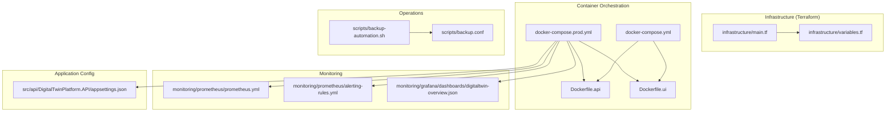
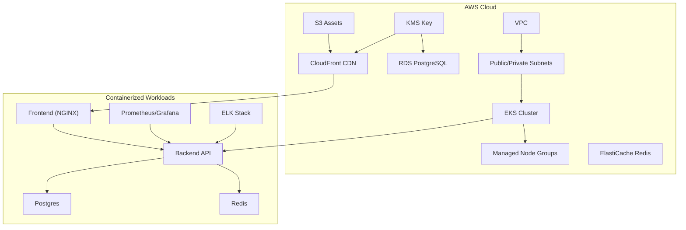
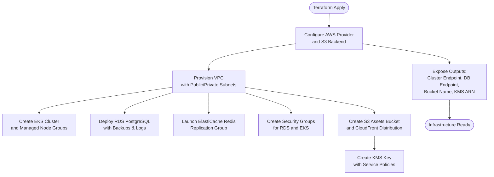
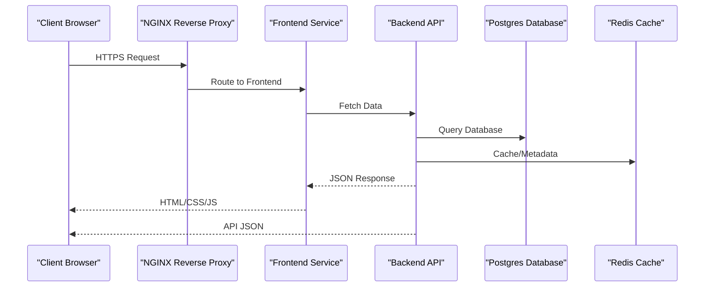
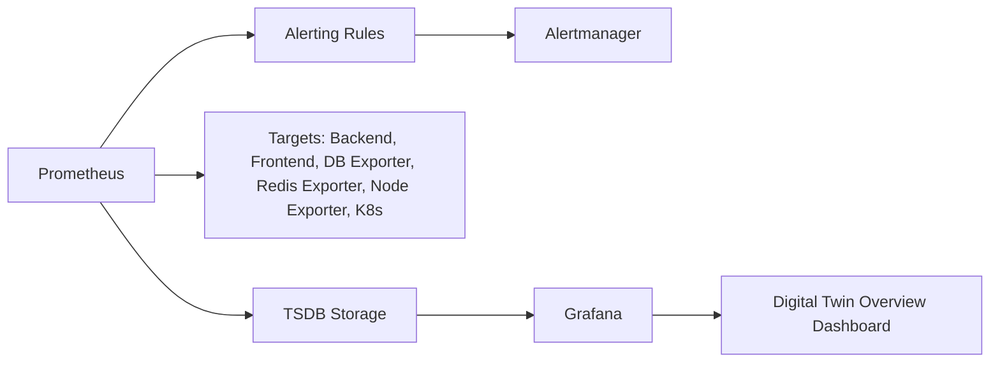
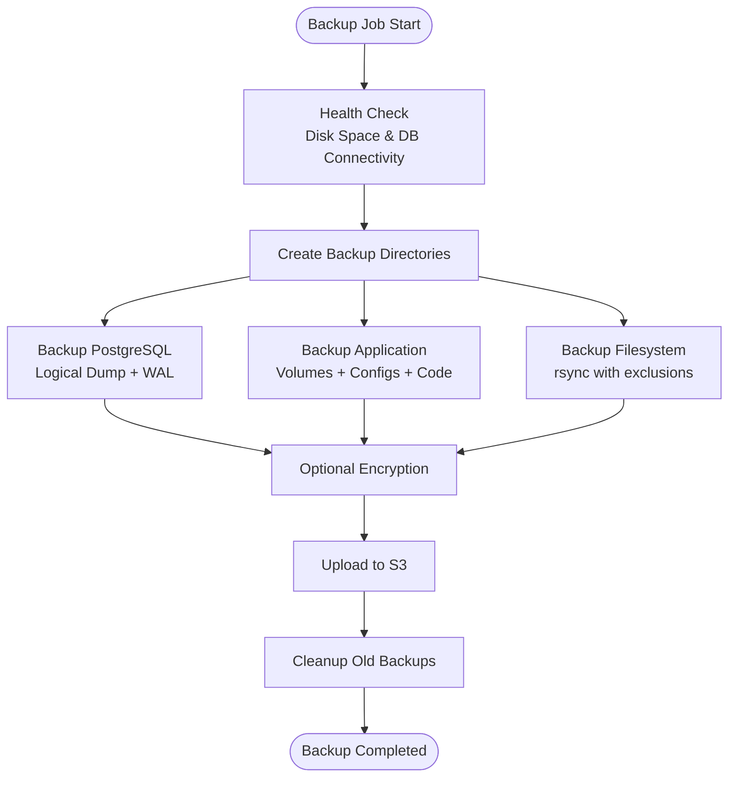
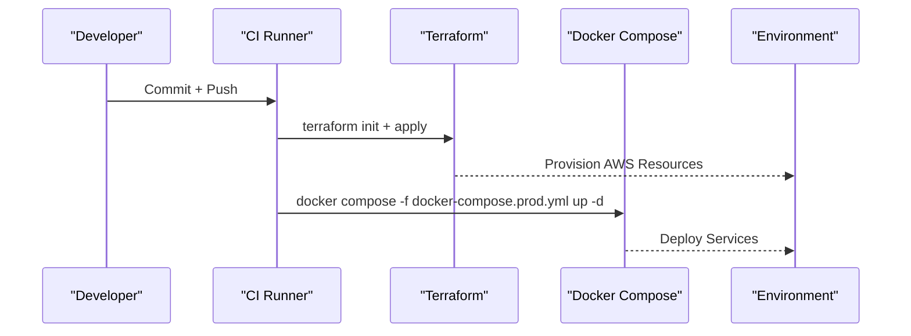
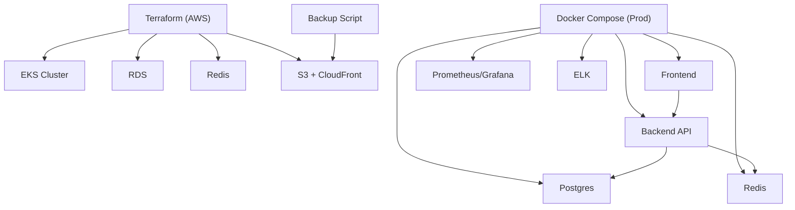

# Infrastructure Provisioning and Cloud Deployment

<cite>
**Referenced Files in This Document**
- [infrastructure/main.tf](file://infrastructure/main.tf)
- [infrastructure/variables.tf](file://infrastructure/variables.tf)
- [docker-compose.yml](file://docker-compose.yml)
- [docker-compose.prod.yml](file://docker-compose.prod.yml)
- [scripts/backup-automation.sh](file://scripts/backup-automation.sh)
- [scripts/backup.conf](file://scripts/backup.conf)
- [monitoring/prometheus/prometheus.yml](file://monitoring/prometheus/prometheus.yml)
- [monitoring/prometheus/alerting-rules.yml](file://monitoring/prometheus/alerting-rules.yml)
- [monitoring/grafana/dashboards/digitaltwin-overview.json](file://monitoring/grafana/dashboards/digitaltwin-overview.json)
- [Dockerfile.api](file://Dockerfile.api)
- [Dockerfile.ui](file://Dockerfile.ui)
- [src/api/DigitalTwinPlatform.API/appsettings.json](file://src/api/DigitalTwinPlatform.API/appsettings.json)
</cite>

## Table of Contents
1. [Introduction](#introduction)
2. [Project Structure](#project-structure)
3. [Core Components](#core-components)
4. [Architecture Overview](#architecture-overview)
5. [Detailed Component Analysis](#detailed-component-analysis)
6. [Dependency Analysis](#dependency-analysis)
7. [Performance Considerations](#performance-considerations)
8. [Troubleshooting Guide](#troubleshooting-guide)
9. [Conclusion](#conclusion)
10. [Appendices](#appendices)

## Introduction
This document explains the infrastructure provisioning and cloud deployment strategy for the Digital Twin Platform. It covers Terraform-based infrastructure management for AWS, including VPC, EKS, RDS, ElastiCache, S3, CloudFront, and KMS. It also documents the production Docker Compose setup for container orchestration, CI/CD integration patterns, environment management, scaling strategies, security configurations, SSL/TLS handling, monitoring, backup automation, and disaster recovery procedures.

## Project Structure
The repository organizes infrastructure provisioning under a dedicated folder, container orchestration via Docker Compose, monitoring stacks, and operational scripts for backup automation. The structure supports both development and production environments.

**Diagram sources**
- [infrastructure/main.tf](file://infrastructure/main.tf#L1-L493)
- [infrastructure/variables.tf](file://infrastructure/variables.tf#L1-L210)
- [docker-compose.yml](file://docker-compose.yml#L1-L81)
- [docker-compose.prod.yml](file://docker-compose.prod.yml#L1-L274)
- [Dockerfile.api](file://Dockerfile.api#L1-L74)
- [Dockerfile.ui](file://Dockerfile.ui#L1-L13)
- [monitoring/prometheus/prometheus.yml](file://monitoring/prometheus/prometheus.yml#L1-L148)
- [monitoring/prometheus/alerting-rules.yml](file://monitoring/prometheus/alerting-rules.yml#L1-L184)
- [monitoring/grafana/dashboards/digitaltwin-overview.json](file://monitoring/grafana/dashboards/digitaltwin-overview.json#L1-L279)
- [scripts/backup-automation.sh](file://scripts/backup-automation.sh#L1-L251)
- [scripts/backup.conf](file://scripts/backup.conf#L1-L115)
- [src/api/DigitalTwinPlatform.API/appsettings.json](file://src/api/DigitalTwinPlatform.API/appsettings.json#L1-L93)

**Section sources**
- [infrastructure/main.tf](file://infrastructure/main.tf#L1-L493)
- [infrastructure/variables.tf](file://infrastructure/variables.tf#L1-L210)
- [docker-compose.yml](file://docker-compose.yml#L1-L81)
- [docker-compose.prod.yml](file://docker-compose.prod.yml#L1-L274)
- [Dockerfile.api](file://Dockerfile.api#L1-L74)
- [Dockerfile.ui](file://Dockerfile.ui#L1-L13)
- [monitoring/prometheus/prometheus.yml](file://monitoring/prometheus/prometheus.yml#L1-L148)
- [monitoring/prometheus/alerting-rules.yml](file://monitoring/prometheus/alerting-rules.yml#L1-L184)
- [monitoring/grafana/dashboards/digitaltwin-overview.json](file://monitoring/grafana/dashboards/digitaltwin-overview.json#L1-L279)
- [scripts/backup-automation.sh](file://scripts/backup-automation.sh#L1-L251)
- [scripts/backup.conf](file://scripts/backup.conf#L1-L115)
- [src/api/DigitalTwinPlatform.API/appsettings.json](file://src/api/DigitalTwinPlatform.API/appsettings.json#L1-L93)

## Core Components
- Terraform-managed AWS resources:
  - VPC with public/private subnets and NAT gateways
  - EKS managed node groups (Spot and On-Demand)
  - RDS PostgreSQL instance with automated backups and encryption
  - ElastiCache Redis replication group
  - S3 bucket with versioning and SSE
  - CloudFront distribution with origin access identity
  - KMS key for encryption and service delegation
- Container orchestration:
  - Development compose with Postgres, pgAdmin, API, UI, and SHAP service
  - Production compose with frontend, backend, Postgres, Redis, NGINX reverse proxy, Prometheus, Grafana, and ELK stack
- Monitoring:
  - Prometheus scraping backend, frontend, PostgreSQL exporter, Redis exporter, Node exporter, and Kubernetes metrics
  - Alerting rules for API, database, Redis, frontend, and host resources
  - Grafana dashboard for platform overview
- Operations:
  - Backup automation script with health checks, encryption, cloud upload, and retention
  - Backup configuration file with environment overrides and schedules

**Section sources**
- [infrastructure/main.tf](file://infrastructure/main.tf#L72-L142)
- [infrastructure/main.tf](file://infrastructure/main.tf#L144-L190)
- [infrastructure/main.tf](file://infrastructure/main.tf#L250-L299)
- [infrastructure/main.tf](file://infrastructure/main.tf#L376-L448)
- [infrastructure/main.tf](file://infrastructure/main.tf#L301-L372)
- [docker-compose.yml](file://docker-compose.yml#L1-L81)
- [docker-compose.prod.yml](file://docker-compose.prod.yml#L1-L274)
- [monitoring/prometheus/prometheus.yml](file://monitoring/prometheus/prometheus.yml#L18-L116)
- [monitoring/prometheus/alerting-rules.yml](file://monitoring/prometheus/alerting-rules.yml#L3-L184)
- [monitoring/grafana/dashboards/digitaltwin-overview.json](file://monitoring/grafana/dashboards/digitaltwin-overview.json#L1-L279)
- [scripts/backup-automation.sh](file://scripts/backup-automation.sh#L63-L91)
- [scripts/backup.conf](file://scripts/backup.conf#L1-L115)

## Architecture Overview
The platform provisions a secure, scalable cloud environment with managed services and containerized workloads. The Terraform configuration defines the network, cluster, and data plane resources. The production Docker Compose orchestrates microservices behind NGINX, with Prometheus and Grafana for observability and ELK for centralized logging.

**Diagram sources**
- [infrastructure/main.tf](file://infrastructure/main.tf#L72-L142)
- [infrastructure/main.tf](file://infrastructure/main.tf#L144-L190)
- [infrastructure/main.tf](file://infrastructure/main.tf#L250-L299)
- [infrastructure/main.tf](file://infrastructure/main.tf#L376-L448)
- [infrastructure/main.tf](file://infrastructure/main.tf#L301-L372)
- [docker-compose.prod.yml](file://docker-compose.prod.yml#L6-L274)

## Detailed Component Analysis

### Terraform AWS Infrastructure
- Provider and backend configuration:
  - AWS provider with default tags
  - S3 backend with DynamoDB locking for state safety
- VPC:
  - Public/private subnet pairs with NAT gateways
  - DNS enablement and subnet tagging for load balancers
- EKS:
  - Managed control plane and node groups with mixed capacity types
  - Labels for workload segregation
- RDS:
  - PostgreSQL instance with automated backups, log exports, and retention
  - Deletion protection and parameter groups
- Security groups:
  - RDS SG allows inbound PostgreSQL traffic from VPC CIDR
  - EKS SG allows HTTP/HTTPS ingress from anywhere
- ElastiCache:
  - Redis replication group with snapshot retention and maintenance windows
- KMS:
  - Policy enabling EKS, RDS, and CloudFront to use the key
- S3 and CloudFront:
  - Versioned, encrypted bucket with CloudFront origin access identity

**Diagram sources**
- [infrastructure/main.tf](file://infrastructure/main.tf#L3-L23)
- [infrastructure/main.tf](file://infrastructure/main.tf#L72-L142)
- [infrastructure/main.tf](file://infrastructure/main.tf#L144-L190)
- [infrastructure/main.tf](file://infrastructure/main.tf#L250-L299)
- [infrastructure/main.tf](file://infrastructure/main.tf#L376-L448)
- [infrastructure/main.tf](file://infrastructure/main.tf#L301-L372)

**Section sources**
- [infrastructure/main.tf](file://infrastructure/main.tf#L3-L23)
- [infrastructure/main.tf](file://infrastructure/main.tf#L72-L142)
- [infrastructure/main.tf](file://infrastructure/main.tf#L144-L190)
- [infrastructure/main.tf](file://infrastructure/main.tf#L250-L299)
- [infrastructure/main.tf](file://infrastructure/main.tf#L376-L448)
- [infrastructure/main.tf](file://infrastructure/main.tf#L301-L372)

### Production Docker Compose Setup
- Services:
  - Frontend: built from UI Dockerfile, exposed on 80/443, depends on API
  - Backend: .NET API with health checks and environment variables
  - Postgres: Alpine image with data volume and init scripts
  - Redis: Alpine image with persistence and password
  - NGINX: reverse proxy with TLS certs mounted
  - Monitoring: Prometheus and Grafana with persistent volumes
  - Logging: Elasticsearch and Kibana single-node stack
- Networking:
  - Bridge network with explicit subnet for isolation
- Scaling:
  - Replica counts and resource limits defined per service

**Diagram sources**
- [docker-compose.prod.yml](file://docker-compose.prod.yml#L6-L274)

**Section sources**
- [docker-compose.prod.yml](file://docker-compose.prod.yml#L1-L274)
- [Dockerfile.api](file://Dockerfile.api#L1-L74)
- [Dockerfile.ui](file://Dockerfile.ui#L1-L13)

### Monitoring Stack
- Prometheus:
  - Scrapes backend, frontend, PostgreSQL exporter, Redis exporter, Node exporter, and Kubernetes metrics
  - Alerting rules for API health, error rates, latency, database and Redis saturation, host resources, and business metrics
- Grafana:
  - Dashboard aggregates uptime, response time, error rate, active users, and recent alerts

**Diagram sources**
- [monitoring/prometheus/prometheus.yml](file://monitoring/prometheus/prometheus.yml#L18-L116)
- [monitoring/prometheus/alerting-rules.yml](file://monitoring/prometheus/alerting-rules.yml#L3-L184)
- [monitoring/grafana/dashboards/digitaltwin-overview.json](file://monitoring/grafana/dashboards/digitaltwin-overview.json#L1-L279)

**Section sources**
- [monitoring/prometheus/prometheus.yml](file://monitoring/prometheus/prometheus.yml#L1-L148)
- [monitoring/prometheus/alerting-rules.yml](file://monitoring/prometheus/alerting-rules.yml#L1-L184)
- [monitoring/grafana/dashboards/digitaltwin-overview.json](file://monitoring/grafana/dashboards/digitaltwin-overview.json#L1-L279)

### Backup Automation and Disaster Recovery
- Script capabilities:
  - Health checks for disk space and database connectivity
  - PostgreSQL logical dumps and WAL streaming
  - Application and filesystem backups via Docker volumes and rsync
  - Optional encryption and cloud upload to S3
  - Cleanup of old local/cloud artifacts
- Configuration:
  - Centralized settings for retention, AWS credentials, encryption, schedules, and environment overrides

**Diagram sources**
- [scripts/backup-automation.sh](file://scripts/backup-automation.sh#L63-L91)
- [scripts/backup-automation.sh](file://scripts/backup-automation.sh#L169-L180)
- [scripts/backup-automation.sh](file://scripts/backup-automation.sh#L182-L194)

**Section sources**
- [scripts/backup-automation.sh](file://scripts/backup-automation.sh#L1-L251)
- [scripts/backup.conf](file://scripts/backup.conf#L1-L115)

### CI/CD Pipeline Integration and Environment Management
- Environment separation:
  - Terraform variables define environment, region, VPC CIDRs, and service parameters
  - Compose files differentiate dev and prod configurations
- Secrets and configuration:
  - Environment variables in compose files for database credentials, JWT keys, and Redis passwords
  - Application settings include connection strings and feature flags
- Deployment flow:
  - Terraform applies infrastructure, then Docker Compose deploys services
  - CI/CD can trigger terraform apply and docker compose up/down via automation

**Diagram sources**
- [infrastructure/variables.tf](file://infrastructure/variables.tf#L1-L210)
- [docker-compose.prod.yml](file://docker-compose.prod.yml#L1-L274)

**Section sources**
- [infrastructure/variables.tf](file://infrastructure/variables.tf#L1-L210)
- [docker-compose.prod.yml](file://docker-compose.prod.yml#L1-L274)
- [src/api/DigitalTwinPlatform.API/appsettings.json](file://src/api/DigitalTwinPlatform.API/appsettings.json#L1-L93)

### Practical Examples

#### Infrastructure Scaling
- EKS node groups:
  - General-purpose Spot instances for cost savings
  - Compute-focused On-Demand instances for predictable workloads
- Docker Compose:
  - Replica counts and resource limits per service for horizontal scaling

**Section sources**
- [infrastructure/main.tf](file://infrastructure/main.tf#L109-L137)
- [docker-compose.prod.yml](file://docker-compose.prod.yml#L80-L94)

#### Security Group Configurations
- RDS security group:
  - Inbound TCP 5432 from VPC CIDR
- EKS security group:
  - Inbound TCP 80/443 from anywhere for public access

**Section sources**
- [infrastructure/main.tf](file://infrastructure/main.tf#L192-L248)

#### SSL Certificate Management
- CloudFront:
  - Viewer certificate configured for HTTPS redirection
- NGINX:
  - TLS certificates mounted as volumes for HTTPS termination

**Section sources**
- [infrastructure/main.tf](file://infrastructure/main.tf#L416-L447)
- [docker-compose.prod.yml](file://docker-compose.prod.yml#L162-L164)

## Dependency Analysis
The infrastructure and runtime components exhibit clear separation of concerns:
- Terraform manages foundational infrastructure and shared services
- Docker Compose orchestrates application services and observability
- Scripts handle operational tasks like backup and recovery
- Application settings provide environment-specific configuration

**Diagram sources**
- [infrastructure/main.tf](file://infrastructure/main.tf#L72-L142)
- [infrastructure/main.tf](file://infrastructure/main.tf#L144-L190)
- [infrastructure/main.tf](file://infrastructure/main.tf#L250-L299)
- [infrastructure/main.tf](file://infrastructure/main.tf#L376-L448)
- [docker-compose.prod.yml](file://docker-compose.prod.yml#L1-L274)
- [scripts/backup-automation.sh](file://scripts/backup-automation.sh#L169-L180)

**Section sources**
- [infrastructure/main.tf](file://infrastructure/main.tf#L72-L142)
- [infrastructure/main.tf](file://infrastructure/main.tf#L144-L190)
- [infrastructure/main.tf](file://infrastructure/main.tf#L250-L299)
- [infrastructure/main.tf](file://infrastructure/main.tf#L376-L448)
- [docker-compose.prod.yml](file://docker-compose.prod.yml#L1-L274)
- [scripts/backup-automation.sh](file://scripts/backup-automation.sh#L169-L180)

## Performance Considerations
- Container resource limits and reservations ensure predictable performance and prevent noisy-neighbor issues.
- EKS node groups balance cost (Spot) and performance (On-Demand) for diverse workloads.
- Database and cache sizing selected for typical loads; scale vertically or horizontally as needed.
- Monitoring and alerting rules help detect regressions early.

[No sources needed since this section provides general guidance]

## Troubleshooting Guide
- Backup failures:
  - Verify database connectivity and disk space before running backups
  - Check encryption key and AWS credentials in configuration
- Service downtime:
  - Inspect health checks and replica counts in compose files
  - Review Prometheus alerts and Grafana dashboards
- Terraform state issues:
  - Confirm S3 backend and DynamoDB lock table exist and are accessible

**Section sources**
- [scripts/backup-automation.sh](file://scripts/backup-automation.sh#L196-L217)
- [scripts/backup.conf](file://scripts/backup.conf#L1-L115)
- [docker-compose.prod.yml](file://docker-compose.prod.yml#L73-L78)
- [monitoring/prometheus/alerting-rules.yml](file://monitoring/prometheus/alerting-rules.yml#L3-L184)

## Conclusion
The Digital Twin Platform leverages Terraform for robust AWS infrastructure provisioning and Docker Compose for production-grade container orchestration. The monitoring stack provides comprehensive visibility, while the backup automation ensures reliable recovery. With environment-specific variables and clear separation of concerns, the platform supports scalable, secure, and maintainable cloud deployments.

[No sources needed since this section summarizes without analyzing specific files]

## Appendices

### Appendix A: Environment Variables Reference
- Terraform:
  - Environment, region, VPC CIDRs, node group configurations, database and Redis settings
- Docker Compose (Production):
  - Database credentials, Redis password, JWT secret, logging levels, and service ports
- Application Settings:
  - Connection strings, SignalR configuration, ML model paths, JWT settings, and performance thresholds

**Section sources**
- [infrastructure/variables.tf](file://infrastructure/variables.tf#L1-L210)
- [docker-compose.prod.yml](file://docker-compose.prod.yml#L57-L62)
- [src/api/DigitalTwinPlatform.API/appsettings.json](file://src/api/DigitalTwinPlatform.API/appsettings.json#L1-L93)