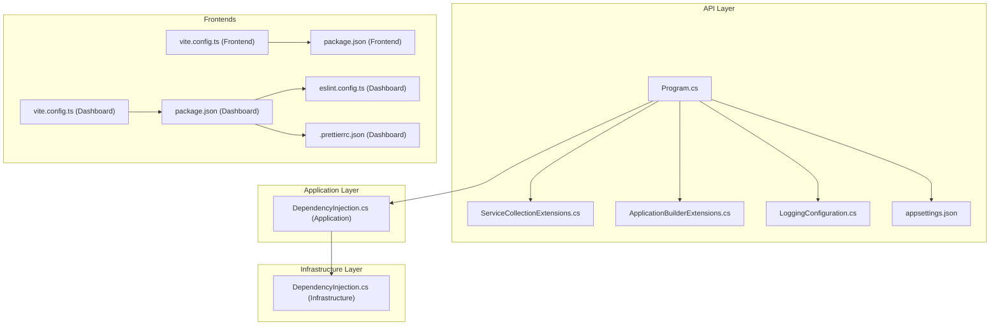
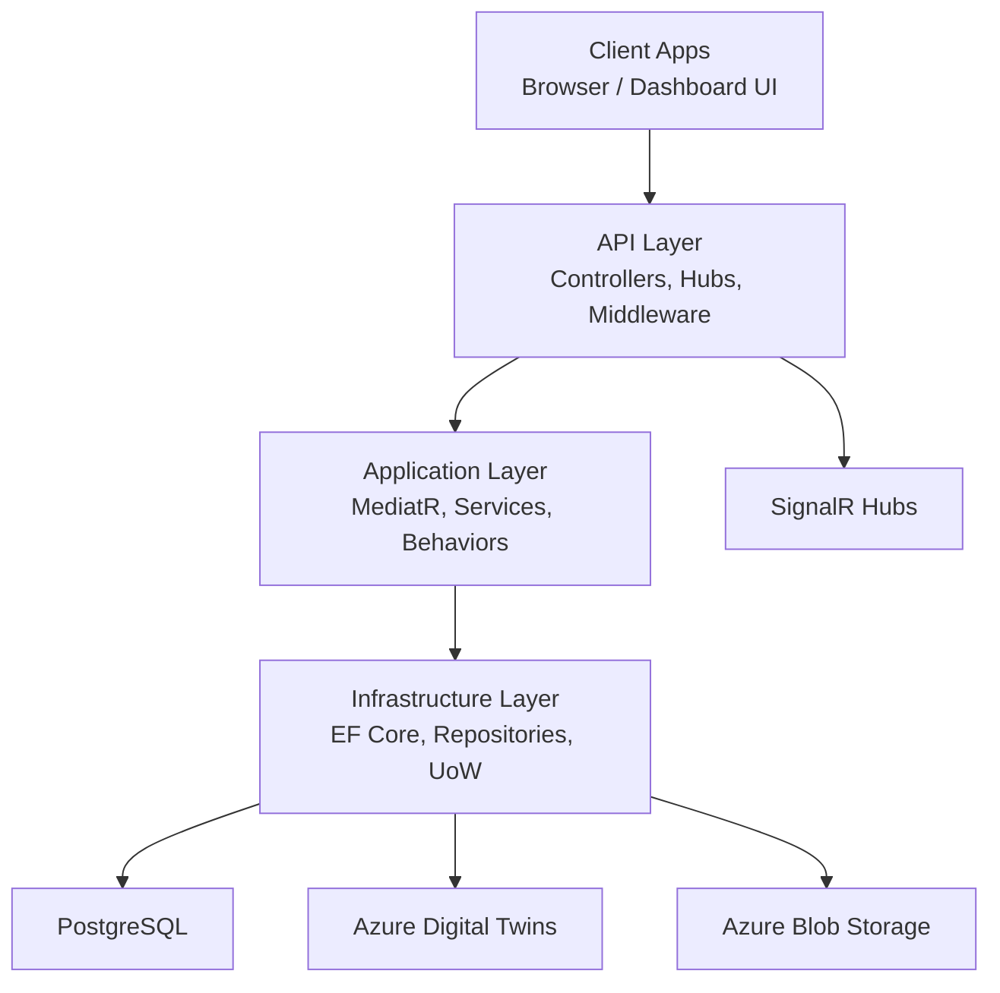
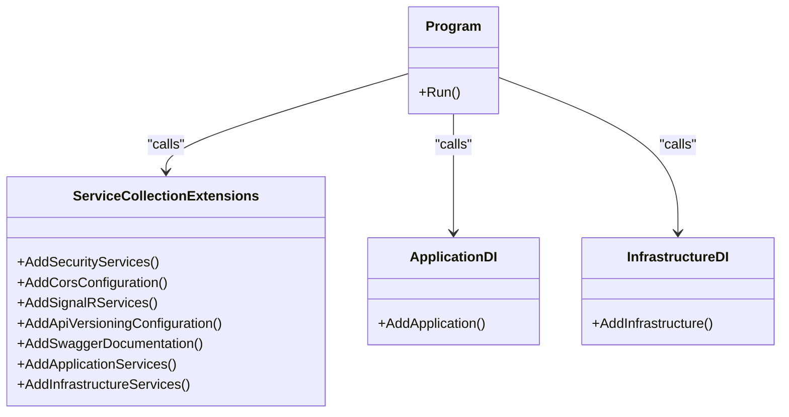
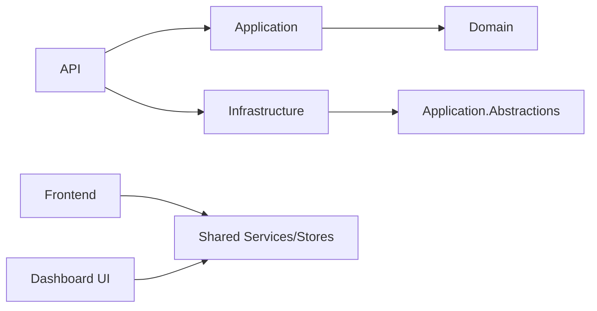
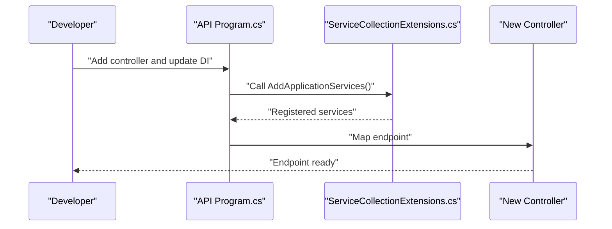

# Development Guidelines

<cite>
**Referenced Files in This Document**
- [Program.cs](file://src/api/DigitalTwinPlatform.API/Program.cs)
- [ServiceCollectionExtensions.cs](file://src/api/DigitalTwinPlatform.API/Extensions/ServiceCollectionExtensions.cs)
- [ApplicationBuilderExtensions.cs](file://src/api/DigitalTwinPlatform.API/Extensions/ApplicationBuilderExtensions.cs)
- [LoggingConfiguration.cs](file://src/api/DigitalTwinPlatform.API/Infrastructure/LoggingConfiguration.cs)
- [appsettings.json](file://src/api/DigitalTwinPlatform.API/appsettings.json)
- [DependencyInjection.cs (Application)](file://src/api/DigitalTwinPlatform.Application/DependencyInjection.cs)
- [DependencyInjection.cs (Infrastructure)](file://src/api/DigitalTwinPlatform.Infrastructure/DependencyInjection.cs)
- [vite.config.ts (Frontend)](file://src/frontend/vite.config.ts)
- [vite.config.ts (Dashboard)](file://src/ui/digital-twin-dashboard/vite.config.ts)
- [package.json (Frontend)](file://src/frontend/package.json)
- [package.json (Dashboard)](file://src/ui/digital-twin-dashboard/package.json)
- [eslint.config.ts (Dashboard)](file://src/ui/digital-twin-dashboard/eslint.config.ts)
- [.prettierrc.json (Dashboard)](file://src/ui/digital-twin-dashboard/.prettierrc.json)
- [README.md (Dashboard)](file://src/ui/digital-twin-dashboard/README.md)
- [README.md (Frontend)](file://src/frontend/README.md)
- [README.md (Proposal)](file://src/proposal.md)
- [ARCHITECTURE.md](file://docs/ARCHITECTURE.md)
- [MATH_MODELS.md](file://docs/MATH_MODELS.md)
- [ML_INTEGRATION.md](file://docs/ML_INTEGRATION.md)
- [USABILITY_COMPLIANCE.md](file://docs/USABILITY_COMPLIANCE.md)
- [API-Configuration.md (Dashboard Docs)](file://src/ui/digital-twin-dashboard/docs/API-Configuration.md)
- [Token-Security.md](file://src/api/DigitalTwinPlatform.API/Documentation/Token-Security.md)
- [CSRF-Protection.md](file://src/api/DigitalTwinPlatform.API/Documentation/CSRF-Protection.md)
- [Drift-Detection.md](file://src/api/DigitalTwinPlatform.API/Documentation/Drift-Detection.md)
</cite>

## Table of Contents
1. [Introduction](#introduction)
2. [Project Structure](#project-structure)
3. [Core Components](#core-components)
4. [Architecture Overview](#architecture-overview)
5. [Detailed Component Analysis](#detailed-component-analysis)
6. [Dependency Analysis](#dependency-analysis)
7. [Performance Considerations](#performance-considerations)
8. [Troubleshooting Guide](#troubleshooting-guide)
9. [Contribution and Review Guidelines](#contribution-and-review-guidelines)
10. [Development Workflows and Branching](#development-workflows-and-branching)
11. [Code Quality and Automation](#code-quality-and-automation)
12. [Debugging and Profiling](#debugging-and-profiling)
13. [Practical Implementation Examples](#practical-implementation-examples)
14. [Conclusion](#conclusion)

## Introduction
This document defines the development guidelines for the Digital Twin Platform project. It consolidates coding standards, architectural patterns, dependency injection practices, development workflows, code quality tooling, and operational guidance. The platform consists of a C#/.NET backend (API, Application, Domain, Infrastructure layers), a Vue 3 frontend, and a second UI package with comprehensive testing and tooling.

## Project Structure
The repository follows a layered solution layout with clear separation of concerns:
- API: ASP.NET Core web API with controllers, hubs, middleware, and extension methods
- Application: Application services, MediatR pipelines, validators, and cross-cutting behaviors
- Domain: Entities, enums, constants, and shared domain models
- Infrastructure: Persistence, migrations, repositories, unit of work, and tenant isolation
- Frontend: Vue 3 SPA with services, stores, and composable utilities
- Dashboard: Alternative UI package with extensive tooling, tests, and build configuration
- Docs: Architectural, mathematical, ML integration, and usability compliance references
- Specs: Feature specification and planning artifacts

**Diagram sources**
- [Program.cs](file://src/api/DigitalTwinPlatform.API/Program.cs#L1-L87)
- [ServiceCollectionExtensions.cs](file://src/api/DigitalTwinPlatform.API/Extensions/ServiceCollectionExtensions.cs#L1-L418)
- [ApplicationBuilderExtensions.cs](file://src/api/DigitalTwinPlatform.API/Extensions/ApplicationBuilderExtensions.cs#L1-L89)
- [LoggingConfiguration.cs](file://src/api/DigitalTwinPlatform.API/Infrastructure/LoggingConfiguration.cs#L1-L58)
- [appsettings.json](file://src/api/DigitalTwinPlatform.API/appsettings.json#L1-L93)
- [DependencyInjection.cs (Application)](file://src/api/DigitalTwinPlatform.Application/DependencyInjection.cs#L1-L58)
- [DependencyInjection.cs (Infrastructure)](file://src/api/DigitalTwinPlatform.Infrastructure/DependencyInjection.cs#L1-L47)
- [vite.config.ts (Frontend)](file://src/frontend/vite.config.ts#L1-L48)
- [vite.config.ts (Dashboard)](file://src/ui/digital-twin-dashboard/vite.config.ts#L1-L62)
- [package.json (Frontend)](file://src/frontend/package.json#L1-L44)
- [package.json (Dashboard)](file://src/ui/digital-twin-dashboard/package.json#L1-L87)
- [eslint.config.ts (Dashboard)](file://src/ui/digital-twin-dashboard/eslint.config.ts#L1-L46)
- [.prettierrc.json (Dashboard)](file://src/ui/digital-twin-dashboard/.prettierrc.json#L1-L7)

**Section sources**
- [Program.cs](file://src/api/DigitalTwinPlatform.API/Program.cs#L1-L87)
- [DependencyInjection.cs (Application)](file://src/api/DigitalTwinPlatform.Application/DependencyInjection.cs#L1-L58)
- [DependencyInjection.cs (Infrastructure)](file://src/api/DigitalTwinPlatform.Infrastructure/DependencyInjection.cs#L1-L47)
- [vite.config.ts (Frontend)](file://src/frontend/vite.config.ts#L1-L48)
- [vite.config.ts (Dashboard)](file://src/ui/digital-twin-dashboard/vite.config.ts#L1-L62)
- [package.json (Frontend)](file://src/frontend/package.json#L1-L44)
- [package.json (Dashboard)](file://src/ui/digital-twin-dashboard/package.json#L1-L87)
- [eslint.config.ts (Dashboard)](file://src/ui/digital-twin-dashboard/eslint.config.ts#L1-L46)
- [.prettierrc.json (Dashboard)](file://src/ui/digital-twin-dashboard/.prettierrc.json#L1-L7)

## Core Components
- API entrypoint and pipeline: Centralized in Program.cs, wiring controllers, JSON options, validation, observability, security, CORS, SignalR, API versioning, Swagger, and endpoint mapping.
- Dependency injection: Extensively configured via extension methods for security, CORS, SignalR, API versioning, Swagger, application services, infrastructure services, and Azure integrations.
- Application DI: MediatR registration with cross-cutting behaviors (validation, logging, exception handling, performance, retry, authorization, audit, caching), plus ML, workflows, simulations, and mathematics services.
- Infrastructure DI: Entity Framework setup, tenant schema interceptor, UoW, and generic/concrete repositories.
- Frontend tooling: Vite aliases, proxying to API, chunk splitting, test coverage, and ESLint/Prettier configuration.

**Section sources**
- [Program.cs](file://src/api/DigitalTwinPlatform.API/Program.cs#L1-L87)
- [ServiceCollectionExtensions.cs](file://src/api/DigitalTwinPlatform.API/Extensions/ServiceCollectionExtensions.cs#L1-L418)
- [DependencyInjection.cs (Application)](file://src/api/DigitalTwinPlatform.Application/DependencyInjection.cs#L1-L58)
- [DependencyInjection.cs (Infrastructure)](file://src/api/DigitalTwinPlatform.Infrastructure/DependencyInjection.cs#L1-L47)
- [vite.config.ts (Frontend)](file://src/frontend/vite.config.ts#L1-L48)
- [vite.config.ts (Dashboard)](file://src/ui/digital-twin-dashboard/vite.config.ts#L1-L62)

## Architecture Overview
The system adheres to Clean Architecture principles with bounded contexts:
- API layer orchestrates requests, applies middleware, and exposes endpoints and SignalR hubs
- Application layer encapsulates application use cases, orchestration, and cross-cutting behaviors
- Domain layer holds entities and domain logic
- Infrastructure layer manages persistence, external integrations, and tenant isolation

**Diagram sources**
- [Program.cs](file://src/api/DigitalTwinPlatform.API/Program.cs#L1-L87)
- [DependencyInjection.cs (Application)](file://src/api/DigitalTwinPlatform.Application/DependencyInjection.cs#L1-L58)
- [DependencyInjection.cs (Infrastructure)](file://src/api/DigitalTwinPlatform.Infrastructure/DependencyInjection.cs#L1-L47)

**Section sources**
- [Program.cs](file://src/api/DigitalTwinPlatform.API/Program.cs#L1-L87)
- [DependencyInjection.cs (Application)](file://src/api/DigitalTwinPlatform.Application/DependencyInjection.cs#L1-L58)
- [DependencyInjection.cs (Infrastructure)](file://src/api/DigitalTwinPlatform.Infrastructure/DependencyInjection.cs#L1-L47)
- [ARCHITECTURE.md](file://docs/ARCHITECTURE.md)

## Detailed Component Analysis

### C# Coding Conventions and Patterns
- Naming and namespaces: Consistent use of PascalCase for types and members; layered namespace conventions align with folder structure.
- JSON serialization: CamelCase property naming and null-ignoring options configured globally for controllers.
- Validation: FluentValidation auto-validation and client adapters enabled; validators discovered by assembly.
- Observability: Structured logging, metrics, and health checks configured centrally.
- Security: JWT Bearer authentication with issuer/audience/signing key validation; antiforgery cookies configured; HTTPS enforced outside development.
- CORS and SignalR: Centralized CORS policy and hub configuration with tunable keep-alive and message sizes.
- API versioning: API versioning configured with defaults and reporting.
- Swagger: OpenAPI documentation with bearer auth definition and optional XML comments inclusion.

**Section sources**
- [Program.cs](file://src/api/DigitalTwinPlatform.API/Program.cs#L14-L50)
- [ServiceCollectionExtensions.cs](file://src/api/DigitalTwinPlatform.API/Extensions/ServiceCollectionExtensions.cs#L43-L146)
- [ApplicationBuilderExtensions.cs](file://src/api/DigitalTwinPlatform.API/Extensions/ApplicationBuilderExtensions.cs#L15-L89)
- [LoggingConfiguration.cs](file://src/api/DigitalTwinPlatform.API/Infrastructure/LoggingConfiguration.cs#L8-L56)
- [Token-Security.md](file://src/api/DigitalTwinPlatform.API/Documentation/Token-Security.md)
- [CSRF-Protection.md](file://src/api/DigitalTwinPlatform.API/Documentation/CSRF-Protection.md)

### Dependency Injection Practices
- Centralized registration: All service registrations are performed via extension methods to maintain separation of concerns and reduce Program.cs clutter.
- Environment-aware services: Conditional registration for external systems and hosted services based on environment.
- Scoped, singleton, and hosted services: Clear lifetime scoping for services, predictors, exporters, and background services.
- MediatR behaviors: Comprehensive pipeline behaviors for validation, logging, exception handling, performance, retry, authorization, audit, and caching.

**Diagram sources**
- [Program.cs](file://src/api/DigitalTwinPlatform.API/Program.cs#L42-L47)
- [ServiceCollectionExtensions.cs](file://src/api/DigitalTwinPlatform.API/Extensions/ServiceCollectionExtensions.cs#L38-L418)
- [DependencyInjection.cs (Application)](file://src/api/DigitalTwinPlatform.Application/DependencyInjection.cs#L15-L56)
- [DependencyInjection.cs (Infrastructure)](file://src/api/DigitalTwinPlatform.Infrastructure/DependencyInjection.cs#L16-L45)

**Section sources**
- [ServiceCollectionExtensions.cs](file://src/api/DigitalTwinPlatform.API/Extensions/ServiceCollectionExtensions.cs#L38-L418)
- [DependencyInjection.cs (Application)](file://src/api/DigitalTwinPlatform.Application/DependencyInjection.cs#L15-L56)
- [DependencyInjection.cs (Infrastructure)](file://src/api/DigitalTwinPlatform.Infrastructure/DependencyInjection.cs#L16-L45)

### TypeScript Guidelines and Frontend Standards
- Toolchain: Vite with Vue plugin; aliases for components, services, stores, types, utils, and views; proxying to API and SignalR hubs.
- Testing: Vitest for unit tests; Cypress and Playwright for E2E; coverage configured with V8 provider and exclusions.
- Formatting and linting: Prettier configuration; ESLint flat config supporting Vue SFC, TypeScript, Vitest, Cypress, and Playwright with prettier integration.
- Build: Chunk splitting for vendor, charts, and utils; sourcemaps enabled; warning threshold increased for bundle size.

**Section sources**
- [vite.config.ts (Frontend)](file://src/frontend/vite.config.ts#L1-L48)
- [vite.config.ts (Dashboard)](file://src/ui/digital-twin-dashboard/vite.config.ts#L1-L62)
- [package.json (Frontend)](file://src/frontend/package.json#L7-L13)
- [package.json (Dashboard)](file://src/ui/digital-twin-dashboard/package.json#L11-L22)
- [eslint.config.ts (Dashboard)](file://src/ui/digital-twin-dashboard/eslint.config.ts#L16-L45)
- [.prettierrc.json (Dashboard)](file://src/ui/digital-twin-dashboard/.prettierrc.json#L1-L7)

### Naming Conventions
- C#:
  - Types: PascalCase
  - Methods: PascalCase
  - Properties: PascalCase
  - Fields: camelCase (internal/private)
  - Constants: PascalCase
  - Namespaces: Layered (e.g., DigitalTwinPlatform.API)
- TypeScript/Vue:
  - Components: PascalCase filenames (e.g., MyComponent.vue)
  - Services/composables: camelCase
  - Stores: kebab-case or camelCase per store naming in codebase
  - Utilities: camelCase
  - Aliases: Vite aliases configured for clean imports

**Section sources**
- [Program.cs](file://src/api/DigitalTwinPlatform.API/Program.cs#L1-L87)
- [vite.config.ts (Frontend)](file://src/frontend/vite.config.ts#L7-L16)
- [vite.config.ts (Dashboard)](file://src/ui/digital-twin-dashboard/vite.config.ts#L25-L28)

## Dependency Analysis
The API depends on Application and Infrastructure layers. Application depends on Domain. Infrastructure depends on Application abstractions and persistence frameworks. Frontends depend on shared services and stores.

**Diagram sources**
- [Program.cs](file://src/api/DigitalTwinPlatform.API/Program.cs#L6-L7)
- [DependencyInjection.cs (Application)](file://src/api/DigitalTwinPlatform.Application/DependencyInjection.cs#L1-L10)
- [DependencyInjection.cs (Infrastructure)](file://src/api/DigitalTwinPlatform.Infrastructure/DependencyInjection.cs#L1-L10)

**Section sources**
- [Program.cs](file://src/api/DigitalTwinPlatform.API/Program.cs#L6-L7)
- [DependencyInjection.cs (Application)](file://src/api/DigitalTwinPlatform.Application/DependencyInjection.cs#L1-L10)
- [DependencyInjection.cs (Infrastructure)](file://src/api/DigitalTwinPlatform.Infrastructure/DependencyInjection.cs#L1-L10)

## Performance Considerations
- JSON serialization: CamelCase and null-ignoring reduce payload size.
- SignalR: Configurable keep-alive, handshake timeout, and max message size; detailed errors disabled by default.
- Metrics and logging: Structured logging and metrics middleware included; thresholds configured in appsettings.
- Build optimization: Vite chunk splitting and sourcemaps for diagnostics; bundle size warnings tuned.

**Section sources**
- [Program.cs](file://src/api/DigitalTwinPlatform.API/Program.cs#L15-L20)
- [ServiceCollectionExtensions.cs](file://src/api/DigitalTwinPlatform.API/Extensions/ServiceCollectionExtensions.cs#L105-L131)
- [LoggingConfiguration.cs](file://src/api/DigitalTwinPlatform.API/Infrastructure/LoggingConfiguration.cs#L27-L56)
- [appsettings.json](file://src/api/DigitalTwinPlatform.API/appsettings.json#L74-L78)
- [vite.config.ts (Dashboard)](file://src/ui/digital-twin-dashboard/vite.config.ts#L38-L43)

## Troubleshooting Guide
- JWT configuration validation: Missing or short keys trigger explicit exceptions during authentication setup.
- CORS and origins: Origins loaded from configuration; defaults applied if not present.
- Antiforgery and CSRF: Header and cookie names configured; ensure frontend sends matching headers.
- Logging: Request lifecycle logged with method, path, status, and duration; errors captured with stack traces.
- Drift detection: Defaults and thresholds configurable; alerts can be toggled and rate-limited.

**Section sources**
- [ServiceCollectionExtensions.cs](file://src/api/DigitalTwinPlatform.API/Extensions/ServiceCollectionExtensions.cs#L355-L396)
- [ServiceCollectionExtensions.cs](file://src/api/DigitalTwinPlatform.API/Extensions/ServiceCollectionExtensions.cs#L77-L100)
- [LoggingConfiguration.cs](file://src/api/DigitalTwinPlatform.API/Infrastructure/LoggingConfiguration.cs#L30-L53)
- [Drift-Detection.md](file://src/api/DigitalTwinPlatform.API/Documentation/Drift-Detection.md)
- [CSRF-Protection.md](file://src/api/DigitalTwinPlatform.API/Documentation/CSRF-Protection.md)

## Contribution and Review Guidelines
- Pull Requests: Target develop or release branches as defined by the project’s branching strategy. Include a clear description, linked issue, and summary of changes.
- Code Reviews: Require at least one reviewer familiar with the affected layers. Focus on adherence to coding standards, DI practices, and architectural boundaries.
- Commit Messages: Use imperative mood; concise subject, detailed body when necessary.
- Security: Ensure JWT keys meet minimum length, avoid secrets in code, and rotate regularly.
- Documentation: Update relevant docs (architecture, ML integration, usability) when introducing major features.

[No sources needed since this section provides general guidance]

## Development Workflows and Branching
- Branching Strategy: Use feature branches off develop; merge via pull request after review.
- Release Branches: Support hotfixes and releases from dedicated branches.
- CI Requirements: Linting, formatting, unit tests, and E2E tests must pass; builds validated for both API and UI packages.

[No sources needed since this section provides general guidance]

## Code Quality and Automation
- C#:
  - Validation: FluentValidation auto-validation and client adapters enabled.
  - Logging: Structured logging configured; request lifecycle logging middleware.
  - Metrics: Metrics configuration included.
  - Swagger: OpenAPI documentation with bearer auth.
- Frontend:
  - Linting: ESLint flat config covering Vue SFC, TypeScript, Vitest, Cypress, and Playwright.
  - Formatting: Prettier configuration with semicolons disabled, single quotes, and print width 100.
  - Tests: Vitest unit tests; Cypress and Playwright E2E; coverage configured.
  - Scripts: npm-style scripts for dev, build, preview, lint, and format.

**Section sources**
- [Program.cs](file://src/api/DigitalTwinPlatform.API/Program.cs#L22-L26)
- [LoggingConfiguration.cs](file://src/api/DigitalTwinPlatform.API/Infrastructure/LoggingConfiguration.cs#L8-L25)
- [ServiceCollectionExtensions.cs](file://src/api/DigitalTwinPlatform.API/Extensions/ServiceCollectionExtensions.cs#L153-L227)
- [eslint.config.ts (Dashboard)](file://src/ui/digital-twin-dashboard/eslint.config.ts#L16-L45)
- [.prettierrc.json (Dashboard)](file://src/ui/digital-twin-dashboard/.prettierrc.json#L1-L7)
- [package.json (Frontend)](file://src/frontend/package.json#L7-L13)
- [package.json (Dashboard)](file://src/ui/digital-twin-dashboard/package.json#L11-L22)

## Debugging and Profiling
- Backend:
  - Developer exception page enabled in development.
  - Structured logging captures request start, completion, and failures with timing.
  - SignalR detailed errors disabled by default; enable selectively for diagnostics.
- Frontend:
  - Vite dev server with proxy to API and SignalR hubs.
  - Sourcemaps enabled for debugging.
  - Test runners (Vitest, Cypress, Playwright) provide targeted debugging and coverage insights.

**Section sources**
- [ApplicationBuilderExtensions.cs](file://src/api/DigitalTwinPlatform.API/Extensions/ApplicationBuilderExtensions.cs#L52-L60)
- [LoggingConfiguration.cs](file://src/api/DigitalTwinPlatform.API/Infrastructure/LoggingConfiguration.cs#L30-L53)
- [ServiceCollectionExtensions.cs](file://src/api/DigitalTwinPlatform.API/Extensions/ServiceCollectionExtensions.cs#L114-L121)
- [vite.config.ts (Frontend)](file://src/frontend/vite.config.ts#L18-L33)
- [vite.config.ts (Dashboard)](file://src/ui/digital-twin-dashboard/vite.config.ts#L30-L37)

## Practical Implementation Examples

### Adding a New API Endpoint
- Create a controller under the API Controllers folder with PascalCase naming.
- Register any new service in ApplicationServices extension method with appropriate lifetime.
- Add Swagger documentation via the Swagger extension method.
- Apply authorization attributes and validation as needed.
- Map the endpoint in the application pipeline.

**Diagram sources**
- [Program.cs](file://src/api/DigitalTwinPlatform.API/Program.cs#L42-L47)
- [ServiceCollectionExtensions.cs](file://src/api/DigitalTwinPlatform.API/Extensions/ServiceCollectionExtensions.cs#L232-L321)

**Section sources**
- [ServiceCollectionExtensions.cs](file://src/api/DigitalTwinPlatform.API/Extensions/ServiceCollectionExtensions.cs#L232-L321)
- [Program.cs](file://src/api/DigitalTwinPlatform.API/Program.cs#L74-L78)

### Extending Application Services
- Define abstraction in Application.Abstractions and implementation in Application layer.
- Register in Application DI with MediatR behaviors applied automatically.
- Add validators and ensure DTOs are mapped consistently.

**Section sources**
- [DependencyInjection.cs (Application)](file://src/api/DigitalTwinPlatform.Application/DependencyInjection.cs#L20-L36)

### Updating Frontend Services and Stores
- Add or modify service in the services directory with camelCase naming.
- Update stores if state changes are required.
- Keep aliases aligned in Vite config for consistent imports.
- Run lint and format scripts before committing.

**Section sources**
- [vite.config.ts (Frontend)](file://src/frontend/vite.config.ts#L7-L16)
- [package.json (Frontend)](file://src/frontend/package.json#L11-L12)

## Conclusion
These guidelines consolidate the project’s coding standards, architectural patterns, and development practices. By following DI conventions, layered architecture, and tooling configurations, contributors can implement features reliably while maintaining code quality and performance.