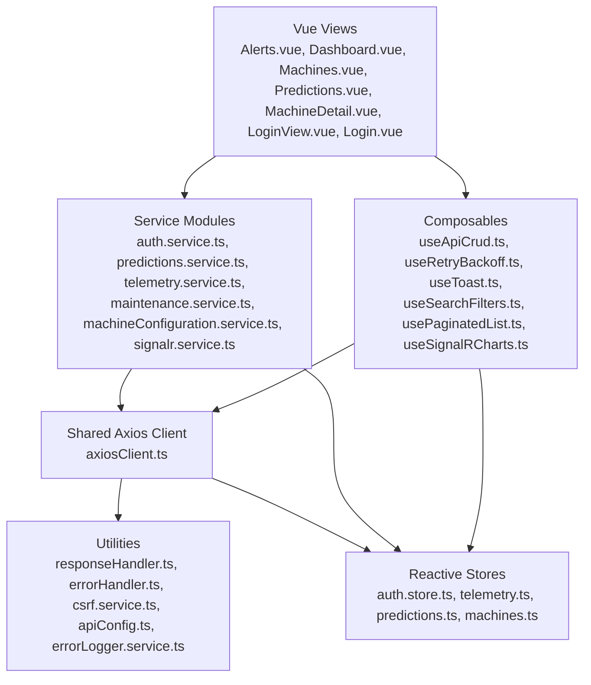
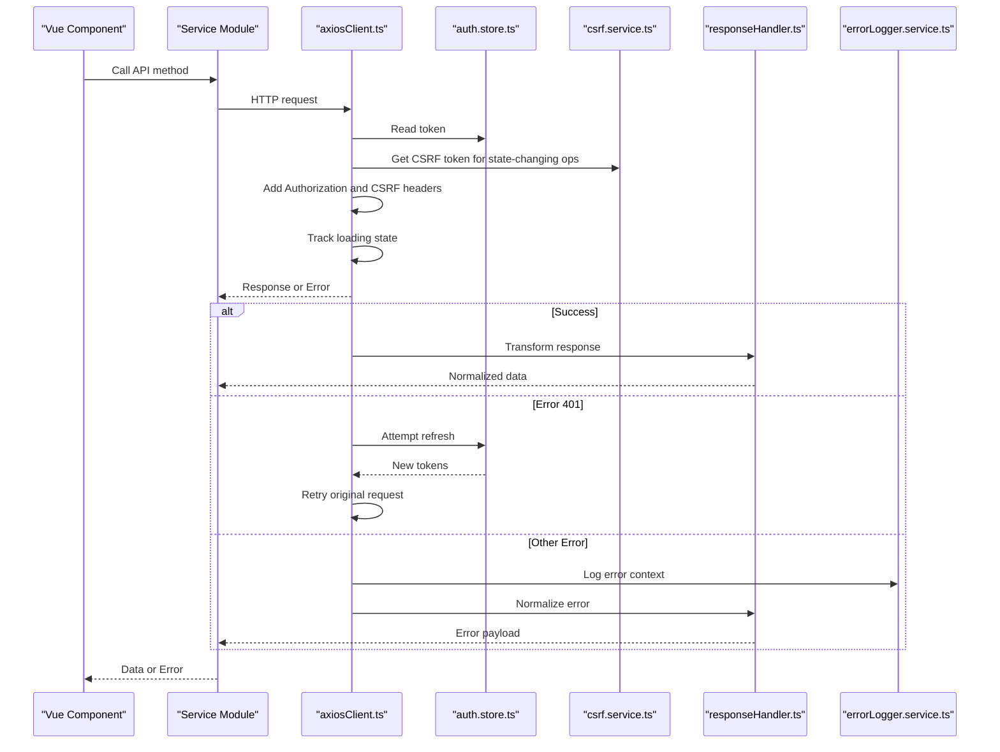
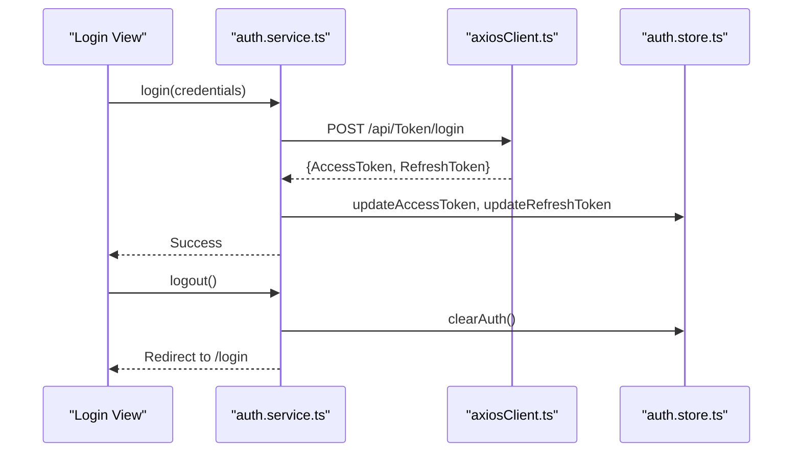
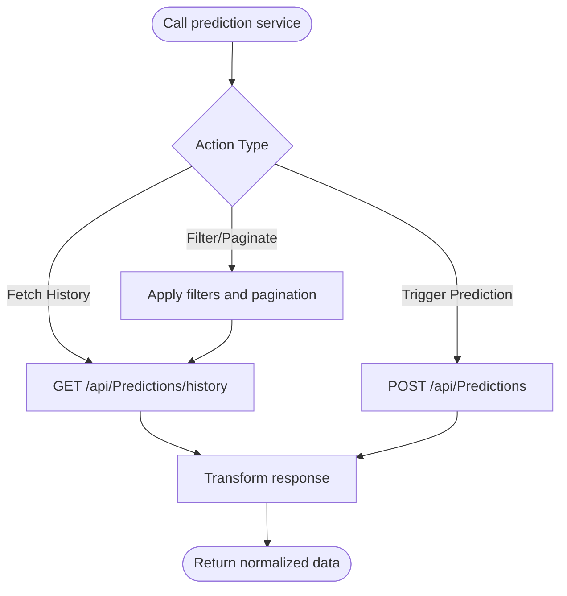
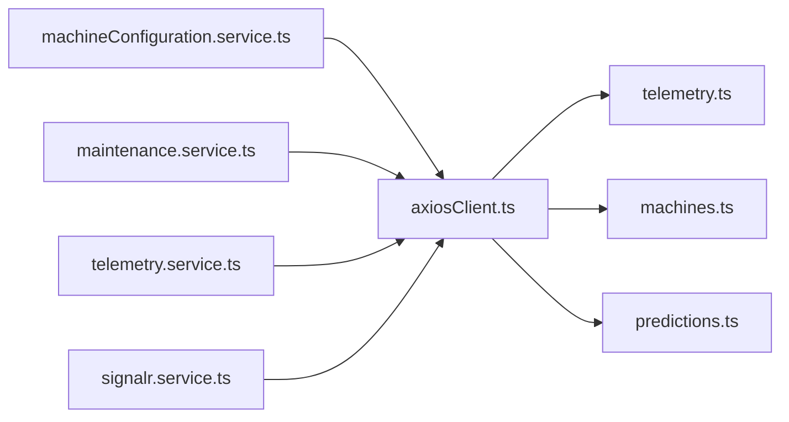
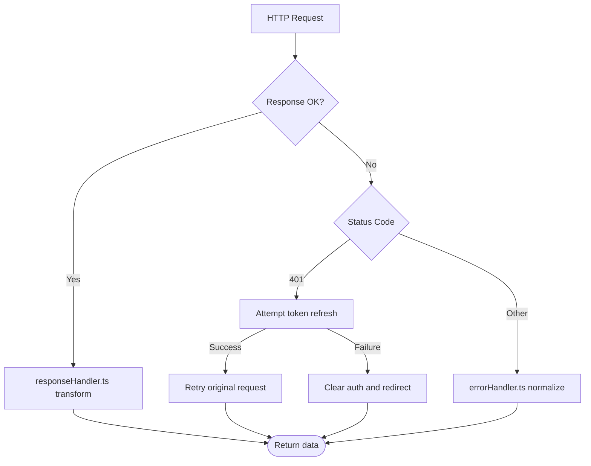
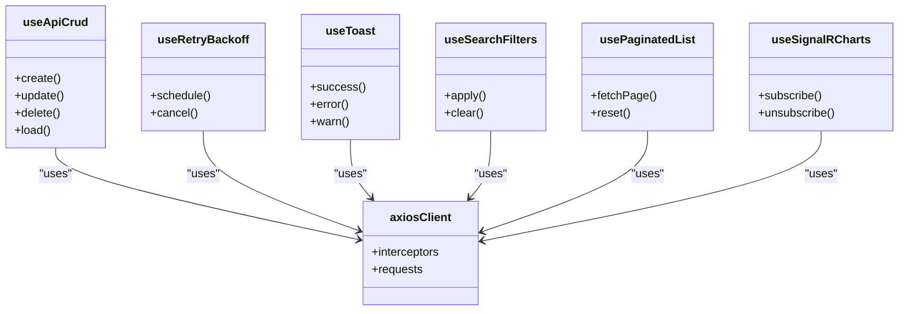
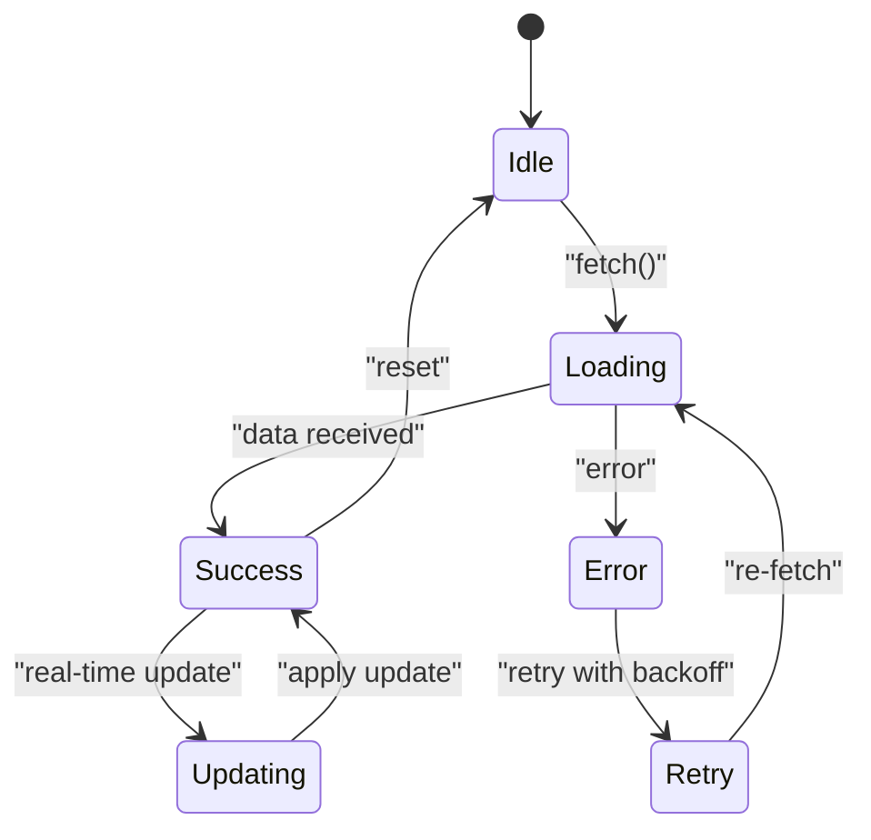
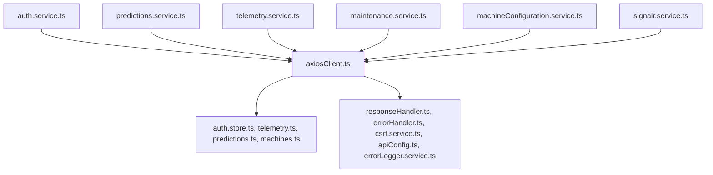

# API Integration and Service Layer

<cite>
**Referenced Files in This Document**
- [axiosClient.ts](file://src/ui/digital-twin-dashboard/src/api/axiosClient.ts)
- [api.ts](file://src/frontend/src/services/api.ts)
- [responseHandler.ts](file://src/ui/digital-twin-dashboard/src/utils/responseHandler.ts)
- [errorHandler.ts](file://src/ui/digital-twin-dashboard/src/utils/errorHandler.ts)
- [csrf.service.ts](file://src/ui/digital-twin-dashboard/src/services/csrf.service.ts)
- [auth.store.ts](file://src/ui/digital-twin-dashboard/src/stores/auth.store.ts)
- [errorLogger.service.ts](file://src/ui/digital-twin-dashboard/src/services/errorLogger.service.ts)
- [apiConfig.ts](file://src/ui/digital-twin-dashboard/src/utils/apiConfig.ts)
- [signalr.service.ts](file://src/ui/digital-twin-dashboard/src/services/signalr.service.ts)
- [telemetry.service.ts](file://src/ui/digital-twin-dashboard/src/services/telemetry.service.ts)
- [predictions.service.ts](file://src/ui/digital-twin-dashboard/src/services/predictions.service.ts)
- [maintenance.service.ts](file://src/ui/digital-twin-dashboard/src/services/maintenance.service.ts)
- [machineConfiguration.service.ts](file://src/ui/digital-twin-dashboard/src/services/machineConfiguration.service.ts)
- [auth.service.ts](file://src/ui/digital-twin-dashboard/src/services/auth.service.ts)
- [useApiCrud.ts](file://src/ui/digital-twin-dashboard/src/composables/useApiCrud.ts)
- [useRetryBackoff.ts](file://src/ui/digital-twin-dashboard/src/composables/useRetryBackoff.ts)
- [useToast.ts](file://src/ui/digital-twin-dashboard/src/composables/useToast.ts)
- [useSearchFilters.ts](file://src/ui/digital-twin-dashboard/src/composables/useSearchFilters.ts)
- [usePaginatedList.ts](file://src/ui/digital-twin-dashboard/src/composables/usePaginatedList.ts)
- [useSignalRCharts.ts](file://src/ui/digital-twin-dashboard/src/composables/useSignalRCharts.ts)
- [telemetry.ts](file://src/ui/digital-twin-dashboard/src/stores/telemetry.ts)
- [predictions.ts](file://src/ui/digital-twin-dashboard/src/stores/predictions.ts)
- [machines.ts](file://src/ui/digital-twin-dashboard/src/stores/machines.ts)
- [auth.ts](file://src/ui/digital-twin-dashboard/src/stores/auth.ts)
- [Alerts.vue](file://src/ui/digital-twin-dashboard/src/views/Alerts.vue)
- [Dashboard.vue](file://src/ui/digital-twin-dashboard/src/views/Dashboard.vue)
- [MachineDetail.vue](file://src/ui/digital-twin-dashboard/src/views/MachineDetail.vue)
- [Machines.vue](file://src/ui/digital-twin-dashboard/src/views/Machines.vue)
- [Predictions.vue](file://src/ui/digital-twin-dashboard/src/views/Predictions.vue)
- [Login.vue](file://src/frontend/src/views/Login.vue)
- [LoginView.vue](file://src/ui/digital-twin-dashboard/src/views/LoginView.vue)
</cite>

## Table of Contents
1. [Introduction](#introduction)
2. [Project Structure](#project-structure)
3. [Core Components](#core-components)
4. [Architecture Overview](#architecture-overview)
5. [Detailed Component Analysis](#detailed-component-analysis)
6. [Dependency Analysis](#dependency-analysis)
7. [Performance Considerations](#performance-considerations)
8. [Troubleshooting Guide](#troubleshooting-guide)
9. [Conclusion](#conclusion)

## Introduction
This document explains the API integration and service layer of the digital twin platform, focusing on the shared Axios client configuration, service layer architecture, and HTTP request/response handling patterns. It documents authentication service implementation, prediction services, machine management services, and centralized error handling. It also covers service composition via composables, state synchronization with backend APIs, token management, retry strategies, and integration with Vue components and reactive stores.

## Project Structure
The frontend is split into two primary applications:
- Legacy frontend under src/frontend with a minimal Axios wrapper and local storage-based token management
- Modern dashboard under src/ui/digital-twin-dashboard with a robust shared Axios client, CSRF protection, centralized logging, and reactive stores

Key areas:
- API client and interceptors: shared Axios instance with request/response interceptors
- Authentication: token management, refresh flow, and logout handling
- Services: typed service modules for predictions, telemetry, maintenance, machine configuration, and more
- Utilities: response handling, error logging, CSRF token management, and API configuration
- Stores: reactive state for auth, telemetry, predictions, and machines
- Composables: reusable logic for CRUD, pagination, retries, and SignalR charts

```mermaid
graph TB
subgraph "Frontend Applications"
FE["Legacy Frontend<br/>src/frontend"]
UI["Modern Dashboard<br/>src/ui/digital-twin-dashboard"]
end
subgraph "Shared API Layer"
AX["axiosClient.ts<br/>Shared Axios Instance"]
RH["responseHandler.ts<br/>Response Transformer"]
EH["errorHandler.ts<br/>Error Normalizer"]
CF["apiConfig.ts<br/>Base URL & Config"]
CSRF["csrf.service.ts<br/>CSRF Token Manager"]
EL["errorLogger.service.ts<br/>Error Logger"]
end
subgraph "Services"
AUTH["auth.service.ts"]
PRED["predictions.service.ts"]
TEL["telemetry.service.ts"]
MAINT["maintenance.service.ts"]
MACHCFG["machineConfiguration.service.ts"]
SIG["signalr.service.ts"]
end
subgraph "Stores"
ASTORE["auth.store.ts"]
TSTORE["telemetry.ts"]
PSTORE["predictions.ts"]
MSTORE["machines.ts"]
end
subgraph "Composables"
CRUD["useApiCrud.ts"]
RETRY["useRetryBackoff.ts"]
TOAST["useToast.ts"]
SEARCH["useSearchFilters.ts"]
PAG["usePaginatedList.ts"]
SRCHARTS["useSignalRCharts.ts"]
end
FE --> AX
UI --> AX
AX --> RH
AX --> EH
AX --> CF
AX --> CSRF
AX --> EL
AX --> ASTORE
AUTH --> AX
PRED --> AX
TEL --> AX
MAINT --> AX
MACHCFG --> AX
SIG --> AX
CRUD --> AX
RETRY --> AX
TOAST --> AX
SEARCH --> AX
PAG --> AX
SRCHARTS --> AX
AX --> TSTORE
AX --> PSTORE
AX --> MSTORE
```

**Diagram sources**
- [axiosClient.ts](file://src/ui/digital-twin-dashboard/src/api/axiosClient.ts#L1-L224)
- [responseHandler.ts](file://src/ui/digital-twin-dashboard/src/utils/responseHandler.ts)
- [errorHandler.ts](file://src/ui/digital-twin-dashboard/src/utils/errorHandler.ts)
- [apiConfig.ts](file://src/ui/digital-twin-dashboard/src/utils/apiConfig.ts)
- [csrf.service.ts](file://src/ui/digital-twin-dashboard/src/services/csrf.service.ts)
- [errorLogger.service.ts](file://src/ui/digital-twin-dashboard/src/services/errorLogger.service.ts)
- [auth.service.ts](file://src/ui/digital-twin-dashboard/src/services/auth.service.ts)
- [predictions.service.ts](file://src/ui/digital-twin-dashboard/src/services/predictions.service.ts)
- [telemetry.service.ts](file://src/ui/digital-twin-dashboard/src/services/telemetry.service.ts)
- [maintenance.service.ts](file://src/ui/digital-twin-dashboard/src/services/maintenance.service.ts)
- [machineConfiguration.service.ts](file://src/ui/digital-twin-dashboard/src/services/machineConfiguration.service.ts)
- [signalr.service.ts](file://src/ui/digital-twin-dashboard/src/services/signalr.service.ts)
- [auth.store.ts](file://src/ui/digital-twin-dashboard/src/stores/auth.store.ts)
- [telemetry.ts](file://src/ui/digital-twin-dashboard/src/stores/telemetry.ts)
- [predictions.ts](file://src/ui/digital-twin-dashboard/src/stores/predictions.ts)
- [machines.ts](file://src/ui/digital-twin-dashboard/src/stores/machines.ts)
- [useApiCrud.ts](file://src/ui/digital-twin-dashboard/src/composables/useApiCrud.ts)
- [useRetryBackoff.ts](file://src/ui/digital-twin-dashboard/src/composables/useRetryBackoff.ts)
- [useToast.ts](file://src/ui/digital-twin-dashboard/src/composables/useToast.ts)
- [useSearchFilters.ts](file://src/ui/digital-twin-dashboard/src/composables/useSearchFilters.ts)
- [usePaginatedList.ts](file://src/ui/digital-twin-dashboard/src/composables/usePaginatedList.ts)
- [useSignalRCharts.ts](file://src/ui/digital-twin-dashboard/src/composables/useSignalRCharts.ts)

**Section sources**
- [axiosClient.ts](file://src/ui/digital-twin-dashboard/src/api/axiosClient.ts#L1-L224)
- [api.ts](file://src/frontend/src/services/api.ts#L1-L96)

## Core Components
- Shared Axios client with interceptors for auth headers, CSRF tokens, loading state tracking, and centralized error logging
- Centralized response transformer and error handler utilities
- Reactive stores for auth, telemetry, predictions, and machines
- Typed service modules encapsulating domain-specific API calls
- Composables for common patterns: CRUD, pagination, retries, and real-time charts

Key implementation references:
- Shared client creation and configuration: [axiosClient.ts](file://src/ui/digital-twin-dashboard/src/api/axiosClient.ts#L48-L55)
- Request interceptor adding auth and CSRF tokens: [axiosClient.ts](file://src/ui/digital-twin-dashboard/src/api/axiosClient.ts#L57-L98)
- Response interceptor with token refresh and error logging: [axiosClient.ts](file://src/ui/digital-twin-dashboard/src/api/axiosClient.ts#L119-L221)
- Response transformer: [responseHandler.ts](file://src/ui/digital-twin-dashboard/src/utils/responseHandler.ts)
- Error handler: [errorHandler.ts](file://src/ui/digital-twin-dashboard/src/utils/errorHandler.ts)
- CSRF manager: [csrf.service.ts](file://src/ui/digital-twin-dashboard/src/services/csrf.service.ts)
- API configuration: [apiConfig.ts](file://src/ui/digital-twin-dashboard/src/utils/apiConfig.ts)
- Auth store: [auth.store.ts](file://src/ui/digital-twin-dashboard/src/stores/auth.store.ts)
- Error logger: [errorLogger.service.ts](file://src/ui/digital-twin-dashboard/src/services/errorLogger.service.ts)

**Section sources**
- [axiosClient.ts](file://src/ui/digital-twin-dashboard/src/api/axiosClient.ts#L1-L224)
- [responseHandler.ts](file://src/ui/digital-twin-dashboard/src/utils/responseHandler.ts)
- [errorHandler.ts](file://src/ui/digital-twin-dashboard/src/utils/errorHandler.ts)
- [csrf.service.ts](file://src/ui/digital-twin-dashboard/src/services/csrf.service.ts)
- [apiConfig.ts](file://src/ui/digital-twin-dashboard/src/utils/apiConfig.ts)
- [auth.store.ts](file://src/ui/digital-twin-dashboard/src/stores/auth.store.ts)
- [errorLogger.service.ts](file://src/ui/digital-twin-dashboard/src/services/errorLogger.service.ts)

## Architecture Overview
The modern dashboard employs a layered architecture:
- View layer (Vue components) consumes services and composables
- Service layer encapsulates HTTP calls and domain logic
- Shared API client handles cross-cutting concerns (auth, CSRF, retries, logging)
- Reactive stores manage state synchronized with backend APIs
- Composables provide reusable logic for common UI patterns

**Diagram sources**
- [axiosClient.ts](file://src/ui/digital-twin-dashboard/src/api/axiosClient.ts#L1-L224)
- [auth.service.ts](file://src/ui/digital-twin-dashboard/src/services/auth.service.ts)
- [predictions.service.ts](file://src/ui/digital-twin-dashboard/src/services/predictions.service.ts)
- [telemetry.service.ts](file://src/ui/digital-twin-dashboard/src/services/telemetry.service.ts)
- [maintenance.service.ts](file://src/ui/digital-twin-dashboard/src/services/maintenance.service.ts)
- [machineConfiguration.service.ts](file://src/ui/digital-twin-dashboard/src/services/machineConfiguration.service.ts)
- [signalr.service.ts](file://src/ui/digital-twin-dashboard/src/services/signalr.service.ts)
- [useApiCrud.ts](file://src/ui/digital-twin-dashboard/src/composables/useApiCrud.ts)
- [useRetryBackoff.ts](file://src/ui/digital-twin-dashboard/src/composables/useRetryBackoff.ts)
- [useToast.ts](file://src/ui/digital-twin-dashboard/src/composables/useToast.ts)
- [useSearchFilters.ts](file://src/ui/digital-twin-dashboard/src/composables/useSearchFilters.ts)
- [usePaginatedList.ts](file://src/ui/digital-twin-dashboard/src/composables/usePaginatedList.ts)
- [useSignalRCharts.ts](file://src/ui/digital-twin-dashboard/src/composables/useSignalRCharts.ts)
- [auth.store.ts](file://src/ui/digital-twin-dashboard/src/stores/auth.store.ts)
- [telemetry.ts](file://src/ui/digital-twin-dashboard/src/stores/telemetry.ts)
- [predictions.ts](file://src/ui/digital-twin-dashboard/src/stores/predictions.ts)
- [machines.ts](file://src/ui/digital-twin-dashboard/src/stores/machines.ts)
- [responseHandler.ts](file://src/ui/digital-twin-dashboard/src/utils/responseHandler.ts)
- [errorHandler.ts](file://src/ui/digital-twin-dashboard/src/utils/errorHandler.ts)
- [csrf.service.ts](file://src/ui/digital-twin-dashboard/src/services/csrf.service.ts)
- [apiConfig.ts](file://src/ui/digital-twin-dashboard/src/utils/apiConfig.ts)
- [errorLogger.service.ts](file://src/ui/digital-twin-dashboard/src/services/errorLogger.service.ts)

## Detailed Component Analysis

### Shared Axios Client and Interceptors
The shared Axios client centralizes:
- Base URL and versioning via configuration
- Authentication header injection using the auth store
- CSRF header injection for state-changing operations
- Loading state tracking via an internal event hub
- Token refresh flow on 401 responses with concurrency guard
- Centralized error logging and response transformation

**Diagram sources**
- [axiosClient.ts](file://src/ui/digital-twin-dashboard/src/api/axiosClient.ts#L57-L221)
- [auth.store.ts](file://src/ui/digital-twin-dashboard/src/stores/auth.store.ts)
- [csrf.service.ts](file://src/ui/digital-twin-dashboard/src/services/csrf.service.ts)
- [responseHandler.ts](file://src/ui/digital-twin-dashboard/src/utils/responseHandler.ts)
- [errorLogger.service.ts](file://src/ui/digital-twin-dashboard/src/services/errorLogger.service.ts)

Implementation highlights:
- Request interceptor adds Authorization and CSRF headers: [axiosClient.ts](file://src/ui/digital-twin-dashboard/src/api/axiosClient.ts#L57-L98)
- Response interceptor handles 401 refresh, loading events, and error logging: [axiosClient.ts](file://src/ui/digital-twin-dashboard/src/api/axiosClient.ts#L119-L221)
- Token refresh concurrency guard and queue processing: [axiosClient.ts](file://src/ui/digital-twin-dashboard/src/api/axiosClient.ts#L100-L117)
- API configuration and versioning: [axiosClient.ts](file://src/ui/digital-twin-dashboard/src/api/axiosClient.ts#L48-L55), [apiConfig.ts](file://src/ui/digital-twin-dashboard/src/utils/apiConfig.ts)

**Section sources**
- [axiosClient.ts](file://src/ui/digital-twin-dashboard/src/api/axiosClient.ts#L1-L224)
- [auth.store.ts](file://src/ui/digital-twin-dashboard/src/stores/auth.store.ts)
- [csrf.service.ts](file://src/ui/digital-twin-dashboard/src/services/csrf.service.ts)
- [apiConfig.ts](file://src/ui/digital-twin-dashboard/src/utils/apiConfig.ts)

### Authentication Service Implementation
The authentication service coordinates login, logout, and token refresh:
- Login posts credentials and stores tokens in the auth store and session storage
- Logout clears auth state and redirects to login
- Token refresh uses the stored refresh token and updates the auth store

**Diagram sources**
- [auth.service.ts](file://src/ui/digital-twin-dashboard/src/services/auth.service.ts)
- [axiosClient.ts](file://src/ui/digital-twin-dashboard/src/api/axiosClient.ts#L172-L197)
- [auth.store.ts](file://src/ui/digital-twin-dashboard/src/stores/auth.store.ts)

**Section sources**
- [auth.service.ts](file://src/ui/digital-twin-dashboard/src/services/auth.service.ts)
- [axiosClient.ts](file://src/ui/digital-twin-dashboard/src/api/axiosClient.ts#L172-L197)
- [auth.store.ts](file://src/ui/digital-twin-dashboard/src/stores/auth.store.ts)

### Prediction Service Methods
The prediction service encapsulates prediction-related API calls:
- Fetch prediction history
- Trigger on-demand predictions
- Manage prediction filters and pagination

**Diagram sources**
- [predictions.service.ts](file://src/ui/digital-twin-dashboard/src/services/predictions.service.ts)
- [axiosClient.ts](file://src/ui/digital-twin-dashboard/src/api/axiosClient.ts#L1-L224)

**Section sources**
- [predictions.service.ts](file://src/ui/digital-twin-dashboard/src/services/predictions.service.ts)
- [axiosClient.ts](file://src/ui/digital-twin-dashboard/src/api/axiosClient.ts#L1-L224)

### Machine Management Services
Machine configuration and maintenance services:
- Machine configuration service manages machine templates and settings
- Maintenance service handles maintenance records and scheduling
- Telemetry service streams sensor data and metrics

**Diagram sources**
- [machineConfiguration.service.ts](file://src/ui/digital-twin-dashboard/src/services/machineConfiguration.service.ts)
- [maintenance.service.ts](file://src/ui/digital-twin-dashboard/src/services/maintenance.service.ts)
- [telemetry.service.ts](file://src/ui/digital-twin-dashboard/src/services/telemetry.service.ts)
- [signalr.service.ts](file://src/ui/digital-twin-dashboard/src/services/signalr.service.ts)
- [axiosClient.ts](file://src/ui/digital-twin-dashboard/src/api/axiosClient.ts#L1-L224)
- [telemetry.ts](file://src/ui/digital-twin-dashboard/src/stores/telemetry.ts)
- [machines.ts](file://src/ui/digital-twin-dashboard/src/stores/machines.ts)
- [predictions.ts](file://src/ui/digital-twin-dashboard/src/stores/predictions.ts)

**Section sources**
- [machineConfiguration.service.ts](file://src/ui/digital-twin-dashboard/src/services/machineConfiguration.service.ts)
- [maintenance.service.ts](file://src/ui/digital-twin-dashboard/src/services/maintenance.service.ts)
- [telemetry.service.ts](file://src/ui/digital-twin-dashboard/src/services/telemetry.service.ts)
- [signalr.service.ts](file://src/ui/digital-twin-dashboard/src/services/signalr.service.ts)
- [axiosClient.ts](file://src/ui/digital-twin-dashboard/src/api/axiosClient.ts#L1-L224)

### Centralized Error Handling
Centralized error handling ensures consistent user feedback and logging:
- Response transformer normalizes successful responses
- Error handler extracts user-friendly messages and logs errors with breadcrumbs
- Global 401 handling triggers token refresh or logout

**Diagram sources**
- [axiosClient.ts](file://src/ui/digital-twin-dashboard/src/api/axiosClient.ts#L119-L221)
- [responseHandler.ts](file://src/ui/digital-twin-dashboard/src/utils/responseHandler.ts)
- [errorHandler.ts](file://src/ui/digital-twin-dashboard/src/utils/errorHandler.ts)
- [errorLogger.service.ts](file://src/ui/digital-twin-dashboard/src/services/errorLogger.service.ts)

**Section sources**
- [axiosClient.ts](file://src/ui/digital-twin-dashboard/src/api/axiosClient.ts#L119-L221)
- [responseHandler.ts](file://src/ui/digital-twin-dashboard/src/utils/responseHandler.ts)
- [errorHandler.ts](file://src/ui/digital-twin-dashboard/src/utils/errorHandler.ts)
- [errorLogger.service.ts](file://src/ui/digital-twin-dashboard/src/services/errorLogger.service.ts)

### Service Composition Patterns and Dependency Injection via Composables
Composables encapsulate common patterns:
- useApiCrud: generic CRUD operations with loading and error states
- useRetryBackoff: exponential backoff for transient failures
- useToast: unified toast notifications
- useSearchFilters: filter and query param management
- usePaginatedList: pagination helpers
- useSignalRCharts: real-time chart updates via SignalR

**Diagram sources**
- [useApiCrud.ts](file://src/ui/digital-twin-dashboard/src/composables/useApiCrud.ts)
- [useRetryBackoff.ts](file://src/ui/digital-twin-dashboard/src/composables/useRetryBackoff.ts)
- [useToast.ts](file://src/ui/digital-twin-dashboard/src/composables/useToast.ts)
- [useSearchFilters.ts](file://src/ui/digital-twin-dashboard/src/composables/useSearchFilters.ts)
- [usePaginatedList.ts](file://src/ui/digital-twin-dashboard/src/composables/usePaginatedList.ts)
- [useSignalRCharts.ts](file://src/ui/digital-twin-dashboard/src/composables/useSignalRCharts.ts)
- [axiosClient.ts](file://src/ui/digital-twin-dashboard/src/api/axiosClient.ts#L1-L224)

**Section sources**
- [useApiCrud.ts](file://src/ui/digital-twin-dashboard/src/composables/useApiCrud.ts)
- [useRetryBackoff.ts](file://src/ui/digital-twin-dashboard/src/composables/useRetryBackoff.ts)
- [useToast.ts](file://src/ui/digital-twin-dashboard/src/composables/useToast.ts)
- [useSearchFilters.ts](file://src/ui/digital-twin-dashboard/src/composables/useSearchFilters.ts)
- [usePaginatedList.ts](file://src/ui/digital-twin-dashboard/src/composables/usePaginatedList.ts)
- [useSignalRCharts.ts](file://src/ui/digital-twin-dashboard/src/composables/useSignalRCharts.ts)
- [axiosClient.ts](file://src/ui/digital-twin-dashboard/src/api/axiosClient.ts#L1-L224)

### State Synchronization with Backend APIs
Reactive stores synchronize UI state with backend:
- Auth store manages tokens and user info
- Telemetry store holds live sensor data
- Predictions store maintains prediction history
- Machines store tracks machine configurations

**Diagram sources**
- [auth.store.ts](file://src/ui/digital-twin-dashboard/src/stores/auth.store.ts)
- [telemetry.ts](file://src/ui/digital-twin-dashboard/src/stores/telemetry.ts)
- [predictions.ts](file://src/ui/digital-twin-dashboard/src/stores/predictions.ts)
- [machines.ts](file://src/ui/digital-twin-dashboard/src/stores/machines.ts)
- [useRetryBackoff.ts](file://src/ui/digital-twin-dashboard/src/composables/useRetryBackoff.ts)

**Section sources**
- [auth.store.ts](file://src/ui/digital-twin-dashboard/src/stores/auth.store.ts)
- [telemetry.ts](file://src/ui/digital-twin-dashboard/src/stores/telemetry.ts)
- [predictions.ts](file://src/ui/digital-twin-dashboard/src/stores/predictions.ts)
- [machines.ts](file://src/ui/digital-twin-dashboard/src/stores/machines.ts)
- [useRetryBackoff.ts](file://src/ui/digital-twin-dashboard/src/composables/useRetryBackoff.ts)

### Authentication Token Management
Token management includes:
- Access token storage in the auth store and session storage
- Refresh token storage in session storage
- Automatic Authorization header injection
- CSRF header injection for state-changing operations
- Concurrent refresh guard to prevent multiple refresh attempts

References:
- Token injection: [axiosClient.ts](file://src/ui/digital-twin-dashboard/src/api/axiosClient.ts#L57-L98)
- Refresh flow: [axiosClient.ts](file://src/ui/digital-twin-dashboard/src/api/axiosClient.ts#L139-L207)
- Auth store methods: [auth.store.ts](file://src/ui/digital-twin-dashboard/src/stores/auth.store.ts)

**Section sources**
- [axiosClient.ts](file://src/ui/digital-twin-dashboard/src/api/axiosClient.ts#L57-L207)
- [auth.store.ts](file://src/ui/digital-twin-dashboard/src/stores/auth.store.ts)

### Request Caching Strategies and Offline Handling
The current implementation focuses on:
- Loading state tracking via an internal event hub
- Token refresh on 401
- Centralized error logging and normalization

Offline handling is not explicitly implemented in the referenced files. Consider extending the service layer with:
- HTTP cache headers and browser cache policies
- Background sync and queueing for offline operations
- Service worker integration for caching static and dynamic resources

[No sources needed since this section provides general guidance]

### Integration with Vue Components and Reactive Updates
Components integrate with services and stores:
- Views consume services for data fetching and mutations
- Stores provide reactive state for UI binding
- Composables encapsulate cross-cutting concerns

Examples of component integration:
- Alerts view: [Alerts.vue](file://src/ui/digital-twin-dashboard/src/views/Alerts.vue)
- Dashboard view: [Dashboard.vue](file://src/ui/digital-twin-dashboard/src/views/Dashboard.vue)
- Machines view: [Machines.vue](file://src/ui/digital-twin-dashboard/src/views/Machines.vue)
- Predictions view: [Predictions.vue](file://src/ui/digital-twin-dashboard/src/views/Predictions.vue)
- Machine detail view: [MachineDetail.vue](file://src/ui/digital-twin-dashboard/src/views/MachineDetail.vue)
- Login view: [LoginView.vue](file://src/ui/digital-twin-dashboard/src/views/LoginView.vue)
- Legacy login view: [Login.vue](file://src/frontend/src/views/Login.vue)

**Section sources**
- [Alerts.vue](file://src/ui/digital-twin-dashboard/src/views/Alerts.vue)
- [Dashboard.vue](file://src/ui/digital-twin-dashboard/src/views/Dashboard.vue)
- [Machines.vue](file://src/ui/digital-twin-dashboard/src/views/Machines.vue)
- [Predictions.vue](file://src/ui/digital-twin-dashboard/src/views/Predictions.vue)
- [MachineDetail.vue](file://src/ui/digital-twin-dashboard/src/views/MachineDetail.vue)
- [LoginView.vue](file://src/ui/digital-twin-dashboard/src/views/LoginView.vue)
- [Login.vue](file://src/frontend/src/views/Login.vue)

## Dependency Analysis
The service layer exhibits low coupling and high cohesion:
- Services depend on the shared Axios client and utilities
- Stores are decoupled from HTTP details and updated reactively
- Composables provide reusable logic without tight coupling to services

**Diagram sources**
- [auth.service.ts](file://src/ui/digital-twin-dashboard/src/services/auth.service.ts)
- [predictions.service.ts](file://src/ui/digital-twin-dashboard/src/services/predictions.service.ts)
- [telemetry.service.ts](file://src/ui/digital-twin-dashboard/src/services/telemetry.service.ts)
- [maintenance.service.ts](file://src/ui/digital-twin-dashboard/src/services/maintenance.service.ts)
- [machineConfiguration.service.ts](file://src/ui/digital-twin-dashboard/src/services/machineConfiguration.service.ts)
- [signalr.service.ts](file://src/ui/digital-twin-dashboard/src/services/signalr.service.ts)
- [axiosClient.ts](file://src/ui/digital-twin-dashboard/src/api/axiosClient.ts#L1-L224)
- [auth.store.ts](file://src/ui/digital-twin-dashboard/src/stores/auth.store.ts)
- [telemetry.ts](file://src/ui/digital-twin-dashboard/src/stores/telemetry.ts)
- [predictions.ts](file://src/ui/digital-twin-dashboard/src/stores/predictions.ts)
- [machines.ts](file://src/ui/digital-twin-dashboard/src/stores/machines.ts)
- [responseHandler.ts](file://src/ui/digital-twin-dashboard/src/utils/responseHandler.ts)
- [errorHandler.ts](file://src/ui/digital-twin-dashboard/src/utils/errorHandler.ts)
- [csrf.service.ts](file://src/ui/digital-twin-dashboard/src/services/csrf.service.ts)
- [apiConfig.ts](file://src/ui/digital-twin-dashboard/src/utils/apiConfig.ts)
- [errorLogger.service.ts](file://src/ui/digital-twin-dashboard/src/services/errorLogger.service.ts)

**Section sources**
- [axiosClient.ts](file://src/ui/digital-twin-dashboard/src/api/axiosClient.ts#L1-L224)
- [auth.service.ts](file://src/ui/digital-twin-dashboard/src/services/auth.service.ts)
- [predictions.service.ts](file://src/ui/digital-twin-dashboard/src/services/predictions.service.ts)
- [telemetry.service.ts](file://src/ui/digital-twin-dashboard/src/services/telemetry.service.ts)
- [maintenance.service.ts](file://src/ui/digital-twin-dashboard/src/services/maintenance.service.ts)
- [machineConfiguration.service.ts](file://src/ui/digital-twin-dashboard/src/services/machineConfiguration.service.ts)
- [signalr.service.ts](file://src/ui/digital-twin-dashboard/src/services/signalr.service.ts)
- [auth.store.ts](file://src/ui/digital-twin-dashboard/src/stores/auth.store.ts)
- [telemetry.ts](file://src/ui/digital-twin-dashboard/src/stores/telemetry.ts)
- [predictions.ts](file://src/ui/digital-twin-dashboard/src/stores/predictions.ts)
- [machines.ts](file://src/ui/digital-twin-dashboard/src/stores/machines.ts)
- [responseHandler.ts](file://src/ui/digital-twin-dashboard/src/utils/responseHandler.ts)
- [errorHandler.ts](file://src/ui/digital-twin-dashboard/src/utils/errorHandler.ts)
- [csrf.service.ts](file://src/ui/digital-twin-dashboard/src/services/csrf.service.ts)
- [apiConfig.ts](file://src/ui/digital-twin-dashboard/src/utils/apiConfig.ts)
- [errorLogger.service.ts](file://src/ui/digital-twin-dashboard/src/services/errorLogger.service.ts)

## Performance Considerations
- Prefer batching and debouncing for frequent UI updates
- Use pagination and filtering to limit payload sizes
- Implement exponential backoff for retry logic
- Minimize unnecessary re-renders by leveraging computed properties and fine-grained store updates
- Cache non-sensitive data locally with appropriate invalidation strategies

[No sources needed since this section provides general guidance]

## Troubleshooting Guide
Common issues and resolutions:
- 401 Unauthorized: The client automatically attempts token refresh; if refresh fails, the user is logged out
- Network timeouts: Adjust timeout configuration and implement retry with backoff
- CSRF failures: Ensure CSRF tokens are attached for state-changing operations
- Missing tokens: Verify auth store and session storage contents
- Error visibility: Use the error handler and logger utilities for consistent diagnostics

References:
- 401 handling and refresh: [axiosClient.ts](file://src/ui/digital-twin-dashboard/src/api/axiosClient.ts#L139-L207)
- Error logging: [errorLogger.service.ts](file://src/ui/digital-twin-dashboard/src/services/errorLogger.service.ts)
- Error normalization: [errorHandler.ts](file://src/ui/digital-twin-dashboard/src/utils/errorHandler.ts)

**Section sources**
- [axiosClient.ts](file://src/ui/digital-twin-dashboard/src/api/axiosClient.ts#L139-L207)
- [errorLogger.service.ts](file://src/ui/digital-twin-dashboard/src/services/errorLogger.service.ts)
- [errorHandler.ts](file://src/ui/digital-twin-dashboard/src/utils/errorHandler.ts)

## Conclusion
The API integration and service layer leverages a shared Axios client with robust interceptors for authentication, CSRF protection, loading state tracking, and centralized error handling. Services encapsulate domain logic, while composables provide reusable patterns. Reactive stores keep the UI synchronized with backend data. The architecture supports scalability, maintainability, and consistent user experiences across views and components.