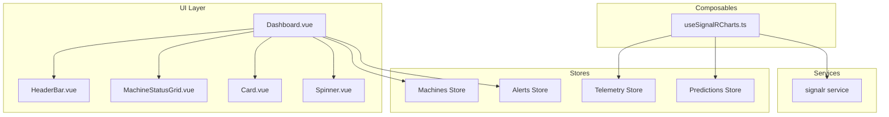
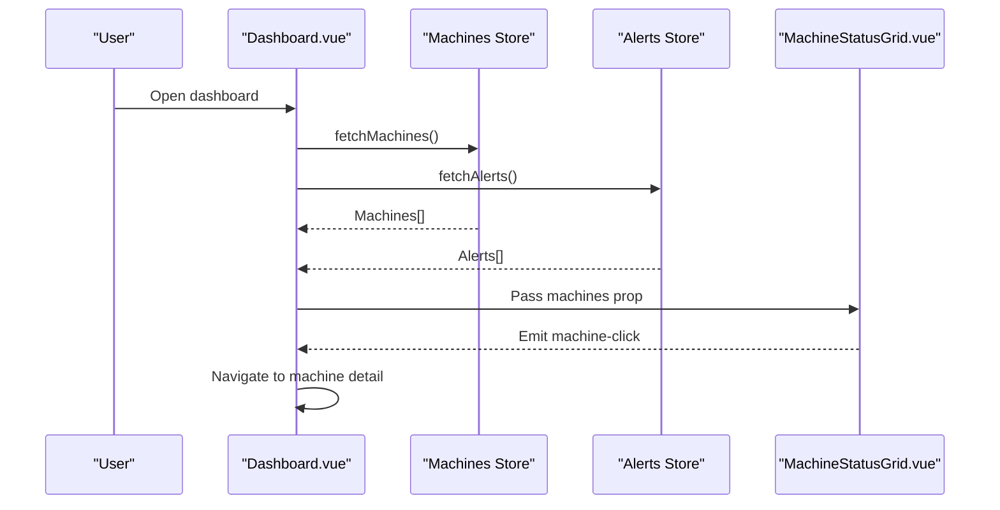
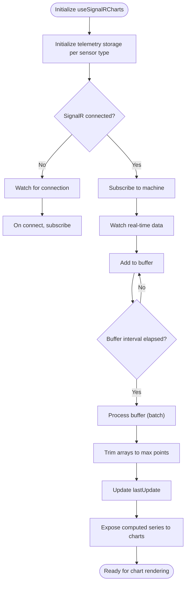
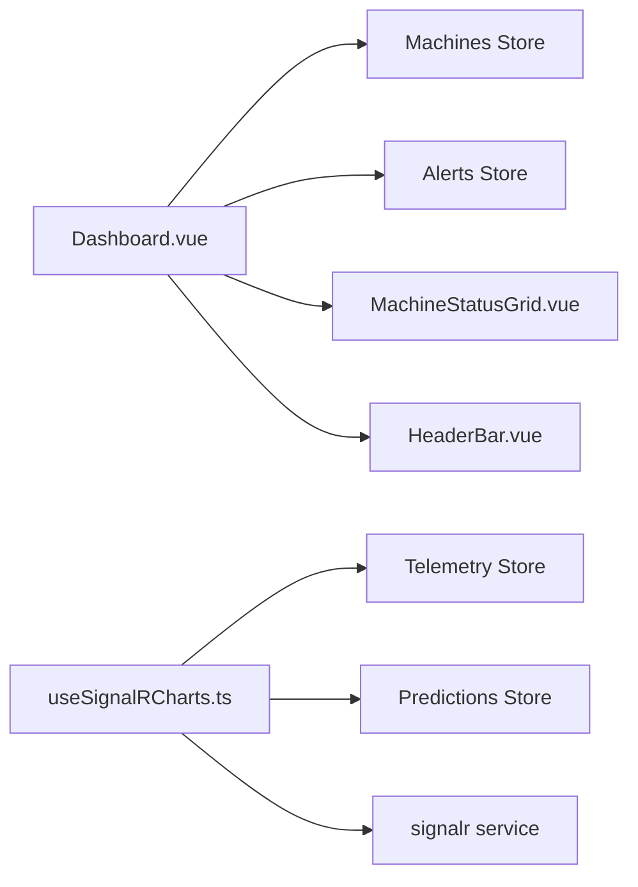

# Dashboard and Visualization Components

<cite>
**Referenced Files in This Document**
- [Dashboard.vue](file://src/frontend/src/views/Dashboard.vue)
- [useSignalRCharts.ts](file://src/frontend/src/composables/useSignalRCharts.ts)
- [index.ts](file://src/frontend/src/types/index.ts)
- [App.vue](file://src/ui/digital-twin-dashboard/src/App.vue)
</cite>

## Table of Contents
1. [Introduction](#introduction)
2. [Project Structure](#project-structure)
3. [Core Components](#core-components)
4. [Architecture Overview](#architecture-overview)
5. [Detailed Component Analysis](#detailed-component-analysis)
6. [Dependency Analysis](#dependency-analysis)
7. [Performance Considerations](#performance-considerations)
8. [Troubleshooting Guide](#troubleshooting-guide)
9. [Conclusion](#conclusion)

## Introduction
This document explains the dashboard and visualization components of the digital twin platform. It focuses on the dashboard layout system, the machine status grid implementation, and real-time chart components. It also documents the HeaderBar component usage, MachineStatusGrid data binding, interactive chart components using SignalR-driven composable logic, responsive design, and real-time data update patterns. The document outlines component composition patterns, reusable chart utilities, and the integration with backend APIs and SignalR hubs for live telemetry.

## Project Structure
The dashboard is implemented in the frontend application and integrates with a SignalR-based real-time streaming service. The main dashboard view composes several reusable components and orchestrates data fetching from stores. Real-time telemetry and predictions are handled by a composable that buffers and batches updates for performance.

**Diagram sources**
- [Dashboard.vue](file://src/frontend/src/views/Dashboard.vue#L1-L213)
- [useSignalRCharts.ts](file://src/frontend/src/composables/useSignalRCharts.ts#L1-L352)

**Section sources**
- [Dashboard.vue](file://src/frontend/src/views/Dashboard.vue#L1-L213)
- [useSignalRCharts.ts](file://src/frontend/src/composables/useSignalRCharts.ts#L1-L352)

## Core Components
- Dashboard view: Orchestrates top-level stats, alerts widget, quick actions, machine status grid, and system overview cards. It loads data concurrently from machines and alerts stores and handles navigation events.
- MachineStatusGrid: Displays a grid of machines with status, health score, and quick metrics. It receives a transformed machine dataset and emits click events for navigation.
- HeaderBar: Renders the page header with title and subtitle, integrated into the main layout.
- useSignalRCharts composable: Provides real-time telemetry and prediction data for charts, with buffering and batching to optimize rendering performance.
- Stores: Machines, Alerts, Telemetry, and Predictions stores supply data to the dashboard and composable logic.

Key props and events:
- MachineStatusGrid props: machines array with shape including id, name, status, healthScore, rul, temperature, vibration, lastUpdate.
- MachineStatusGrid emits: machine-click handler to navigate to machine detail.
- Dashboard quick actions: handleQuickAction routes to machines, alerts, settings, predictions, and logs actions.
- useSignalRCharts options: machineId, sensorTypes, enableBuffering, bufferInterval; returns reactive state and methods for subscribing/unsubscribing and loading data.

**Section sources**
- [Dashboard.vue](file://src/frontend/src/views/Dashboard.vue#L1-L213)
- [useSignalRCharts.ts](file://src/frontend/src/composables/useSignalRCharts.ts#L19-L303)
- [index.ts](file://src/frontend/src/types/index.ts#L8-L111)

## Architecture Overview
The dashboard follows a component-driven architecture with reactive stores and a composable for real-time data. The SignalR composable subscribes to machine telemetry, buffers updates, and exposes computed series for charts. The dashboard view binds to stores and passes derived data to child components.

**Diagram sources**
- [Dashboard.vue](file://src/frontend/src/views/Dashboard.vue#L74-L86)
- [Dashboard.vue](file://src/frontend/src/views/Dashboard.vue#L151-L152)

## Detailed Component Analysis

### Dashboard Layout System
The dashboard view organizes content into:
- Sidebar navigation and responsive layout adjustments.
- HeaderBar with title and subtitle.
- Top stats row with OverallHealthCard and ActiveAlertsWidget.
- Quick actions buttons.
- MachineStatusGrid for machine overview.
- System overview cards for recent activity and system status.

Responsive behavior:
- Uses Tailwind-based grid classes (e.g., lg:grid-cols-3) to adapt to larger screens.
- Sidebar collapse toggles left margin for content area.

Event handling:
- Navigation via Vue Router for quick actions and machine clicks.
- Loading spinner while initial data fetches are in progress.

**Section sources**
- [Dashboard.vue](file://src/frontend/src/views/Dashboard.vue#L89-L213)

### HeaderBar Component
- Purpose: Render the page header with title and subtitle.
- Integration: Included in the main content area alongside the sidebar.
- Usage: Passed static title and subtitle strings to the component.

**Section sources**
- [Dashboard.vue](file://src/frontend/src/views/Dashboard.vue#L94-L94)

### MachineStatusGrid Implementation
- Data binding: Receives a computed machines array with transformed fields (id, name, status mapped to health/warning/error, healthScore, rul, temperature, vibration, lastUpdate).
- Interaction: Emits a machine-click event with the selected machine object, enabling navigation to the machine detail page.
- Composition: Used as a reusable grid component to present machine summaries.

Props and events:
- Props: machines (array of machine objects with specific fields).
- Event: machine-click with payload of Machine.

**Section sources**
- [Dashboard.vue](file://src/frontend/src/views/Dashboard.vue#L28-L49)
- [Dashboard.vue](file://src/frontend/src/views/Dashboard.vue#L151-L152)

### Real-Time Chart Components and SignalR Integration
The useSignalRCharts composable manages real-time telemetry and prediction data for charts:
- Options: machineId, sensorTypes (default temperature, vibration, pressure), enableBuffering, bufferInterval.
- State: isConnected, isLoading, lastUpdate, telemetryPoints, predictionData, degradationData, sensorReadings.
- Buffering: Buffers incoming updates and processes them in batches to limit render frequency.
- Subscriptions: Subscribes to machine telemetry via SignalR service and watches real-time data from the store.
- Helpers: Normalizes sensor readings and computes thresholds and max values for radar-like displays.
- Exposed APIs: fetchHistoricalData, fetchPredictionData, fetchSensorReadings, subscribeToMachine, unsubscribeFromMachine, addToBuffer.

Reusable patterns:
- useRealtimeSensorChart: Single sensor chart wrapper around the main composable.
- useMultiSensorChart: Aggregates multiple single-sensor charts for multi-series displays.

**Diagram sources**
- [useSignalRCharts.ts](file://src/frontend/src/composables/useSignalRCharts.ts#L26-L134)
- [useSignalRCharts.ts](file://src/frontend/src/composables/useSignalRCharts.ts#L147-L164)

**Section sources**
- [useSignalRCharts.ts](file://src/frontend/src/composables/useSignalRCharts.ts#L19-L303)

### Data Models and Types
The dashboard relies on shared types for machines, telemetry, alerts, and predictions. These types define the shape of data passed to components and consumed by stores and composables.

Key types:
- Machine: id, name, type, location, status, healthScore, dates, specifications.
- TelemetryDataPoint: timestamp, value, machineId, sensorType.
- Alert: id, machineId, title, description, severity, status, timestamps.
- Prediction/RULPrediction: identifiers, values, confidence bounds, model metadata, timestamps.

These types inform props contracts and ensure consistent data binding across components.

**Section sources**
- [index.ts](file://src/frontend/src/types/index.ts#L8-L111)

### Responsive Design Implementation
- Grid layouts: Responsive grid classes adjust the number of columns on large screens.
- Sidebar: The main content area adjusts its left margin based on sidebar collapsed state.
- UI shell: The application shell in the UI project demonstrates additional responsive patterns (e.g., media queries for sidebar and topbar).

**Section sources**
- [Dashboard.vue](file://src/frontend/src/views/Dashboard.vue#L105-L149)
- [Dashboard.vue](file://src/frontend/src/views/Dashboard.vue#L93-L93)
- [App.vue](file://src/ui/digital-twin-dashboard/src/App.vue#L291-L306)

### Interactive Chart Components Using SignalR
- Real-time updates: The composable subscribes to machine telemetry and pushes normalized data points into sensor-specific series.
- Historical data: Provides a method to fetch historical data for initial chart rendering.
- Prediction overlays: Loads RUL predictions and transforms them into chart-ready data points.
- Sensor readings: Computes normalized sensor readings for radar-style visualizations.

Composition patterns:
- Single-sensor charts: useRealtimeSensorChart wraps the main composable for one sensor.
- Multi-sensor charts: useMultiSensorChart aggregates multiple single-sensor charts.

**Section sources**
- [useSignalRCharts.ts](file://src/frontend/src/composables/useSignalRCharts.ts#L308-L334)
- [useSignalRCharts.ts](file://src/frontend/src/composables/useSignalRCharts.ts#L339-L351)

### Dashboard Customization Options
- Quick actions: Buttons for navigation to machines, alerts, settings, and predictions.
- Stats cards: Overall health score, total machines, healthy/warning/critical counts.
- Recent activity: Displays recent alerts with severity indicators.
- System overview: Shows active machines, last sync, SignalR connection status, and uptime.

**Section sources**
- [Dashboard.vue](file://src/frontend/src/views/Dashboard.vue#L105-L207)

### Integration with Backend API and SignalR
- SignalR service: The composable subscribes to machine channels and reacts to real-time messages.
- Stores: TelemetryStore and PredictionsStore hold historical and real-time data used by the composable.
- API endpoints: Historical data loading is indicated via comments and store-based access; prediction data is loaded from predictions store.

Note: The SignalR hub and controller endpoints are part of the backend API project and are referenced here conceptually to explain the integration.

**Section sources**
- [useSignalRCharts.ts](file://src/frontend/src/composables/useSignalRCharts.ts#L136-L145)
- [useSignalRCharts.ts](file://src/frontend/src/composables/useSignalRCharts.ts#L166-L183)
- [useSignalRCharts.ts](file://src/frontend/src/composables/useSignalRCharts.ts#L185-L199)

## Dependency Analysis
The dashboard depends on stores for data and a composable for real-time updates. The composable depends on the SignalR service and telemetry/predictions stores.

**Diagram sources**
- [Dashboard.vue](file://src/frontend/src/views/Dashboard.vue#L1-L213)
- [useSignalRCharts.ts](file://src/frontend/src/composables/useSignalRCharts.ts#L1-L352)

**Section sources**
- [Dashboard.vue](file://src/frontend/src/views/Dashboard.vue#L11-L17)
- [useSignalRCharts.ts](file://src/frontend/src/composables/useSignalRCharts.ts#L29-L31)

## Performance Considerations
- Buffering and batching: The composable limits updates to a maximum rate and processes data in batches to reduce re-renders.
- Data trimming: Old data points are trimmed to a maximum count to prevent memory growth.
- Concurrent initialization: The dashboard fetches machines and alerts concurrently to minimize load time.
- Computed derivations: Stats and transformed datasets are computed to avoid unnecessary prop churn.

Recommendations:
- Tune bufferInterval and maxUpdatesPerSecond based on device capabilities.
- Use virtualization for very large datasets in grids.
- Debounce user-triggered refresh actions.

**Section sources**
- [useSignalRCharts.ts](file://src/frontend/src/composables/useSignalRCharts.ts#L13-L17)
- [useSignalRCharts.ts](file://src/frontend/src/composables/useSignalRCharts.ts#L65-L92)
- [Dashboard.vue](file://src/frontend/src/views/Dashboard.vue#L77-L80)

## Troubleshooting Guide
Common issues and resolutions:
- Real-time data not updating:
  - Verify SignalR connection state and subscription.
  - Check that real-time data watcher is active and receiving updates.
- Empty or stale charts:
  - Ensure historical data is fetched before rendering.
  - Confirm sensor types match the available telemetry keys.
- Performance problems:
  - Reduce bufferInterval or disable buffering temporarily.
  - Limit maxDataPoints or trim older data more aggressively.
- Navigation failures:
  - Confirm router paths exist and machine IDs are valid.

**Section sources**
- [useSignalRCharts.ts](file://src/frontend/src/composables/useSignalRCharts.ts#L249-L276)
- [useSignalRCharts.ts](file://src/frontend/src/composables/useSignalRCharts.ts#L166-L183)

## Conclusion
The dashboard leverages a modular, reactive architecture with reusable components and a robust SignalR-backed composable for real-time data visualization. The MachineStatusGrid presents actionable machine insights, while the composable ensures efficient, smooth updates for charts. The design is responsive and extensible, supporting customization through props, events, and configurable buffering strategies.