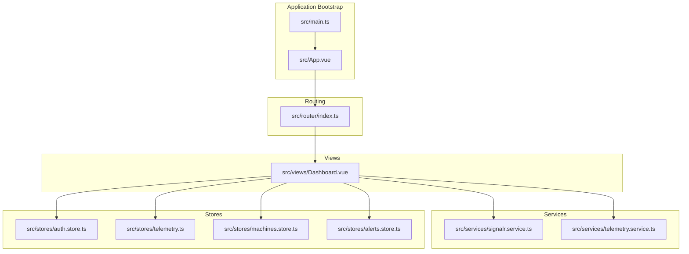
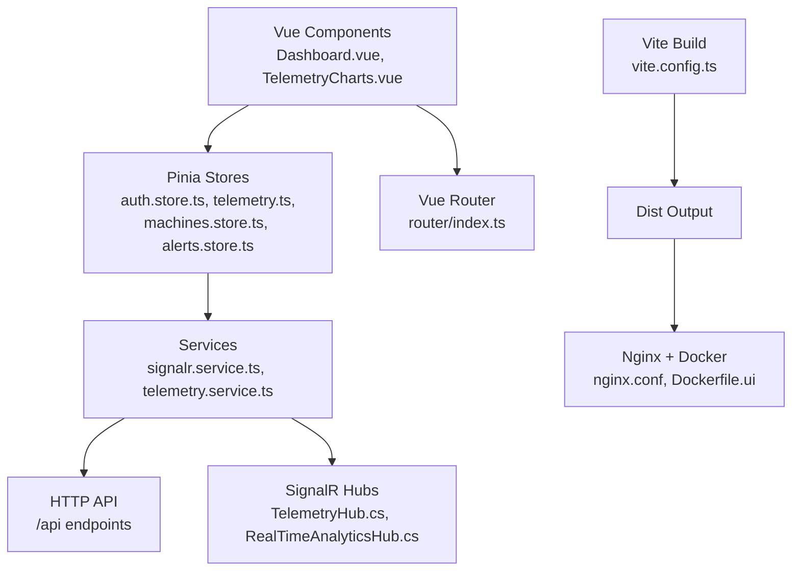
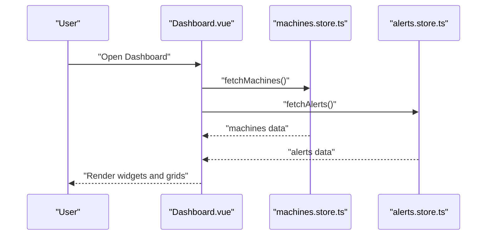
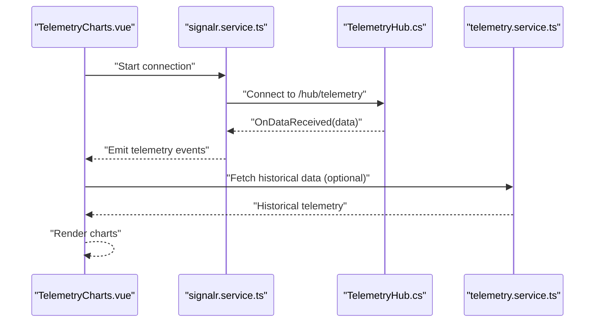
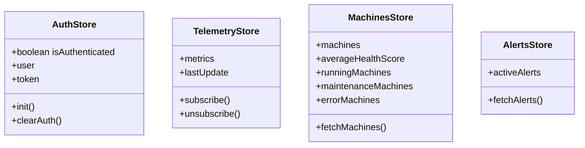
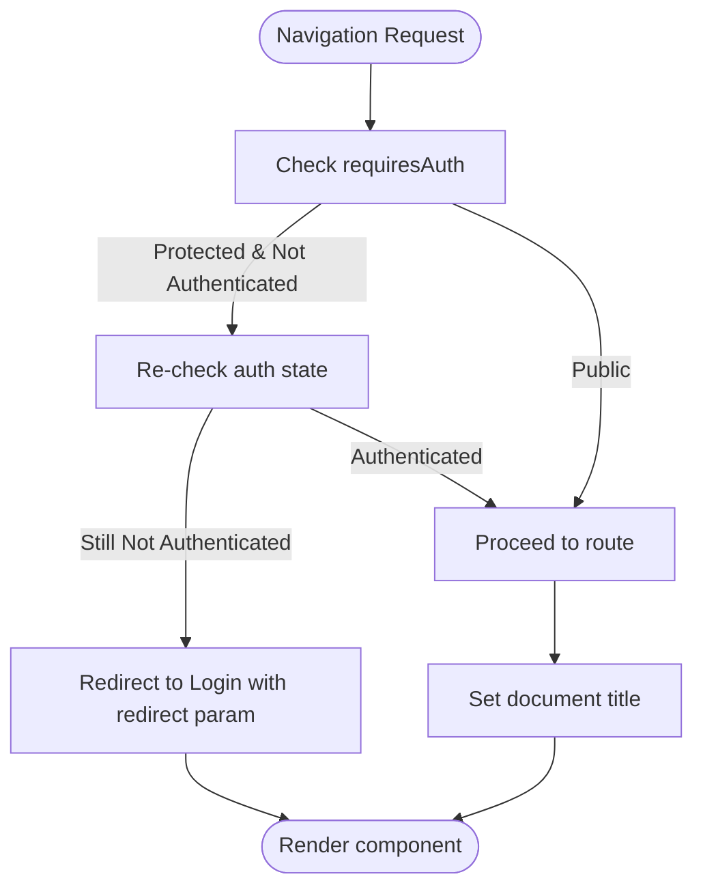
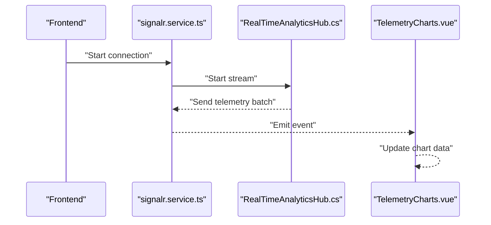
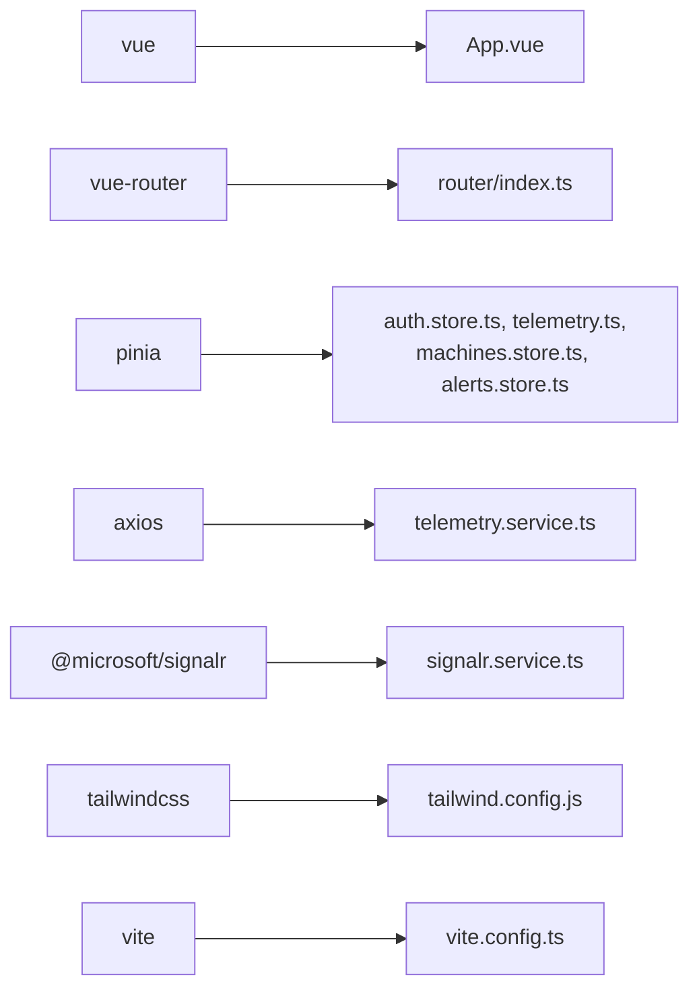

# Frontend Application

<cite>
**Referenced Files in This Document**
- [package.json](file://src/ui/digital-twin-dashboard/package.json)
- [vite.config.ts](file://src/ui/digital-twin-dashboard/vite.config.ts)
- [tailwind.config.js](file://src/ui/digital-twin-dashboard/tailwind.config.js)
- [main.ts](file://src/ui/digital-twin-dashboard/src/main.ts)
- [App.vue](file://src/ui/digital-twin-dashboard/src/App.vue)
- [router/index.ts](file://src/ui/digital-twin-dashboard/src/router/index.ts)
- [Dashboard.vue](file://src/ui/digital-twin-dashboard/src/views/Dashboard.vue)
- [signalr.service.ts](file://src/ui/digital-twin-dashboard/src/services/signalr.service.ts)
- [telemetry.service.ts](file://src/ui/digital-twin-dashboard/src/services/telemetry.service.ts)
- [auth.store.ts](file://src/ui/digital-twin-dashboard/src/stores/auth.store.ts)
- [telemetry.ts](file://src/ui/digital-twin-dashboard/src/stores/telemetry.ts)
- [machines.store.ts](file://src/ui/digital-twin-dashboard/src/stores/machines.store.ts)
- [alerts.store.ts](file://src/ui/digital-twin-dashboard/src/stores/alerts.store.ts)
- [TelemetryCharts.vue](file://src/ui/digital-twin-dashboard/src/components/telemetry/TelemetryCharts.vue)
- [RealTimeAnalyticsView.vue](file://src/ui/digital-twin-dashboard/src/views/RealTimeAnalyticsView.vue)
- [RealTimeAnalyticsHub.cs](file://src/api/DigitalTwinPlatform.API/Hubs/RealTimeAnalyticsHub.cs)
- [TelemetryHub.cs](file://src/api/DigitalTwinPlatform.API/Hubs/TelemetryHub.cs)
- [Dockerfile.ui](file://Dockerfile.ui)
- [nginx.conf](file://src/ui/digital-twin-dashboard/nginx.conf)
- [vite.config.optimized.ts](file://src/ui/digital-twin-dashboard/vite.config.optimized.ts)
</cite>

## Table of Contents
1. [Introduction](#introduction)
2. [Project Structure](#project-structure)
3. [Core Components](#core-components)
4. [Architecture Overview](#architecture-overview)
5. [Detailed Component Analysis](#detailed-component-analysis)
6. [Dependency Analysis](#dependency-analysis)
7. [Performance Considerations](#performance-considerations)
8. [Troubleshooting Guide](#troubleshooting-guide)
9. [Conclusion](#conclusion)
10. [Appendices](#appendices)

## Introduction
This document describes the frontend application for the Digital Twin Platform, focusing on the Vue.js dashboard implementation. It covers application architecture, component structure, state management with Pinia, routing configuration, dashboard components, real-time telemetry visualization, and user interaction patterns. It also documents the service layer, API integration patterns, SignalR real-time communication, build system, styling approach with TailwindCSS, deployment considerations, responsive design, accessibility compliance, and performance optimization strategies.

## Project Structure
The frontend is a monorepo-style project organized under src/ui/digital-twin-dashboard with a Vue 3 + TypeScript codebase, Vite build tooling, and Pinia for state management. Key areas include:
- Application bootstrap and global configuration
- Routing with Vue Router
- Dashboard and feature views
- Services for API and SignalR communication
- Stores for state management
- Components for UI and telemetry visualization
- Build configuration and deployment artifacts

**Diagram sources**
- [main.ts](file://src/ui/digital-twin-dashboard/src/main.ts#L1-L17)
- [App.vue](file://src/ui/digital-twin-dashboard/src/App.vue#L1-L507)
- [router/index.ts](file://src/ui/digital-twin-dashboard/src/router/index.ts#L1-L112)
- [Dashboard.vue](file://src/ui/digital-twin-dashboard/src/views/Dashboard.vue#L1-L213)
- [signalr.service.ts](file://src/ui/digital-twin-dashboard/src/services/signalr.service.ts)
- [telemetry.service.ts](file://src/ui/digital-twin-dashboard/src/services/telemetry.service.ts)
- [auth.store.ts](file://src/ui/digital-twin-dashboard/src/stores/auth.store.ts)
- [telemetry.ts](file://src/ui/digital-twin-dashboard/src/stores/telemetry.ts)
- [machines.store.ts](file://src/ui/digital-twin-dashboard/src/stores/machines.store.ts)
- [alerts.store.ts](file://src/ui/digital-twin-dashboard/src/stores/alerts.store.ts)

**Section sources**
- [package.json](file://src/ui/digital-twin-dashboard/package.json#L1-L87)
- [vite.config.ts](file://src/ui/digital-twin-dashboard/vite.config.ts#L1-L48)
- [tailwind.config.js](file://src/ui/digital-twin-dashboard/tailwind.config.js#L1-L94)
- [main.ts](file://src/ui/digital-twin-dashboard/src/main.ts#L1-L17)
- [App.vue](file://src/ui/digital-twin-dashboard/src/App.vue#L1-L507)
- [router/index.ts](file://src/ui/digital-twin-dashboard/src/router/index.ts#L1-L112)

## Core Components
- Application shell and navigation: The root App component defines the sidebar navigation, logout flow, and integrates the router outlet. It uses Lucide icons and a glass-like sidebar design with responsive behavior.
- Dashboard view: The Dashboard view composes multiple widgets and grids, orchestrating data fetching via stores and routing to detailed views.
- State management: Pinia stores encapsulate domain-specific state (authentication, telemetry, machines, alerts) with actions and getters.
- Routing: Vue Router manages named routes, guards, and dynamic imports for lazy loading.
- Services: Axios-based services abstract API calls; SignalR service handles real-time updates.
- Styling: TailwindCSS provides utility-first styling with custom color palettes and animations.

**Section sources**
- [App.vue](file://src/ui/digital-twin-dashboard/src/App.vue#L61-L124)
- [Dashboard.vue](file://src/ui/digital-twin-dashboard/src/views/Dashboard.vue#L1-L213)
- [auth.store.ts](file://src/ui/digital-twin-dashboard/src/stores/auth.store.ts)
- [telemetry.ts](file://src/ui/digital-twin-dashboard/src/stores/telemetry.ts)
- [machines.store.ts](file://src/ui/digital-twin-dashboard/src/stores/machines.store.ts)
- [alerts.store.ts](file://src/ui/digital-twin-dashboard/src/stores/alerts.store.ts)
- [router/index.ts](file://src/ui/digital-twin-dashboard/src/router/index.ts#L1-L112)
- [signalr.service.ts](file://src/ui/digital-twin-dashboard/src/services/signalr.service.ts)
- [telemetry.service.ts](file://src/ui/digital-twin-dashboard/src/services/telemetry.service.ts)

## Architecture Overview
The frontend follows a layered architecture:
- Presentation layer: Vue components and views
- Service layer: Axios-based HTTP clients and SignalR client
- State management: Pinia stores
- Routing: Vue Router with navigation guards
- Build and deployment: Vite with optimized chunking and Docker/Nginx packaging

**Diagram sources**
- [Dashboard.vue](file://src/ui/digital-twin-dashboard/src/views/Dashboard.vue#L1-L213)
- [TelemetryCharts.vue](file://src/ui/digital-twin-dashboard/src/components/telemetry/TelemetryCharts.vue)
- [auth.store.ts](file://src/ui/digital-twin-dashboard/src/stores/auth.store.ts)
- [telemetry.ts](file://src/ui/digital-twin-dashboard/src/stores/telemetry.ts)
- [machines.store.ts](file://src/ui/digital-twin-dashboard/src/stores/machines.store.ts)
- [alerts.store.ts](file://src/ui/digital-twin-dashboard/src/stores/alerts.store.ts)
- [router/index.ts](file://src/ui/digital-twin-dashboard/src/router/index.ts#L1-L112)
- [signalr.service.ts](file://src/ui/digital-twin-dashboard/src/services/signalr.service.ts)
- [telemetry.service.ts](file://src/ui/digital-twin-dashboard/src/services/telemetry.service.ts)
- [vite.config.ts](file://src/ui/digital-twin-dashboard/vite.config.ts#L1-L48)
- [TelemetryHub.cs](file://src/api/DigitalTwinPlatform.API/Hubs/TelemetryHub.cs)
- [RealTimeAnalyticsHub.cs](file://src/api/DigitalTwinPlatform.API/Hubs/RealTimeAnalyticsHub.cs)
- [nginx.conf](file://src/ui/digital-twin-dashboard/nginx.conf)
- [Dockerfile.ui](file://Dockerfile.ui)

## Detailed Component Analysis

### Application Shell and Navigation
The App component sets up the global layout with a collapsible sidebar, navigation items, and logout functionality. It integrates the router outlet and provides a toast container for notifications.

Key aspects:
- Navigation items are defined as an array of route objects with icons from Lucide.
- Logout clears authentication state and navigates to the login page.
- Responsive sidebar behavior is handled via CSS transforms.

**Section sources**
- [App.vue](file://src/ui/digital-twin-dashboard/src/App.vue#L61-L124)
- [App.vue](file://src/ui/digital-twin-dashboard/src/App.vue#L126-L162)

### Dashboard View
The Dashboard view orchestrates:
- Loading state management
- Composition of widgets (health cards, alerts widget, machine status grid)
- Quick action buttons and navigation to related views
- Integration with Pinia stores for machines, alerts, and telemetry

**Diagram sources**
- [Dashboard.vue](file://src/ui/digital-twin-dashboard/src/views/Dashboard.vue#L74-L86)
- [machines.store.ts](file://src/ui/digital-twin-dashboard/src/stores/machines.store.ts)
- [alerts.store.ts](file://src/ui/digital-twin-dashboard/src/stores/alerts.store.ts)

**Section sources**
- [Dashboard.vue](file://src/ui/digital-twin-dashboard/src/views/Dashboard.vue#L1-L213)

### Telemetry Visualization Components
The telemetry visualization stack includes:
- TelemetryCharts component for rendering charts
- RealTimeAnalyticsView for real-time dashboards
- SignalR service for WebSocket connections
- Telemetry service for API calls

**Diagram sources**
- [TelemetryCharts.vue](file://src/ui/digital-twin-dashboard/src/components/telemetry/TelemetryCharts.vue)
- [signalr.service.ts](file://src/ui/digital-twin-dashboard/src/services/signalr.service.ts)
- [TelemetryHub.cs](file://src/api/DigitalTwinPlatform.API/Hubs/TelemetryHub.cs)
- [telemetry.service.ts](file://src/ui/digital-twin-dashboard/src/services/telemetry.service.ts)

**Section sources**
- [TelemetryCharts.vue](file://src/ui/digital-twin-dashboard/src/components/telemetry/TelemetryCharts.vue)
- [RealTimeAnalyticsView.vue](file://src/ui/digital-twin-dashboard/src/views/RealTimeAnalyticsView.vue)
- [signalr.service.ts](file://src/ui/digital-twin-dashboard/src/services/signalr.service.ts)
- [telemetry.service.ts](file://src/ui/digital-twin-dashboard/src/services/telemetry.service.ts)
- [TelemetryHub.cs](file://src/api/DigitalTwinPlatform.API/Hubs/TelemetryHub.cs)

### State Management with Pinia
Stores encapsulate domain logic:
- Authentication store: manages user session, tokens, and profile data
- Telemetry store: holds real-time telemetry state and metrics
- Machines store: aggregates machine data and derived metrics
- Alerts store: manages active alerts and severity filters

**Diagram sources**
- [auth.store.ts](file://src/ui/digital-twin-dashboard/src/stores/auth.store.ts)
- [telemetry.ts](file://src/ui/digital-twin-dashboard/src/stores/telemetry.ts)
- [machines.store.ts](file://src/ui/digital-twin-dashboard/src/stores/machines.store.ts)
- [alerts.store.ts](file://src/ui/digital-twin-dashboard/src/stores/alerts.store.ts)

**Section sources**
- [auth.store.ts](file://src/ui/digital-twin-dashboard/src/stores/auth.store.ts)
- [telemetry.ts](file://src/ui/digital-twin-dashboard/src/stores/telemetry.ts)
- [machines.store.ts](file://src/ui/digital-twin-dashboard/src/stores/machines.store.ts)
- [alerts.store.ts](file://src/ui/digital-twin-dashboard/src/stores/alerts.store.ts)

### Routing Configuration
The router defines named routes, lazy-loaded views, and navigation guards:
- Guards check authentication and set page titles dynamically
- Redirects handle anonymous access and protected routes
- Scroll behavior restores previous positions

**Diagram sources**
- [router/index.ts](file://src/ui/digital-twin-dashboard/src/router/index.ts#L85-L109)

**Section sources**
- [router/index.ts](file://src/ui/digital-twin-dashboard/src/router/index.ts#L1-L112)

### Service Layer Implementation and API Integration
Services abstract HTTP and SignalR interactions:
- Axios-based services for CRUD operations and domain-specific queries
- SignalR service for real-time subscriptions and event handling
- Centralized error handling and retry/backoff strategies via composables

Integration patterns:
- Service composition: components depend on services, not raw HTTP clients
- Store-service boundaries: stores orchestrate service calls and update state
- Type safety: TypeScript DTOs and response handlers ensure robust integrations

**Section sources**
- [signalr.service.ts](file://src/ui/digital-twin-dashboard/src/services/signalr.service.ts)
- [telemetry.service.ts](file://src/ui/digital-twin-dashboard/src/services/telemetry.service.ts)

### Real-Time Telemetry Visualization
Real-time telemetry is achieved through SignalR hubs and Vue components:
- TelemetryCharts renders live metrics using chart libraries
- RealTimeAnalyticsView displays streaming analytics
- Backend hubs publish updates to connected clients

**Diagram sources**
- [signalr.service.ts](file://src/ui/digital-twin-dashboard/src/services/signalr.service.ts)
- [RealTimeAnalyticsHub.cs](file://src/api/DigitalTwinPlatform.API/Hubs/RealTimeAnalyticsHub.cs)
- [TelemetryCharts.vue](file://src/ui/digital-twin-dashboard/src/components/telemetry/TelemetryCharts.vue)

**Section sources**
- [RealTimeAnalyticsView.vue](file://src/ui/digital-twin-dashboard/src/views/RealTimeAnalyticsView.vue)
- [TelemetryCharts.vue](file://src/ui/digital-twin-dashboard/src/components/telemetry/TelemetryCharts.vue)
- [RealTimeAnalyticsHub.cs](file://src/api/DigitalTwinPlatform.API/Hubs/RealTimeAnalyticsHub.cs)

### User Interaction Patterns
Common interaction patterns:
- Sidebar navigation with active state highlighting
- Quick action buttons leading to related views
- Clickable machine cards navigating to detail pages
- Toast notifications for feedback and errors
- Responsive sidebar toggling on small screens

**Section sources**
- [App.vue](file://src/ui/digital-twin-dashboard/src/App.vue#L126-L162)
- [Dashboard.vue](file://src/ui/digital-twin-dashboard/src/views/Dashboard.vue#L47-L72)

## Dependency Analysis
The frontend depends on Vue 3, Vue Router, Pinia, Axios, and SignalR for real-time communication. Build-time dependencies include Vite, TypeScript, ESLint, Prettier, and PostCSS/TailwindCSS.

**Diagram sources**
- [package.json](file://src/ui/digital-twin-dashboard/package.json#L24-L40)
- [vite.config.ts](file://src/ui/digital-twin-dashboard/vite.config.ts#L1-L48)
- [tailwind.config.js](file://src/ui/digital-twin-dashboard/tailwind.config.js#L1-L94)
- [main.ts](file://src/ui/digital-twin-dashboard/src/main.ts#L1-L17)

**Section sources**
- [package.json](file://src/ui/digital-twin-dashboard/package.json#L1-L87)
- [vite.config.ts](file://src/ui/digital-twin-dashboard/vite.config.ts#L1-L48)

## Performance Considerations
Optimization strategies:
- Code splitting and chunking: Vite configuration groups vendor, charts, and utility libraries to improve caching and load performance.
- Lazy loading: Routes use dynamic imports for on-demand loading.
- Efficient reactivity: Pinia stores minimize unnecessary re-renders; computed properties derive metrics efficiently.
- Chart optimization: Use lightweight chart libraries and update only changed series/data.
- Asset optimization: Tailwind purges unused CSS; images and fonts are optimized externally.
- Build-time improvements: Parallel builds and minimized bundle sizes.

**Section sources**
- [vite.config.ts](file://src/ui/digital-twin-dashboard/vite.config.ts#L34-L46)
- [vite.config.optimized.ts](file://src/ui/digital-twin-dashboard/vite.config.optimized.ts)

## Troubleshooting Guide
Common issues and resolutions:
- Authentication redirects loop: Verify auth store initialization and router guards; ensure tokens are persisted and validated.
- Real-time connection failures: Check SignalR hub connectivity, CORS configuration, and proxy settings in development.
- Chart rendering issues: Validate data shapes and ensure chart libraries are properly registered.
- Build errors: Confirm TypeScript strictness, plugin compatibility, and Node.js version requirements.
- Styling inconsistencies: Ensure Tailwind content paths match component locations and purge unused styles appropriately.

**Section sources**
- [router/index.ts](file://src/ui/digital-twin-dashboard/src/router/index.ts#L85-L109)
- [signalr.service.ts](file://src/ui/digital-twin-dashboard/src/services/signalr.service.ts)
- [tailwind.config.js](file://src/ui/digital-twin-dashboard/tailwind.config.js#L4-L7)

## Conclusion
The frontend application provides a modern, scalable Vue.js dashboard for the Digital Twin Platform. It leverages Pinia for predictable state management, Vue Router for structured navigation, and SignalR for real-time telemetry. The modular component architecture, service layer abstractions, and optimized build pipeline enable maintainability and performance. With responsive design and accessibility considerations integrated, the platform supports efficient operations and future extensibility.

## Appendices

### Build System and Deployment
- Build command: Vite compiles TypeScript and Vue SFCs, generates source maps, and splits bundles into vendor, charts, and utils chunks.
- Preview and development: Local server with hot module replacement and proxy for API and SignalR hubs.
- Docker and Nginx: Containerized deployment with Nginx serving static assets and proxying API requests.

**Section sources**
- [vite.config.ts](file://src/ui/digital-twin-dashboard/vite.config.ts#L1-L48)
- [Dockerfile.ui](file://Dockerfile.ui)
- [nginx.conf](file://src/ui/digital-twin-dashboard/nginx.conf)

### Styling Approach with TailwindCSS
- Utility-first CSS with custom color palette and animations.
- Dark mode support via class-based switching.
- Purge configuration targets Vue and TS files for optimal bundle size.

**Section sources**
- [tailwind.config.js](file://src/ui/digital-twin-dashboard/tailwind.config.js#L1-L94)

### Accessibility Compliance
- Semantic HTML and proper ARIA attributes in components.
- Keyboard navigation support and focus management.
- Color contrast and readable typography using Tailwind utilities.
- Screen reader-friendly labels and roles.

[No sources needed since this section provides general guidance]

### Practical Examples and Extension Patterns
- Component usage: Import reusable components and pass props for customization (e.g., chart dimensions, thresholds).
- Customization options: Extend stores with additional getters and actions; add new routes and services as needed.
- Extension patterns: Create new views by composing existing components, adding new stores for domain data, and integrating SignalR streams for real-time updates.

[No sources needed since this section provides general guidance]