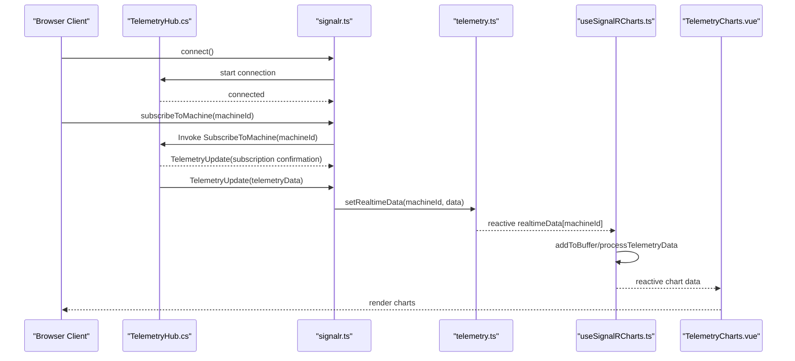
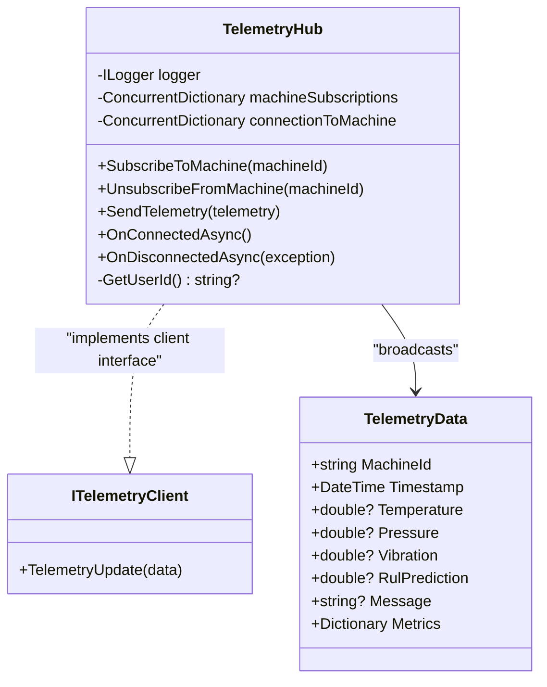
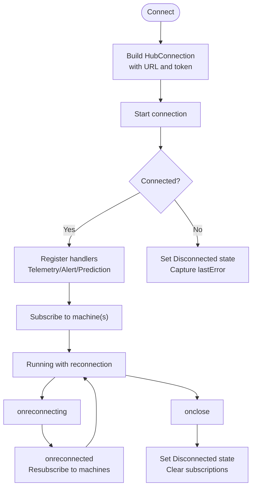
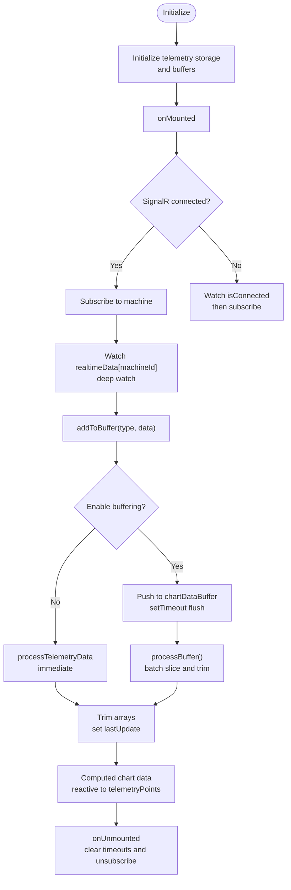
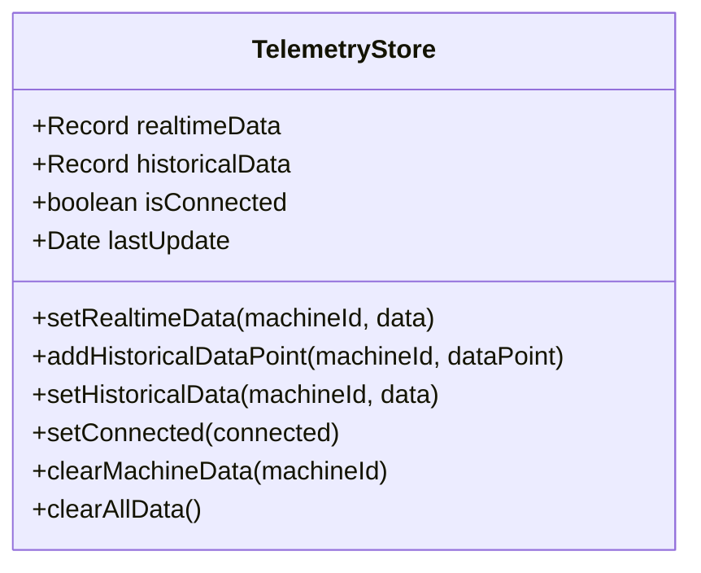
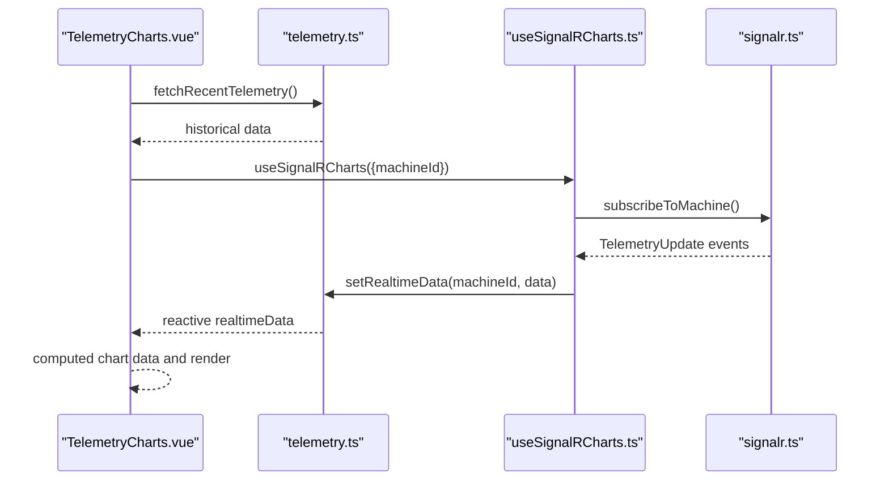
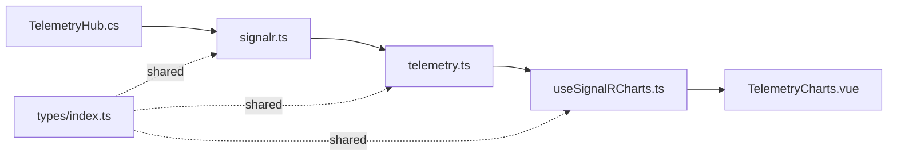

# Real-time Telemetry System

<cite>
**Referenced Files in This Document**
- [TelemetryHub.cs](file://src/api/DigitalTwinPlatform.API/Hubs/TelemetryHub.cs)
- [signalr.ts](file://src/frontend/src/services/signalr.ts)
- [useSignalRCharts.ts](file://src/frontend/src/composables/useSignalRCharts.ts)
- [telemetry.ts](file://src/frontend/src/stores/telemetry.ts)
- [TelemetryCharts.vue](file://src/ui/digital-twin-dashboard/src/components/TelemetryCharts.vue)
- [telemetry.ts](file://src/frontend/src/services/telemetry.ts)
- [index.ts](file://src/frontend/src/types/index.ts)
</cite>

## Table of Contents
1. [Introduction](#introduction)
2. [Project Structure](#project-structure)
3. [Core Components](#core-components)
4. [Architecture Overview](#architecture-overview)
5. [Detailed Component Analysis](#detailed-component-analysis)
6. [Dependency Analysis](#dependency-analysis)
7. [Performance Considerations](#performance-considerations)
8. [Troubleshooting Guide](#troubleshooting-guide)
9. [Conclusion](#conclusion)

## Introduction
This document explains the real-time telemetry system built with SignalR, covering the backend hub implementation, frontend connection management, reactive data stores, and real-time chart updates. It documents the useSignalRCharts composable, telemetry store management, and the integration between SignalR and Vue components. Practical examples demonstrate SignalR hub connections, message handling, automatic reconnection logic, telemetry data processing, chart updates, and performance optimization strategies for real-time scenarios.

## Project Structure
The real-time telemetry system spans backend and frontend components:
- Backend: ASP.NET Core SignalR Hub for telemetry streaming
- Frontend: SignalR service for connection lifecycle and event handling, composable for buffering and chart updates, Pinia stores for reactive telemetry data, and Vue components for visualization

```mermaid
graph TB
subgraph "Backend"
TH["TelemetryHub.cs<br/>SignalR Hub"]
end
subgraph "Frontend"
SRV["signalr.ts<br/>SignalR Service"]
COM["useSignalRCharts.ts<br/>Charts Composable"]
STR["telemetry.ts<br/>Telemetry Store"]
VUE["TelemetryCharts.vue<br/>Vue Component"]
TYP["types/index.ts<br/>Shared Types"]
end
TH <- --> SRV
SRV --> STR
STR --> COM
COM --> VUE
TYP -. shared types .-> SRV
TYP -. shared types .-> COM
TYP -. shared types .-> STR
```

**Diagram sources**
- [TelemetryHub.cs](file://src/api/DigitalTwinPlatform.API/Hubs/TelemetryHub.cs#L12-L210)
- [signalr.ts](file://src/frontend/src/services/signalr.ts#L43-L267)
- [useSignalRCharts.ts](file://src/frontend/src/composables/useSignalRCharts.ts#L26-L303)
- [telemetry.ts](file://src/frontend/src/stores/telemetry.ts#L5-L57)
- [TelemetryCharts.vue](file://src/ui/digital-twin-dashboard/src/components/TelemetryCharts.vue#L116-L306)
- [index.ts](file://src/frontend/src/types/index.ts#L21-L49)

**Section sources**
- [TelemetryHub.cs](file://src/api/DigitalTwinPlatform.API/Hubs/TelemetryHub.cs#L12-L210)
- [signalr.ts](file://src/frontend/src/services/signalr.ts#L43-L267)
- [useSignalRCharts.ts](file://src/frontend/src/composables/useSignalRCharts.ts#L26-L303)
- [telemetry.ts](file://src/frontend/src/stores/telemetry.ts#L5-L57)
- [TelemetryCharts.vue](file://src/ui/digital-twin-dashboard/src/components/TelemetryCharts.vue#L116-L306)
- [index.ts](file://src/frontend/src/types/index.ts#L21-L49)

## Core Components
- SignalR Hub (backend): Manages subscriptions per machine, broadcasts telemetry updates, and handles connection lifecycle
- SignalR Service (frontend): Establishes and maintains the SignalR connection, registers event handlers, and manages reconnection
- Charts Composable: Buffers incoming telemetry, processes updates, and exposes reactive chart data
- Telemetry Store: Centralizes real-time and historical telemetry data with reactive updates
- Vue Component: Renders real-time charts and metrics, integrating with the composable and store

Key responsibilities:
- Connection management: Automatic reconnection, state tracking, and error propagation
- Data processing: Buffering, batching, trimming, and mapping backend data to frontend types
- Reactive updates: Vue reactivity through Pinia stores and computed properties
- Visualization: Real-time chart rendering with performance constraints

**Section sources**
- [TelemetryHub.cs](file://src/api/DigitalTwinPlatform.API/Hubs/TelemetryHub.cs#L33-L118)
- [signalr.ts](file://src/frontend/src/services/signalr.ts#L55-L110)
- [useSignalRCharts.ts](file://src/frontend/src/composables/useSignalRCharts.ts#L26-L92)
- [telemetry.ts](file://src/frontend/src/stores/telemetry.ts#L11-L25)
- [TelemetryCharts.vue](file://src/ui/digital-twin-dashboard/src/components/TelemetryCharts.vue#L116-L172)

## Architecture Overview
The system follows a publish-subscribe pattern:
- Clients connect to the SignalR hub and subscribe to machine groups
- Backend publishes telemetry updates to subscribed clients
- Frontend receives messages, maps them to frontend types, and updates stores
- Composable consumes store updates to render charts and metrics



**Diagram sources**
- [TelemetryHub.cs](file://src/api/DigitalTwinPlatform.API/Hubs/TelemetryHub.cs#L33-L118)
- [signalr.ts](file://src/frontend/src/services/signalr.ts#L55-L110)
- [signalr.ts](file://src/frontend/src/services/signalr.ts#L148-L166)
- [telemetry.ts](file://src/frontend/src/stores/telemetry.ts#L11-L14)
- [useSignalRCharts.ts](file://src/frontend/src/composables/useSignalRCharts.ts#L66-L92)
- [TelemetryCharts.vue](file://src/ui/digital-twin-dashboard/src/components/TelemetryCharts.vue#L116-L172)

## Detailed Component Analysis

### SignalR Hub Implementation
The backend hub provides:
- Subscription management per machine via SignalR groups
- Confirmation messages upon subscribe/unsubscribe
- Robust connection/disconnection handling with logging
- Support for broadcasting telemetry updates to subscribed clients



**Diagram sources**
- [TelemetryHub.cs](file://src/api/DigitalTwinPlatform.API/Hubs/TelemetryHub.cs#L12-L210)

**Section sources**
- [TelemetryHub.cs](file://src/api/DigitalTwinPlatform.API/Hubs/TelemetryHub.cs#L33-L118)
- [TelemetryHub.cs](file://src/api/DigitalTwinPlatform.API/Hubs/TelemetryHub.cs#L138-L183)

### SignalR Service: Connection Management and Event Handling
The frontend SignalR service manages:
- Connection lifecycle: creation, start, stop
- Automatic reconnection with exponential backoff
- Event registration for telemetry, alerts, and predictions
- Mapping backend DTOs to frontend types
- Subscription tracking and resubscription after reconnection



**Diagram sources**
- [signalr.ts](file://src/frontend/src/services/signalr.ts#L55-L110)
- [signalr.ts](file://src/frontend/src/services/signalr.ts#L70-L91)
- [signalr.ts](file://src/frontend/src/services/signalr.ts#L122-L146)

**Section sources**
- [signalr.ts](file://src/frontend/src/services/signalr.ts#L55-L110)
- [signalr.ts](file://src/frontend/src/services/signalr.ts#L122-L146)
- [signalr.ts](file://src/frontend/src/services/signalr.ts#L148-L204)

### useSignalRCharts Composable: Buffering and Chart Updates
The composable provides:
- Reactive state for connection status, loading, and last update
- Buffered processing to throttle updates and reduce rendering overhead
- Multi-sensor and single-sensor chart helpers
- Integration with telemetry store for real-time data consumption
- Cleanup of timers and subscriptions on component unmount



**Diagram sources**
- [useSignalRCharts.ts](file://src/frontend/src/composables/useSignalRCharts.ts#L26-L92)
- [useSignalRCharts.ts](file://src/frontend/src/composables/useSignalRCharts.ts#L136-L164)
- [useSignalRCharts.ts](file://src/frontend/src/composables/useSignalRCharts.ts#L249-L276)

**Section sources**
- [useSignalRCharts.ts](file://src/frontend/src/composables/useSignalRCharts.ts#L26-L92)
- [useSignalRCharts.ts](file://src/frontend/src/composables/useSignalRCharts.ts#L136-L164)
- [useSignalRCharts.ts](file://src/frontend/src/composables/useSignalRCharts.ts#L249-L276)

### Telemetry Store: Reactive Data Management
The telemetry store centralizes:
- Real-time telemetry keyed by machineId
- Historical data arrays with size limits
- Connection state and last update timestamps
- Utility methods to set/update data and clear machine/all data



**Diagram sources**
- [telemetry.ts](file://src/frontend/src/stores/telemetry.ts#L5-L57)

**Section sources**
- [telemetry.ts](file://src/frontend/src/stores/telemetry.ts#L11-L25)

### Vue Component Integration: Real-time Charts
The Vue component integrates:
- Telemetry store for historical data retrieval
- Composable for real-time buffering and chart data
- Chart rendering with ApexCharts configuration
- Threshold-based gauges and status indicators



**Diagram sources**
- [TelemetryCharts.vue](file://src/ui/digital-twin-dashboard/src/components/TelemetryCharts.vue#L116-L172)
- [useSignalRCharts.ts](file://src/frontend/src/composables/useSignalRCharts.ts#L26-L92)
- [signalr.ts](file://src/frontend/src/services/signalr.ts#L148-L166)

**Section sources**
- [TelemetryCharts.vue](file://src/ui/digital-twin-dashboard/src/components/TelemetryCharts.vue#L116-L172)
- [TelemetryCharts.vue](file://src/ui/digital-twin-dashboard/src/components/TelemetryCharts.vue#L174-L201)
- [TelemetryCharts.vue](file://src/ui/digital-twin-dashboard/src/components/TelemetryCharts.vue#L241-L251)

## Dependency Analysis
The system exhibits clear separation of concerns:
- Backend hub depends on SignalR abstractions and logging
- Frontend service depends on SignalR client, stores, and typed DTOs
- Composable depends on service, stores, and shared types
- Vue component depends on composable and chart libraries



**Diagram sources**
- [TelemetryHub.cs](file://src/api/DigitalTwinPlatform.API/Hubs/TelemetryHub.cs#L12-L210)
- [signalr.ts](file://src/frontend/src/services/signalr.ts#L43-L267)
- [useSignalRCharts.ts](file://src/frontend/src/composables/useSignalRCharts.ts#L26-L303)
- [telemetry.ts](file://src/frontend/src/stores/telemetry.ts#L5-L57)
- [TelemetryCharts.vue](file://src/ui/digital-twin-dashboard/src/components/TelemetryCharts.vue#L116-L306)
- [index.ts](file://src/frontend/src/types/index.ts#L21-L49)

**Section sources**
- [signalr.ts](file://src/frontend/src/services/signalr.ts#L43-L267)
- [useSignalRCharts.ts](file://src/frontend/src/composables/useSignalRCharts.ts#L26-L303)
- [telemetry.ts](file://src/frontend/src/stores/telemetry.ts#L5-L57)
- [index.ts](file://src/frontend/src/types/index.ts#L21-L49)

## Performance Considerations
- Buffering and batching: The composable batches updates and trims arrays to cap memory usage and rendering cost
- Update throttling: Controlled via buffer interval and max updates per second
- Data trimming: Historical and real-time arrays are trimmed to configured sizes
- Efficient reactivity: Deep watchers trigger only when relevant parts of realtimeData change
- Rendering optimization: Chart libraries handle efficient rendering of large datasets

Practical tips:
- Tune buffer interval and batch size for your latency and throughput targets
- Limit visible data points to recent windows for responsiveness
- Normalize sensor values for consistent chart scaling and thresholds

**Section sources**
- [useSignalRCharts.ts](file://src/frontend/src/composables/useSignalRCharts.ts#L13-L17)
- [useSignalRCharts.ts](file://src/frontend/src/composables/useSignalRCharts.ts#L66-L92)
- [useSignalRCharts.ts](file://src/frontend/src/composables/useSignalRCharts.ts#L105-L109)
- [telemetry.ts](file://src/frontend/src/stores/telemetry.ts#L22-L24)

## Troubleshooting Guide
Common issues and remedies:
- Connection fails: Verify hub URL and token factory; check logs for errors during start
- No real-time updates: Ensure machine subscription invoked and group membership maintained
- Reconnection loops: Review automatic reconnection intervals; confirm resubscription logic
- Data not rendering: Check computed chart data and buffer processing; verify reactive dependencies
- Memory growth: Confirm array trimming and buffer limits are effective

Operational checks:
- Inspect connection state and last error refs in the SignalR service
- Validate subscription tracking and cleanup on disconnect
- Monitor buffer flush intervals and batch sizes

**Section sources**
- [signalr.ts](file://src/frontend/src/services/signalr.ts#L55-L110)
- [signalr.ts](file://src/frontend/src/services/signalr.ts#L70-L91)
- [signalr.ts](file://src/frontend/src/services/signalr.ts#L122-L146)
- [TelemetryHub.cs](file://src/api/DigitalTwinPlatform.API/Hubs/TelemetryHub.cs#L150-L183)

## Conclusion
The real-time telemetry system combines a robust SignalR hub with a reactive frontend architecture. The SignalR service ensures reliable connectivity with automatic reconnection, while the useSignalRCharts composable optimizes performance through buffering and batching. The telemetry store centralizes data for efficient Vue reactivity, and the Vue component delivers responsive visualizations. Together, these components provide a scalable, maintainable solution for real-time telemetry streaming and visualization.