# Vue.js Application Architecture

<cite>
**Referenced Files in This Document**
- [main.ts](file://src/frontend/src/main.ts)
- [router/index.ts](file://src/frontend/src/router/index.ts)
- [stores/auth.ts](file://src/frontend/src/stores/auth.ts)
- [vite.config.ts](file://src/frontend/vite.config.ts)
- [services/api.ts](file://src/frontend/src/services/api.ts)
- [App.vue](file://src/frontend/src/App.vue)
- [composables/useSignalRCharts.ts](file://src/frontend/src/composables/useSignalRCharts.ts)
- [services/signalr.ts](file://src/frontend/src/services/signalr.ts)
- [stores/telemetry.ts](file://src/frontend/src/stores/telemetry.ts)
- [types/index.ts](file://src/frontend/src/types/index.ts)
- [package.json](file://src/frontend/package.json)
- [ui/digital-twin-dashboard/src/utils/errorHandler.ts](file://src/ui/digital-twin-dashboard/src/utils/errorHandler.ts)
</cite>

## Table of Contents
1. [Introduction](#introduction)
2. [Project Structure](#project-structure)
3. [Core Components](#core-components)
4. [Architecture Overview](#architecture-overview)
5. [Detailed Component Analysis](#detailed-component-analysis)
6. [Dependency Analysis](#dependency-analysis)
7. [Performance Considerations](#performance-considerations)
8. [Troubleshooting Guide](#troubleshooting-guide)
9. [Conclusion](#conclusion)

## Introduction
This document explains the Vue.js application architecture for the Digital Twin Platform frontend. It covers the application bootstrap process, dependency injection with Pinia, routing configuration, global plugin setup, component hierarchy, composable pattern usage, and application initialization sequence. It also documents the build system, development server configuration, environment-specific optimizations, performance considerations, lazy loading strategies, and application lifecycle management.

## Project Structure
The frontend is organized around a modern Vue 3 + TypeScript stack with Vite. Key areas include:
- Application bootstrap and global setup in main.ts
- Routing with Vue Router and dynamic imports for lazy loading
- State management with Pinia stores
- Real-time telemetry via SignalR and composable-based charting
- API client with automatic token refresh and centralized error handling
- Build configuration with chunk splitting and dev/proxy setup

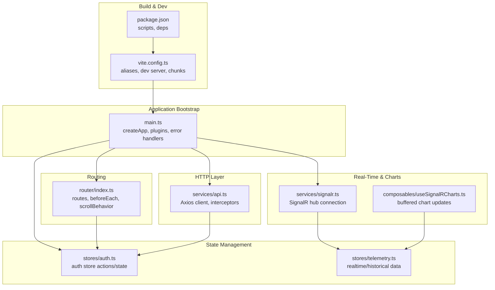

**Diagram sources**
- [main.ts](file://src/frontend/src/main.ts#L1-L35)
- [router/index.ts](file://src/frontend/src/router/index.ts#L1-L112)
- [stores/auth.ts](file://src/frontend/src/stores/auth.ts#L1-L508)
- [stores/telemetry.ts](file://src/frontend/src/stores/telemetry.ts#L1-L58)
- [services/signalr.ts](file://src/frontend/src/services/signalr.ts#L1-L271)
- [composables/useSignalRCharts.ts](file://src/frontend/src/composables/useSignalRCharts.ts#L1-L352)
- [services/api.ts](file://src/frontend/src/services/api.ts#L1-L96)
- [vite.config.ts](file://src/frontend/vite.config.ts#L1-L48)
- [package.json](file://src/frontend/package.json#L1-L44)

**Section sources**
- [main.ts](file://src/frontend/src/main.ts#L1-L35)
- [router/index.ts](file://src/frontend/src/router/index.ts#L1-L112)
- [vite.config.ts](file://src/frontend/vite.config.ts#L1-L48)
- [package.json](file://src/frontend/package.json#L1-L44)

## Core Components
- Application bootstrap and global setup: Initializes Vue app, installs Pinia, Vue Router, and global plugins; sets global error handlers and mounts the app.
- Router: Defines routes with lazy-loaded views, navigation guards, and dynamic page titles.
- Pinia stores: Centralized auth state, telemetry data, and other domain stores.
- SignalR service: Manages real-time connections, subscriptions, and event mapping.
- Composables: Encapsulate reusable logic for real-time charting with buffering and batching.
- API client: Axios instance with request/response interceptors, token refresh, and standardized error handling.
- Build system: Vite configuration with aliases, dev server proxy, and manual chunking.

**Section sources**
- [main.ts](file://src/frontend/src/main.ts#L1-L35)
- [router/index.ts](file://src/frontend/src/router/index.ts#L1-L112)
- [stores/auth.ts](file://src/frontend/src/stores/auth.ts#L1-L508)
- [services/signalr.ts](file://src/frontend/src/services/signalr.ts#L1-L271)
- [composables/useSignalRCharts.ts](file://src/frontend/src/composables/useSignalRCharts.ts#L1-L352)
- [services/api.ts](file://src/frontend/src/services/api.ts#L1-L96)
- [vite.config.ts](file://src/frontend/vite.config.ts#L1-L48)

## Architecture Overview
The application follows a layered architecture:
- Presentation layer: Vue components and views, with Router-driven navigation and lazy-loaded views.
- State layer: Pinia stores for auth, telemetry, and domain data.
- Service layer: API client with interceptors and SignalR service for real-time updates.
- Utility layer: Composables for cross-cutting concerns like real-time charting and error handling.

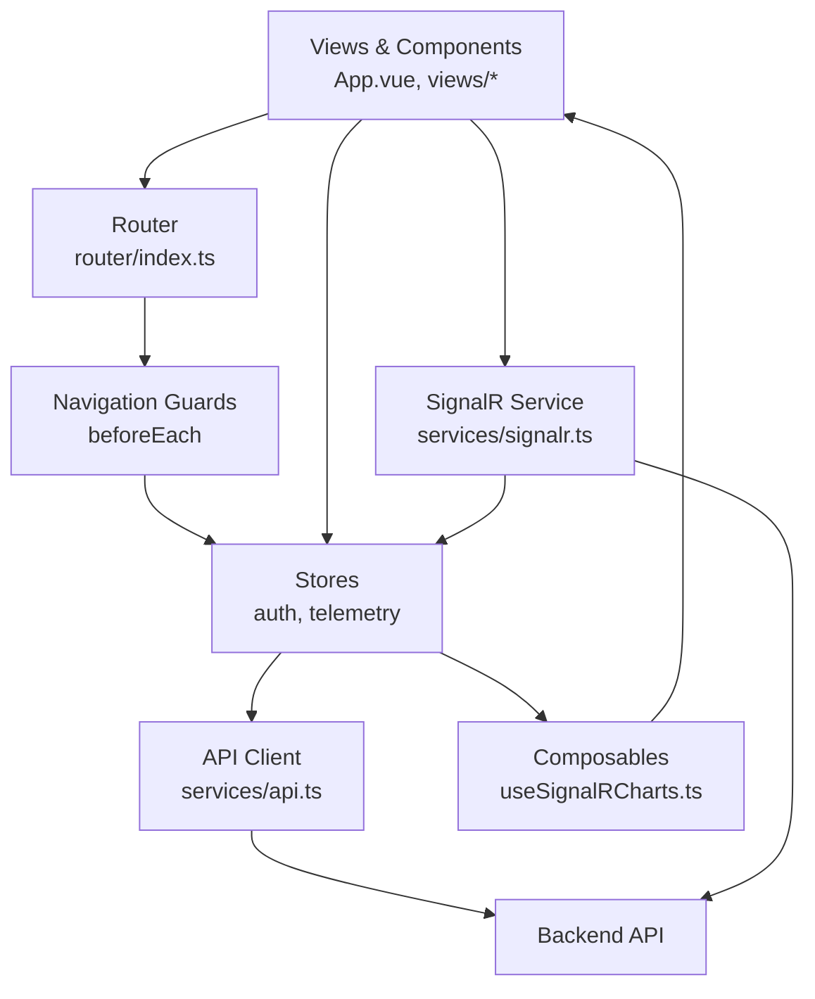

**Diagram sources**
- [App.vue](file://src/frontend/src/App.vue#L1-L277)
- [router/index.ts](file://src/frontend/src/router/index.ts#L1-L112)
- [stores/auth.ts](file://src/frontend/src/stores/auth.ts#L1-L508)
- [stores/telemetry.ts](file://src/frontend/src/stores/telemetry.ts#L1-L58)
- [services/api.ts](file://src/frontend/src/services/api.ts#L1-L96)
- [services/signalr.ts](file://src/frontend/src/services/signalr.ts#L1-L271)
- [composables/useSignalRCharts.ts](file://src/frontend/src/composables/useSignalRCharts.ts#L1-L352)

## Detailed Component Analysis

### Application Bootstrap and Initialization
The bootstrap process initializes the Vue application, installs global plugins, and mounts the app. It sets up Pinia for state management, registers Vue Router for navigation, integrates a charting library, and configures global error handling for both component errors and unhandled promise rejections.

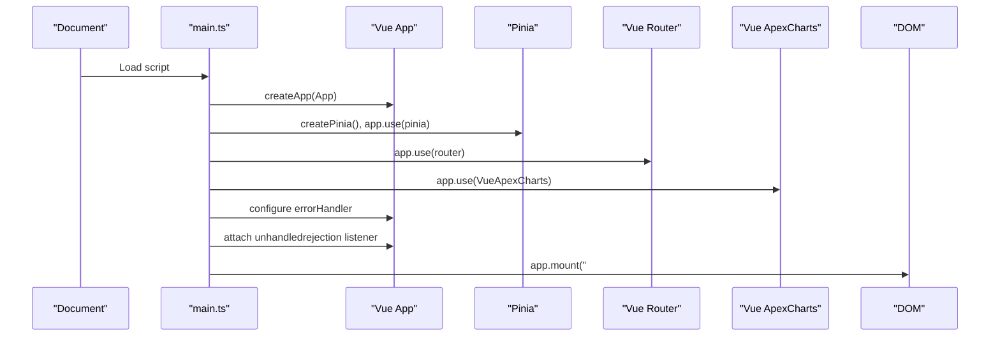

**Diagram sources**
- [main.ts](file://src/frontend/src/main.ts#L1-L35)

**Section sources**
- [main.ts](file://src/frontend/src/main.ts#L1-L35)

### Routing Configuration and Navigation Guards
The router defines routes with lazy-loaded views and navigation guards. Guards check authentication, enforce redirects, and dynamically set page titles. Scroll behavior restores previous positions when navigating back.

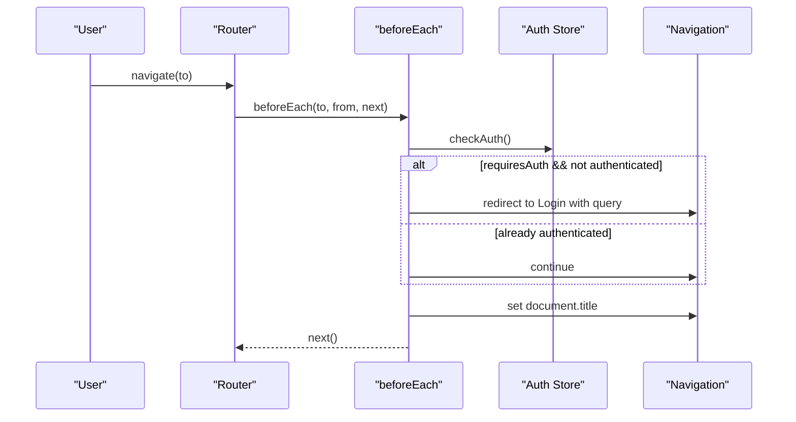

**Diagram sources**
- [router/index.ts](file://src/frontend/src/router/index.ts#L85-L109)
- [stores/auth.ts](file://src/frontend/src/stores/auth.ts#L212-L237)

**Section sources**
- [router/index.ts](file://src/frontend/src/router/index.ts#L1-L112)
- [stores/auth.ts](file://src/frontend/src/stores/auth.ts#L1-L508)

### Dependency Injection with Pinia
Pinia is installed globally and used to manage application state. The auth store encapsulates user session, tokens, and session monitoring. Stores are defined using the Composition API style for reactive state and actions.

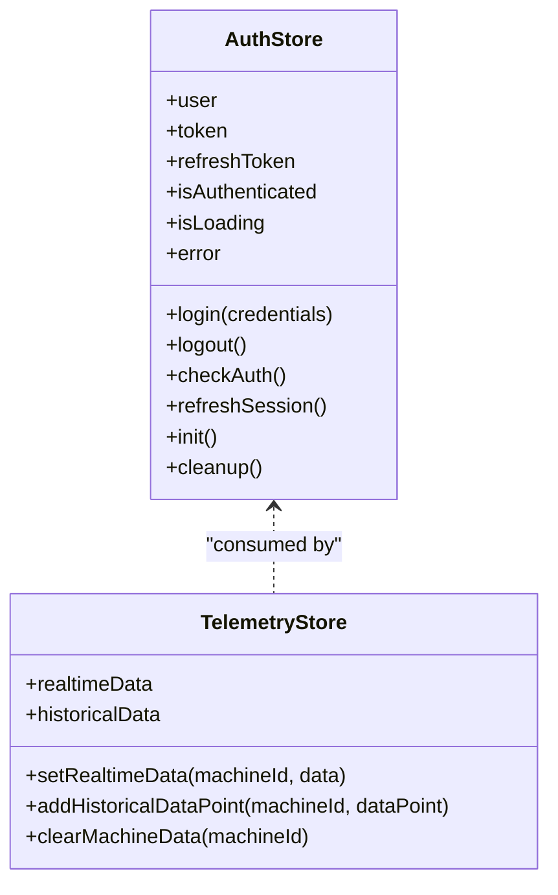

**Diagram sources**
- [stores/auth.ts](file://src/frontend/src/stores/auth.ts#L63-L507)
- [stores/telemetry.ts](file://src/frontend/src/stores/telemetry.ts#L5-L57)

**Section sources**
- [stores/auth.ts](file://src/frontend/src/stores/auth.ts#L1-L508)
- [stores/telemetry.ts](file://src/frontend/src/stores/telemetry.ts#L1-L58)

### Global Plugin Setup and Charting Integration
The application integrates a charting library globally during bootstrap. This enables chart components across the app without per-component imports.

**Section sources**
- [main.ts](file://src/frontend/src/main.ts#L19-L20)

### Component Hierarchy and Layout Management
The root component orchestrates layout selection, navigation, and user interactions. It conditionally renders either an auth layout or a full application layout with sidebar and mobile responsiveness. It initializes the auth store on mount and cleans up on unmount.

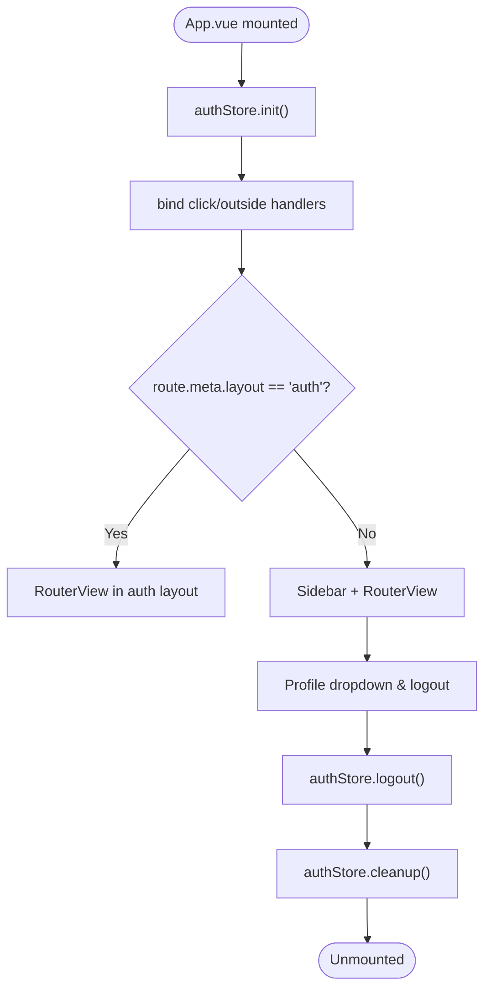

**Diagram sources**
- [App.vue](file://src/frontend/src/App.vue#L65-L75)
- [stores/auth.ts](file://src/frontend/src/stores/auth.ts#L449-L469)

**Section sources**
- [App.vue](file://src/frontend/src/App.vue#L1-L277)
- [stores/auth.ts](file://src/frontend/src/stores/auth.ts#L1-L508)

### Composables Pattern and Real-Time Charting
The composable pattern centralizes real-time charting logic with buffering and batching to optimize performance. It subscribes to SignalR updates, buffers incoming telemetry, trims data to limits, and exposes computed chart series.

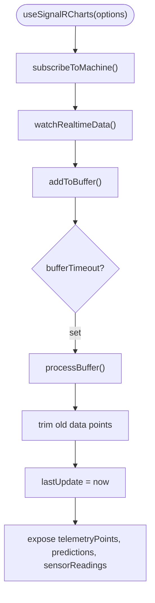

**Diagram sources**
- [composables/useSignalRCharts.ts](file://src/frontend/src/composables/useSignalRCharts.ts#L26-L134)
- [composables/useSignalRCharts.ts](file://src/frontend/src/composables/useSignalRCharts.ts#L147-L164)
- [composables/useSignalRCharts.ts](file://src/frontend/src/composables/useSignalRCharts.ts#L249-L276)

**Section sources**
- [composables/useSignalRCharts.ts](file://src/frontend/src/composables/useSignalRCharts.ts#L1-L352)

### Application Initialization Sequence
The initialization sequence ties together bootstrap, router guards, and store lifecycle:

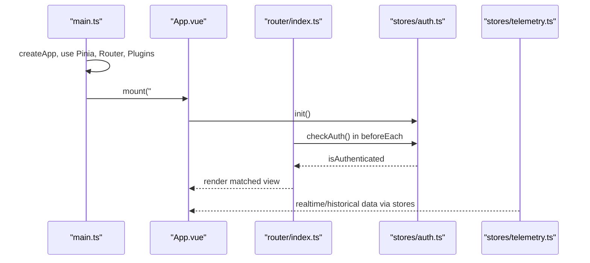

**Diagram sources**
- [main.ts](file://src/frontend/src/main.ts#L10-L35)
- [App.vue](file://src/frontend/src/App.vue#L65-L75)
- [router/index.ts](file://src/frontend/src/router/index.ts#L85-L109)
- [stores/auth.ts](file://src/frontend/src/stores/auth.ts#L449-L460)
- [stores/telemetry.ts](file://src/frontend/src/stores/telemetry.ts#L1-L58)

**Section sources**
- [main.ts](file://src/frontend/src/main.ts#L1-L35)
- [App.vue](file://src/frontend/src/App.vue#L1-L277)
- [router/index.ts](file://src/frontend/src/router/index.ts#L1-L112)
- [stores/auth.ts](file://src/frontend/src/stores/auth.ts#L1-L508)
- [stores/telemetry.ts](file://src/frontend/src/stores/telemetry.ts#L1-L58)

### Global Error Handling Mechanisms
The application implements global error handling at multiple levels:
- Vue app error handler captures component errors.
- Unhandled promise rejection handler logs and surfaces uncaught async errors.
- API client interceptor centralizes HTTP error handling and token refresh.
- UI-level error utilities standardize user-facing messages for API errors.

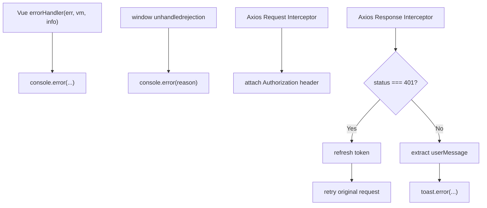

**Diagram sources**
- [main.ts](file://src/frontend/src/main.ts#L22-L32)
- [services/api.ts](file://src/frontend/src/services/api.ts#L15-L71)
- [ui/digital-twin-dashboard/src/utils/errorHandler.ts](file://src/ui/digital-twin-dashboard/src/utils/errorHandler.ts#L42-L95)

**Section sources**
- [main.ts](file://src/frontend/src/main.ts#L22-L32)
- [services/api.ts](file://src/frontend/src/services/api.ts#L1-L96)
- [ui/digital-twin-dashboard/src/utils/errorHandler.ts](file://src/ui/digital-twin-dashboard/src/utils/errorHandler.ts#L1-L129)

### Real-Time Data Pipeline with SignalR
The SignalR service manages connections, subscriptions, and event mapping. It emits events consumed by stores, which expose data to composables and components.

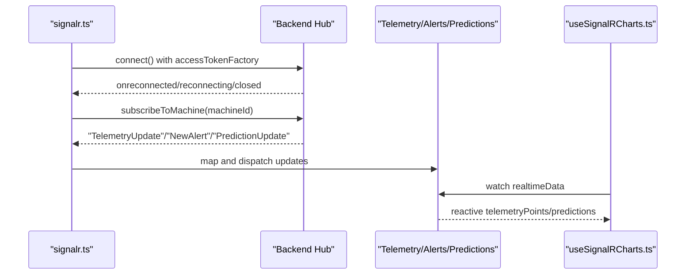

**Diagram sources**
- [services/signalr.ts](file://src/frontend/src/services/signalr.ts#L55-L110)
- [services/signalr.ts](file://src/frontend/src/services/signalr.ts#L148-L204)
- [stores/telemetry.ts](file://src/frontend/src/stores/telemetry.ts#L11-L14)
- [composables/useSignalRCharts.ts](file://src/frontend/src/composables/useSignalRCharts.ts#L147-L164)

**Section sources**
- [services/signalr.ts](file://src/frontend/src/services/signalr.ts#L1-L271)
- [stores/telemetry.ts](file://src/frontend/src/stores/telemetry.ts#L1-L58)
- [composables/useSignalRCharts.ts](file://src/frontend/src/composables/useSignalRCharts.ts#L1-L352)

## Dependency Analysis
The application leverages a cohesive set of libraries:
- Vue 3 ecosystem: Vue, Vue Router, Pinia
- HTTP: Axios with interceptors
- Real-time: SignalR client
- UI: ApexCharts + Vue integration
- Utilities: date-fns, lodash-es
- Build: Vite with Vue plugin and TypeScript support

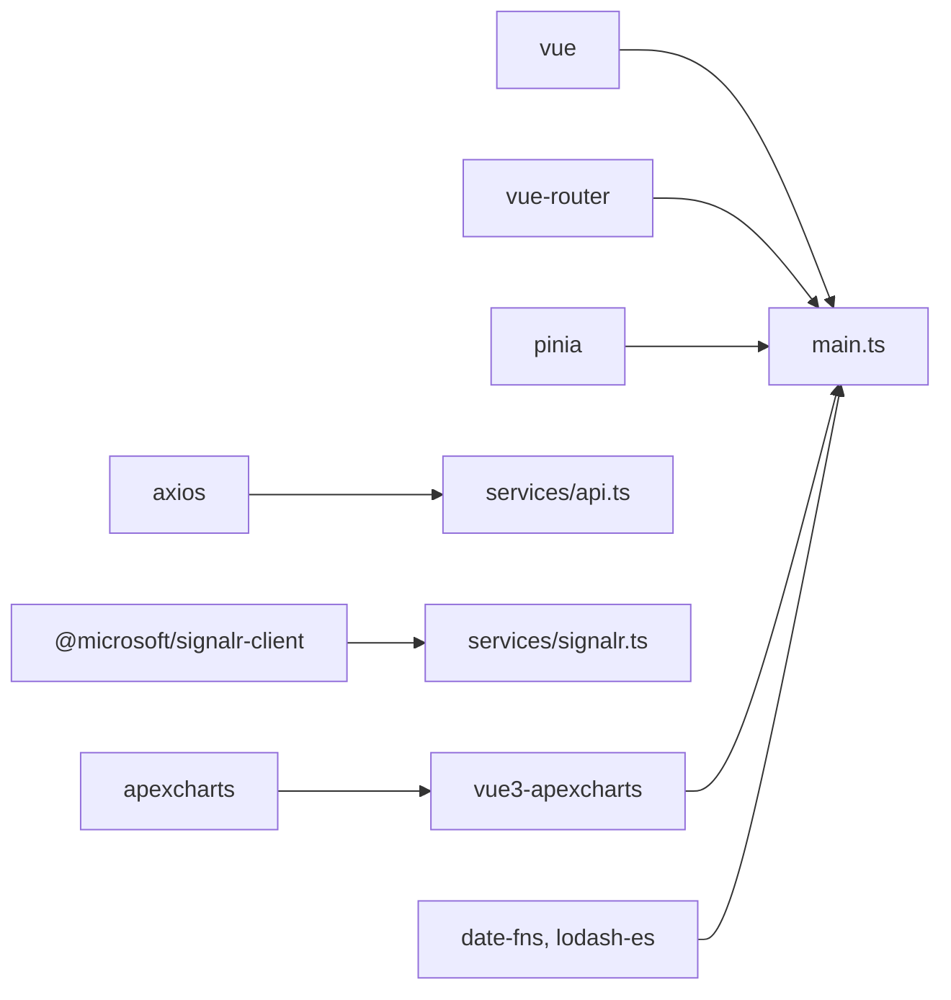

**Diagram sources**
- [package.json](file://src/frontend/package.json#L14-L27)
- [main.ts](file://src/frontend/src/main.ts#L1-L35)
- [services/api.ts](file://src/frontend/src/services/api.ts#L1-L96)
- [services/signalr.ts](file://src/frontend/src/services/signalr.ts#L1-L7)
- [vite.config.ts](file://src/frontend/vite.config.ts#L1-L48)

**Section sources**
- [package.json](file://src/frontend/package.json#L1-L44)
- [vite.config.ts](file://src/frontend/vite.config.ts#L1-L48)

## Performance Considerations
- Lazy loading: Routes use dynamic imports for on-demand loading of views.
- Chunk splitting: Vite manualChunks separate vendor libraries, charts, and utilities.
- Real-time buffering: Composables buffer and batch updates to limit render frequency.
- Data trimming: Stores cap historical data sizes to prevent memory growth.
- Automatic reconnect: SignalR service uses exponential backoff to maintain connectivity.

**Section sources**
- [router/index.ts](file://src/frontend/src/router/index.ts#L11-L11)
- [vite.config.ts](file://src/frontend/vite.config.ts#L39-L44)
- [composables/useSignalRCharts.ts](file://src/frontend/src/composables/useSignalRCharts.ts#L13-L17)
- [stores/telemetry.ts](file://src/frontend/src/stores/telemetry.ts#L22-L24)
- [services/signalr.ts](file://src/frontend/src/services/signalr.ts#L66-L66)

## Troubleshooting Guide
Common issues and remedies:
- Authentication failures: Verify token presence and refresh flow; ensure interceptors attach Authorization headers.
- Real-time disconnections: Check SignalR connection state and automatic reconnect logs; confirm backend hub availability.
- API errors: Inspect userMessage propagation and UI toast feedback; review backend error codes and validation errors.
- Build issues: Confirm Vite aliases and dev server proxy targets; validate environment variables for API and hub URLs.

**Section sources**
- [services/api.ts](file://src/frontend/src/services/api.ts#L35-L71)
- [services/signalr.ts](file://src/frontend/src/services/signalr.ts#L70-L91)
- [ui/digital-twin-dashboard/src/utils/errorHandler.ts](file://src/ui/digital-twin-dashboard/src/utils/errorHandler.ts#L42-L95)
- [vite.config.ts](file://src/frontend/vite.config.ts#L18-L33)

## Conclusion
The Vue.js application employs a clean, modular architecture with clear separation of concerns. Pinia manages application state, Vue Router handles navigation with lazy loading, and SignalR powers real-time telemetry. The composable pattern encapsulates complex logic, while the API client centralizes HTTP concerns and error handling. The build system optimizes performance through chunking and development ergonomics via Vite and TypeScript.