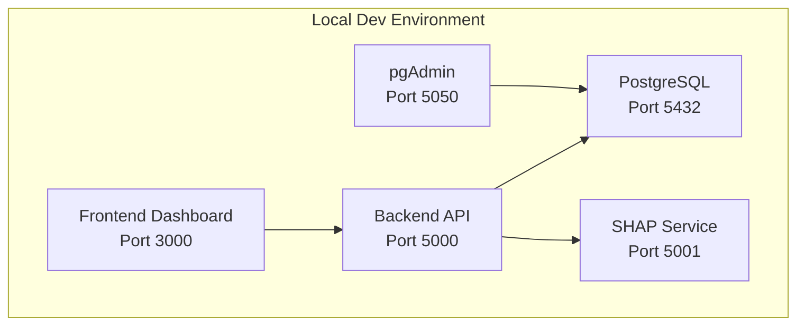
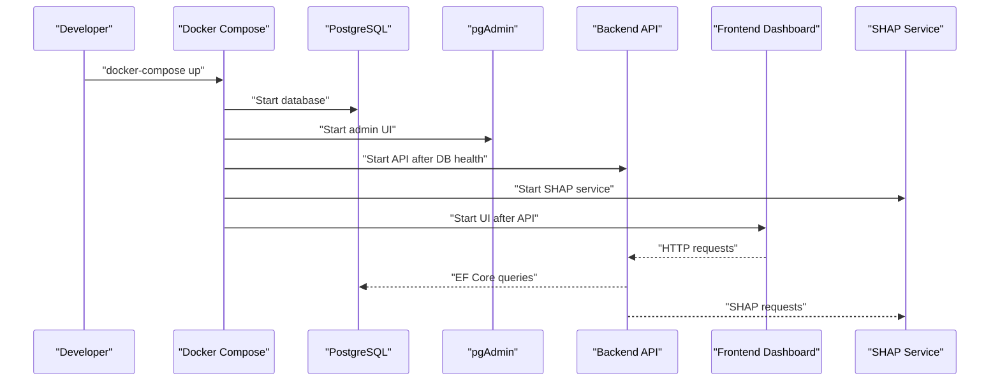
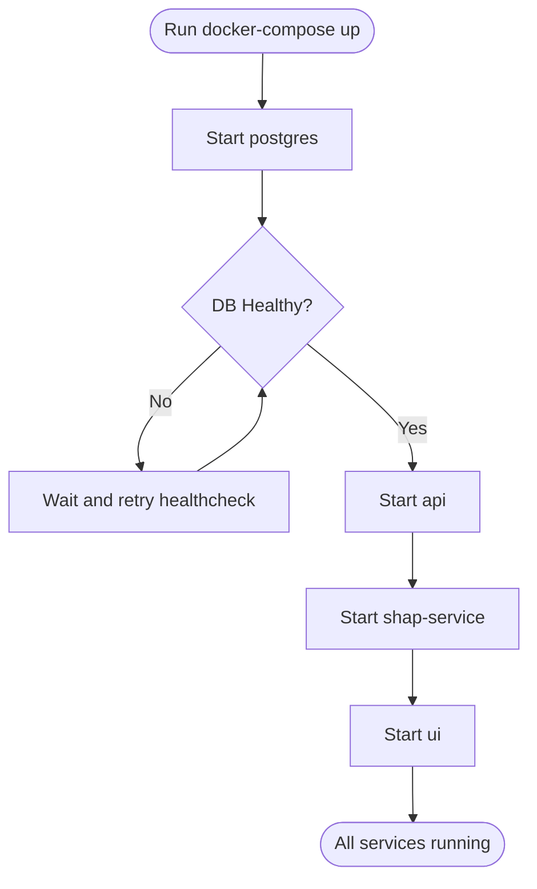
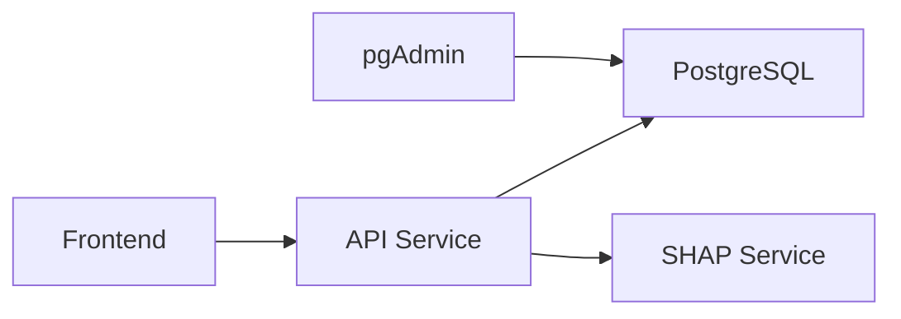

# Getting Started

<cite>
**Referenced Files in This Document**
- [docker-compose.yml](file://docker-compose.yml)
- [Dockerfile.api](file://Dockerfile.api)
- [Dockerfile.ui](file://Dockerfile.ui)
- [appsettings.json](file://src/api/DigitalTwinPlatform.API/appsettings.json)
- [appsettings.Development.json](file://src/api/DigitalTwinPlatform.API/appsettings.Development.json)
- [package.json (frontend)](file://src/frontend/package.json)
- [package.json (dashboard)](file://src/ui/digital-twin-dashboard/package.json)
- [Dockerfile.prod (dashboard)](file://src/ui/digital-twin-dashboard/Dockerfile.prod)
- [main.tf](file://infrastructure/main.tf)
- [ARCHITECTURE.md](file://docs/ARCHITECTURE.md)
- [backup-automation.sh](file://scripts/backup-automation.sh)
- [services/shap-service/Dockerfile](file://services/shap-service/Dockerfile)
- [services/shap-service/app.py](file://services/shap-service/app.py)
- [services/shap-service/requirements.txt](file://services/shap-service/requirements.txt)
</cite>

## Table of Contents
1. [Introduction](#introduction)
2. [Project Structure](#project-structure)
3. [Core Components](#core-components)
4. [Architecture Overview](#architecture-overview)
5. [Detailed Component Analysis](#detailed-component-analysis)
6. [Dependency Analysis](#dependency-analysis)
7. [Performance Considerations](#performance-considerations)
8. [Troubleshooting Guide](#troubleshooting-guide)
9. [Conclusion](#conclusion)
10. [Appendices](#appendices)

## Introduction
This guide helps you set up the Digital Twin Platform development environment locally using Docker Compose. You will configure the database, build and run the backend API, launch the frontend dashboard, and connect the SHAP service for explainable AI. It also covers environment variables, configuration options, and initial verification steps to ensure everything is working.

## Project Structure
The platform consists of:
- Backend API (ASP.NET Core)
- Frontend dashboard (Vue 3)
- PostgreSQL database with pgAdmin
- SHAP service (Python/Flask) for ML explanations
- Optional infrastructure-as-code (Terraform) for cloud deployments

**Diagram sources**
- [docker-compose.yml](file://docker-compose.yml#L1-L81)

**Section sources**
- [docker-compose.yml](file://docker-compose.yml#L1-L81)
- [ARCHITECTURE.md](file://docs/ARCHITECTURE.md#L1-L50)

## Core Components
- Backend API: ASP.NET Core web API with controllers, services, and persistence. It connects to PostgreSQL and integrates with the SHAP service for XAI.
- Frontend Dashboard: Vue 3 application with TypeScript, real-time charts, and SignalR integration.
- Database: PostgreSQL with pgAdmin for administration.
- SHAP Service: Python service exposing endpoints to compute SHAP values for ML models.
- Configuration: JSON appsettings for environment-specific settings and feature toggles.

**Section sources**
- [Dockerfile.api](file://Dockerfile.api#L1-L74)
- [Dockerfile.ui](file://Dockerfile.ui#L1-L200)
- [appsettings.json](file://src/api/DigitalTwinPlatform.API/appsettings.json#L1-L93)
- [appsettings.Development.json](file://src/api/DigitalTwinPlatform.API/appsettings.Development.json#L1-L71)
- [services/shap-service/Dockerfile](file://services/shap-service/Dockerfile#L1-L27)
- [services/shap-service/app.py](file://services/shap-service/app.py#L1-L161)

## Architecture Overview
The development stack runs entirely in Docker Compose with explicit ports and inter-service networking. The API depends on a healthy database before starting, and the UI depends on the API.

**Diagram sources**
- [docker-compose.yml](file://docker-compose.yml#L1-L81)

## Detailed Component Analysis

### System Requirements and Prerequisites
- Operating systems: Windows, macOS, or Linux with Docker Desktop installed.
- Docker Desktop: Ensure Docker Engine and Docker Compose v2+ are available.
- Ports availability: 3000 (UI), 5000 (API), 5001 (SHAP), 5432 (PostgreSQL), 5050 (pgAdmin).
- Node.js: Required for building the frontend (see package.json engines).
- Python: Required for the SHAP service runtime (see requirements.txt).

**Section sources**
- [package.json (frontend)](file://src/frontend/package.json#L41-L44)
- [package.json (dashboard)](file://src/ui/digital-twin-dashboard/package.json#L6-L9)
- [services/shap-service/requirements.txt](file://services/shap-service/requirements.txt#L1-L7)

### Installation Procedures

#### Step 1: Clone and Prepare
- Clone the repository and navigate to the project root.
- Ensure Docker Desktop is running.

#### Step 2: Configure Environment Variables
- The API reads configuration from appsettings files. For local development, the Development settings override defaults.
- Key environment variables set in Compose:
  - ASPNETCORE_ENVIRONMENT
  - ConnectionStrings:DefaultConnection
- The API also reads environment variables for runtime overrides (e.g., ASPNETCORE_URLS).

**Section sources**
- [docker-compose.yml](file://docker-compose.yml#L42-L48)
- [appsettings.Development.json](file://src/api/DigitalTwinPlatform.API/appsettings.Development.json#L1-L71)
- [Dockerfile.api](file://Dockerfile.api#L69-L70)

#### Step 3: Build and Run Services
- Bring up the stack with Docker Compose:
  - docker-compose up
- Services:
  - postgres: PostgreSQL 15 with healthcheck.
  - pgadmin: Web-based admin UI.
  - api: ASP.NET Core API.
  - ui: Vue 3 frontend.
  - shap-service: Python/Flask service for SHAP.

**Diagram sources**
- [docker-compose.yml](file://docker-compose.yml#L39-L60)

**Section sources**
- [docker-compose.yml](file://docker-compose.yml#L1-L81)

#### Step 4: Access the Dashboard
- Open http://localhost:3000 in your browser.
- The UI communicates with the API at http://localhost:5000.
- If CORS is required during development, allowed origins are configured in Development settings.

**Section sources**
- [appsettings.Development.json](file://src/api/DigitalTwinPlatform.API/appsettings.Development.json#L25-L31)

#### Step 5: Initial Configuration
- Database: The API expects a database named per appsettings. The Development settings define a local connection string and optional Redis connection.
- JWT: Keys and expiration are configured for development.
- SHAP Service: Base URL is configured in appsettings; Compose exposes port 5001.

**Section sources**
- [appsettings.json](file://src/api/DigitalTwinPlatform.API/appsettings.json#L1-L93)
- [appsettings.Development.json](file://src/api/DigitalTwinPlatform.API/appsettings.Development.json#L9-L23)

### Running Locally Without Docker (Optional)
- Backend API:
  - Use the SDK-based Dockerfile for local builds and runs.
  - Set ASPNETCORE_URLS and ASPNETCORE_ENVIRONMENT accordingly.
- Frontend:
  - Install dependencies using Node.js as specified in package.json.
  - Run the dev server and ensure the API is reachable at the configured base URL.

**Section sources**
- [Dockerfile.api](file://Dockerfile.api#L1-L28)
- [package.json (frontend)](file://src/frontend/package.json#L7-L12)

### Database Initialization
- The API uses Entity Framework Core migrations. During first run, the database will be initialized based on the current migration snapshot.
- To reset or reinitialize, remove the PostgreSQL data volume and restart the stack.

**Section sources**
- [docker-compose.yml](file://docker-compose.yml#L11-L12)

### Dependency Installation
- Backend API: Built in a multi-stage Dockerfile; dependencies restored and published as part of the build.
- Frontend: Dependencies declared in package.json; install with your preferred package manager.
- SHAP Service: Python dependencies pinned in requirements.txt.

**Section sources**
- [Dockerfile.api](file://Dockerfile.api#L13-L51)
- [package.json (frontend)](file://src/frontend/package.json#L14-L40)
- [services/shap-service/requirements.txt](file://services/shap-service/requirements.txt#L1-L7)

### Environment Variables and Configuration Options
- ASP.NET Core:
  - ASPNETCORE_ENVIRONMENT: Development or Production.
  - ASPNETCORE_URLS: Port binding for the API.
- Database:
  - ConnectionStrings:DefaultConnection: Host, Port, Database, Username, Password.
- JWT:
  - Key, Issuer, Audience, ExpiryInMinutes.
- ML and Simulation:
  - Paths to models, thresholds, and feature weights.
- SignalR and Azure:
  - UseAzure, AzureConnectionString, RedisConnection.
- SHAP Service:
  - BaseUrl, TimeoutSeconds, Enabled.

**Section sources**
- [docker-compose.yml](file://docker-compose.yml#L42-L48)
- [Dockerfile.api](file://Dockerfile.api#L69-L70)
- [appsettings.json](file://src/api/DigitalTwinPlatform.API/appsettings.json#L1-L93)
- [appsettings.Development.json](file://src/api/DigitalTwinPlatform.API/appsettings.Development.json#L9-L71)

### Deployment Considerations
- Production images:
  - Backend API: Multi-stage Alpine-based image with trimming and single-file publishing.
  - Frontend: Nginx-based production image with health checks.
- Terraform:
  - Infrastructure provisioning for AWS (EKS, RDS, ElastiCache, S3, CloudFront) is available for cloud deployments.

**Section sources**
- [Dockerfile.api](file://Dockerfile.api#L54-L74)
- [Dockerfile.prod (dashboard)](file://src/ui/digital-twin-dashboard/Dockerfile.prod#L1-L62)
- [main.tf](file://infrastructure/main.tf#L1-L493)

## Dependency Analysis

**Diagram sources**
- [docker-compose.yml](file://docker-compose.yml#L1-L81)

**Section sources**
- [docker-compose.yml](file://docker-compose.yml#L1-L81)

## Performance Considerations
- Container resource limits: Adjust CPU/memory in Compose if needed.
- API startup dependencies: The API waits for the database to be healthy before starting.
- Frontend build: Use production builds for performance-sensitive environments.
- SHAP service: Uses gunicorn for concurrency; tune workers and timeouts as needed.

[No sources needed since this section provides general guidance]

## Troubleshooting Guide

### Common Setup Issues
- Port conflicts:
  - Ensure ports 3000, 5000, 5001, 5432, 5050 are free.
- Database not ready:
  - The API waits for the database to pass its healthcheck. Check the postgres service logs.
- UI cannot connect to API:
  - Confirm the API is reachable at http://localhost:5000 and CORS settings allow the UI origin.
- SHAP service errors:
  - Verify the SHAP service is healthy and the model path exists in the mounted models directory.
- pgAdmin cannot connect:
  - Use the configured credentials and ensure the database container is running.

**Section sources**
- [docker-compose.yml](file://docker-compose.yml#L15-L19)
- [docker-compose.yml](file://docker-compose.yml#L39-L48)
- [docker-compose.yml](file://docker-compose.yml#L67-L74)
- [services/shap-service/Dockerfile](file://services/shap-service/Dockerfile#L21-L23)

### Verification Steps
- Health checks:
  - API: curl http://localhost:5000/api/health
  - SHAP: curl http://localhost:5001/health
  - UI: curl http://localhost:3000
- Database:
  - Connect via pgAdmin at http://localhost:5050 using the configured credentials.
- First-time usage:
  - Log in to the dashboard, navigate to Machines and Predictions to confirm data loading.
  - Trigger a prediction and verify SHAP explanations appear.

**Section sources**
- [Dockerfile.api](file://Dockerfile.api#L63-L65)
- [services/shap-service/app.py](file://services/shap-service/app.py#L45-L48)

## Conclusion
You now have a fully functional local development environment for the Digital Twin Platform. The stack includes the backend API, frontend dashboard, PostgreSQL database, pgAdmin, and the SHAP service. Use the verification steps to confirm a successful setup, and refer to the configuration sections for environment customization.

[No sources needed since this section summarizes without analyzing specific files]

## Appendices

### Practical Examples of First-Time Usage Scenarios
- Explore Machines:
  - Navigate to the Machines view and review telemetry charts.
- Generate Predictions:
  - Open a machine detail and trigger a prediction; observe confidence bands and RUL.
- Review Alerts:
  - Check the Alerts panel for generated notifications.
- SHAP Explanations:
  - Select a prediction and review feature contributions to understand risk factors.

[No sources needed since this section provides general guidance]

### Backup Automation Script
- The repository includes a comprehensive backup automation script for PostgreSQL, application volumes, filesystem, encryption, and cloud upload.
- Customize configuration via backup.conf and schedule automated runs.

**Section sources**
- [backup-automation.sh](file://scripts/backup-automation.sh#L1-L251)