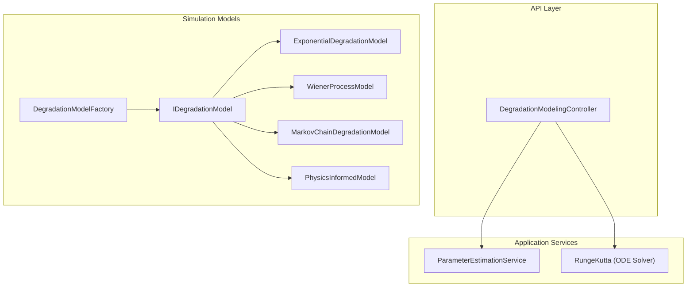
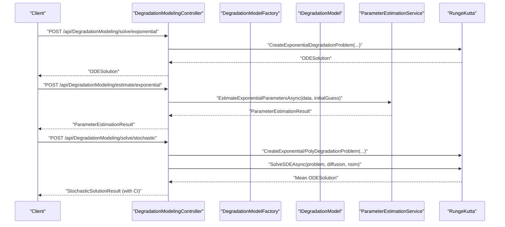
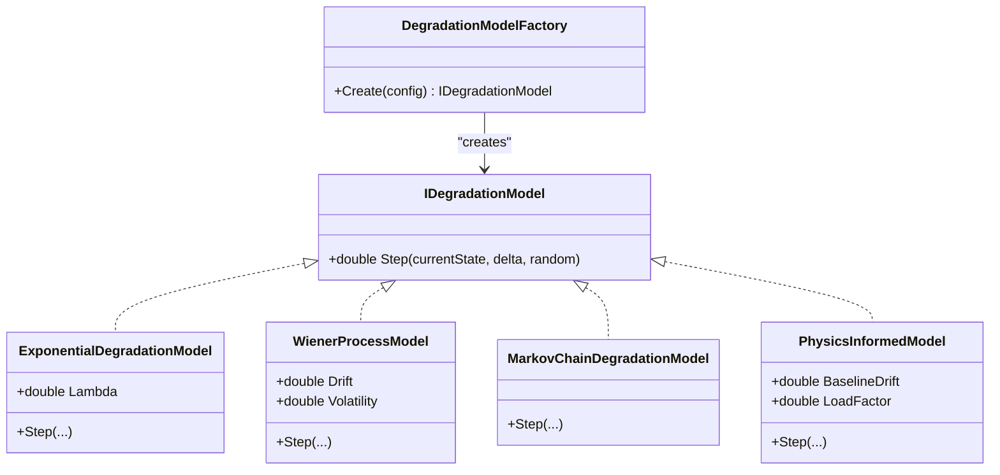
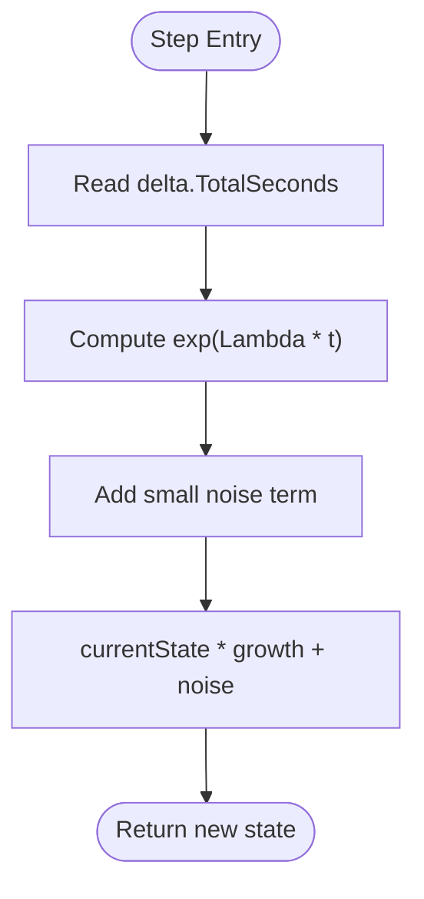
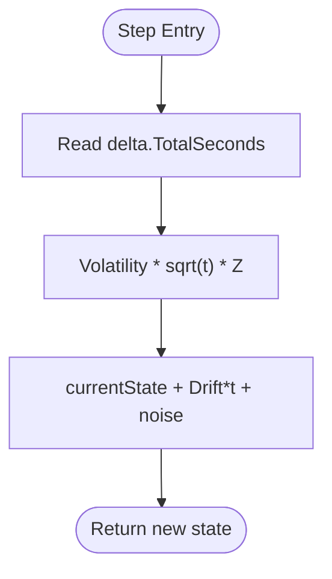
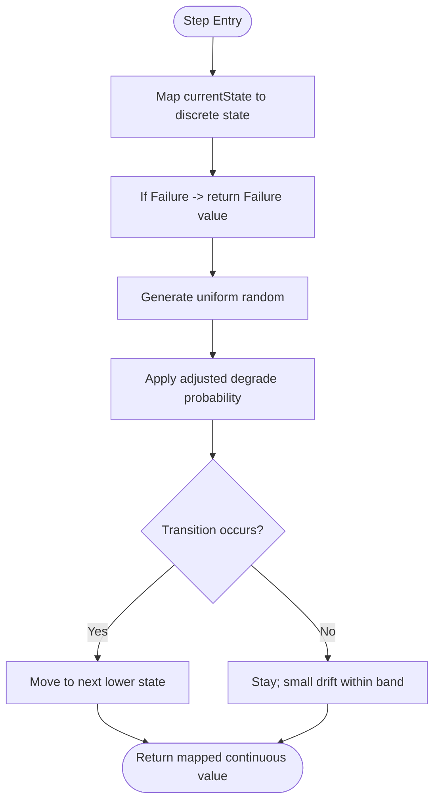
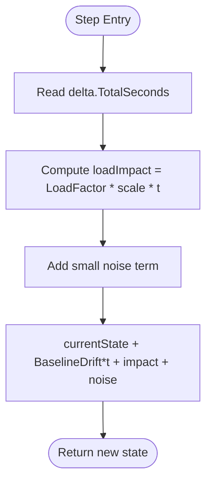
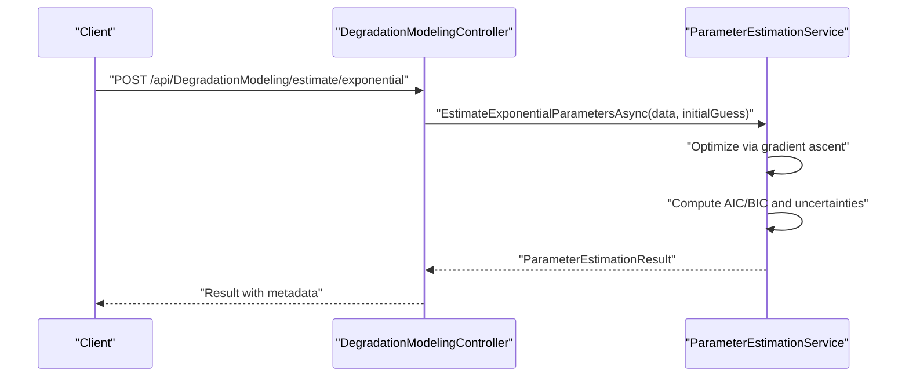
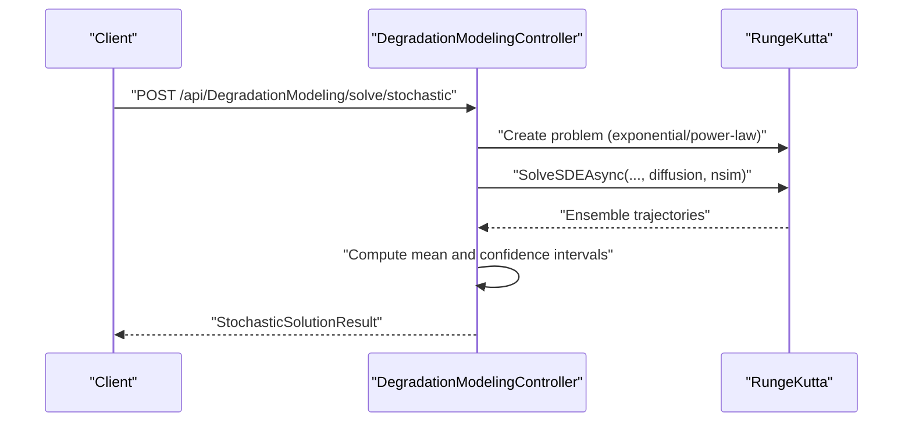
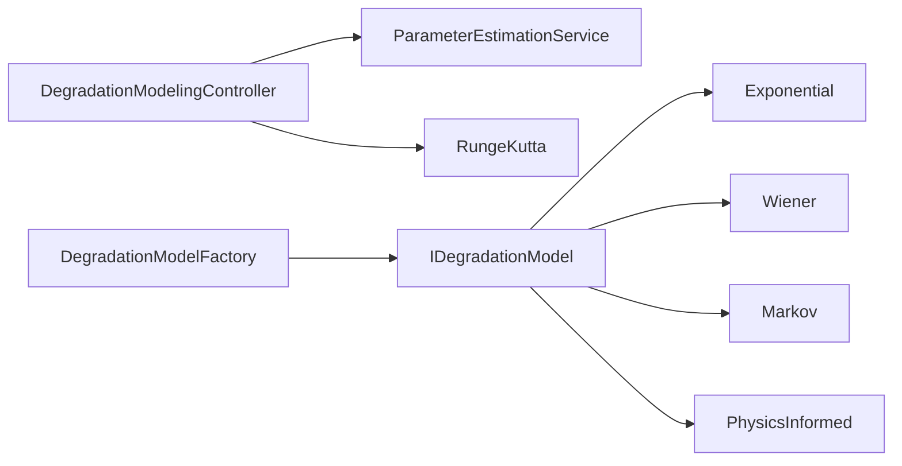

# Degradation Model Types and Parameters

<cite>
**Referenced Files in This Document**
- [DegradationModelingController.cs](file://src/api/DigitalTwinPlatform.API/Controllers/DegradationModelingController.cs)
- [IDegradationModel.cs](file://src/api/DigitalTwinPlatform.API/Services/Simulation/DegradationModels/IDegradationModel.cs)
- [DegradationModelFactory.cs](file://src/api/DigitalTwinPlatform.API/Services/Simulation/DegradationModels/DegradationModelFactory.cs)
- [ExponentialDegradationModel.cs](file://src/api/DigitalTwinPlatform.API/Services/Simulation/DegradationModels/ExponentialDegradationModel.cs)
- [WienerProcessModel.cs](file://src/api/DigitalTwinPlatform.API/Services/Simulation/DegradationModels/WienerProcessModel.cs)
- [MarkovChainDegradationModel.cs](file://src/api/DigitalTwinPlatform.API/Services/Simulation/DegradationModels/MarkovChainDegradationModel.cs)
- [PhysicsInformedModel.cs](file://src/api/DigitalTwinPlatform.API/Services/Simulation/DegradationModels/PhysicsInformedModel.cs)
- [ParameterEstimationService.cs](file://src/api/DigitalTwinPlatform.Application/Services/ParameterEstimationService.cs)
- [RungeKutta.cs](file://src/api/DigitalTwinPlatform.Application/Mathematics/RungeKutta.cs)
- [MATH_MODELS.md](file://docs/MATH_MODELS.md)
</cite>

## Table of Contents
1. [Introduction](#introduction)
2. [Project Structure](#project-structure)
3. [Core Components](#core-components)
4. [Architecture Overview](#architecture-overview)
5. [Detailed Component Analysis](#detailed-component-analysis)
6. [Dependency Analysis](#dependency-analysis)
7. [Performance Considerations](#performance-considerations)
8. [Troubleshooting Guide](#troubleshooting-guide)
9. [Conclusion](#conclusion)
10. [Appendices](#appendices)

## Introduction
This document describes the degradation model types and parameters implemented in the platform, focusing on the factory pattern for model instantiation, the supported model families (exponential, Wiener processes, Markov chains, and physics-informed surrogate models), and the configuration interfaces. It also covers parameter estimation, calibration, uncertainty quantification, validation metrics, and model selection criteria grounded in the repository’s implementation.

## Project Structure
The degradation modeling capability spans API controllers, domain services, and simulation components:
- API layer exposes endpoints for solving deterministic and stochastic degradation models, estimating parameters, validating solutions, and comparing models.
- Simulation layer defines the model interface and concrete implementations for discrete-time degradation stepping.
- Application services implement parameter estimation, model comparison, and validation using numerical ODE/SDE solvers.

**Diagram sources**
- [DegradationModelingController.cs](file://src/api/DigitalTwinPlatform.API/Controllers/DegradationModelingController.cs#L1-L472)
- [ParameterEstimationService.cs](file://src/api/DigitalTwinPlatform.Application/Services/ParameterEstimationService.cs#L1-L625)
- [RungeKutta.cs](file://src/api/DigitalTwinPlatform.Application/Mathematics/RungeKutta.cs#L1-L250)
- [IDegradationModel.cs](file://src/api/DigitalTwinPlatform.API/Services/Simulation/DegradationModels/IDegradationModel.cs#L1-L7)
- [DegradationModelFactory.cs](file://src/api/DigitalTwinPlatform.API/Services/Simulation/DegradationModels/DegradationModelFactory.cs#L1-L84)
- [ExponentialDegradationModel.cs](file://src/api/DigitalTwinPlatform.API/Services/Simulation/DegradationModels/ExponentialDegradationModel.cs#L1-L16)
- [WienerProcessModel.cs](file://src/api/DigitalTwinPlatform.API/Services/Simulation/DegradationModels/WienerProcessModel.cs#L1-L23)
- [MarkovChainDegradationModel.cs](file://src/api/DigitalTwinPlatform.API/Services/Simulation/DegradationModels/MarkovChainDegradationModel.cs#L1-L81)
- [PhysicsInformedModel.cs](file://src/api/DigitalTwinPlatform.API/Services/Simulation/DegradationModels/PhysicsInformedModel.cs#L1-L16)

**Section sources**
- [DegradationModelingController.cs](file://src/api/DigitalTwinPlatform.API/Controllers/DegradationModelingController.cs#L1-L472)
- [ParameterEstimationService.cs](file://src/api/DigitalTwinPlatform.Application/Services/ParameterEstimationService.cs#L1-L625)
- [RungeKutta.cs](file://src/api/DigitalTwinPlatform.Application/Mathematics/RungeKutta.cs#L1-L250)
- [IDegradationModel.cs](file://src/api/DigitalTwinPlatform.API/Services/Simulation/DegradationModels/IDegradationModel.cs#L1-L7)
- [DegradationModelFactory.cs](file://src/api/DigitalTwinPlatform.API/Services/Simulation/DegradationModels/DegradationModelFactory.cs#L1-L84)
- [ExponentialDegradationModel.cs](file://src/api/DigitalTwinPlatform.API/Services/Simulation/DegradationModels/ExponentialDegradationModel.cs#L1-L16)
- [WienerProcessModel.cs](file://src/api/DigitalTwinPlatform.API/Services/Simulation/DegradationModels/WienerProcessModel.cs#L1-L23)
- [MarkovChainDegradationModel.cs](file://src/api/DigitalTwinPlatform.API/Services/Simulation/DegradationModels/MarkovChainDegradationModel.cs#L1-L81)
- [PhysicsInformedModel.cs](file://src/api/DigitalTwinPlatform.API/Services/Simulation/DegradationModels/PhysicsInformedModel.cs#L1-L16)

## Core Components
- Factory pattern for model instantiation: A factory accepts a configuration object and returns a concrete degradation model implementing a shared interface. Supported model types include Wiener process, exponential, Markov chain, and physics-informed models.
- Discrete-time stepping models: Each model implements a single-step method that advances a scalar health or state variable given a time increment and a random source.
- Parameter estimation service: Provides maximum likelihood estimation, model comparison via information criteria, and parameter validation via cross-validation. It also computes parameter uncertainties.
- ODE solver integration: Deterministic models are integrated using a Runge-Kutta 4th order solver; stochastic models are simulated with Monte Carlo and confidence intervals computed from ensembles.

**Section sources**
- [DegradationModelFactory.cs](file://src/api/DigitalTwinPlatform.API/Services/Simulation/DegradationModels/DegradationModelFactory.cs#L1-L84)
- [IDegradationModel.cs](file://src/api/DigitalTwinPlatform.API/Services/Simulation/DegradationModels/IDegradationModel.cs#L1-L7)
- [ExponentialDegradationModel.cs](file://src/api/DigitalTwinPlatform.API/Services/Simulation/DegradationModels/ExponentialDegradationModel.cs#L1-L16)
- [WienerProcessModel.cs](file://src/api/DigitalTwinPlatform.API/Services/Simulation/DegradationModels/WienerProcessModel.cs#L1-L23)
- [MarkovChainDegradationModel.cs](file://src/api/DigitalTwinPlatform.API/Services/Simulation/DegradationModels/MarkovChainDegradationModel.cs#L1-L81)
- [PhysicsInformedModel.cs](file://src/api/DigitalTwinPlatform.API/Services/Simulation/DegradationModels/PhysicsInformedModel.cs#L1-L16)
- [ParameterEstimationService.cs](file://src/api/DigitalTwinPlatform.Application/Services/ParameterEstimationService.cs#L1-L625)
- [RungeKutta.cs](file://src/api/DigitalTwinPlatform.Application/Mathematics/RungeKutta.cs#L1-L250)

## Architecture Overview
The degradation modeling pipeline integrates configuration-driven model creation, numerical solving for deterministic models, and stochastic simulation with uncertainty quantification.

**Diagram sources**
- [DegradationModelingController.cs](file://src/api/DigitalTwinPlatform.API/Controllers/DegradationModelingController.cs#L27-L171)
- [ParameterEstimationService.cs](file://src/api/DigitalTwinPlatform.Application/Services/ParameterEstimationService.cs#L32-L93)
- [RungeKutta.cs](file://src/api/DigitalTwinPlatform.Application/Mathematics/RungeKutta.cs#L24-L106)
- [DegradationModelFactory.cs](file://src/api/DigitalTwinPlatform.API/Services/Simulation/DegradationModels/DegradationModelFactory.cs#L19-L26)

## Detailed Component Analysis

### Factory Pattern for Model Instantiation
The factory creates models from a configuration object containing a model type identifier and a dictionary of parameters. It supports:
- Wiener process: parameters include drift and volatility.
- Exponential: parameter includes decay rate lambda.
- Markov chain: parameter includes time scale; transition matrix embedded.
- Physics-informed: parameters include baseline drift and load factor.

**Diagram sources**
- [DegradationModelFactory.cs](file://src/api/DigitalTwinPlatform.API/Services/Simulation/DegradationModels/DegradationModelFactory.cs#L1-L84)
- [IDegradationModel.cs](file://src/api/DigitalTwinPlatform.API/Services/Simulation/DegradationModels/IDegradationModel.cs#L1-L7)
- [ExponentialDegradationModel.cs](file://src/api/DigitalTwinPlatform.API/Services/Simulation/DegradationModels/ExponentialDegradationModel.cs#L1-L16)
- [WienerProcessModel.cs](file://src/api/DigitalTwinPlatform.API/Services/Simulation/DegradationModels/WienerProcessModel.cs#L1-L23)
- [MarkovChainDegradationModel.cs](file://src/api/DigitalTwinPlatform.API/Services/Simulation/DegradationModels/MarkovChainDegradationModel.cs#L1-L81)
- [PhysicsInformedModel.cs](file://src/api/DigitalTwinPlatform.API/Services/Simulation/DegradationModels/PhysicsInformedModel.cs#L1-L16)

**Section sources**
- [DegradationModelFactory.cs](file://src/api/DigitalTwinPlatform.API/Services/Simulation/DegradationModels/DegradationModelFactory.cs#L1-L84)
- [IDegradationModel.cs](file://src/api/DigitalTwinPlatform.API/Services/Simulation/DegradationModels/IDegradationModel.cs#L1-L7)

### Exponential Degradation Model
- Purpose: Captures monotonic decay with accelerating behavior over time.
- Mathematical formulation: A simple exponential decay in a deterministic framework; the discrete step adds minor noise.
- Parameters:
  - Lambda: decay rate controlling the speed of degradation.
- Physical interpretation: Suitable for systems where degradation accelerates with time, such as thermal or high-speed mechanical components.
- Implementation highlights: Single-step update with exponential growth factor and small additive noise.

**Diagram sources**
- [ExponentialDegradationModel.cs](file://src/api/DigitalTwinPlatform.API/Services/Simulation/DegradationModels/ExponentialDegradationModel.cs#L7-L14)

**Section sources**
- [ExponentialDegradationModel.cs](file://src/api/DigitalTwinPlatform.API/Services/Simulation/DegradationModels/ExponentialDegradationModel.cs#L1-L16)

### Wiener Process Model
- Purpose: Brownian motion with drift to represent diffusive degradation under noise.
- Mathematical formulation: Linear drift plus diffusive noise scaled by square root of time.
- Parameters:
  - Drift: mean trend per unit time.
  - Volatility: diffusion coefficient scaling noise magnitude.
- Physical interpretation: Suitable for accumulative wear and crack growth where environmental variability matters.
- Implementation highlights: Uses Box–Muller transform to sample normal variates for stochastic increments.

**Diagram sources**
- [WienerProcessModel.cs](file://src/api/DigitalTwinPlatform.API/Services/Simulation/DegradationModels/WienerProcessModel.cs#L8-L21)

**Section sources**
- [WienerProcessModel.cs](file://src/api/DigitalTwinPlatform.API/Services/Simulation/DegradationModels/WienerProcessModel.cs#L1-L23)

### Markov Chain Degradation Model
- Purpose: Discrete-state degradation model representing health bands with probabilistic transitions.
- States: Healthy, Warning, Critical, Failure; continuous values mapped to thresholds.
- Parameters:
  - Time scale: adjusts transition rates by scaling dwell time effects.
- Transition structure: Predefined transition probabilities among discrete states; failure is terminal.
- Physical interpretation: Useful for executive reporting and spare parts planning where coarse health bands suffice.
- Implementation highlights: Transitions depend on current continuous health value; dwell time effect scales transition probability.

**Diagram sources**
- [MarkovChainDegradationModel.cs](file://src/api/DigitalTwinPlatform.API/Services/Simulation/DegradationModels/MarkovChainDegradationModel.cs#L41-L60)

**Section sources**
- [MarkovChainDegradationModel.cs](file://src/api/DigitalTwinPlatform.API/Services/Simulation/DegradationModels/MarkovChainDegradationModel.cs#L1-L81)

### Physics-Informed Surrogate Model
- Purpose: Surrogate model driven by baseline drift and load-dependent impact.
- Mathematical formulation: Linear baseline drift augmented by load factor influence and small noise.
- Parameters:
  - BaselineDrift: intrinsic degradation rate.
  - LoadFactor: sensitivity to operational load.
- Physical interpretation: Tailored for equipment where load conditions accelerate aging.
- Implementation highlights: Simple linear-in-time update with load multiplicative effect.

**Diagram sources**
- [PhysicsInformedModel.cs](file://src/api/DigitalTwinPlatform.API/Services/Simulation/DegradationModels/PhysicsInformedModel.cs#L8-L14)

**Section sources**
- [PhysicsInformedModel.cs](file://src/api/DigitalTwinPlatform.API/Services/Simulation/DegradationModels/PhysicsInformedModel.cs#L1-L16)

### Parameter Estimation, Calibration, and Uncertainty
- Estimation methods:
  - Maximum likelihood estimation for exponential and power-law forms.
  - Gradient-based optimization with numerical gradients and adaptive learning rate.
  - Multi-variable extension estimates per-variable rates.
- Model selection:
  - Information criteria (AIC/BIC) computed from log-likelihood and parameter counts.
  - Controller endpoint compares multiple models and returns ranked results.
- Validation:
  - Cross-validation with configurable folds; scoring based on R-squared-like metric for selected models.
- Uncertainty quantification:
  - Parameter uncertainties derived from curvature estimates of the likelihood surface.

**Diagram sources**
- [DegradationModelingController.cs](file://src/api/DigitalTwinPlatform.API/Controllers/DegradationModelingController.cs#L176-L201)
- [ParameterEstimationService.cs](file://src/api/DigitalTwinPlatform.Application/Services/ParameterEstimationService.cs#L32-L93)

**Section sources**
- [ParameterEstimationService.cs](file://src/api/DigitalTwinPlatform.Application/Services/ParameterEstimationService.cs#L1-L625)
- [DegradationModelingController.cs](file://src/api/DigitalTwinPlatform.API/Controllers/DegradationModelingController.cs#L176-L291)

### Model Selection Criteria
- Information criteria: AIC and BIC computed post-estimation; lower values indicate better fit.
- Data-driven ranking: Controller compares supported model types and returns best-performing model according to AIC.
- Practical guidance:
  - Prefer exponential for monotonic decay with acceleration.
  - Prefer Wiener process for noisy accumulative wear.
  - Prefer Markov chain for coarse executive reporting needs.
  - Prefer physics-informed surrogate when load dependence is significant.

**Section sources**
- [ParameterEstimationService.cs](file://src/api/DigitalTwinPlatform.Application/Services/ParameterEstimationService.cs#L217-L264)
- [MATH_MODELS.md](file://docs/MATH_MODELS.md#L18-L26)

### Configuration Interfaces
- Factory configuration keys:
  - ModelType: "wiener", "exponential", "markov", "physicsinformed".
  - Parameters: drift, volatility, lambda, timeScale, baselineDrift, loadFactor.
- Controller request DTOs:
  - ExponentialDegradationRequest, PowerLawDegradationRequest, MultiVariableDegradationRequest, StochasticDegradationRequest.
  - ParameterEstimationRequest, MultiVariableEstimationRequest, ModelComparisonRequest, ParameterValidationRequest, SolutionValidationRequest.

**Section sources**
- [DegradationModelFactory.cs](file://src/api/DigitalTwinPlatform.API/Services/Simulation/DegradationModels/DegradationModelFactory.cs#L19-L26)
- [DegradationModelingController.cs](file://src/api/DigitalTwinPlatform.API/Controllers/DegradationModelingController.cs#L403-L471)

### Validation Metrics and Benchmarks
- Solution validation: Numerical stability checks applied to ODE solutions.
- Parameter validation: Cross-validation with fold-wise re-estimation and mean score thresholding.
- Model comparison: Ranked by AIC; metadata includes model count, criteria, and data points.
- Benchmarking context: Documentation outlines numerical solvers and comparative modeling dashboards.

**Section sources**
- [DegradationModelingController.cs](file://src/api/DigitalTwinPlatform.API/Controllers/DegradationModelingController.cs#L296-L353)
- [ParameterEstimationService.cs](file://src/api/DigitalTwinPlatform.Application/Services/ParameterEstimationService.cs#L269-L326)
- [MATH_MODELS.md](file://docs/MATH_MODELS.md#L33-L38)

### Model Switching and Ensemble Approaches
- Model switching: Factory supports runtime selection among supported model types; controller routes requests accordingly.
- Ensemble modeling: Stochastic solver runs multiple simulations and aggregates confidence intervals; controller returns mean solution and interval envelopes.

**Diagram sources**
- [DegradationModelingController.cs](file://src/api/DigitalTwinPlatform.API/Controllers/DegradationModelingController.cs#L124-L171)

**Section sources**
- [DegradationModelingController.cs](file://src/api/DigitalTwinPlatform.API/Controllers/DegradationModelingController.cs#L124-L171)

## Dependency Analysis
- Controller depends on ODE solver and parameter estimation service.
- Factory encapsulates model instantiation and parameter defaults.
- Models depend on the shared interface for discrete stepping.
- Parameter estimation service depends on ODE solver for deterministic comparisons and uses statistical routines for optimization and validation.

**Diagram sources**
- [DegradationModelingController.cs](file://src/api/DigitalTwinPlatform.API/Controllers/DegradationModelingController.cs#L18-L22)
- [ParameterEstimationService.cs](file://src/api/DigitalTwinPlatform.Application/Services/ParameterEstimationService.cs#L19-L27)
- [DegradationModelFactory.cs](file://src/api/DigitalTwinPlatform.API/Services/Simulation/DegradationModels/DegradationModelFactory.cs#L10-L27)
- [IDegradationModel.cs](file://src/api/DigitalTwinPlatform.API/Services/Simulation/DegradationModels/IDegradationModel.cs#L3-L6)

**Section sources**
- [DegradationModelingController.cs](file://src/api/DigitalTwinPlatform.API/Controllers/DegradationModelingController.cs#L1-L472)
- [ParameterEstimationService.cs](file://src/api/DigitalTwinPlatform.Application/Services/ParameterEstimationService.cs#L1-L625)
- [DegradationModelFactory.cs](file://src/api/DigitalTwinPlatform.API/Services/Simulation/DegradationModels/DegradationModelFactory.cs#L1-L84)
- [IDegradationModel.cs](file://src/api/DigitalTwinPlatform.API/Services/Simulation/DegradationModels/IDegradationModel.cs#L1-L7)

## Performance Considerations
- Deterministic integration: Runge-Kutta 4 provides good accuracy and stability for smooth deterministic ODEs.
- Stochastic simulation: Ensemble size and confidence level directly impact compute time; consider adaptive solver settings for stiff problems.
- Parameter estimation: Gradient-based optimization iterates until convergence or tolerance; initial guesses can improve convergence speed.
- Cross-validation: Number of folds affects runtime; choose trade-off between reliability and latency.

[No sources needed since this section provides general guidance]

## Troubleshooting Guide
- Parameter estimation failures: Check initial guesses and data quality; review logs for exceptions during optimization.
- Model comparison errors: Ensure requested model types are supported; verify data formatting.
- Solution validation: Confirm ODE solution shape and parameter consistency; inspect numerical stability warnings.
- Stochastic solver issues: Verify diffusion coefficient and number of simulations; adjust confidence levels.

**Section sources**
- [ParameterEstimationService.cs](file://src/api/DigitalTwinPlatform.Application/Services/ParameterEstimationService.cs#L88-L92)
- [DegradationModelingController.cs](file://src/api/DigitalTwinPlatform.API/Controllers/DegradationModelingController.cs#L134-L141)

## Conclusion
The platform implements a flexible degradation modeling framework centered on a factory pattern for model instantiation, discrete-time stepping models for diverse degradation mechanisms, robust parameter estimation and validation, and numerical solvers for deterministic and stochastic simulations. Users can select models based on equipment characteristics, data availability, and accuracy requirements, and leverage ensemble and uncertainty quantification for reliable predictions.

[No sources needed since this section summarizes without analyzing specific files]

## Appendices
- Mathematical foundations and solver details are documented separately and complement the degradation modeling components.

**Section sources**
- [MATH_MODELS.md](file://docs/MATH_MODELS.md#L1-L38)