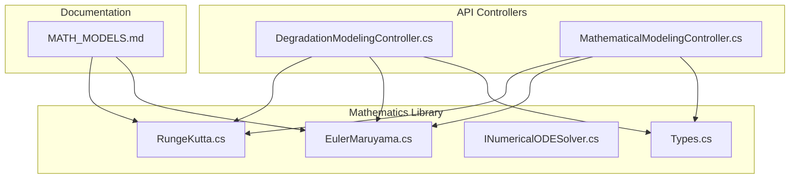
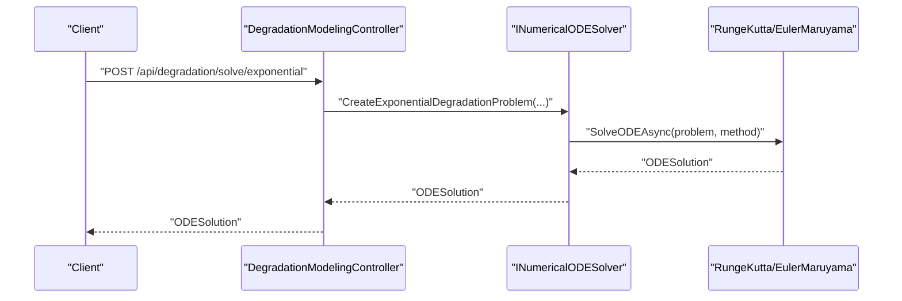
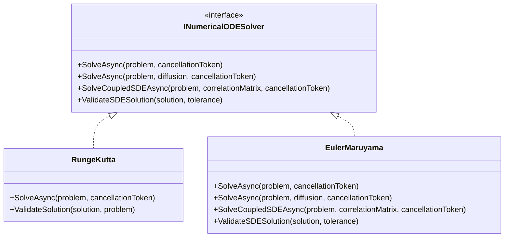
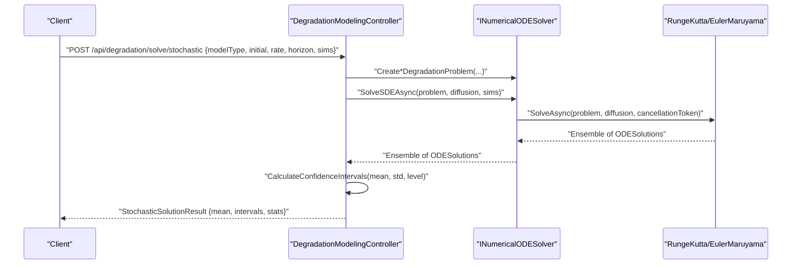
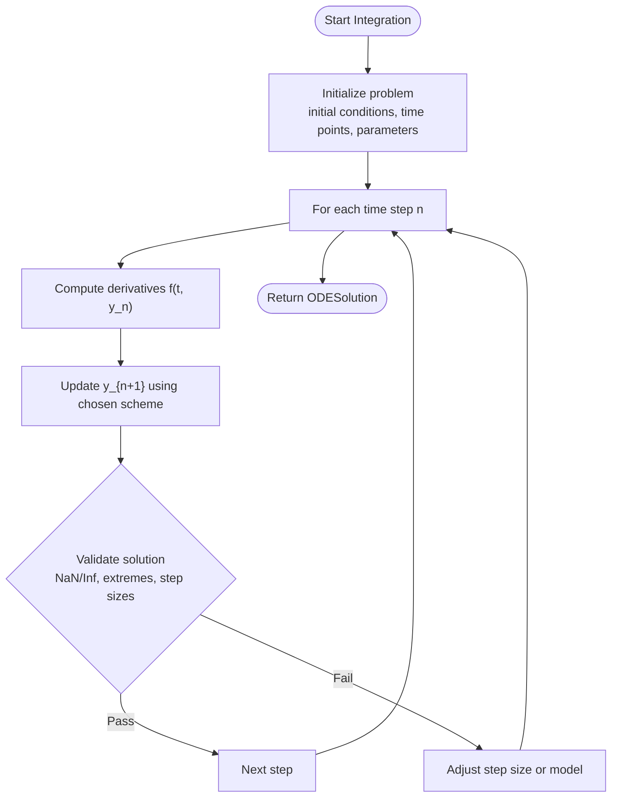
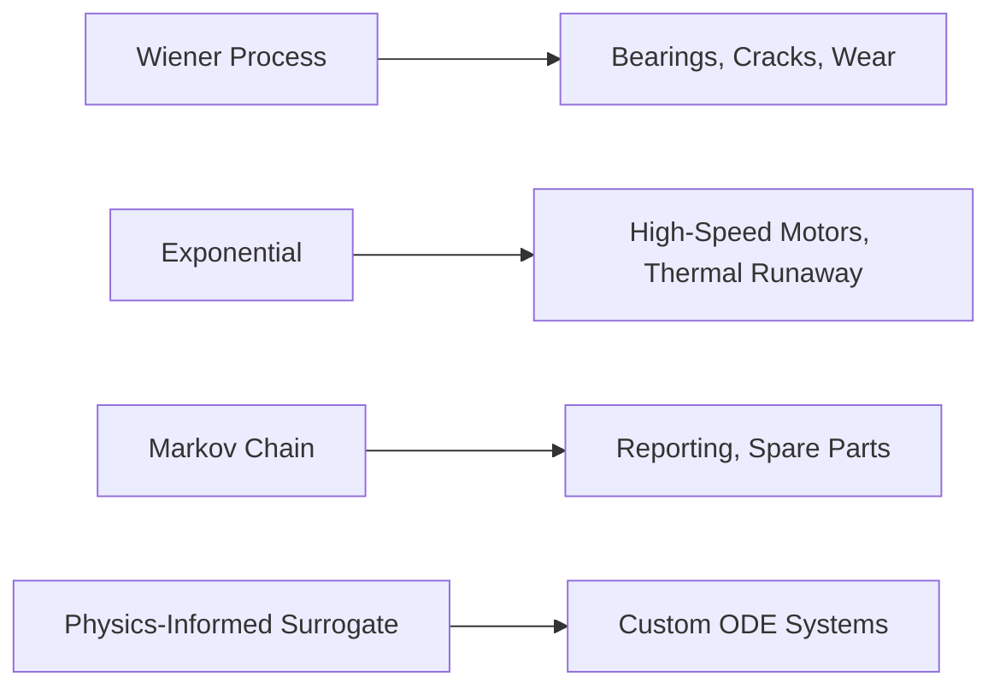
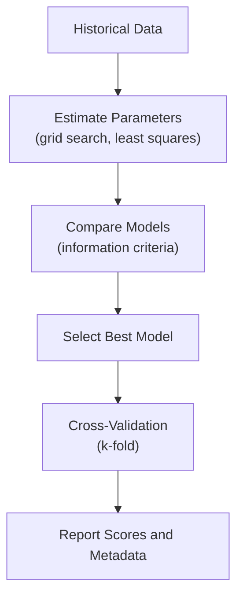
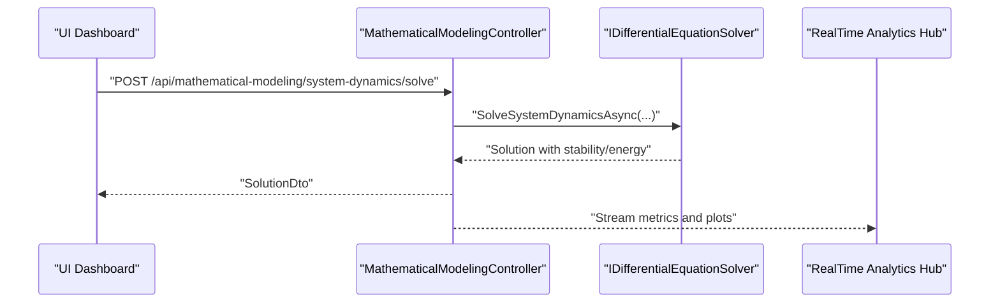
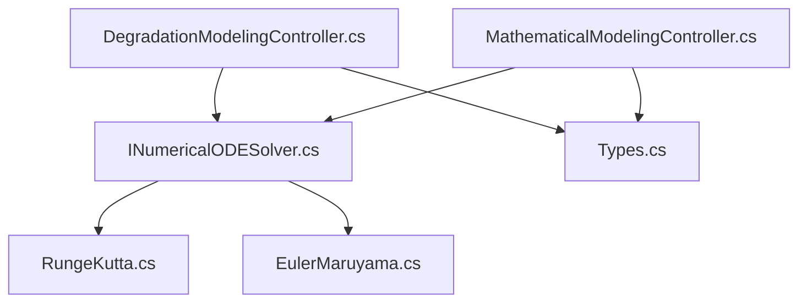

# Mathematical Modeling

<cite>
**Referenced Files in This Document**
- [MATH_MODELS.md](file://docs/MATH_MODELS.md)
- [DegradationModelingController.cs](file://src/api/DigitalTwinPlatform.API/Controllers/DegradationModelingController.cs)
- [MathematicalModelingController.cs](file://src/api/DigitalTwinPlatform.API/Controllers/MathematicalModelingController.cs)
- [EulerMaruyama.cs](file://src/api/DigitalTwinPlatform.Application/Mathematics/EulerMaruyama.cs)
- [RungeKutta.cs](file://src/api/DigitalTwinPlatform.Application/Mathematics/RungeKutta.cs)
- [INumericalODESolver.cs](file://src/api/DigitalTwinPlatform.Application/Mathematics/INumericalODESolver.cs)
- [Types.cs](file://src/api/DigitalTwinPlatform.Application/Mathematics/Types.cs)
</cite>

## Table of Contents
1. [Introduction](#introduction)
2. [Project Structure](#project-structure)
3. [Core Components](#core-components)
4. [Architecture Overview](#architecture-overview)
5. [Detailed Component Analysis](#detailed-component-analysis)
6. [Dependency Analysis](#dependency-analysis)
7. [Performance Considerations](#performance-considerations)
8. [Troubleshooting Guide](#troubleshooting-guide)
9. [Conclusion](#conclusion)
10. [Appendices](#appendices)

## Introduction
This document explains the mathematical modeling capabilities for numerical methods and degradation models in the digital twin platform. It covers ODE and SDE solvers, numerical integration techniques, and the mathematical foundations underpinning degradation modeling. It documents supported model families (Wiener processes, exponential models, Markov chains, and physics-informed surrogates), solver algorithms, parameter estimation workflows, and simulation controls. It also describes integration with the digital twin simulation engine, real-time processing considerations, validation and accuracy practices, and computational efficiency optimizations.

## Project Structure
The mathematical modeling features are implemented across:
- Controllers exposing APIs for degradation modeling and general ODE/SDE solving
- Mathematics library containing numerical solvers and shared types
- Documentation outlining supported models and solver characteristics



**Diagram sources**
- [DegradationModelingController.cs](file://src/api/DigitalTwinPlatform.API/Controllers/DegradationModelingController.cs#L1-L472)
- [MathematicalModelingController.cs](file://src/api/DigitalTwinPlatform.API/Controllers/MathematicalModelingController.cs#L1-L514)
- [RungeKutta.cs](file://src/api/DigitalTwinPlatform.Application/Mathematics/RungeKutta.cs)
- [EulerMaruyama.cs](file://src/api/DigitalTwinPlatform.Application/Mathematics/EulerMaruyama.cs#L1-L388)
- [INumericalODESolver.cs](file://src/api/DigitalTwinPlatform.Application/Mathematics/INumericalODESolver.cs)
- [Types.cs](file://src/api/DigitalTwinPlatform.Application/Mathematics/Types.cs)
- [MATH_MODELS.md](file://docs/MATH_MODELS.md#L1-L38)

**Section sources**
- [MATH_MODELS.md](file://docs/MATH_MODELS.md#L1-L38)
- [DegradationModelingController.cs](file://src/api/DigitalTwinPlatform.API/Controllers/DegradationModelingController.cs#L1-L472)
- [MathematicalModelingController.cs](file://src/api/DigitalTwinPlatform.API/Controllers/MathematicalModelingController.cs#L1-L514)
- [RungeKutta.cs](file://src/api/DigitalTwinPlatform.Application/Mathematics/RungeKutta.cs)
- [EulerMaruyama.cs](file://src/api/DigitalTwinPlatform.Application/Mathematics/EulerMaruyama.cs#L1-L388)
- [INumericalODESolver.cs](file://src/api/DigitalTwinPlatform.Application/Mathematics/INumericalODESolver.cs)
- [Types.cs](file://src/api/DigitalTwinPlatform.Application/Mathematics/Types.cs)

## Core Components
- ODE/SDE Solvers
  - Runge-Kutta 4th order (RK4): deterministic ODE solver with built-in stability checks and energy conservation diagnostics
  - Euler-Maruyama: deterministic and stochastic (SDE) solver supporting scalar and coupled systems with correlated noise
- Degradation Modeling API
  - Exponential and power-law degradation ODEs
  - Multi-variable degradation systems
  - Stochastic degradation with Monte Carlo simulations and confidence intervals
  - Parameter estimation via grid search and least squares
  - Model comparison and cross-validation
- General ODE/System Dynamics API
  - Arbitrary ODE system solving with derived quantities
  - Stability and energy balance analysis
  - Gradient-based, genetic algorithm, and multi-objective optimization

**Section sources**
- [MATH_MODELS.md](file://docs/MATH_MODELS.md#L3-L38)
- [DegradationModelingController.cs](file://src/api/DigitalTwinPlatform.API/Controllers/DegradationModelingController.cs#L24-L291)
- [MathematicalModelingController.cs](file://src/api/DigitalTwinPlatform.API/Controllers/MathematicalModelingController.cs#L24-L267)
- [EulerMaruyama.cs](file://src/api/DigitalTwinPlatform.Application/Mathematics/EulerMaruyama.cs#L12-L388)
- [RungeKutta.cs](file://src/api/DigitalTwinPlatform.Application/Mathematics/RungeKutta.cs)

## Architecture Overview
The degradation modeling pipeline integrates controllers, solvers, and shared types. Requests are validated and dispatched to solvers; stochastic models produce ensembles with confidence statistics; parameter estimation and validation are exposed as separate endpoints.



**Diagram sources**
- [DegradationModelingController.cs](file://src/api/DigitalTwinPlatform.API/Controllers/DegradationModelingController.cs#L27-L54)
- [INumericalODESolver.cs](file://src/api/DigitalTwinPlatform.Application/Mathematics/INumericalODESolver.cs)
- [RungeKutta.cs](file://src/api/DigitalTwinPlatform.Application/Mathematics/RungeKutta.cs)
- [EulerMaruyama.cs](file://src/api/DigitalTwinPlatform.Application/Mathematics/EulerMaruyama.cs#L26-L87)

## Detailed Component Analysis

### ODE Solvers: RungeKutta and EulerMaruyama
- RungeKutta
  - Purpose: deterministic ODE solving with stability and energy checks
  - Accuracy: fourth-order local truncation error suitable for long-term simulations
  - Stability: includes internal checks for stability verification
- EulerMaruyama
  - Deterministic mode: first-order strong convergence for ODEs
  - Stochastic mode: Euler–Maruyama for SDEs with drift and diffusion
  - Coupled SDEs: supports correlation matrices via Cholesky decomposition
  - Validation: detects NaN/infinity, extreme values, and step-size diagnostics



**Diagram sources**
- [INumericalODESolver.cs](file://src/api/DigitalTwinPlatform.Application/Mathematics/INumericalODESolver.cs)
- [RungeKutta.cs](file://src/api/DigitalTwinPlatform.Application/Mathematics/RungeKutta.cs)
- [EulerMaruyama.cs](file://src/api/DigitalTwinPlatform.Application/Mathematics/EulerMaruyama.cs#L12-L388)

**Section sources**
- [MATH_MODELS.md](file://docs/MATH_MODELS.md#L6-L16)
- [RungeKutta.cs](file://src/api/DigitalTwinPlatform.Application/Mathematics/RungeKutta.cs)
- [EulerMaruyama.cs](file://src/api/DigitalTwinPlatform.Application/Mathematics/EulerMaruyama.cs#L12-L388)

### Degradation Modeling API
Endpoints and workflows:
- Exponential and power-law degradation ODE solving
- Multi-variable degradation systems
- Stochastic degradation with Monte Carlo and confidence intervals
- Parameter estimation for exponential, power-law, and multi-variable models
- Model comparison and cross-validation
- Solution validation for numerical stability



**Diagram sources**
- [DegradationModelingController.cs](file://src/api/DigitalTwinPlatform.API/Controllers/DegradationModelingController.cs#L124-L171)
- [EulerMaruyama.cs](file://src/api/DigitalTwinPlatform.Application/Mathematics/EulerMaruyama.cs#L92-L161)

**Section sources**
- [DegradationModelingController.cs](file://src/api/DigitalTwinPlatform.API/Controllers/DegradationModelingController.cs#L24-L291)

### General ODE and System Dynamics API
- ODE solving for arbitrary systems with named equations and initial conditions
- System dynamics with derived quantities (e.g., energy) and stability/energy balance analysis
- Optimization front-end supporting gradient-based, genetic algorithm, and multi-objective strategies

```mermaid
sequenceDiagram
participant Client as "Client"
participant API as "MathematicalModelingController"
participant Solver as "IDifferentialEquationSolver"
participant Opt as "IOptimizationService"
Client->>API : "POST /api/mathematical-modeling/system-dynamics/solve"
API->>Solver : "SolveSystemDynamicsAsync(model, simulationTime)"
Solver-->>API : "SystemDynamicsSolutionDto {stability, energy}"
API-->>Client : "SystemDynamicsSolutionDto"
Client->>API : "POST /api/mathematical-modeling/optimization/gradient"
API->>Opt : "OptimizeParametersAsync(objective, guess, options)"
Opt-->>API : "OptimizationResultDto"
API-->>Client : "OptimizationResultDto"
```

**Diagram sources**
- [MathematicalModelingController.cs](file://src/api/DigitalTwinPlatform.API/Controllers/MathematicalModelingController.cs#L67-L115)
- [MathematicalModelingController.cs](file://src/api/DigitalTwinPlatform.API/Controllers/MathematicalModelingController.cs#L120-L267)

**Section sources**
- [MathematicalModelingController.cs](file://src/api/DigitalTwinPlatform.API/Controllers/MathematicalModelingController.cs#L24-L267)

### Numerical Integration Techniques and Algorithms
- Runge-Kutta 4th Order (RK4)
  - Fourth-order accurate for smooth ODEs
  - Suitable for long-term stability in mechanical/thermal aging simulations
  - Includes built-in stability checks and energy conservation diagnostics
- Euler-Maruyama
  - Strong first-order scheme for SDEs
  - Supports scalar and multi-dimensional correlated noise via Cholesky decomposition
  - Provides validation metrics for numerical stability



**Diagram sources**
- [RungeKutta.cs](file://src/api/DigitalTwinPlatform.Application/Mathematics/RungeKutta.cs)
- [EulerMaruyama.cs](file://src/api/DigitalTwinPlatform.Application/Mathematics/EulerMaruyama.cs#L26-L161)

**Section sources**
- [MATH_MODELS.md](file://docs/MATH_MODELS.md#L6-L16)
- [EulerMaruyama.cs](file://src/api/DigitalTwinPlatform.Application/Mathematics/EulerMaruyama.cs#L12-L388)

### Degradation Model Types and Use Cases
- Wiener process (Brownian motion with drift)
  - Use case: bearings, cracks, accumulative wear
- Exponential decay
  - Use case: high-speed motors, thermal runaway
- Markov chain
  - Use case: high-level reporting and spare parts planning (discrete Healthy → Warning → Fail transitions)
- Physics-informed surrogates
  - Use case: equipment-specific ODEs (e.g., heat dissipation, mechanical wear)



**Diagram sources**
- [MATH_MODELS.md](file://docs/MATH_MODELS.md#L18-L26)

**Section sources**
- [MATH_MODELS.md](file://docs/MATH_MODELS.md#L18-L26)

### Parameter Estimation and Model Validation
- Mechanism: grid search and least squares optimization
- Goal: fit parameters (e.g., degradation rate λ) to historical data
- Features:
  - Estimate exponential and power-law parameters
  - Estimate multi-variable systems
  - Compare models using information criteria
  - Validate parameters using cross-validation



**Diagram sources**
- [MATH_MODELS.md](file://docs/MATH_MODELS.md#L28-L31)
- [DegradationModelingController.cs](file://src/api/DigitalTwinPlatform.API/Controllers/DegradationModelingController.cs#L173-L321)

**Section sources**
- [MATH_MODELS.md](file://docs/MATH_MODELS.md#L28-L31)
- [DegradationModelingController.cs](file://src/api/DigitalTwinPlatform.API/Controllers/DegradationModelingController.cs#L173-L321)

### Simulation Workflows and Real-Time Processing
- Interactive modeling dashboard (UI-side) enables drag-and-drop ODE builder, real-time plotting, adjustable parameters, and export of configurations
- Backend APIs support:
  - Batch ODE/SDE solves
  - Monte Carlo for stochastic models with confidence intervals
  - Stability and energy checks for deterministic systems
- Real-time analytics integration is enabled via SignalR hubs and streaming telemetry services



**Diagram sources**
- [MathematicalModelingController.cs](file://src/api/DigitalTwinPlatform.API/Controllers/MathematicalModelingController.cs#L67-L115)

**Section sources**
- [MATH_MODELS.md](file://docs/MATH_MODELS.md#L33-L37)
- [MathematicalModelingController.cs](file://src/api/DigitalTwinPlatform.API/Controllers/MathematicalModelingController.cs#L67-L115)

## Dependency Analysis
- Controllers depend on solver interfaces and shared types
- Solvers encapsulate numerical algorithms and expose validation helpers
- Shared types define problems, solutions, and metadata exchanged across layers



**Diagram sources**
- [DegradationModelingController.cs](file://src/api/DigitalTwinPlatform.API/Controllers/DegradationModelingController.cs#L1-L472)
- [MathematicalModelingController.cs](file://src/api/DigitalTwinPlatform.API/Controllers/MathematicalModelingController.cs#L1-L514)
- [INumericalODESolver.cs](file://src/api/DigitalTwinPlatform.Application/Mathematics/INumericalODESolver.cs)
- [RungeKutta.cs](file://src/api/DigitalTwinPlatform.Application/Mathematics/RungeKutta.cs)
- [EulerMaruyama.cs](file://src/api/DigitalTwinPlatform.Application/Mathematics/EulerMaruyama.cs#L1-L388)
- [Types.cs](file://src/api/DigitalTwinPlatform.Application/Mathematics/Types.cs)

**Section sources**
- [DegradationModelingController.cs](file://src/api/DigitalTwinPlatform.API/Controllers/DegradationModelingController.cs#L1-L472)
- [MathematicalModelingController.cs](file://src/api/DigitalTwinPlatform.API/Controllers/MathematicalModelingController.cs#L1-L514)
- [INumericalODESolver.cs](file://src/api/DigitalTwinPlatform.Application/Mathematics/INumericalODESolver.cs)
- [RungeKutta.cs](file://src/api/DigitalTwinPlatform.Application/Mathematics/RungeKutta.cs)
- [EulerMaruyama.cs](file://src/api/DigitalTwinPlatform.Application/Mathematics/EulerMaruyama.cs#L1-L388)
- [Types.cs](file://src/api/DigitalTwinPlatform.Application/Mathematics/Types.cs)

## Performance Considerations
- Choose solver based on problem characteristics:
  - Smooth deterministic systems: RK4 for higher accuracy per step
  - Noisy or multi-dimensional systems: Euler–Maruyama with appropriate step size and correlation handling
- Control computational cost:
  - Reduce time points or use coarser grids for exploratory runs
  - Limit Monte Carlo simulations for stochastic models during interactive sessions
- Monitor stability:
  - Use built-in stability and energy checks for deterministic systems
  - Validate SDE solutions for NaN/overflow and extreme values
- Parallelization:
  - Monte Carlo simulations can be parallelized across independent trajectories
  - Consider batching requests for parameter estimation and model comparison

[No sources needed since this section provides general guidance]

## Troubleshooting Guide
Common issues and remedies:
- Numerical instability in SDEs
  - Symptoms: NaN or infinite values, extreme magnitudes
  - Actions: reduce step size, adjust diffusion coefficient, validate correlation matrix condition
- Poor convergence or oscillations
  - Actions: switch to RK4 for deterministic systems, refine initial guesses for parameter estimation
- Slow performance
  - Actions: decrease time points, reduce simulation count, enable early cancellation where supported
- Model mismatch
  - Actions: compare models using information criteria, validate parameters via cross-validation

**Section sources**
- [EulerMaruyama.cs](file://src/api/DigitalTwinPlatform.Application/Mathematics/EulerMaruyama.cs#L327-L375)
- [DegradationModelingController.cs](file://src/api/DigitalTwinPlatform.API/Controllers/DegradationModelingController.cs#L324-L353)

## Conclusion
The platform provides robust numerical methods for degradation modeling, combining deterministic ODE solvers (RK4) and stochastic SDE solvers (Euler–Maruyama) with practical parameter estimation, validation, and visualization workflows. The APIs support both batch and interactive use cases, enabling integration with the digital twin simulation engine and real-time analytics.

[No sources needed since this section summarizes without analyzing specific files]

## Appendices

### Practical Examples and Guidance
- Model configuration
  - Exponential degradation: specify initial value, degradation rate, time horizon, and solver method
  - Power-law degradation: add power parameter alongside exponential settings
  - Multi-variable systems: provide initial values and parameter dictionary
  - Stochastic models: set diffusion coefficient, number of simulations, and confidence level
- Parameter tuning
  - Start with reasonable bounds and initial guesses; refine using comparison and cross-validation
  - Prefer grid search for coarse exploration, followed by least squares refinement
- Result interpretation
  - For stochastic solutions, interpret mean trajectories and confidence bands
  - Use stability and energy diagnostics for deterministic systems to assess numerical quality

**Section sources**
- [DegradationModelingController.cs](file://src/api/DigitalTwinPlatform.API/Controllers/DegradationModelingController.cs#L403-L471)
- [MathematicalModelingController.cs](file://src/api/DigitalTwinPlatform.API/Controllers/MathematicalModelingController.cs#L388-L438)
- [MATH_MODELS.md](file://docs/MATH_MODELS.md#L28-L37)