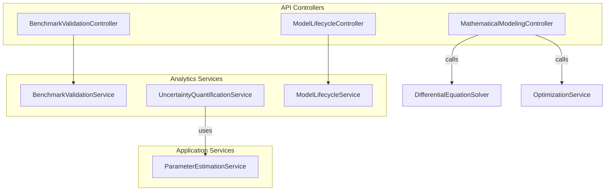
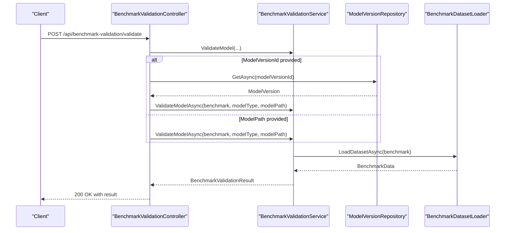
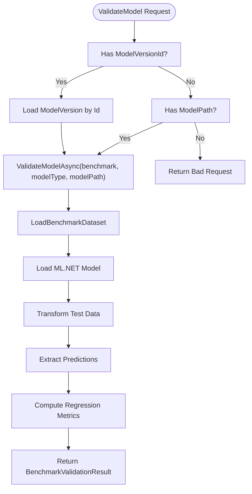
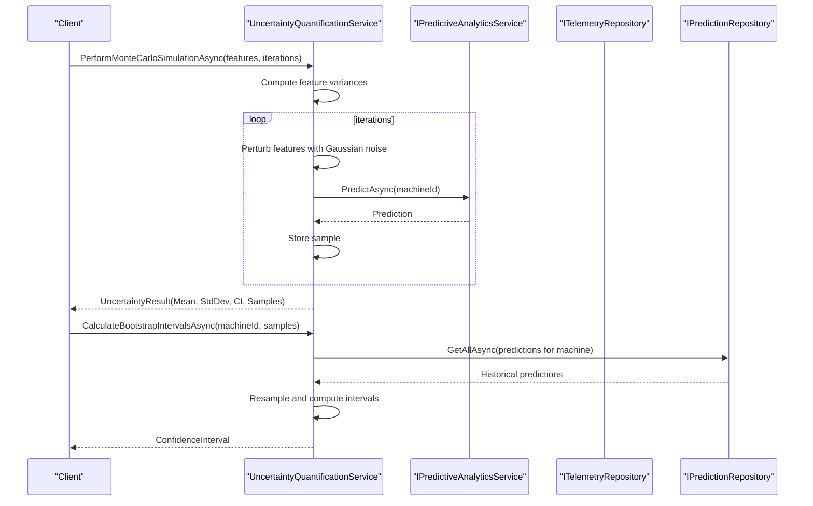
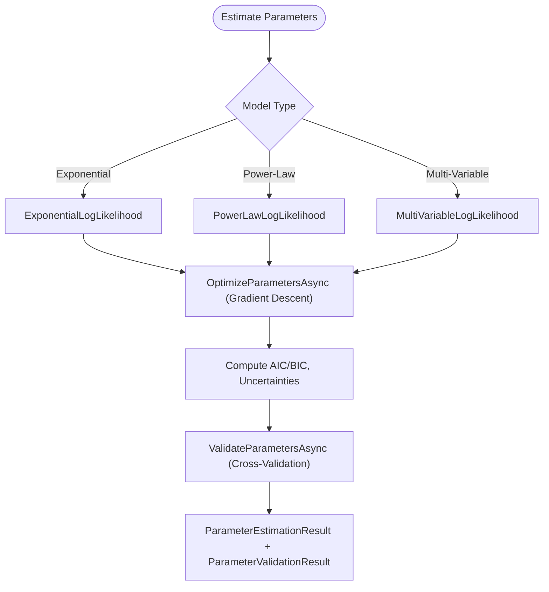
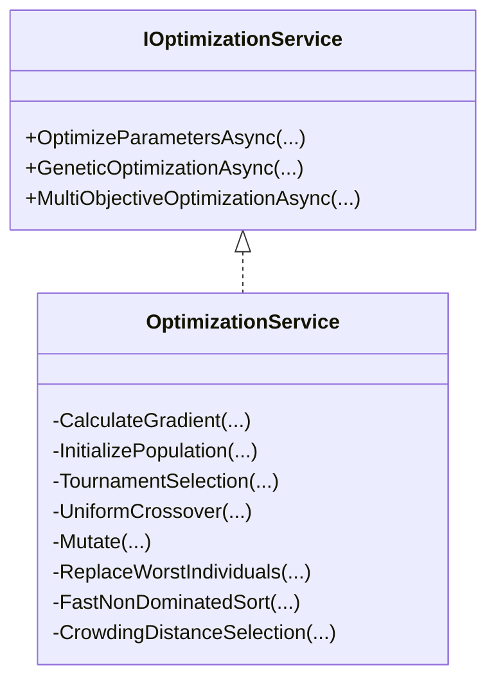
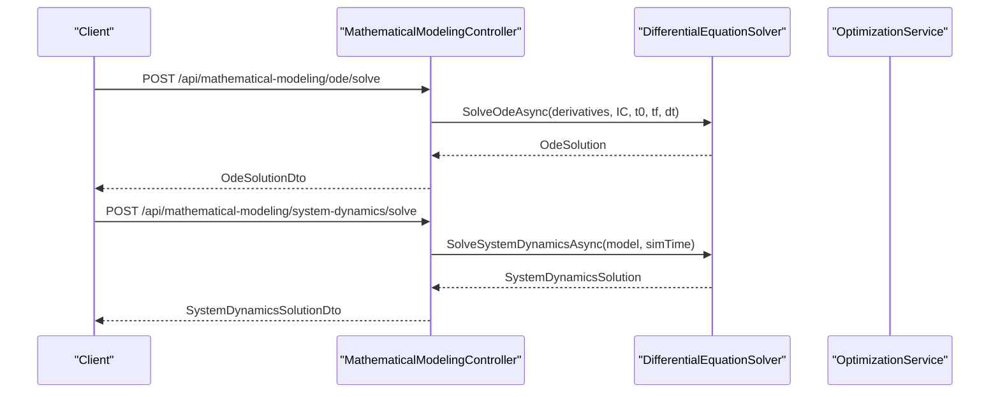
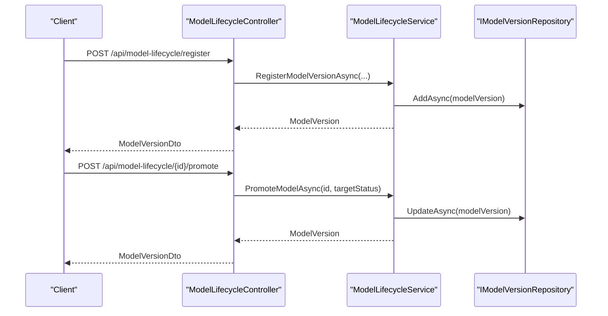
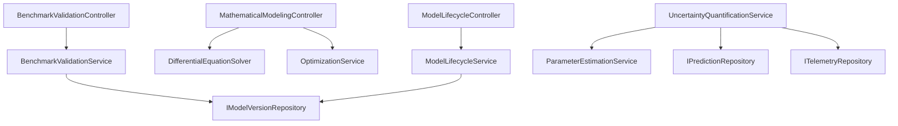

# Model Validation and Optimization

<cite>
**Referenced Files in This Document**
- [BenchmarkValidationController.cs](file://src/api/DigitalTwinPlatform.API/Controllers/BenchmarkValidationController.cs)
- [BenchmarkValidationService.cs](file://src/api/DigitalTwinPlatform.API/Services/Analytics/BenchmarkValidationService.cs)
- [IBenchmarkValidationService.cs](file://src/api/DigitalTwinPlatform.API/Services/Analytics/IBenchmarkValidationService.cs)
- [UncertaintyQuantificationService.cs](file://src/api/DigitalTwinPlatform.API/Services/Analytics/UncertaintyQuantificationService.cs)
- [IUncertaintyQuantificationService.cs](file://src/api/DigitalTwinPlatform.API/Services/Analytics/IUncertaintyQuantificationService.cs)
- [ParameterEstimationService.cs](file://src/api/DigitalTwinPlatform.Application/Services/ParameterEstimationService.cs)
- [MathematicalModelingController.cs](file://src/api/DigitalTwinPlatform.API/Controllers/MathematicalModelingController.cs)
- [MathematicalModelingServices.cs](file://src/api/DigitalTwinPlatform.API/Services/MathematicalModeling/MathematicalModelingServices.cs)
- [ModelLifecycleController.cs](file://src/api/DigitalTwinPlatform.API/Controllers/ModelLifecycleController.cs)
- [ModelLifecycleService.cs](file://src/api/DigitalTwinPlatform.API/Services/Analytics/ModelLifecycleService.cs)
</cite>

## Table of Contents
1. [Introduction](#introduction)
2. [Project Structure](#project-structure)
3. [Core Components](#core-components)
4. [Architecture Overview](#architecture-overview)
5. [Detailed Component Analysis](#detailed-component-analysis)
6. [Dependency Analysis](#dependency-analysis)
7. [Performance Considerations](#performance-considerations)
8. [Troubleshooting Guide](#troubleshooting-guide)
9. [Conclusion](#conclusion)
10. [Appendices](#appendices)

## Introduction
This document presents a comprehensive guide to model validation and optimization within the platform. It covers statistical validation methods, goodness-of-fit tests, cross-validation procedures, parameter estimation techniques, optimization algorithms, and uncertainty quantification. It also documents transfer function evaluation, frequency domain analysis, and time-domain validation approaches, along with performance benchmarking, cache optimization strategies, and computational efficiency improvements. Practical examples of model calibration workflows, validation metrics interpretation, and quality assurance procedures are included, alongside model selection criteria (AIC/BIC) and automated validation pipelines.

## Project Structure
The validation and optimization capabilities are implemented across:
- Controllers exposing endpoints for benchmark validation, mathematical modeling, and lifecycle management
- Services implementing benchmark validation, uncertainty quantification, parameter estimation, and optimization
- Application-level services coordinating mathematical modeling and lifecycle operations

**Diagram sources**
- [BenchmarkValidationController.cs](file://src/api/DigitalTwinPlatform.API/Controllers/BenchmarkValidationController.cs#L1-L114)
- [BenchmarkValidationService.cs](file://src/api/DigitalTwinPlatform.API/Services/Analytics/BenchmarkValidationService.cs#L1-L223)
- [UncertaintyQuantificationService.cs](file://src/api/DigitalTwinPlatform.API/Services/Analytics/UncertaintyQuantificationService.cs#L1-L384)
- [ParameterEstimationService.cs](file://src/api/DigitalTwinPlatform.Application/Services/ParameterEstimationService.cs#L1-L625)
- [MathematicalModelingController.cs](file://src/api/DigitalTwinPlatform.API/Controllers/MathematicalModelingController.cs#L1-L514)
- [MathematicalModelingServices.cs](file://src/api/DigitalTwinPlatform.API/Services/MathematicalModeling/MathematicalModelingServices.cs#L1-L822)
- [ModelLifecycleController.cs](file://src/api/DigitalTwinPlatform.API/Controllers/ModelLifecycleController.cs#L1-L220)
- [ModelLifecycleService.cs](file://src/api/DigitalTwinPlatform.API/Services/Analytics/ModelLifecycleService.cs#L1-L261)

**Section sources**
- [BenchmarkValidationController.cs](file://src/api/DigitalTwinPlatform.API/Controllers/BenchmarkValidationController.cs#L1-L114)
- [MathematicalModelingController.cs](file://src/api/DigitalTwinPlatform.API/Controllers/MathematicalModelingController.cs#L1-L514)
- [ModelLifecycleController.cs](file://src/api/DigitalTwinPlatform.API/Controllers/ModelLifecycleController.cs#L1-L220)

## Core Components
- Benchmark validation service validates ML models against benchmark datasets, computes regression metrics, and returns detailed validation results.
- Uncertainty quantification service performs Monte Carlo simulations, Bayesian inference, bootstrap intervals, and model uncertainty decomposition.
- Parameter estimation service estimates degradation model parameters via maximum likelihood, calculates AIC/BIC, and validates parameters using cross-validation.
- Mathematical modeling services provide ODE solvers and optimization algorithms (gradient-based, genetic algorithm, multi-objective NSGA-II).
- Model lifecycle service manages model registration, promotion, comparison, and performance summaries.

**Section sources**
- [BenchmarkValidationService.cs](file://src/api/DigitalTwinPlatform.API/Services/Analytics/BenchmarkValidationService.cs#L1-L223)
- [IBenchmarkValidationService.cs](file://src/api/DigitalTwinPlatform.API/Services/Analytics/IBenchmarkValidationService.cs#L1-L57)
- [UncertaintyQuantificationService.cs](file://src/api/DigitalTwinPlatform.API/Services/Analytics/UncertaintyQuantificationService.cs#L1-L384)
- [IUncertaintyQuantificationService.cs](file://src/api/DigitalTwinPlatform.API/Services/Analytics/IUncertaintyQuantificationService.cs#L1-L72)
- [ParameterEstimationService.cs](file://src/api/DigitalTwinPlatform.Application/Services/ParameterEstimationService.cs#L1-L625)
- [MathematicalModelingServices.cs](file://src/api/DigitalTwinPlatform.API/Services/MathematicalModeling/MathematicalModelingServices.cs#L1-L822)
- [ModelLifecycleService.cs](file://src/api/DigitalTwinPlatform.API/Services/Analytics/ModelLifecycleService.cs#L1-L261)

## Architecture Overview
The system integrates controllers, services, and repositories to deliver validation and optimization workflows. Benchmark validation leverages ML.NET for model loading and evaluation. Uncertainty quantification combines predictive analytics with telemetry and historical predictions. Parameter estimation and optimization focus on degradation models and mathematical systems. Lifecycle management ensures version control and performance tracking.

**Diagram sources**
- [BenchmarkValidationController.cs](file://src/api/DigitalTwinPlatform.API/Controllers/BenchmarkValidationController.cs#L24-L65)
- [BenchmarkValidationService.cs](file://src/api/DigitalTwinPlatform.API/Services/Analytics/BenchmarkValidationService.cs#L26-L161)
- [IBenchmarkValidationService.cs](file://src/api/DigitalTwinPlatform.API/Services/Analytics/IBenchmarkValidationService.cs#L5-L21)

## Detailed Component Analysis

### Benchmark Validation
- Endpoint supports validating either a registered model version or a model file path against a benchmark dataset.
- Loads benchmark data, loads an ML.NET model, transforms data, extracts predictions, and computes regression metrics (MAE, RMSE, R², MAPE).
- Returns detailed metrics and per-sample comparisons.

**Diagram sources**
- [BenchmarkValidationController.cs](file://src/api/DigitalTwinPlatform.API/Controllers/BenchmarkValidationController.cs#L24-L65)
- [BenchmarkValidationService.cs](file://src/api/DigitalTwinPlatform.API/Services/Analytics/BenchmarkValidationService.cs#L55-L161)

**Section sources**
- [BenchmarkValidationController.cs](file://src/api/DigitalTwinPlatform.API/Controllers/BenchmarkValidationController.cs#L24-L104)
- [BenchmarkValidationService.cs](file://src/api/DigitalTwinPlatform.API/Services/Analytics/BenchmarkValidationService.cs#L26-L161)
- [IBenchmarkValidationService.cs](file://src/api/DigitalTwinPlatform.API/Services/Analytics/IBenchmarkValidationService.cs#L23-L57)

### Uncertainty Quantification
- Monte Carlo simulation: perturbs features with Gaussian noise, runs predictions, aggregates samples, and computes confidence intervals and feature sensitivities.
- Bayesian inference: samples priors, evaluates likelihood, and applies accept-reject sampling to derive posterior distributions.
- Bootstrap intervals: resamples historical predictions to compute confidence intervals and coverage probability.
- Model uncertainty: decomposes aleatoric and epistemic uncertainty using ensemble predictions and telemetry variability.

**Diagram sources**
- [UncertaintyQuantificationService.cs](file://src/api/DigitalTwinPlatform.API/Services/Analytics/UncertaintyQuantificationService.cs#L15-L219)
- [IUncertaintyQuantificationService.cs](file://src/api/DigitalTwinPlatform.API/Services/Analytics/IUncertaintyQuantificationService.cs#L5-L41)

**Section sources**
- [UncertaintyQuantificationService.cs](file://src/api/DigitalTwinPlatform.API/Services/Analytics/UncertaintyQuantificationService.cs#L15-L301)
- [IUncertaintyQuantificationService.cs](file://src/api/DigitalTwinPlatform.API/Services/Analytics/IUncertaintyQuantificationService.cs#L43-L72)

### Parameter Estimation and Model Selection
- Supports exponential and power-law degradation models, multi-variable degradation models.
- Uses gradient descent optimization with numerical gradients and adaptive learning rate.
- Computes log-likelihood, AIC, BIC, and parameter uncertainties via second derivatives.
- Performs cross-validation to validate parameter stability across folds.

**Diagram sources**
- [ParameterEstimationService.cs](file://src/api/DigitalTwinPlatform.Application/Services/ParameterEstimationService.cs#L32-L326)

**Section sources**
- [ParameterEstimationService.cs](file://src/api/DigitalTwinPlatform.Application/Services/ParameterEstimationService.cs#L32-L326)

### Optimization Algorithms
- Gradient-based optimization: finite difference gradients, parameter bounds, and convergence checks.
- Genetic algorithm: population initialization, tournament selection, uniform crossover, mutation, steady-state replacement.
- Multi-objective optimization (NSGA-II): fast non-dominated sorting, crowding distance selection, environmental selection.

**Diagram sources**
- [MathematicalModelingServices.cs](file://src/api/DigitalTwinPlatform.API/Services/MathematicalModeling/MathematicalModelingServices.cs#L27-L55)
- [MathematicalModelingServices.cs](file://src/api/DigitalTwinPlatform.API/Services/MathematicalModeling/MathematicalModelingServices.cs#L240-L726)

**Section sources**
- [MathematicalModelingServices.cs](file://src/api/DigitalTwinPlatform.API/Services/MathematicalModeling/MathematicalModelingServices.cs#L240-L726)

### Mathematical Modeling and ODE Solving
- ODE solver implements fourth-order Runge-Kutta for single and multi-equation systems.
- Stability analysis and energy balance computation for system dynamics.
- Endpoints expose ODE solving, system dynamics, and optimization workflows.

**Diagram sources**
- [MathematicalModelingController.cs](file://src/api/DigitalTwinPlatform.API/Controllers/MathematicalModelingController.cs#L27-L115)
- [MathematicalModelingServices.cs](file://src/api/DigitalTwinPlatform.API/Services/MathematicalModeling/MathematicalModelingServices.cs#L57-L238)

**Section sources**
- [MathematicalModelingController.cs](file://src/api/DigitalTwinPlatform.API/Controllers/MathematicalModelingController.cs#L27-L115)
- [MathematicalModelingServices.cs](file://src/api/DigitalTwinPlatform.API/Services/MathematicalModeling/MathematicalModelingServices.cs#L57-L238)

### Model Lifecycle Management
- Registers model versions with metadata and metrics.
- Promotes versions to production, deprecating previous production versions.
- Compares models across metrics and generates performance summaries.

**Diagram sources**
- [ModelLifecycleController.cs](file://src/api/DigitalTwinPlatform.API/Controllers/ModelLifecycleController.cs#L25-L73)
- [ModelLifecycleService.cs](file://src/api/DigitalTwinPlatform.API/Services/Analytics/ModelLifecycleService.cs#L28-L118)

**Section sources**
- [ModelLifecycleController.cs](file://src/api/DigitalTwinPlatform.API/Controllers/ModelLifecycleController.cs#L25-L162)
- [ModelLifecycleService.cs](file://src/api/DigitalTwinPlatform.API/Services/Analytics/ModelLifecycleService.cs#L28-L259)

## Dependency Analysis
- Controllers depend on services for orchestration and computation.
- Services depend on repositories and unit of work for persistence and on application services for mathematical operations.
- Benchmark validation depends on ML.NET for model loading and evaluation.
- Uncertainty quantification depends on predictive analytics and telemetry repositories.
- Parameter estimation integrates with ODE solvers for mathematical modeling.

**Diagram sources**
- [BenchmarkValidationController.cs](file://src/api/DigitalTwinPlatform.API/Controllers/BenchmarkValidationController.cs#L1-L114)
- [MathematicalModelingController.cs](file://src/api/DigitalTwinPlatform.API/Controllers/MathematicalModelingController.cs#L1-L514)
- [ModelLifecycleController.cs](file://src/api/DigitalTwinPlatform.API/Controllers/ModelLifecycleController.cs#L1-L220)
- [UncertaintyQuantificationService.cs](file://src/api/DigitalTwinPlatform.API/Services/Analytics/UncertaintyQuantificationService.cs#L1-L384)
- [ParameterEstimationService.cs](file://src/api/DigitalTwinPlatform.Application/Services/ParameterEstimationService.cs#L1-L625)
- [ModelLifecycleService.cs](file://src/api/DigitalTwinPlatform.API/Services/Analytics/ModelLifecycleService.cs#L1-L261)

**Section sources**
- [BenchmarkValidationService.cs](file://src/api/DigitalTwinPlatform.API/Services/Analytics/BenchmarkValidationService.cs#L12-L24)
- [ModelLifecycleService.cs](file://src/api/DigitalTwinPlatform.API/Services/Analytics/ModelLifecycleService.cs#L11-L26)
- [UncertaintyQuantificationService.cs](file://src/api/DigitalTwinPlatform.API/Services/Analytics/UncertaintyQuantificationService.cs#L1-L12)

## Performance Considerations
- Parallelization opportunities:
  - Monte Carlo simulations and bootstrap resampling can leverage parallel loops for iterations and resampling.
  - Cross-validation folds can be processed concurrently when independent.
- Cancellation support:
  - All long-running operations accept cancellation tokens to enable responsive shutdowns.
- Numerical stability:
  - Gradient descent uses small epsilon and adaptive learning rates; parameter bounds enforcement prevents invalid states.
- Memory efficiency:
  - Streaming or chunked processing of benchmark datasets and telemetry data can reduce memory footprint.
- Computational efficiency:
  - Precomputed feature variances and cached recent telemetry reduce repeated computations.
  - Early stopping criteria in optimization and convergence thresholds prevent unnecessary iterations.

[No sources needed since this section provides general guidance]

## Troubleshooting Guide
- Benchmark validation errors:
  - Invalid model version ID or missing model file cause explicit error messages in validation results.
  - Empty or unavailable benchmark datasets produce error messages and abort early.
- Uncertainty quantification warnings:
  - Prediction failures during Monte Carlo are logged and fallback values are used.
  - Missing historical predictions or telemetry trigger exceptions with actionable messages.
- Parameter estimation failures:
  - Exceptions during optimization or likelihood calculations are logged and propagated.
  - Cross-validation scoring handles unsupported model types gracefully.
- Lifecycle operations:
  - Promotion to production deprecates the previous production model; missing model versions raise clear exceptions.

**Section sources**
- [BenchmarkValidationService.cs](file://src/api/DigitalTwinPlatform.API/Services/Analytics/BenchmarkValidationService.cs#L31-L46)
- [BenchmarkValidationService.cs](file://src/api/DigitalTwinPlatform.API/Services/Analytics/BenchmarkValidationService.cs#L76-L87)
- [UncertaintyQuantificationService.cs](file://src/api/DigitalTwinPlatform.API/Services/Analytics/UncertaintyQuantificationService.cs#L53-L58)
- [UncertaintyQuantificationService.cs](file://src/api/DigitalTwinPlatform.API/Services/Analytics/UncertaintyQuantificationService.cs#L168-L171)
- [ParameterEstimationService.cs](file://src/api/DigitalTwinPlatform.Application/Services/ParameterEstimationService.cs#L289-L294)
- [ModelLifecycleService.cs](file://src/api/DigitalTwinPlatform.API/Services/Analytics/ModelLifecycleService.cs#L75-L79)

## Conclusion
The platform provides a robust framework for model validation and optimization, integrating benchmark testing, uncertainty quantification, parameter estimation, and lifecycle management. The modular architecture enables scalable and maintainable workflows, while built-in metrics and validation procedures support quality assurance and automated pipelines.

[No sources needed since this section summarizes without analyzing specific files]

## Appendices

### Practical Examples and Workflows
- Benchmark validation workflow:
  - Provide either a model version ID or a model path and a benchmark dataset; the service loads the model, evaluates against the benchmark, and returns metrics and per-sample comparisons.
- Parameter estimation workflow:
  - Supply historical data and select a degradation model type; the service estimates parameters, computes AIC/BIC, and validates parameters via cross-validation.
- Uncertainty quantification workflow:
  - Use Monte Carlo simulation for scenario-based uncertainty, Bayesian inference for posterior distributions, or bootstrap intervals for prediction intervals.
- Optimization workflow:
  - Choose gradient-based, genetic algorithm, or multi-objective optimization depending on problem characteristics; configure bounds and termination criteria.

**Section sources**
- [BenchmarkValidationController.cs](file://src/api/DigitalTwinPlatform.API/Controllers/BenchmarkValidationController.cs#L24-L65)
- [ParameterEstimationService.cs](file://src/api/DigitalTwinPlatform.Application/Services/ParameterEstimationService.cs#L32-L326)
- [UncertaintyQuantificationService.cs](file://src/api/DigitalTwinPlatform.API/Services/Analytics/UncertaintyQuantificationService.cs#L15-L219)
- [MathematicalModelingController.cs](file://src/api/DigitalTwinPlatform.API/Controllers/MathematicalModelingController.cs#L120-L267)

### Validation Metrics Interpretation
- MAPE: Percentage-based average absolute error; threshold-based pass/fail criteria are supported.
- RMSE: Root mean squared error indicating typical deviation magnitude.
- MAE: Mean absolute error providing robustness to outliers.
- R²: Proportion of variance explained by the model; higher is better for regression tasks.
- Cross-validation scores: Mean and standard deviation of fold scores indicate parameter stability.

**Section sources**
- [BenchmarkValidationService.cs](file://src/api/DigitalTwinPlatform.API/Services/Analytics/BenchmarkValidationService.cs#L104-L147)
- [ParameterEstimationService.cs](file://src/api/DigitalTwinPlatform.Application/Services/ParameterEstimationService.cs#L269-L326)

### Quality Assurance Procedures
- Automated validation pipeline:
  - Register model versions with metrics, promote to production after validation, and continuously monitor performance.
- Model comparison:
  - Compare models across metrics, determine winners based on thresholds, and track differences.
- Performance monitoring:
  - Retrieve performance summaries and track usage trends for model versions.

**Section sources**
- [ModelLifecycleController.cs](file://src/api/DigitalTwinPlatform.API/Controllers/ModelLifecycleController.cs#L123-L162)
- [ModelLifecycleService.cs](file://src/api/DigitalTwinPlatform.API/Services/Analytics/ModelLifecycleService.cs#L139-L259)