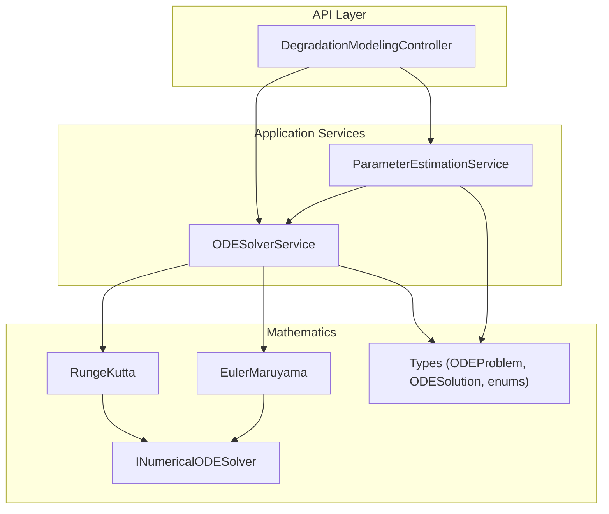
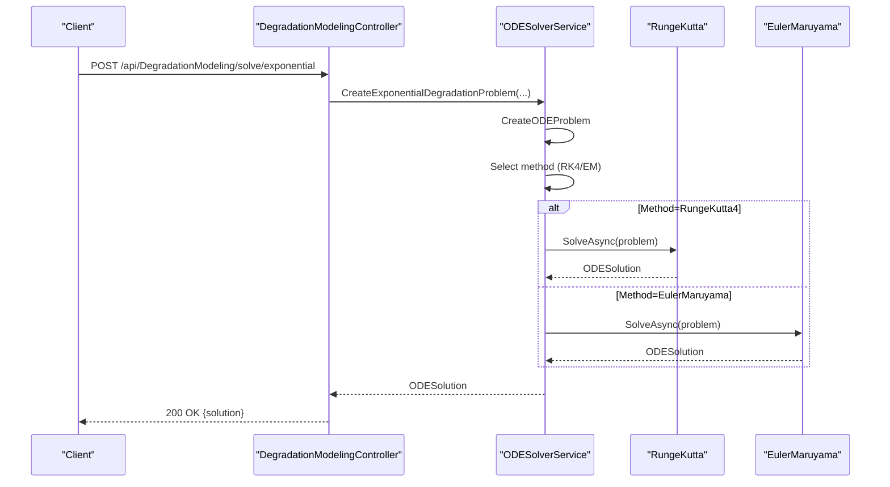
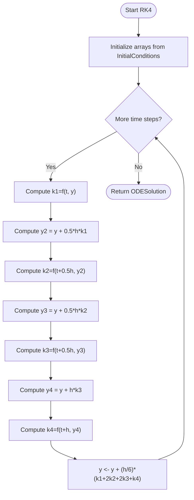
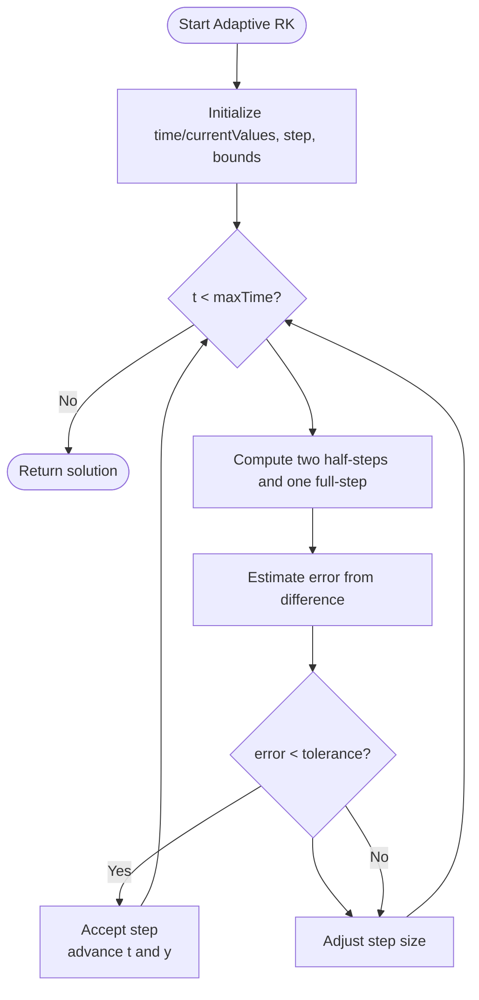
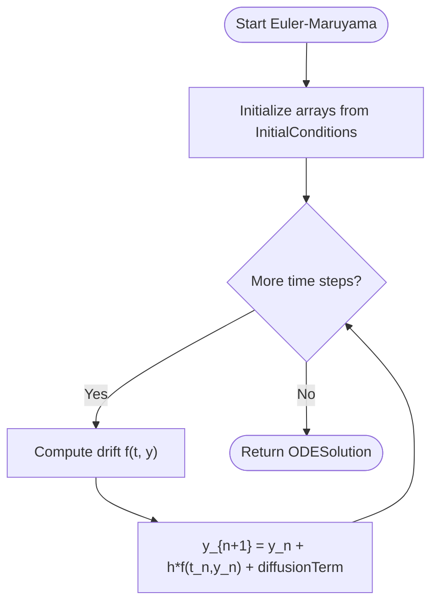
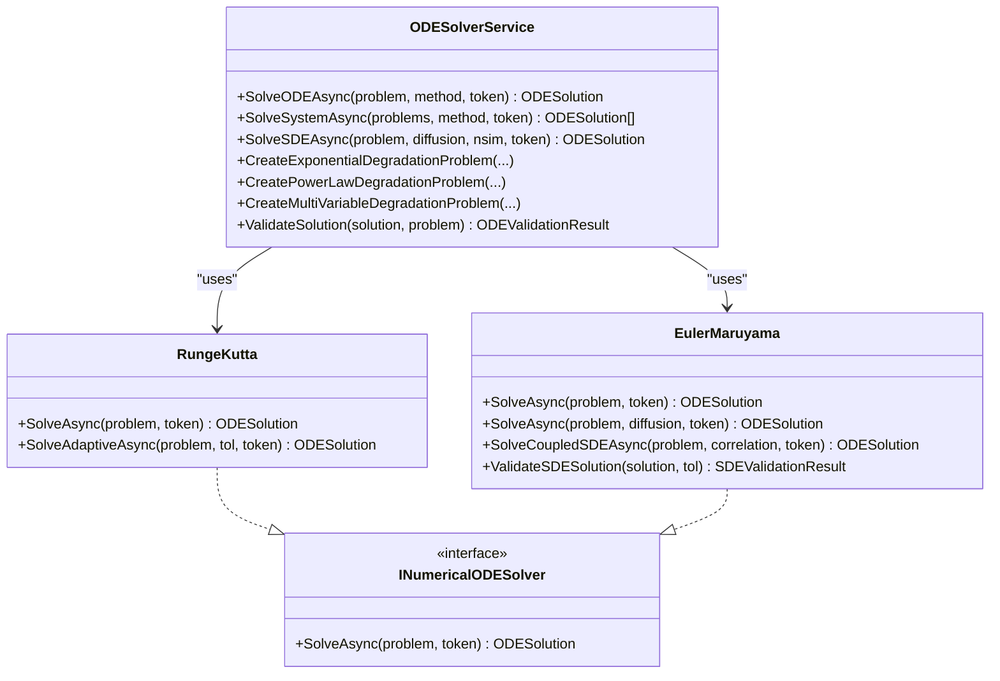
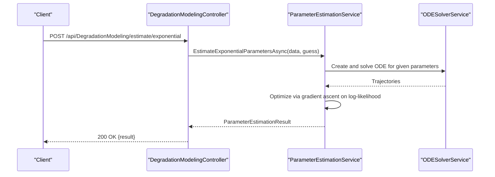
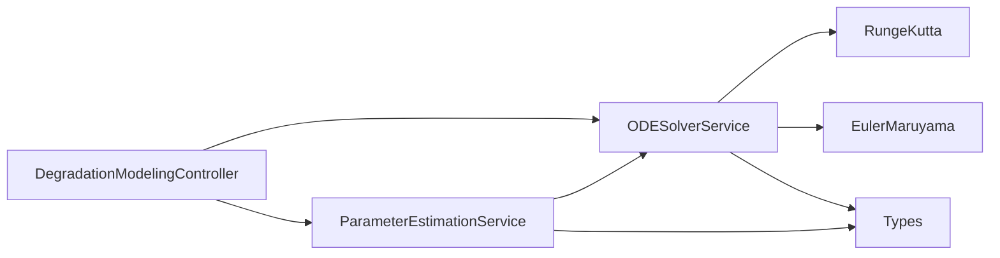

# ODE Solvers and Numerical Methods

<cite>
**Referenced Files in This Document**
- [DegradationModelingController.cs](file://src/api/DigitalTwinPlatform.API/Controllers/DegradationModelingController.cs)
- [ODESolverService.cs](file://src/api/DigitalTwinPlatform.Application/Services/ODESolverService.cs)
- [INumericalODESolver.cs](file://src/api/DigitalTwinPlatform.Application/Mathematics/INumericalODESolver.cs)
- [RungeKutta.cs](file://src/api/DigitalTwinPlatform.Application/Mathematics/RungeKutta.cs)
- [EulerMaruyama.cs](file://src/api/DigitalTwinPlatform.Application/Mathematics/EulerMaruyama.cs)
- [Types.cs](file://src/api/DigitalTwinPlatform.Application/Mathematics/Types.cs)
- [ParameterEstimationService.cs](file://src/api/DigitalTwinPlatform.Application/Services/ParameterEstimationService.cs)
</cite>

## Table of Contents
1. [Introduction](#introduction)
2. [Project Structure](#project-structure)
3. [Core Components](#core-components)
4. [Architecture Overview](#architecture-overview)
5. [Detailed Component Analysis](#detailed-component-analysis)
6. [Dependency Analysis](#dependency-analysis)
7. [Performance Considerations](#performance-considerations)
8. [Troubleshooting Guide](#troubleshooting-guide)
9. [Conclusion](#conclusion)
10. [Appendices](#appendices)

## Introduction
This document explains the ODE solvers and numerical methods used for degradation modeling in the platform. It covers deterministic and stochastic integration techniques, including explicit Runge-Kutta 4 (RK4), implicit Euler, and Euler-Maruyama for stochastic differential equations (SDEs). It documents the mathematical foundations, algorithmic implementations, configuration parameters, stability considerations, accuracy trade-offs, and performance characteristics. Practical guidance is provided for solver selection, step-size optimization, convergence analysis, computational efficiency, memory usage, and parallelization. Finally, it outlines interface contracts and extensibility patterns for adding custom numerical methods.

## Project Structure
The ODE solver stack is organized around a service layer that orchestrates numerical integration via pluggable solver implementations. The controller exposes endpoints for deterministic and stochastic degradation simulations and parameter estimation.

**Diagram sources**
- [DegradationModelingController.cs](file://src/api/DigitalTwinPlatform.API/Controllers/DegradationModelingController.cs#L18-L54)
- [ODESolverService.cs](file://src/api/DigitalTwinPlatform.Application/Services/ODESolverService.cs#L15-L29)
- [INumericalODESolver.cs](file://src/api/DigitalTwinPlatform.Application/Mathematics/INumericalODESolver.cs#L9-L15)
- [RungeKutta.cs](file://src/api/DigitalTwinPlatform.Application/Mathematics/RungeKutta.cs#L12-L19)
- [EulerMaruyama.cs](file://src/api/DigitalTwinPlatform.Application/Mathematics/EulerMaruyama.cs#L12-L21)
- [Types.cs](file://src/api/DigitalTwinPlatform.Application/Mathematics/Types.cs#L9-L16)
- [ParameterEstimationService.cs](file://src/api/DigitalTwinPlatform.Application/Services/ParameterEstimationService.cs#L16-L27)

**Section sources**
- [DegradationModelingController.cs](file://src/api/DigitalTwinPlatform.API/Controllers/DegradationModelingController.cs#L18-L54)
- [ODESolverService.cs](file://src/api/DigitalTwinPlatform.Application/Services/ODESolverService.cs#L15-L29)
- [Types.cs](file://src/api/DigitalTwinPlatform.Application/Mathematics/Types.cs#L9-L16)

## Core Components
- ODEProblem: Defines initial conditions, time grid, derivative function, and parameters.
- ODESolution: Stores time points, multi-variate values, and metadata.
- ODESolverMethod: Enumerates supported methods (RungeKutta4, EulerMaruyama, AdaptiveRungeKutta, ImplicitEuler).
- INumericalODESolver: Contract for numerical ODE/SDE solvers.
- RungeKutta: Explicit RK4 and adaptive RK with step-size control.
- EulerMaruyama: Deterministic Euler-like stepping and stochastic SDE stepping with diffusion and optional correlated Brownian increments.
- ODESolverService: Orchestrates solver selection, problem creation, and solution aggregation/validation.
- ParameterEstimationService: Calibrates models to historical data using maximum likelihood and model comparison/validation.

**Section sources**
- [Types.cs](file://src/api/DigitalTwinPlatform.Application/Mathematics/Types.cs#L9-L46)
- [INumericalODESolver.cs](file://src/api/DigitalTwinPlatform.Application/Mathematics/INumericalODESolver.cs#L9-L15)
- [RungeKutta.cs](file://src/api/DigitalTwinPlatform.Application/Mathematics/RungeKutta.cs#L12-L106)
- [EulerMaruyama.cs](file://src/api/DigitalTwinPlatform.Application/Mathematics/EulerMaruyama.cs#L12-L87)
- [ODESolverService.cs](file://src/api/DigitalTwinPlatform.Application/Services/ODESolverService.cs#L15-L61)
- [ParameterEstimationService.cs](file://src/api/DigitalTwinPlatform.Application/Services/ParameterEstimationService.cs#L16-L93)

## Architecture Overview
The controller accepts requests, constructs ODE/SDE problems, delegates to the solver service, and optionally aggregates stochastic runs. The solver service selects the requested method and invokes the appropriate implementation.

**Diagram sources**
- [DegradationModelingController.cs](file://src/api/DigitalTwinPlatform.API/Controllers/DegradationModelingController.cs#L27-L54)
- [ODESolverService.cs](file://src/api/DigitalTwinPlatform.Application/Services/ODESolverService.cs#L34-L61)
- [RungeKutta.cs](file://src/api/DigitalTwinPlatform.Application/Mathematics/RungeKutta.cs#L24-L106)
- [EulerMaruyama.cs](file://src/api/DigitalTwinPlatform.Application/Mathematics/EulerMaruyama.cs#L26-L87)

## Detailed Component Analysis

### Runge-Kutta 4 (RK4)
- Mathematical foundation: Fourth-order explicit multistage integration using four slope estimates k1..k4 to achieve global accuracy O(h^4).
- Implementation highlights:
  - Fixed-step RK4 loop computes intermediate stages and updates solution.
  - Cancellation support via token checks per step.
  - Metadata capture for logging and provenance.
- Accuracy and stability:
  - Excellent for non-stiff, smooth deterministic systems.
  - May require small step sizes for stability in stiff problems.
- Configuration parameters:
  - Time grid from ODEProblem.TimePoints.
  - No runtime tolerances in fixed-step variant.
- Performance:
  - Four function evaluations per step; good balance of cost vs. accuracy for moderate stiffness.
  - Suitable for parallelizing independent systems (see Parallelization section).

**Diagram sources**
- [RungeKutta.cs](file://src/api/DigitalTwinPlatform.Application/Mathematics/RungeKutta.cs#L52-L101)

**Section sources**
- [RungeKutta.cs](file://src/api/DigitalTwinPlatform.Application/Mathematics/RungeKutta.cs#L12-L106)

### Adaptive Runge-Kutta
- Mathematical foundation: Uses embedded RK formulas to estimate local error and adapt step size to meet a tolerance.
- Implementation highlights:
  - Computes two half-steps and one full-step; estimates error from difference.
  - Adjusts step size using a safety factor and power scaling of tolerance/error ratio.
  - Grows solution with accepted steps; supports cancellation.
- Accuracy and stability:
  - More efficient than fixed-step RK4 for mildly stiff or rough solutions.
  - Requires careful error control tuning.
- Configuration parameters:
  - tolerance (defaulted inside method).
  - min/max step sizes and initial guess derived from problem domain.
- Performance:
  - Dynamic step size reduces work for smooth regions; increases overhead near stiffness.
  - Good candidate for CPU-bound heavy computations.

**Diagram sources**
- [RungeKutta.cs](file://src/api/DigitalTwinPlatform.Application/Mathematics/RungeKutta.cs#L111-L179)

**Section sources**
- [RungeKutta.cs](file://src/api/DigitalTwinPlatform.Application/Mathematics/RungeKutta.cs#L108-L180)

### Euler-Maruyama (Deterministic and Stochastic)
- Mathematical foundation:
  - Deterministic: First-order explicit method y_{n+1}=y_n + h*f(t_n, y_n).
  - Stochastic: Adds diffusion term driven by Brownian motion increments; dy = f(t,y)dt + σ·dW.
  - Supports correlated multi-variate SDEs via Cholesky decomposition of a correlation matrix.
- Implementation highlights:
  - Deterministic and SDE overloads; SDE overload accepts diffusion coefficient.
  - Correlated SDE generation via independent normals transformed by Cholesky factor.
  - Validation helpers for SDE stability and step-size diagnostics.
- Accuracy and stability:
  - Strong first-order convergence for SDEs; stability depends on step size and diffusion.
  - Useful for capturing uncertainty and noise in degradation paths.
- Configuration parameters:
  - Diffusion coefficient for SDEs.
  - Correlation matrix for multi-variate correlated noise.
- Performance:
  - Single function evaluation per step; very low overhead.
  - Can be parallelized across Monte Carlo simulations for SDEs.

**Diagram sources**
- [EulerMaruyama.cs](file://src/api/DigitalTwinPlatform.Application/Mathematics/EulerMaruyama.cs#L124-L156)

**Section sources**
- [EulerMaruyama.cs](file://src/api/DigitalTwinPlatform.Application/Mathematics/EulerMaruyama.cs#L12-L161)

### Implicit Euler
- Mathematical foundation: Backward Euler y_{n+1} = y_n + h*f(t_{n+1}, y_{n+1}), solved via fixed-point or Newton iteration (not implemented here).
- Current status in codebase: Present in the solver method enumeration but not implemented in the solver service or concrete classes.
- Practical note: Would require nonlinear solver setup and Jacobian approximations; suitable for very stiff problems.

**Section sources**
- [Types.cs](file://src/api/DigitalTwinPlatform.Application/Mathematics/Types.cs#L40-L46)
- [ODESolverService.cs](file://src/api/DigitalTwinPlatform.Application/Services/ODESolverService.cs#L44-L49)

### Solver Orchestration and Problem Creation
- ODESolverService:
  - Selects solver based on ODESolverMethod.
  - Creates standard degradation problems (exponential, power-law, multi-variable) with appropriate derivative functions.
  - Aggregates SDE runs by averaging trajectories.
  - Validates deterministic solutions for NaN/Inf.
- Controller endpoints:
  - Expose deterministic and stochastic degradation solving.
  - Support parameter estimation and model comparison/validation.

**Diagram sources**
- [ODESolverService.cs](file://src/api/DigitalTwinPlatform.Application/Services/ODESolverService.cs#L15-L61)
- [RungeKutta.cs](file://src/api/DigitalTwinPlatform.Application/Mathematics/RungeKutta.cs#L12-L19)
- [EulerMaruyama.cs](file://src/api/DigitalTwinPlatform.Application/Mathematics/EulerMaruyama.cs#L12-L21)
- [INumericalODESolver.cs](file://src/api/DigitalTwinPlatform.Application/Mathematics/INumericalODESolver.cs#L9-L15)

**Section sources**
- [ODESolverService.cs](file://src/api/DigitalTwinPlatform.Application/Services/ODESolverService.cs#L15-L214)
- [DegradationModelingController.cs](file://src/api/DigitalTwinPlatform.API/Controllers/DegradationModelingController.cs#L27-L171)

### Parameter Estimation and Model Selection
- ParameterEstimationService:
  - Maximum likelihood estimation for exponential and power-law models.
  - Multi-variable degradation parameter estimation.
  - Model comparison via AIC/BIC.
  - Cross-validation-based parameter validation.
- Integration with ODE solvers:
  - Uses ODESolverService to simulate model trajectories during optimization.

**Diagram sources**
- [ParameterEstimationService.cs](file://src/api/DigitalTwinPlatform.Application/Services/ParameterEstimationService.cs#L32-L93)
- [ODESolverService.cs](file://src/api/DigitalTwinPlatform.Application/Services/ODESolverService.cs#L119-L143)

**Section sources**
- [ParameterEstimationService.cs](file://src/api/DigitalTwinPlatform.Application/Services/ParameterEstimationService.cs#L16-L326)
- [DegradationModelingController.cs](file://src/api/DigitalTwinPlatform.API/Controllers/DegradationModelingController.cs#L176-L262)

## Dependency Analysis
- Coupling:
  - ODESolverService depends on RungeKutta and EulerMaruyama implementations.
  - ParameterEstimationService depends on ODESolverService and shared types.
  - Controller depends on both services and DTOs.
- Cohesion:
  - Mathematics types encapsulate problem/solution contracts.
  - Solvers encapsulate algorithms; service orchestrates and validates.
- External dependencies:
  - Logging abstractions.
  - Cancellation tokens for cooperative cancellation.

**Diagram sources**
- [DegradationModelingController.cs](file://src/api/DigitalTwinPlatform.API/Controllers/DegradationModelingController.cs#L18-L22)
- [ODESolverService.cs](file://src/api/DigitalTwinPlatform.Application/Services/ODESolverService.cs#L15-L29)
- [ParameterEstimationService.cs](file://src/api/DigitalTwinPlatform.Application/Services/ParameterEstimationService.cs#L16-L27)

**Section sources**
- [ODESolverService.cs](file://src/api/DigitalTwinPlatform.Application/Services/ODESolverService.cs#L15-L29)
- [ParameterEstimationService.cs](file://src/api/DigitalTwinPlatform.Application/Services/ParameterEstimationService.cs#L16-L27)

## Performance Considerations
- Computational efficiency:
  - RK4: Four function evaluations per step; good accuracy-to-cost balance for moderate stiffness.
  - Adaptive RK: Dynamic step size reduces total steps; overhead from error estimation.
  - Euler-Maruyama: One function evaluation per step; stochastic overhead from random number generation and optional correlated increments.
- Memory usage:
  - Solutions store arrays of size equal to number of time points × number of variables.
  - Adaptive RK allocates time and value lists incrementally; may increase memory due to dynamic resizing.
- Parallelization opportunities:
  - Independent ODE systems can be solved concurrently using Task.WhenAll.
  - SDE simulations can be parallelized across trajectories; consider thread-safe RNG or seeded PRNGs.
  - Parameter estimation loops can be parallelized across hyperparameter grids (future enhancement).
- Step-size optimization:
  - For deterministic problems, choose fixed step size based on required accuracy and smoothness.
  - For stiff systems, prefer adaptive RK or implicit Euler (when implemented).
  - For SDEs, ensure step size satisfies weak convergence; reduce for higher volatility.

[No sources needed since this section provides general guidance]

## Troubleshooting Guide
- Common issues:
  - NaN or Infinity in solution: indicates numerical instability or invalid parameters; validate inputs and reduce step size.
  - Oscillatory or divergent SDE paths: check diffusion coefficient and step size; consider smaller steps or implicit methods.
  - Slow convergence in parameter estimation: adjust learning rate, increase iterations, or refine initial guesses.
- Diagnostic utilities:
  - ODESolverService.ValidateSolution checks for NaN/Inf.
  - EulerMaruyama.ValidateSDESolution reports extreme values and step-size statistics.

**Section sources**
- [ODESolverService.cs](file://src/api/DigitalTwinPlatform.Application/Services/ODESolverService.cs#L166-L183)
- [EulerMaruyama.cs](file://src/api/DigitalTwinPlatform.Application/Mathematics/EulerMaruyama.cs#L330-L375)

## Conclusion
The platform provides robust numerical methods for deterministic and stochastic degradation modeling. RK4 offers strong accuracy for smooth systems, adaptive RK improves efficiency for varying stiffness, and Euler-Maruyama captures uncertainty effectively. The service layer cleanly separates concerns, enabling straightforward extension with new solvers and improved parameter estimation workflows.

[No sources needed since this section summarizes without analyzing specific files]

## Appendices

### Configuration Parameters and API Contracts
- ODESolverMethod: RungeKutta4, EulerMaruyama, AdaptiveRungeKutta, ImplicitEuler.
- ODEProblem: InitialConditions, TimePoints, DerivativeFunction, Parameters.
- ODESolution: TimePoints, Values, SolutionMetadata.
- Controller requests include solver selection, time horizon, time points, and model-specific parameters.

**Section sources**
- [Types.cs](file://src/api/DigitalTwinPlatform.Application/Mathematics/Types.cs#L38-L46)
- [Types.cs](file://src/api/DigitalTwinPlatform.Application/Mathematics/Types.cs#L9-L26)
- [DegradationModelingController.cs](file://src/api/DigitalTwinPlatform.API/Controllers/DegradationModelingController.cs#L403-L461)

### Extensibility Patterns
- To add a new solver:
  - Implement INumericalODESolver.
  - Register the implementation in DI.
  - Extend ODESolverService to route the new method.
- To add a new degradation model:
  - Add a factory method in ODESolverService to construct ODEProblem with the appropriate derivative function.
  - Update controller endpoints and DTOs as needed.

**Section sources**
- [INumericalODESolver.cs](file://src/api/DigitalTwinPlatform.Application/Mathematics/INumericalODESolver.cs#L9-L15)
- [ODESolverService.cs](file://src/api/DigitalTwinPlatform.Application/Services/ODESolverService.cs#L119-L164)
- [RungeKutta.cs](file://src/api/DigitalTwinPlatform.Application/Mathematics/RungeKutta.cs#L12-L19)
- [EulerMaruyama.cs](file://src/api/DigitalTwinPlatform.Application/Mathematics/EulerMaruyama.cs#L12-L21)