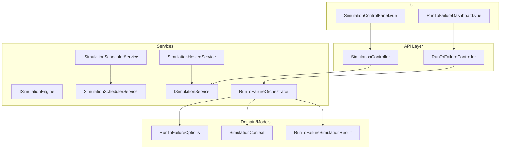
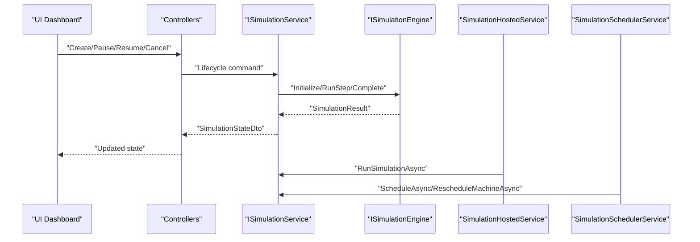
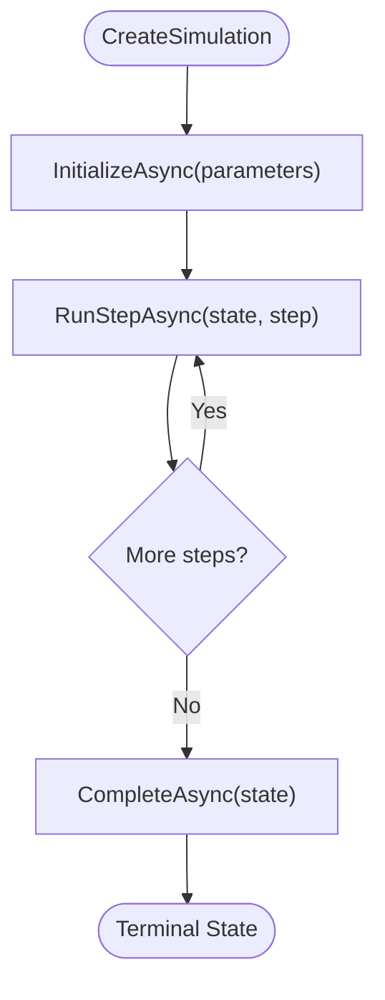
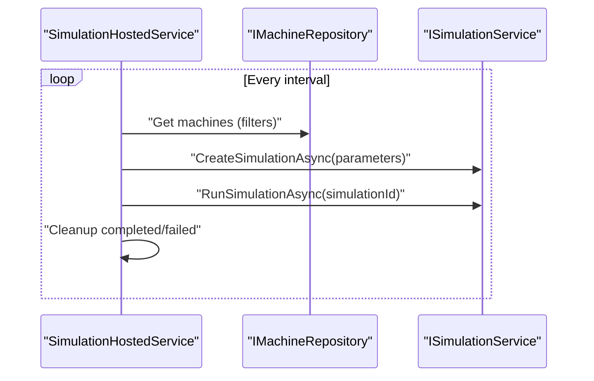
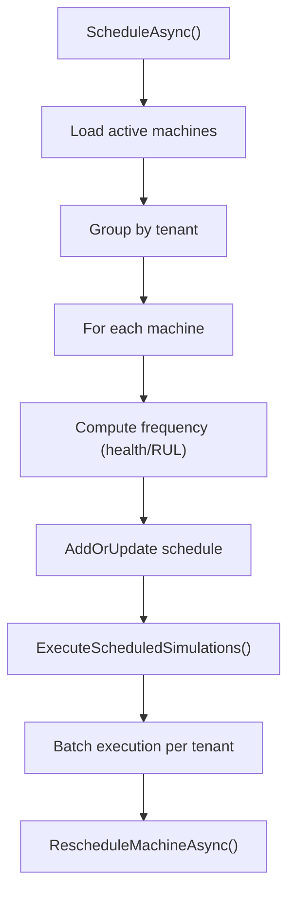
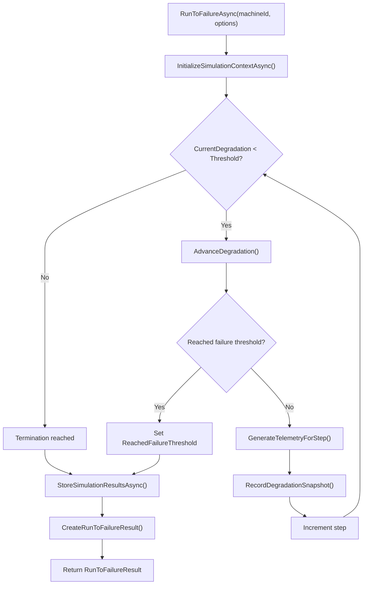
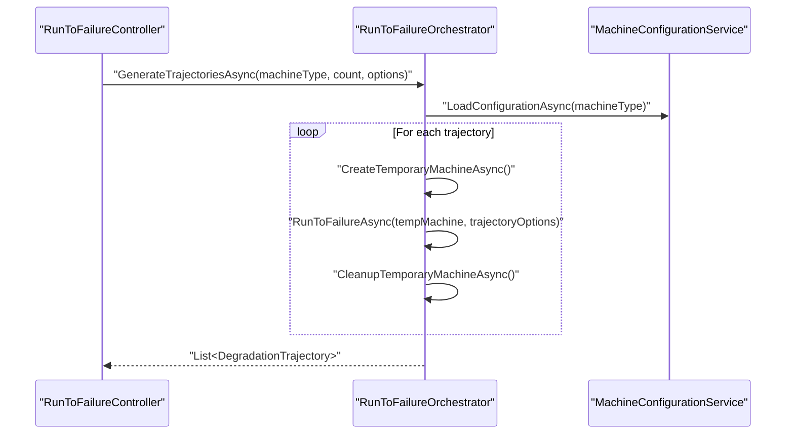
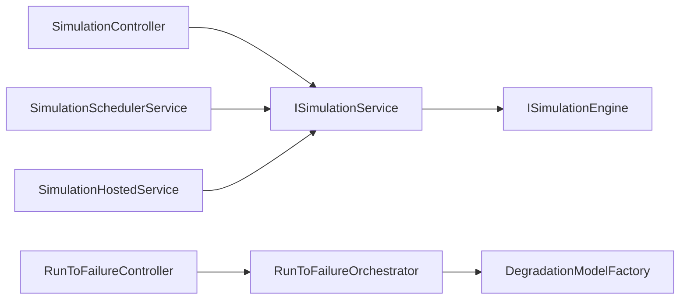

# Simulation Engine and Execution

<cite>
**Referenced Files in This Document**
- [SimulationController.cs](file://src/api/DigitalTwinPlatform.API/Controllers/SimulationController.cs)
- [RunToFailureController.cs](file://src/api/DigitalTwinPlatform.API/Controllers/RunToFailureController.cs)
- [ISimulationEngine.cs](file://src/api/DigitalTwinPlatform.API/Services/Simulation/ISimulationEngine.cs)
- [ISimulationService.cs](file://src/api/DigitalTwinPlatform.API/Services/Simulation/ISimulationService.cs)
- [ISimulationSchedulerService.cs](file://src/api/DigitalTwinPlatform.API/Services/Simulation/ISimulationSchedulerService.cs)
- [ISimulationSchedulerService.cs](file://src/api/DigitalTwinPlatform.API/Services/Simulation/ISimulationSchedulerService.cs)
- [SimulationSchedulerService.cs](file://src/api/DigitalTwinPlatform.API/Services/Simulation/SimulationSchedulerService.cs)
- [SimulationHostedService.cs](file://src/api/DigitalTwinPlatform.API/Services/Simulation/SimulationHostedService.cs)
- [RunToFailureOrchestrator.cs](file://src/api/DigitalTwinPlatform.API/Services/Simulation/RunToFailureOrchestrator.cs)
- [RunToFailureOptions.cs](file://src/api/DigitalTwinPlatform.API/Services/Simulation/RunToFailureOptions.cs)
- [DegradationModelFactory.cs](file://src/api/DigitalTwinPlatform.API/Services/Simulation/DegradationModels/DegradationModelFactory.cs)
- [SimulationIntegrationTests.cs](file://src/api/DigitalTwinPlatform.Tests/Integration/SimulationIntegrationTests.cs)
- [SimulationControlPanel.vue](file://src/ui/digital-twin-dashboard/src/components/simulation/SimulationControlPanel.vue)
- [RunToFailureDashboard.vue](file://src/ui/digital-twin-dashboard/src/components/simulation/RunToFailureDashboard.vue)
</cite>

## Table of Contents
1. [Introduction](#introduction)
2. [Project Structure](#project-structure)
3. [Core Components](#core-components)
4. [Architecture Overview](#architecture-overview)
5. [Detailed Component Analysis](#detailed-component-analysis)
6. [Dependency Analysis](#dependency-analysis)
7. [Performance Considerations](#performance-considerations)
8. [Troubleshooting Guide](#troubleshooting-guide)
9. [Conclusion](#conclusion)

## Introduction
This document explains the simulation engine and execution subsystem of the digital twin platform. It covers orchestration, scheduling, and real-time processing; the simulation lifecycle from initialization to completion; state management, progress tracking, and result aggregation; hosted services for background simulation processing; resource management and scalability; run-to-failure simulations, Monte Carlo-style analyses, and batch workflows; integration with the digital twin platform, real-time data streaming, and interactive controls; and performance optimization, memory management, and fault tolerance.

## Project Structure
The simulation subsystem spans API controllers, application services, domain entities, and UI components:
- Controllers expose endpoints for lifecycle control and run-to-failure workflows.
- Services encapsulate scheduling, orchestration, and execution.
- Models define simulation state, results, and options.
- UI components provide interactive controls and real-time dashboards.

**Diagram sources**
- [SimulationController.cs](file://src/api/DigitalTwinPlatform.API/Controllers/SimulationController.cs#L1-L140)
- [RunToFailureController.cs](file://src/api/DigitalTwinPlatform.API/Controllers/RunToFailureController.cs#L1-L122)
- [ISimulationEngine.cs](file://src/api/DigitalTwinPlatform.API/Services/Simulation/ISimulationEngine.cs#L1-L13)
- [ISimulationService.cs](file://src/api/DigitalTwinPlatform.API/Services/Simulation/ISimulationService.cs#L1-L20)
- [ISimulationSchedulerService.cs](file://src/api/DigitalTwinPlatform.API/Services/Simulation/ISimulationSchedulerService.cs#L1-L6)
- [SimulationSchedulerService.cs](file://src/api/DigitalTwinPlatform.API/Services/Simulation/SimulationSchedulerService.cs#L1-L244)
- [SimulationHostedService.cs](file://src/api/DigitalTwinPlatform.API/Services/Simulation/SimulationHostedService.cs#L1-L143)
- [RunToFailureOrchestrator.cs](file://src/api/DigitalTwinPlatform.API/Services/Simulation/RunToFailureOrchestrator.cs#L1-L502)
- [RunToFailureOptions.cs](file://src/api/DigitalTwinPlatform.API/Services/Simulation/RunToFailureOptions.cs#L1-L40)
- [SimulationControlPanel.vue](file://src/ui/digital-twin-dashboard/src/components/simulation/SimulationControlPanel.vue#L80-L127)
- [RunToFailureDashboard.vue](file://src/ui/digital-twin-dashboard/src/components/simulation/RunToFailureDashboard.vue#L127-L169)

**Section sources**
- [SimulationController.cs](file://src/api/DigitalTwinPlatform.API/Controllers/SimulationController.cs#L1-L140)
- [RunToFailureController.cs](file://src/api/DigitalTwinPlatform.API/Controllers/RunToFailureController.cs#L1-L122)
- [ISimulationEngine.cs](file://src/api/DigitalTwinPlatform.API/Services/Simulation/ISimulationEngine.cs#L1-L13)
- [ISimulationService.cs](file://src/api/DigitalTwinPlatform.API/Services/Simulation/ISimulationService.cs#L1-L20)
- [ISimulationSchedulerService.cs](file://src/api/DigitalTwinPlatform.API/Services/Simulation/ISimulationSchedulerService.cs#L1-L6)
- [SimulationSchedulerService.cs](file://src/api/DigitalTwinPlatform.API/Services/Simulation/SimulationSchedulerService.cs#L1-L244)
- [SimulationHostedService.cs](file://src/api/DigitalTwinPlatform.API/Services/Simulation/SimulationHostedService.cs#L1-L143)
- [RunToFailureOrchestrator.cs](file://src/api/DigitalTwinPlatform.API/Services/Simulation/RunToFailureOrchestrator.cs#L1-L502)
- [RunToFailureOptions.cs](file://src/api/DigitalTwinPlatform.API/Services/Simulation/RunToFailureOptions.cs#L1-L40)
- [SimulationControlPanel.vue](file://src/ui/digital-twin-dashboard/src/components/simulation/SimulationControlPanel.vue#L80-L127)
- [RunToFailureDashboard.vue](file://src/ui/digital-twin-dashboard/src/components/simulation/RunToFailureDashboard.vue#L127-L169)

## Core Components
- Simulation lifecycle controller: exposes endpoints to create, run, pause, resume, cancel, and list simulations.
- Run-to-failure controller: orchestrates run-to-failure simulations, trajectory generation, and result retrieval.
- Simulation engine: defines the execution contract for initialization, step execution, and completion/pause/resume/cancel.
- Simulation service: manages simulation state, progress metrics, and lifecycle transitions.
- Scheduler service: schedules periodic simulations per machine with tenant-aware batching and dynamic frequency.
- Hosted service: runs background simulation loops for continuously monitored machines.
- Orchestration: run-to-failure orchestrator coordinates degradation models, telemetry generation, and persistence.
- Options and models: encapsulate run-to-failure parameters, snapshots, and trajectories.

**Section sources**
- [SimulationController.cs](file://src/api/DigitalTwinPlatform.API/Controllers/SimulationController.cs#L1-L140)
- [RunToFailureController.cs](file://src/api/DigitalTwinPlatform.API/Controllers/RunToFailureController.cs#L1-L122)
- [ISimulationEngine.cs](file://src/api/DigitalTwinPlatform.API/Services/Simulation/ISimulationEngine.cs#L1-L13)
- [ISimulationService.cs](file://src/api/DigitalTwinPlatform.API/Services/Simulation/ISimulationService.cs#L1-L20)
- [ISimulationSchedulerService.cs](file://src/api/DigitalTwinPlatform.API/Services/Simulation/ISimulationSchedulerService.cs#L1-L6)
- [SimulationSchedulerService.cs](file://src/api/DigitalTwinPlatform.API/Services/Simulation/SimulationSchedulerService.cs#L1-L244)
- [SimulationHostedService.cs](file://src/api/DigitalTwinPlatform.API/Services/Simulation/SimulationHostedService.cs#L1-L143)
- [RunToFailureOrchestrator.cs](file://src/api/DigitalTwinPlatform.API/Services/Simulation/RunToFailureOrchestrator.cs#L1-L502)
- [RunToFailureOptions.cs](file://src/api/DigitalTwinPlatform.API/Services/Simulation/RunToFailureOptions.cs#L1-L40)

## Architecture Overview
The system separates concerns across controllers, services, and background workers:
- Controllers delegate to application services via mediator commands/queries.
- SimulationHostedService drives continuous simulation for operational equipment.
- SimulationSchedulerService dynamically schedules machines based on health and RUL.
- RunToFailureOrchestrator executes run-to-failure simulations with configurable termination criteria and telemetry generation.
- UI components provide interactive controls and real-time updates.

**Diagram sources**
- [SimulationController.cs](file://src/api/DigitalTwinPlatform.API/Controllers/SimulationController.cs#L1-L140)
- [ISimulationService.cs](file://src/api/DigitalTwinPlatform.API/Services/Simulation/ISimulationService.cs#L1-L20)
- [ISimulationEngine.cs](file://src/api/DigitalTwinPlatform.API/Services/Simulation/ISimulationEngine.cs#L1-L13)
- [SimulationHostedService.cs](file://src/api/DigitalTwinPlatform.API/Services/Simulation/SimulationHostedService.cs#L1-L143)
- [SimulationSchedulerService.cs](file://src/api/DigitalTwinPlatform.API/Services/Simulation/SimulationSchedulerService.cs#L1-L244)

## Detailed Component Analysis

### Simulation Lifecycle and Control Flow
- Creation: clients submit parameters and a machine identifier; the service creates a stateful simulation entity.
- Execution: step-wise progression advances internal state, updates metrics, and optionally validates statistical properties.
- Termination: completion, pause/resume, or cancellation transitions the state to terminal or paused states.
- Listing: retrieves active simulations for a given machine or across tenants.

**Diagram sources**
- [ISimulationEngine.cs](file://src/api/DigitalTwinPlatform.API/Services/Simulation/ISimulationEngine.cs#L1-L13)
- [ISimulationService.cs](file://src/api/DigitalTwinPlatform.API/Services/Simulation/ISimulationService.cs#L1-L20)

**Section sources**
- [ISimulationEngine.cs](file://src/api/DigitalTwinPlatform.API/Services/Simulation/ISimulationEngine.cs#L1-L13)
- [ISimulationService.cs](file://src/api/DigitalTwinPlatform.API/Services/Simulation/ISimulationService.cs#L1-L20)
- [SimulationController.cs](file://src/api/DigitalTwinPlatform.API/Controllers/SimulationController.cs#L1-L140)

### Simulation Hosted Service (Background Processing)
- Periodically selects machines (optionally filtered by status and IDs) and runs simulation steps.
- Maintains an in-memory dictionary of active simulations keyed by machine ID.
- On shutdown, cancels outstanding simulations and cleans up state.
- Integrates with tenant scoping and batching to manage throughput.

**Diagram sources**
- [SimulationHostedService.cs](file://src/api/DigitalTwinPlatform.API/Services/Simulation/SimulationHostedService.cs#L1-L143)

**Section sources**
- [SimulationHostedService.cs](file://src/api/DigitalTwinPlatform.API/Services/Simulation/SimulationHostedService.cs#L1-L143)

### Simulation Scheduler Service (Dynamic Scheduling)
- Schedules simulations per machine with frequency adjustments based on health classification and remaining useful life.
- Groups machines by tenant and executes in batches, rescheduling each machine after completion.
- Provides unschedule and reschedule operations and exposes scheduled machines.

**Diagram sources**
- [SimulationSchedulerService.cs](file://src/api/DigitalTwinPlatform.API/Services/Simulation/SimulationSchedulerService.cs#L1-L244)

**Section sources**
- [ISimulationSchedulerService.cs](file://src/api/DigitalTwinPlatform.API/Services/Simulation/ISimulationSchedulerService.cs#L1-L6)
- [SimulationSchedulerService.cs](file://src/api/DigitalTwinPlatform.API/Services/Simulation/SimulationSchedulerService.cs#L1-L244)

### Run-to-Failure Orchestration
- Initializes a simulation context from machine and configuration, selects a degradation model, and seeds randomness.
- Iteratively advances degradation until termination conditions are met (threshold, max steps, or max time).
- Optionally generates telemetry per step and records degradation snapshots for trajectory analysis.
- Aggregates results into a structured output with time-to-failure, trajectory, and telemetry.

**Diagram sources**
- [RunToFailureOrchestrator.cs](file://src/api/DigitalTwinPlatform.API/Services/Simulation/RunToFailureOrchestrator.cs#L1-L502)
- [RunToFailureOptions.cs](file://src/api/DigitalTwinPlatform.API/Services/Simulation/RunToFailureOptions.cs#L1-L40)

**Section sources**
- [RunToFailureOrchestrator.cs](file://src/api/DigitalTwinPlatform.API/Services/Simulation/RunToFailureOrchestrator.cs#L1-L502)
- [RunToFailureOptions.cs](file://src/api/DigitalTwinPlatform.API/Services/Simulation/RunToFailureOptions.cs#L1-L40)

### Monte Carlo Trajectory Generation
- Generates multiple trajectories for a machine type by varying random seeds and capturing degradation snapshots.
- Returns a collection of trajectories with associated time-to-failure for statistical analysis.

**Diagram sources**
- [RunToFailureController.cs](file://src/api/DigitalTwinPlatform.API/Controllers/RunToFailureController.cs#L1-L122)
- [RunToFailureOrchestrator.cs](file://src/api/DigitalTwinPlatform.API/Services/Simulation/RunToFailureOrchestrator.cs#L317-L370)

**Section sources**
- [RunToFailureController.cs](file://src/api/DigitalTwinPlatform.API/Controllers/RunToFailureController.cs#L56-L85)
- [RunToFailureOrchestrator.cs](file://src/api/DigitalTwinPlatform.API/Services/Simulation/RunToFailureOrchestrator.cs#L317-L370)

### Batch Processing Workflows
- The integration tests demonstrate batch simulation processing across multiple machines, progress tracking, and result aggregation.
- The hosted service and scheduler enable scalable, tenant-aware batch execution.

**Section sources**
- [SimulationIntegrationTests.cs](file://src/api/DigitalTwinPlatform.Tests/Integration/SimulationIntegrationTests.cs#L306-L318)
- [SimulationIntegrationTests.cs](file://src/api/DigitalTwinPlatform.Tests/Integration/SimulationIntegrationTests.cs#L441-L453)

### Real-Time Controls and UI Integration
- The UI provides interactive controls to create, run, pause, resume, and cancel simulations.
- Real-time updates reflect progress metrics and validation flags.
- Run-to-failure dashboard supports single-run and trajectory generation with configurable options.

**Section sources**
- [SimulationControlPanel.vue](file://src/ui/digital-twin-dashboard/src/components/simulation/SimulationControlPanel.vue#L80-L127)
- [RunToFailureDashboard.vue](file://src/ui/digital-twin-dashboard/src/components/simulation/RunToFailureDashboard.vue#L127-L169)

## Dependency Analysis
- Controllers depend on mediator commands/queries and delegate to application services.
- Services depend on repositories, unit of work, and domain models.
- Hosted and scheduler services coordinate with repositories and tenant services.
- Orchestration composes degradation models and telemetry generators.

**Diagram sources**
- [SimulationController.cs](file://src/api/DigitalTwinPlatform.API/Controllers/SimulationController.cs#L1-L140)
- [RunToFailureController.cs](file://src/api/DigitalTwinPlatform.API/Controllers/RunToFailureController.cs#L1-L122)
- [ISimulationService.cs](file://src/api/DigitalTwinPlatform.API/Services/Simulation/ISimulationService.cs#L1-L20)
- [ISimulationEngine.cs](file://src/api/DigitalTwinPlatform.API/Services/Simulation/ISimulationEngine.cs#L1-L13)
- [SimulationSchedulerService.cs](file://src/api/DigitalTwinPlatform.API/Services/Simulation/SimulationSchedulerService.cs#L1-L244)
- [SimulationHostedService.cs](file://src/api/DigitalTwinPlatform.API/Services/Simulation/SimulationHostedService.cs#L1-L143)
- [RunToFailureOrchestrator.cs](file://src/api/DigitalTwinPlatform.API/Services/Simulation/RunToFailureOrchestrator.cs#L1-L502)
- [DegradationModelFactory.cs](file://src/api/DigitalTwinPlatform.API/Services/Simulation/DegradationModels/DegradationModelFactory.cs#L34-L83)

**Section sources**
- [DegradationModelFactory.cs](file://src/api/DigitalTwinPlatform.API/Services/Simulation/DegradationModels/DegradationModelFactory.cs#L34-L83)

## Performance Considerations
- Concurrency and batching: scheduler and hosted service execute simulations in parallel per tenant with configurable batch sizes to balance throughput and resource utilization.
- Frequency tuning: dynamic scheduling reduces frequency for healthy machines and increases it for failing ones, minimizing unnecessary computation.
- Memory management: telemetry and trajectory collections grow with steps; consider limiting max steps or periodically flushing to storage.
- Statistical validation: periodic validation reduces data size and ensures data quality without impacting real-time responsiveness.
- Fault tolerance: logging and cleanup ensure failed simulations are removed from active sets; hosted service cancels pending simulations on shutdown.

[No sources needed since this section provides general guidance]

## Troubleshooting Guide
- Simulation errors: logs include machine and simulation identifiers; exceptions during step execution surface to the caller.
- Hosted service failures: iteration failures are logged; active simulations in terminal states are cleaned up.
- Scheduler errors: scheduling and execution errors are logged with machine context; reschedule and unschedule APIs help recover from transient failures.
- Integration tests: demonstrate telemetry integration and batch progress tracking, useful for validating end-to-end behavior.

**Section sources**
- [SimulationHostedService.cs](file://src/api/DigitalTwinPlatform.API/Services/Simulation/SimulationHostedService.cs#L84-L112)
- [SimulationSchedulerService.cs](file://src/api/DigitalTwinPlatform.API/Services/Simulation/SimulationSchedulerService.cs#L198-L214)
- [SimulationIntegrationTests.cs](file://src/api/DigitalTwinPlatform.Tests/Integration/SimulationIntegrationTests.cs#L253-L318)

## Conclusion
The simulation subsystem provides a robust, tenant-aware, and scalable framework for run-to-failure simulations, batch processing, and continuous monitoring. It integrates tightly with the digital twin platform via controllers, services, and UI components, enabling real-time controls, progress tracking, and result aggregation. With dynamic scheduling, background processing, and fault-tolerant designs, the system supports both interactive and automated simulation workflows.