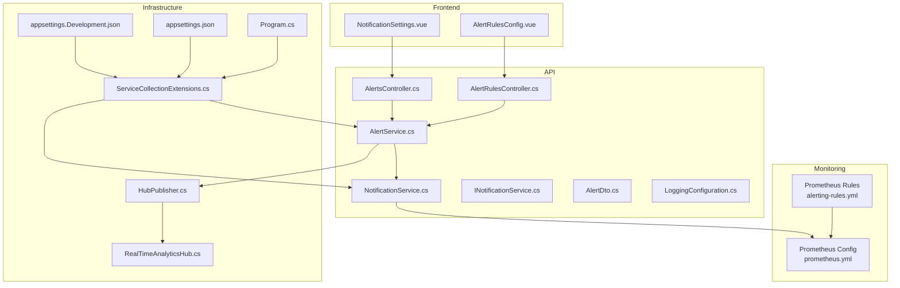
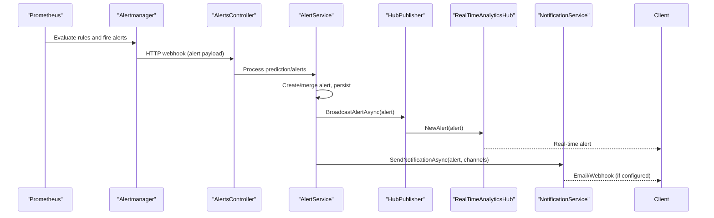
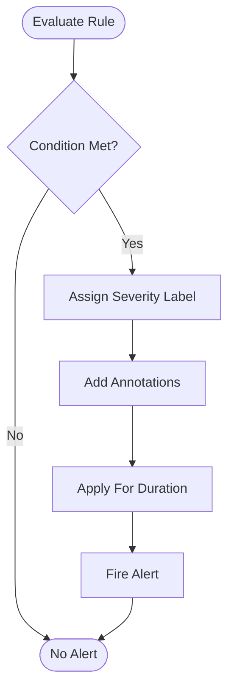
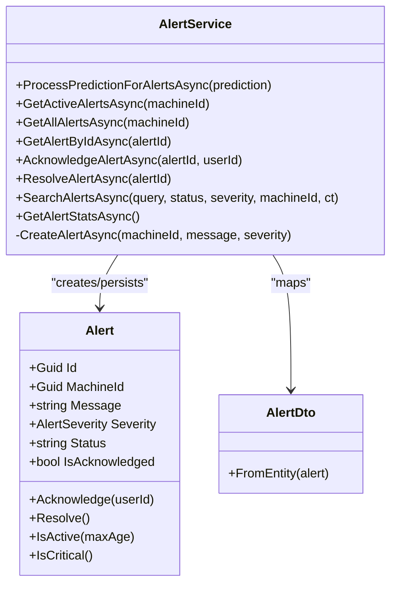
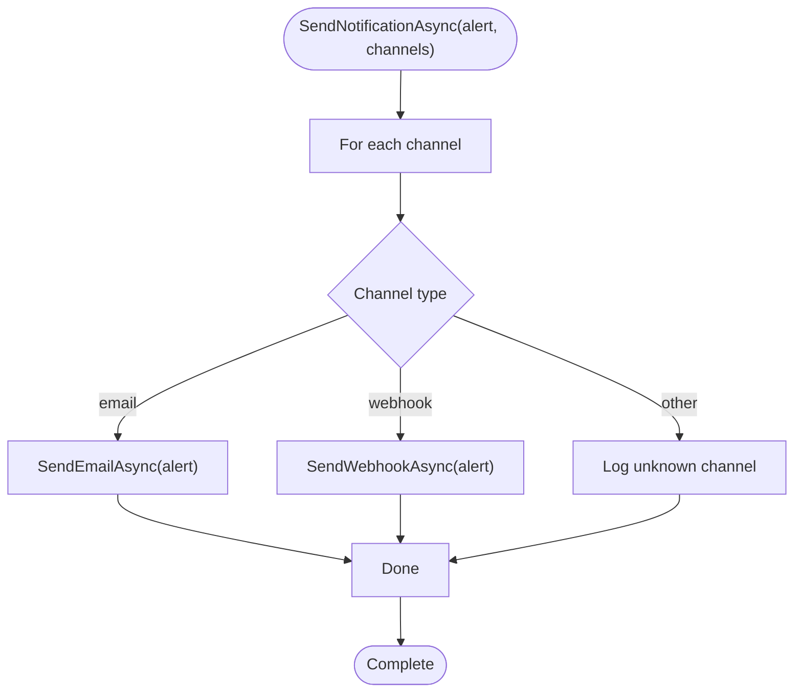
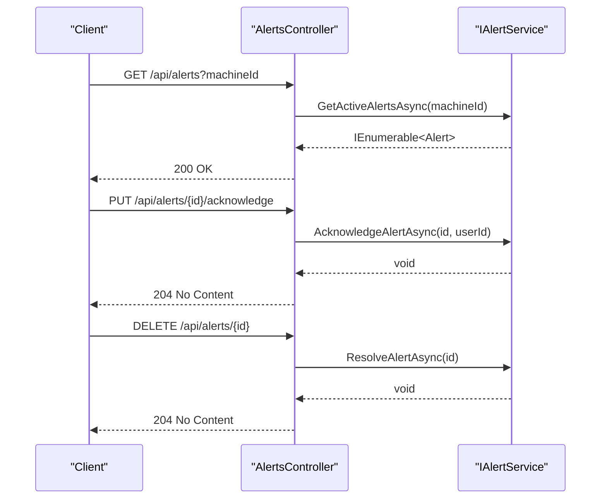
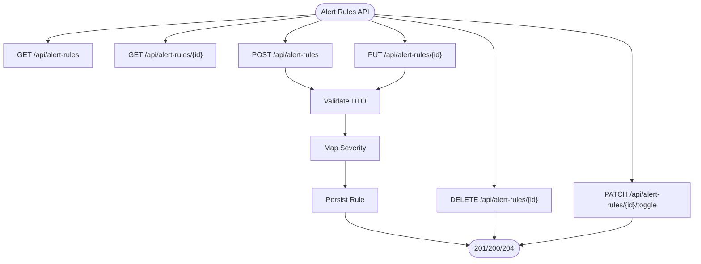
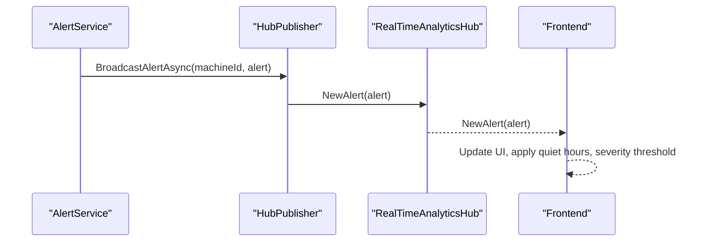
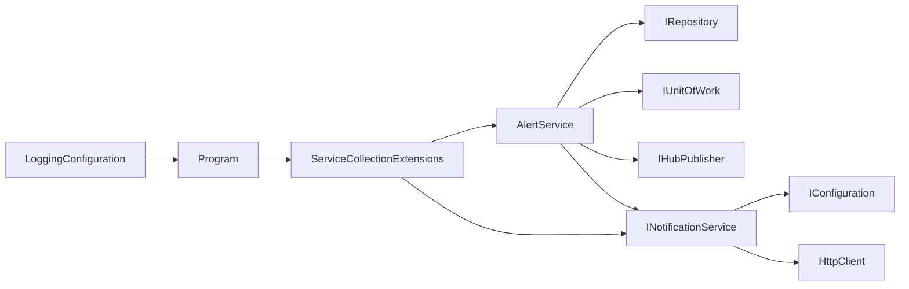

# Alerting and Notification Systems

<cite>
**Referenced Files in This Document**
- [alerting-rules.yml](file://monitoring/prometheus/alerting-rules.yml)
- [prometheus.yml](file://monitoring/prometheus/prometheus.yml)
- [AlertRulesController.cs](file://src/api/DigitalTwinPlatform.API/Controllers/AlertRulesController.cs)
- [AlertsController.cs](file://src/api/DigitalTwinPlatform.API/Controllers/AlertsController.cs)
- [AlertService.cs](file://src/api/DigitalTwinPlatform.API/Services/Core/AlertService.cs)
- [NotificationService.cs](file://src/api/DigitalTwinPlatform.API/Services/Core/NotificationService.cs)
- [INotificationService.cs](file://src/api/DigitalTwinPlatform.API/Services/Core/INotificationService.cs)
- [AlertDto.cs](file://src/api/DigitalTwinPlatform.Application/Alerts/Models/AlertDto.cs)
- [Alert.cs](file://src/api/DigitalTwinPlatform.Domain/Entities/Alert.cs)
- [Program.cs](file://src/api/DigitalTwinPlatform.API/Program.cs)
- [ServiceCollectionExtensions.cs](file://src/api/DigitalTwinPlatform.API/Extensions/ServiceCollectionExtensions.cs)
- [LoggingConfiguration.cs](file://src/api/DigitalTwinPlatform.API/Infrastructure/LoggingConfiguration.cs)
- [RealTimeAnalyticsHub.cs](file://src/api/DigitalTwinPlatform.API/Hubs/RealTimeAnalyticsHub.cs)
- [HubPublisher.cs](file://src/api/DigitalTwinPlatform.API/Services/Infrastructure/HubPublisher.cs)
- [appsettings.json](file://src/api/DigitalTwinPlatform.API/appsettings.json)
- [appsettings.Development.json](file://src/api/DigitalTwinPlatform.API/appsettings.Development.json)
- [NotificationSettings.vue](file://src/frontend/src/components/settings/NotificationSettings.vue)
- [AlertRulesConfig.vue](file://src/frontend/src/components/alerts/AlertRulesConfig.vue)
</cite>

## Table of Contents
1. [Introduction](#introduction)
2. [Project Structure](#project-structure)
3. [Core Components](#core-components)
4. [Architecture Overview](#architecture-overview)
5. [Detailed Component Analysis](#detailed-component-analysis)
6. [Dependency Analysis](#dependency-analysis)
7. [Performance Considerations](#performance-considerations)
8. [Troubleshooting Guide](#troubleshooting-guide)
9. [Conclusion](#conclusion)
10. [Appendices](#appendices)

## Introduction
This document describes the alerting and notification systems for the Digital Twin Platform. It covers Prometheus-based alerting rules, severity levels, notification channels, and escalation policies. It documents the alert service implementation for processing alerts, managing alert lifecycles, and coordinating notifications. It also details the notification service capabilities (email, webhook), the alerts controller for alert management and resolution tracking, and practical examples for rule creation, template configuration, and suppression. Finally, it addresses alert fatigue prevention, notification preferences, and integration with incident response workflows for industrial operations.

## Project Structure
The alerting and notification system spans:
- Prometheus configuration and alert rules
- API controllers for alert rules and alert management
- Core services for alert processing and notifications
- SignalR hubs and publisher for real-time alert delivery
- Frontend components for notification settings and alert rule configuration

**Diagram sources**
- [alerting-rules.yml](file://monitoring/prometheus/alerting-rules.yml#L1-L184)
- [prometheus.yml](file://monitoring/prometheus/prometheus.yml#L1-L148)
- [AlertRulesController.cs](file://src/api/DigitalTwinPlatform.API/Controllers/AlertRulesController.cs#L1-L284)
- [AlertsController.cs](file://src/api/DigitalTwinPlatform.API/Controllers/AlertsController.cs#L1-L187)
- [AlertService.cs](file://src/api/DigitalTwinPlatform.API/Services/Core/AlertService.cs#L1-L228)
- [NotificationService.cs](file://src/api/DigitalTwinPlatform.API/Services/Core/NotificationService.cs#L1-L159)
- [INotificationService.cs](file://src/api/DigitalTwinPlatform.API/Services/Core/INotificationService.cs#L1-L22)
- [AlertDto.cs](file://src/api/DigitalTwinPlatform.Application/Alerts/Models/AlertDto.cs#L1-L48)
- [LoggingConfiguration.cs](file://src/api/DigitalTwinPlatform.API/Infrastructure/LoggingConfiguration.cs#L1-L58)
- [HubPublisher.cs](file://src/api/DigitalTwinPlatform.API/Services/Infrastructure/HubPublisher.cs#L1-L104)
- [RealTimeAnalyticsHub.cs](file://src/api/DigitalTwinPlatform.API/Hubs/RealTimeAnalyticsHub.cs#L1-L310)
- [Program.cs](file://src/api/DigitalTwinPlatform.API/Program.cs#L1-L87)
- [ServiceCollectionExtensions.cs](file://src/api/DigitalTwinPlatform.API/Extensions/ServiceCollectionExtensions.cs#L1-L423)
- [appsettings.json](file://src/api/DigitalTwinPlatform.API/appsettings.json#L1-L93)
- [appsettings.Development.json](file://src/api/DigitalTwinPlatform.API/appsettings.Development.json#L1-L71)
- [NotificationSettings.vue](file://src/frontend/src/components/settings/NotificationSettings.vue#L124-L188)
- [AlertRulesConfig.vue](file://src/frontend/src/components/alerts/AlertRulesConfig.vue#L50-L98)

**Section sources**
- [alerting-rules.yml](file://monitoring/prometheus/alerting-rules.yml#L1-L184)
- [prometheus.yml](file://monitoring/prometheus/prometheus.yml#L1-L148)
- [AlertRulesController.cs](file://src/api/DigitalTwinPlatform.API/Controllers/AlertRulesController.cs#L1-L284)
- [AlertsController.cs](file://src/api/DigitalTwinPlatform.API/Controllers/AlertsController.cs#L1-L187)
- [AlertService.cs](file://src/api/DigitalTwinPlatform.API/Services/Core/AlertService.cs#L1-L228)
- [NotificationService.cs](file://src/api/DigitalTwinPlatform.API/Services/Core/NotificationService.cs#L1-L159)
- [INotificationService.cs](file://src/api/DigitalTwinPlatform.API/Services/Core/INotificationService.cs#L1-L22)
- [AlertDto.cs](file://src/api/DigitalTwinPlatform.Application/Alerts/Models/AlertDto.cs#L1-L48)
- [Alert.cs](file://src/api/DigitalTwinPlatform.Domain/Entities/Alert.cs#L1-L114)
- [Program.cs](file://src/api/DigitalTwinPlatform.API/Program.cs#L1-L87)
- [ServiceCollectionExtensions.cs](file://src/api/DigitalTwinPlatform.API/Extensions/ServiceCollectionExtensions.cs#L1-L423)
- [LoggingConfiguration.cs](file://src/api/DigitalTwinPlatform.API/Infrastructure/LoggingConfiguration.cs#L1-L58)
- [RealTimeAnalyticsHub.cs](file://src/api/DigitalTwinPlatform.API/Hubs/RealTimeAnalyticsHub.cs#L1-L310)
- [HubPublisher.cs](file://src/api/DigitalTwinPlatform.API/Services/Infrastructure/HubPublisher.cs#L1-L104)
- [appsettings.json](file://src/api/DigitalTwinPlatform.API/appsettings.json#L1-L93)
- [appsettings.Development.json](file://src/api/DigitalTwinPlatform.API/appsettings.Development.json#L1-L71)
- [NotificationSettings.vue](file://src/frontend/src/components/settings/NotificationSettings.vue#L124-L188)
- [AlertRulesConfig.vue](file://src/frontend/src/components/alerts/AlertRulesConfig.vue#L50-L98)

## Core Components
- Prometheus alerting rules define severity levels and conditions for system health, database, cache, frontend, host resources, and business metrics. See [alerting-rules.yml](file://monitoring/prometheus/alerting-rules.yml#L3-L184).
- API controllers expose endpoints to manage alert rules and alerts lifecycle. See [AlertRulesController.cs](file://src/api/DigitalTwinPlatform.API/Controllers/AlertRulesController.cs#L28-L216) and [AlertsController.cs](file://src/api/DigitalTwinPlatform.API/Controllers/AlertsController.cs#L30-L173).
- AlertService orchestrates alert creation, deduplication, persistence, real-time broadcasting, and notification dispatch. See [AlertService.cs](file://src/api/DigitalTwinPlatform.API/Services/Core/AlertService.cs#L85-L227).
- NotificationService handles email and webhook dispatch with configuration-driven recipients and payload. See [NotificationService.cs](file://src/api/DigitalTwinPlatform.API/Services/Core/NotificationService.cs#L8-L159).
- SignalR integration broadcasts alerts to clients in real time. See [HubPublisher.cs](file://src/api/DigitalTwinPlatform.API/Services/Infrastructure/HubPublisher.cs#L71-L90) and [RealTimeAnalyticsHub.cs](file://src/api/DigitalTwinPlatform.API/Hubs/RealTimeAnalyticsHub.cs#L78-L113).
- Frontend components support notification preferences and alert rule configuration. See [NotificationSettings.vue](file://src/frontend/src/components/settings/NotificationSettings.vue#L124-L188) and [AlertRulesConfig.vue](file://src/frontend/src/components/alerts/AlertRulesConfig.vue#L50-L98).

**Section sources**
- [alerting-rules.yml](file://monitoring/prometheus/alerting-rules.yml#L3-L184)
- [AlertRulesController.cs](file://src/api/DigitalTwinPlatform.API/Controllers/AlertRulesController.cs#L28-L216)
- [AlertsController.cs](file://src/api/DigitalTwinPlatform.API/Controllers/AlertsController.cs#L30-L173)
- [AlertService.cs](file://src/api/DigitalTwinPlatform.API/Services/Core/AlertService.cs#L85-L227)
- [NotificationService.cs](file://src/api/DigitalTwinPlatform.API/Services/Core/NotificationService.cs#L8-L159)
- [HubPublisher.cs](file://src/api/DigitalTwinPlatform.API/Services/Infrastructure/HubPublisher.cs#L71-L90)
- [RealTimeAnalyticsHub.cs](file://src/api/DigitalTwinPlatform.API/Hubs/RealTimeAnalyticsHub.cs#L78-L113)
- [NotificationSettings.vue](file://src/frontend/src/components/settings/NotificationSettings.vue#L124-L188)
- [AlertRulesConfig.vue](file://src/frontend/src/components/alerts/AlertRulesConfig.vue#L50-L98)

## Architecture Overview
The alerting pipeline integrates Prometheus rules, the API alert service, SignalR, and notification channels.

**Diagram sources**
- [prometheus.yml](file://monitoring/prometheus/prometheus.yml#L12-L16)
- [AlertsController.cs](file://src/api/DigitalTwinPlatform.API/Controllers/AlertsController.cs#L30-L173)
- [AlertService.cs](file://src/api/DigitalTwinPlatform.API/Services/Core/AlertService.cs#L107-L155)
- [HubPublisher.cs](file://src/api/DigitalTwinPlatform.API/Services/Infrastructure/HubPublisher.cs#L71-L90)
- [RealTimeAnalyticsHub.cs](file://src/api/DigitalTwinPlatform.API/Hubs/RealTimeAnalyticsHub.cs#L78-L113)
- [NotificationService.cs](file://src/api/DigitalTwinPlatform.API/Services/Core/NotificationService.cs#L21-L45)

## Detailed Component Analysis

### Prometheus Alerting Rules Configuration
- Groups and rules define severity levels and conditions for:
  - API health (down, error rate, latency)
  - Database (down, connections, cache hit ratio)
  - Redis (down, memory, connections)
  - Frontend (down, errors)
  - Host resources (CPU, memory, disk)
  - Business metrics (user activity, maintenance requests, data processing delay)
- Severity labels are applied consistently across rules. See [alerting-rules.yml](file://monitoring/prometheus/alerting-rules.yml#L3-L184).

**Diagram sources**
- [alerting-rules.yml](file://monitoring/prometheus/alerting-rules.yml#L3-L184)

**Section sources**
- [alerting-rules.yml](file://monitoring/prometheus/alerting-rules.yml#L3-L184)

### Alert Service Implementation
- Processes predictions and creates alerts for remaining useful life thresholds and failure probability.
- Deduplicates active alerts per machine and message.
- Persists alerts, publishes via SignalR, and dispatches notifications for Warning and Critical severities.
- Supports acknowledgment and resolution operations.
- Aggregates statistics by status and severity.

**Diagram sources**
- [AlertService.cs](file://src/api/DigitalTwinPlatform.API/Services/Core/AlertService.cs#L85-L227)
- [Alert.cs](file://src/api/DigitalTwinPlatform.Domain/Entities/Alert.cs#L11-L114)
- [AlertDto.cs](file://src/api/DigitalTwinPlatform.Application/Alerts/Models/AlertDto.cs#L5-L47)

**Section sources**
- [AlertService.cs](file://src/api/DigitalTwinPlatform.API/Services/Core/AlertService.cs#L107-L155)
- [AlertService.cs](file://src/api/DigitalTwinPlatform.API/Services/Core/AlertService.cs#L157-L227)
- [Alert.cs](file://src/api/DigitalTwinPlatform.Domain/Entities/Alert.cs#L75-L114)
- [AlertDto.cs](file://src/api/DigitalTwinPlatform.Application/Alerts/Models/AlertDto.cs#L26-L47)

### Notification Service Capabilities
- Email: SMTP configuration loaded from settings; generates HTML body and recipient list; logs failures but does not interrupt flow.
- Webhook: Placeholder payload logging; can be extended to call external systems.
- Channel testing: Basic connectivity test stub.

**Diagram sources**
- [NotificationService.cs](file://src/api/DigitalTwinPlatform.API/Services/Core/NotificationService.cs#L21-L45)
- [NotificationService.cs](file://src/api/DigitalTwinPlatform.API/Services/Core/NotificationService.cs#L47-L141)

**Section sources**
- [NotificationService.cs](file://src/api/DigitalTwinPlatform.API/Services/Core/NotificationService.cs#L21-L45)
- [NotificationService.cs](file://src/api/DigitalTwinPlatform.API/Services/Core/NotificationService.cs#L89-L120)
- [NotificationService.cs](file://src/api/DigitalTwinPlatform.API/Services/Core/NotificationService.cs#L122-L141)
- [INotificationService.cs](file://src/api/DigitalTwinPlatform.API/Services/Core/INotificationService.cs#L8-L22)

### Alerts Controller for Alert Management
- Retrieves active and all alerts, supports filtering by machine.
- Acknowledges alerts and resolves them.
- Provides statistics and text search with status/severity filters.

**Diagram sources**
- [AlertsController.cs](file://src/api/DigitalTwinPlatform.API/Controllers/AlertsController.cs#L30-L122)
- [AlertsController.cs](file://src/api/DigitalTwinPlatform.API/Controllers/AlertsController.cs#L73-L104)

**Section sources**
- [AlertsController.cs](file://src/api/DigitalTwinPlatform.API/Controllers/AlertsController.cs#L30-L122)
- [AlertsController.cs](file://src/api/DigitalTwinPlatform.API/Controllers/AlertsController.cs#L73-L104)
- [AlertsController.cs](file://src/api/DigitalTwinPlatform.API/Controllers/AlertsController.cs#L131-L146)

### Alert Rules Controller for Rule Management
- CRUD operations for alert rules including enabling/disabling, severity mapping, and escalation configuration.
- Supports toggling rule status.

**Diagram sources**
- [AlertRulesController.cs](file://src/api/DigitalTwinPlatform.API/Controllers/AlertRulesController.cs#L28-L216)

**Section sources**
- [AlertRulesController.cs](file://src/api/DigitalTwinPlatform.API/Controllers/AlertRulesController.cs#L28-L216)

### Real-Time Delivery and Frontend Preferences
- SignalR hubs broadcast alerts to subscribed clients.
- Frontend components allow users to configure notification preferences and alert rule visibility.

**Diagram sources**
- [HubPublisher.cs](file://src/api/DigitalTwinPlatform.API/Services/Infrastructure/HubPublisher.cs#L71-L90)
- [RealTimeAnalyticsHub.cs](file://src/api/DigitalTwinPlatform.API/Hubs/RealTimeAnalyticsHub.cs#L78-L113)
- [NotificationSettings.vue](file://src/frontend/src/components/settings/NotificationSettings.vue#L124-L188)

**Section sources**
- [HubPublisher.cs](file://src/api/DigitalTwinPlatform.API/Services/Infrastructure/HubPublisher.cs#L71-L90)
- [RealTimeAnalyticsHub.cs](file://src/api/DigitalTwinPlatform.API/Hubs/RealTimeAnalyticsHub.cs#L78-L113)
- [NotificationSettings.vue](file://src/frontend/src/components/settings/NotificationSettings.vue#L124-L188)

## Dependency Analysis
- AlertService depends on repository, unit of work, SignalR publisher, and notification service.
- NotificationService depends on configuration and HTTP client.
- DI registration wires services and SignalR hubs.
- Logging middleware provides structured request logging.

**Diagram sources**
- [AlertService.cs](file://src/api/DigitalTwinPlatform.API/Services/Core/AlertService.cs#L85-L105)
- [NotificationService.cs](file://src/api/DigitalTwinPlatform.API/Services/Core/NotificationService.cs#L8-L19)
- [ServiceCollectionExtensions.cs](file://src/api/DigitalTwinPlatform.API/Extensions/ServiceCollectionExtensions.cs#L266-L267)
- [Program.cs](file://src/api/DigitalTwinPlatform.API/Program.cs#L52-L80)
- [LoggingConfiguration.cs](file://src/api/DigitalTwinPlatform.API/Infrastructure/LoggingConfiguration.cs#L27-L56)

**Section sources**
- [AlertService.cs](file://src/api/DigitalTwinPlatform.API/Services/Core/AlertService.cs#L85-L105)
- [NotificationService.cs](file://src/api/DigitalTwinPlatform.API/Services/Core/NotificationService.cs#L8-L19)
- [ServiceCollectionExtensions.cs](file://src/api/DigitalTwinPlatform.API/Extensions/ServiceCollectionExtensions.cs#L266-L267)
- [Program.cs](file://src/api/DigitalTwinPlatform.API/Program.cs#L52-L80)
- [LoggingConfiguration.cs](file://src/api/DigitalTwinPlatform.API/Infrastructure/LoggingConfiguration.cs#L27-L56)

## Performance Considerations
- Prometheus evaluation interval and scrape intervals are tuned for responsiveness and resource usage. See [prometheus.yml](file://monitoring/prometheus/prometheus.yml#L3-L6).
- API query limits and timeouts are configured to prevent overload. See [prometheus.yml](file://monitoring/prometheus/prometheus.yml#L137-L143).
- AlertService avoids duplicate alerts and performs minimal branching for alert creation. See [AlertService.cs](file://src/api/DigitalTwinPlatform.API/Services/Core/AlertService.cs#L126-L155).
- SignalR hub options are configured for throughput and message sizes. See [ServiceCollectionExtensions.cs](file://src/api/DigitalTwinPlatform.API/Extensions/ServiceCollectionExtensions.cs#L106-L132).

[No sources needed since this section provides general guidance]

## Troubleshooting Guide
- Email notifications not sent:
  - Verify SMTP configuration keys and credentials. See [NotificationService.cs](file://src/api/DigitalTwinPlatform.API/Services/Core/NotificationService.cs#L89-L100) and [appsettings.json](file://src/api/DigitalTwinPlatform.API/appsettings.json#L1-L93).
- Webhook channel not firing:
  - Confirm webhook URL placeholder and payload logging. See [NotificationService.cs](file://src/api/DigitalTwinPlatform.API/Services/Core/NotificationService.cs#L122-L141).
- Alerts not appearing in UI:
  - Ensure SignalR groups and broadcasting are active. See [HubPublisher.cs](file://src/api/DigitalTwinPlatform.API/Services/Infrastructure/HubPublisher.cs#L71-L90) and [RealTimeAnalyticsHub.cs](file://src/api/DigitalTwinPlatform.API/Hubs/RealTimeAnalyticsHub.cs#L78-L113).
- Request logging and timing:
  - Review structured logging middleware behavior. See [LoggingConfiguration.cs](file://src/api/DigitalTwinPlatform.API/Infrastructure/LoggingConfiguration.cs#L27-L56).

**Section sources**
- [NotificationService.cs](file://src/api/DigitalTwinPlatform.API/Services/Core/NotificationService.cs#L89-L100)
- [NotificationService.cs](file://src/api/DigitalTwinPlatform.API/Services/Core/NotificationService.cs#L122-L141)
- [appsettings.json](file://src/api/DigitalTwinPlatform.API/appsettings.json#L1-L93)
- [HubPublisher.cs](file://src/api/DigitalTwinPlatform.API/Services/Infrastructure/HubPublisher.cs#L71-L90)
- [RealTimeAnalyticsHub.cs](file://src/api/DigitalTwinPlatform.API/Hubs/RealTimeAnalyticsHub.cs#L78-L113)
- [LoggingConfiguration.cs](file://src/api/DigitalTwinPlatform.API/Infrastructure/LoggingConfiguration.cs#L27-L56)

## Conclusion
The Digital Twin Platform implements a robust alerting and notification system combining Prometheus rules, a dedicated alert service, real-time SignalR delivery, and configurable notification channels. The APIs provide lifecycle management for alerts and rules, while frontend components enable user preferences and rule configuration. The design emphasizes reliability, scalability, and operability for industrial operations.

[No sources needed since this section summarizes without analyzing specific files]

## Appendices

### Practical Examples

- Creating an alert rule
  - Use the Alert Rules API to define name, description, severity, condition, notification channels, and escalation settings. See [AlertRulesController.cs](file://src/api/DigitalTwinPlatform.API/Controllers/AlertRulesController.cs#L66-L102) and [AlertRulesConfig.vue](file://src/frontend/src/components/alerts/AlertRulesConfig.vue#L50-L98).

- Notification template configuration
  - Configure SMTP settings for email and extend webhook payload as needed. See [NotificationService.cs](file://src/api/DigitalTwinPlatform.API/Services/Core/NotificationService.cs#L89-L100) and [NotificationService.cs](file://src/api/DigitalTwinPlatform.API/Services/Core/NotificationService.cs#L122-L141).

- Alert suppression mechanisms
  - Use Prometheus recording rules to precompute frequently used expressions and reduce noise. See [alerting-rules.yml](file://monitoring/prometheus/alerting-rules.yml#L165-L184).

- Managing alerts and resolution
  - Acknowledge and resolve alerts via the Alerts API. See [AlertsController.cs](file://src/api/DigitalTwinPlatform.API/Controllers/AlertsController.cs#L73-L104).

- Alert fatigue prevention and preferences
  - Configure severity thresholds and quiet hours in the frontend settings. See [NotificationSettings.vue](file://src/frontend/src/components/settings/NotificationSettings.vue#L124-L188).

**Section sources**
- [AlertRulesController.cs](file://src/api/DigitalTwinPlatform.API/Controllers/AlertRulesController.cs#L66-L102)
- [AlertRulesConfig.vue](file://src/frontend/src/components/alerts/AlertRulesConfig.vue#L50-L98)
- [NotificationService.cs](file://src/api/DigitalTwinPlatform.API/Services/Core/NotificationService.cs#L89-L100)
- [NotificationService.cs](file://src/api/DigitalTwinPlatform.API/Services/Core/NotificationService.cs#L122-L141)
- [alerting-rules.yml](file://monitoring/prometheus/alerting-rules.yml#L165-L184)
- [AlertsController.cs](file://src/api/DigitalTwinPlatform.API/Controllers/AlertsController.cs#L73-L104)
- [NotificationSettings.vue](file://src/frontend/src/components/settings/NotificationSettings.vue#L124-L188)