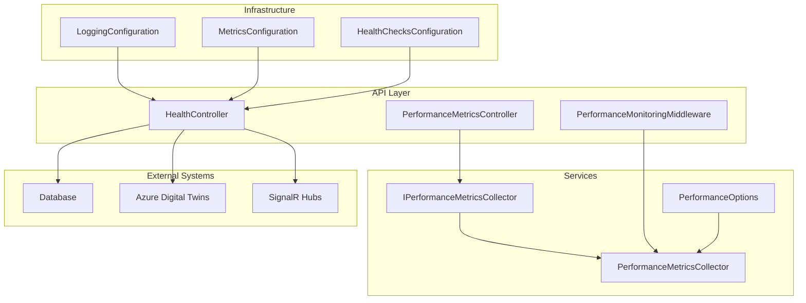
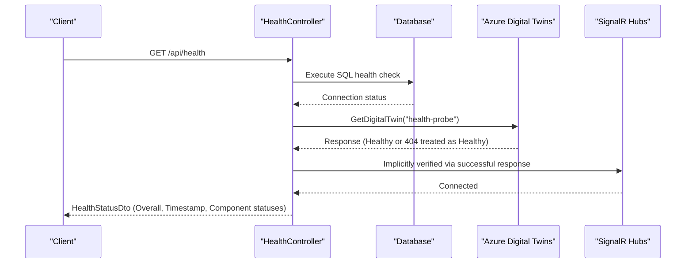
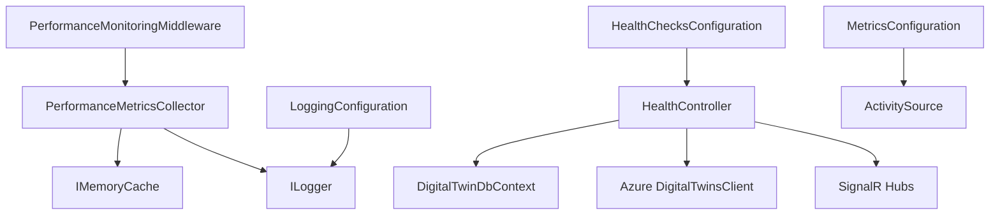

# Application Health and Performance Monitoring

<cite>
**Referenced Files in This Document**
- [HealthController.cs](file://src/api/DigitalTwinPlatform.API/Controllers/HealthController.cs)
- [HealthStatusDto.cs](file://src/api/DigitalTwinPlatform.API/Models/HealthStatusDto.cs)
- [HealthChecksConfiguration.cs](file://src/api/DigitalTwinPlatform.API/Infrastructure/HealthChecksConfiguration.cs)
- [ReadinessResponse.cs](file://src/api/DigitalTwinPlatform.API/Controllers/HealthController.cs#L137-L153)
- [PerformanceMonitoringMiddleware.cs](file://src/api/DigitalTwinPlatform.API/Middleware/PerformanceMonitoringMiddleware.cs)
- [PerformanceMetricsController.cs](file://src/api/DigitalTwinPlatform.API/Controllers/PerformanceMetricsController.cs)
- [IPerformanceMetricsCollector.cs](file://src/api/DigitalTwinPlatform.API/Services/Infrastructure/IPerformanceMetricsCollector.cs)
- [PerformanceMetricsCollector.cs](file://src/api/DigitalTwinPlatform.API/Services/Infrastructure/PerformanceMetricsCollector.cs)
- [PerformanceOptions.cs](file://src/api/DigitalTwinPlatform.API/Services/Infrastructure/PerformanceOptions.cs)
- [LoggingConfiguration.cs](file://src/api/DigitalTwinPlatform.API/Infrastructure/LoggingConfiguration.cs)
- [MetricsConfiguration.cs](file://src/api/DigitalTwinPlatform.API/Infrastructure/MetricsConfiguration.cs)
- [Program.cs](file://src/api/DigitalTwinPlatform.API/Program.cs)
- [appsettings.json](file://src/api/DigitalTwinPlatform.API/appsettings.json)
- [TelemetryHub.cs](file://src/api/DigitalTwinPlatform.API/Hubs/TelemetryHub.cs)
- [RealTimeAnalyticsHub.cs](file://src/api/DigitalTwinPlatform.API/Hubs/RealTimeAnalyticsHub.cs)
</cite>

## Table of Contents
1. [Introduction](#introduction)
2. [Project Structure](#project-structure)
3. [Core Components](#core-components)
4. [Architecture Overview](#architecture-overview)
5. [Detailed Component Analysis](#detailed-component-analysis)
6. [Dependency Analysis](#dependency-analysis)
7. [Performance Considerations](#performance-considerations)
8. [Troubleshooting Guide](#troubleshooting-guide)
9. [Conclusion](#conclusion)

## Introduction
This document describes the application health and performance monitoring system for the Digital Twin Platform API. It explains the comprehensive health check implementation covering database connectivity, Azure Digital Twins integration, and SignalR connectivity verification. It documents the health controller endpoints, their responses, performance metrics collection mechanisms, logging configuration, and error tracking strategies. Practical examples demonstrate health check implementation, performance monitoring setup, and troubleshooting unhealthy components. The document also addresses integration with external systems, health status aggregation, response formatting, scheduling, timeout configuration, and failure detection patterns tailored for industrial monitoring scenarios.

## Project Structure
The health and performance monitoring capabilities are implemented across several layers:
- Controllers: HealthController exposes health endpoints and aggregates component status.
- Infrastructure: HealthChecksConfiguration integrates with .NET Health Checks and maps standardized endpoints.
- Middleware: PerformanceMonitoringMiddleware captures request metrics and logs slow requests.
- Services: PerformanceMetricsCollector records and computes latency statistics.
- Configuration: LoggingConfiguration and MetricsConfiguration define logging and metrics pipelines.
- Hubs: TelemetryHub and RealTimeAnalyticsHub provide SignalR connectivity verification.

**Diagram sources**
- [HealthController.cs](file://src/api/DigitalTwinPlatform.API/Controllers/HealthController.cs#L19-L131)
- [HealthChecksConfiguration.cs](file://src/api/DigitalTwinPlatform.API/Infrastructure/HealthChecksConfiguration.cs#L8-L35)
- [PerformanceMonitoringMiddleware.cs](file://src/api/DigitalTwinPlatform.API/Middleware/PerformanceMonitoringMiddleware.cs#L9-L147)
- [PerformanceMetricsController.cs](file://src/api/DigitalTwinPlatform.API/Controllers/PerformanceMetricsController.cs#L10-L74)
- [IPerformanceMetricsCollector.cs](file://src/api/DigitalTwinPlatform.API/Services/Infrastructure/IPerformanceMetricsCollector.cs#L3-L25)
- [PerformanceMetricsCollector.cs](file://src/api/DigitalTwinPlatform.API/Services/Infrastructure/PerformanceMetricsCollector.cs#L6-L130)
- [PerformanceOptions.cs](file://src/api/DigitalTwinPlatform.API/Services/Infrastructure/PerformanceOptions.cs#L3-L23)

**Section sources**
- [Program.cs](file://src/api/DigitalTwinPlatform.API/Program.cs#L28-L80)
- [appsettings.json](file://src/api/DigitalTwinPlatform.API/appsettings.json#L1-L93)

## Core Components
- HealthController: Implements three health endpoints and performs component checks for database, Azure Digital Twins, and SignalR.
- HealthChecksConfiguration: Adds and maps .NET Health Checks endpoints for detailed, live, and readiness probes.
- PerformanceMonitoringMiddleware: Measures request durations, logs slow requests, and collects metrics.
- PerformanceMetricsCollector: Records performance metrics, maintains sliding caches, and computes latency statistics.
- LoggingConfiguration: Configures structured logging with console and debug providers and request lifecycle logging.
- MetricsConfiguration: Sets up ActivitySource for tracing and HTTP request tagging.

**Section sources**
- [HealthController.cs](file://src/api/DigitalTwinPlatform.API/Controllers/HealthController.cs#L19-L131)
- [HealthChecksConfiguration.cs](file://src/api/DigitalTwinPlatform.API/Infrastructure/HealthChecksConfiguration.cs#L8-L35)
- [PerformanceMonitoringMiddleware.cs](file://src/api/DigitalTwinPlatform.API/Middleware/PerformanceMonitoringMiddleware.cs#L9-L147)
- [PerformanceMetricsCollector.cs](file://src/api/DigitalTwinPlatform.API/Services/Infrastructure/PerformanceMetricsCollector.cs#L6-L130)
- [LoggingConfiguration.cs](file://src/api/DigitalTwinPlatform.API/Infrastructure/LoggingConfiguration.cs#L6-L57)
- [MetricsConfiguration.cs](file://src/api/DigitalTwinPlatform.API/Infrastructure/MetricsConfiguration.cs#L8-L46)

## Architecture Overview
The monitoring architecture integrates health checks, performance metrics, logging, and SignalR connectivity verification. HealthController orchestrates component checks and aggregates overall status. PerformanceMonitoringMiddleware captures request metrics and delegates to PerformanceMetricsCollector for storage and retrieval. LoggingConfiguration and MetricsConfiguration provide structured logging and tracing. HealthChecksConfiguration maps standardized endpoints for detailed, live, and readiness probes.

**Diagram sources**
- [HealthController.cs](file://src/api/DigitalTwinPlatform.API/Controllers/HealthController.cs#L31-L51)
- [HealthController.cs](file://src/api/DigitalTwinPlatform.API/Controllers/HealthController.cs#L100-L131)

**Section sources**
- [HealthController.cs](file://src/api/DigitalTwinPlatform.API/Controllers/HealthController.cs#L19-L131)

## Detailed Component Analysis

### Health Controller Endpoints
The HealthController provides three endpoints:
- GET /api/health: Comprehensive health check returning overall status and component details.
- GET /api/health/live: Simple liveness probe returning a basic alive status.
- GET /api/health/ready: Readiness probe indicating whether the system is ready to serve traffic.

Response formatting:
- GET /api/health returns a HealthStatusDto containing overall status, timestamp, database status, SignalR status, and Azure Digital Twins status. Unhealthy overall status yields HTTP 503.
- GET /api/health/ready returns a ReadinessResponse with Ready flag, timestamp, and per-check statuses. Unhealthy readiness yields HTTP 503.

Health status aggregation:
- Overall status is Healthy only if database and Azure Digital Twins are Healthy or Disabled. Otherwise, it is Degraded.

SignalR connectivity verification:
- SignalR health is implicitly verified through successful endpoint responses. The hub endpoints are mapped during application startup.

**Section sources**
- [HealthController.cs](file://src/api/DigitalTwinPlatform.API/Controllers/HealthController.cs#L28-L98)
- [HealthStatusDto.cs](file://src/api/DigitalTwinPlatform.API/Models/HealthStatusDto.cs#L3-L8)
- [ReadinessResponse.cs](file://src/api/DigitalTwinPlatform.API/Controllers/HealthController.cs#L137-L153)
- [Program.cs](file://src/api/DigitalTwinPlatform.API/Program.cs#L77-L78)

### Health Checks Configuration
HealthChecksConfiguration integrates .NET Health Checks:
- Adds a custom ApplicationHealthCheck with a failure status of Unhealthy and tags it for application health.
- Maps three standardized endpoints:
  - /health for detailed health
  - /health/live for liveness
  - /health/ready for readiness

These endpoints complement the HealthController endpoints and provide standardized health probing compatible with orchestration platforms.

**Section sources**
- [HealthChecksConfiguration.cs](file://src/api/DigitalTwinPlatform.API/Infrastructure/HealthChecksConfiguration.cs#L10-L35)
- [HealthChecksConfiguration.cs](file://src/api/DigitalTwinPlatform.API/Infrastructure/HealthChecksConfiguration.cs#L41-L75)

### Performance Metrics Collection
PerformanceMetricsCollector implements:
- In-memory queue for real-time metrics with a maximum cache size.
- Sliding window caching keyed by operation and machine ID with a sliding expiration.
- Threshold violation logging with warnings when metrics exceed configured thresholds.
- Retrieval APIs for raw metrics and aggregated statistics including average, P50, P95, P99 latency, total operations, and exceeded threshold counts.

PerformanceMonitoringMiddleware:
- Measures request duration and logs slow requests exceeding a configurable threshold.
- Excludes specific paths from monitoring (e.g., health, metrics, favicon).
- Emits structured logs with request metadata and performance buckets.

PerformanceOptions defines latency thresholds for key operations:
- DigitalTwinUpdate
- PredictionGeneration
- SimulationStep

**Section sources**
- [PerformanceMetricsCollector.cs](file://src/api/DigitalTwinPlatform.API/Services/Infrastructure/PerformanceMetricsCollector.cs#L22-L120)
- [PerformanceMonitoringMiddleware.cs](file://src/api/DigitalTwinPlatform.API/Middleware/PerformanceMonitoringMiddleware.cs#L25-L109)
- [PerformanceOptions.cs](file://src/api/DigitalTwinPlatform.API/Services/Infrastructure/PerformanceOptions.cs#L3-L23)
- [PerformanceMetricsController.cs](file://src/api/DigitalTwinPlatform.API/Controllers/PerformanceMetricsController.cs#L23-L73)

### Logging Configuration
LoggingConfiguration:
- Clears existing providers and adds Console and Debug providers.
- Applies minimum log level from configuration.
- Wraps request lifecycle with structured logs for start, completion, and failure events.

MetricsConfiguration:
- Establishes an ActivitySource for tracing HTTP requests.
- Tags requests with method, URL, scheme, and status code, and captures exceptions.

**Section sources**
- [LoggingConfiguration.cs](file://src/api/DigitalTwinPlatform.API/Infrastructure/LoggingConfiguration.cs#L8-L57)
- [MetricsConfiguration.cs](file://src/api/DigitalTwinPlatform.API/Infrastructure/MetricsConfiguration.cs#L12-L46)

### SignalR Connectivity Verification
SignalR hubs are mapped during application startup:
- TelemetryHub: /hubs/telemetry
- RealTimeAnalyticsHub: /hubs/analytics

Connectivity verification:
- HealthController treats SignalR as Healthy when the API responds successfully to health requests, implying connectivity through the hub endpoints.

**Section sources**
- [Program.cs](file://src/api/DigitalTwinPlatform.API/Program.cs#L77-L78)
- [HealthController.cs](file://src/api/DigitalTwinPlatform.API/Controllers/HealthController.cs#L34)

## Dependency Analysis
The monitoring system exhibits clear separation of concerns:
- HealthController depends on DigitalTwinDbContext for database checks, Azure DigitalTwinsClient for ADT checks, and implicit SignalR connectivity.
- PerformanceMonitoringMiddleware depends on PerformanceMonitoringOptions for configuration and logs metrics via ILogger.
- PerformanceMetricsCollector depends on IMemoryCache and ILogger for storage and diagnostics.
- LoggingConfiguration and MetricsConfiguration integrate with .NET logging and tracing subsystems.
- HealthChecksConfiguration integrates with .NET Health Checks and maps standardized endpoints.

**Diagram sources**
- [HealthController.cs](file://src/api/DigitalTwinPlatform.API/Controllers/HealthController.cs#L19-L131)
- [PerformanceMonitoringMiddleware.cs](file://src/api/DigitalTwinPlatform.API/Middleware/PerformanceMonitoringMiddleware.cs#L9-L147)
- [PerformanceMetricsCollector.cs](file://src/api/DigitalTwinPlatform.API/Services/Infrastructure/PerformanceMetricsCollector.cs#L6-L130)
- [LoggingConfiguration.cs](file://src/api/DigitalTwinPlatform.API/Infrastructure/LoggingConfiguration.cs#L6-L57)
- [MetricsConfiguration.cs](file://src/api/DigitalTwinPlatform.API/Infrastructure/MetricsConfiguration.cs#L8-L46)
- [HealthChecksConfiguration.cs](file://src/api/DigitalTwinPlatform.API/Infrastructure/HealthChecksConfiguration.cs#L8-L35)

**Section sources**
- [Program.cs](file://src/api/DigitalTwinPlatform.API/Program.cs#L28-L80)

## Performance Considerations
- Request monitoring excludes health, metrics, and favicon endpoints to reduce overhead.
- Metrics collector maintains bounded queues and sliding caches to control memory usage.
- Aggregation functions compute percentiles efficiently using ordered collections.
- Threshold-based logging helps identify performance regressions without impacting throughput.
- Structured logging and tracing enable correlation of performance issues with request traces.

[No sources needed since this section provides general guidance]

## Troubleshooting Guide
Common issues and resolutions:
- Database connectivity failures:
  - Symptom: Database status shows Unhealthy in health responses.
  - Resolution: Verify connection string and database availability; check logs for exceptions during health check execution.
- Azure Digital Twins unavailability:
  - Symptom: ADT status shows Unhealthy or Disabled.
  - Resolution: Confirm client initialization, endpoint URL, credentials, and network access; note that 404 responses are treated as Healthy for probe purposes.
- SignalR connectivity problems:
  - Symptom: Unexpected disconnects or timeouts.
  - Resolution: Validate hub endpoint mapping and client connections; ensure network policies allow hub traffic.
- Slow requests:
  - Symptom: Warnings for requests exceeding the slow request threshold.
  - Resolution: Review middleware configuration, optimize endpoints, and investigate bottlenecks using collected metrics.
- Threshold violations:
  - Symptom: Exceeded threshold count increases in statistics.
  - Resolution: Tune latency thresholds in configuration and address performance hotspots identified by metrics.

**Section sources**
- [HealthController.cs](file://src/api/DigitalTwinPlatform.API/Controllers/HealthController.cs#L100-L131)
- [PerformanceMonitoringMiddleware.cs](file://src/api/DigitalTwinPlatform.API/Middleware/PerformanceMonitoringMiddleware.cs#L47-L55)
- [PerformanceMetricsCollector.cs](file://src/api/DigitalTwinPlatform.API/Services/Infrastructure/PerformanceMetricsCollector.cs#L56-L63)
- [appsettings.json](file://src/api/DigitalTwinPlatform.API/appsettings.json#L73-L79)

## Conclusion
The Digital Twin Platform API implements a robust health and performance monitoring system. HealthController provides comprehensive checks for database, Azure Digital Twins, and SignalR, with clear response semantics and aggregation logic. HealthChecksConfiguration offers standardized endpoints for integration with monitoring and orchestration platforms. PerformanceMonitoringMiddleware and PerformanceMetricsCollector capture and analyze request performance, while LoggingConfiguration and MetricsConfiguration provide structured logging and tracing. Together, these components enable reliable industrial monitoring, timely failure detection, and actionable insights for maintaining system health and performance.