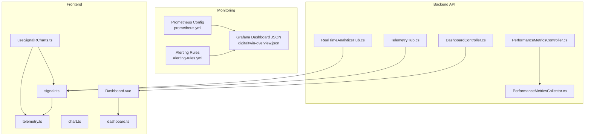
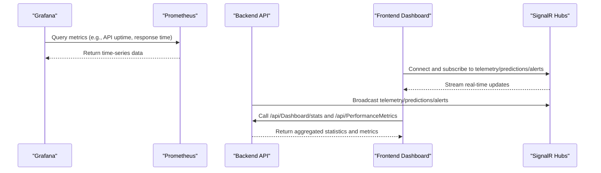
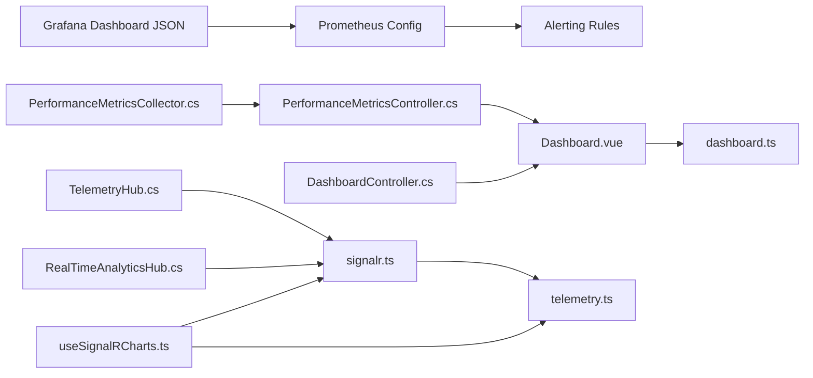

# Dashboard and Visualization Setup

<cite>
**Referenced Files in This Document**
- [digitaltwin-overview.json](file://monitoring/grafana/dashboards/digitaltwin-overview.json)
- [prometheus.yml](file://monitoring/prometheus/prometheus.yml)
- [alerting-rules.yml](file://monitoring/prometheus/alerting-rules.yml)
- [RealTimeAnalyticsHub.cs](file://src/api/DigitalTwinPlatform.API/Hubs/RealTimeAnalyticsHub.cs)
- [TelemetryHub.cs](file://src/api/DigitalTwinPlatform.API/Hubs/TelemetryHub.cs)
- [DashboardController.cs](file://src/api/DigitalTwinPlatform.API/Controllers/DashboardController.cs)
- [PerformanceMetricsController.cs](file://src/api/DigitalTwinPlatform.API/Controllers/PerformanceMetricsController.cs)
- [PerformanceMetricsCollector.cs](file://src/api/DigitalTwinPlatform.API/Services/Infrastructure/PerformanceMetricsCollector.cs)
- [useSignalRCharts.ts](file://src/frontend/src/composables/useSignalRCharts.ts)
- [signalr.ts](file://src/frontend/src/services/signalr.ts)
- [telemetry.ts](file://src/frontend/src/stores/telemetry.ts)
- [dashboard.ts](file://src/frontend/src/services/dashboard.ts)
- [Dashboard.vue](file://src/frontend/src/views/Dashboard.vue)
- [chart.ts](file://src/frontend/src/types/chart.ts)
</cite>

## Table of Contents
1. [Introduction](#introduction)
2. [Project Structure](#project-structure)
3. [Core Components](#core-components)
4. [Architecture Overview](#architecture-overview)
5. [Detailed Component Analysis](#detailed-component-analysis)
6. [Dependency Analysis](#dependency-analysis)
7. [Performance Considerations](#performance-considerations)
8. [Troubleshooting Guide](#troubleshooting-guide)
9. [Conclusion](#conclusion)
10. [Appendices](#appendices)

## Introduction
This document provides comprehensive guidance for setting up and operating dashboards and visualizations in the Digital Twin Platform. It covers:
- Grafana dashboard configuration for the digital twin overview
- Panel arrangements, data source connections, and template variables
- Real-time data streaming via SignalR hubs
- Performance metrics collection and visualization
- Frontend dashboard integration, real-time chart updates, and user interaction patterns
- Best practices for performance optimization, mobile responsiveness, and accessibility

## Project Structure
The dashboard and visualization system spans three primary areas:
- Monitoring stack: Prometheus scraping and alerting rules, Grafana dashboard JSON
- Backend API: SignalR hubs for real-time telemetry and analytics, performance metrics APIs
- Frontend: Vue-based dashboard with SignalR integration, stores, and composable utilities

**Diagram sources**
- [digitaltwin-overview.json](file://monitoring/grafana/dashboards/digitaltwin-overview.json#L1-L279)
- [prometheus.yml](file://monitoring/prometheus/prometheus.yml#L1-L148)
- [alerting-rules.yml](file://monitoring/prometheus/alerting-rules.yml#L1-L184)
- [TelemetryHub.cs](file://src/api/DigitalTwinPlatform.API/Hubs/TelemetryHub.cs#L1-L211)
- [RealTimeAnalyticsHub.cs](file://src/api/DigitalTwinPlatform.API/Hubs/RealTimeAnalyticsHub.cs#L1-L310)
- [PerformanceMetricsCollector.cs](file://src/api/DigitalTwinPlatform.API/Services/Infrastructure/PerformanceMetricsCollector.cs#L1-L131)
- [PerformanceMetricsController.cs](file://src/api/DigitalTwinPlatform.API/Controllers/PerformanceMetricsController.cs#L1-L75)
- [DashboardController.cs](file://src/api/DigitalTwinPlatform.API/Controllers/DashboardController.cs#L1-L127)
- [Dashboard.vue](file://src/frontend/src/views/Dashboard.vue#L1-L213)
- [signalr.ts](file://src/frontend/src/services/signalr.ts#L1-L271)
- [telemetry.ts](file://src/frontend/src/stores/telemetry.ts#L1-L58)
- [useSignalRCharts.ts](file://src/frontend/src/composables/useSignalRCharts.ts#L1-L352)
- [chart.ts](file://src/frontend/src/types/chart.ts#L1-L112)
- [dashboard.ts](file://src/frontend/src/services/dashboard.ts#L1-L25)

**Section sources**
- [digitaltwin-overview.json](file://monitoring/grafana/dashboards/digitaltwin-overview.json#L1-L279)
- [prometheus.yml](file://monitoring/prometheus/prometheus.yml#L1-L148)
- [alerting-rules.yml](file://monitoring/prometheus/alerting-rules.yml#L1-L184)
- [TelemetryHub.cs](file://src/api/DigitalTwinPlatform.API/Hubs/TelemetryHub.cs#L1-L211)
- [RealTimeAnalyticsHub.cs](file://src/api/DigitalTwinPlatform.API/Hubs/RealTimeAnalyticsHub.cs#L1-L310)
- [PerformanceMetricsCollector.cs](file://src/api/DigitalTwinPlatform.API/Services/Infrastructure/PerformanceMetricsCollector.cs#L1-L131)
- [PerformanceMetricsController.cs](file://src/api/DigitalTwinPlatform.API/Controllers/PerformanceMetricsController.cs#L1-L75)
- [DashboardController.cs](file://src/api/DigitalTwinPlatform.API/Controllers/DashboardController.cs#L1-L127)
- [Dashboard.vue](file://src/frontend/src/views/Dashboard.vue#L1-L213)
- [signalr.ts](file://src/frontend/src/services/signalr.ts#L1-L271)
- [telemetry.ts](file://src/frontend/src/stores/telemetry.ts#L1-L58)
- [useSignalRCharts.ts](file://src/frontend/src/composables/useSignalRCharts.ts#L1-L352)
- [chart.ts](file://src/frontend/src/types/chart.ts#L1-L112)
- [dashboard.ts](file://src/frontend/src/services/dashboard.ts#L1-L25)

## Core Components
- Grafana digital twin overview dashboard: Centralized monitoring panel layout with Prometheus data sources and template variables
- Prometheus configuration: Scrapes backend, frontend, databases, and host metrics; defines alerting rules
- SignalR hubs: Real-time telemetry and analytics streaming to the frontend
- Frontend dashboard: Vue-based overview with SignalR integration, stores, and composable utilities
- Performance metrics pipeline: Backend collection and API exposure for latency and threshold statistics

**Section sources**
- [digitaltwin-overview.json](file://monitoring/grafana/dashboards/digitaltwin-overview.json#L1-L279)
- [prometheus.yml](file://monitoring/prometheus/prometheus.yml#L1-L148)
- [alerting-rules.yml](file://monitoring/prometheus/alerting-rules.yml#L1-L184)
- [TelemetryHub.cs](file://src/api/DigitalTwinPlatform.API/Hubs/TelemetryHub.cs#L1-L211)
- [RealTimeAnalyticsHub.cs](file://src/api/DigitalTwinPlatform.API/Hubs/RealTimeAnalyticsHub.cs#L1-L310)
- [Dashboard.vue](file://src/frontend/src/views/Dashboard.vue#L1-L213)
- [signalr.ts](file://src/frontend/src/services/signalr.ts#L1-L271)
- [telemetry.ts](file://src/frontend/src/stores/telemetry.ts#L1-L58)
- [useSignalRCharts.ts](file://src/frontend/src/composables/useSignalRCharts.ts#L1-L352)
- [PerformanceMetricsCollector.cs](file://src/api/DigitalTwinPlatform.API/Services/Infrastructure/PerformanceMetricsCollector.cs#L1-L131)
- [PerformanceMetricsController.cs](file://src/api/DigitalTwinPlatform.API/Controllers/PerformanceMetricsController.cs#L1-L75)
- [DashboardController.cs](file://src/api/DigitalTwinPlatform.API/Controllers/DashboardController.cs#L1-L127)

## Architecture Overview
The visualization architecture integrates Prometheus metrics, SignalR real-time streaming, and a Vue-based frontend dashboard.

**Diagram sources**
- [digitaltwin-overview.json](file://monitoring/grafana/dashboards/digitaltwin-overview.json#L1-L279)
- [prometheus.yml](file://monitoring/prometheus/prometheus.yml#L1-L148)
- [TelemetryHub.cs](file://src/api/DigitalTwinPlatform.API/Hubs/TelemetryHub.cs#L1-L211)
- [RealTimeAnalyticsHub.cs](file://src/api/DigitalTwinPlatform.API/Hubs/RealTimeAnalyticsHub.cs#L1-L310)
- [Dashboard.vue](file://src/frontend/src/views/Dashboard.vue#L1-L213)
- [signalr.ts](file://src/frontend/src/services/signalr.ts#L1-L271)
- [DashboardController.cs](file://src/api/DigitalTwinPlatform.API/Controllers/DashboardController.cs#L1-L127)
- [PerformanceMetricsController.cs](file://src/api/DigitalTwinPlatform.API/Controllers/PerformanceMetricsController.cs#L1-L75)

## Detailed Component Analysis

### Grafana Digital Twin Overview Dashboard
- Purpose: Provide a centralized view of system health, API performance, database and cache metrics, and recent alerts
- Data source: Prometheus with a datasource template variable
- Panels:
  - API Uptime (stat panel): Average of up across backend job
  - Average Response Time (stat panel): 95th percentile of http_request_duration_seconds
  - Error Rate (stat panel): Ratio of 5xx to total requests
  - Active Users (stat panel): Count of active sessions
  - API Requests Over Time (timeseries): Request rates by method/status
  - Response Time Distribution (timeseries): 50th, 95th, 99th percentiles
  - Database Connections (timeseries): pg_stat_activity_count
  - Redis Memory Usage (timeseries): redis_memory_used_bytes converted to MB
  - System Resources (timeseries): CPU and memory utilization
  - Recent Alerts (table): ALERTS firing with organized fields
- Template variables:
  - Datasource selector for Prometheus

Practical setup steps:
- Import the dashboard JSON into Grafana
- Configure Prometheus datasource pointing to the Prometheus endpoint
- Verify panels render data and adjust queries if needed

**Section sources**
- [digitaltwin-overview.json](file://monitoring/grafana/dashboards/digitaltwin-overview.json#L1-L279)

### Prometheus Configuration and Alerting
- Scrape jobs:
  - digitaltwin-backend: Exposes /metrics and keeps http_request_duration_seconds metrics
  - digitaltwin-frontend: Exposes /metrics
  - postgresql: Uses postgres exporter
  - redis: Uses redis exporter
  - node-exporter: Host-level metrics
  - Kubernetes (optional): Pod and node discovery
- Alerting rules:
  - API downtime, high error rate, slow response
  - Database connectivity and connection saturation
  - Redis memory usage and connection saturation
  - Frontend errors and availability
  - Host CPU/memory/disk utilization
  - Business metrics: low user activity, high maintenance requests, data processing delays
- Recording rules:
  - Pre-aggregated metrics for common percentiles and ratios

Best practices:
- Keep metric names consistent across services
- Use relabeling to normalize labels for cross-job comparisons
- Tune scrape intervals and timeouts for production workloads

**Section sources**
- [prometheus.yml](file://monitoring/prometheus/prometheus.yml#L1-L148)
- [alerting-rules.yml](file://monitoring/prometheus/alerting-rules.yml#L1-L184)

### SignalR Telemetry Hub
- Responsibilities:
  - Manage machine-specific subscriptions via groups
  - Stream telemetry updates to subscribed clients
  - Track and clean up subscriptions on disconnect
- Data model:
  - TelemetryData: machineId, timestamp, sensor values, and optional metrics
- Client interface:
  - ITelemetryClient: TelemetryUpdate callback

Real-time streaming flow:
- Client connects and invokes SubscribeToMachine
- Server adds client to group and confirms subscription
- Server broadcasts TelemetryUpdate events to the group

**Section sources**
- [TelemetryHub.cs](file://src/api/DigitalTwinPlatform.API/Hubs/TelemetryHub.cs#L1-L211)

### SignalR Real-Time Analytics Hub
- Responsibilities:
  - Manage subscriptions for predictions, alerts, and system health
  - Broadcast predictions and alerts to appropriate groups
  - Confirm analytics connection and handle disconnections
- Data models:
  - PredictionData: RUL remaining, failure probability, feature importance, etc.
  - AlertData: severity, category, recommended action, acknowledgment state
  - AnalyticsConnectionData: connection metadata

Subscription patterns:
- SubscribeToPredictions(machineId)
- SubscribeToAlerts()
- SubscribeToSystemHealth()
- SubscribeToAllAnalytics(machineId)

**Section sources**
- [RealTimeAnalyticsHub.cs](file://src/api/DigitalTwinPlatform.API/Hubs/RealTimeAnalyticsHub.cs#L1-L310)

### Frontend SignalR Integration
- signalr.ts:
  - Establishes SignalR connection with automatic reconnection
  - Registers handlers for telemetry, alerts, and predictions
  - Maps backend data models to frontend types
  - Manages subscriptions and cleans up on disconnect
- telemetry.ts:
  - Pinia store for real-time and historical telemetry data
  - Tracks connection state and last update timestamps
- useSignalRCharts.ts:
  - Composable for buffering and batching real-time updates
  - Provides multi-sensor and single-sensor chart utilities
  - Integrates with stores for sensor readings and predictions

User interaction patterns:
- Dashboard loads machine and alert data on mount
- SignalR connection is established automatically
- Users can navigate to machine detail pages for deeper insights

**Section sources**
- [signalr.ts](file://src/frontend/src/services/signalr.ts#L1-L271)
- [telemetry.ts](file://src/frontend/src/stores/telemetry.ts#L1-L58)
- [useSignalRCharts.ts](file://src/frontend/src/composables/useSignalRCharts.ts#L1-L352)
- [Dashboard.vue](file://src/frontend/src/views/Dashboard.vue#L1-L213)
- [chart.ts](file://src/frontend/src/types/chart.ts#L1-L112)

### Performance Metrics Collector and API
- PerformanceMetricsCollector:
  - Records metrics in-memory queue and caches recent entries
  - Computes percentile-based statistics and threshold violation counts
- PerformanceMetricsController:
  - Exposes endpoints to query raw metrics, aggregated statistics, and threshold violations
- DashboardController:
  - Aggregates high-level dashboard statistics (machine counts, health scores, active alerts)

Visualization techniques:
- Use Prometheus recording rules to pre-compute percentiles
- Combine backend API metrics with real-time SignalR telemetry for comprehensive dashboards

**Section sources**
- [PerformanceMetricsCollector.cs](file://src/api/DigitalTwinPlatform.API/Services/Infrastructure/PerformanceMetricsCollector.cs#L1-L131)
- [PerformanceMetricsController.cs](file://src/api/DigitalTwinPlatform.API/Controllers/PerformanceMetricsController.cs#L1-L75)
- [DashboardController.cs](file://src/api/DigitalTwinPlatform.API/Controllers/DashboardController.cs#L1-L127)

## Dependency Analysis
The dashboard and visualization system exhibits clear separation of concerns across monitoring, backend, and frontend layers.

**Diagram sources**
- [digitaltwin-overview.json](file://monitoring/grafana/dashboards/digitaltwin-overview.json#L1-L279)
- [prometheus.yml](file://monitoring/prometheus/prometheus.yml#L1-L148)
- [alerting-rules.yml](file://monitoring/prometheus/alerting-rules.yml#L1-L184)
- [TelemetryHub.cs](file://src/api/DigitalTwinPlatform.API/Hubs/TelemetryHub.cs#L1-L211)
- [RealTimeAnalyticsHub.cs](file://src/api/DigitalTwinPlatform.API/Hubs/RealTimeAnalyticsHub.cs#L1-L310)
- [PerformanceMetricsCollector.cs](file://src/api/DigitalTwinPlatform.API/Services/Infrastructure/PerformanceMetricsCollector.cs#L1-L131)
- [PerformanceMetricsController.cs](file://src/api/DigitalTwinPlatform.API/Controllers/PerformanceMetricsController.cs#L1-L75)
- [DashboardController.cs](file://src/api/DigitalTwinPlatform.API/Controllers/DashboardController.cs#L1-L127)
- [signalr.ts](file://src/frontend/src/services/signalr.ts#L1-L271)
- [telemetry.ts](file://src/frontend/src/stores/telemetry.ts#L1-L58)
- [useSignalRCharts.ts](file://src/frontend/src/composables/useSignalRCharts.ts#L1-L352)
- [Dashboard.vue](file://src/frontend/src/views/Dashboard.vue#L1-L213)
- [dashboard.ts](file://src/frontend/src/services/dashboard.ts#L1-L25)

**Section sources**
- [digitaltwin-overview.json](file://monitoring/grafana/dashboards/digitaltwin-overview.json#L1-L279)
- [prometheus.yml](file://monitoring/prometheus/prometheus.yml#L1-L148)
- [alerting-rules.yml](file://monitoring/prometheus/alerting-rules.yml#L1-L184)
- [TelemetryHub.cs](file://src/api/DigitalTwinPlatform.API/Hubs/TelemetryHub.cs#L1-L211)
- [RealTimeAnalyticsHub.cs](file://src/api/DigitalTwinPlatform.API/Hubs/RealTimeAnalyticsHub.cs#L1-L310)
- [PerformanceMetricsCollector.cs](file://src/api/DigitalTwinPlatform.API/Services/Infrastructure/PerformanceMetricsCollector.cs#L1-L131)
- [PerformanceMetricsController.cs](file://src/api/DigitalTwinPlatform.API/Controllers/PerformanceMetricsController.cs#L1-L75)
- [DashboardController.cs](file://src/api/DigitalTwinPlatform.API/Controllers/DashboardController.cs#L1-L127)
- [signalr.ts](file://src/frontend/src/services/signalr.ts#L1-L271)
- [telemetry.ts](file://src/frontend/src/stores/telemetry.ts#L1-L58)
- [useSignalRCharts.ts](file://src/frontend/src/composables/useSignalRCharts.ts#L1-L352)
- [Dashboard.vue](file://src/frontend/src/views/Dashboard.vue#L1-L213)
- [dashboard.ts](file://src/frontend/src/services/dashboard.ts#L1-L25)

## Performance Considerations
- Grafana:
  - Use recording rules to pre-aggregate expensive queries
  - Limit dashboard refresh frequency for heavy panels
  - Apply appropriate time ranges and reduce series cardinality
- Prometheus:
  - Tune scrape intervals and timeouts
  - Use metric relabeling to filter unnecessary series
  - Configure retention and remote write for long-term storage
- SignalR:
  - Implement buffering and batching in frontend composable
  - Use group-based broadcasting to minimize redundant messages
  - Enable automatic reconnection with exponential backoff
- Frontend:
  - Debounce chart updates and limit data points retained
  - Use reactive stores to avoid unnecessary re-renders
  - Lazy-load historical data and use pagination for large datasets

[No sources needed since this section provides general guidance]

## Troubleshooting Guide
- Grafana dashboard shows no data:
  - Verify Prometheus datasource URL and credentials
  - Check Prometheus targets are reachable and scraping
  - Confirm dashboard template variables match configured datasources
- SignalR connection failures:
  - Inspect browser console for connection errors
  - Validate backend SignalR hub endpoint and authentication tokens
  - Review automatic reconnection logs and retry intervals
- Missing real-time telemetry:
  - Ensure clients invoked SubscribeToMachine with correct machineId
  - Verify server-side group membership and broadcast logic
- Slow dashboard rendering:
  - Reduce chart data point limits and update frequencies
  - Use frontend buffering and batch processing
  - Optimize backend API responses and caching

**Section sources**
- [digitaltwin-overview.json](file://monitoring/grafana/dashboards/digitaltwin-overview.json#L1-L279)
- [prometheus.yml](file://monitoring/prometheus/prometheus.yml#L1-L148)
- [TelemetryHub.cs](file://src/api/DigitalTwinPlatform.API/Hubs/TelemetryHub.cs#L1-L211)
- [RealTimeAnalyticsHub.cs](file://src/api/DigitalTwinPlatform.API/Hubs/RealTimeAnalyticsHub.cs#L1-L310)
- [signalr.ts](file://src/frontend/src/services/signalr.ts#L1-L271)
- [useSignalRCharts.ts](file://src/frontend/src/composables/useSignalRCharts.ts#L1-L352)

## Conclusion
The Digital Twin Platform’s dashboard and visualization system combines robust monitoring with real-time streaming and a responsive frontend. By leveraging Prometheus for metrics, SignalR for live updates, and a modular frontend architecture, operators can monitor system health, track performance, and respond to incidents effectively. Following the best practices outlined here ensures scalability, reliability, and usability across diverse operational environments.

[No sources needed since this section summarizes without analyzing specific files]

## Appendices

### Practical Examples

- Creating a Grafana dashboard:
  - Import the provided dashboard JSON
  - Set the Prometheus datasource variable
  - Adjust panel queries to match your environment
  - Add alert annotations using the Recent Alerts table

- Panel customization:
  - Modify thresholds in stat panels for your SLAs
  - Combine multiple series in timeseries panels for comparative analysis
  - Use table transformations to focus on relevant alert attributes

- Real-time chart updates:
  - Use the composable to subscribe to a machine and receive buffered updates
  - Integrate predictions and sensor readings into combined charts
  - Implement user-driven time range selection for historical overlays

- Metric visualization techniques:
  - Percentile-based latency panels for SLO tracking
  - Utilization panels for capacity planning
  - Threshold violation counters for anomaly detection

**Section sources**
- [digitaltwin-overview.json](file://monitoring/grafana/dashboards/digitaltwin-overview.json#L1-L279)
- [useSignalRCharts.ts](file://src/frontend/src/composables/useSignalRCharts.ts#L1-L352)
- [signalr.ts](file://src/frontend/src/services/signalr.ts#L1-L271)
- [chart.ts](file://src/frontend/src/types/chart.ts#L1-L112)

### Accessibility and Mobile Responsiveness
- Accessibility:
  - Ensure sufficient color contrast in panels and alerts
  - Provide textual summaries alongside charts
  - Support keyboard navigation and screen reader-friendly labels
- Mobile responsiveness:
  - Use grid layouts that adapt to smaller screens
  - Collapse less critical widgets on mobile
  - Prefer touch-friendly controls and larger tap targets

[No sources needed since this section provides general guidance]