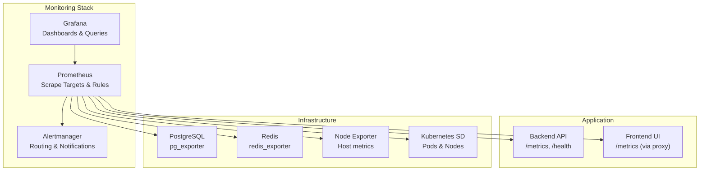
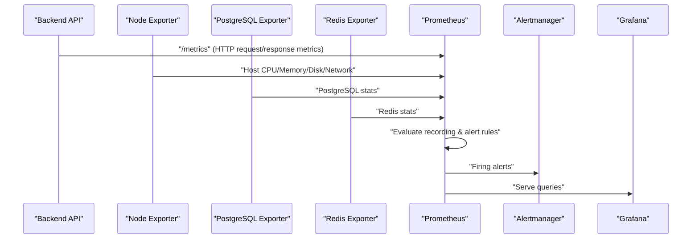
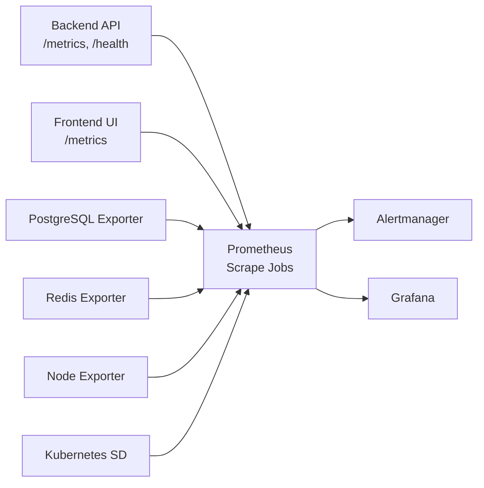

# Infrastructure and System Metrics

<cite>
**Referenced Files in This Document**
- [prometheus.yml](file://monitoring/prometheus/prometheus.yml)
- [alerting-rules.yml](file://monitoring/prometheus/alerting-rules.yml)
- [digitaltwin-overview.json](file://monitoring/grafana/dashboards/digitaltwin-overview.json)
- [MetricsConfiguration.cs](file://src/api/DigitalTwinPlatform.API/Infrastructure/MetricsConfiguration.cs)
- [HealthChecksConfiguration.cs](file://src/api/DigitalTwinPlatform.API/Infrastructure/HealthChecksConfiguration.cs)
- [docker-compose.prod.yml](file://docker-compose.prod.yml)
- [PerformanceMetricsController.cs](file://src/api/DigitalTwinPlatform.API/Controllers/PerformanceMetricsController.cs)
- [PerformanceMetricsCollector.cs](file://src/api/DigitalTwinPlatform.API/Services/Infrastructure/PerformanceMetricsCollector.cs)
- [IPerformanceMetricsCollector.cs](file://src/api/DigitalTwinPlatform.API/Services/Infrastructure/IPerformanceMetricsCollector.cs)
- [PerformanceOptions.cs](file://src/api/DigitalTwinPlatform.API/Services/Infrastructure/PerformanceOptions.cs)
- [performanceMetrics.service.ts](file://src/ui/digital-twin-dashboard/src/services/performanceMetrics.service.ts)
- [performance.ts](file://src/frontend/src/services/performance.ts)
- [AlertRulesController.cs](file://src/api/DigitalTwinPlatform.API/Controllers/AlertRulesController.cs)
- [NotificationService.cs](file://src/api/DigitalTwinPlatform.API/Services/Core/NotificationService.cs)
- [machineMetrics.ts](file://src/ui/digital-twin-dashboard/src/utils/machineMetrics.ts)
- [valueFormatter.ts](file://src/ui/digital-twin-dashboard/src/utils/valueFormatter.ts)
</cite>

## Table of Contents
1. [Introduction](#introduction)
2. [Project Structure](#project-structure)
3. [Core Components](#core-components)
4. [Architecture Overview](#architecture-overview)
5. [Detailed Component Analysis](#detailed-component-analysis)
6. [Dependency Analysis](#dependency-analysis)
7. [Performance Considerations](#performance-considerations)
8. [Troubleshooting Guide](#troubleshooting-guide)
9. [Conclusion](#conclusion)
10. [Appendices](#appendices)

## Introduction
This document provides comprehensive guidance for infrastructure and system metrics monitoring in the Digital Twin Platform. It covers Prometheus configuration (scrape targets, jobs, intervals), alerting rules for critical failures and performance thresholds, and Grafana dashboard configuration for a digital twin overview. It also documents system resource monitoring (CPU, memory, disk, network), application performance indicators, custom metric collection, retention policies, data aggregation, and historical trend analysis for operational insights.

## Project Structure
The monitoring stack is composed of:
- Prometheus server scraping application, host, database, cache, and Kubernetes metrics
- Alertmanager integration for alert routing and notifications
- Grafana dashboards for visualization
- Backend API exposing metrics and health endpoints
- Optional remote write to Thanos for long-term storage
- Docker Compose orchestration for production deployment

**Diagram sources**
- [prometheus.yml](file://monitoring/prometheus/prometheus.yml#L18-L116)
- [docker-compose.prod.yml](file://docker-compose.prod.yml#L185-L222)

**Section sources**
- [prometheus.yml](file://monitoring/prometheus/prometheus.yml#L1-L148)
- [docker-compose.prod.yml](file://docker-compose.prod.yml#L185-L222)

## Core Components
- Prometheus configuration defines global scrape and evaluation intervals, rule files, alertmanager targets, and scrape jobs for backend API, frontend, PostgreSQL exporter, Redis exporter, Node exporter, and Kubernetes discovery.
- Alerting rules define critical, warning, and informational alerts for API health, error rates, latency, database and cache health, host resources, and business metrics.
- Grafana dashboard “Digital Twin Platform - Overview” displays key SLOs (uptime, response time, error rate), throughput, distribution percentiles, database and cache usage, host resources, and recent alerts.
- Backend API exposes metrics and health endpoints and includes middleware instrumentation hooks for request metrics.
- Docker Compose provisions Prometheus, Grafana, exporters, and the platform services with persistent volumes and port exposure.

**Section sources**
- [prometheus.yml](file://monitoring/prometheus/prometheus.yml#L3-L148)
- [alerting-rules.yml](file://monitoring/prometheus/alerting-rules.yml#L1-L184)
- [digitaltwin-overview.json](file://monitoring/grafana/dashboards/digitaltwin-overview.json#L1-L279)
- [MetricsConfiguration.cs](file://src/api/DigitalTwinPlatform.API/Infrastructure/MetricsConfiguration.cs#L12-L46)
- [docker-compose.prod.yml](file://docker-compose.prod.yml#L185-L222)

## Architecture Overview
The monitoring pipeline collects metrics from multiple sources, evaluates alerting and recording rules, persists data, and visualizes insights.

**Diagram sources**
- [prometheus.yml](file://monitoring/prometheus/prometheus.yml#L24-L116)
- [alerting-rules.yml](file://monitoring/prometheus/alerting-rules.yml#L3-L184)
- [docker-compose.prod.yml](file://docker-compose.prod.yml#L185-L222)

## Detailed Component Analysis

### Prometheus Configuration
- Global settings:
  - Scrape interval: 15s
  - Evaluation interval: 15s
  - Scrape timeout: 10s
- Rule files:
  - Alerting rules
  - Recording rules
- Alertmanager:
  - Static target: alertmanager:9093
- Scrape configs:
  - Self-monitoring job for Prometheus
  - Backend API job with metrics path and relabeling
  - Frontend job with metrics path and relabeling
  - PostgreSQL exporter job
  - Redis exporter job
  - Node exporter job
  - Kubernetes node and pod service discovery with label and address relabeling
- Remote write:
  - Optional Thanos receiver endpoint with metric relabeling to drop low-value series
- Storage:
  - TSDB retention: 15 days
  - Block durations and compaction settings
- Query:
  - Concurrency, samples, and timeout tuned for large environments
- Tracing:
  - Jaeger endpoint and sampling fraction

Practical examples:
- Define a new scrape job for a custom service by adding a job under scrape_configs with appropriate metrics_path and relabeling.
- Add recording rules to pre-aggregate expensive expressions for dashboard performance.
- Configure remote write to offload long-term retention to Thanos.

**Section sources**
- [prometheus.yml](file://monitoring/prometheus/prometheus.yml#L3-L148)

### Alerting Rules Setup
Alert groups and expressions:
- API health:
  - APIDown: service down
  - APIHighErrorRate: error rate > 5% over 5 minutes
  - APISlowResponse: 95th percentile response time > 2s
- Database:
  - DatabaseDown: exporter down
  - DatabaseHighConnections: active connections > 80
  - DatabaseLowDiskSpace: cache hit ratio < 95%
- Redis:
  - RedisDown: exporter down
  - RedisHighMemoryUsage: memory usage > 85%
  - RedisConnectionSaturation: clients > 500
- Frontend:
  - FrontendDown: service down
  - FrontendHighErrorRate: error rate > 1% over 5 minutes
- Host resources:
  - HostHighCPUUsage: CPU utilization > 85%
  - HostHighMemoryUsage: memory usage > 90%
  - HostDiskSpaceLow: disk usage > 90%
- Business metrics:
  - LowUserActivity: user actions < 10/hour over 1 hour
  - HighMaintenanceRequests: > 50 per 30 minutes over 30 minutes
  - DataProcessingDelay: telemetry last processed > 5 minutes ago

Recording rules:
- Pre-compute 95th percentile API duration
- Compute API error rate ratio
- Compute CPU/memory utilization per instance
- Compute DB connection utilization
- Compute Redis memory utilization

Practical examples:
- To add a new alert rule, append a new alert expression in the appropriate group with suitable for duration and severity labels.
- To define a custom metric, expose it from the application and scrape it via Prometheus, then create recording rules for aggregations.

**Section sources**
- [alerting-rules.yml](file://monitoring/prometheus/alerting-rules.yml#L3-L184)

### Grafana Dashboard Configuration
Dashboard “Digital Twin Platform - Overview”:
- Panels:
  - API Uptime stat panel (average uptime across backend)
  - Average Response Time stat panel (95th percentile)
  - Error Rate stat panel (percentage)
  - Active Users stat panel
  - API Requests Over Time (request rate by method/status)
  - Response Time Distribution (50th, 95th, 99th percentiles)
  - Database Connections
  - Redis Memory Usage
  - System Resources (CPU and memory utilization)
  - Recent Alerts table (firing alerts)
- Refresh interval: 30s
- Templating: Prometheus data source selection

Practical examples:
- To customize a panel, edit the query expression and thresholds in the panel’s targets and fieldConfig.
- To add a new panel, duplicate an existing panel structure and adjust the query accordingly.
- To change refresh interval, modify the dashboard’s refresh setting.

**Section sources**
- [digitaltwin-overview.json](file://monitoring/grafana/dashboards/digitaltwin-overview.json#L1-L279)

### System Resource Monitoring
- CPU:
  - Expression: 100 - avg by(instance)(rate(node_cpu_seconds_total{mode="idle"}[5m])) * 100
  - Threshold: > 85% warning
- Memory:
  - Expression: (node_memory_MemTotal_bytes - node_memory_MemAvailable_bytes) / node_memory_MemTotal_bytes * 100
  - Threshold: > 90% warning
- Disk:
  - Expression: (node_filesystem_size_bytes{fstype!="tmpfs"} - node_filesystem_free_bytes{fstype!="tmpfs"}) / node_filesystem_size_bytes{fstype!="tmpfs"} * 100
  - Threshold: > 90% critical

Practical examples:
- Add a new disk partition alert by filtering mountpoints in the filesystem usage expression.
- Extend CPU breakdown by mode or core using additional labels.

**Section sources**
- [alerting-rules.yml](file://monitoring/prometheus/alerting-rules.yml#L109-L136)

### Application Performance Indicators
- Backend API:
  - Uptime: avg(up{job="digitaltwin-backend"}) * 100
  - Response time: histogram_quantile(0.95, sum(rate(http_request_duration_seconds_bucket{job="digitaltwin-backend"}[5m])) by (le))
  - Error rate: rate(http_requests_total{job="digitaltwin-backend", status=~"5.."}[5m]) / rate(http_requests_total{job="digitaltwin-backend"}[5m]) * 100
- Frontend:
  - Uptime: avg(up{job="digitaltwin-frontend"}) * 100
  - Error rate: rate(frontend_errors_total[5m]) > 1%

Practical examples:
- To add a new API endpoint metric, instrument the endpoint and expose a histogram or counter, then create dashboard panels and alert rules.

**Section sources**
- [digitaltwin-overview.json](file://monitoring/grafana/dashboards/digitaltwin-overview.json#L19-L102)
- [prometheus.yml](file://monitoring/prometheus/prometheus.yml#L24-L47)

### Custom Metric Collection
- Backend API metrics middleware:
  - Starts an ActivitySource for HTTP requests and sets tags for method, URL, scheme, status code, and exceptions.
  - Placeholder for OpenTelemetry-based metrics recording.
- Performance metrics collector:
  - Records metrics in-memory with sliding window caching and calculates percentiles and exceeded thresholds.
  - Provides endpoints to retrieve metrics, statistics, and threshold violations.

Practical examples:
- To define a custom metric, add a counter/histogram in the API and instrument it in middleware or controller.
- To surface custom metrics in Prometheus, ensure the metrics endpoint exposes them and configure scraping.

**Section sources**
- [MetricsConfiguration.cs](file://src/api/DigitalTwinPlatform.API/Infrastructure/MetricsConfiguration.cs#L12-L46)
- [PerformanceMetricsCollector.cs](file://src/api/DigitalTwinPlatform.API/Services/Infrastructure/PerformanceMetricsCollector.cs#L22-L120)
- [IPerformanceMetricsCollector.cs](file://src/api/DigitalTwinPlatform.API/Services/Infrastructure/IPerformanceMetricsCollector.cs#L3-L14)

### Alerting Rules Creation
- Backend API:
  - Down: up{job="digitaltwin-backend"} == 0 for 2 minutes
  - High error rate: ratio of 5xx over total requests > 5% for 5 minutes
  - Slow response: 95th percentile > 2s for 5 minutes
- Database and Cache:
  - Down: exporter up == 0 for 2 minutes
  - High connections/memory/clients thresholds
- Frontend:
  - Down: up{job="digitaltwin-frontend"} == 0 for 2 minutes
  - High error rate > 1% for 5 minutes
- Host:
  - CPU > 85%, Memory > 90%, Disk > 90%
- Business:
  - Low user activity < 10/hour for 1 hour
  - High maintenance requests > 50 per 30 minutes for 30 minutes
  - Data processing delay > 5 minutes

Practical examples:
- To create a new alert rule, choose the appropriate metric(s), set a sensible for duration, and define severity and annotations.

**Section sources**
- [alerting-rules.yml](file://monitoring/prometheus/alerting-rules.yml#L6-L164)

### Dashboard Customization
- Overview dashboard:
  - Edit targets and thresholds in stat panels.
  - Add new panels for custom metrics by reusing existing panel structures.
  - Use transformations to refine table outputs (e.g., hide internal fields).
- UI-side fallback metrics:
  - Deterministic fallbacks for machine uptime and metrics when API data is unavailable.

Practical examples:
- To add a new panel for a custom metric, copy an existing panel and adjust the query expression.
- To improve readability, add unit formatting and thresholds in fieldConfig.

**Section sources**
- [digitaltwin-overview.json](file://monitoring/grafana/dashboards/digitaltwin-overview.json#L19-L267)
- [machineMetrics.ts](file://src/ui/digital-twin-dashboard/src/utils/machineMetrics.ts#L25-L38)

### Metric Retention Policies, Aggregation, and Historical Trends
- Retention:
  - Prometheus TSDB retention: 15 days
  - Remote write drops low-signal series (e.g., up, scrape_samples_scraped) to reduce storage costs
- Aggregation:
  - Recording rules precompute frequently used aggregations (e.g., 95th percentile, error rate ratios)
- Historical trends:
  - Dashboards use time-series panels to visualize trends over time
  - Business metrics (user activity, maintenance requests) exposed via custom metrics and recorded in Prometheus

Practical examples:
- To increase retention, adjust Prometheus storage.tsdb.retention in the compose file.
- To add historical trend panels, create time-series queries for desired metrics.

**Section sources**
- [prometheus.yml](file://monitoring/prometheus/prometheus.yml#L125-L148)
- [docker-compose.prod.yml](file://docker-compose.prod.yml#L198-L198)
- [alerting-rules.yml](file://monitoring/prometheus/alerting-rules.yml#L165-L184)

## Dependency Analysis
Prometheus depends on exporters and application endpoints for metrics. Grafana depends on Prometheus as a data source. Alertmanager consumes alerts emitted by Prometheus.

**Diagram sources**
- [prometheus.yml](file://monitoring/prometheus/prometheus.yml#L18-L116)
- [docker-compose.prod.yml](file://docker-compose.prod.yml#L185-L222)

**Section sources**
- [prometheus.yml](file://monitoring/prometheus/prometheus.yml#L18-L116)
- [docker-compose.prod.yml](file://docker-compose.prod.yml#L185-L222)

## Performance Considerations
- Scrape and evaluation intervals are set to 15s for timely detection without excessive load.
- Query concurrency and sample limits are configured to handle large-scale environments.
- Recording rules reduce query cost for frequently accessed aggregations.
- Remote write helps offload long-term retention and reduces local storage pressure.

[No sources needed since this section provides general guidance]

## Troubleshooting Guide
- No metrics in Grafana:
  - Verify Prometheus scrape configs and targets are reachable.
  - Confirm metrics endpoint paths and relabeling.
- Alerts not firing:
  - Check rule expressions and for durations.
  - Validate Alertmanager configuration and connectivity.
- High memory usage:
  - Review recording rules and query complexity.
  - Adjust Prometheus retention and remote write settings.
- Backend metrics missing:
  - Ensure metrics middleware is registered and OpenTelemetry integration is implemented.
  - Confirm the application exposes metrics and Prometheus can scrape them.

**Section sources**
- [prometheus.yml](file://monitoring/prometheus/prometheus.yml#L3-L148)
- [MetricsConfiguration.cs](file://src/api/DigitalTwinPlatform.API/Infrastructure/MetricsConfiguration.cs#L12-L46)
- [docker-compose.prod.yml](file://docker-compose.prod.yml#L185-L222)

## Conclusion
The Digital Twin Platform monitoring stack provides robust coverage of application, infrastructure, and business metrics. With Prometheus scrape jobs, alerting rules, and Grafana dashboards, operators can track uptime, latency, error rates, resource utilization, and operational trends. Custom metrics and recording rules enable scalable observability tailored to the platform’s needs.

[No sources needed since this section summarizes without analyzing specific files]

## Appendices

### Practical Examples Index
- Define a new scrape job for a custom service:
  - Add job under scrape_configs with metrics_path and relabeling.
  - Reference: [prometheus.yml](file://monitoring/prometheus/prometheus.yml#L18-L116)
- Create a new alert rule:
  - Append to alerting-rules.yml with severity, for duration, and annotations.
  - Reference: [alerting-rules.yml](file://monitoring/prometheus/alerting-rules.yml#L3-L184)
- Customize a Grafana panel:
  - Modify targets and fieldConfig in the dashboard JSON.
  - Reference: [digitaltwin-overview.json](file://monitoring/grafana/dashboards/digitaltwin-overview.json#L19-L267)
- Expose application metrics:
  - Register metrics middleware and implement OpenTelemetry recording.
  - References: [MetricsConfiguration.cs](file://src/api/DigitalTwinPlatform.API/Infrastructure/MetricsConfiguration.cs#L12-L46)
- Retrieve performance metrics programmatically:
  - Use frontend or UI services to call backend endpoints.
  - References: [performance.ts](file://src/frontend/src/services/performance.ts#L40-L58), [performanceMetrics.service.ts](file://src/ui/digital-twin-dashboard/src/services/performanceMetrics.service.ts#L45-L86)