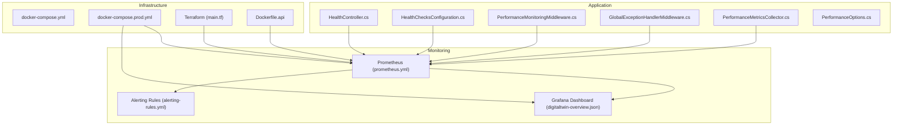
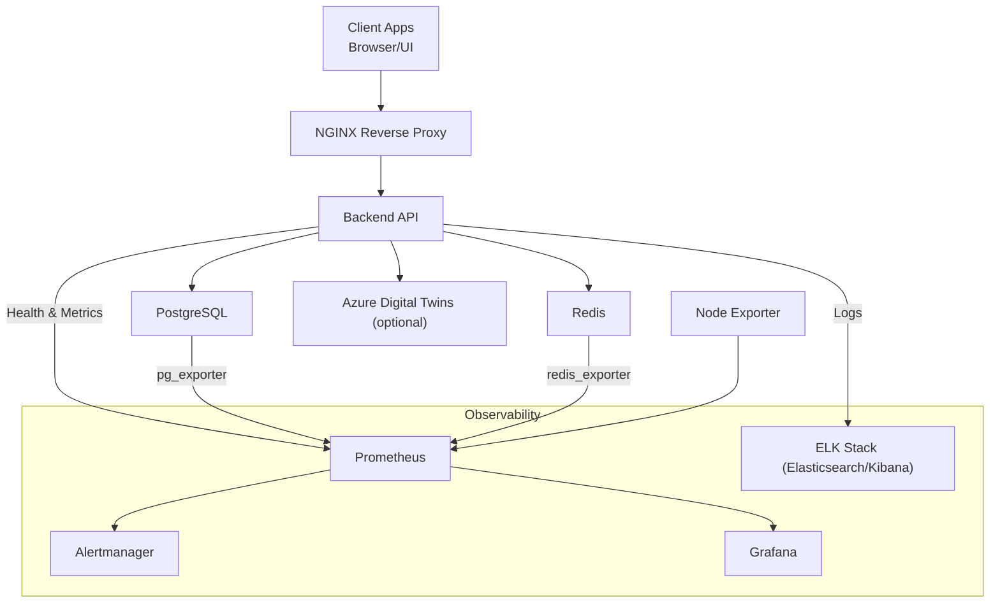
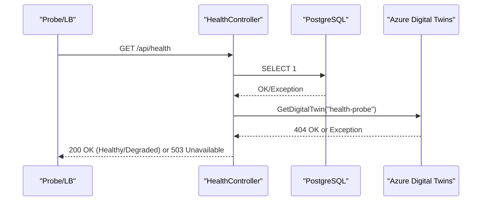
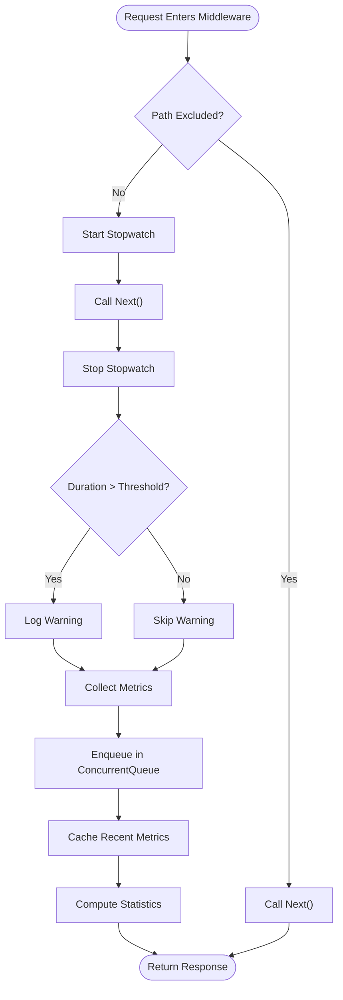
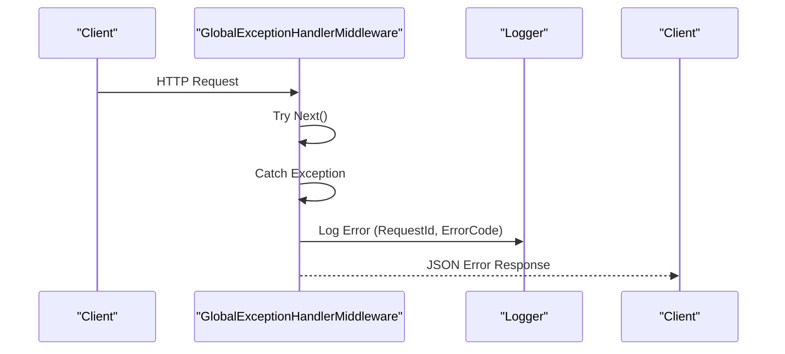
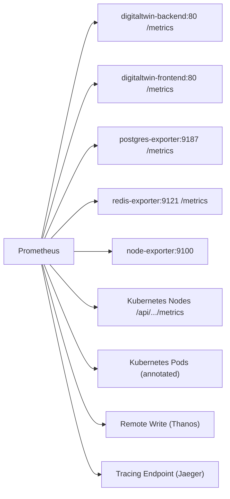
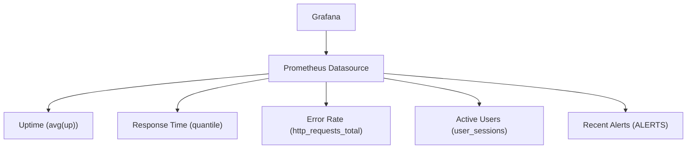
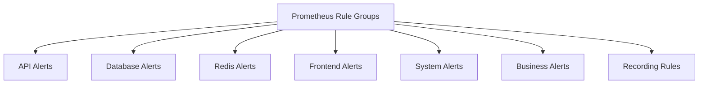
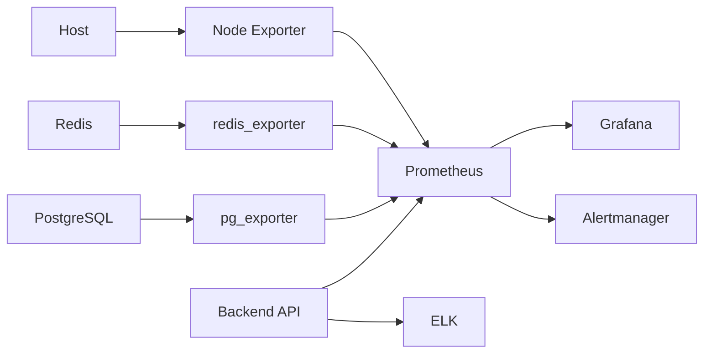

# Monitoring and Observability

<cite>
**Referenced Files in This Document**
- [prometheus.yml](file://monitoring/prometheus/prometheus.yml)
- [alerting-rules.yml](file://monitoring/prometheus/alerting-rules.yml)
- [digitaltwin-overview.json](file://monitoring/grafana/dashboards/digitaltwin-overview.json)
- [HealthChecksConfiguration.cs](file://src/api/DigitalTwinPlatform.API/Infrastructure/HealthChecksConfiguration.cs)
- [MetricsConfiguration.cs](file://src/api/DigitalTwinPlatform.API/Infrastructure/MetricsConfiguration.cs)
- [LoggingConfiguration.cs](file://src/api/DigitalTwinPlatform.API/Infrastructure/LoggingConfiguration.cs)
- [GlobalExceptionHandlerMiddleware.cs](file://src/api/DigitalTwinPlatform.API/Middleware/GlobalExceptionHandlerMiddleware.cs)
- [PerformanceMonitoringMiddleware.cs](file://src/api/DigitalTwinPlatform.API/Middleware/PerformanceMonitoringMiddleware.cs)
- [HealthController.cs](file://src/api/DigitalTwinPlatform.API/Controllers/HealthController.cs)
- [PerformanceMetricsController.cs](file://src/api/DigitalTwinPlatform.API/Controllers/PerformanceMetricsController.cs)
- [PerformanceMetricsCollector.cs](file://src/api/DigitalTwinPlatform.API/Services/Infrastructure/PerformanceMetricsCollector.cs)
- [IPerformanceMetricsCollector.cs](file://src/api/DigitalTwinPlatform.API/Services/Infrastructure/IPerformanceMetricsCollector.cs)
- [PerformanceOptions.cs](file://src/api/DigitalTwinPlatform.API/Services/Infrastructure/PerformanceOptions.cs)
- [Dockerfile.api](file://Dockerfile.api)
- [docker-compose.yml](file://docker-compose.yml)
- [docker-compose.prod.yml](file://docker-compose.prod.yml)
- [main.tf](file://infrastructure/main.tf)
</cite>

## Table of Contents
1. [Introduction](#introduction)
2. [Project Structure](#project-structure)
3. [Core Components](#core-components)
4. [Architecture Overview](#architecture-overview)
5. [Detailed Component Analysis](#detailed-component-analysis)
6. [Dependency Analysis](#dependency-analysis)
7. [Performance Considerations](#performance-considerations)
8. [Troubleshooting Guide](#troubleshooting-guide)
9. [Conclusion](#conclusion)
10. [Appendices](#appendices)

## Introduction
This document describes the monitoring and observability system for the Industrial Digital Twin Platform. It explains health checks, performance metrics collection, error tracking, and integrates Prometheus, Grafana, and alerting rules. It also covers application monitoring, infrastructure metrics, custom metric collection, dashboard creation, alert configuration, performance analysis, logging integration, distributed tracing, real-time monitoring, scalability and capacity planning, incident response, and best practices tailored for industrial environments.

## Project Structure
The observability stack spans application middleware, controllers, services, and infrastructure orchestration:
- Application-level health checks and metrics middleware
- Controllers exposing health and performance metrics
- In-memory metrics collector and statistics
- Prometheus configuration for scraping multiple targets
- Grafana dashboard JSON for visualization
- Docker Compose and Terraform for deployment and infrastructure provisioning

**Diagram sources**
- [HealthController.cs](file://src/api/DigitalTwinPlatform.API/Controllers/HealthController.cs#L1-L154)
- [HealthChecksConfiguration.cs](file://src/api/DigitalTwinPlatform.API/Infrastructure/HealthChecksConfiguration.cs#L1-L76)
- [PerformanceMonitoringMiddleware.cs](file://src/api/DigitalTwinPlatform.API/Middleware/PerformanceMonitoringMiddleware.cs#L1-L148)
- [GlobalExceptionHandlerMiddleware.cs](file://src/api/DigitalTwinPlatform.API/Middleware/GlobalExceptionHandlerMiddleware.cs#L1-L257)
- [PerformanceMetricsCollector.cs](file://src/api/DigitalTwinPlatform.API/Services/Infrastructure/PerformanceMetricsCollector.cs#L1-L131)
- [PerformanceOptions.cs](file://src/api/DigitalTwinPlatform.API/Services/Infrastructure/PerformanceOptions.cs#L1-L24)
- [prometheus.yml](file://monitoring/prometheus/prometheus.yml#L1-L148)
- [alerting-rules.yml](file://monitoring/prometheus/alerting-rules.yml#L1-L184)
- [digitaltwin-overview.json](file://monitoring/grafana/dashboards/digitaltwin-overview.json#L1-L279)
- [docker-compose.yml](file://docker-compose.yml#L1-L81)
- [docker-compose.prod.yml](file://docker-compose.prod.yml#L1-L274)
- [Dockerfile.api](file://Dockerfile.api#L1-L74)
- [main.tf](file://infrastructure/main.tf#L1-L493)

**Section sources**
- [prometheus.yml](file://monitoring/prometheus/prometheus.yml#L1-L148)
- [alerting-rules.yml](file://monitoring/prometheus/alerting-rules.yml#L1-L184)
- [digitaltwin-overview.json](file://monitoring/grafana/dashboards/digitaltwin-overview.json#L1-L279)
- [HealthChecksConfiguration.cs](file://src/api/DigitalTwinPlatform.API/Infrastructure/HealthChecksConfiguration.cs#L1-L76)
- [MetricsConfiguration.cs](file://src/api/DigitalTwinPlatform.API/Infrastructure/MetricsConfiguration.cs#L1-L72)
- [LoggingConfiguration.cs](file://src/api/DigitalTwinPlatform.API/Infrastructure/LoggingConfiguration.cs#L1-L58)
- [GlobalExceptionHandlerMiddleware.cs](file://src/api/DigitalTwinPlatform.API/Middleware/GlobalExceptionHandlerMiddleware.cs#L1-L257)
- [PerformanceMonitoringMiddleware.cs](file://src/api/DigitalTwinPlatform.API/Middleware/PerformanceMonitoringMiddleware.cs#L1-L148)
- [HealthController.cs](file://src/api/DigitalTwinPlatform.API/Controllers/HealthController.cs#L1-L154)
- [PerformanceMetricsController.cs](file://src/api/DigitalTwinPlatform.API/Controllers/PerformanceMetricsController.cs#L1-L75)
- [PerformanceMetricsCollector.cs](file://src/api/DigitalTwinPlatform.API/Services/Infrastructure/PerformanceMetricsCollector.cs#L1-L131)
- [IPerformanceMetricsCollector.cs](file://src/api/DigitalTwinPlatform.API/Services/Infrastructure/IPerformanceMetricsCollector.cs#L1-L26)
- [PerformanceOptions.cs](file://src/api/DigitalTwinPlatform.API/Services/Infrastructure/PerformanceOptions.cs#L1-L24)
- [Dockerfile.api](file://Dockerfile.api#L1-L74)
- [docker-compose.yml](file://docker-compose.yml#L1-L81)
- [docker-compose.prod.yml](file://docker-compose.prod.yml#L1-L274)
- [main.tf](file://infrastructure/main.tf#L1-L493)

## Core Components
- Health checks: Application-level health endpoints and probes for readiness/liveness
- Metrics collection: Request/response metrics via middleware and in-memory collector
- Error tracking: Centralized exception handling with structured logging
- Prometheus: Scrapes backend, frontend, databases, caches, and host metrics
- Grafana: Prebuilt dashboard for overview and alert listing
- Alerting: Comprehensive rules for API, database, cache, system, and business metrics
- Infrastructure: Docker Compose and Terraform provision monitoring stack and services

**Section sources**
- [HealthController.cs](file://src/api/DigitalTwinPlatform.API/Controllers/HealthController.cs#L1-L154)
- [HealthChecksConfiguration.cs](file://src/api/DigitalTwinPlatform.API/Infrastructure/HealthChecksConfiguration.cs#L1-L76)
- [PerformanceMonitoringMiddleware.cs](file://src/api/DigitalTwinPlatform.API/Middleware/PerformanceMonitoringMiddleware.cs#L1-L148)
- [PerformanceMetricsCollector.cs](file://src/api/DigitalTwinPlatform.API/Services/Infrastructure/PerformanceMetricsCollector.cs#L1-L131)
- [GlobalExceptionHandlerMiddleware.cs](file://src/api/DigitalTwinPlatform.API/Middleware/GlobalExceptionHandlerMiddleware.cs#L1-L257)
- [prometheus.yml](file://monitoring/prometheus/prometheus.yml#L1-L148)
- [alerting-rules.yml](file://monitoring/prometheus/alerting-rules.yml#L1-L184)
- [digitaltwin-overview.json](file://monitoring/grafana/dashboards/digitaltwin-overview.json#L1-L279)

## Architecture Overview
The observability pipeline integrates application telemetry, infrastructure exporters, and centralized visualization and alerting.

**Diagram sources**
- [docker-compose.prod.yml](file://docker-compose.prod.yml#L185-L252)
- [prometheus.yml](file://monitoring/prometheus/prometheus.yml#L18-L116)
- [HealthController.cs](file://src/api/DigitalTwinPlatform.API/Controllers/HealthController.cs#L1-L154)

## Detailed Component Analysis

### Health Checks Implementation
- Application-level health endpoints expose readiness and liveness for orchestrators and load balancers
- Database and optional Azure Digital Twins connectivity checks included
- Custom health check registration supports application-specific checks

**Diagram sources**
- [HealthController.cs](file://src/api/DigitalTwinPlatform.API/Controllers/HealthController.cs#L25-L51)
- [HealthController.cs](file://src/api/DigitalTwinPlatform.API/Controllers/HealthController.cs#L76-L98)

**Section sources**
- [HealthController.cs](file://src/api/DigitalTwinPlatform.API/Controllers/HealthController.cs#L1-L154)
- [HealthChecksConfiguration.cs](file://src/api/DigitalTwinPlatform.API/Infrastructure/HealthChecksConfiguration.cs#L10-L35)

### Performance Metrics Collection
- Middleware captures request duration, path, method, status, and slow requests
- In-memory collector aggregates metrics with thresholds and computes percentiles
- Statistics endpoint exposes latency percentiles and threshold violation counts

**Diagram sources**
- [PerformanceMonitoringMiddleware.cs](file://src/api/DigitalTwinPlatform.API/Middleware/PerformanceMonitoringMiddleware.cs#L25-L96)
- [PerformanceMetricsCollector.cs](file://src/api/DigitalTwinPlatform.API/Services/Infrastructure/PerformanceMetricsCollector.cs#L22-L71)

**Section sources**
- [PerformanceMonitoringMiddleware.cs](file://src/api/DigitalTwinPlatform.API/Middleware/PerformanceMonitoringMiddleware.cs#L1-L148)
- [PerformanceMetricsCollector.cs](file://src/api/DigitalTwinPlatform.API/Services/Infrastructure/PerformanceMetricsCollector.cs#L1-L131)
- [IPerformanceMetricsCollector.cs](file://src/api/DigitalTwinPlatform.API/Services/Infrastructure/IPerformanceMetricsCollector.cs#L1-L26)
- [PerformanceOptions.cs](file://src/api/DigitalTwinPlatform.API/Services/Infrastructure/PerformanceOptions.cs#L1-L24)
- [PerformanceMetricsController.cs](file://src/api/DigitalTwinPlatform.API/Controllers/PerformanceMetricsController.cs#L1-L75)

### Error Tracking Mechanisms
- Global exception handler centralizes error responses and logs with correlation identifiers
- Structured logging middleware records request lifecycle with timing and status
- Logging configuration sets providers and minimum levels

**Diagram sources**
- [GlobalExceptionHandlerMiddleware.cs](file://src/api/DigitalTwinPlatform.API/Middleware/GlobalExceptionHandlerMiddleware.cs#L13-L45)
- [LoggingConfiguration.cs](file://src/api/DigitalTwinPlatform.API/Infrastructure/LoggingConfiguration.cs#L29-L53)

**Section sources**
- [GlobalExceptionHandlerMiddleware.cs](file://src/api/DigitalTwinPlatform.API/Middleware/GlobalExceptionHandlerMiddleware.cs#L1-L257)
- [LoggingConfiguration.cs](file://src/api/DigitalTwinPlatform.API/Infrastructure/LoggingConfiguration.cs#L1-L58)

### Prometheus Configuration
- Scrapes backend API, frontend, PostgreSQL exporter, Redis exporter, Node exporter, and Kubernetes targets
- Relabeling normalizes instance labels and filters metrics
- Remote write configured for long-term storage
- Query tuning for concurrency and timeouts
- Optional Jaeger tracing endpoint

**Diagram sources**
- [prometheus.yml](file://monitoring/prometheus/prometheus.yml#L18-L148)

**Section sources**
- [prometheus.yml](file://monitoring/prometheus/prometheus.yml#L1-L148)

### Grafana Dashboard Setup
- Overview dashboard displays uptime, response time, error rate, active users, and recent alerts
- Uses PromQL queries aligned with Prometheus metrics and alert states

**Diagram sources**
- [digitaltwin-overview.json](file://monitoring/grafana/dashboards/digitaltwin-overview.json#L1-L279)

**Section sources**
- [digitaltwin-overview.json](file://monitoring/grafana/dashboards/digitaltwin-overview.json#L1-L279)

### Alerting Rules
- API: Down, high error rate, slow response
- Database: Down, high connections, low cache hit ratio
- Redis: Down, high memory usage, connection saturation
- Frontend: Down, high error rate
- Host: CPU, memory, disk utilization
- Business: Low user activity, high maintenance requests, data processing delays
- Recording rules pre-aggregate common expressions

**Diagram sources**
- [alerting-rules.yml](file://monitoring/prometheus/alerting-rules.yml#L3-L184)

**Section sources**
- [alerting-rules.yml](file://monitoring/prometheus/alerting-rules.yml#L1-L184)

### Application Monitoring
- Backend API exposes health and metrics endpoints
- Middleware captures request metrics and slow requests
- Collector maintains recent metrics and computes statistics

**Section sources**
- [HealthController.cs](file://src/api/DigitalTwinPlatform.API/Controllers/HealthController.cs#L1-L154)
- [PerformanceMonitoringMiddleware.cs](file://src/api/DigitalTwinPlatform.API/Middleware/PerformanceMonitoringMiddleware.cs#L1-L148)
- [PerformanceMetricsCollector.cs](file://src/api/DigitalTwinPlatform.API/Services/Infrastructure/PerformanceMetricsCollector.cs#L1-L131)

### Infrastructure Metrics
- PostgreSQL exporter and Redis exporter exposed to Prometheus
- Node exporter for host-level CPU, memory, filesystem metrics
- Kubernetes SD for nodes and pods

**Section sources**
- [prometheus.yml](file://monitoring/prometheus/prometheus.yml#L48-L116)
- [docker-compose.prod.yml](file://docker-compose.prod.yml#L96-L152)

### Custom Metric Collection
- In-memory queue and sliding window cache for recent metrics
- Threshold configuration per operation type
- Aggregation functions for percentiles and violation rates

**Section sources**
- [PerformanceMetricsCollector.cs](file://src/api/DigitalTwinPlatform.API/Services/Infrastructure/PerformanceMetricsCollector.cs#L1-L131)
- [PerformanceOptions.cs](file://src/api/DigitalTwinPlatform.API/Services/Infrastructure/PerformanceOptions.cs#L1-L24)

### Practical Examples
- Dashboard creation: Import the provided dashboard JSON into Grafana and connect the Prometheus datasource
- Alert configuration: Define severity labels and annotations in alerting rules; integrate with Alertmanager receivers
- Performance analysis: Use latency percentiles and threshold violations to identify regressions and hotspots

[No sources needed since this section provides general guidance]

### Integration with Logging Systems
- Structured logging middleware logs request lifecycle
- Global exception handler serializes errors and attaches correlation IDs
- ELK stack configured for centralized log aggregation

**Section sources**
- [LoggingConfiguration.cs](file://src/api/DigitalTwinPlatform.API/Infrastructure/LoggingConfiguration.cs#L1-L58)
- [GlobalExceptionHandlerMiddleware.cs](file://src/api/DigitalTwinPlatform.API/Middleware/GlobalExceptionHandlerMiddleware.cs#L1-L257)
- [docker-compose.prod.yml](file://docker-compose.prod.yml#L223-L252)

### Distributed Tracing
- Prometheus tracing endpoint configured for Jaeger
- Application metrics use ActivitySource for request spans

**Section sources**
- [prometheus.yml](file://monitoring/prometheus/prometheus.yml#L145-L148)
- [MetricsConfiguration.cs](file://src/api/DigitalTwinPlatform.API/Infrastructure/MetricsConfiguration.cs#L10-L46)

### Real-Time Monitoring
- In-memory metrics collector enables near-real-time dashboards
- Prometheus scrapes at 15s intervals for timely visibility

**Section sources**
- [PerformanceMetricsCollector.cs](file://src/api/DigitalTwinPlatform.API/Services/Infrastructure/PerformanceMetricsCollector.cs#L1-L131)
- [prometheus.yml](file://monitoring/prometheus/prometheus.yml#L3-L7)

### Scalability Monitoring and Capacity Planning
- Horizontal scaling via replicas for frontend and backend
- Resource limits and reservations defined for containers
- Kubernetes node and pod scraping for cluster-wide insights

**Section sources**
- [docker-compose.prod.yml](file://docker-compose.prod.yml#L30-L95)
- [prometheus.yml](file://monitoring/prometheus/prometheus.yml#L77-L116)
- [main.tf](file://infrastructure/main.tf#L97-L142)

### Incident Response Procedures
- Health endpoints for readiness and liveness
- Alerting rules categorized by severity
- Logs and metrics for root cause analysis

**Section sources**
- [HealthController.cs](file://src/api/DigitalTwinPlatform.API/Controllers/HealthController.cs#L58-L98)
- [alerting-rules.yml](file://monitoring/prometheus/alerting-rules.yml#L3-L184)
- [GlobalExceptionHandlerMiddleware.cs](file://src/api/DigitalTwinPlatform.API/Middleware/GlobalExceptionHandlerMiddleware.cs#L229-L249)

## Dependency Analysis
The monitoring stack depends on:
- Application middleware and controllers for telemetry
- Prometheus for scraping and alerting
- Grafana for visualization
- Infrastructure provisioning for exporters and services

**Diagram sources**
- [docker-compose.prod.yml](file://docker-compose.prod.yml#L185-L252)
- [prometheus.yml](file://monitoring/prometheus/prometheus.yml#L18-L116)

**Section sources**
- [docker-compose.prod.yml](file://docker-compose.prod.yml#L1-L274)
- [prometheus.yml](file://monitoring/prometheus/prometheus.yml#L1-L148)

## Performance Considerations
- Use recording rules to pre-aggregate expensive queries
- Tune Prometheus query.max_concurrency and max_samples for large-scale environments
- Apply metric_relabel_configs to reduce cardinality and noise
- Monitor scrape_duration and target availability to prevent overload

[No sources needed since this section provides general guidance]

## Troubleshooting Guide
- Health check failures: Verify database connectivity and Azure Digital Twins client configuration
- Missing metrics: Confirm exporters are reachable and relabeling matches targets
- Slow queries: Review Prometheus query settings and optimize PromQL
- Alert fatigue: Adjust thresholds and severity labels in alerting rules

**Section sources**
- [HealthController.cs](file://src/api/DigitalTwinPlatform.API/Controllers/HealthController.cs#L100-L131)
- [prometheus.yml](file://monitoring/prometheus/prometheus.yml#L33-L36)
- [alerting-rules.yml](file://monitoring/prometheus/alerting-rules.yml#L3-L184)

## Conclusion
The platform’s observability stack combines application telemetry, infrastructure exporters, and centralized visualization and alerting. Health checks, performance metrics, and error tracking are integrated across the backend API, with Prometheus and Grafana providing operational visibility. Alerting rules address critical areas for industrial operations, while infrastructure provisioning ensures scalable and resilient deployments.

[No sources needed since this section summarizes without analyzing specific files]

## Appendices

### Best Practices for Industrial Applications
- Instrument critical paths with latency thresholds and percentiles
- Use structured logging with correlation IDs for incident investigations
- Implement multi-tier alerting with severity-based escalation
- Plan capacity with horizontal scaling and resource quotas
- Continuously refine dashboards and alerts based on operational learnings

[No sources needed since this section provides general guidance]