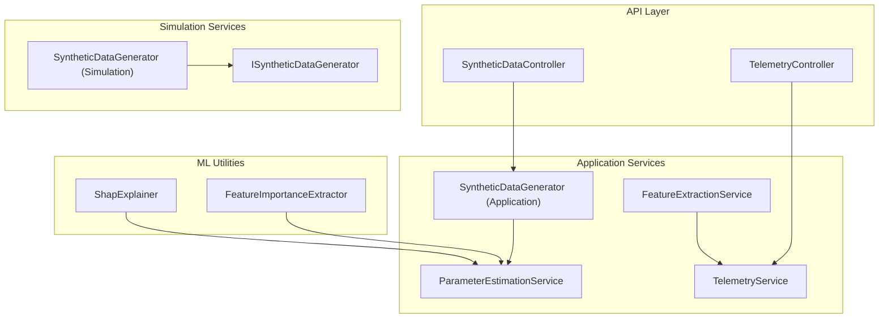
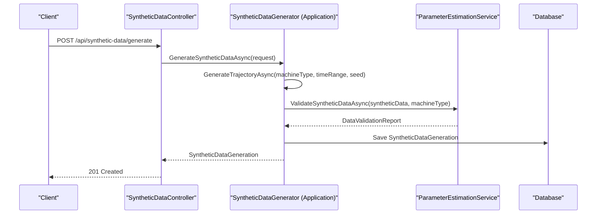
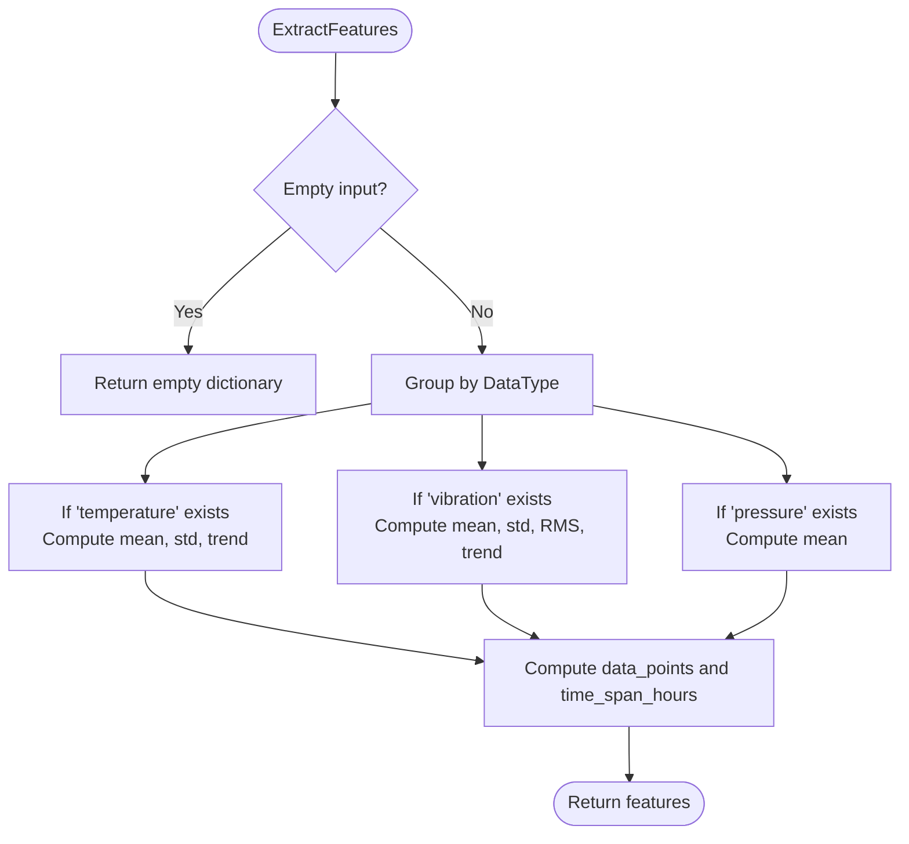
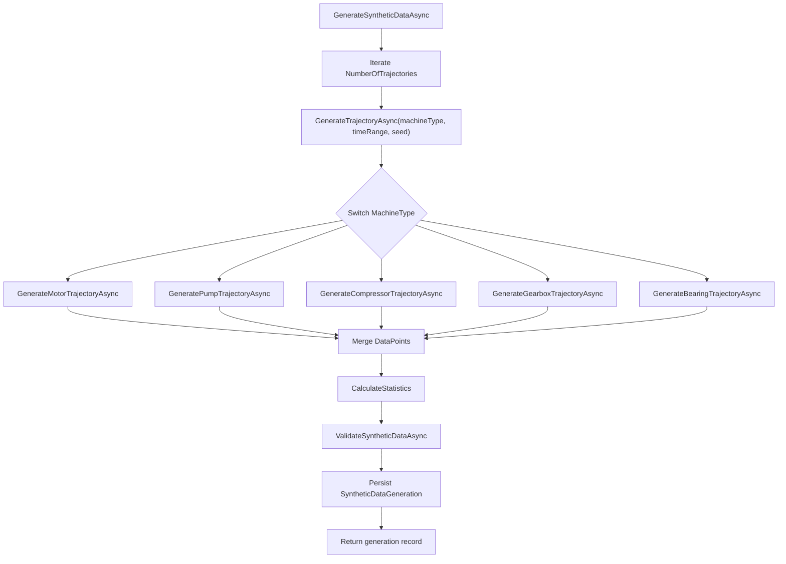
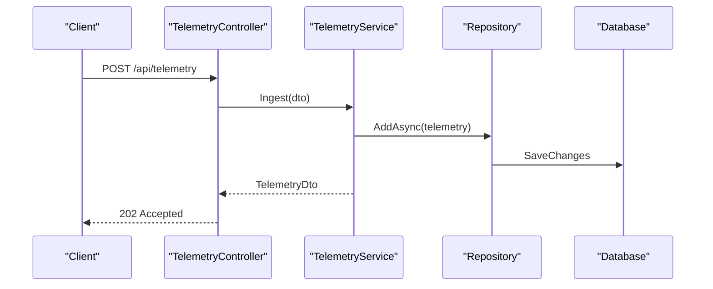
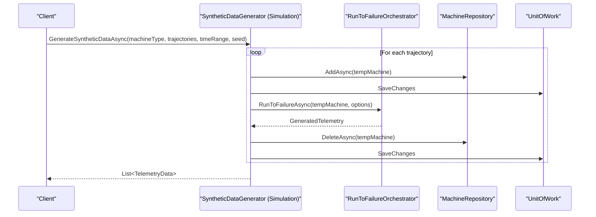
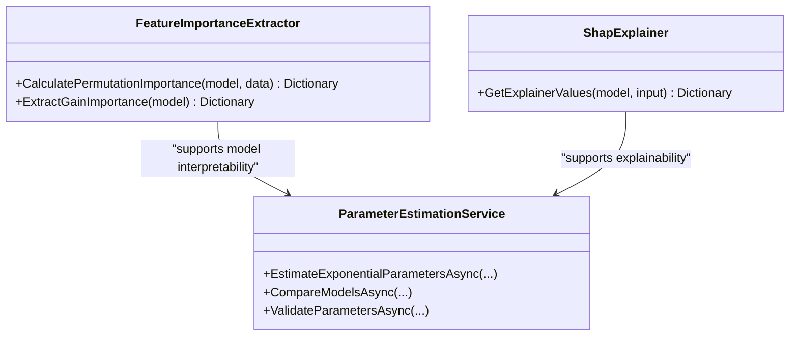
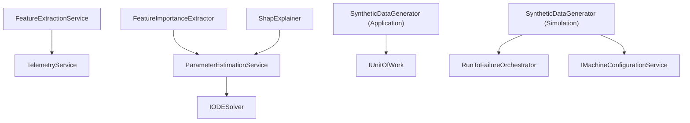

# Feature Engineering and Data Preprocessing

<cite>
**Referenced Files in This Document**
- [FeatureExtractionService.cs](file://src/api/DigitalTwinPlatform.Application/Services/FeatureExtractionService.cs)
- [ParameterEstimationService.cs](file://src/api/DigitalTwinPlatform.Application/Services/ParameterEstimationService.cs)
- [SyntheticDataGenerator.cs](file://src/api/DigitalTwinPlatform.Application/Services/SyntheticDataGenerator.cs)
- [SyntheticDataController.cs](file://src/api/DigitalTwinPlatform.API/Controllers/SyntheticDataController.cs)
- [TelemetryController.cs](file://src/api/DigitalTwinPlatform.API/Controllers/TelemetryController.cs)
- [SyntheticDataGenerator.cs](file://src/api/DigitalTwinPlatform.API/Services/Simulation/SyntheticDataGenerator.cs)
- [ISyntheticDataGenerator.cs](file://src/api/DigitalTwinPlatform.API/Services/Simulation/ISyntheticDataGenerator.cs)
- [FeatureImportanceExtractor.cs](file://src/api/DigitalTwinPlatform.Application/ML/FeatureImportanceExtractor.cs)
- [ShapExplainer.cs](file://src/api/DigitalTwinPlatform.Application/ML/ShapExplainer.cs)
- [TelemetryService.cs](file://src/api/DigitalTwinPlatform.Application/Services/TelemetryService.cs)
</cite>

## Table of Contents
1. [Introduction](#introduction)
2. [Project Structure](#project-structure)
3. [Core Components](#core-components)
4. [Architecture Overview](#architecture-overview)
5. [Detailed Component Analysis](#detailed-component-analysis)
6. [Dependency Analysis](#dependency-analysis)
7. [Performance Considerations](#performance-considerations)
8. [Troubleshooting Guide](#troubleshooting-guide)
9. [Conclusion](#conclusion)
10. [Appendices](#appendices)

## Introduction
This document explains the feature engineering and data preprocessing systems implemented in the platform. It focuses on:
- Statistical feature extraction from telemetry streams
- Physics-informed synthetic data generation and benchmark validation
- Parameter estimation for degradation models
- Feature selection, dimensionality reduction, and feature importance ranking
- Data preprocessing pipelines, normalization, and handling missing/corrupted data
- Practical workflows and best practices for improving model performance through robust feature engineering

## Project Structure
The feature engineering and data preprocessing capabilities span application services, APIs, and ML utilities:
- Application services implement core logic for feature extraction, parameter estimation, and synthetic data generation/validation
- API controllers expose endpoints for telemetry ingestion and synthetic data operations
- Simulation services provide alternative synthetic data generation using run-to-failure orchestration
- ML utilities support feature importance and SHAP-style explanations



**Diagram sources**
- [SyntheticDataController.cs](file://src/api/DigitalTwinPlatform.API/Controllers/SyntheticDataController.cs#L1-L143)
- [TelemetryController.cs](file://src/api/DigitalTwinPlatform.API/Controllers/TelemetryController.cs#L1-L202)
- [FeatureExtractionService.cs](file://src/api/DigitalTwinPlatform.Application/Services/FeatureExtractionService.cs#L1-L105)
- [ParameterEstimationService.cs](file://src/api/DigitalTwinPlatform.Application/Services/ParameterEstimationService.cs#L1-L625)
- [SyntheticDataGenerator.cs](file://src/api/DigitalTwinPlatform.Application/Services/SyntheticDataGenerator.cs#L1-L533)
- [SyntheticDataGenerator.cs](file://src/api/DigitalTwinPlatform.API/Services/Simulation/SyntheticDataGenerator.cs#L1-L415)
- [ISyntheticDataGenerator.cs](file://src/api/DigitalTwinPlatform.API/Services/Simulation/ISyntheticDataGenerator.cs#L1-L65)
- [FeatureImportanceExtractor.cs](file://src/api/DigitalTwinPlatform.Application/ML/FeatureImportanceExtractor.cs#L1-L79)
- [ShapExplainer.cs](file://src/api/DigitalTwinPlatform.Application/ML/ShapExplainer.cs#L1-L62)
- [TelemetryService.cs](file://src/api/DigitalTwinPlatform.Application/Services/TelemetryService.cs#L1-L189)

**Section sources**
- [SyntheticDataController.cs](file://src/api/DigitalTwinPlatform.API/Controllers/SyntheticDataController.cs#L1-L143)
- [TelemetryController.cs](file://src/api/DigitalTwinPlatform.API/Controllers/TelemetryController.cs#L1-L202)
- [FeatureExtractionService.cs](file://src/api/DigitalTwinPlatform.Application/Services/FeatureExtractionService.cs#L1-L105)
- [ParameterEstimationService.cs](file://src/api/DigitalTwinPlatform.Application/Services/ParameterEstimationService.cs#L1-L625)
- [SyntheticDataGenerator.cs](file://src/api/DigitalTwinPlatform.Application/Services/SyntheticDataGenerator.cs#L1-L533)
- [SyntheticDataGenerator.cs](file://src/api/DigitalTwinPlatform.API/Services/Simulation/SyntheticDataGenerator.cs#L1-L415)
- [ISyntheticDataGenerator.cs](file://src/api/DigitalTwinPlatform.API/Services/Simulation/ISyntheticDataGenerator.cs#L1-L65)
- [FeatureImportanceExtractor.cs](file://src/api/DigitalTwinPlatform.Application/ML/FeatureImportanceExtractor.cs#L1-L79)
- [ShapExplainer.cs](file://src/api/DigitalTwinPlatform.Application/ML/ShapExplainer.cs#L1-L62)
- [TelemetryService.cs](file://src/api/DigitalTwinPlatform.Application/Services/TelemetryService.cs#L1-L189)

## Core Components
- FeatureExtractionService: Computes per-sensor statistics (means, standard deviations, RMS, trends) and temporal aggregates from telemetry streams
- ParameterEstimationService: Calibrates degradation models (exponential, power-law, multi-variable) using maximum likelihood and validates parameters via cross-validation
- SyntheticDataGenerator (Application): Generates synthetic trajectories per machine type with physics-informed models and validates against benchmark statistics
- TelemetryService: Ingests, persists, and cleans up telemetry; computes health metrics and supports real-time dashboards
- Simulation SyntheticDataGenerator: Alternative generator using run-to-failure orchestration and feature-based validation against benchmarks
- ML Utilities: FeatureImportanceExtractor and ShapExplainer provide model interpretability and feature ranking

**Section sources**
- [FeatureExtractionService.cs](file://src/api/DigitalTwinPlatform.Application/Services/FeatureExtractionService.cs#L12-L105)
- [ParameterEstimationService.cs](file://src/api/DigitalTwinPlatform.Application/Services/ParameterEstimationService.cs#L16-L625)
- [SyntheticDataGenerator.cs](file://src/api/DigitalTwinPlatform.Application/Services/SyntheticDataGenerator.cs#L16-L533)
- [TelemetryService.cs](file://src/api/DigitalTwinPlatform.Application/Services/TelemetryService.cs#L14-L189)
- [SyntheticDataGenerator.cs](file://src/api/DigitalTwinPlatform.API/Services/Simulation/SyntheticDataGenerator.cs#L11-L415)
- [ISyntheticDataGenerator.cs](file://src/api/DigitalTwinPlatform.API/Services/Simulation/ISyntheticDataGenerator.cs#L5-L65)
- [FeatureImportanceExtractor.cs](file://src/api/DigitalTwinPlatform.Application/ML/FeatureImportanceExtractor.cs#L8-L79)
- [ShapExplainer.cs](file://src/api/DigitalTwinPlatform.Application/ML/ShapExplainer.cs#L6-L62)

## Architecture Overview
The system integrates telemetry ingestion, feature extraction, synthetic data generation, and parameter estimation into a cohesive pipeline supporting model training and validation.



**Diagram sources**
- [SyntheticDataController.cs](file://src/api/DigitalTwinPlatform.API/Controllers/SyntheticDataController.cs#L36-L57)
- [SyntheticDataGenerator.cs](file://src/api/DigitalTwinPlatform.Application/Services/SyntheticDataGenerator.cs#L34-L105)
- [ParameterEstimationService.cs](file://src/api/DigitalTwinPlatform.Application/Services/ParameterEstimationService.cs#L396-L457)

## Detailed Component Analysis

### FeatureExtractionService
Computes per-feature statistics and temporal aggregates from telemetry:
- Filters telemetry by data type (temperature, vibration, pressure)
- Extracts numeric values safely from JSON payloads
- Calculates descriptive statistics (mean, std dev, RMS, trend)
- Aggregates temporal coverage and count metrics



**Diagram sources**
- [FeatureExtractionService.cs](file://src/api/DigitalTwinPlatform.Application/Services/FeatureExtractionService.cs#L14-L53)

**Section sources**
- [FeatureExtractionService.cs](file://src/api/DigitalTwinPlatform.Application/Services/FeatureExtractionService.cs#L12-L105)

### ParameterEstimationService
Calibrates degradation models and validates parameters:
- Supports exponential, power-law, and multi-variable models
- Uses gradient descent optimization with numerical gradients
- Computes log-likelihood, AIC/BIC, and parameter uncertainties
- Performs cross-validation and R-squared scoring

```mermaid
sequenceDiagram
participant Caller as "Caller"
participant Param as "ParameterEstimationService"
participant Opt as "OptimizeParametersAsync"
participant Lik as "Log-likelihood"
participant Val as "ValidateParametersAsync"
Caller->>Param : EstimateExponentialParametersAsync(data)
Param->>Param : Extract times and health scores
Param->>Opt : Optimize parameters (gradient descent)
Opt-->>Param : Optimized parameters
Param->>Lik : Compute log-likelihood, AIC, BIC
Param-->>Caller : ParameterEstimationResult
Caller->>Val : ValidateParametersAsync(result, data)
Val-->>Caller : ParameterValidationResult
```

**Diagram sources**
- [ParameterEstimationService.cs](file://src/api/DigitalTwinPlatform.Application/Services/ParameterEstimationService.cs#L32-L93)
- [ParameterEstimationService.cs](file://src/api/DigitalTwinPlatform.Application/Services/ParameterEstimationService.cs#L399-L451)
- [ParameterEstimationService.cs](file://src/api/DigitalTwinPlatform.Application/Services/ParameterEstimationService.cs#L269-L326)

**Section sources**
- [ParameterEstimationService.cs](file://src/api/DigitalTwinPlatform.Application/Services/ParameterEstimationService.cs#L16-L625)

### SyntheticDataGenerator (Application)
Generates synthetic trajectories per machine type with physics-informed models:
- Motor, pump, compressor, gearbox, and bearing trajectories
- Computes health scores based on physical relationships
- Validates synthetic data against benchmark statistics and returns a validation report
- Persists generation records and statistics



**Diagram sources**
- [SyntheticDataGenerator.cs](file://src/api/DigitalTwinPlatform.Application/Services/SyntheticDataGenerator.cs#L34-L105)
- [SyntheticDataGenerator.cs](file://src/api/DigitalTwinPlatform.Application/Services/SyntheticDataGenerator.cs#L110-L151)
- [SyntheticDataGenerator.cs](file://src/api/DigitalTwinPlatform.Application/Services/SyntheticDataGenerator.cs#L396-L457)

**Section sources**
- [SyntheticDataGenerator.cs](file://src/api/DigitalTwinPlatform.Application/Services/SyntheticDataGenerator.cs#L16-L533)

### TelemetryService
Handles telemetry ingestion, persistence, retrieval, and cleanup:
- Converts ingestion DTOs to domain entities and computes health metrics
- Supports recent telemetry retrieval and time-range queries
- Periodically cleans up old telemetry to maintain performance



**Diagram sources**
- [TelemetryController.cs](file://src/api/DigitalTwinPlatform.API/Controllers/TelemetryController.cs#L52-L56)
- [TelemetryService.cs](file://src/api/DigitalTwinPlatform.Application/Services/TelemetryService.cs#L30-L86)

**Section sources**
- [TelemetryService.cs](file://src/api/DigitalTwinPlatform.Application/Services/TelemetryService.cs#L14-L189)
- [TelemetryController.cs](file://src/api/DigitalTwinPlatform.API/Controllers/TelemetryController.cs#L20-L202)

### Simulation SyntheticDataGenerator
Alternative synthetic generation using run-to-failure orchestration:
- Creates temporary machines and runs simulations with configurable step intervals and max simulation time
- Aggregates telemetry across trajectories and computes feature-based statistics
- Validates synthetic data against benchmark statistics and produces a structured validation report



**Diagram sources**
- [SyntheticDataGenerator.cs](file://src/api/DigitalTwinPlatform.API/Services/Simulation/SyntheticDataGenerator.cs#L33-L117)
- [ISyntheticDataGenerator.cs](file://src/api/DigitalTwinPlatform.API/Services/Simulation/ISyntheticDataGenerator.cs#L7-L25)

**Section sources**
- [SyntheticDataGenerator.cs](file://src/api/DigitalTwinPlatform.API/Services/Simulation/SyntheticDataGenerator.cs#L11-L415)
- [ISyntheticDataGenerator.cs](file://src/api/DigitalTwinPlatform.API/Services/Simulation/ISyntheticDataGenerator.cs#L5-L65)

### ML Utilities: Feature Importance and SHAP Explainer
- FeatureImportanceExtractor: Computes permutation feature importance and gain-based importance for regression models
- ShapExplainer: Provides SHAP-like feature contributions for predictions (with mock values in current implementation)



**Diagram sources**
- [FeatureImportanceExtractor.cs](file://src/api/DigitalTwinPlatform.Application/ML/FeatureImportanceExtractor.cs#L8-L79)
- [ShapExplainer.cs](file://src/api/DigitalTwinPlatform.Application/ML/ShapExplainer.cs#L6-L62)
- [ParameterEstimationService.cs](file://src/api/DigitalTwinPlatform.Application/Services/ParameterEstimationService.cs#L16-L625)

**Section sources**
- [FeatureImportanceExtractor.cs](file://src/api/DigitalTwinPlatform.Application/ML/FeatureImportanceExtractor.cs#L8-L79)
- [ShapExplainer.cs](file://src/api/DigitalTwinPlatform.Application/ML/ShapExplainer.cs#L6-L62)

## Dependency Analysis
Key dependencies and relationships:
- FeatureExtractionService depends on TelemetryService for data access and on domain telemetry entities
- ParameterEstimationService depends on IODESolver for numerical solutions and uses synthetic data points
- Application SyntheticDataGenerator depends on IUnitOfWork and repositories for persistence
- Simulation SyntheticDataGenerator depends on orchestration and configuration services
- ML utilities depend on ML.NET for model training and evaluation



**Diagram sources**
- [FeatureExtractionService.cs](file://src/api/DigitalTwinPlatform.Application/Services/FeatureExtractionService.cs#L1-L10)
- [ParameterEstimationService.cs](file://src/api/DigitalTwinPlatform.Application/Services/ParameterEstimationService.cs#L18-L27)
- [SyntheticDataGenerator.cs](file://src/api/DigitalTwinPlatform.Application/Services/SyntheticDataGenerator.cs#L18-L29)
- [SyntheticDataGenerator.cs](file://src/api/DigitalTwinPlatform.API/Services/Simulation/SyntheticDataGenerator.cs#L13-L31)
- [FeatureImportanceExtractor.cs](file://src/api/DigitalTwinPlatform.Application/ML/FeatureImportanceExtractor.cs#L1-L79)
- [ShapExplainer.cs](file://src/api/DigitalTwinPlatform.Application/ML/ShapExplainer.cs#L1-L62)

**Section sources**
- [FeatureExtractionService.cs](file://src/api/DigitalTwinPlatform.Application/Services/FeatureExtractionService.cs#L1-L10)
- [ParameterEstimationService.cs](file://src/api/DigitalTwinPlatform.Application/Services/ParameterEstimationService.cs#L16-L27)
- [SyntheticDataGenerator.cs](file://src/api/DigitalTwinPlatform.Application/Services/SyntheticDataGenerator.cs#L16-L29)
- [SyntheticDataGenerator.cs](file://src/api/DigitalTwinPlatform.API/Services/Simulation/SyntheticDataGenerator.cs#L11-L31)
- [FeatureImportanceExtractor.cs](file://src/api/DigitalTwinPlatform.Application/ML/FeatureImportanceExtractor.cs#L8-L79)
- [ShapExplainer.cs](file://src/api/DigitalTwinPlatform.Application/ML/ShapExplainer.cs#L6-L62)

## Performance Considerations
- Feature extraction uses streaming-friendly aggregations and avoids unnecessary allocations
- Parameter estimation employs gradient descent with adaptive learning rate and numerical gradients
- Synthetic data generation supports high-throughput trajectory generation with seeded randomness
- Telemetry ingestion logs performance and warns on latency exceeding thresholds
- Simulation-based generator uses run-to-failure orchestration with configurable step sizes and time limits

[No sources needed since this section provides general guidance]

## Troubleshooting Guide
Common issues and resolutions:
- Feature extraction returns empty features for empty input; ensure telemetry lists are populated
- Safe numeric extraction falls back to zero on malformed JSON; validate telemetry payloads and schemas
- Parameter estimation requires sufficient data points; ensure adequate time-series length for reliable calibration
- Synthetic data validation may fail if distributions deviate significantly from benchmarks; adjust drift/diffusion parameters
- Telemetry ingestion warnings indicate processing latency; review database performance and indexing

**Section sources**
- [FeatureExtractionService.cs](file://src/api/DigitalTwinPlatform.Application/Services/FeatureExtractionService.cs#L55-L73)
- [ParameterEstimationService.cs](file://src/api/DigitalTwinPlatform.Application/Services/ParameterEstimationService.cs#L32-L93)
- [SyntheticDataGenerator.cs](file://src/api/DigitalTwinPlatform.Application/Services/SyntheticDataGenerator.cs#L396-L457)
- [TelemetryService.cs](file://src/api/DigitalTwinPlatform.Application/Services/TelemetryService.cs#L62-L78)

## Conclusion
The platform’s feature engineering and data preprocessing stack combines statistical feature extraction, physics-informed synthetic data generation, and robust parameter estimation. Together with ML utilities for interpretability, these components enable high-quality datasets and interpretable models for predictive maintenance and degradation modeling.

[No sources needed since this section summarizes without analyzing specific files]

## Appendices

### Example Workflows

- Feature extraction workflow
  - Ingest telemetry via TelemetryController
  - Compute features using FeatureExtractionService
  - Use features for downstream analytics or model training

- Synthetic data generation and validation
  - Call SyntheticDataController to generate synthetic data
  - Validate against benchmarks using built-in validation logic
  - Persist generation records for audit and reuse

- Parameter estimation workflow
  - Prepare historical synthetic data points
  - Estimate model parameters using ParameterEstimationService
  - Validate parameters via cross-validation and select best model by AIC/BIC

- Data preprocessing and quality validation
  - Normalize features using computed means/stds
  - Handle missing or corrupted data using safe extraction and fallbacks
  - Apply feature selection and dimensionality reduction guided by feature importance

[No sources needed since this section provides general guidance]