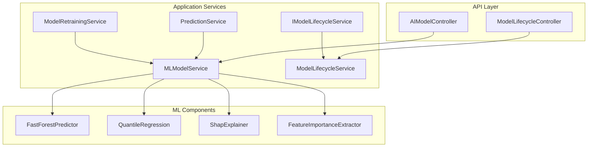
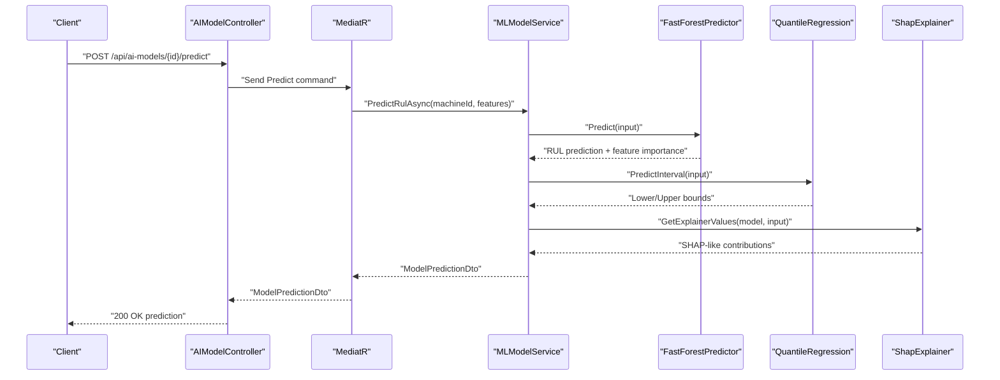
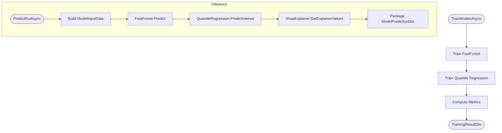
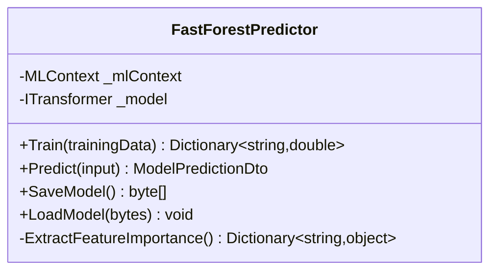
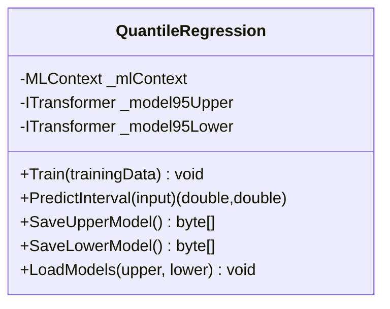
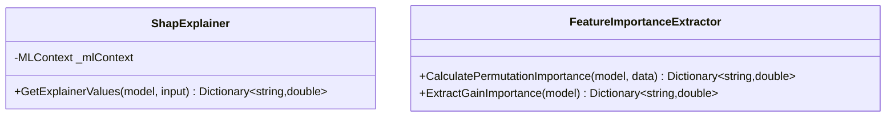
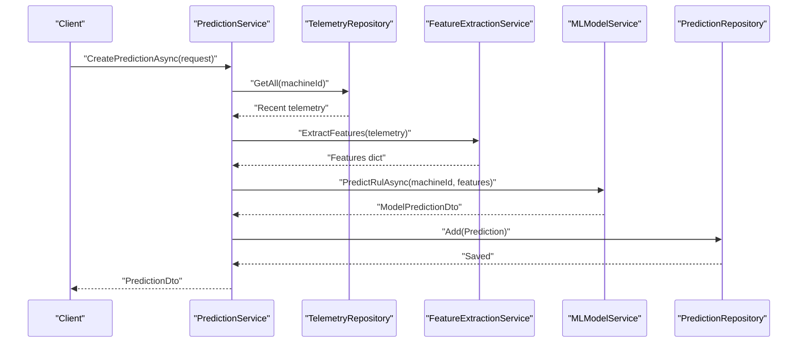
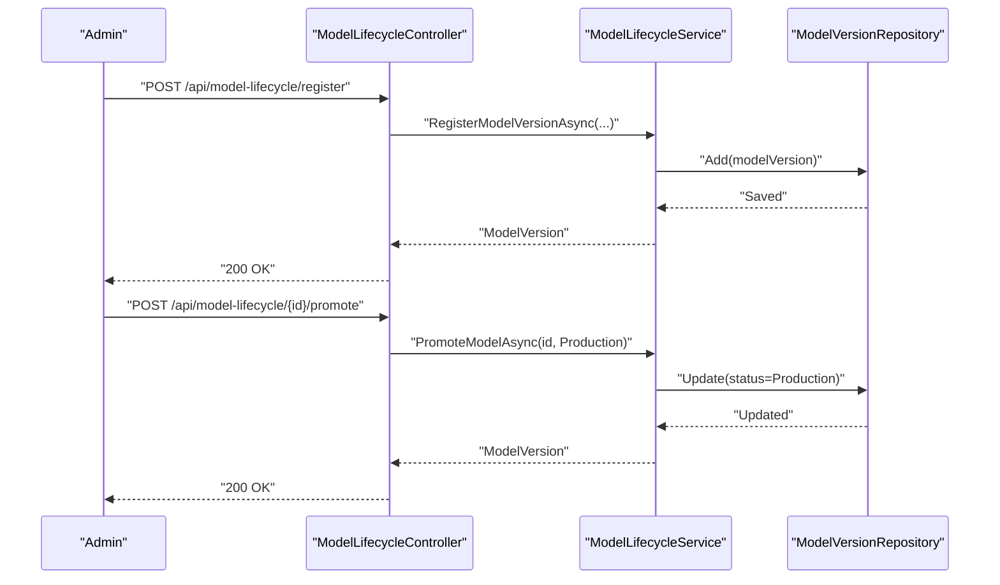
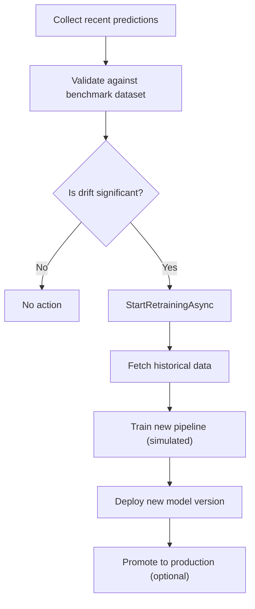
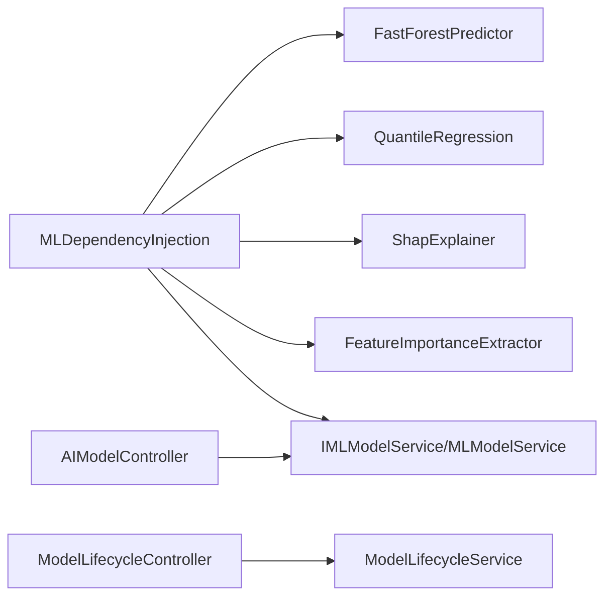

# ML.NET Integration and Model Management

<cite>
**Referenced Files in This Document**
- [MLModelService.cs](file://src/api/DigitalTwinPlatform.Application/Services/MLModelService.cs)
- [PredictionService.cs](file://src/api/DigitalTwinPlatform.Application/Services/PredictionService.cs)
- [MLDependencyInjection.cs](file://src/api/DigitalTwinPlatform.Application/ML/MLDependencyInjection.cs)
- [FastForestPredictor.cs](file://src/api/DigitalTwinPlatform.Application/ML/FastForestPredictor.cs)
- [QuantileRegression.cs](file://src/api/DigitalTwinPlatform.Application/ML/QuantileRegression.cs)
- [ShapExplainer.cs](file://src/api/DigitalTwinPlatform.Application/ML/ShapExplainer.cs)
- [FeatureImportanceExtractor.cs](file://src/api/DigitalTwinPlatform.Application/ML/FeatureImportanceExtractor.cs)
- [IModelLifecycleService.cs](file://src/api/DigitalTwinPlatform.API/Services/Analytics/IModelLifecycleService.cs)
- [ModelLifecycleService.cs](file://src/api/DigitalTwinPlatform.API/Services/Analytics/ModelLifecycleService.cs)
- [ModelRetrainingService.cs](file://src/api/DigitalTwinPlatform.API/Services/Analytics/ModelRetrainingService.cs)
- [AIModelController.cs](file://src/api/DigitalTwinPlatform.API/Controllers/AIModelController.cs)
- [ModelLifecycleController.cs](file://src/api/DigitalTwinPlatform.API/Controllers/ModelLifecycleController.cs)
</cite>

## Table of Contents
1. [Introduction](#introduction)
2. [Project Structure](#project-structure)
3. [Core Components](#core-components)
4. [Architecture Overview](#architecture-overview)
5. [Detailed Component Analysis](#detailed-component-analysis)
6. [Dependency Analysis](#dependency-analysis)
7. [Performance Considerations](#performance-considerations)
8. [Troubleshooting Guide](#troubleshooting-guide)
9. [Conclusion](#conclusion)
10. [Appendices](#appendices)

## Introduction
This document explains the ML.NET integration and model management within the predictive maintenance engine. It focuses on the MLModelService orchestration, the FastForestPredictor ensemble model, QuantileRegression for uncertainty quantification, and the SHAP-style explainer for interpretability. It also covers model lifecycle management, training workflows, inference pipelines, performance optimization, model versioning, automated retraining triggers, and quality assurance processes.

## Project Structure
The ML stack spans the Application layer (ML pipeline components and services) and the API layer (controllers and lifecycle services). Key areas:
- Application ML components: FastForestPredictor, QuantileRegression, ShapExplainer, FeatureImportanceExtractor, MLModelService, PredictionService.
- API controllers: AIModelController for model deployment and management, ModelLifecycleController for versioning and comparisons.
- Analytics services: IModelLifecycleService/ModelLifecycleService for model versioning and performance, ModelRetrainingService for drift detection and retraining.

**Diagram sources**
- [AIModelController.cs](file://src/api/DigitalTwinPlatform.API/Controllers/AIModelController.cs#L1-L464)
- [ModelLifecycleController.cs](file://src/api/DigitalTwinPlatform.API/Controllers/ModelLifecycleController.cs#L1-L220)
- [MLModelService.cs](file://src/api/DigitalTwinPlatform.Application/Services/MLModelService.cs#L1-L248)
- [PredictionService.cs](file://src/api/DigitalTwinPlatform.Application/Services/PredictionService.cs#L1-L335)
- [IModelLifecycleService.cs](file://src/api/DigitalTwinPlatform.API/Services/Analytics/IModelLifecycleService.cs#L1-L69)
- [ModelLifecycleService.cs](file://src/api/DigitalTwinPlatform.API/Services/Analytics/ModelLifecycleService.cs#L1-L261)
- [ModelRetrainingService.cs](file://src/api/DigitalTwinPlatform.API/Services/Analytics/ModelRetrainingService.cs#L1-L69)
- [FastForestPredictor.cs](file://src/api/DigitalTwinPlatform.Application/ML/FastForestPredictor.cs#L1-L158)
- [QuantileRegression.cs](file://src/api/DigitalTwinPlatform.Application/ML/QuantileRegression.cs#L1-L88)
- [ShapExplainer.cs](file://src/api/DigitalTwinPlatform.Application/ML/ShapExplainer.cs#L1-L62)
- [FeatureImportanceExtractor.cs](file://src/api/DigitalTwinPlatform.Application/ML/FeatureImportanceExtractor.cs#L1-L79)

**Section sources**
- [MLDependencyInjection.cs](file://src/api/DigitalTwinPlatform.Application/ML/MLDependencyInjection.cs#L1-L40)
- [MLModelService.cs](file://src/api/DigitalTwinPlatform.Application/Services/MLModelService.cs#L1-L248)
- [PredictionService.cs](file://src/api/DigitalTwinPlatform.Application/Services/PredictionService.cs#L1-L335)

## Core Components
- MLModelService orchestrates the end-to-end pipeline: trains FastForest and Quantile models, performs inference, computes uncertainty bounds, and generates SHAP-like explanations.
- FastForestPredictor encapsulates ML.NET FastForest regression training, evaluation, prediction, and persistence.
- QuantileRegression trains separate FastTree models for upper and lower quantiles to produce confidence intervals.
- ShapExplainer provides SHAP-style feature contributions via permutation feature importance fallback.
- FeatureImportanceExtractor supports both gain-based and permutation feature importance extraction.
- PredictionService integrates telemetry ingestion, feature extraction, and MLModelService to produce predictions with health classification and uncertainty.

**Section sources**
- [MLModelService.cs](file://src/api/DigitalTwinPlatform.Application/Services/MLModelService.cs#L14-L127)
- [FastForestPredictor.cs](file://src/api/DigitalTwinPlatform.Application/ML/FastForestPredictor.cs#L9-L127)
- [QuantileRegression.cs](file://src/api/DigitalTwinPlatform.Application/ML/QuantileRegression.cs#L7-L86)
- [ShapExplainer.cs](file://src/api/DigitalTwinPlatform.Application/ML/ShapExplainer.cs#L6-L54)
- [FeatureImportanceExtractor.cs](file://src/api/DigitalTwinPlatform.Application/ML/FeatureImportanceExtractor.cs#L8-L77)
- [PredictionService.cs](file://src/api/DigitalTwinPlatform.Application/Services/PredictionService.cs#L14-L101)

## Architecture Overview
The ML pipeline follows a layered architecture:
- Data ingestion and feature extraction in PredictionService.
- Ensemble prediction via FastForest.
- Uncertainty quantification via QuantileRegression.
- Interpretability via SHAP-style contributions.
- Model lifecycle and retraining orchestrated by API controllers and services.

**Diagram sources**
- [AIModelController.cs](file://src/api/DigitalTwinPlatform.API/Controllers/AIModelController.cs#L213-L242)
- [MLModelService.cs](file://src/api/DigitalTwinPlatform.Application/Services/MLModelService.cs#L36-L72)
- [FastForestPredictor.cs](file://src/api/DigitalTwinPlatform.Application/ML/FastForestPredictor.cs#L65-L86)
- [QuantileRegression.cs](file://src/api/DigitalTwinPlatform.Application/ML/QuantileRegression.cs#L46-L60)
- [ShapExplainer.cs](file://src/api/DigitalTwinPlatform.Application/ML/ShapExplainer.cs#L17-L54)

## Detailed Component Analysis

### MLModelService
Responsibilities:
- Coordinates FastForest and QuantileRegression training.
- Performs inference combining base prediction and uncertainty bounds.
- Generates SHAP-like feature contributions.
- Computes evaluation metrics (R2, MAE, RMSE, MAPE) for training results.

Key behaviors:
- Training pipeline: trains FastForest, then quantile models; returns metrics and timestamps.
- Inference pipeline: constructs input, predicts RUL, computes confidence intervals, extracts SHAP-like contributions, and packages results.
- Evaluation helpers: calculates R2, MAE, RMSE, and MAPE using FastForest predictions against training data.

**Diagram sources**
- [MLModelService.cs](file://src/api/DigitalTwinPlatform.Application/Services/MLModelService.cs#L74-L127)
- [FastForestPredictor.cs](file://src/api/DigitalTwinPlatform.Application/ML/FastForestPredictor.cs#L23-L63)
- [QuantileRegression.cs](file://src/api/DigitalTwinPlatform.Application/ML/QuantileRegression.cs#L13-L60)
- [ShapExplainer.cs](file://src/api/DigitalTwinPlatform.Application/ML/ShapExplainer.cs#L17-L54)

**Section sources**
- [MLModelService.cs](file://src/api/DigitalTwinPlatform.Application/Services/MLModelService.cs#L14-L246)

### FastForestPredictor
Responsibilities:
- Loads training data, splits into train/test, builds FastForest regression pipeline, fits model, evaluates metrics, and persists model bytes.
- Produces predictions and risk levels; provides feature importance extraction (mocked in current implementation).
- Supports model load/save for deployment scenarios.

Implementation highlights:
- Concatenates six features: Temperature, Vibration, Pressure, Rpm, Age, CycleCount.
- Uses FastForest trainer with configurable hyperparameters.
- Exposes SaveModel/LoadModel for persistence.

**Diagram sources**
- [FastForestPredictor.cs](file://src/api/DigitalTwinPlatform.Application/ML/FastForestPredictor.cs#L9-L127)

**Section sources**
- [FastForestPredictor.cs](file://src/api/DigitalTwinPlatform.Application/ML/FastForestPredictor.cs#L23-L127)

### QuantileRegression
Responsibilities:
- Trains two FastTree models for upper and lower quantiles to estimate prediction intervals.
- Provides prediction engines for interval bounds and supports model persistence.

Implementation highlights:
- Trains separate models per quantile (e.g., 0.05 and 0.95).
- Returns tuple of (lower, upper) bounds during inference.

**Diagram sources**
- [QuantileRegression.cs](file://src/api/DigitalTwinPlatform.Application/ML/QuantileRegression.cs#L7-L86)

**Section sources**
- [QuantileRegression.cs](file://src/api/DigitalTwinPlatform.Application/ML/QuantileRegression.cs#L13-L86)

### ShapExplainer and FeatureImportanceExtractor
Responsibilities:
- ShapExplainer: Generates SHAP-like feature contributions using permutation feature importance fallback and logs warnings for unsupported SHAP library usage.
- FeatureImportanceExtractor: Computes permutation feature importance and gain-based importance extraction (with fallback to uniform importance).

Implementation highlights:
- Uses ML.NET’s PermutationFeatureImportance for robust feature attribution.
- Logs warnings and returns deterministic mock values when advanced SHAP integration is unavailable.

**Diagram sources**
- [ShapExplainer.cs](file://src/api/DigitalTwinPlatform.Application/ML/ShapExplainer.cs#L6-L54)
- [FeatureImportanceExtractor.cs](file://src/api/DigitalTwinPlatform.Application/ML/FeatureImportanceExtractor.cs#L8-L77)

**Section sources**
- [ShapExplainer.cs](file://src/api/DigitalTwinPlatform.Application/ML/ShapExplainer.cs#L17-L54)
- [FeatureImportanceExtractor.cs](file://src/api/DigitalTwinPlatform.Application/ML/FeatureImportanceExtractor.cs#L12-L77)

### PredictionService
Responsibilities:
- Orchestrates end-to-end prediction: fetches recent telemetry, extracts features, invokes MLModelService, persists Prediction entity, and returns PredictionDto.
- Provides search, filtering, and broadcasting utilities for predictions.

Performance characteristics:
- Designed for low-latency inference with under 500ms target.
- Integrates health classification and confidence thresholds.

**Diagram sources**
- [PredictionService.cs](file://src/api/DigitalTwinPlatform.Application/Services/PredictionService.cs#L39-L101)

**Section sources**
- [PredictionService.cs](file://src/api/DigitalTwinPlatform.Application/Services/PredictionService.cs#L14-L335)

### Model Lifecycle Management
Responsibilities:
- Register model versions with metadata and metrics.
- Promote versions to production, deprecating previous production models.
- Compare models across metrics and compute performance summaries.
- Provide APIs for querying versions and performance.

**Diagram sources**
- [ModelLifecycleController.cs](file://src/api/DigitalTwinPlatform.API/Controllers/ModelLifecycleController.cs#L25-L73)
- [ModelLifecycleService.cs](file://src/api/DigitalTwinPlatform.API/Services/Analytics/ModelLifecycleService.cs#L28-L118)

**Section sources**
- [IModelLifecycleService.cs](file://src/api/DigitalTwinPlatform.API/Services/Analytics/IModelLifecycleService.cs#L6-L69)
- [ModelLifecycleService.cs](file://src/api/DigitalTwinPlatform.API/Services/Analytics/ModelLifecycleService.cs#L28-L261)

### Automated Retraining and Drift Detection
Responsibilities:
- Detect distribution drift using benchmark validation and trigger retraining.
- Simulate retraining process and deploy new model versions.

**Diagram sources**
- [ModelRetrainingService.cs](file://src/api/DigitalTwinPlatform.API/Services/Analytics/ModelRetrainingService.cs#L31-L67)

**Section sources**
- [ModelRetrainingService.cs](file://src/api/DigitalTwinPlatform.API/Services/Analytics/ModelRetrainingService.cs#L9-L69)

## Dependency Analysis
ML services are registered via dependency injection and composed by MLModelService. Controllers delegate to MediatR handlers for model management operations.

**Diagram sources**
- [MLDependencyInjection.cs](file://src/api/DigitalTwinPlatform.Application/ML/MLDependencyInjection.cs#L13-L37)
- [AIModelController.cs](file://src/api/DigitalTwinPlatform.API/Controllers/AIModelController.cs#L1-L464)
- [ModelLifecycleController.cs](file://src/api/DigitalTwinPlatform.API/Controllers/ModelLifecycleController.cs#L1-L220)

**Section sources**
- [MLDependencyInjection.cs](file://src/api/DigitalTwinPlatform.Application/ML/MLDependencyInjection.cs#L13-L37)

## Performance Considerations
- FastForestPredictor uses a single prediction engine per model; cache engines if repeated predictions are frequent.
- QuantileRegression maintains two models; consider lazy initialization and shared context if memory constrained.
- ShapExplainer falls back to permutation feature importance; ensure adequate sample sizes for reliable attribution.
- PredictionService targets sub-500ms latency; batch operations and feature caching can help reduce overhead.
- Persist models efficiently using SaveModel/LoadModel to avoid retraining on startup.

[No sources needed since this section provides general guidance]

## Troubleshooting Guide
Common issues and resolutions:
- Model not trained before prediction: Ensure TrainModelsAsync completes before PredictRulAsync.
- Missing SHAP values: SHAP integration is mocked; verify logging for warnings and consider integrating a proper SHAP library.
- Low telemetry count: PredictionService warns when insufficient telemetry is available; collect more recent telemetry windows.
- Drift detection false positives: Adjust benchmark validation thresholds and re-evaluate drift criteria.

**Section sources**
- [FastForestPredictor.cs](file://src/api/DigitalTwinPlatform.Application/ML/FastForestPredictor.cs#L67-L70)
- [QuantileRegression.cs](file://src/api/DigitalTwinPlatform.Application/ML/QuantileRegression.cs#L48-L51)
- [ShapExplainer.cs](file://src/api/DigitalTwinPlatform.Application/ML/ShapExplainer.cs#L33-L53)
- [PredictionService.cs](file://src/api/DigitalTwinPlatform.Application/Services/PredictionService.cs#L53-L59)

## Conclusion
The ML.NET stack integrates FastForest, quantile regression, and SHAP-style explanations to deliver accurate, interpretable, and efficient RUL predictions. The system supports robust model lifecycle management, automated retraining triggers, and performance monitoring, enabling continuous improvement and operational reliability.

[No sources needed since this section summarizes without analyzing specific files]

## Appendices

### Example Training Workflow
- Prepare training data with six features and labels.
- Call TrainModelsAsync on MLModelService to train FastForest and quantile models.
- Capture metrics and persist models using FastForestPredictor.SaveModel and QuantileRegression.SaveUpperModel/SaveLowerModel.

**Section sources**
- [MLModelService.cs](file://src/api/DigitalTwinPlatform.Application/Services/MLModelService.cs#L74-L113)
- [FastForestPredictor.cs](file://src/api/DigitalTwinPlatform.Application/ML/FastForestPredictor.cs#L113-L126)
- [QuantileRegression.cs](file://src/api/DigitalTwinPlatform.Application/ML/QuantileRegression.cs#L62-L85)

### Example Inference Pipeline
- Collect recent telemetry and extract features.
- Invoke PredictionService.CreatePredictionAsync to obtain PredictionDto with RUL, confidence bounds, and feature contributions.

**Section sources**
- [PredictionService.cs](file://src/api/DigitalTwinPlatform.Application/Services/PredictionService.cs#L39-L101)

### Model Versioning and Promotion
- Register new model versions with metrics and notes.
- Promote to production, automatically deprecating prior production versions.
- Compare versions and retrieve performance summaries.

**Section sources**
- [ModelLifecycleController.cs](file://src/api/DigitalTwinPlatform.API/Controllers/ModelLifecycleController.cs#L25-L118)
- [ModelLifecycleService.cs](file://src/api/DigitalTwinPlatform.API/Services/Analytics/ModelLifecycleService.cs#L28-L261)

### Automated Retraining Triggers
- Monitor drift using ModelRetrainingService.CheckDriftAndRetrainAsync.
- Initiate retraining and deploy new versions when drift exceeds thresholds.

**Section sources**
- [ModelRetrainingService.cs](file://src/api/DigitalTwinPlatform.API/Services/Analytics/ModelRetrainingService.cs#L31-L67)

### Configuration Examples
- FastForestPredictor: Configure number of leaves and trees in the training pipeline.
- QuantileRegression: Set quantile levels for upper/lower bounds.
- ShapExplainer: Use permutation feature importance fallback; integrate SHAP library for advanced explanations.
- FeatureImportanceExtractor: Choose between gain-based and permutation importance extraction.

**Section sources**
- [FastForestPredictor.cs](file://src/api/DigitalTwinPlatform.Application/ML/FastForestPredictor.cs#L41-L45)
- [QuantileRegression.cs](file://src/api/DigitalTwinPlatform.Application/ML/QuantileRegression.cs#L37-L41)
- [ShapExplainer.cs](file://src/api/DigitalTwinPlatform.Application/ML/ShapExplainer.cs#L23-L44)
- [FeatureImportanceExtractor.cs](file://src/api/DigitalTwinPlatform.Application/ML/FeatureImportanceExtractor.cs#L51-L76)

### Relationship Between ML Models and Prediction Algorithms
- FastForestPredictor provides the primary regression algorithm for RUL prediction.
- QuantileRegression augments predictions with uncertainty bounds.
- SHAP-style explainer offers feature contribution insights.
- FeatureImportanceExtractor supplies both gain-based and permutation-based importance metrics.

**Section sources**
- [MLModelService.cs](file://src/api/DigitalTwinPlatform.Application/Services/MLModelService.cs#L50-L71)
- [FastForestPredictor.cs](file://src/api/DigitalTwinPlatform.Application/ML/FastForestPredictor.cs#L88-L111)
- [FeatureImportanceExtractor.cs](file://src/api/DigitalTwinPlatform.Application/ML/FeatureImportanceExtractor.cs#L12-L49)