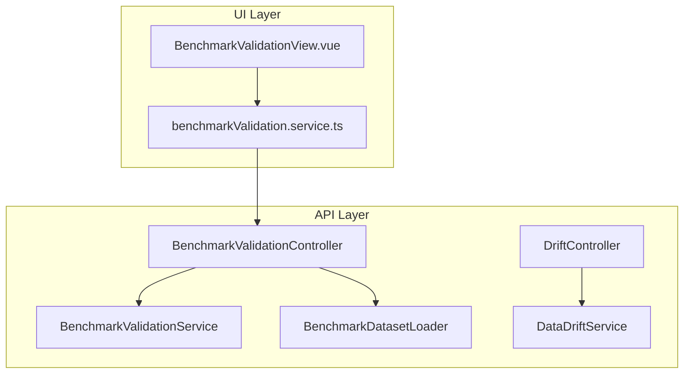
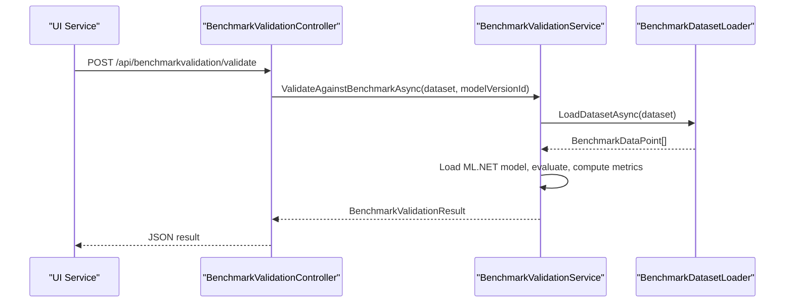
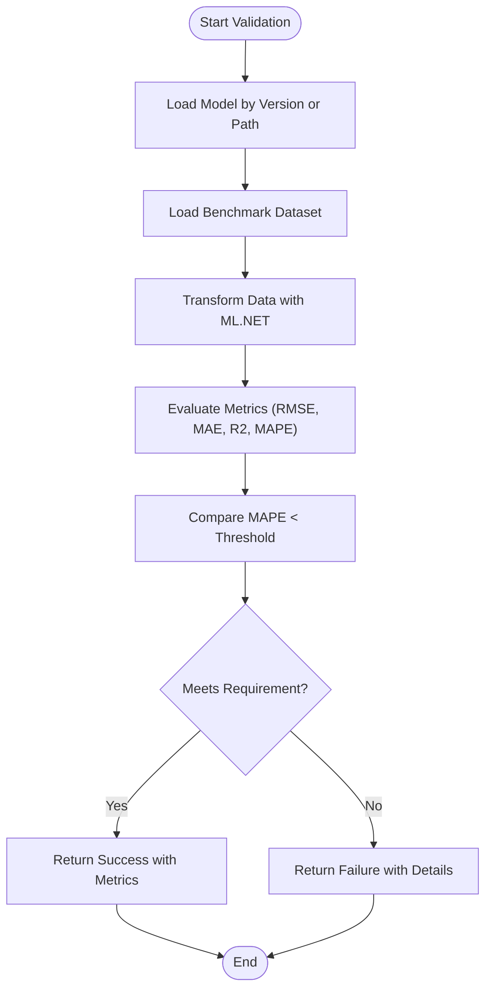
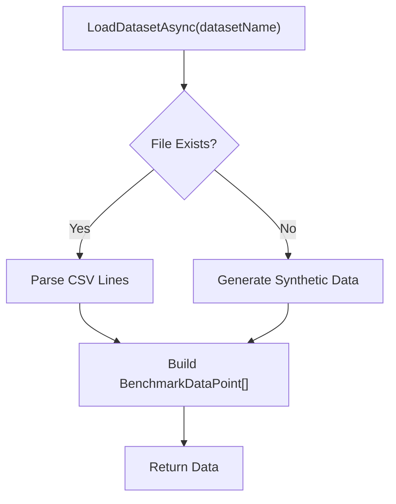
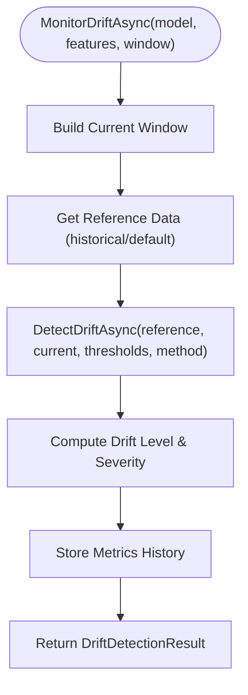
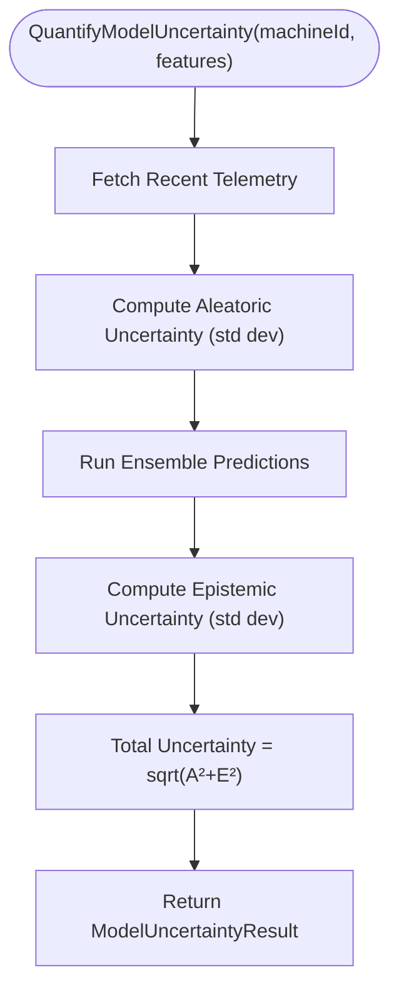
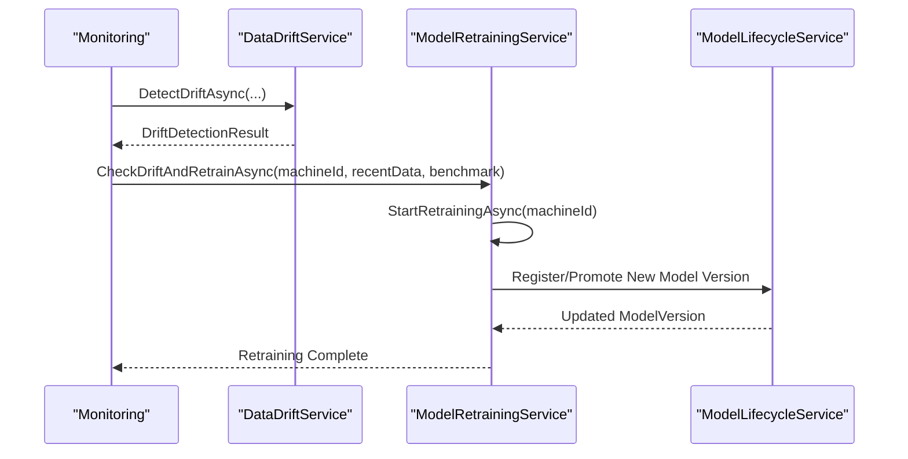
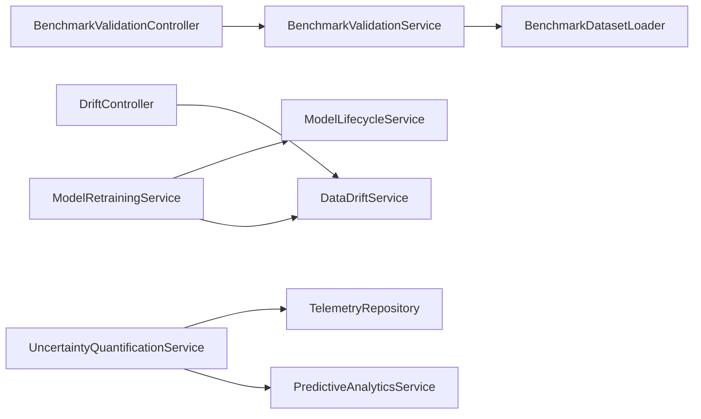

# Model Validation and Drift Detection

<cite>
**Referenced Files in This Document**
- [BenchmarkValidationService.cs](file://src/api/DigitalTwinPlatform.API/Services/Analytics/BenchmarkValidationService.cs)
- [BenchmarkDatasetLoader.cs](file://src/api/DigitalTwinPlatform.API/Services/Analytics/BenchmarkDatasetLoader.cs)
- [IBenchmarkValidationService.cs](file://src/api/DigitalTwinPlatform.API/Services/Analytics/IBenchmarkValidationService.cs)
- [IBenchmarkDatasetLoader.cs](file://src/api/DigitalTwinPlatform.API/Services/Analytics/IBenchmarkDatasetLoader.cs)
- [BenchmarkValidationController.cs](file://src/api/DigitalTwinPlatform.API/Controllers/BenchmarkValidationController.cs)
- [DataDriftService.cs](file://src/api/DigitalTwinPlatform.API/Services/Analytics/DataDriftService.cs)
- [IDataDriftService.cs](file://src/api/DigitalTwinPlatform.API/Services/Analytics/IDataDriftService.cs)
- [DriftController.cs](file://src/api/DigitalTwinPlatform.API/Controllers/DriftController.cs)
- [UncertaintyQuantificationService.cs](file://src/api/DigitalTwinPlatform.API/Services/Analytics/UncertaintyQuantificationService.cs)
- [ModelLifecycleService.cs](file://src/api/DigitalTwinPlatform.API/Services/Analytics/ModelLifecycleService.cs)
- [ModelRetrainingService.cs](file://src/api/DigitalTwinPlatform.API/Services/Analytics/ModelRetrainingService.cs)
- [benchmarkValidation.service.ts](file://src/ui/digital-twin-dashboard/src/services/benchmarkValidation.service.ts)
- [BenchmarkValidationView.vue](file://src/ui/digital-twin-dashboard/src/views/BenchmarkValidationView.vue)
</cite>

## Table of Contents
1. [Introduction](#introduction)
2. [Project Structure](#project-structure)
3. [Core Components](#core-components)
4. [Architecture Overview](#architecture-overview)
5. [Detailed Component Analysis](#detailed-component-analysis)
6. [Dependency Analysis](#dependency-analysis)
7. [Performance Considerations](#performance-considerations)
8. [Troubleshooting Guide](#troubleshooting-guide)
9. [Conclusion](#conclusion)
10. [Appendices](#appendices)

## Introduction
This document explains the model validation and drift detection mechanisms implemented in the platform. It covers:
- Benchmark validation using standardized datasets and ML.NET evaluation
- Real-time drift detection across features and predictions
- Dataset loading and benchmark metadata management
- Uncertainty quantification and confidence interval validation
- Automated retraining triggers and model lifecycle management
- Continuous validation, reporting, and production monitoring

## Project Structure
The validation and drift detection capabilities are implemented in the API layer under Services/Analytics, with controllers exposing endpoints and UI services consuming them.

**Diagram sources**
- [BenchmarkValidationController.cs](file://src/api/DigitalTwinPlatform.API/Controllers/BenchmarkValidationController.cs#L1-L114)
- [DriftController.cs](file://src/api/DigitalTwinPlatform.API/Controllers/DriftController.cs#L1-L251)
- [BenchmarkValidationService.cs](file://src/api/DigitalTwinPlatform.API/Services/Analytics/BenchmarkValidationService.cs#L1-L223)
- [BenchmarkDatasetLoader.cs](file://src/api/DigitalTwinPlatform.API/Services/Analytics/BenchmarkDatasetLoader.cs#L1-L212)
- [DataDriftService.cs](file://src/api/DigitalTwinPlatform.API/Services/Analytics/DataDriftService.cs#L1-L525)
- [benchmarkValidation.service.ts](file://src/ui/digital-twin-dashboard/src/services/benchmarkValidation.service.ts#L1-L239)
- [BenchmarkValidationView.vue](file://src/ui/digital-twin-dashboard/src/views/BenchmarkValidationView.vue#L1-L7)

**Section sources**
- [BenchmarkValidationController.cs](file://src/api/DigitalTwinPlatform.API/Controllers/BenchmarkValidationController.cs#L1-L114)
- [DriftController.cs](file://src/api/DigitalTwinPlatform.API/Controllers/DriftController.cs#L1-L251)
- [BenchmarkValidationService.cs](file://src/api/DigitalTwinPlatform.API/Services/Analytics/BenchmarkValidationService.cs#L1-L223)
- [BenchmarkDatasetLoader.cs](file://src/api/DigitalTwinPlatform.API/Services/Analytics/BenchmarkDatasetLoader.cs#L1-L212)
- [DataDriftService.cs](file://src/api/DigitalTwinPlatform.API/Services/Analytics/DataDriftService.cs#L1-L525)
- [benchmarkValidation.service.ts](file://src/ui/digital-twin-dashboard/src/services/benchmarkValidation.service.ts#L1-L239)
- [BenchmarkValidationView.vue](file://src/ui/digital-twin-dashboard/src/views/BenchmarkValidationView.vue#L1-L7)

## Core Components
- BenchmarkValidationService: Loads benchmark datasets, loads ML.NET models, evaluates predictions, computes metrics, and compares against thresholds.
- BenchmarkDatasetLoader: Loads CSV datasets, generates synthetic benchmarks, and exposes dataset metadata.
- DataDriftService: Implements multiple drift detection methods (KS, Wasserstein, PSI), sliding-window monitoring, thresholds, and alerting.
- UncertaintyQuantificationService: Performs Monte Carlo simulations, Bayesian inference, and bootstrap confidence intervals for model reliability.
- ModelLifecycleService: Registers, promotes, compares, and summarizes model versions.
- ModelRetrainingService: Orchestrates drift-aware retraining workflows.

**Section sources**
- [BenchmarkValidationService.cs](file://src/api/DigitalTwinPlatform.API/Services/Analytics/BenchmarkValidationService.cs#L10-L223)
- [BenchmarkDatasetLoader.cs](file://src/api/DigitalTwinPlatform.API/Services/Analytics/BenchmarkDatasetLoader.cs#L5-L212)
- [DataDriftService.cs](file://src/api/DigitalTwinPlatform.API/Services/Analytics/DataDriftService.cs#L17-L525)
- [UncertaintyQuantificationService.cs](file://src/api/DigitalTwinPlatform.API/Services/Analytics/UncertaintyQuantificationService.cs#L6-L384)
- [ModelLifecycleService.cs](file://src/api/DigitalTwinPlatform.API/Services/Analytics/ModelLifecycleService.cs#L9-L261)
- [ModelRetrainingService.cs](file://src/api/DigitalTwinPlatform.API/Services/Analytics/ModelRetrainingService.cs#L9-L62)

## Architecture Overview
The system integrates controllers, services, and UI to enable validation and drift monitoring:

**Diagram sources**
- [BenchmarkValidationController.cs](file://src/api/DigitalTwinPlatform.API/Controllers/BenchmarkValidationController.cs#L24-L65)
- [BenchmarkValidationService.cs](file://src/api/DigitalTwinPlatform.API/Services/Analytics/BenchmarkValidationService.cs#L26-L161)
- [BenchmarkDatasetLoader.cs](file://src/api/DigitalTwinPlatform.API/Services/Analytics/BenchmarkDatasetLoader.cs#L17-L89)

## Detailed Component Analysis

### Benchmark Validation Service
- Cross-validation strategy: Uses a single benchmark dataset split into features and labels; evaluates via ML.NET Regression.Evaluate and custom MAPE computation.
- Performance benchmarking: Computes RMSE, MAE, R2, and MAPE; marks pass/fail based on MAPE threshold.
- Model comparison: Provides per-sample comparisons and detailed metrics for diagnostics.
- Validation workflow:
  - Resolve model version or accept model path/type.
  - Load benchmark dataset via BenchmarkDatasetLoader.
  - Load ML.NET model and transform data.
  - Extract actual/predicted values and compute metrics.
  - Aggregate results and thresholds.

**Diagram sources**
- [BenchmarkValidationService.cs](file://src/api/DigitalTwinPlatform.API/Services/Analytics/BenchmarkValidationService.cs#L26-L161)

**Section sources**
- [BenchmarkValidationService.cs](file://src/api/DigitalTwinPlatform.API/Services/Analytics/BenchmarkValidationService.cs#L26-L161)
- [IBenchmarkValidationService.cs](file://src/api/DigitalTwinPlatform.API/Services/Analytics/IBenchmarkValidationService.cs#L3-L57)
- [BenchmarkValidationController.cs](file://src/api/DigitalTwinPlatform.API/Controllers/BenchmarkValidationController.cs#L24-L104)

### Benchmark Dataset Loader
- Loads CSV datasets from disk with automatic header detection.
- Generates synthetic benchmarks when files are missing, preserving realistic distributions.
- Exposes dataset availability and metadata (description, sample counts, statistics).

**Diagram sources**
- [BenchmarkDatasetLoader.cs](file://src/api/DigitalTwinPlatform.API/Services/Analytics/BenchmarkDatasetLoader.cs#L17-L148)

**Section sources**
- [BenchmarkDatasetLoader.cs](file://src/api/DigitalTwinPlatform.API/Services/Analytics/BenchmarkDatasetLoader.cs#L17-L148)
- [IBenchmarkDatasetLoader.cs](file://src/api/DigitalTwinPlatform.API/Services/Analytics/IBenchmarkDatasetLoader.cs#L3-L23)

### Data Drift Service
- Drift detection methods: Kolmogorov-Smirnov (KS), Wasserstein distance, Population Stability Index (PSI), plus placeholders for Chi-square and Jensen-Shannon.
- Sliding window monitoring: Maintains reference data windows and calculates drift scores per feature and overall.
- Thresholds and levels: Configurable thresholds per model and feature-specific overrides; maps scores to drift levels and severities.
- Recommendations and alerts: Generates actionable recommendations and supports alert cooldowns.

**Diagram sources**
- [DataDriftService.cs](file://src/api/DigitalTwinPlatform.API/Services/Analytics/DataDriftService.cs#L139-L218)

**Section sources**
- [DataDriftService.cs](file://src/api/DigitalTwinPlatform.API/Services/Analytics/DataDriftService.cs#L17-L525)
- [IDataDriftService.cs](file://src/api/DigitalTwinPlatform.API/Services/Analytics/IDataDriftService.cs#L97-L233)
- [DriftController.cs](file://src/api/DigitalTwinPlatform.API/Controllers/DriftController.cs#L17-L227)

### Uncertainty Quantification Service
- Monte Carlo simulation: Injects Gaussian noise into features and aggregates prediction samples to estimate mean, std dev, and 95% confidence intervals.
- Bayesian inference: Samples priors, computes likelihood, and produces posterior distributions for predictions.
- Bootstrap confidence intervals: Resamples historical predictions/errors to compute coverage and confidence bounds.
- Model uncertainty: Separates aleatoric (data noise) and epistemic (model) uncertainty; provides feature importance with uncertainty.

**Diagram sources**
- [UncertaintyQuantificationService.cs](file://src/api/DigitalTwinPlatform.API/Services/Analytics/UncertaintyQuantificationService.cs#L221-L301)

**Section sources**
- [UncertaintyQuantificationService.cs](file://src/api/DigitalTwinPlatform.API/Services/Analytics/UncertaintyQuantificationService.cs#L15-L384)

### Model Lifecycle and Retraining
- Model registration and promotion: Creates versions, promotes to production, and deprecates previous production models.
- Model comparison: Compares metrics across versions and determines winners based on higher-is-better or lower-is-better semantics.
- Retraining triggers: Drift detection can initiate retraining workflows to refresh models.

**Diagram sources**
- [DataDriftService.cs](file://src/api/DigitalTwinPlatform.API/Services/Analytics/DataDriftService.cs#L39-L137)
- [ModelRetrainingService.cs](file://src/api/DigitalTwinPlatform.API/Services/Analytics/ModelRetrainingService.cs#L31-L62)
- [ModelLifecycleService.cs](file://src/api/DigitalTwinPlatform.API/Services/Analytics/ModelLifecycleService.cs#L69-L118)

**Section sources**
- [ModelLifecycleService.cs](file://src/api/DigitalTwinPlatform.API/Services/Analytics/ModelLifecycleService.cs#L28-L216)
- [ModelRetrainingService.cs](file://src/api/DigitalTwinPlatform.API/Services/Analytics/ModelRetrainingService.cs#L31-L62)

## Dependency Analysis
- Controllers depend on services for orchestration.
- BenchmarkValidationService depends on BenchmarkDatasetLoader and ML.NET runtime.
- DataDriftService encapsulates drift computation and persistence of metrics history.
- UncertaintyQuantificationService depends on predictive analytics and telemetry repositories.
- ModelLifecycleService coordinates model state transitions and comparisons.
- UI service communicates with controllers to drive validation and drift workflows.

**Diagram sources**
- [BenchmarkValidationController.cs](file://src/api/DigitalTwinPlatform.API/Controllers/BenchmarkValidationController.cs#L10-L19)
- [DriftController.cs](file://src/api/DigitalTwinPlatform.API/Controllers/DriftController.cs#L10-L11)
- [BenchmarkValidationService.cs](file://src/api/DigitalTwinPlatform.API/Services/Analytics/BenchmarkValidationService.cs#L12-L24)
- [DataDriftService.cs](file://src/api/DigitalTwinPlatform.API/Services/Analytics/DataDriftService.cs#L19-L37)
- [UncertaintyQuantificationService.cs](file://src/api/DigitalTwinPlatform.API/Services/Analytics/UncertaintyQuantificationService.cs#L6-L11)
- [ModelRetrainingService.cs](file://src/api/DigitalTwinPlatform.API/Services/Analytics/ModelRetrainingService.cs#L15-L29)
- [ModelLifecycleService.cs](file://src/api/DigitalTwinPlatform.API/Services/Analytics/ModelLifecycleService.cs#L16-L26)

**Section sources**
- [BenchmarkValidationController.cs](file://src/api/DigitalTwinPlatform.API/Controllers/BenchmarkValidationController.cs#L10-L19)
- [DriftController.cs](file://src/api/DigitalTwinPlatform.API/Controllers/DriftController.cs#L10-L11)
- [BenchmarkValidationService.cs](file://src/api/DigitalTwinPlatform.API/Services/Analytics/BenchmarkValidationService.cs#L12-L24)
- [DataDriftService.cs](file://src/api/DigitalTwinPlatform.API/Services/Analytics/DataDriftService.cs#L19-L37)
- [UncertaintyQuantificationService.cs](file://src/api/DigitalTwinPlatform.API/Services/Analytics/UncertaintyQuantificationService.cs#L6-L11)
- [ModelRetrainingService.cs](file://src/api/DigitalTwinPlatform.API/Services/Analytics/ModelRetrainingService.cs#L15-L29)
- [ModelLifecycleService.cs](file://src/api/DigitalTwinPlatform.API/Services/Analytics/ModelLifecycleService.cs#L16-L26)

## Performance Considerations
- Benchmark validation:
  - ML.NET evaluation is CPU-bound; batch requests and cache model schemas where feasible.
  - Prefer streaming data transformations for large datasets.
- Drift detection:
  - Sliding window sizes impact latency; tune window size for responsiveness vs. stability.
  - KS and Wasserstein are efficient; PSI requires histogram binning—adjust bucket counts for speed.
- Uncertainty quantification:
  - Monte Carlo and bootstrap scales linearly with iterations; cap iterations for interactive dashboards.
  - Use approximate quantiles for large sample sets to reduce sorting overhead.
- Model lifecycle:
  - Batch updates for model promotions/deprecations to minimize database round-trips.

## Troubleshooting Guide
- Benchmark validation failures:
  - Invalid model version ID or missing model file cause early termination with error messages.
  - Dataset load failures fall back to synthetic generation; verify dataset paths and CSV formatting.
- Drift detection anomalies:
  - Empty or mismatched feature arrays lead to immediate failure; ensure consistent feature naming and non-empty arrays.
  - Default reference data is synthesized when historical data is unavailable; confirm drift thresholds are appropriate.
- Uncertainty quantification warnings:
  - Prediction failures during Monte Carlo are handled with fallbacks; investigate telemetry and feature variance configurations.
- UI integration:
  - Ensure API endpoints are reachable and CORS is configured; verify service URLs and error handling in UI service.

**Section sources**
- [BenchmarkValidationService.cs](file://src/api/DigitalTwinPlatform.API/Services/Analytics/BenchmarkValidationService.cs#L31-L46)
- [BenchmarkDatasetLoader.cs](file://src/api/DigitalTwinPlatform.API/Services/Analytics/BenchmarkDatasetLoader.cs#L25-L33)
- [DataDriftService.cs](file://src/api/DigitalTwinPlatform.API/Services/Analytics/DataDriftService.cs#L75-L80)
- [UncertaintyQuantificationService.cs](file://src/api/DigitalTwinPlatform.API/Services/Analytics/UncertaintyQuantificationService.cs#L53-L58)
- [benchmarkValidation.service.ts](file://src/ui/digital-twin-dashboard/src/services/benchmarkValidation.service.ts#L96-L104)

## Conclusion
The platform provides a robust framework for validating models against standardized benchmarks, continuously monitoring drift across features and predictions, quantifying uncertainty, and orchestrating automated retraining and lifecycle management. The modular design enables extensibility for additional datasets, drift methods, and uncertainty techniques.

## Appendices

### Validation Metrics Interpretation
- MAPE < threshold indicates acceptable accuracy; use for pass/fail decisions.
- RMSE and MAE quantify average error magnitude; lower is better.
- R2 indicates goodness-of-fit; closer to 1 is better.
- Detailed metrics include min/max/median absolute errors for outlier diagnostics.

**Section sources**
- [IBenchmarkValidationService.cs](file://src/api/DigitalTwinPlatform.API/Services/Analytics/IBenchmarkValidationService.cs#L23-L46)

### Statistical Significance Testing and Regression Detection
- Drift detection uses non-parametric tests (KS, Wasserstein, PSI) to assess distribution shifts.
- Threshold tuning:
  - Feature drift threshold controls per-feature sensitivity.
  - Prediction drift threshold governs prediction shift sensitivity.
  - Label drift threshold applies to target variable shifts.
- Regression detection:
  - Decline in R2 or increase in RMSE/MAPE over time signals performance regression.
  - Drift severity escalation (Low → Medium → High → Critical) drives remediation actions.

**Section sources**
- [IDataDriftService.cs](file://src/api/DigitalTwinPlatform.API/Services/Analytics/IDataDriftService.cs#L22-L92)
- [DataDriftService.cs](file://src/api/DigitalTwinPlatform.API/Services/Analytics/DataDriftService.cs#L475-L522)

### Automated Retraining Triggers and Model Retirement Criteria
- Retraining triggers:
  - Significant drift detected (severity ≥ Medium) combined with performance regression.
  - Scheduled periodic retraining aligned with data freshness windows.
- Retirement criteria:
  - Deprecate older production models after successful promotion of newer versions.
  - Retire models with sustained poor performance or inability to meet SLAs.

**Section sources**
- [ModelRetrainingService.cs](file://src/api/DigitalTwinPlatform.API/Services/Analytics/ModelRetrainingService.cs#L31-L47)
- [ModelLifecycleService.cs](file://src/api/DigitalTwinPlatform.API/Services/Analytics/ModelLifecycleService.cs#L81-L97)

### Continuous Validation and A/B Testing
- Continuous validation:
  - Sliding window drift monitoring with configurable intervals and alert cooldowns.
  - Historical drift reports summarize trends and alert frequencies.
- A/B testing:
  - Compare model versions using ModelLifecycleService’s comparison utilities.
  - Track differences in metrics and select the superior model for promotion.

**Section sources**
- [DriftController.cs](file://src/api/DigitalTwinPlatform.API/Controllers/DriftController.cs#L212-L227)
- [ModelLifecycleService.cs](file://src/api/DigitalTwinPlatform.API/Services/Analytics/ModelLifecycleService.cs#L139-L216)

### UI Integration Examples
- Frontend consumes validation endpoints via a typed service, enabling dataset selection, model validation, and result visualization.
- Dashboard views coordinate with backend controllers to present validation outcomes and drift status.

**Section sources**
- [benchmarkValidation.service.ts](file://src/ui/digital-twin-dashboard/src/services/benchmarkValidation.service.ts#L66-L104)
- [BenchmarkValidationView.vue](file://src/ui/digital-twin-dashboard/src/views/BenchmarkValidationView.vue#L1-L7)