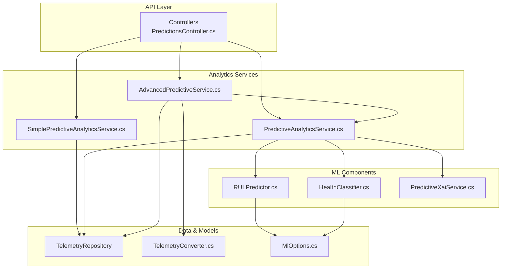
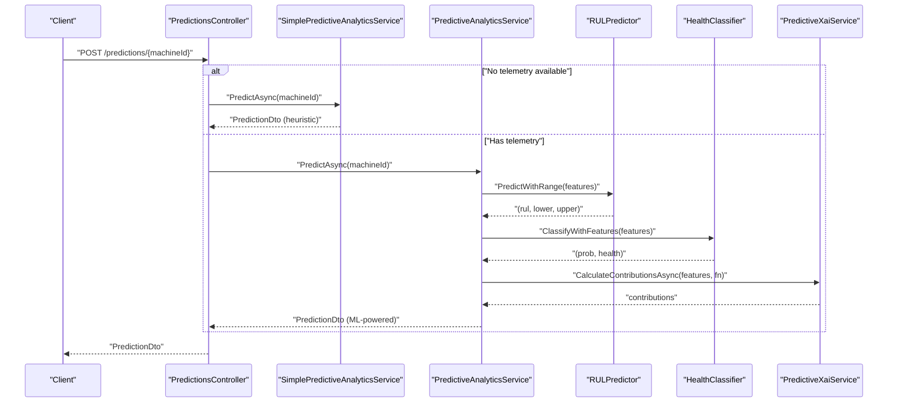
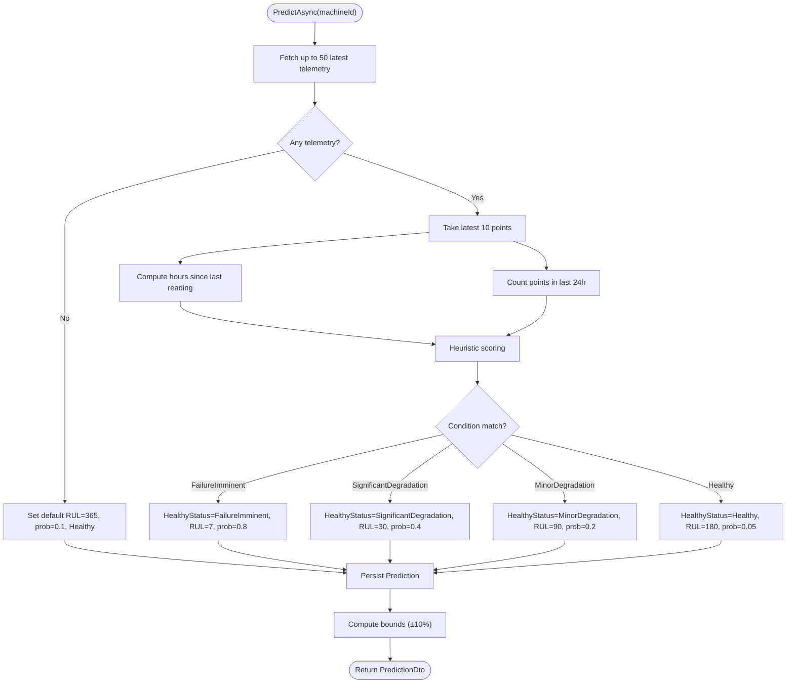
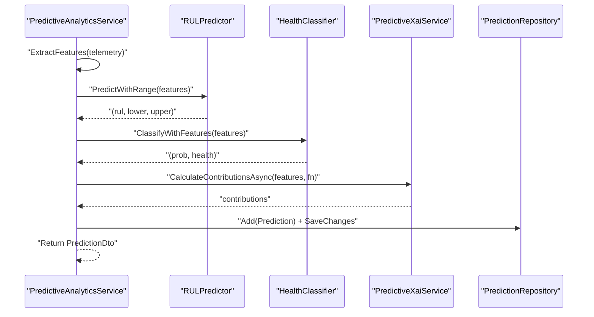
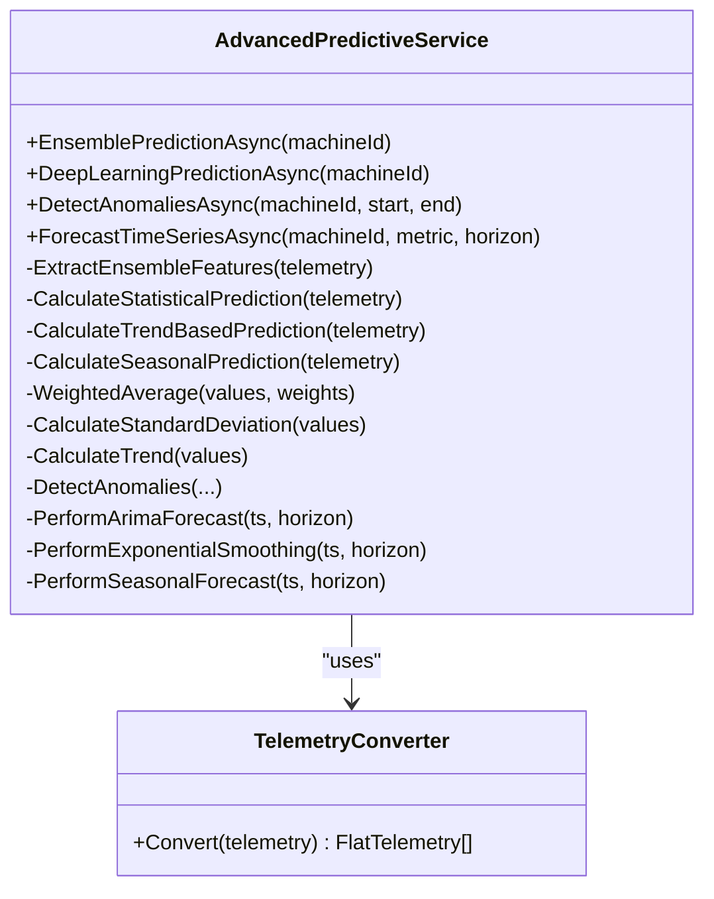
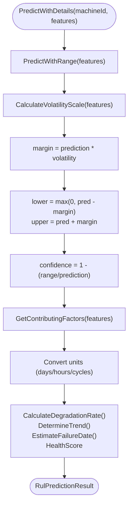
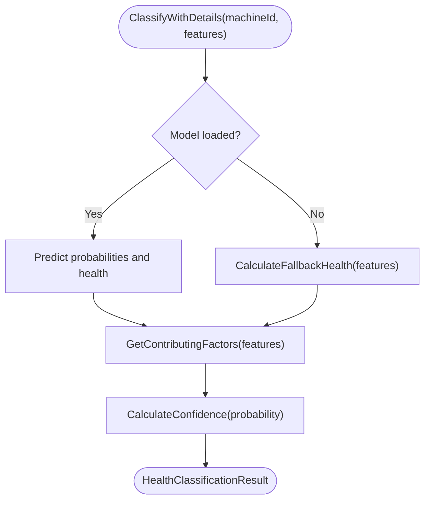
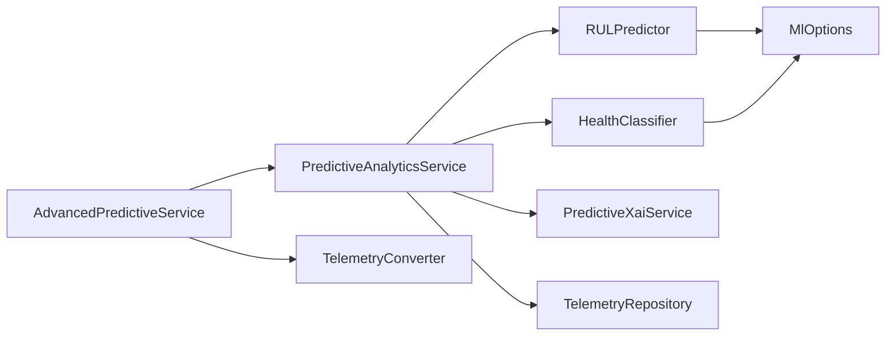

# Prediction Algorithms and RUL Estimation

<cite>
**Referenced Files in This Document**
- [SimplePredictiveAnalyticsService.cs](file://src/api/DigitalTwinPlatform.API/Services/Analytics/SimplePredictiveAnalyticsService.cs)
- [PredictiveAnalyticsService.cs](file://src/api/DigitalTwinPlatform.API/Services/Analytics/PredictiveAnalyticsService.cs)
- [AdvancedPredictiveService.cs](file://src/api/DigitalTwinPlatform.API/Services/Analytics/Advanced/AdvancedPredictiveService.cs)
- [RULPredictor.cs](file://src/api/DigitalTwinPlatform.API/Services/Analytics/ML/RULPredictor.cs)
- [HealthClassifier.cs](file://src/api/DigitalTwinPlatform.API/Services/Analytics/ML/HealthClassifier.cs)
- [IPredictiveAnalyticsService.cs](file://src/api/DigitalTwinPlatform.API/Services/Analytics/IPredictiveAnalyticsService.cs)
- [TelemetryConverter.cs](file://src/api/DigitalTwinPlatform.API/Services/Analytics/Advanced/TelemetryConverter.cs)
- [MlOptions.cs](file://src/api/DigitalTwinPlatform.API/Services/Analytics/ML/MlOptions.cs)
</cite>

## Table of Contents
1. [Introduction](#introduction)
2. [Project Structure](#project-structure)
3. [Core Components](#core-components)
4. [Architecture Overview](#architecture-overview)
5. [Detailed Component Analysis](#detailed-component-analysis)
6. [Dependency Analysis](#dependency-analysis)
7. [Performance Considerations](#performance-considerations)
8. [Troubleshooting Guide](#troubleshooting-guide)
9. [Conclusion](#conclusion)

## Introduction
This document explains the prediction algorithms and Remaining Useful Life (RUL) estimation system implemented in the platform. It covers:
- SimplePredictiveAnalyticsService for heuristic-based predictions
- PredictiveAnalyticsService for ML-powered inference with RULPredictor and HealthClassifier
- AdvancedPredictiveService for ensemble modeling, anomaly detection, and time series forecasting
- RULPredictor for RUL calculation, confidence intervals, and feature contribution analysis
- HealthClassifier for equipment health status classification and anomaly detection algorithms
- Integration with real-time telemetry and historical trends
- Mathematical foundations, parameter tuning, model selection, and performance optimization

## Project Structure
The predictive analytics stack is organized around three service layers:
- Basic service: SimplePredictiveAnalyticsService (heuristic)
- Standard service: PredictiveAnalyticsService (ML.NET powered)
- Advanced service: AdvancedPredictiveService (ensemble, forecasting, anomaly detection)

**Diagram sources**
- [SimplePredictiveAnalyticsService.cs](file://src/api/DigitalTwinPlatform.API/Services/Analytics/SimplePredictiveAnalyticsService.cs#L14-L129)
- [PredictiveAnalyticsService.cs](file://src/api/DigitalTwinPlatform.API/Services/Analytics/PredictiveAnalyticsService.cs#L15-L262)
- [AdvancedPredictiveService.cs](file://src/api/DigitalTwinPlatform.API/Services/Analytics/Advanced/AdvancedPredictiveService.cs#L41-L840)
- [RULPredictor.cs](file://src/api/DigitalTwinPlatform.API/Services/Analytics/ML/RULPredictor.cs#L14-L622)
- [HealthClassifier.cs](file://src/api/DigitalTwinPlatform.API/Services/Analytics/ML/HealthClassifier.cs#L16-L447)
- [TelemetryConverter.cs](file://src/api/DigitalTwinPlatform.API/Services/Analytics/Advanced/TelemetryConverter.cs)
- [MlOptions.cs](file://src/api/DigitalTwinPlatform.API/Services/Analytics/ML/MlOptions.cs)

**Section sources**
- [SimplePredictiveAnalyticsService.cs](file://src/api/DigitalTwinPlatform.API/Services/Analytics/SimplePredictiveAnalyticsService.cs#L14-L129)
- [PredictiveAnalyticsService.cs](file://src/api/DigitalTwinPlatform.API/Services/Analytics/PredictiveAnalyticsService.cs#L15-L262)
- [AdvancedPredictiveService.cs](file://src/api/DigitalTwinPlatform.API/Services/Analytics/Advanced/AdvancedPredictiveService.cs#L41-L840)
- [RULPredictor.cs](file://src/api/DigitalTwinPlatform.API/Services/Analytics/ML/RULPredictor.cs#L14-L622)
- [HealthClassifier.cs](file://src/api/DigitalTwinPlatform.API/Services/Analytics/ML/HealthClassifier.cs#L16-L447)
- [TelemetryConverter.cs](file://src/api/DigitalTwinPlatform.API/Services/Analytics/Advanced/TelemetryConverter.cs)
- [MlOptions.cs](file://src/api/DigitalTwinPlatform.API/Services/Analytics/ML/MlOptions.cs)

## Core Components
- SimplePredictiveAnalyticsService: Heuristic-based prediction using recent telemetry recency and count within a rolling window.
- PredictiveAnalyticsService: ML-powered inference pipeline integrating RULPredictor and HealthClassifier, with XAI contributions and alerting.
- AdvancedPredictiveService: Ensemble modeling, anomaly detection, and time series forecasting using statistical and hybrid methods.
- RULPredictor: ML.NET-based RUL prediction with confidence intervals, feature contribution analysis, and fallback heuristics.
- HealthClassifier: ML.NET-based health classification with risk score, confidence, and contributing factors.

**Section sources**
- [SimplePredictiveAnalyticsService.cs](file://src/api/DigitalTwinPlatform.API/Services/Analytics/SimplePredictiveAnalyticsService.cs#L30-L107)
- [PredictiveAnalyticsService.cs](file://src/api/DigitalTwinPlatform.API/Services/Analytics/PredictiveAnalyticsService.cs#L49-L134)
- [AdvancedPredictiveService.cs](file://src/api/DigitalTwinPlatform.API/Services/Analytics/Advanced/AdvancedPredictiveService.cs#L49-L140)
- [RULPredictor.cs](file://src/api/DigitalTwinPlatform.API/Services/Analytics/ML/RULPredictor.cs#L56-L155)
- [HealthClassifier.cs](file://src/api/DigitalTwinPlatform.API/Services/Analytics/ML/HealthClassifier.cs#L56-L131)

## Architecture Overview
The system integrates telemetry ingestion, feature extraction, and multiple prediction engines. PredictiveAnalyticsService orchestrates ML.NET inference, while AdvancedPredictiveService adds ensemble and statistical methods.

**Diagram sources**
- [PredictiveAnalyticsService.cs](file://src/api/DigitalTwinPlatform.API/Services/Analytics/PredictiveAnalyticsService.cs#L49-L134)
- [RULPredictor.cs](file://src/api/DigitalTwinPlatform.API/Services/Analytics/ML/RULPredictor.cs#L118-L155)
- [HealthClassifier.cs](file://src/api/DigitalTwinPlatform.API/Services/Analytics/ML/HealthClassifier.cs#L113-L131)
- [SimplePredictiveAnalyticsService.cs](file://src/api/DigitalTwinPlatform.API/Services/Analytics/SimplePredictiveAnalyticsService.cs#L30-L107)

## Detailed Component Analysis

### SimplePredictiveAnalyticsService
- Purpose: Provide fast, heuristic-based predictions when ML models are unavailable or telemetry is sparse.
- Inputs: Recent telemetry samples (default window of 50).
- Logic:
  - If no telemetry, defaults to long RUL and low failure probability.
  - Otherwise, computes recent recency and 24-hour data density to classify health and estimate RUL.
- Outputs: Prediction entity persisted with bounds and feature contributions placeholder.

**Diagram sources**
- [SimplePredictiveAnalyticsService.cs](file://src/api/DigitalTwinPlatform.API/Services/Analytics/SimplePredictiveAnalyticsService.cs#L30-L107)

**Section sources**
- [SimplePredictiveAnalyticsService.cs](file://src/api/DigitalTwinPlatform.API/Services/Analytics/SimplePredictiveAnalyticsService.cs#L30-L107)

### PredictiveAnalyticsService (ML Pipeline)
- Purpose: Orchestrates ML-powered predictions using RULPredictor and HealthClassifier.
- Features:
  - Extracts robust features from JSON telemetry payloads.
  - Calls RULPredictor for point and interval estimates.
  - Calls HealthClassifier for health status and probability.
  - Computes feature contributions via XAI service.
  - Persists prediction, updates digital twin, triggers alerts.

**Diagram sources**
- [PredictiveAnalyticsService.cs](file://src/api/DigitalTwinPlatform.API/Services/Analytics/PredictiveAnalyticsService.cs#L49-L134)
- [RULPredictor.cs](file://src/api/DigitalTwinPlatform.API/Services/Analytics/ML/RULPredictor.cs#L118-L155)
- [HealthClassifier.cs](file://src/api/DigitalTwinPlatform.API/Services/Analytics/ML/HealthClassifier.cs#L113-L131)

**Section sources**
- [PredictiveAnalyticsService.cs](file://src/api/DigitalTwinPlatform.API/Services/Analytics/PredictiveAnalyticsService.cs#L49-L134)

### AdvancedPredictiveService (Ensemble, Forecasting, Anomaly Detection)
- Ensemble Prediction:
  - Collects recent telemetry, converts to flat features, and extracts ensemble features.
  - Aggregates predictions from:
    - Basic heuristic (weight 0.3)
    - Statistical moving average (weight 0.25)
    - Trend-based model (weight 0.25)
    - Seasonal model (weight 0.2)
  - Computes weighted average RUL, uncertainty via standard deviation, and health classification.
- Deep Learning Prediction:
  - Uses sliding windows and trend analysis to estimate RUL without heavy ML.NET forecasting.
  - Returns confidence bounds and feature contributions.
- Anomaly Detection:
  - Statistical anomalies (2.5σ thresholds)
  - Multivariate correlation breakdown
  - Pattern change detection (windowed means)
- Time Series Forecasting:
  - ARIMA-style, exponential smoothing, and seasonal decomposition
  - Ensemble forecast weighted by inverse MAPE

**Diagram sources**
- [AdvancedPredictiveService.cs](file://src/api/DigitalTwinPlatform.API/Services/Analytics/Advanced/AdvancedPredictiveService.cs#L41-L840)
- [TelemetryConverter.cs](file://src/api/DigitalTwinPlatform.API/Services/Analytics/Advanced/TelemetryConverter.cs)

**Section sources**
- [AdvancedPredictiveService.cs](file://src/api/DigitalTwinPlatform.API/Services/Analytics/Advanced/AdvancedPredictiveService.cs#L49-L388)

### RULPredictor (Remaining Useful Life)
- Purpose: Predict RUL with confidence intervals and feature contributions.
- Inputs: Features dictionary with counts, means, RMS, trends, and time spans.
- Confidence Estimation:
  - Volatility scale based on feature variability and data density.
  - Range margin applied to prediction; bounds clipped to non-negative.
  - Confidence derived from relative range.
- Feature Contributions:
  - Temperature, vibration, pressure, and time impacts computed and normalized.
- Fallback:
  - If no model loaded, computes RUL from heuristics with similar bounds and metadata.

**Diagram sources**
- [RULPredictor.cs](file://src/api/DigitalTwinPlatform.API/Services/Analytics/ML/RULPredictor.cs#L56-L155)
- [RULPredictor.cs](file://src/api/DigitalTwinPlatform.API/Services/Analytics/ML/RULPredictor.cs#L267-L388)

**Section sources**
- [RULPredictor.cs](file://src/api/DigitalTwinPlatform.API/Services/Analytics/ML/RULPredictor.cs#L56-L155)
- [RULPredictor.cs](file://src/api/DigitalTwinPlatform.API/Services/Analytics/ML/RULPredictor.cs#L267-L388)

### HealthClassifier (Equipment Health Status)
- Purpose: Classify health status and compute risk probability with contributing factors.
- Inputs: Same feature set as RULPredictor.
- Risk Calculation:
  - Sum of impacts from temperature, vibration RMS, trends, and variability.
  - Normalized risk mapped to health categories.
- Confidence:
  - Derived from proximity to neutral probability (0.5).
- Recommendations:
  - Actionable guidance based on health category.

**Diagram sources**
- [HealthClassifier.cs](file://src/api/DigitalTwinPlatform.API/Services/Analytics/ML/HealthClassifier.cs#L56-L131)
- [HealthClassifier.cs](file://src/api/DigitalTwinPlatform.API/Services/Analytics/ML/HealthClassifier.cs#L302-L360)

**Section sources**
- [HealthClassifier.cs](file://src/api/DigitalTwinPlatform.API/Services/Analytics/ML/HealthClassifier.cs#L56-L131)
- [HealthClassifier.cs](file://src/api/DigitalTwinPlatform.API/Services/Analytics/ML/HealthClassifier.cs#L302-L360)

## Dependency Analysis
- PredictiveAnalyticsService depends on:
  - RULPredictor and HealthClassifier for inference
  - PredictiveXaiService for feature contributions
  - TelemetryRepository for data access
- AdvancedPredictiveService depends on:
  - TelemetryConverter for structured telemetry
  - PredictiveAnalyticsService for basic heuristic baseline
- Both ML components depend on MlOptions for model paths and thresholds.

**Diagram sources**
- [PredictiveAnalyticsService.cs](file://src/api/DigitalTwinPlatform.API/Services/Analytics/PredictiveAnalyticsService.cs#L17-L47)
- [AdvancedPredictiveService.cs](file://src/api/DigitalTwinPlatform.API/Services/Analytics/Advanced/AdvancedPredictiveService.cs#L42-L46)
- [RULPredictor.cs](file://src/api/DigitalTwinPlatform.API/Services/Analytics/ML/RULPredictor.cs#L30-L35)
- [HealthClassifier.cs](file://src/api/DigitalTwinPlatform.API/Services/Analytics/ML/HealthClassifier.cs#L30-L34)
- [MlOptions.cs](file://src/api/DigitalTwinPlatform.API/Services/Analytics/ML/MlOptions.cs)

**Section sources**
- [PredictiveAnalyticsService.cs](file://src/api/DigitalTwinPlatform.API/Services/Analytics/PredictiveAnalyticsService.cs#L17-L47)
- [AdvancedPredictiveService.cs](file://src/api/DigitalTwinPlatform.API/Services/Analytics/Advanced/AdvancedPredictiveService.cs#L42-L46)
- [RULPredictor.cs](file://src/api/DigitalTwinPlatform.API/Services/Analytics/ML/RULPredictor.cs#L30-L35)
- [HealthClassifier.cs](file://src/api/DigitalTwinPlatform.API/Services/Analytics/ML/HealthClassifier.cs#L30-L34)
- [MlOptions.cs](file://src/api/DigitalTwinPlatform.API/Services/Analytics/ML/MlOptions.cs)

## Performance Considerations
- Computational efficiency:
  - SimplePredictiveAnalyticsService avoids ML overhead; suitable for cold-start or fallback scenarios.
  - PredictiveAnalyticsService performs lightweight feature extraction and uses ML.NET prediction engines.
  - AdvancedPredictiveService applies statistical methods and ensemble weighting; keep window sizes and horizons bounded.
- Scalability:
  - Use asynchronous repositories and unit of work to minimize contention.
  - Cache frequently accessed thresholds and model paths via MlOptions.
  - Batch telemetry retrieval and limit window sizes to cap memory usage.
- Model selection:
  - Prefer embedded models when external model files are unavailable.
  - Use ensemble predictions to reduce variance and improve robustness.
- Real-time integration:
  - Stream telemetry updates and trigger predictions on new data batches.
  - Maintain rolling windows for trend and volatility computations.

[No sources needed since this section provides general guidance]

## Troubleshooting Guide
- No telemetry available:
  - SimplePredictiveAnalyticsService returns default predictions; verify data ingestion and repository queries.
- ML model loading failures:
  - RULPredictor and HealthClassifier log warnings and fall back to heuristic computations; check model paths and embedded resources.
- Insufficient data for forecasting:
  - AdvancedPredictiveService throws when historical points are below thresholds; increase data collection or adjust window sizes.
- Anomaly detection noise:
  - Adjust sigma thresholds and pattern change thresholds to balance sensitivity and false positives.

**Section sources**
- [SimplePredictiveAnalyticsService.cs](file://src/api/DigitalTwinPlatform.API/Services/Analytics/SimplePredictiveAnalyticsService.cs#L39-L45)
- [RULPredictor.cs](file://src/api/DigitalTwinPlatform.API/Services/Analytics/ML/RULPredictor.cs#L224-L248)
- [HealthClassifier.cs](file://src/api/DigitalTwinPlatform.API/Services/Analytics/ML/HealthClassifier.cs#L244-L267)
- [AdvancedPredictiveService.cs](file://src/api/DigitalTwinPlatform.API/Services/Analytics/Advanced/AdvancedPredictiveService.cs#L150-L153)

## Conclusion
The platform provides a layered predictive analytics stack:
- A fast heuristic baseline for immediate insights
- An ML-powered pipeline for accurate RUL and health predictions with uncertainty quantification
- An advanced suite of ensemble modeling, anomaly detection, and forecasting for robust decision-making
Together, these components enable scalable, real-time maintenance intelligence integrated with digital twins and alerting.