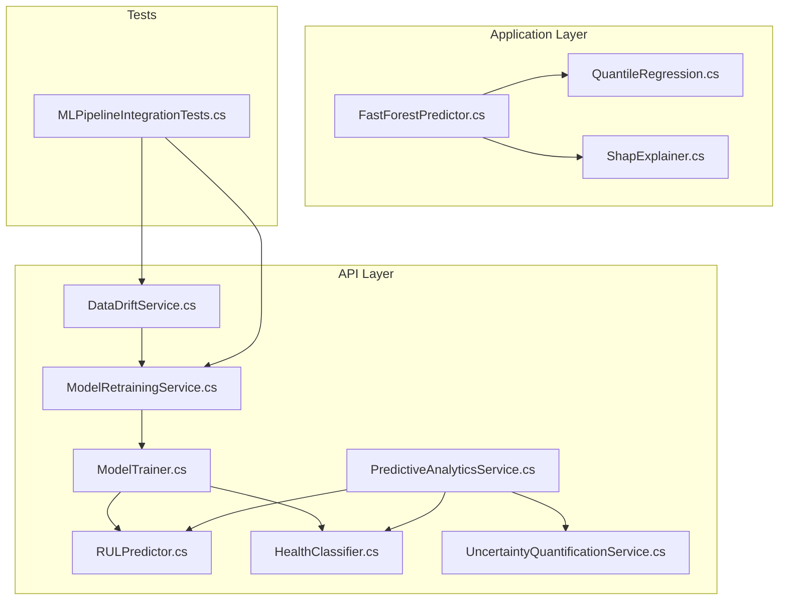
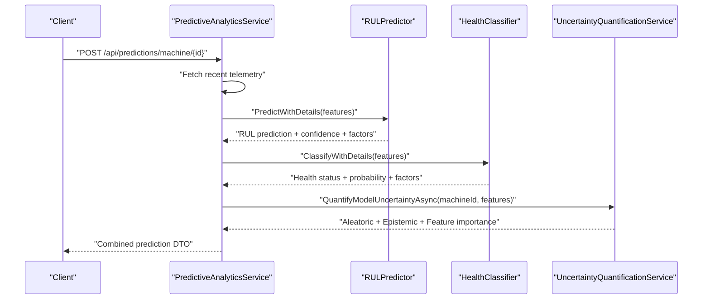
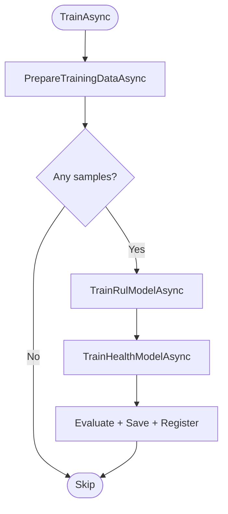
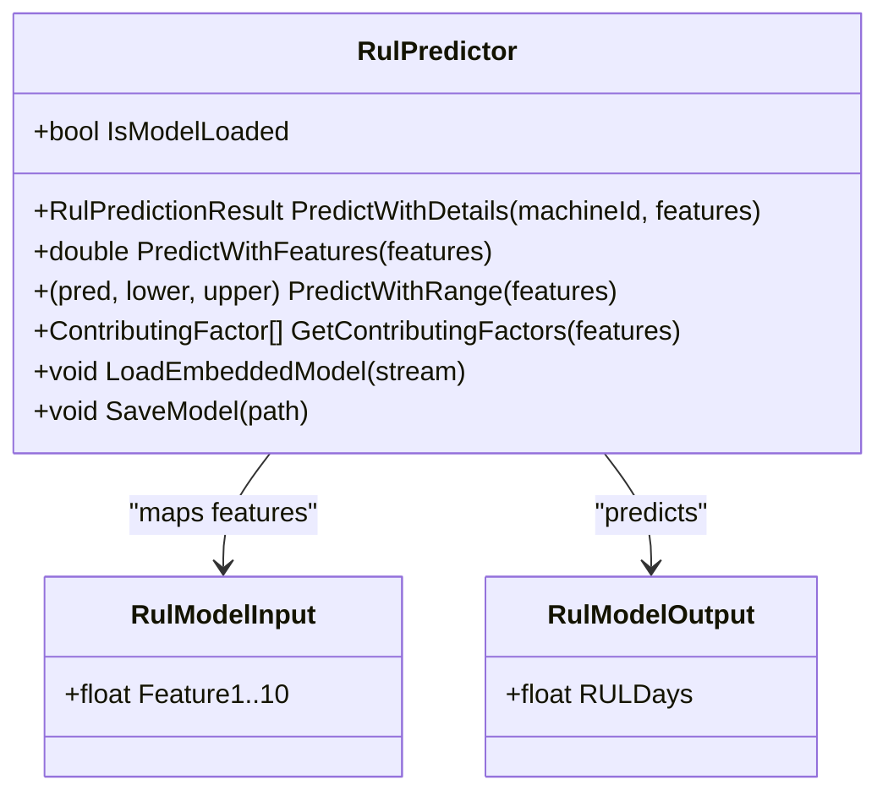
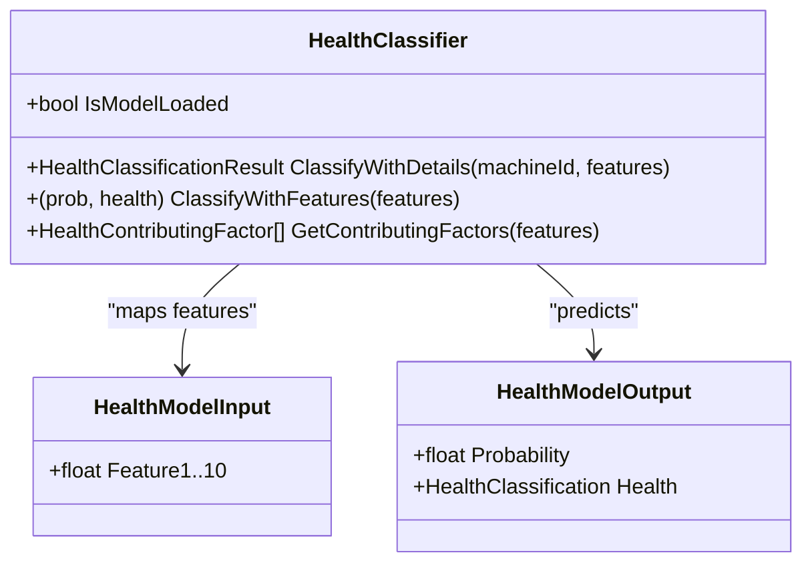
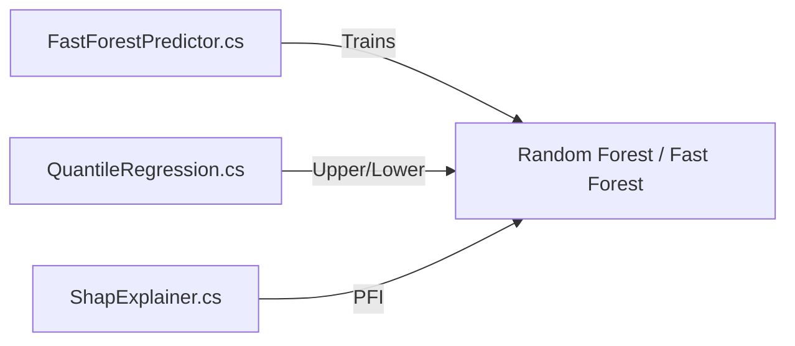
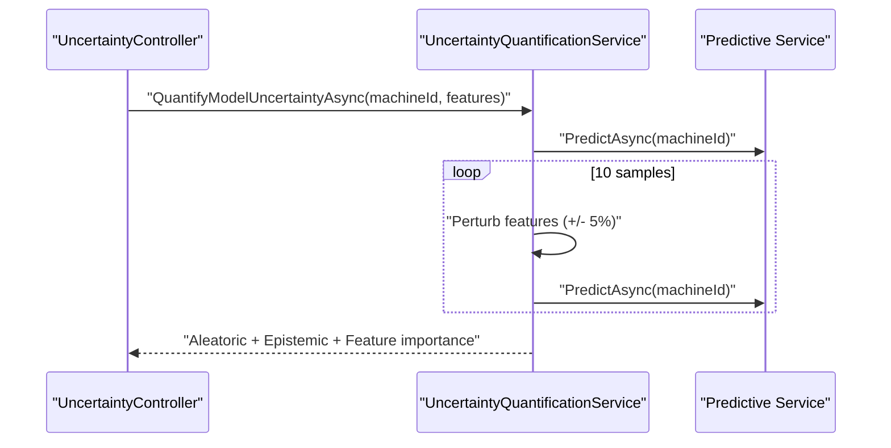
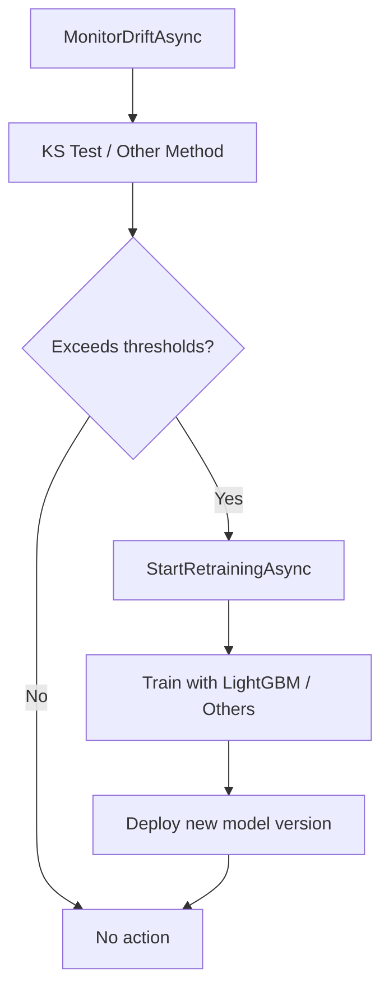
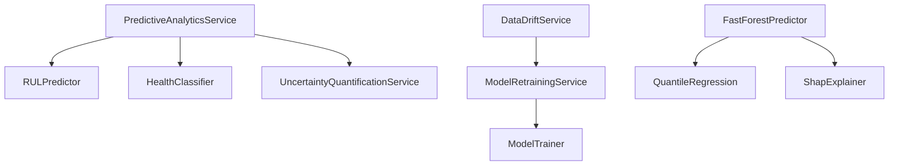

# Predictive Maintenance Engine

<cite>
**Referenced Files in This Document**
- [ModelTrainer.cs](file://src/api/DigitalTwinPlatform.API/Services/Analytics/ML/ModelTrainer.cs)
- [RULPredictor.cs](file://src/api/DigitalTwinPlatform.API/Services/Analytics/ML/RULPredictor.cs)
- [HealthClassifier.cs](file://src/api/DigitalTwinPlatform.API/Services/Analytics/ML/HealthClassifier.cs)
- [FastForestPredictor.cs](file://src/api/DigitalTwinPlatform.Application/ML/FastForestPredictor.cs)
- [QuantileRegression.cs](file://src/api/DigitalTwinPlatform.Application/ML/QuantileRegression.cs)
- [ShapExplainer.cs](file://src/api/DigitalTwinPlatform.Application/ML/ShapExplainer.cs)
- [PredictiveAnalyticsService.cs](file://src/api/DigitalTwinPlatform.API/Services/Analytics/PredictiveAnalyticsService.cs)
- [DataDriftService.cs](file://src/api/DigitalTwinPlatform.API/Services/Analytics/DataDriftService.cs)
- [ModelRetrainingService.cs](file://src/api/DigitalTwinPlatform.API/Services/Analytics/ModelRetrainingService.cs)
- [UncertaintyQuantificationService.cs](file://src/api/DigitalTwinPlatform.API/Services/Analytics/UncertaintyQuantificationService.cs)
- [UncertaintyController.cs](file://src/api/DigitalTwinPlatform.API/Controllers/UncertaintyController.cs)
- [MLPipelineIntegrationTests.cs](file://src/api/DigitalTwinPlatform.Tests/Integration/MLPipelineIntegrationTests.cs)
- [dtos.ts](file://src/frontend/src/types/dtos.ts)
</cite>

## Table of Contents
1. [Introduction](#introduction)
2. [Project Structure](#project-structure)
3. [Core Components](#core-components)
4. [Architecture Overview](#architecture-overview)
5. [Detailed Component Analysis](#detailed-component-analysis)
6. [Dependency Analysis](#dependency-analysis)
7. [Performance Considerations](#performance-considerations)
8. [Troubleshooting Guide](#troubleshooting-guide)
9. [Conclusion](#conclusion)
10. [Appendices](#appendices)

## Introduction
This document explains the predictive maintenance engine built with ML.NET. It covers the training pipeline, inference engine, and analytics services that power RUL estimation, anomaly detection, and health classification. It also documents configuration options, model parameters, uncertainty quantification, drift detection, and model lifecycle management. The content is designed to be accessible to beginners while providing sufficient technical depth for experienced developers.

## Project Structure
The predictive maintenance engine spans three layers:
- API layer: orchestration, controllers, and analytics services
- Application layer: reusable ML components (Fast Forest, Quantile Regression, SHAP-style explainer)
- Tests: integration tests validating drift detection and automated retraining

**Diagram sources**
- [ModelTrainer.cs](file://src/api/DigitalTwinPlatform.API/Services/Analytics/ML/ModelTrainer.cs#L1-L544)
- [RULPredictor.cs](file://src/api/DigitalTwinPlatform.API/Services/Analytics/ML/RULPredictor.cs#L1-L648)
- [HealthClassifier.cs](file://src/api/DigitalTwinPlatform.API/Services/Analytics/ML/HealthClassifier.cs#L1-L468)
- [PredictiveAnalyticsService.cs](file://src/api/DigitalTwinPlatform.API/Services/Analytics/PredictiveAnalyticsService.cs#L1-L200)
- [DataDriftService.cs](file://src/api/DigitalTwinPlatform.API/Services/Analytics/DataDriftService.cs#L128-L525)
- [ModelRetrainingService.cs](file://src/api/DigitalTwinPlatform.API/Services/Analytics/ModelRetrainingService.cs#L32-L62)
- [FastForestPredictor.cs](file://src/api/DigitalTwinPlatform.Application/ML/FastForestPredictor.cs#L1-L158)
- [QuantileRegression.cs](file://src/api/DigitalTwinPlatform.Application/ML/QuantileRegression.cs#L1-L88)
- [ShapExplainer.cs](file://src/api/DigitalTwinPlatform.Application/ML/ShapExplainer.cs#L1-L62)
- [MLPipelineIntegrationTests.cs](file://src/api/DigitalTwinPlatform.Tests/Integration/MLPipelineIntegrationTests.cs#L461-L493)

**Section sources**
- [ModelTrainer.cs](file://src/api/DigitalTwinPlatform.API/Services/Analytics/ML/ModelTrainer.cs#L1-L77)
- [PredictiveAnalyticsService.cs](file://src/api/DigitalTwinPlatform.API/Services/Analytics/PredictiveAnalyticsService.cs#L27-L60)

## Core Components
- ModelTrainer: Prepares training data from telemetry and predictions, trains RUL regression and health classification models, evaluates, saves, and registers versions.
- RULPredictor: Loads ML.NET models, runs inference, computes confidence intervals, and extracts contributing factors.
- HealthClassifier: Performs multiclass health classification with confidence and recommendations.
- FastForestPredictor: Alternative regression trainer using Fast Forest with evaluation metrics.
- QuantileRegression: Trains upper/lower quantile models to estimate prediction intervals.
- ShapExplainer: Provides SHAP-style feature contribution approximations via permutation feature importance.
- PredictiveAnalyticsService: Coordinates telemetry ingestion, feature extraction, and model inference.
- DataDriftService: Monitors feature and prediction drift with thresholds and severity assessment.
- ModelRetrainingService: Initiates retraining when drift exceeds thresholds.
- UncertaintyQuantificationService: Estimates aleatoric and epistemic uncertainty via ensemble perturbation.

**Section sources**
- [ModelTrainer.cs](file://src/api/DigitalTwinPlatform.API/Services/Analytics/ML/ModelTrainer.cs#L49-L77)
- [RULPredictor.cs](file://src/api/DigitalTwinPlatform.API/Services/Analytics/ML/RULPredictor.cs#L14-L53)
- [HealthClassifier.cs](file://src/api/DigitalTwinPlatform.API/Services/Analytics/ML/HealthClassifier.cs#L16-L53)
- [FastForestPredictor.cs](file://src/api/DigitalTwinPlatform.Application/ML/FastForestPredictor.cs#L9-L63)
- [QuantileRegression.cs](file://src/api/DigitalTwinPlatform.Application/ML/QuantileRegression.cs#L7-L61)
- [ShapExplainer.cs](file://src/api/DigitalTwinPlatform.Application/ML/ShapExplainer.cs#L6-L54)
- [PredictiveAnalyticsService.cs](file://src/api/DigitalTwinPlatform.API/Services/Analytics/PredictiveAnalyticsService.cs#L27-L60)
- [DataDriftService.cs](file://src/api/DigitalTwinPlatform.API/Services/Analytics/DataDriftService.cs#L128-L162)
- [ModelRetrainingService.cs](file://src/api/DigitalTwinPlatform.API/Services/Analytics/ModelRetrainingService.cs#L32-L62)
- [UncertaintyQuantificationService.cs](file://src/api/DigitalTwinPlatform.API/Services/Analytics/UncertaintyQuantificationService.cs#L36-L72)

## Architecture Overview
The engine integrates ML.NET models with real-time telemetry and drift monitoring. The training pipeline builds RUL and health models; the inference pipeline serves predictions with uncertainty and XAI insights; drift detection triggers automated retraining.

**Diagram sources**
- [PredictiveAnalyticsService.cs](file://src/api/DigitalTwinPlatform.API/Services/Analytics/PredictiveAnalyticsService.cs#L49-L120)
- [RULPredictor.cs](file://src/api/DigitalTwinPlatform.API/Services/Analytics/ML/RULPredictor.cs#L56-L109)
- [HealthClassifier.cs](file://src/api/DigitalTwinPlatform.API/Services/Analytics/ML/HealthClassifier.cs#L56-L101)
- [UncertaintyQuantificationService.cs](file://src/api/DigitalTwinPlatform.API/Services/Analytics/UncertaintyQuantificationService.cs#L37-L40)

## Detailed Component Analysis

### ML.NET Training Pipeline (ModelTrainer)
- Data preparation: groups telemetry by machine, extracts statistical features, pairs with latest predictions.
- Feature engineering: temperature, vibration, pressure statistics, and time-span features.
- Model training:
  - RUL regression: LightGBM trainer with concatenated features.
  - Health classification: SDCA Maximum Entropy for multiclass.
- Evaluation and logging: R2, MAPE, macro/micro accuracy, log-loss.
- Versioning and registration: saves models with timestamps and registers versions.

**Diagram sources**
- [ModelTrainer.cs](file://src/api/DigitalTwinPlatform.API/Services/Analytics/ML/ModelTrainer.cs#L49-L77)
- [ModelTrainer.cs](file://src/api/DigitalTwinPlatform.API/Services/Analytics/ML/ModelTrainer.cs#L253-L265)
- [ModelTrainer.cs](file://src/api/DigitalTwinPlatform.API/Services/Analytics/ML/ModelTrainer.cs#L390-L457)

**Section sources**
- [ModelTrainer.cs](file://src/api/DigitalTwinPlatform.API/Services/Analytics/ML/ModelTrainer.cs#L79-L114)
- [ModelTrainer.cs](file://src/api/DigitalTwinPlatform.API/Services/Analytics/ML/ModelTrainer.cs#L119-L204)
- [ModelTrainer.cs](file://src/api/DigitalTwinPlatform.API/Services/Analytics/ML/ModelTrainer.cs#L253-L308)
- [ModelTrainer.cs](file://src/api/DigitalTwinPlatform.API/Services/Analytics/ML/ModelTrainer.cs#L390-L457)

### RUL Estimation Engine (RULPredictor)
- Loads model from disk or embedded resource; falls back to deterministic computation when unavailable.
- Accepts telemetry or pre-extracted features; predicts baseline RUL and confidence interval.
- Computes degradation rate, trend, estimated failure date, and health score.
- Provides contributing factors weighted by impact.

**Diagram sources**
- [RULPredictor.cs](file://src/api/DigitalTwinPlatform.API/Services/Analytics/ML/RULPredictor.cs#L14-L53)
- [RULPredictor.cs](file://src/api/DigitalTwinPlatform.API/Services/Analytics/ML/RULPredictor.cs#L250-L265)
- [RULPredictor.cs](file://src/api/DigitalTwinPlatform.API/Services/Analytics/ML/RULPredictor.cs#L627-L647)

**Section sources**
- [RULPredictor.cs](file://src/api/DigitalTwinPlatform.API/Services/Analytics/ML/RULPredictor.cs#L199-L248)
- [RULPredictor.cs](file://src/api/DigitalTwinPlatform.API/Services/Analytics/ML/RULPredictor.cs#L111-L136)
- [RULPredictor.cs](file://src/api/DigitalTwinPlatform.API/Services/Analytics/ML/RULPredictor.cs#L139-L155)
- [RULPredictor.cs](file://src/api/DigitalTwinPlatform.API/Services/Analytics/ML/RULPredictor.cs#L578-L601)

### Health Classification Engine (HealthClassifier)
- Loads health classification model; falls back to rule-based scoring.
- Produces health status, probability, confidence, and contributing factors.
- Provides maintenance recommendations based on risk level.

**Diagram sources**
- [HealthClassifier.cs](file://src/api/DigitalTwinPlatform.API/Services/Analytics/ML/HealthClassifier.cs#L16-L53)
- [HealthClassifier.cs](file://src/api/DigitalTwinPlatform.API/Services/Analytics/ML/HealthClassifier.cs#L269-L284)
- [HealthClassifier.cs](file://src/api/DigitalTwinPlatform.API/Services/Analytics/ML/HealthClassifier.cs#L449-L467)

**Section sources**
- [HealthClassifier.cs](file://src/api/DigitalTwinPlatform.API/Services/Analytics/ML/HealthClassifier.cs#L220-L242)
- [HealthClassifier.cs](file://src/api/DigitalTwinPlatform.API/Services/Analytics/ML/HealthClassifier.cs#L106-L131)
- [HealthClassifier.cs](file://src/api/DigitalTwinPlatform.API/Services/Analytics/ML/HealthClassifier.cs#L302-L360)

### Alternative Regression and XAI (Application Layer)
- FastForestPredictor: Trains a Fast Forest regressor, evaluates with standard metrics, and returns predictions with feature importance.
- QuantileRegression: Trains separate models for upper and lower quantiles to compute prediction intervals.
- ShapExplainer: Generates SHAP-like contributions via permutation feature importance.

**Diagram sources**
- [FastForestPredictor.cs](file://src/api/DigitalTwinPlatform.Application/ML/FastForestPredictor.cs#L23-L63)
- [QuantileRegression.cs](file://src/api/DigitalTwinPlatform.Application/ML/QuantileRegression.cs#L13-L26)
- [ShapExplainer.cs](file://src/api/DigitalTwinPlatform.Application/ML/ShapExplainer.cs#L17-L54)

**Section sources**
- [FastForestPredictor.cs](file://src/api/DigitalTwinPlatform.Application/ML/FastForestPredictor.cs#L88-L111)
- [QuantileRegression.cs](file://src/api/DigitalTwinPlatform.Application/ML/QuantileRegression.cs#L46-L60)
- [ShapExplainer.cs](file://src/api/DigitalTwinPlatform.Application/ML/ShapExplainer.cs#L17-L54)

### Uncertainty Quantification
- Uses ensemble-style perturbation of features to estimate epistemic uncertainty.
- Combines with aleatoric uncertainty to produce total uncertainty and feature importance with uncertainty.

**Diagram sources**
- [UncertaintyController.cs](file://src/api/DigitalTwinPlatform.API/Controllers/UncertaintyController.cs#L230-L253)
- [UncertaintyQuantificationService.cs](file://src/api/DigitalTwinPlatform.API/Services/Analytics/UncertaintyQuantificationService.cs#L249-L272)

**Section sources**
- [UncertaintyQuantificationService.cs](file://src/api/DigitalTwinPlatform.API/Services/Analytics/UncertaintyQuantificationService.cs#L37-L40)
- [UncertaintyController.cs](file://src/api/DigitalTwinPlatform.API/Controllers/UncertaintyController.cs#L230-L253)

### Drift Detection and Automated Retraining
- Drift detection monitors feature and prediction distributions against reference windows.
- Thresholds trigger severity levels; recommendations include retraining.
- Retraining service initiates pipeline and deploys new model versions.

**Diagram sources**
- [DataDriftService.cs](file://src/api/DigitalTwinPlatform.API/Services/Analytics/DataDriftService.cs#L139-L162)
- [DataDriftService.cs](file://src/api/DigitalTwinPlatform.API/Services/Analytics/DataDriftService.cs#L128-L137)
- [ModelRetrainingService.cs](file://src/api/DigitalTwinPlatform.API/Services/Analytics/ModelRetrainingService.cs#L32-L62)

**Section sources**
- [DataDriftService.cs](file://src/api/DigitalTwinPlatform.API/Services/Analytics/DataDriftService.cs#L128-L162)
- [ModelRetrainingService.cs](file://src/api/DigitalTwinPlatform.API/Services/Analytics/ModelRetrainingService.cs#L32-L62)
- [MLPipelineIntegrationTests.cs](file://src/api/DigitalTwinPlatform.Tests/Integration/MLPipelineIntegrationTests.cs#L461-L493)

## Dependency Analysis
- RULPredictor depends on ML.NET model loading and prediction engines; it optionally embeds models.
- HealthClassifier mirrors RULPredictor’s pattern for classification.
- PredictiveAnalyticsService composes RULPredictor and HealthClassifier and coordinates uncertainty.
- DataDriftService and ModelRetrainingService form a closed-loop retraining mechanism.
- Application-layer components (FastForestPredictor, QuantileRegression, ShapExplainer) provide alternatives and complementary capabilities.

**Diagram sources**
- [PredictiveAnalyticsService.cs](file://src/api/DigitalTwinPlatform.API/Services/Analytics/PredictiveAnalyticsService.cs#L27-L47)
- [RULPredictor.cs](file://src/api/DigitalTwinPlatform.API/Services/Analytics/ML/RULPredictor.cs#L30-L53)
- [HealthClassifier.cs](file://src/api/DigitalTwinPlatform.API/Services/Analytics/ML/HealthClassifier.cs#L30-L53)
- [DataDriftService.cs](file://src/api/DigitalTwinPlatform.API/Services/Analytics/DataDriftService.cs#L128-L162)
- [ModelRetrainingService.cs](file://src/api/DigitalTwinPlatform.API/Services/Analytics/ModelRetrainingService.cs#L32-L62)
- [FastForestPredictor.cs](file://src/api/DigitalTwinPlatform.Application/ML/FastForestPredictor.cs#L9-L63)
- [QuantileRegression.cs](file://src/api/DigitalTwinPlatform.Application/ML/QuantileRegression.cs#L7-L61)
- [ShapExplainer.cs](file://src/api/DigitalTwinPlatform.Application/ML/ShapExplainer.cs#L6-L54)

**Section sources**
- [PredictiveAnalyticsService.cs](file://src/api/DigitalTwinPlatform.API/Services/Analytics/PredictiveAnalyticsService.cs#L27-L60)
- [ModelTrainer.cs](file://src/api/DigitalTwinPlatform.API/Services/Analytics/ML/ModelTrainer.cs#L15-L47)

## Performance Considerations
- Feature extraction: Use rolling windows and avoid redundant computations; cache derived statistics when appropriate.
- Model loading: Prefer embedded models for cold-start scenarios; ensure model persistence and lazy initialization.
- Inference: Batch telemetry when feasible; minimize JSON parsing overhead by pre-extracting numeric values.
- Drift monitoring: Use sliding windows and efficient statistical tests; tune thresholds to balance false positives and missed drift.
- Quantile models: Train once and reuse; persist models to reduce latency.
- Uncertainty: Limit ensemble size to balance accuracy and speed; consider approximate methods when exact SHAP is unavailable.

[No sources needed since this section provides general guidance]

## Troubleshooting Guide
- Model not loaded: Verify model paths and embedded resources; check logs for exceptions during model load.
- Poor predictions: Inspect feature extraction logic and ensure telemetry data types match expectations.
- Drift false alarms: Adjust thresholds and window sizes; validate benchmark datasets.
- Retraining failures: Confirm training data availability and pipeline integrity; monitor training metrics.

**Section sources**
- [RULPredictor.cs](file://src/api/DigitalTwinPlatform.API/Services/Analytics/ML/RULPredictor.cs#L216-L248)
- [HealthClassifier.cs](file://src/api/DigitalTwinPlatform.API/Services/Analytics/ML/HealthClassifier.cs#L236-L242)
- [DataDriftService.cs](file://src/api/DigitalTwinPlatform.API/Services/Analytics/DataDriftService.cs#L128-L137)
- [ModelRetrainingService.cs](file://src/api/DigitalTwinPlatform.API/Services/Analytics/ModelRetrainingService.cs#L49-L62)

## Conclusion
The predictive maintenance engine integrates ML.NET across training, inference, uncertainty quantification, and drift-aware retraining. It supports robust RUL estimation and health classification, with extensibility for anomaly detection and advanced XAI. The modular design enables experimentation with alternative trainers and quantile models while maintaining operational reliability.

[No sources needed since this section summarizes without analyzing specific files]

## Appendices

### Configuration Options and Parameters
- RUL model path and health model path: specify persisted model locations.
- Embedded model usage: enable fallback to compiled-in models.
- Default RUL unit: hours/days/cycles conversion.
- Feature weights: influence contribution factor calculations.
- High-risk thresholds: temperature and vibration cutoffs for risk scoring.
- Drift thresholds: feature drift, prediction drift, and label drift thresholds.

**Section sources**
- [RULPredictor.cs](file://src/api/DigitalTwinPlatform.API/Services/Analytics/ML/RULPredictor.cs#L30-L53)
- [HealthClassifier.cs](file://src/api/DigitalTwinPlatform.API/Services/Analytics/ML/HealthClassifier.cs#L30-L53)
- [DataDriftService.cs](file://src/api/DigitalTwinPlatform.API/Services/Analytics/DataDriftService.cs#L514-L522)

### Frontend DTO Alignment
- Model prediction DTOs include remaining useful life, confidence, risk level, feature importance, and prediction time.
- These align with backend prediction results and uncertainty estimates.

**Section sources**
- [dtos.ts](file://src/frontend/src/types/dtos.ts#L142-L171)