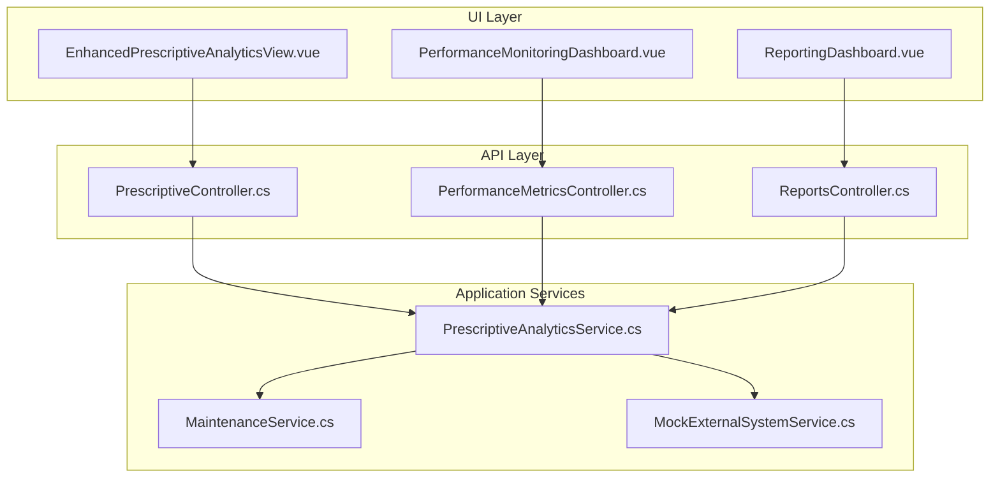
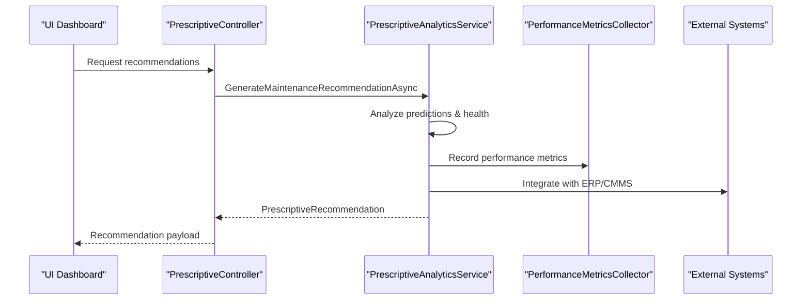
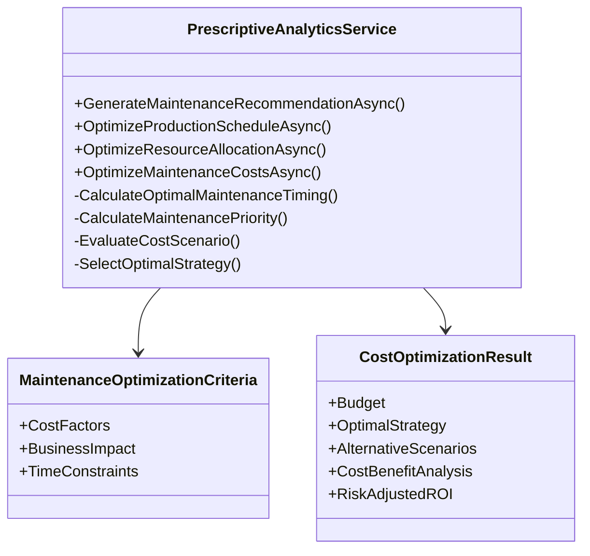
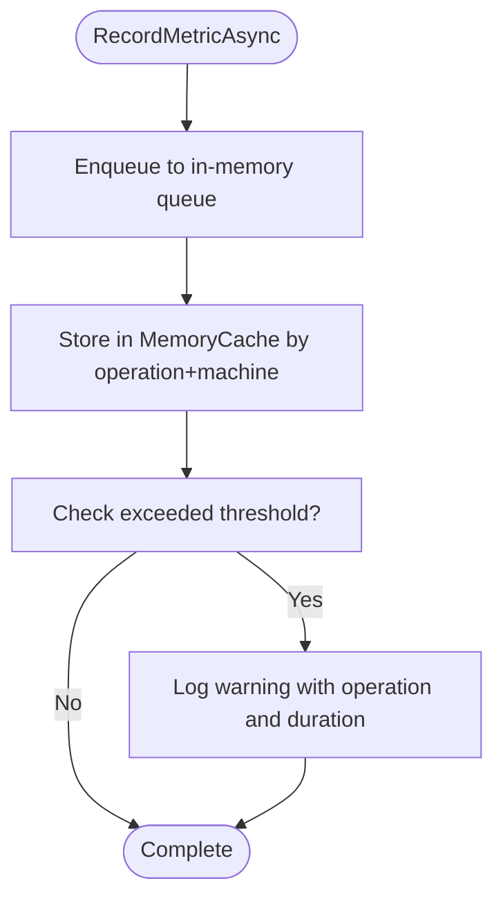
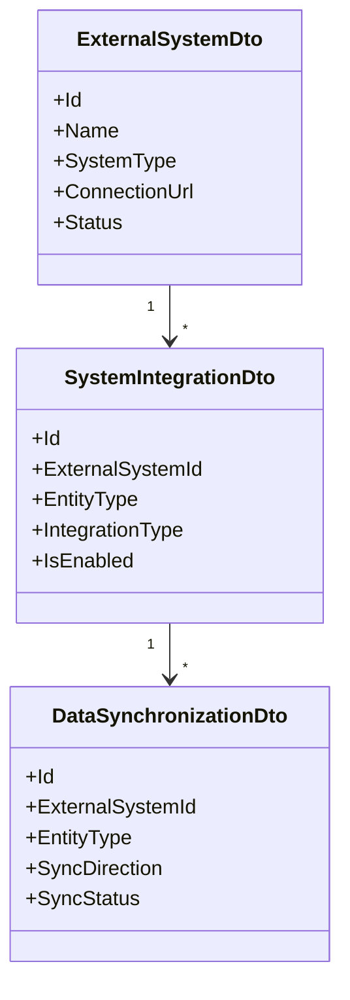
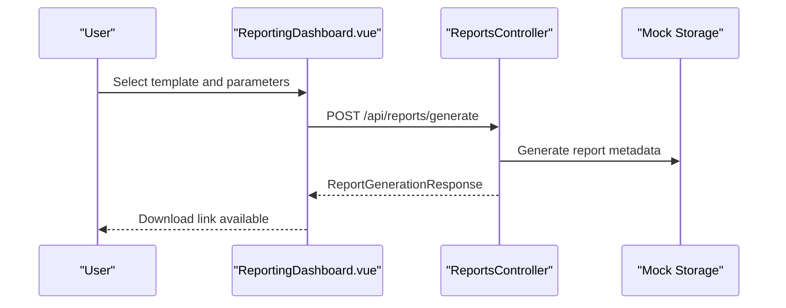
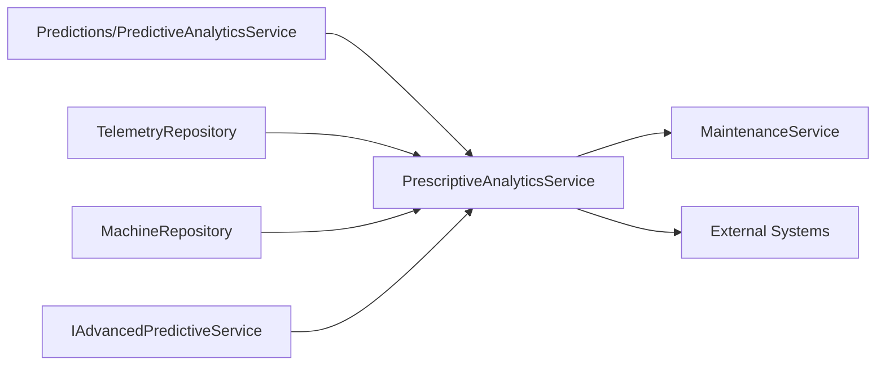

# Business Integration and Metrics

<cite>
**Referenced Files in This Document**
- [PrescriptiveAnalyticsService.cs](file://src/api/DigitalTwinPlatform.API/Services/Analytics/Advanced/PrescriptiveAnalyticsService.cs)
- [PrescriptiveController.cs](file://src/api/DigitalTwinPlatform.API/Controllers/PrescriptiveController.cs)
- [IPrescriptiveService.cs](file://src/api/DigitalTwinPlatform.Application/Maintenance/IPrescriptiveService.cs)
- [MaintenanceService.cs](file://src/api/DigitalTwinPlatform.API/Services/Core/MaintenanceService.cs)
- [PerformanceMetricsCollector.cs](file://src/api/DigitalTwinPlatform.API/Services/Infrastructure/PerformanceMetricsCollector.cs)
- [PerformanceMetricsController.cs](file://src/api/DigitalTwinPlatform.API/Controllers/PerformanceMetricsController.cs)
- [ReportsController.cs](file://src/api/DigitalTwinPlatform.API/Controllers/ReportsController.cs)
- [MockExternalSystemService.cs](file://src/api/DigitalTwinPlatform.Application/ExternalSystems/Services/MockExternalSystemService.cs)
- [data-model.md](file://specs/1-predictive-maintenance/data-model.md)
- [EnhancedPrescriptiveAnalyticsView.vue](file://src/ui/digital-twin-dashboard/src/views/EnhancedPrescriptiveAnalyticsView.vue)
- [PerformanceMonitoringDashboard.vue](file://src/ui/digital-twin-dashboard/src/components/monitoring/PerformanceMonitoringDashboard.vue)
- [ReportingDashboard.vue](file://src/ui/digital-twin-dashboard/src/components/analytics/ReportingDashboard.vue)
- [advancedAnalytics.service.ts](file://src/ui/digital-twin-dashboard/src/services/advancedAnalytics.service.ts)
</cite>

## Table of Contents
1. [Introduction](#introduction)
2. [Project Structure](#project-structure)
3. [Core Components](#core-components)
4. [Architecture Overview](#architecture-overview)
5. [Detailed Component Analysis](#detailed-component-analysis)
6. [Dependency Analysis](#dependency-analysis)
7. [Performance Considerations](#performance-considerations)
8. [Troubleshooting Guide](#troubleshooting-guide)
9. [Conclusion](#conclusion)
10. [Appendices](#appendices)

## Introduction
This document explains how the platform integrates business decisions with prescriptive analytics to optimize maintenance operations and financial outcomes. It covers the cost modeling framework, performance metrics collection, enterprise system integration, and reporting capabilities. The goal is to help stakeholders understand how recommendations are generated, how budgets and ROI are evaluated, and how the system supports executive decision-making through dashboards and automated workflows.

## Project Structure
The business integration spans three layers:
- API Controllers expose endpoints for prescriptive analytics, performance metrics, and reporting
- Services encapsulate business logic for recommendations, cost optimization, and system integrations
- UI components visualize recommendations, monitor performance, and generate reports

**Diagram sources**
- [PrescriptiveController.cs](file://src/api/DigitalTwinPlatform.API/Controllers/PrescriptiveController.cs#L1-L32)
- [PerformanceMetricsController.cs](file://src/api/DigitalTwinPlatform.API/Controllers/PerformanceMetricsController.cs#L1-L75)
- [ReportsController.cs](file://src/api/DigitalTwinPlatform.API/Controllers/ReportsController.cs#L1-L382)
- [PrescriptiveAnalyticsService.cs](file://src/api/DigitalTwinPlatform.API/Services/Analytics/Advanced/PrescriptiveAnalyticsService.cs#L1-L1084)
- [MaintenanceService.cs](file://src/api/DigitalTwinPlatform.API/Services/Core/MaintenanceService.cs#L1-L148)
- [MockExternalSystemService.cs](file://src/api/DigitalTwinPlatform.Application/ExternalSystems/Services/MockExternalSystemService.cs#L1-L613)
- [EnhancedPrescriptiveAnalyticsView.vue](file://src/ui/digital-twin-dashboard/src/views/EnhancedPrescriptiveAnalyticsView.vue#L641-L713)
- [PerformanceMonitoringDashboard.vue](file://src/ui/digital-twin-dashboard/src/components/monitoring/PerformanceMonitoringDashboard.vue#L1-L50)
- [ReportingDashboard.vue](file://src/ui/digital-twin-dashboard/src/components/analytics/ReportingDashboard.vue#L733-L760)

**Section sources**
- [PrescriptiveController.cs](file://src/api/DigitalTwinPlatform.API/Controllers/PrescriptiveController.cs#L1-L32)
- [PrescriptiveAnalyticsService.cs](file://src/api/DigitalTwinPlatform.API/Services/Analytics/Advanced/PrescriptiveAnalyticsService.cs#L1-L1084)
- [EnhancedPrescriptiveAnalyticsView.vue](file://src/ui/digital-twin-dashboard/src/views/EnhancedPrescriptiveAnalyticsView.vue#L641-L713)

## Core Components
- Prescriptive Analytics Service: Generates recommendations, optimizes schedules, allocates resources, and evaluates cost scenarios with ROI and sensitivity analysis
- Performance Metrics Collector: Records latency and throughput metrics, computes statistics, and detects threshold violations
- Reports Controller: Provides report generation, export, scheduling, and templates
- Maintenance Service: Plans, starts, completes, and tracks maintenance records
- External Systems Integration: Manages connections to ERP/CMMS and synchronizes data

**Section sources**
- [PrescriptiveAnalyticsService.cs](file://src/api/DigitalTwinPlatform.API/Services/Analytics/Advanced/PrescriptiveAnalyticsService.cs#L1-L1084)
- [PerformanceMetricsCollector.cs](file://src/api/DigitalTwinPlatform.API/Services/Infrastructure/PerformanceMetricsCollector.cs#L1-L131)
- [ReportsController.cs](file://src/api/DigitalTwinPlatform.API/Controllers/ReportsController.cs#L1-L382)
- [MaintenanceService.cs](file://src/api/DigitalTwinPlatform.API/Services/Core/MaintenanceService.cs#L1-L148)
- [MockExternalSystemService.cs](file://src/api/DigitalTwinPlatform.Application/ExternalSystems/Services/MockExternalSystemService.cs#L1-L613)

## Architecture Overview
The prescriptive analytics pipeline integrates predictive insights with business constraints to produce actionable recommendations and cost-benefit analyses. The system connects to external enterprise systems and exposes APIs for dashboards and reporting.

**Diagram sources**
- [PrescriptiveController.cs](file://src/api/DigitalTwinPlatform.API/Controllers/PrescriptiveController.cs#L1-L32)
- [PrescriptiveAnalyticsService.cs](file://src/api/DigitalTwinPlatform.API/Services/Analytics/Advanced/PrescriptiveAnalyticsService.cs#L63-L162)
- [PerformanceMetricsCollector.cs](file://src/api/DigitalTwinPlatform.API/Services/Infrastructure/PerformanceMetricsCollector.cs#L22-L71)
- [MockExternalSystemService.cs](file://src/api/DigitalTwinPlatform.Application/ExternalSystems/Services/MockExternalSystemService.cs#L1-L613)

## Detailed Component Analysis

### Prescriptive Analytics Service
The service orchestrates:
- Maintenance recommendations with priority scoring and timing optimization
- Production scheduling considering equipment health and risk
- Resource allocation balancing capacity and requirements
- Cost optimization across scenarios with ROI, break-even, and sensitivity analysis

**Diagram sources**
- [PrescriptiveAnalyticsService.cs](file://src/api/DigitalTwinPlatform.API/Services/Analytics/Advanced/PrescriptiveAnalyticsService.cs#L6-L39)
- [PrescriptiveAnalyticsService.cs](file://src/api/DigitalTwinPlatform.API/Services/Analytics/Advanced/PrescriptiveAnalyticsService.cs#L871-L1084)

Key business cost modeling elements:
- Preventive maintenance cost multiplier and failure cost multiplier influence optimal timing
- Downtime cost per hour quantifies economic impact
- Benefit calculation considers avoided downtime, revenue protection, safety, and equipment life extension
- ROI and risk-adjusted ROI guide strategy selection

**Section sources**
- [PrescriptiveAnalyticsService.cs](file://src/api/DigitalTwinPlatform.API/Services/Analytics/Advanced/PrescriptiveAnalyticsService.cs#L318-L332)
- [PrescriptiveAnalyticsService.cs](file://src/api/DigitalTwinPlatform.API/Services/Analytics/Advanced/PrescriptiveAnalyticsService.cs#L363-L385)
- [PrescriptiveAnalyticsService.cs](file://src/api/DigitalTwinPlatform.API/Services/Analytics/Advanced/PrescriptiveAnalyticsService.cs#L784-L817)
- [PrescriptiveAnalyticsService.cs](file://src/api/DigitalTwinPlatform.API/Services/Analytics/Advanced/PrescriptiveAnalyticsService.cs#L819-L826)
- [PrescriptiveAnalyticsService.cs](file://src/api/DigitalTwinPlatform.API/Services/Analytics/Advanced/PrescriptiveAnalyticsService.cs#L828-L839)
- [PrescriptiveAnalyticsService.cs](file://src/api/DigitalTwinPlatform.API/Services/Analytics/Advanced/PrescriptiveAnalyticsService.cs#L861-L866)

### Performance Metrics Collection
The collector captures operation latencies, maintains sliding windows, and computes percentile statistics. Threshold violations are logged for alerting.

**Diagram sources**
- [PerformanceMetricsCollector.cs](file://src/api/DigitalTwinPlatform.API/Services/Infrastructure/PerformanceMetricsCollector.cs#L22-L71)

**Section sources**
- [PerformanceMetricsCollector.cs](file://src/api/DigitalTwinPlatform.API/Services/Infrastructure/PerformanceMetricsCollector.cs#L1-L131)
- [PerformanceMetricsController.cs](file://src/api/DigitalTwinPlatform.API/Controllers/PerformanceMetricsController.cs#L1-L75)

### Enterprise System Integration
External systems (ERP/CMMS) are modeled with integrations and synchronization logs. The mock service demonstrates CRUD operations and status management.

**Diagram sources**
- [MockExternalSystemService.cs](file://src/api/DigitalTwinPlatform.Application/ExternalSystems/Services/MockExternalSystemService.cs#L18-L136)

**Section sources**
- [MockExternalSystemService.cs](file://src/api/DigitalTwinPlatform.Application/ExternalSystems/Services/MockExternalSystemService.cs#L1-L613)

### Reporting and Executive Dashboards
The reporting controller provides templates, scheduling, and export capabilities. UI dashboards visualize performance summaries and prescriptive insights.

**Diagram sources**
- [ReportsController.cs](file://src/api/DigitalTwinPlatform.API/Controllers/ReportsController.cs#L27-L69)
- [ReportingDashboard.vue](file://src/ui/digital-twin-dashboard/src/components/analytics/ReportingDashboard.vue#L733-L760)

**Section sources**
- [ReportsController.cs](file://src/api/DigitalTwinPlatform.API/Controllers/ReportsController.cs#L1-L382)
- [ReportingDashboard.vue](file://src/ui/digital-twin-dashboard/src/components/analytics/ReportingDashboard.vue#L733-L760)

## Dependency Analysis
Prescriptive analytics depends on predictive insights, telemetry repositories, and advanced predictive services. It coordinates with maintenance workflows and external systems.

**Diagram sources**
- [PrescriptiveAnalyticsService.cs](file://src/api/DigitalTwinPlatform.API/Services/Analytics/Advanced/PrescriptiveAnalyticsService.cs#L43-L61)
- [IPrescriptiveService.cs](file://src/api/DigitalTwinPlatform.Application/Maintenance/IPrescriptiveService.cs#L1-L10)
- [MaintenanceService.cs](file://src/api/DigitalTwinPlatform.API/Services/Core/MaintenanceService.cs#L1-L148)
- [MockExternalSystemService.cs](file://src/api/DigitalTwinPlatform.Application/ExternalSystems/Services/MockExternalSystemService.cs#L1-L613)

**Section sources**
- [PrescriptiveAnalyticsService.cs](file://src/api/DigitalTwinPlatform.API/Services/Analytics/Advanced/PrescriptiveAnalyticsService.cs#L43-L61)
- [IPrescriptiveService.cs](file://src/api/DigitalTwinPlatform.Application/Maintenance/IPrescriptiveService.cs#L1-L10)

## Performance Considerations
- Use sliding window caches and bounded queues to maintain low-latency metrics retrieval
- Compute percentiles incrementally or via sorted buffers to avoid O(n log n) operations on every request
- Batch external system synchronization requests and apply retry/backoff policies
- Cache frequently accessed recommendation parameters and model metadata

## Troubleshooting Guide
Common issues and resolutions:
- Recommendations not generated: Verify predictive models are active and telemetry is fresh
- Budget constraint violations: Adjust category limits or increase total budget
- Performance threshold exceeded: Investigate slow operations and reduce contention
- Report generation failures: Confirm template parameters and supported formats

**Section sources**
- [PrescriptiveAnalyticsService.cs](file://src/api/DigitalTwinPlatform.API/Services/Analytics/Advanced/PrescriptiveAnalyticsService.cs#L63-L162)
- [PerformanceMetricsController.cs](file://src/api/DigitalTwinPlatform.API/Controllers/PerformanceMetricsController.cs#L57-L73)
- [ReportsController.cs](file://src/api/DigitalTwinPlatform.API/Controllers/ReportsController.cs#L27-L69)

## Conclusion
The platform combines prescriptive analytics with robust performance monitoring and enterprise integration to deliver actionable maintenance recommendations and measurable ROI. Dashboards and reporting streamline decision-making, while modular services enable extensibility and scalability.

## Appendices

### Business Case Development and Cost-Benefit Analysis
- Scenario modeling: Compare preventive vs reactive strategies under varying budgets
- Benefit quantification: Use avoided downtime and revenue protection estimates
- Sensitivity analysis: Measure ROI stability across input variations
- Executive summary: Present net benefit, break-even point, and risk-adjusted returns

**Section sources**
- [PrescriptiveAnalyticsService.cs](file://src/api/DigitalTwinPlatform.API/Services/Analytics/Advanced/PrescriptiveAnalyticsService.cs#L751-L782)
- [PrescriptiveAnalyticsService.cs](file://src/api/DigitalTwinPlatform.API/Services/Analytics/Advanced/PrescriptiveAnalyticsService.cs#L828-L839)
- [PrescriptiveAnalyticsService.cs](file://src/api/DigitalTwinPlatform.API/Services/Analytics/Advanced/PrescriptiveAnalyticsService.cs#L846-L866)

### Regulatory Compliance and Industry Benchmarks
- Maintain audit trails for maintenance actions and recommendations
- Validate model performance against industry benchmarks using synthetic data validation
- Track compliance with internal thresholds for alert escalation and SLAs

**Section sources**
- [data-model.md](file://specs/1-predictive-maintenance/data-model.md#L349-L366)
- [SyntheticDataGenerator.cs](file://src/api/DigitalTwinPlatform.API/Services/Simulation/SyntheticDataGenerator.cs#L160-L165)

### Strategic Decision-Making Support
- Use prescriptive recommendations to prioritize high-risk assets
- Align maintenance windows with production schedules to minimize downtime
- Monitor performance trends to adjust strategies proactively

**Section sources**
- [PrescriptiveAnalyticsService.cs](file://src/api/DigitalTwinPlatform.API/Services/Analytics/Advanced/PrescriptiveAnalyticsService.cs#L164-L235)
- [EnhancedPrescriptiveAnalyticsView.vue](file://src/ui/digital-twin-dashboard/src/views/EnhancedPrescriptiveAnalyticsView.vue#L641-L713)