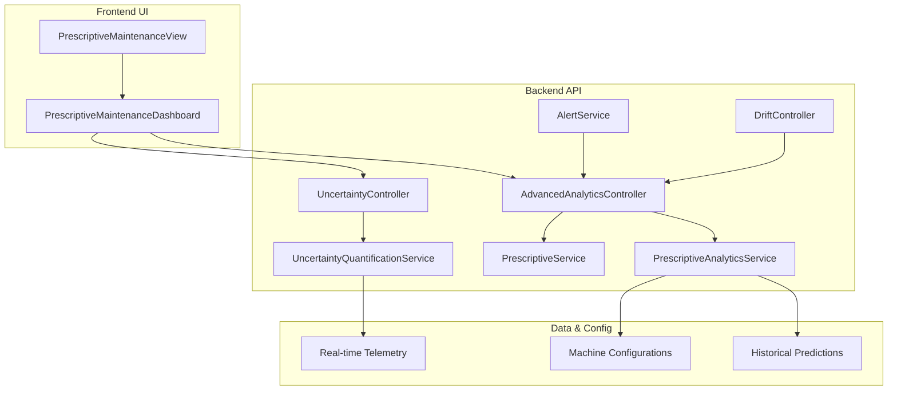
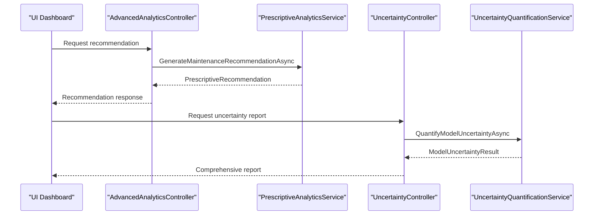
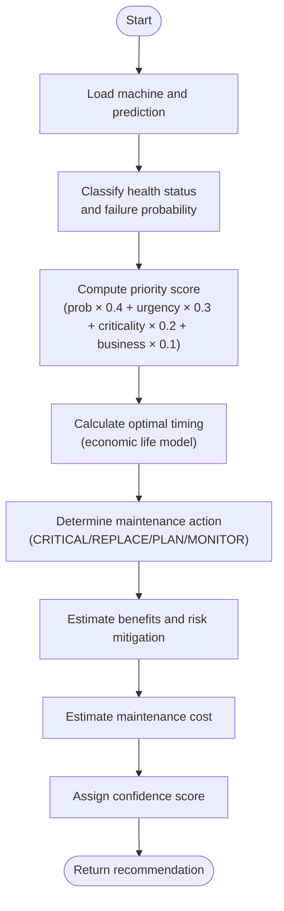
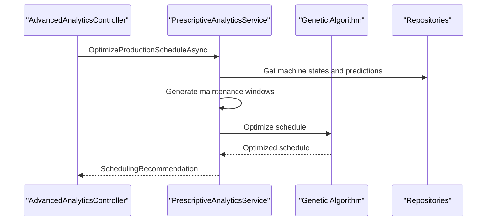
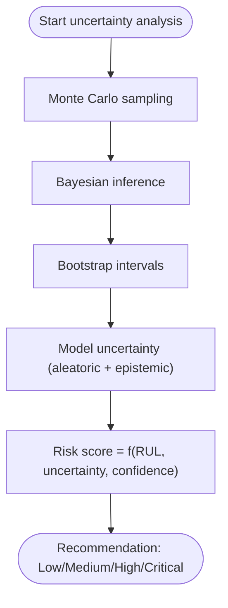
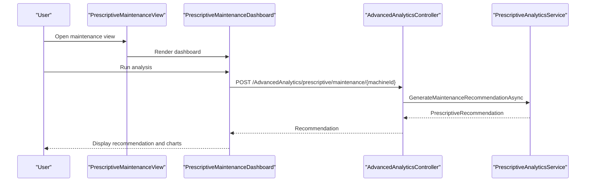
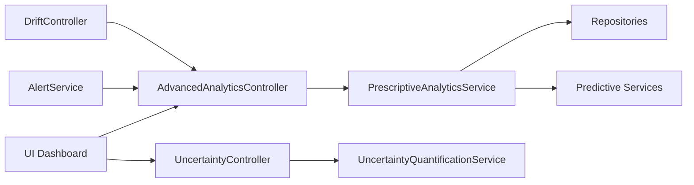

# Decision Support and Recommendation Systems

<cite>
**Referenced Files in This Document**
- [PrescriptiveAnalyticsService.cs](file://src/api/DigitalTwinPlatform.API/Services/Analytics/Advanced/PrescriptiveAnalyticsService.cs)
- [AdvancedAnalyticsController.cs](file://src/api/DigitalTwinPlatform.API/Controllers/AdvancedAnalyticsController.cs)
- [PrescriptiveService.cs](file://src/api/DigitalTwinPlatform.API/Services/Maintenance/PrescriptiveService.cs)
- [UncertaintyQuantificationService.cs](file://src/api/DigitalTwinPlatform.API/Services/Analytics/UnertaintyQuantificationService.cs)
- [UncertaintyController.cs](file://src/api/DigitalTwinPlatform.API/Controllers/UncertaintyController.cs)
- [PrescriptiveMaintenanceDashboard.vue](file://src/ui/digital-twin-dashboard/src/components/maintenance/PrescriptiveMaintenanceDashboard.vue)
- [PrescriptiveMaintenanceView.vue](file://src/ui/digital-twin-dashboard/src/views/PrescriptiveMaintenanceView.vue)
- [Alert.cs](file://src/api/DigitalTwinPlatform.Domain/Entities/Alert.cs)
- [AlertService.cs](file://src/api/DigitalTwinPlatform.API/Services/Core/AlertService.cs)
- [AlertRulesController.cs](file://src/api/DigitalTwinPlatform.API/Controllers/AlertRulesController.cs)
- [DriftController.cs](file://src/api/DigitalTwinPlatform.API/Controllers/DriftController.cs)
- [IDataDriftService.cs](file://src/api/DigitalTwinPlatform.API/Services/Analytics/IDataDriftService.cs)
- [Drift-Detection.md](file://src/api/DigitalTwinPlatform.API/Documentation/Drift-Detection.md)
- [CNC.json](file://config/machines/CNC.json)
- [Conveyor.json](file://config/machines/Conveyor.json)
- [InjectionMolder.json](file://config/machines/InjectionMolder.json)
- [Press.json](file://config/machines/Press.json)
- [Robot.json](file://config/machines/Robot.json)
</cite>

## Table of Contents
1. [Introduction](#introduction)
2. [Project Structure](#project-structure)
3. [Core Components](#core-components)
4. [Architecture Overview](#architecture-overview)
5. [Detailed Component Analysis](#detailed-component-analysis)
6. [Dependency Analysis](#dependency-analysis)
7. [Performance Considerations](#performance-considerations)
8. [Troubleshooting Guide](#troubleshooting-guide)
9. [Conclusion](#conclusion)
10. [Appendices](#appendices)

## Introduction
This document describes the decision support and recommendation systems that power predictive and prescriptive maintenance within the digital twin platform. It explains how risk-based classification drives maintenance actions, how automated scheduling integrates with real-time monitoring and historical data, and how uncertainty quantification informs confidence and decision-making. The document also covers recommendation scoring, threshold configuration, integration with drift detection, and user interface components for presenting actionable insights to stakeholders.

## Project Structure
The decision support system spans backend services, controllers, analytics libraries, and a Vue-based frontend dashboard. Key areas include:
- Prescriptive analytics service for maintenance recommendations and scheduling
- Uncertainty quantification service for confidence and risk assessment
- Controllers exposing APIs for recommendations, uncertainty, and drift detection
- Frontend dashboards for interactive decision support and executive reporting
- Machine configuration files defining equipment characteristics and criticality

**Diagram sources**
- [AdvancedAnalyticsController.cs](file://src/api/DigitalTwinPlatform.API/Controllers/AdvancedAnalyticsController.cs#L127-L159)
- [PrescriptiveAnalyticsService.cs](file://src/api/DigitalTwinPlatform.API/Services/Analytics/Advanced/PrescriptiveAnalyticsService.cs#L63-L162)
- [UncertaintyController.cs](file://src/api/DigitalTwinPlatform.API/Controllers/UncertaintyController.cs#L197-L284)
- [UncertaintyQuantificationService.cs](file://src/api/DigitalTwinPlatform.API/Services/Analytics/UnertaintyQuantificationService.cs#L221-L301)
- [PrescriptiveService.cs](file://src/api/DigitalTwinPlatform.API/Services/Maintenance/PrescriptiveService.cs#L27-L79)
- [PrescriptiveMaintenanceView.vue](file://src/ui/digital-twin-dashboard/src/views/PrescriptiveMaintenanceView.vue#L1-L7)
- [PrescriptiveMaintenanceDashboard.vue](file://src/ui/digital-twin-dashboard/src/components/maintenance/PrescriptiveMaintenanceDashboard.vue#L1-L496)

**Section sources**
- [AdvancedAnalyticsController.cs](file://src/api/DigitalTwinPlatform.API/Controllers/AdvancedAnalyticsController.cs#L1-L351)
- [PrescriptiveAnalyticsService.cs](file://src/api/DigitalTwinPlatform.API/Services/Analytics/Advanced/PrescriptiveAnalyticsService.cs#L1-L1084)
- [UncertaintyController.cs](file://src/api/DigitalTwinPlatform.API/Controllers/UncertaintyController.cs#L1-L418)
- [UncertaintyQuantificationService.cs](file://src/api/DigitalTwinPlatform.API/Services/Analytics/UnertaintyQuantificationService.cs#L1-L384)
- [PrescriptiveService.cs](file://src/api/DigitalTwinPlatform.API/Services/Maintenance/PrescriptiveService.cs#L1-L79)
- [PrescriptiveMaintenanceView.vue](file://src/ui/digital-twin-dashboard/src/views/PrescriptiveMaintenanceView.vue#L1-L7)
- [PrescriptiveMaintenanceDashboard.vue](file://src/ui/digital-twin-dashboard/src/components/maintenance/PrescriptiveMaintenanceDashboard.vue#L1-L496)

## Core Components
- Prescriptive recommendation engine: Computes maintenance actions, priority scores, timing, benefits, and risk mitigation using health predictions, criticality, and business impact.
- Uncertainty quantification: Provides Monte Carlo, Bayesian, and bootstrap analyses to assess prediction reliability and risk levels.
- Drift detection: Monitors model and data drift to maintain reliable recommendations.
- Alerting and rules: Manages alert thresholds and notifications for critical conditions.
- Frontend dashboard: Presents recommendations, cost/risk visualizations, and executive summaries.

Key recommendation logic highlights:
- Risk-based classification: CRITICAL, REPLACE, PLAN, MONITOR derived from failure probability and remaining useful life.
- Automated scheduling: Genetic algorithm-based optimization balancing efficiency and risk reduction.
- Decision thresholds: Configurable cost factors, business impact, and time constraints.

**Section sources**
- [PrescriptiveAnalyticsService.cs](file://src/api/DigitalTwinPlatform.API/Services/Analytics/Advanced/PrescriptiveAnalyticsService.cs#L334-L361)
- [PrescriptiveAnalyticsService.cs](file://src/api/DigitalTwinPlatform.API/Services/Analytics/Advanced/PrescriptiveAnalyticsService.cs#L318-L332)
- [PrescriptiveAnalyticsService.cs](file://src/api/DigitalTwinPlatform.API/Services/Analytics/Advanced/PrescriptiveAnalyticsService.cs#L901-L917)
- [PrescriptiveService.cs](file://src/api/DigitalTwinPlatform.API/Services/Maintenance/PrescriptiveService.cs#L71-L77)
- [UncertaintyController.cs](file://src/api/DigitalTwinPlatform.API/Controllers/UncertaintyController.cs#L286-L327)

## Architecture Overview
The system follows a layered architecture:
- Presentation: Vue dashboard renders recommendations and analytics.
- API: Controllers orchestrate analytics services and expose endpoints.
- Services: Implement recommendation algorithms, uncertainty quantification, scheduling, and drift detection.
- Data: Historical predictions, telemetry, and machine configurations inform decisions.

**Diagram sources**
- [AdvancedAnalyticsController.cs](file://src/api/DigitalTwinPlatform.API/Controllers/AdvancedAnalyticsController.cs#L127-L159)
- [PrescriptiveAnalyticsService.cs](file://src/api/DigitalTwinPlatform.API/Services/Analytics/Advanced/PrescriptiveAnalyticsService.cs#L63-L162)
- [UncertaintyController.cs](file://src/api/DigitalTwinPlatform.API/Controllers/UncertaintyController.cs#L197-L284)
- [UncertaintyQuantificationService.cs](file://src/api/DigitalTwinPlatform.API/Services/Analytics/UnertaintyQuantificationService.cs#L221-L301)

## Detailed Component Analysis

### Prescriptive Recommendation Engine
The prescriptive engine synthesizes:
- Maintenance type classification based on health status, failure probability, and remaining useful life
- Priority scoring incorporating failure probability, urgency, criticality, and business impact
- Optimal timing using economic life optimization balancing failure and maintenance costs
- Benefits estimation and risk mitigation metrics
- Cost estimates and confidence scores

**Diagram sources**
- [PrescriptiveAnalyticsService.cs](file://src/api/DigitalTwinPlatform.API/Services/Analytics/Advanced/PrescriptiveAnalyticsService.cs#L334-L361)
- [PrescriptiveAnalyticsService.cs](file://src/api/DigitalTwinPlatform.API/Services/Analytics/Advanced/PrescriptiveAnalyticsService.cs#L318-L332)
- [PrescriptiveAnalyticsService.cs](file://src/api/DigitalTwinPlatform.API/Services/Analytics/Advanced/PrescriptiveAnalyticsService.cs#L363-L385)
- [PrescriptiveAnalyticsService.cs](file://src/api/DigitalTwinPlatform.API/Services/Analytics/Advanced/PrescriptiveAnalyticsService.cs#L387-L396)
- [PrescriptiveAnalyticsService.cs](file://src/api/DigitalTwinPlatform.API/Services/Analytics/Advanced/PrescriptiveAnalyticsService.cs#L398-L408)

**Section sources**
- [PrescriptiveAnalyticsService.cs](file://src/api/DigitalTwinPlatform.API/Services/Analytics/Advanced/PrescriptiveAnalyticsService.cs#L63-L162)
- [PrescriptiveAnalyticsService.cs](file://src/api/DigitalTwinPlatform.API/Services/Analytics/Advanced/PrescriptiveAnalyticsService.cs#L334-L408)

### Automated Maintenance Scheduling
The scheduling component optimizes production schedules considering:
- Machine states (health, RUL, failure probability, criticality)
- Maintenance windows for high-risk machines
- Genetic algorithm fitness maximizing efficiency and minimizing risk

**Diagram sources**
- [AdvancedAnalyticsController.cs](file://src/api/DigitalTwinPlatform.API/Controllers/AdvancedAnalyticsController.cs#L164-L186)
- [PrescriptiveAnalyticsService.cs](file://src/api/DigitalTwinPlatform.API/Services/Analytics/Advanced/PrescriptiveAnalyticsService.cs#L164-L235)
- [PrescriptiveAnalyticsService.cs](file://src/api/DigitalTwinPlatform.API/Services/Analytics/Advanced/PrescriptiveAnalyticsService.cs#L446-L467)

**Section sources**
- [PrescriptiveAnalyticsService.cs](file://src/api/DigitalTwinPlatform.API/Services/Analytics/Advanced/PrescriptiveAnalyticsService.cs#L164-L235)
- [PrescriptiveAnalyticsService.cs](file://src/api/DigitalTwinPlatform.API/Services/Analytics/Advanced/PrescriptiveAnalyticsService.cs#L446-L594)

### Uncertainty Quantification and Risk Assessment
The uncertainty service provides:
- Monte Carlo simulation for prediction variability
- Bayesian inference for posterior updates
- Bootstrap confidence intervals
- Model uncertainty decomposition (aleatoric and epistemic)

Risk assessment maps uncertainty and RUL to risk levels with actionable recommendations.

**Diagram sources**
- [UncertaintyQuantificationService.cs](file://src/api/DigitalTwinPlatform.API/Services/Analytics/UnertaintyQuantificationService.cs#L15-L92)
- [UncertaintyQuantificationService.cs](file://src/api/DigitalTwinPlatform.API/Services/Analytics/UnertaintyQuantificationService.cs#L94-L154)
- [UncertaintyQuantificationService.cs](file://src/api/DigitalTwinPlatform.API/Services/Analytics/UnertaintyQuantificationService.cs#L156-L219)
- [UncertaintyQuantificationService.cs](file://src/api/DigitalTwinPlatform.API/Services/Analytics/UnertaintyQuantificationService.cs#L221-L301)
- [UncertaintyController.cs](file://src/api/DigitalTwinPlatform.API/Controllers/UncertaintyController.cs#L286-L327)

**Section sources**
- [UncertaintyQuantificationService.cs](file://src/api/DigitalTwinPlatform.API/Services/Analytics/UnertaintyQuantificationService.cs#L15-L301)
- [UncertaintyController.cs](file://src/api/DigitalTwinPlatform.API/Controllers/UncertaintyController.cs#L197-L327)

### Decision Threshold Configuration
Thresholds are configured via:
- Cost factors (preventive/failure cost multipliers, downtime cost)
- Business impact (revenue, safety, environmental impact)
- Time constraints (earliest/latest start, preferred windows)
- Drift thresholds for model and prediction stability

These parameters influence recommendation priority, timing, and scheduling outcomes.

**Section sources**
- [PrescriptiveAnalyticsService.cs](file://src/api/DigitalTwinPlatform.API/Services/Analytics/Advanced/PrescriptiveAnalyticsService.cs#L880-L899)
- [AdvancedAnalyticsController.cs](file://src/api/DigitalTwinPlatform.API/Controllers/AdvancedAnalyticsController.cs#L130-L159)
- [IDataDriftService.cs](file://src/api/DigitalTwinPlatform.API/Services/Analytics/IDataDriftService.cs#L22-L43)
- [Drift-Detection.md](file://src/api/DigitalTwinPlatform.API/Documentation/Drift-Detection.md#L114-L171)

### Integration with Predictive Analytics, Real-time Monitoring, and Historical Data
- Predictive analytics feed current health status, failure probability, and remaining useful life.
- Real-time telemetry supports uncertainty quantification and drift detection.
- Historical predictions enable bootstrap intervals and fallback assessments.
- Machine configurations (criticality, type) inform recommendation logic.

**Section sources**
- [PrescriptiveAnalyticsService.cs](file://src/api/DigitalTwinPlatform.API/Services/Analytics/Advanced/PrescriptiveAnalyticsService.cs#L70-L95)
- [UncertaintyQuantificationService.cs](file://src/api/DigitalTwinPlatform.API/Services/Analytics/UnertaintyQuantificationService.cs#L228-L240)
- [DriftController.cs](file://src/api/DigitalTwinPlatform.API/Controllers/DriftController.cs#L100-L133)

### Examples of Recommendation Generation and Decision Workflow
- Generate a maintenance recommendation for a machine using cost and business impact parameters.
- Produce a comprehensive uncertainty report combining Monte Carlo, model uncertainty, and bootstrap intervals.
- Derive risk-based classification (CRITICAL/REPLACE/PLAN/MONITOR) from failure probability and RUL.
- Present recommendations via the dashboard with charts and summary cards.

**Diagram sources**
- [PrescriptiveMaintenanceView.vue](file://src/ui/digital-twin-dashboard/src/views/PrescriptiveMaintenanceView.vue#L1-L7)
- [PrescriptiveMaintenanceDashboard.vue](file://src/ui/digital-twin-dashboard/src/components/maintenance/PrescriptiveMaintenanceDashboard.vue#L92-L124)
- [AdvancedAnalyticsController.cs](file://src/api/DigitalTwinPlatform.API/Controllers/AdvancedAnalyticsController.cs#L130-L159)
- [PrescriptiveAnalyticsService.cs](file://src/api/DigitalTwinPlatform.API/Services/Analytics/Advanced/PrescriptiveAnalyticsService.cs#L63-L162)

**Section sources**
- [AdvancedAnalyticsController.cs](file://src/api/DigitalTwinPlatform.API/Controllers/AdvancedAnalyticsController.cs#L127-L159)
- [PrescriptiveMaintenanceDashboard.vue](file://src/ui/digital-twin-dashboard/src/components/maintenance/PrescriptiveMaintenanceDashboard.vue#L92-L124)

### Stakeholder Communication Strategies
- Executive dashboards summarize risk, costs, and recommendations.
- Color-coded risk indicators and charts improve decision speed.
- Automated alerts escalate critical conditions and track resolution.
- Uncertainty reports help explain confidence and potential variability.

**Section sources**
- [PrescriptiveMaintenanceDashboard.vue](file://src/ui/digital-twin-dashboard/src/components/maintenance/PrescriptiveMaintenanceDashboard.vue#L327-L400)
- [Alert.cs](file://src/api/DigitalTwinPlatform.Domain/Entities/Alert.cs#L79-L113)
- [AlertService.cs](file://src/api/DigitalTwinPlatform.API/Services/Core/AlertService.cs#L85-L98)

### Recommendation Customization and Business Rule Integration
- Machine criticality loaded from configuration influences priority scoring.
- Business impact parameters tailor benefit calculations.
- Time constraints align recommendations with operational windows.
- Drift detection ensures thresholds remain valid under concept drift.

**Section sources**
- [PrescriptiveAnalyticsService.cs](file://src/api/DigitalTwinPlatform.API/Services/Analytics/Advanced/PrescriptiveAnalyticsService.cs#L103-L116)
- [CNC.json](file://config/machines/CNC.json)
- [Conveyor.json](file://config/machines/Conveyor.json)
- [InjectionMolder.json](file://config/machines/InjectionMolder.json)
- [Press.json](file://config/machines/Press.json)
- [Robot.json](file://config/machines/Robot.json)

### Exception Handling Procedures
- Controllers wrap operations with try-catch and log errors.
- Uncertainty service handles missing telemetry or prediction data gracefully.
- Drift controller validates threshold ranges and returns structured errors.

**Section sources**
- [AdvancedAnalyticsController.cs](file://src/api/DigitalTwinPlatform.API/Controllers/AdvancedAnalyticsController.cs#L136-L158)
- [UncertaintyController.cs](file://src/api/DigitalTwinPlatform.API/Controllers/UncertaintyController.cs#L30-L64)
- [UncertaintyQuantificationService.cs](file://src/api/DigitalTwinPlatform.API/Services/Analytics/UnertaintyQuantificationService.cs#L228-L235)
- [DriftController.cs](file://src/api/DigitalTwinPlatform.API/Controllers/DriftController.cs#L110-L118)

## Dependency Analysis
The system exhibits clear separation of concerns:
- Controllers depend on services for recommendation and uncertainty computation.
- Services depend on repositories and predictive services for data and models.
- UI depends on services for data fetching and visualization.
- Drift detection and alerting integrate across layers.

**Diagram sources**
- [AdvancedAnalyticsController.cs](file://src/api/DigitalTwinPlatform.API/Controllers/AdvancedAnalyticsController.cs#L1-L351)
- [PrescriptiveAnalyticsService.cs](file://src/api/DigitalTwinPlatform.API/Services/Analytics/Advanced/PrescriptiveAnalyticsService.cs#L41-L61)
- [UncertaintyController.cs](file://src/api/DigitalTwinPlatform.API/Controllers/UncertaintyController.cs#L1-L418)
- [UncertaintyQuantificationService.cs](file://src/api/DigitalTwinPlatform.API/Services/Analytics/UnertaintyQuantificationService.cs#L1-L384)
- [AlertService.cs](file://src/api/DigitalTwinPlatform.API/Services/Core/AlertService.cs#L85-L98)
- [DriftController.cs](file://src/api/DigitalTwinPlatform.API/Controllers/DriftController.cs#L100-L133)

**Section sources**
- [AdvancedAnalyticsController.cs](file://src/api/DigitalTwinPlatform.API/Controllers/AdvancedAnalyticsController.cs#L1-L351)
- [PrescriptiveAnalyticsService.cs](file://src/api/DigitalTwinPlatform.API/Services/Analytics/Advanced/PrescriptiveAnalyticsService.cs#L41-L61)
- [UncertaintyController.cs](file://src/api/DigitalTwinPlatform.API/Controllers/UncertaintyController.cs#L1-L418)
- [UncertaintyQuantificationService.cs](file://src/api/DigitalTwinPlatform.API/Services/Analytics/UnertaintyQuantificationService.cs#L1-L384)
- [AlertService.cs](file://src/api/DigitalTwinPlatform.API/Services/Core/AlertService.cs#L85-L98)
- [DriftController.cs](file://src/api/DigitalTwinPlatform.API/Controllers/DriftController.cs#L100-L133)

## Performance Considerations
- Use caching for frequently accessed predictions and telemetry windows.
- Batch requests for scheduling and resource allocation to reduce latency.
- Tune genetic algorithm parameters (population size, generations) for balance between quality and speed.
- Apply data sampling for drift detection on high-frequency streams.
- Monitor service logs and metrics to identify hotspots in recommendation generation.

## Troubleshooting Guide
Common issues and resolutions:
- Missing historical predictions: The uncertainty service throws when insufficient data exists; ensure data ingestion is active.
- Invalid drift thresholds: The drift controller validates ranges and returns structured errors; adjust thresholds within accepted bounds.
- High uncertainty impacting recommendations: Review aleatoric and epistemic components and consider retraining or collecting more data.
- UI not rendering charts: Verify chart initialization and resize handlers; ensure DOM elements are mounted before rendering.

**Section sources**
- [UncertaintyQuantificationService.cs](file://src/api/DigitalTwinPlatform.API/Services/Analytics/UnertaintyQuantificationService.cs#L164-L171)
- [DriftController.cs](file://src/api/DigitalTwinPlatform.API/Controllers/DriftController.cs#L110-L118)
- [PrescriptiveMaintenanceDashboard.vue](file://src/ui/digital-twin-dashboard/src/components/maintenance/PrescriptiveMaintenanceDashboard.vue#L255-L270)

## Conclusion
The decision support system combines robust prescriptive analytics, uncertainty quantification, and real-time monitoring to deliver actionable, risk-informed recommendations. By configuring thresholds, integrating drift detection, and leveraging machine configurations, organizations can automate maintenance scheduling, improve reliability, and communicate insights effectively across stakeholder levels.

## Appendices

### Risk-Based Classification Reference
- CRITICAL: Past predicted failure date or very high failure probability
- REPLACE: High failure probability indicating imminent component replacement
- PLAN: Schedule maintenance soon based on elevated risk
- MONITOR: Healthy operational window with routine checks

**Section sources**
- [PrescriptiveService.cs](file://src/api/DigitalTwinPlatform.API/Services/Maintenance/PrescriptiveService.cs#L71-L77)

### Example Machine Configuration Fields
- Criticality: Integer scale influencing priority scoring
- Type: Machine type affecting maintenance strategies
- Operating parameters: Temperature, vibration, pressure, operating hours

**Section sources**
- [PrescriptiveAnalyticsService.cs](file://src/api/DigitalTwinPlatform.API/Services/Analytics/Advanced/PrescriptiveAnalyticsService.cs#L103-L116)
- [CNC.json](file://config/machines/CNC.json)
- [Conveyor.json](file://config/machines/Conveyor.json)
- [InjectionMolder.json](file://config/machines/InjectionMolder.json)
- [Press.json](file://config/machines/Press.json)
- [Robot.json](file://config/machines/Robot.json)