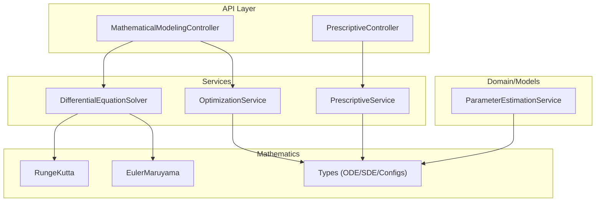
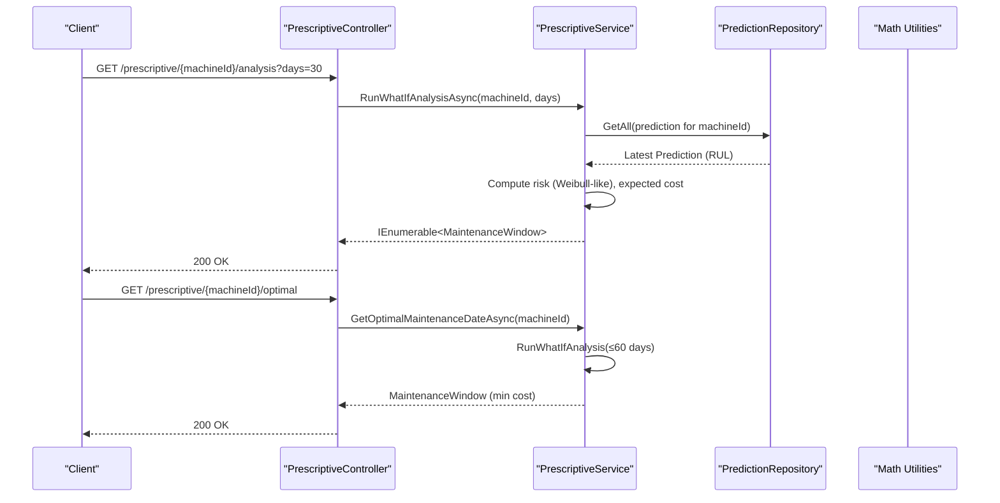
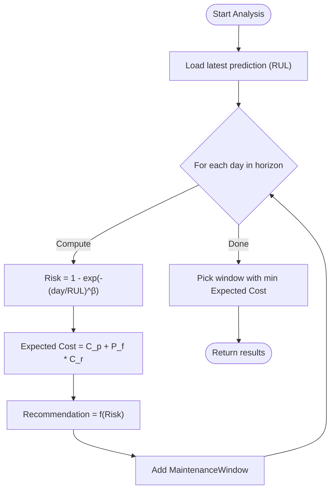
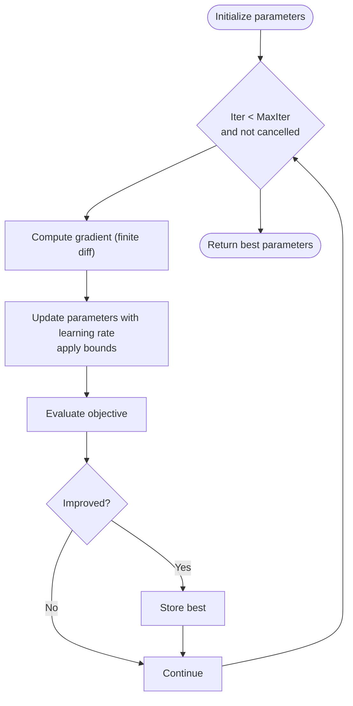
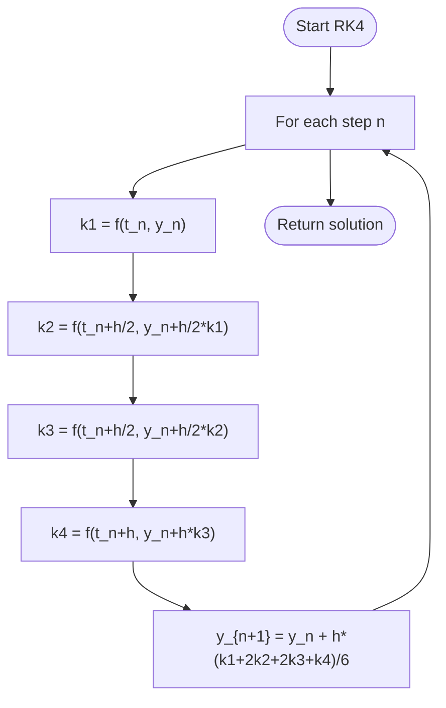
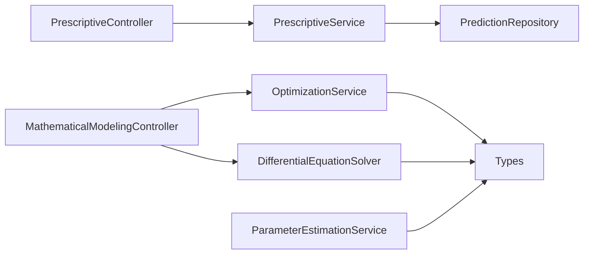

# Optimization Algorithms and Mathematical Models

<cite>
**Referenced Files in This Document**
- [PrescriptiveController.cs](file://src/api/DigitalTwinPlatform.API/Controllers/PrescriptiveController.cs)
- [PrescriptiveService.cs](file://src/api/DigitalTwinPlatform.API/Services/Maintenance/PrescriptiveService.cs)
- [MathematicalModelingController.cs](file://src/api/DigitalTwinPlatform.API/Controllers/MathematicalModelingController.cs)
- [MathematicalModelingServices.cs](file://src/api/DigitalTwinPlatform.API/Services/MathematicalModeling/MathematicalModelingServices.cs)
- [RungeKutta.cs](file://src/api/DigitalTwinPlatform.Application/Mathematics/RungeKutta.cs)
- [EulerMaruyama.cs](file://src/api/DigitalTwinPlatform.Application/Mathematics/EulerMaruyama.cs)
- [Types.cs](file://src/api/DigitalTwinPlatform.Application/Mathematics/Types.cs)
- [ParameterEstimationService.cs](file://src/api/DigitalTwinPlatform.Application/Services/ParameterEstimationService.cs)
- [MATH_MODELS.md](file://docs/MATH_MODELS.md)
</cite>

## Table of Contents
1. [Introduction](#introduction)
2. [Project Structure](#project-structure)
3. [Core Components](#core-components)
4. [Architecture Overview](#architecture-overview)
5. [Detailed Component Analysis](#detailed-component-analysis)
6. [Dependency Analysis](#dependency-analysis)
7. [Performance Considerations](#performance-considerations)
8. [Troubleshooting Guide](#troubleshooting-guide)
9. [Conclusion](#conclusion)
10. [Appendices](#appendices)

## Introduction
This document explains the optimization algorithms and mathematical models used in prescriptive analytics for maintenance scheduling. It covers:
- Cost-risk optimization framework with preventive versus reactive maintenance costs
- Weibull-distribution-based failure probability modeling
- Expected cost minimization workflows
- Mathematical formulations, parameter tuning, and constraint handling
- Optimization objective functions, decision variables, and solution methodologies
- Examples of maintenance window calculation, cost-benefit analysis, and optimal schedule determination
- Numerical stability, convergence criteria, and computational efficiency considerations
- Implementation details for risk scoring, cost calculation, and recommendation generation

## Project Structure
The prescriptive analytics functionality spans API controllers, services, and mathematical modeling utilities:
- Controllers expose endpoints for prescriptive analysis and mathematical modeling
- Services implement cost-risk optimization and optimization algorithms
- Mathematical utilities provide ODE/SDE solvers and parameter estimation

**Diagram sources**
- [PrescriptiveController.cs](file://src/api/DigitalTwinPlatform.API/Controllers/PrescriptiveController.cs#L1-L32)
- [PrescriptiveService.cs](file://src/api/DigitalTwinPlatform.API/Services/Maintenance/PrescriptiveService.cs#L1-L79)
- [MathematicalModelingController.cs](file://src/api/DigitalTwinPlatform.API/Controllers/MathematicalModelingController.cs#L1-L514)
- [MathematicalModelingServices.cs](file://src/api/DigitalTwinPlatform.API/Services/MathematicalModeling/MathematicalModelingServices.cs#L1-L822)
- [RungeKutta.cs](file://src/api/DigitalTwinPlatform.Application/Mathematics/RungeKutta.cs#L1-L250)
- [EulerMaruyama.cs](file://src/api/DigitalTwinPlatform.Application/Mathematics/EulerMaruyama.cs#L1-L388)
- [Types.cs](file://src/api/DigitalTwinPlatform.Application/Mathematics/Types.cs#L1-L98)
- [ParameterEstimationService.cs](file://src/api/DigitalTwinPlatform.Application/Services/ParameterEstimationService.cs#L1-L625)

**Section sources**
- [PrescriptiveController.cs](file://src/api/DigitalTwinPlatform.API/Controllers/PrescriptiveController.cs#L1-L32)
- [MathematicalModelingController.cs](file://src/api/DigitalTwinPlatform.API/Controllers/MathematicalModelingController.cs#L1-L514)
- [MATH_MODELS.md](file://docs/MATH_MODELS.md#L1-L38)

## Core Components
- PrescriptiveService: Implements cost-risk optimization with Weibull-like failure probability and expected cost minimization to recommend maintenance windows.
- OptimizationService: Provides gradient-based, genetic algorithm, and multi-objective (NSGA-II) optimization routines for parameter tuning.
- DifferentialEquationSolver: Implements Runge-Kutta 4th order and stability/energy analysis for ODE systems.
- EulerMaruyama: Numerical solver for SDEs with diffusion and correlated noise for stochastic degradation modeling.
- ParameterEstimationService: Fits degradation model parameters (e.g., exponential/power-law) via maximum likelihood and validates models.

**Section sources**
- [PrescriptiveService.cs](file://src/api/DigitalTwinPlatform.API/Services/Maintenance/PrescriptiveService.cs#L1-L79)
- [MathematicalModelingServices.cs](file://src/api/DigitalTwinPlatform.API/Services/MathematicalModeling/MathematicalModelingServices.cs#L240-L726)
- [RungeKutta.cs](file://src/api/DigitalTwinPlatform.Application/Mathematics/RungeKutta.cs#L1-L250)
- [EulerMaruyama.cs](file://src/api/DigitalTwinPlatform.Application/Mathematics/EulerMaruyama.cs#L1-L388)
- [ParameterEstimationService.cs](file://src/api/DigitalTwinPlatform.Application/Services/ParameterEstimationService.cs#L1-L625)

## Architecture Overview
The prescriptive pipeline integrates predictive signals (RUL) with cost-risk models and optimization to produce actionable maintenance recommendations.

**Diagram sources**
- [PrescriptiveController.cs](file://src/api/DigitalTwinPlatform.API/Controllers/PrescriptiveController.cs#L18-L31)
- [PrescriptiveService.cs](file://src/api/DigitalTwinPlatform.API/Services/Maintenance/PrescriptiveService.cs#L27-L79)

## Detailed Component Analysis

### Cost-Risk Optimization Framework
- Decision variables: candidate maintenance dates within a planning horizon
- Risk scoring: Weibull-like cumulative failure probability increasing with proximity to RUL
- Cost model: Expected cost equals preventive cost plus probability-weighted reactive cost
- Recommendation logic: thresholds on risk score to classify maintenance actions

**Diagram sources**
- [PrescriptiveService.cs](file://src/api/DigitalTwinPlatform.API/Services/Maintenance/PrescriptiveService.cs#L27-L79)

**Section sources**
- [PrescriptiveService.cs](file://src/api/DigitalTwinPlatform.API/Services/Maintenance/PrescriptiveService.cs#L14-L79)

### Weibull Distribution-Based Failure Probability
- Cumulative distribution modeled as a Weibull-like form with shape parameter β
- Risk increases as maintenance day approaches RUL
- Parameter β is treated as a constant in the service; can be tuned per machine type

**Section sources**
- [PrescriptiveService.cs](file://src/api/DigitalTwinPlatform.API/Services/Maintenance/PrescriptiveService.cs#L46-L48)

### Expected Cost Minimization
- Objective: minimize expected cost over the planning horizon
- Variables: maintenance day candidates
- Constraints: practical windows (e.g., feasibility, resource availability) can be added in future extensions

**Section sources**
- [PrescriptiveService.cs](file://src/api/DigitalTwinPlatform.API/Services/Maintenance/PrescriptiveService.cs#L50-L69)

### Optimization Algorithms

#### Gradient-Based Optimization
- Purpose: tune parameters of objective functions (e.g., fit model parameters)
- Method: gradient descent with finite difference gradients and optional bounds
- Convergence: iteration-based with tolerance threshold

**Diagram sources**
- [MathematicalModelingServices.cs](file://src/api/DigitalTwinPlatform.API/Services/MathematicalModeling/MathematicalModelingServices.cs#L249-L305)

**Section sources**
- [MathematicalModelingServices.cs](file://src/api/DigitalTwinPlatform.API/Services/MathematicalModeling/MathematicalModelingServices.cs#L240-L305)

#### Genetic Algorithm Optimization
- Purpose: global optimization in complex parameter spaces
- Operators: tournament selection, uniform crossover, uniform mutation
- Replacement: steady-state replacement by worst individuals

**Section sources**
- [MathematicalModelingServices.cs](file://src/api/DigitalTwinPlatform.API/Services/MathematicalModeling/MathematicalModelingServices.cs#L307-L383)

#### Multi-Objective Optimization (NSGA-II)
- Purpose: Pareto-optimal solutions across multiple objectives
- Operators: fast non-dominated sorting, crowding distance selection, tournament selection, crossover, mutation
- Replacement: environmental selection combining parents and offspring

**Section sources**
- [MathematicalModelingServices.cs](file://src/api/DigitalTwinPlatform.API/Services/MathematicalModeling/MathematicalModelingServices.cs#L385-L450)

### Numerical Solvers for Mathematical Models

#### Runge-Kutta 4th Order (RK4)
- Purpose: deterministic ODE integration for degradation models
- Features: adaptive step-size variant for stiff problems, error estimation, step-size adjustment

**Diagram sources**
- [RungeKutta.cs](file://src/api/DigitalTwinPlatform.Application/Mathematics/RungeKutta.cs#L66-L101)

**Section sources**
- [RungeKutta.cs](file://src/api/DigitalTwinPlatform.Application/Mathematics/RungeKutta.cs#L1-L250)

#### Euler-Maruyama (SDE)
- Purpose: stochastic ODE integration with diffusion and correlated noise
- Features: supports single and coupled SDEs, Cholesky-based correlated increments, stability validation

**Section sources**
- [EulerMaruyama.cs](file://src/api/DigitalTwinPlatform.Application/Mathematics/EulerMaruyama.cs#L1-L388)

### Parameter Estimation for Degradation Models
- Methods: maximum likelihood estimation for exponential and power-law models
- Tools: grid search and least squares optimization, model selection via AIC/BIC, cross-validation
- Outputs: estimated parameters, uncertainties, selection metrics

**Section sources**
- [ParameterEstimationService.cs](file://src/api/DigitalTwinPlatform.Application/Services/ParameterEstimationService.cs#L1-L625)
- [MATH_MODELS.md](file://docs/MATH_MODELS.md#L28-L31)

### Mathematical Modeling Controller
- Endpoints:
  - ODE solving (RK4), system dynamics with derived quantities, stability and energy balance
  - Gradient-based, genetic, and multi-objective optimization
  - Predefined system models catalog
- Request/Response DTOs define configuration for solvers and optimizers

**Section sources**
- [MathematicalModelingController.cs](file://src/api/DigitalTwinPlatform.API/Controllers/MathematicalModelingController.cs#L1-L514)

## Dependency Analysis
- PrescriptiveController depends on IPrescriptiveService
- PrescriptiveService depends on PredictionRepository and logging
- MathematicalModelingController depends on IDifferentialEquationSolver and IOptimizationService
- OptimizationService and DifferentialEquationSolver depend on shared mathematical types
- ParameterEstimationService depends on ODE solvers and mathematics types

**Diagram sources**
- [PrescriptiveController.cs](file://src/api/DigitalTwinPlatform.API/Controllers/PrescriptiveController.cs#L1-L32)
- [PrescriptiveService.cs](file://src/api/DigitalTwinPlatform.API/Services/Maintenance/PrescriptiveService.cs#L1-L25)
- [MathematicalModelingController.cs](file://src/api/DigitalTwinPlatform.API/Controllers/MathematicalModelingController.cs#L1-L22)
- [MathematicalModelingServices.cs](file://src/api/DigitalTwinPlatform.API/Services/MathematicalModeling/MathematicalModelingServices.cs#L5-L55)
- [ParameterEstimationService.cs](file://src/api/DigitalTwinPlatform.Application/Services/ParameterEstimationService.cs#L1-L27)

**Section sources**
- [PrescriptiveController.cs](file://src/api/DigitalTwinPlatform.API/Controllers/PrescriptiveController.cs#L1-L32)
- [PrescriptiveService.cs](file://src/api/DigitalTwinPlatform.API/Services/Maintenance/PrescriptiveService.cs#L1-L25)
- [MathematicalModelingController.cs](file://src/api/DigitalTwinPlatform.API/Controllers/MathematicalModelingController.cs#L1-L22)
- [MathematicalModelingServices.cs](file://src/api/DigitalTwinPlatform.API/Services/MathematicalModeling/MathematicalModelingServices.cs#L5-L55)
- [ParameterEstimationService.cs](file://src/api/DigitalTwinPlatform.Application/Services/ParameterEstimationService.cs#L1-L27)

## Performance Considerations
- Computational efficiency:
  - RK4 is efficient for smooth deterministic systems; consider adaptive step-size for stiffness
  - Genetic algorithms scale with population size and generations; tune parameters to balance accuracy and speed
  - Multi-objective NSGA-II benefits from parallel evaluation of objectives and efficient non-dominated sorting
- Numerical stability:
  - Monitor maximum change and convergence rate in ODE solutions
  - Validate SDE solutions for NaN/infinity and extreme values
- Convergence criteria:
  - Gradient-based optimization stops on tolerance or iteration limit
  - Genetic and multi-objective algorithms stop on generation limits or cancellation

[No sources needed since this section provides general guidance]

## Troubleshooting Guide
- ODE solver failures:
  - Check initial conditions and step size; consider adaptive RK4
  - Inspect stability analysis and energy balance indicators
- SDE solver instability:
  - Reduce step size or diffusion coefficient; validate correlated increments
- Optimization not converging:
  - Adjust learning rate, increase iterations, or switch to genetic algorithm
  - Verify bounds and objective function behavior near boundaries
- Parameter estimation issues:
  - Ensure sufficient data points and reasonable initial guesses
  - Use model comparison (AIC/BIC) and cross-validation to select robust models

**Section sources**
- [RungeKutta.cs](file://src/api/DigitalTwinPlatform.Application/Mathematics/RungeKutta.cs#L111-L180)
- [EulerMaruyama.cs](file://src/api/DigitalTwinPlatform.Application/Mathematics/EulerMaruyama.cs#L327-L375)
- [MathematicalModelingServices.cs](file://src/api/DigitalTwinPlatform.API/Services/MathematicalModeling/MathematicalModelingServices.cs#L249-L305)
- [ParameterEstimationService.cs](file://src/api/DigitalTwinPlatform.Application/Services/ParameterEstimationService.cs#L269-L326)

## Conclusion
The system combines prescriptive maintenance logic with robust numerical solvers and optimization routines. The cost-risk framework uses a Weibull-like failure model to compute expected costs and recommends maintenance actions based on risk thresholds. Mathematical modeling utilities enable parameter estimation and system dynamics simulation, while optimization services support calibration and multi-objective trade-offs. Together, these components provide a practical foundation for data-driven maintenance decisions.

[No sources needed since this section summarizes without analyzing specific files]

## Appendices

### Mathematical Formulations and Definitions
- Risk scoring (Weibull-like): 
  - Risk = 1 − exp(−(day/RUL)^β), where β is the shape parameter
- Expected cost:
  - Expected Cost = C_p + Risk × C_r, where C_p is preventive cost and C_r is reactive cost
- Degradation models supported:
  - Exponential and power-law forms with parameter estimation and selection criteria

**Section sources**
- [PrescriptiveService.cs](file://src/api/DigitalTwinPlatform.API/Services/Maintenance/PrescriptiveService.cs#L46-L51)
- [ParameterEstimationService.cs](file://src/api/DigitalTwinPlatform.Application/Services/ParameterEstimationService.cs#L330-L372)
- [MATH_MODELS.md](file://docs/MATH_MODELS.md#L18-L31)

### Implementation Notes
- Risk scoring and recommendation logic are encapsulated in PrescriptiveService
- Optimization options and bounds are passed via DTOs and configured in controllers/services
- ODE/SDE solvers expose metadata and validation results for diagnostics

**Section sources**
- [PrescriptiveService.cs](file://src/api/DigitalTwinPlatform.API/Services/Maintenance/PrescriptiveService.cs#L71-L77)
- [MathematicalModelingController.cs](file://src/api/DigitalTwinPlatform.API/Controllers/MathematicalModelingController.cs#L120-L267)
- [MathematicalModelingServices.cs](file://src/api/DigitalTwinPlatform.API/Services/MathematicalModeling/MathematicalModelingServices.cs#L165-L237)
- [Types.cs](file://src/api/DigitalTwinPlatform.Application/Mathematics/Types.cs#L1-L98)