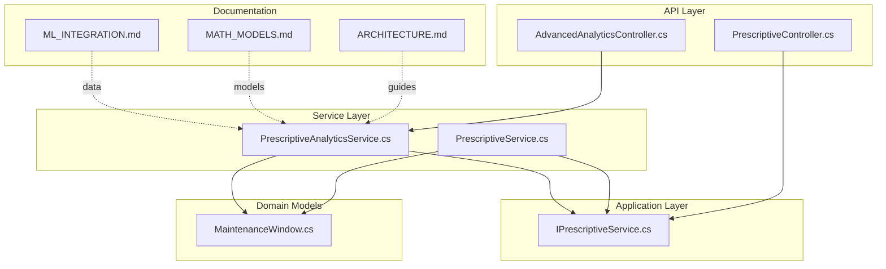
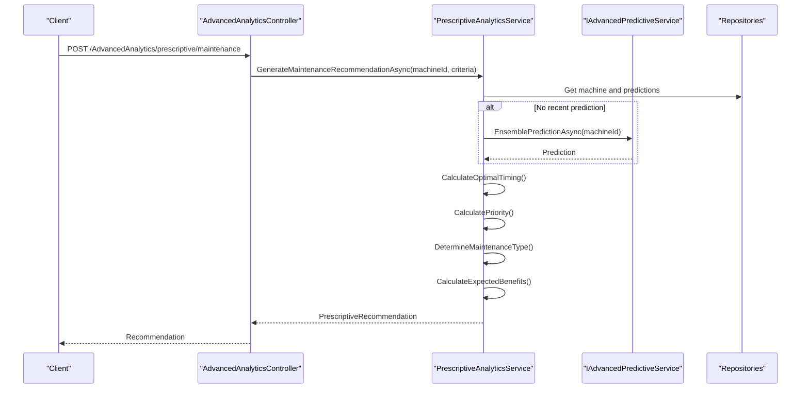
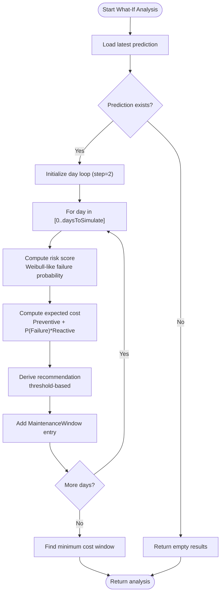
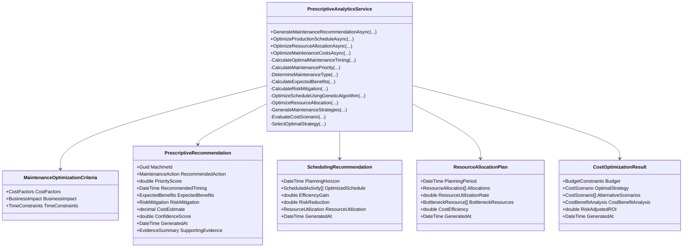
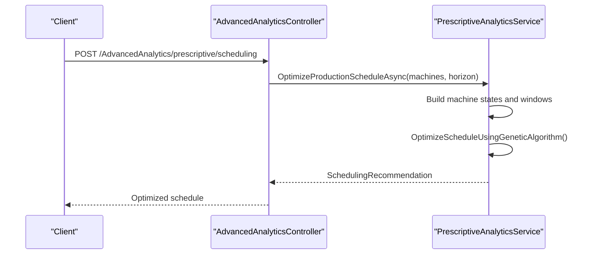
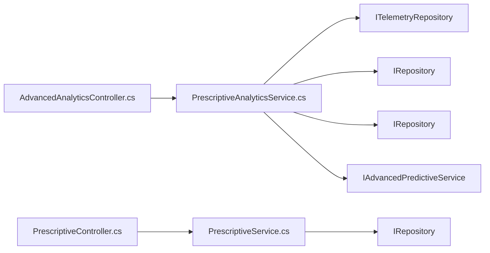

# Prescriptive Analytics

<cite>
**Referenced Files in This Document**
- [PrescriptiveController.cs](file://src/api/DigitalTwinPlatform.API/Controllers/PrescriptiveController.cs)
- [PrescriptiveService.cs](file://src/api/DigitalTwinPlatform.API/Services/Maintenance/PrescriptiveService.cs)
- [IPrescriptiveService.cs](file://src/api/DigitalTwinPlatform.Application/Maintenance/IPrescriptiveService.cs)
- [PrescriptiveAnalyticsService.cs](file://src/api/DigitalTwinPlatform.API/Services/Analytics/Advanced/PrescriptiveAnalyticsService.cs)
- [AdvancedAnalyticsController.cs](file://src/api/DigitalTwinPlatform.API/Controllers/AdvancedAnalyticsController.cs)
- [MaintenanceWindow.cs](file://src/api/DigitalTwinPlatform.Domain/ValueObjects/MaintenanceWindow.cs)
- [ARCHITECTURE.md](file://docs/ARCHITECTURE.md)
- [MATH_MODELS.md](file://docs/MATH_MODELS.md)
- [ML_INTEGRATION.md](file://docs/ML_INTEGRATION.md)
</cite>

## Table of Contents
1. [Introduction](#introduction)
2. [Project Structure](#project-structure)
3. [Core Components](#core-components)
4. [Architecture Overview](#architecture-overview)
5. [Detailed Component Analysis](#detailed-component-analysis)
6. [Dependency Analysis](#dependency-analysis)
7. [Performance Considerations](#performance-considerations)
8. [Troubleshooting Guide](#troubleshooting-guide)
9. [Conclusion](#conclusion)
10. [Appendices](#appendices)

## Introduction
This document explains the prescriptive analytics system for maintenance optimization. It covers:
- Maintenance optimization algorithms and decision workflows
- What-if scenario analysis and recommendation generation
- Optimization models, cost-risk analysis, and decision metrics
- Configuration options, optimization parameters, and business rule integration
- Relationships with predictive analytics, mathematical modeling, and operational constraints
- Uncertainty quantification, sensitivity analysis, and multi-objective optimization approaches

The system provides two complementary layers:
- A lightweight, controller-driven what-if analyzer for immediate insights
- An advanced analytics service implementing optimization models, scheduling, resource allocation, and cost-risk analysis

## Project Structure
The prescriptive analytics capabilities are implemented across controllers, services, domain models, and supporting documentation.

**Diagram sources**
- [PrescriptiveController.cs](file://src/api/DigitalTwinPlatform.API/Controllers/PrescriptiveController.cs#L1-L32)
- [AdvancedAnalyticsController.cs](file://src/api/DigitalTwinPlatform.API/Controllers/AdvancedAnalyticsController.cs#L166-L236)
- [IPrescriptiveService.cs](file://src/api/DigitalTwinPlatform.Application/Maintenance/IPrescriptiveService.cs#L1-L10)
- [PrescriptiveService.cs](file://src/api/DigitalTwinPlatform.API/Services/Maintenance/PrescriptiveService.cs#L1-L79)
- [PrescriptiveAnalyticsService.cs](file://src/api/DigitalTwinPlatform.API/Services/Analytics/Advanced/PrescriptiveAnalyticsService.cs#L1-L1084)
- [MaintenanceWindow.cs](file://src/api/DigitalTwinPlatform.Domain/ValueObjects/MaintenanceWindow.cs#L1-L18)
- [ARCHITECTURE.md](file://docs/ARCHITECTURE.md)
- [MATH_MODELS.md](file://docs/MATH_MODELS.md)
- [ML_INTEGRATION.md](file://docs/ML_INTEGRATION.md)

**Section sources**
- [PrescriptiveController.cs](file://src/api/DigitalTwinPlatform.API/Controllers/PrescriptiveController.cs#L1-L32)
- [AdvancedAnalyticsController.cs](file://src/api/DigitalTwinPlatform.API/Controllers/AdvancedAnalyticsController.cs#L166-L236)
- [PrescriptiveService.cs](file://src/api/DigitalTwinPlatform.API/Services/Maintenance/PrescriptiveService.cs#L1-L79)
- [PrescriptiveAnalyticsService.cs](file://src/api/DigitalTwinPlatform.API/Services/Analytics/Advanced/PrescriptiveAnalyticsService.cs#L1-L1084)
- [MaintenanceWindow.cs](file://src/api/DigitalTwinPlatform.Domain/ValueObjects/MaintenanceWindow.cs#L1-L18)

## Core Components
- Lightweight what-if analyzer:
  - Endpoint: GET api/Prescriptive/{machineId}/analysis
  - Returns a series of MaintenanceWindow entries representing scheduled dates, estimated costs, risk scores, and recommendations across a simulation horizon
  - Computes risk via a Weibull-like failure probability and balances preventive and reactive costs
- Advanced prescriptive analytics service:
  - Generates maintenance recommendations with priority, timing, benefits, and confidence
  - Optimizes production schedules using a genetic algorithm
  - Allocates resources using a greedy linear-programming-inspired approach
  - Performs cost optimization across strategies with risk-adjusted ROI and sensitivity analysis

Key data models:
- MaintenanceWindow: encapsulates scheduled date, estimated cost, risk score, and recommendation
- PrescriptiveRecommendation: recommendation payload with benefits, risk mitigation, and evidence summary
- SchedulingRecommendation: optimized schedule with efficiency gain and risk reduction
- ResourceAllocationPlan: allocation of resources with bottleneck identification
- CostOptimizationResult: strategy selection with cost-benefit analysis and sensitivity metrics

**Section sources**
- [PrescriptiveController.cs](file://src/api/DigitalTwinPlatform.API/Controllers/PrescriptiveController.cs#L18-L30)
- [PrescriptiveService.cs](file://src/api/DigitalTwinPlatform.API/Services/Maintenance/PrescriptiveService.cs#L27-L79)
- [PrescriptiveAnalyticsService.cs](file://src/api/DigitalTwinPlatform.API/Services/Analytics/Advanced/PrescriptiveAnalyticsService.cs#L63-L162)
- [MaintenanceWindow.cs](file://src/api/DigitalTwinPlatform.Domain/ValueObjects/MaintenanceWindow.cs#L3-L17)

## Architecture Overview
The prescriptive analytics system integrates with predictive analytics and mathematical modeling to produce actionable recommendations.

**Diagram sources**
- [AdvancedAnalyticsController.cs](file://src/api/DigitalTwinPlatform.API/Controllers/AdvancedAnalyticsController.cs#L140-L165)
- [PrescriptiveAnalyticsService.cs](file://src/api/DigitalTwinPlatform.API/Services/Analytics/Advanced/PrescriptiveAnalyticsService.cs#L63-L162)

## Detailed Component Analysis

### Lightweight What-If Analyzer
Purpose:
- Provide fast, scenario-based maintenance planning over a configurable horizon
- Compute risk scores and expected costs for preventive actions across days

Processing logic:
- Fetches the latest prediction for a machine
- Iterates days up to a simulation horizon, incrementing by fixed steps
- Computes risk using a Weibull-like failure probability curve parameterized by remaining useful life
- Balances preventive and reactive costs to estimate expected cost
- Produces MaintenanceWindow entries with recommendations derived from thresholds

**Diagram sources**
- [PrescriptiveService.cs](file://src/api/DigitalTwinPlatform.API/Services/Maintenance/PrescriptiveService.cs#L27-L79)

**Section sources**
- [PrescriptiveController.cs](file://src/api/DigitalTwinPlatform.API/Controllers/PrescriptiveController.cs#L18-L23)
- [PrescriptiveService.cs](file://src/api/DigitalTwinPlatform.API/Services/Maintenance/PrescriptiveService.cs#L27-L79)
- [MaintenanceWindow.cs](file://src/api/DigitalTwinPlatform.Domain/ValueObjects/MaintenanceWindow.cs#L3-L17)

### Advanced Prescriptive Analytics Service
Overview:
- Generates maintenance recommendations integrating predictive signals, business impact, and criticality
- Optimizes production schedules using a genetic algorithm
- Allocates resources using a greedy assignment with capacity checks
- Evaluates cost scenarios with risk-adjusted ROI and sensitivity analysis

Key algorithms and models:
- Optimal maintenance timing: economic life model balancing maintenance and failure costs
- Priority scoring: weighted combination of failure probability, urgency, criticality, and business impact
- Maintenance type determination: classification-based rules across health status, failure probability, and remaining useful life
- Benefits estimation: downtime avoidance, revenue protection, safety improvement, and equipment life extension
- Risk mitigation: quantified reductions across failure, safety, environmental, and operational risks
- Scheduling optimization: genetic algorithm fitness combining criticality and risk minimization
- Resource allocation: greedy assignment prioritizing available resources and capacity thresholds
- Cost optimization: scenario generation, evaluation, and selection with risk-adjusted ROI and sensitivity analysis

**Diagram sources**
- [PrescriptiveAnalyticsService.cs](file://src/api/DigitalTwinPlatform.API/Services/Analytics/Advanced/PrescriptiveAnalyticsService.cs#L41-L869)
- [PrescriptiveAnalyticsService.cs](file://src/api/DigitalTwinPlatform.API/Services/Analytics/Advanced/PrescriptiveAnalyticsService.cs#L871-L1084)

**Section sources**
- [PrescriptiveAnalyticsService.cs](file://src/api/DigitalTwinPlatform.API/Services/Analytics/Advanced/PrescriptiveAnalyticsService.cs#L63-L314)
- [PrescriptiveAnalyticsService.cs](file://src/api/DigitalTwinPlatform.API/Services/Analytics/Advanced/PrescriptiveAnalyticsService.cs#L316-L869)
- [PrescriptiveAnalyticsService.cs](file://src/api/DigitalTwinPlatform.API/Services/Analytics/Advanced/PrescriptiveAnalyticsService.cs#L871-L1084)

### Decision Support Workflows
- Maintenance recommendation workflow:
  - Load machine and latest prediction
  - Derive criticality from machine properties
  - Compute optimal timing, priority, maintenance type, and expected benefits
  - Aggregate risk mitigation and confidence metrics
- Production scheduling workflow:
  - Collect machine states and predictions
  - Generate maintenance windows for high-risk machines
  - Evolve schedules using genetic algorithm fitness
  - Report efficiency gains and risk reductions
- Resource allocation workflow:
  - Compute maintenance requirements per machine
  - Allocate available resources greedily respecting capacity
  - Identify bottlenecks and compute utilization rates
- Cost optimization workflow:
  - Generate maintenance strategies
  - Evaluate scenarios by cost and benefit
  - Select optimal strategy with risk-adjusted ROI and sensitivity analysis

**Diagram sources**
- [AdvancedAnalyticsController.cs](file://src/api/DigitalTwinPlatform.API/Controllers/AdvancedAnalyticsController.cs#L166-L186)
- [PrescriptiveAnalyticsService.cs](file://src/api/DigitalTwinPlatform.API/Services/Analytics/Advanced/PrescriptiveAnalyticsService.cs#L164-L235)

**Section sources**
- [AdvancedAnalyticsController.cs](file://src/api/DigitalTwinPlatform.API/Controllers/AdvancedAnalyticsController.cs#L166-L236)
- [PrescriptiveAnalyticsService.cs](file://src/api/DigitalTwinPlatform.API/Services/Analytics/Advanced/PrescriptiveAnalyticsService.cs#L164-L235)

### Configuration Options and Business Rule Integration
- Cost factors:
  - Preventive cost multiplier, failure cost multiplier, downtime cost per hour
- Business impact:
  - Revenue impact, safety impact, environmental impact
- Time constraints:
  - Earliest start, latest completion, preferred windows
- Machine criticality:
  - Read from machine properties; defaults applied if missing
- Maintenance actions:
  - Determined by health classification, failure probability, and remaining useful life thresholds

These parameters influence recommendation priority, timing, and strategy selection.

**Section sources**
- [PrescriptiveAnalyticsService.cs](file://src/api/DigitalTwinPlatform.API/Services/Analytics/Advanced/PrescriptiveAnalyticsService.cs#L873-L899)
- [PrescriptiveAnalyticsService.cs](file://src/api/DigitalTwinPlatform.API/Services/Analytics/Advanced/PrescriptiveAnalyticsService.cs#L318-L347)
- [PrescriptiveAnalyticsService.cs](file://src/api/DigitalTwinPlatform.API/Services/Analytics/Advanced/PrescriptiveAnalyticsService.cs#L349-L361)

### Relationship with Predictive Analytics, Mathematical Modeling, and Operational Constraints
- Predictive analytics:
  - Uses predictions for remaining useful life, failure probability, and health status
  - Falls back to ensemble prediction when recent predictions are unavailable
- Mathematical modeling:
  - Economic life optimization for timing
  - Genetic algorithm for scheduling fitness
  - Linear-programming-inspired greedy allocation
- Operational constraints:
  - Criticality and time windows guide scheduling and resource allocation
- Documentation alignment:
  - Architecture, math models, and ML integration guides inform implementation choices

**Section sources**
- [PrescriptiveAnalyticsService.cs](file://src/api/DigitalTwinPlatform.API/Services/Analytics/Advanced/PrescriptiveAnalyticsService.cs#L70-L95)
- [MATH_MODELS.md](file://docs/MATH_MODELS.md)
- [ML_INTEGRATION.md](file://docs/ML_INTEGRATION.md)
- [ARCHITECTURE.md](file://docs/ARCHITECTURE.md)

### Uncertainty Quantification, Sensitivity Analysis, and Multi-Objective Optimization
- Uncertainty quantification:
  - Evidence summary includes prediction confidence, data quality, and model accuracy
  - Confidence score embedded in recommendations
- Sensitivity analysis:
  - Variance and stability metrics for ROI across scenarios
  - Opportunity cost and break-even point computation
- Multi-objective optimization:
  - Scheduling fitness balances criticality and risk reduction
  - Resource allocation considers technician and equipment utilization
  - Cost optimization balances ROI and budget utilization with risk adjustments

**Section sources**
- [PrescriptiveAnalyticsService.cs](file://src/api/DigitalTwinPlatform.API/Services/Analytics/Advanced/PrescriptiveAnalyticsService.cs#L149-L156)
- [PrescriptiveAnalyticsService.cs](file://src/api/DigitalTwinPlatform.API/Services/Analytics/Advanced/PrescriptiveAnalyticsService.cs#L828-L866)
- [PrescriptiveAnalyticsService.cs](file://src/api/DigitalTwinPlatform.API/Services/Analytics/Advanced/PrescriptiveAnalyticsService.cs#L446-L487)
- [PrescriptiveAnalyticsService.cs](file://src/api/DigitalTwinPlatform.API/Services/Analytics/Advanced/PrescriptiveAnalyticsService.cs#L625-L624)

## Dependency Analysis
The advanced service depends on repositories, predictive services, and logging. The lightweight service depends on prediction repositories and logging.

**Diagram sources**
- [PrescriptiveAnalyticsService.cs](file://src/api/DigitalTwinPlatform.API/Services/Analytics/Advanced/PrescriptiveAnalyticsService.cs#L49-L61)
- [PrescriptiveService.cs](file://src/api/DigitalTwinPlatform.API/Services/Maintenance/PrescriptiveService.cs#L11-L25)
- [AdvancedAnalyticsController.cs](file://src/api/DigitalTwinPlatform.API/Controllers/AdvancedAnalyticsController.cs#L166-L186)
- [PrescriptiveController.cs](file://src/api/DigitalTwinPlatform.API/Controllers/PrescriptiveController.cs#L18-L30)

**Section sources**
- [PrescriptiveAnalyticsService.cs](file://src/api/DigitalTwinPlatform.API/Services/Analytics/Advanced/PrescriptiveAnalyticsService.cs#L49-L61)
- [PrescriptiveService.cs](file://src/api/DigitalTwinPlatform.API/Services/Maintenance/PrescriptiveService.cs#L11-L25)

## Performance Considerations
- What-if analysis:
  - Linear iteration over days; keep horizon reasonable for responsiveness
  - Risk and cost computations are O(1) per step
- Advanced analytics:
  - Genetic algorithm scales with population size and generations; tune parameters for latency vs. quality
  - Greedy resource allocation is O(N) per requirement; ensure bounded planning periods
  - Cost scenario evaluation aggregates across machines; limit strategy sets for large fleets
- Recommendations:
  - Confidence and evidence summaries provide transparency; avoid heavy computations in hot paths

[No sources needed since this section provides general guidance]

## Troubleshooting Guide
Common issues and mitigations:
- Missing machine or prediction:
  - Ensure machine exists and recent predictions are available; fallback to ensemble prediction
- Unexpected zero results:
  - Verify simulation horizon and prediction validity; confirm risk and cost calculations
- Poor schedule quality:
  - Adjust genetic algorithm parameters (population, generations) and fitness weights
- Resource bottlenecks:
  - Review bottleneck identification and adjust available resource capacities
- Cost optimization instability:
  - Validate budget constraints and sensitivity analysis thresholds

**Section sources**
- [PrescriptiveAnalyticsService.cs](file://src/api/DigitalTwinPlatform.API/Services/Analytics/Advanced/PrescriptiveAnalyticsService.cs#L70-L95)
- [PrescriptiveAnalyticsService.cs](file://src/api/DigitalTwinPlatform.API/Services/Analytics/Advanced/PrescriptiveAnalyticsService.cs#L446-L487)
- [PrescriptiveAnalyticsService.cs](file://src/api/DigitalTwinPlatform.API/Services/Analytics/Advanced/PrescriptiveAnalyticsService.cs#L625-L739)
- [PrescriptiveAnalyticsService.cs](file://src/api/DigitalTwinPlatform.API/Services/Analytics/Advanced/PrescriptiveAnalyticsService.cs#L819-L826)

## Conclusion
The prescriptive analytics system combines lightweight what-if analysis with advanced optimization models to support data-driven maintenance decisions. It integrates predictive signals, business rules, and operational constraints to deliver recommendations, schedules, and cost-risk analyses. By tuning configuration parameters and leveraging uncertainty quantification and sensitivity analysis, teams can balance reliability, cost, and operational efficiency.

[No sources needed since this section summarizes without analyzing specific files]

## Appendices

### API Endpoints and Payloads
- What-if analysis:
  - GET api/Prescriptive/{machineId}/analysis?days={N}
  - Returns list of MaintenanceWindow entries
- Optimal maintenance date:
  - GET api/Prescriptive/{machineId}/optimal
  - Returns single MaintenanceWindow
- Advanced analytics:
  - POST /AdvancedAnalytics/prescriptive/maintenance with MaintenanceOptimizationCriteria
  - POST /AdvancedAnalytics/prescriptive/scheduling with SchedulingOptimizationRequest
  - POST /AdvancedAnalytics/prescriptive/resource-allocation with ResourceAllocationRequest
  - POST /AdvancedAnalytics/prescriptive/cost-optimization with CostOptimizationRequest

**Section sources**
- [PrescriptiveController.cs](file://src/api/DigitalTwinPlatform.API/Controllers/PrescriptiveController.cs#L18-L30)
- [AdvancedAnalyticsController.cs](file://src/api/DigitalTwinPlatform.API/Controllers/AdvancedAnalyticsController.cs#L140-L236)