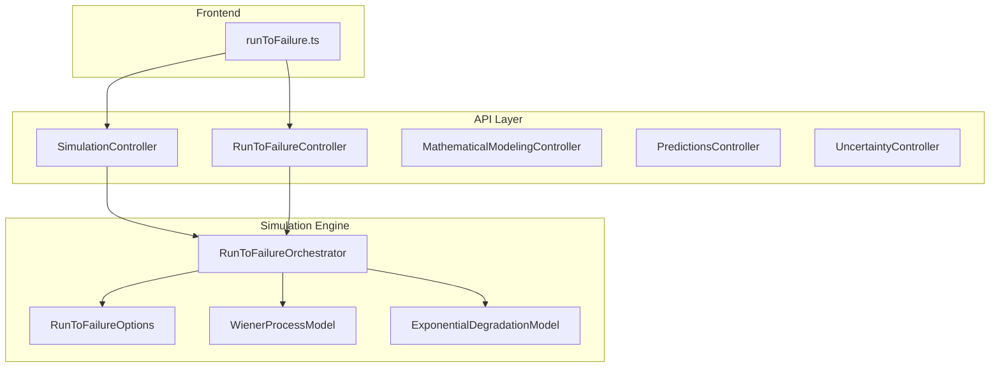
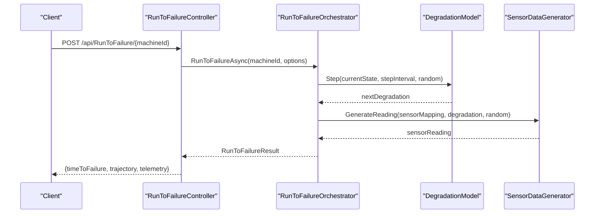
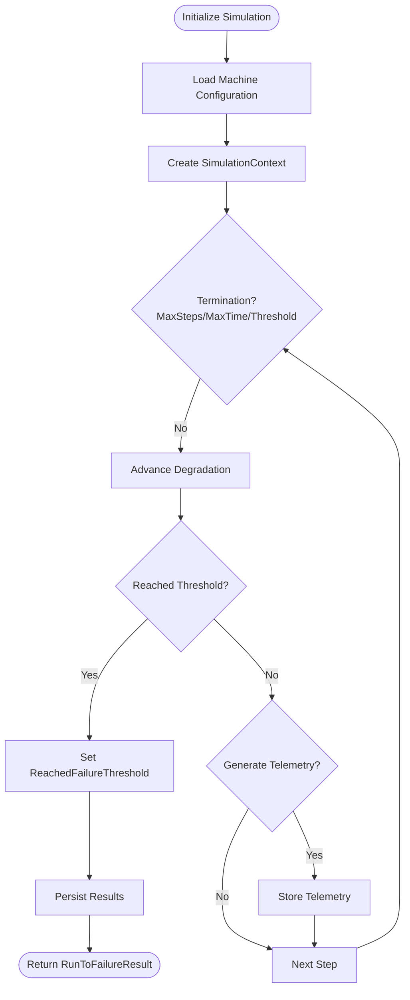
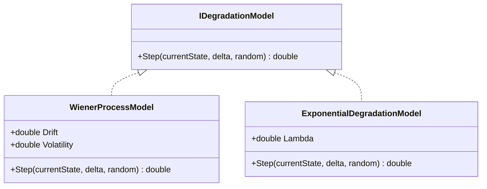
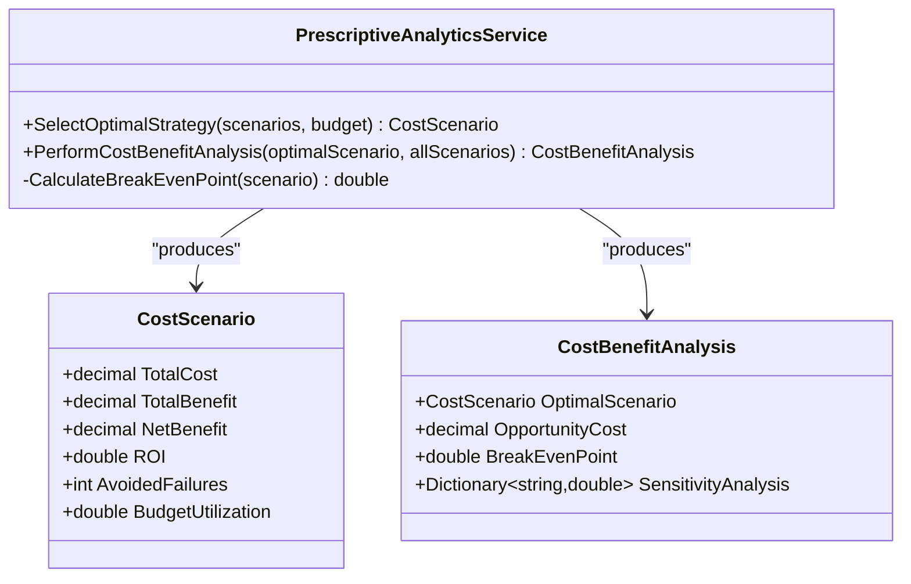
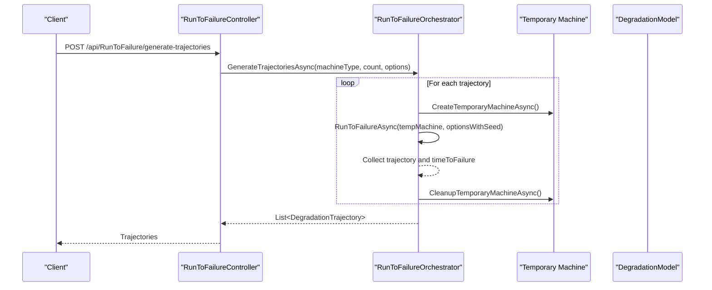
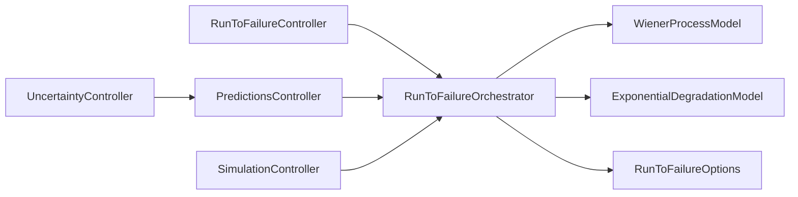

# Scenario Analysis and What-if Simulation

<cite>
**Referenced Files in This Document**
- [SimulationController.cs](file://src/api/DigitalTwinPlatform.API/Controllers/SimulationController.cs)
- [RunToFailureController.cs](file://src/api/DigitalTwinPlatform.API/Controllers/RunToFailureController.cs)
- [RunToFailureOrchestrator.cs](file://src/api/DigitalTwinPlatform.API/Services/Simulation/RunToFailureOrchestrator.cs)
- [RunToFailureOptions.cs](file://src/api/DigitalTwinPlatform.API/Services/Simulation/RunToFailureOptions.cs)
- [WienerProcessModel.cs](file://src/api/DigitalTwinPlatform.API/Services/Simulation/DegradationModels/WienerProcessModel.cs)
- [ExponentialDegradationModel.cs](file://src/api/DigitalTwinPlatform.API/Services/Simulation/DegradationModels/ExponentialDegradationModel.cs)
- [MathematicalModelingController.cs](file://src/api/DigitalTwinPlatform.API/Controllers/MathematicalModelingController.cs)
- [PredictionsController.cs](file://src/api/DigitalTwinPlatform.API/Controllers/PredictionsController.cs)
- [UncertaintyController.cs](file://src/api/DigitalTwinPlatform.API/Controllers/UncertaintyController.cs)
- [PrescriptiveAnalyticsService.cs](file://src/api/DigitalTwinPlatform.API/Services/Analytics/Advanced/PrescriptiveAnalyticsService.cs)
- [runToFailure.ts](file://src/frontend/src/services/runToFailure.ts)
- [SimulationIntegrationTests.cs](file://src/api/DigitalTwinPlatform.Tests/Integration/SimulationIntegrationTests.cs)
- [spec.md](file://specs/1-predictive-maintenance/spec.md)
</cite>

## Table of Contents
1. [Introduction](#introduction)
2. [Project Structure](#project-structure)
3. [Core Components](#core-components)
4. [Architecture Overview](#architecture-overview)
5. [Detailed Component Analysis](#detailed-component-analysis)
6. [Dependency Analysis](#dependency-analysis)
7. [Performance Considerations](#performance-considerations)
8. [Troubleshooting Guide](#troubleshooting-guide)
9. [Conclusion](#conclusion)
10. [Appendices](#appendices)

## Introduction
This document explains the scenario analysis and what-if simulation capabilities of the platform, focusing on day-by-day simulation methodology, risk probability modeling, and cost projection algorithms. It documents simulation parameters, time horizon configuration, scenario generation processes, and how predictive maintenance insights integrate into scenario planning. Practical examples illustrate evaluation of maintenance strategies, modeling of failure scenarios, and comparison of decision alternatives. The document also covers API endpoints for scenario execution, result interpretation, visualization requirements, uncertainty quantification, sensitivity analysis, Monte Carlo simulation, and the influence of real-time data feeds on simulation outcomes.

## Project Structure
The scenario analysis and simulation features span the API controllers, simulation orchestration services, degradation models, and frontend services. The controllers expose endpoints for simulation lifecycle management and results retrieval. The orchestrator coordinates degradation models, telemetry generation, and trajectory recording. Degradation models define the stochastic processes used for failure simulation. Frontend services encapsulate client-side consumption of simulation APIs.

**Diagram sources**
- [SimulationController.cs](file://src/api/DigitalTwinPlatform.API/Controllers/SimulationController.cs#L1-L140)
- [RunToFailureController.cs](file://src/api/DigitalTwinPlatform.API/Controllers/RunToFailureController.cs#L1-L122)
- [RunToFailureOrchestrator.cs](file://src/api/DigitalTwinPlatform.API/Services/Simulation/RunToFailureOrchestrator.cs#L1-L502)
- [RunToFailureOptions.cs](file://src/api/DigitalTwinPlatform.API/Services/Simulation/RunToFailureOptions.cs#L1-L40)
- [WienerProcessModel.cs](file://src/api/DigitalTwinPlatform.API/Services/Simulation/DegradationModels/WienerProcessModel.cs#L1-L23)
- [ExponentialDegradationModel.cs](file://src/api/DigitalTwinPlatform.API/Services/Simulation/DegradationModels/ExponentialDegradationModel.cs#L1-L16)
- [runToFailure.ts](file://src/frontend/src/services/runToFailure.ts#L1-L41)

**Section sources**
- [SimulationController.cs](file://src/api/DigitalTwinPlatform.API/Controllers/SimulationController.cs#L1-L140)
- [RunToFailureController.cs](file://src/api/DigitalTwinPlatform.API/Controllers/RunToFailureController.cs#L1-L122)
- [RunToFailureOrchestrator.cs](file://src/api/DigitalTwinPlatform.API/Services/Simulation/RunToFailureOrchestrator.cs#L1-L502)
- [RunToFailureOptions.cs](file://src/api/DigitalTwinPlatform.API/Services/Simulation/RunToFailureOptions.cs#L1-L40)
- [WienerProcessModel.cs](file://src/api/DigitalTwinPlatform.API/Services/Simulation/DegradationModels/WienerProcessModel.cs#L1-L23)
- [ExponentialDegradationModel.cs](file://src/api/DigitalTwinPlatform.API/Services/Simulation/DegradationModels/ExponentialDegradationModel.cs#L1-L16)
- [runToFailure.ts](file://src/frontend/src/services/runToFailure.ts#L1-L41)

## Core Components
- Simulation lifecycle management: creation, execution, pause/resume, cancellation, listing, and status queries.
- Run-to-failure simulation: configurable time horizons, step sizes, failure thresholds, and telemetry generation.
- Degradation models: Wiener process and exponential degradation for stochastic failure simulation.
- Trajectory generation: batch generation of multiple failure trajectories for uncertainty analysis.
- Predictive maintenance integration: RUL predictions, health classification, and anomaly detection inform scenario inputs.
- Uncertainty quantification: risk scoring combining remaining useful life, uncertainty level, and model confidence.
- Prescriptive analytics: cost-benefit analysis, break-even calculations, and sensitivity analysis for maintenance strategies.

**Section sources**
- [SimulationController.cs](file://src/api/DigitalTwinPlatform.API/Controllers/SimulationController.cs#L16-L140)
- [RunToFailureController.cs](file://src/api/DigitalTwinPlatform.API/Controllers/RunToFailureController.cs#L23-L113)
- [RunToFailureOrchestrator.cs](file://src/api/DigitalTwinPlatform.API/Services/Simulation/RunToFailureOrchestrator.cs#L43-L147)
- [RunToFailureOptions.cs](file://src/api/DigitalTwinPlatform.API/Services/Simulation/RunToFailureOptions.cs#L3-L11)
- [WienerProcessModel.cs](file://src/api/DigitalTwinPlatform.API/Services/Simulation/DegradationModels/WienerProcessModel.cs#L3-L22)
- [ExponentialDegradationModel.cs](file://src/api/DigitalTwinPlatform.API/Services/Simulation/DegradationModels/ExponentialDegradationModel.cs#L3-L15)
- [PredictionsController.cs](file://src/api/DigitalTwinPlatform.API/Controllers/PredictionsController.cs#L39-L120)
- [UncertaintyController.cs](file://src/api/DigitalTwinPlatform.API/Controllers/UncertaintyController.cs#L307-L327)
- [PrescriptiveAnalyticsService.cs](file://src/api/DigitalTwinPlatform.API/Services/Analytics/Advanced/PrescriptiveAnalyticsService.cs#L819-L839)

## Architecture Overview
The simulation architecture separates concerns across controllers, orchestration, domain services, and models. Controllers expose REST endpoints for simulation management and results. The orchestrator initializes simulation contexts, advances degradation models, generates telemetry, records trajectories, and persists results when configured. Degradation models encapsulate stochastic processes. Predictive analytics and uncertainty controllers supply probabilistic inputs and risk assessments.

**Diagram sources**
- [RunToFailureController.cs](file://src/api/DigitalTwinPlatform.API/Controllers/RunToFailureController.cs#L26-L51)
- [RunToFailureOrchestrator.cs](file://src/api/DigitalTwinPlatform.API/Services/Simulation/RunToFailureOrchestrator.cs#L98-L147)
- [WienerProcessModel.cs](file://src/api/DigitalTwinPlatform.API/Services/Simulation/DegradationModels/WienerProcessModel.cs#L8-L13)
- [ExponentialDegradationModel.cs](file://src/api/DigitalTwinPlatform.API/Services/Simulation/DegradationModels/ExponentialDegradationModel.cs#L7-L14)

## Detailed Component Analysis

### Day-by-Day Simulation Methodology
The simulation advances degradation state at each step, checking termination conditions and optionally generating telemetry and storing snapshots. The step interval controls daily/minute-level resolution, and maximum steps or elapsed time cap the simulation duration.

**Diagram sources**
- [RunToFailureOrchestrator.cs](file://src/api/DigitalTwinPlatform.API/Services/Simulation/RunToFailureOrchestrator.cs#L61-L147)
- [RunToFailureOptions.cs](file://src/api/DigitalTwinPlatform.API/Services/Simulation/RunToFailureOptions.cs#L3-L11)

**Section sources**
- [RunToFailureOrchestrator.cs](file://src/api/DigitalTwinPlatform.API/Services/Simulation/RunToFailureOrchestrator.cs#L98-L147)
- [RunToFailureOptions.cs](file://src/api/DigitalTwinPlatform.API/Services/Simulation/RunToFailureOptions.cs#L3-L11)

### Risk Probability Modeling Using Degradation Models
Two degradation models are implemented:
- Wiener process: drift and volatility parameters drive linear and diffusive degradation with normally distributed noise.
- Exponential degradation: decay parameter governs growth with small additive noise.

These models underpin failure probability estimation by simulating many trajectories and computing empirical failure times.

**Diagram sources**
- [WienerProcessModel.cs](file://src/api/DigitalTwinPlatform.API/Services/Simulation/DegradationModels/WienerProcessModel.cs#L3-L22)
- [ExponentialDegradationModel.cs](file://src/api/DigitalTwinPlatform.API/Services/Simulation/DegradationModels/ExponentialDegradationModel.cs#L3-L15)

**Section sources**
- [WienerProcessModel.cs](file://src/api/DigitalTwinPlatform.API/Services/Simulation/DegradationModels/WienerProcessModel.cs#L3-L22)
- [ExponentialDegradationModel.cs](file://src/api/DigitalTwinPlatform.API/Services/Simulation/DegradationModels/ExponentialDegradationModel.cs#L3-L15)

### Cost Projection Algorithms and Prescriptive Analytics
Prescriptive analytics computes cost scenarios, selects optimal strategies considering budget constraints, and performs cost-benefit analysis including break-even and sensitivity analysis. These outputs enable comparison of maintenance strategies under uncertainty.

**Diagram sources**
- [PrescriptiveAnalyticsService.cs](file://src/api/DigitalTwinPlatform.API/Services/Analytics/Advanced/PrescriptiveAnalyticsService.cs#L819-L839)
- [PrescriptiveAnalyticsService.cs](file://src/api/DigitalTwinPlatform.API/Services/Analytics/Advanced/PrescriptiveAnalyticsService.cs#L1068-L1082)

**Section sources**
- [PrescriptiveAnalyticsService.cs](file://src/api/DigitalTwinPlatform.API/Services/Analytics/Advanced/PrescriptiveAnalyticsService.cs#L819-L839)
- [PrescriptiveAnalyticsService.cs](file://src/api/DigitalTwinPlatform.API/Services/Analytics/Advanced/PrescriptiveAnalyticsService.cs#L1068-L1082)

### Scenario Generation Processes
Multiple failure trajectories are generated by varying random seeds per trajectory. Each trajectory captures degradation snapshots and time-to-failure, enabling empirical risk assessment and Monte Carlo-style projections.

**Diagram sources**
- [RunToFailureController.cs](file://src/api/DigitalTwinPlatform.API/Controllers/RunToFailureController.cs#L56-L85)
- [RunToFailureOrchestrator.cs](file://src/api/DigitalTwinPlatform.API/Services/Simulation/RunToFailureOrchestrator.cs#L317-L370)
- [RunToFailureOrchestrator.cs](file://src/api/DigitalTwinPlatform.API/Services/Simulation/RunToFailureOrchestrator.cs#L393-L443)

**Section sources**
- [RunToFailureController.cs](file://src/api/DigitalTwinPlatform.API/Controllers/RunToFailureController.cs#L56-L85)
- [RunToFailureOrchestrator.cs](file://src/api/DigitalTwinPlatform.API/Services/Simulation/RunToFailureOrchestrator.cs#L317-L370)
- [RunToFailureOrchestrator.cs](file://src/api/DigitalTwinPlatform.API/Services/Simulation/RunToFailureOrchestrator.cs#L393-L443)

### API Endpoints for Scenario Execution and Results
- Create simulation: POST /api/simulation
- Get simulation state: GET /api/simulation/{id}
- Run simulation: POST /api/simulation/{id}/run
- Pause/resume/cancel: POST /api/simulation/{id}/pause, POST /api/simulation/{id}/resume, POST /api/simulation/{id}/cancel
- List simulations: GET /api/simulation
- Get simulation status: GET /api/simulation/status/{machineId}, GET /api/simulation/status
- Run-to-failure single: POST /api/RunToFailure/{machineId}
- Generate trajectories: POST /api/RunToFailure/generate-trajectories
- Retrieve results: GET /api/RunToFailure/{machineId}/results

**Section sources**
- [SimulationController.cs](file://src/api/DigitalTwinPlatform.API/Controllers/SimulationController.cs#L16-L140)
- [RunToFailureController.cs](file://src/api/DigitalTwinPlatform.API/Controllers/RunToFailureController.cs#L26-L113)

### Practical Examples: Evaluating Maintenance Strategies and Failure Scenarios
- Single-run scenario: Configure degradation model parameters and run-to-failure to estimate time-to-failure and trajectory.
- Batch Monte Carlo scenario: Generate multiple trajectories to quantify uncertainty in failure timing and assess risk.
- Prescriptive comparison: Define cost scenarios for different maintenance policies, compute ROI and break-even, and select the optimal within budget constraints.

**Section sources**
- [RunToFailureController.cs](file://src/api/DigitalTwinPlatform.API/Controllers/RunToFailureController.cs#L26-L51)
- [RunToFailureOrchestrator.cs](file://src/api/DigitalTwinPlatform.API/Services/Simulation/RunToFailureOrchestrator.cs#L317-L370)
- [PrescriptiveAnalyticsService.cs](file://src/api/DigitalTwinPlatform.API/Services/Analytics/Advanced/PrescriptiveAnalyticsService.cs#L819-L839)

### Simulation Parameters and Time Horizon Configuration
Key parameters include:
- MaxSimulationTime: upper bound on elapsed simulation time
- MaxSteps: maximum number of steps
- StepInterval: time between steps (e.g., minutes)
- GenerateTelemetry: whether to produce sensor readings
- StoreTrajectory: whether to record snapshots
- RandomSeed: deterministic seeding for reproducibility

**Section sources**
- [RunToFailureOptions.cs](file://src/api/DigitalTwinPlatform.API/Services/Simulation/RunToFailureOptions.cs#L3-L11)

### Integration with Predictive Maintenance Insights
RUL predictions, health classifications, and anomaly detection feed scenario inputs:
- RUL predictions provide remaining useful life estimates and confidence intervals for risk modeling.
- Health classification yields status probabilities and contributing factors for scenario setup.
- Anomaly detection highlights unusual patterns that can adjust failure thresholds or maintenance triggers.

**Section sources**
- [PredictionsController.cs](file://src/api/DigitalTwinPlatform.API/Controllers/PredictionsController.cs#L39-L120)
- [PredictionsController.cs](file://src/api/DigitalTwinPlatform.API/Controllers/PredictionsController.cs#L332-L359)

### Uncertainty Quantification and Sensitivity Analysis
- Risk scoring combines remaining useful life, uncertainty level, and model confidence into a weighted risk metric.
- Sensitivity analysis is embedded in cost-benefit analysis to evaluate robustness of maintenance decisions across scenarios.

**Section sources**
- [UncertaintyController.cs](file://src/api/DigitalTwinPlatform.API/Controllers/UncertaintyController.cs#L307-L327)
- [PrescriptiveAnalyticsService.cs](file://src/api/DigitalTwinPlatform.API/Services/Analytics/Advanced/PrescriptiveAnalyticsService.cs#L832-L839)

### Monte Carlo Simulation Approaches
Monte Carlo is supported by generating multiple trajectories with distinct random seeds. Each trajectory represents a plausible failure pathway, enabling empirical distributions of time-to-failure and risk metrics.

**Section sources**
- [RunToFailureOrchestrator.cs](file://src/api/DigitalTwinPlatform.API/Services/Simulation/RunToFailureOrchestrator.cs#L317-L370)

### Real-Time Data Feeds Influence on Simulation Outcomes
Real-time telemetry influences scenario planning by:
- Updating current degradation states for dynamic simulations.
- Adjusting failure thresholds and maintenance triggers based on observed trends.
- Informing predictive models that feed into scenario parameters.

**Section sources**
- [PredictionsController.cs](file://src/api/DigitalTwinPlatform.API/Controllers/PredictionsController.cs#L39-L120)
- [MathematicalModelingController.cs](file://src/api/DigitalTwinPlatform.API/Controllers/MathematicalModelingController.cs#L27-L115)

## Dependency Analysis
The simulation subsystem exhibits clear separation of concerns with low coupling between controllers and orchestration logic. Degradation models are pluggable abstractions, and telemetry generation is decoupled via sensor generators.

**Diagram sources**
- [RunToFailureController.cs](file://src/api/DigitalTwinPlatform.API/Controllers/RunToFailureController.cs#L1-L122)
- [RunToFailureOrchestrator.cs](file://src/api/DigitalTwinPlatform.API/Services/Simulation/RunToFailureOrchestrator.cs#L1-L502)
- [WienerProcessModel.cs](file://src/api/DigitalTwinPlatform.API/Services/Simulation/DegradationModels/WienerProcessModel.cs#L1-L23)
- [ExponentialDegradationModel.cs](file://src/api/DigitalTwinPlatform.API/Services/Simulation/DegradationModels/ExponentialDegradationModel.cs#L1-L16)
- [RunToFailureOptions.cs](file://src/api/DigitalTwinPlatform.API/Services/Simulation/RunToFailureOptions.cs#L1-L40)
- [PredictionsController.cs](file://src/api/DigitalTwinPlatform.API/Controllers/PredictionsController.cs#L1-L435)
- [UncertaintyController.cs](file://src/api/DigitalTwinPlatform.API/Controllers/UncertaintyController.cs#L307-L327)
- [SimulationController.cs](file://src/api/DigitalTwinPlatform.API/Controllers/SimulationController.cs#L1-L140)

**Section sources**
- [RunToFailureController.cs](file://src/api/DigitalTwinPlatform.API/Controllers/RunToFailureController.cs#L1-L122)
- [RunToFailureOrchestrator.cs](file://src/api/DigitalTwinPlatform.API/Services/Simulation/RunToFailureOrchestrator.cs#L1-L502)
- [PredictionsController.cs](file://src/api/DigitalTwinPlatform.API/Controllers/PredictionsController.cs#L1-L435)
- [UncertaintyController.cs](file://src/api/DigitalTwinPlatform.API/Controllers/UncertaintyController.cs#L307-L327)
- [SimulationController.cs](file://src/api/DigitalTwinPlatform.API/Controllers/SimulationController.cs#L1-L140)

## Performance Considerations
- Step interval tuning trades accuracy for speed; shorter intervals increase fidelity but computational cost.
- Maximum steps and elapsed time caps prevent runaway simulations.
- Batch trajectory generation benefits from parallelization where repositories and persistence allow.
- Telemetry storage should be configured to avoid I/O bottlenecks during intensive simulations.

[No sources needed since this section provides general guidance]

## Troubleshooting Guide
Common issues and resolutions:
- Machine not found: Ensure the machine ID exists before starting simulations.
- Insufficient telemetry data: Predictions require a minimum number of recent telemetry points.
- Trajectory generation errors: Verify machine type configuration and random seed handling.
- Simulation termination: Check termination reasons (step limits, time limits, threshold reached).

**Section sources**
- [RunToFailureController.cs](file://src/api/DigitalTwinPlatform.API/Controllers/RunToFailureController.cs#L42-L50)
- [PredictionsController.cs](file://src/api/DigitalTwinPlatform.API/Controllers/PredictionsController.cs#L55-L59)
- [RunToFailureOrchestrator.cs](file://src/api/DigitalTwinPlatform.API/Services/Simulation/RunToFailureOrchestrator.cs#L67-L70)
- [RunToFailureOrchestrator.cs](file://src/api/DigitalTwinPlatform.API/Services/Simulation/RunToFailureOrchestrator.cs#L160-L174)

## Conclusion
The platform provides robust scenario analysis and what-if simulation capabilities centered on run-to-failure simulations with configurable time horizons, stochastic degradation models, and trajectory generation. Integration with predictive maintenance and uncertainty quantification enables informed decision-making. Prescriptive analytics supports cost-benefit comparisons and sensitivity analysis, while Monte Carlo approaches quantify risk across maintenance strategies. The documented APIs and parameters allow practical deployment of scenario planning workflows.

[No sources needed since this section summarizes without analyzing specific files]

## Appendices

### API Endpoint Reference
- POST /api/simulation: Create simulation with parameters and machine ID
- GET /api/simulation/{id}: Get simulation state
- POST /api/simulation/{id}/run: Execute simulation
- POST /api/simulation/{id}/pause: Pause simulation
- POST /api/simulation/{id}/resume: Resume simulation
- POST /api/simulation/{id}/cancel: Cancel simulation
- GET /api/simulation: List simulations for a machine
- GET /api/simulation/status/{machineId}: Get simulation status
- GET /api/simulation/status: Get all simulation statuses
- POST /api/RunToFailure/{machineId}: Run single run-to-failure simulation
- POST /api/RunToFailure/generate-trajectories: Generate multiple trajectories
- GET /api/RunToFailure/{machineId}/results: Retrieve stored results

**Section sources**
- [SimulationController.cs](file://src/api/DigitalTwinPlatform.API/Controllers/SimulationController.cs#L16-L140)
- [RunToFailureController.cs](file://src/api/DigitalTwinPlatform.API/Controllers/RunToFailureController.cs#L26-L113)

### Frontend Consumption Example
The frontend service demonstrates invoking run-to-failure endpoints and interpreting results such as failure probability, expected failure date, remaining useful life, confidence, risk factors, and recommended actions.

**Section sources**
- [runToFailure.ts](file://src/frontend/src/services/runToFailure.ts#L34-L41)

### Feature Requirements Alignment
The scenario analysis capabilities align with feature requirements emphasizing RUL prediction accuracy, real-time dashboards, synthetic data generation, mathematical modeling, and usability targets.

**Section sources**
- [spec.md](file://specs/1-predictive-maintenance/spec.md#L82-L122)