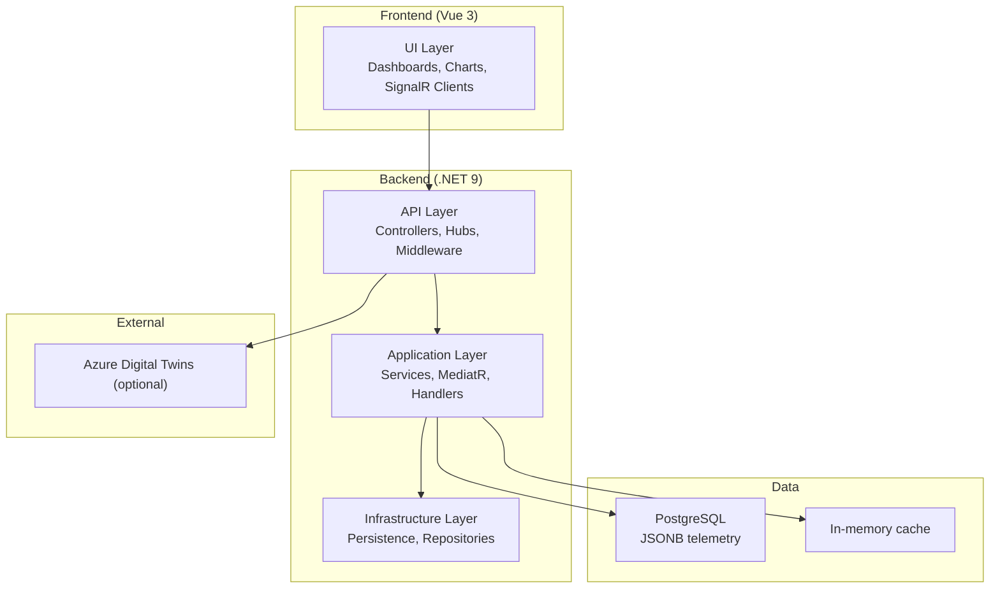
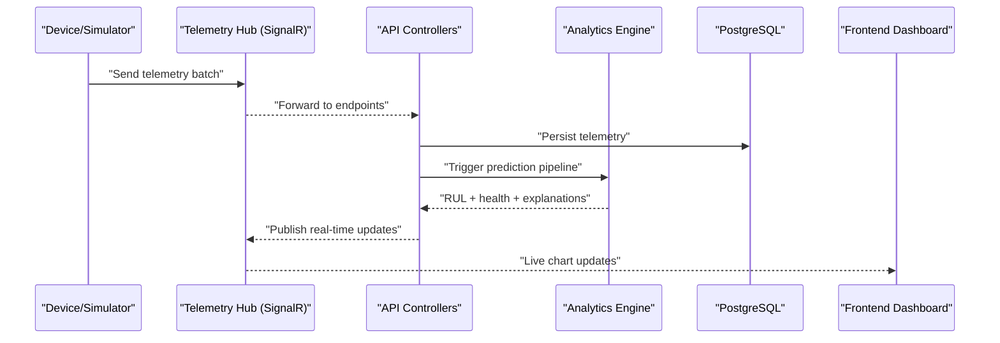
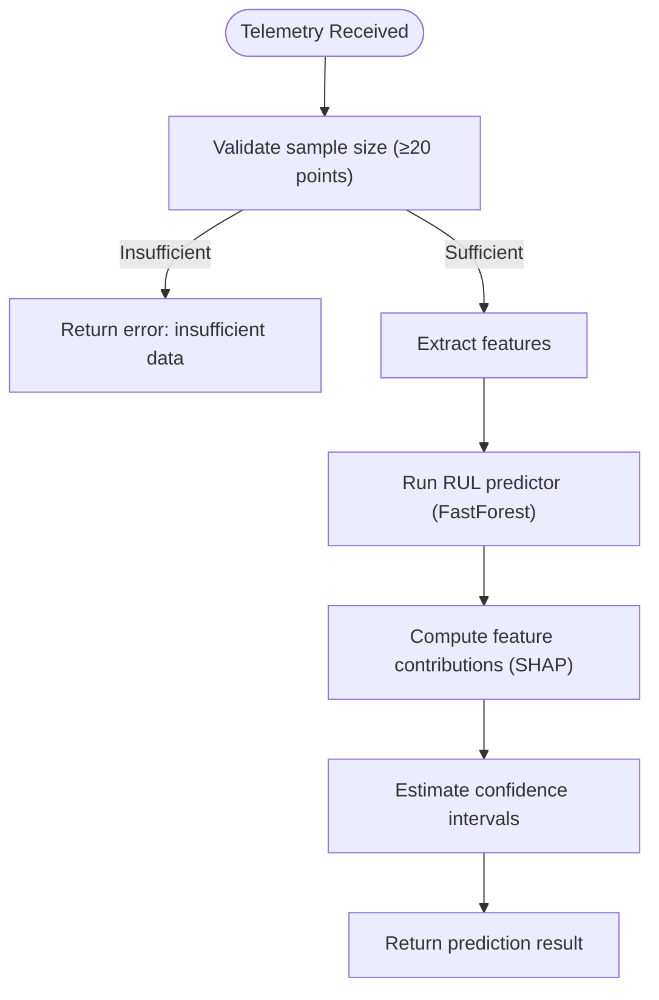
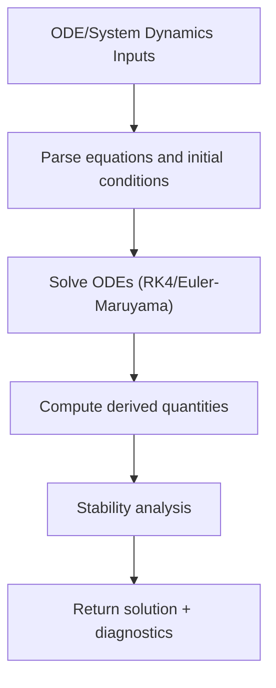
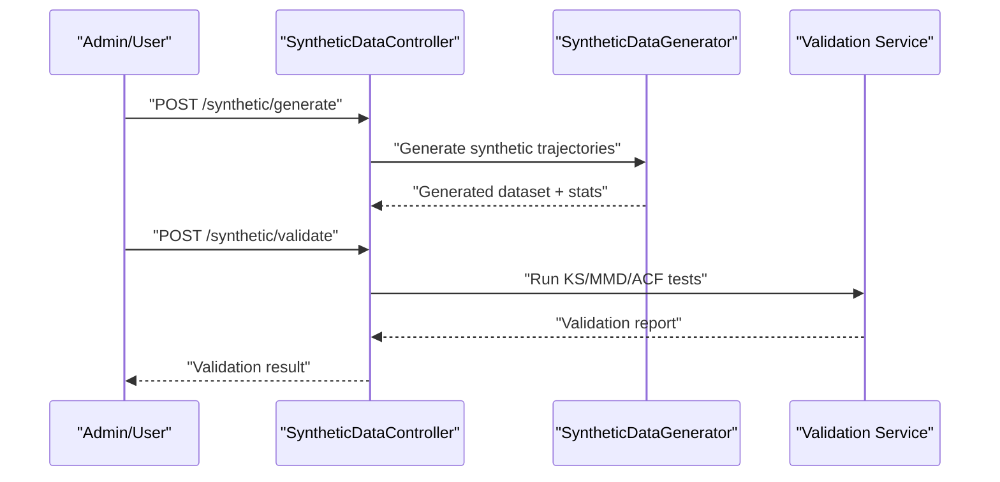
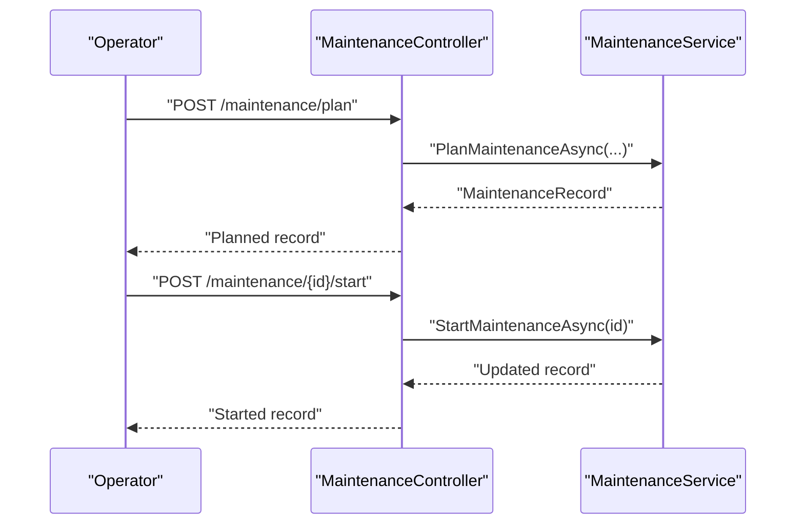
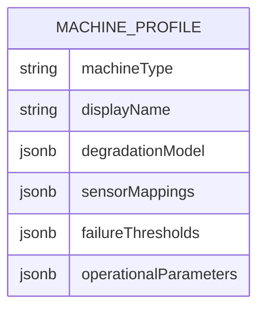
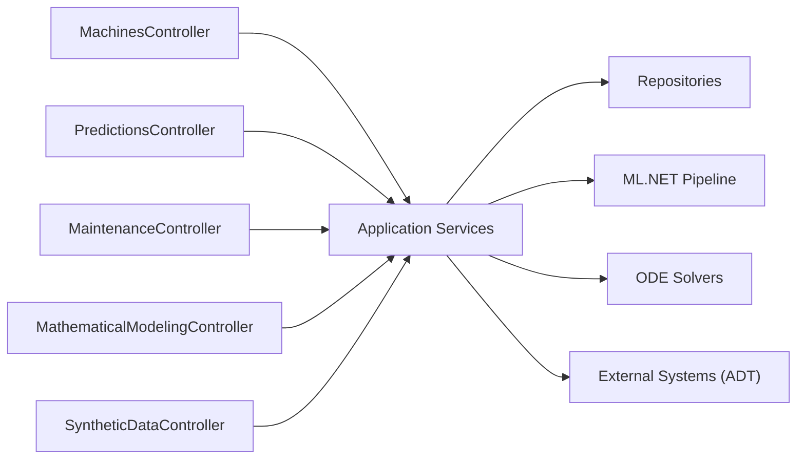

# Introduction and Background

<cite>
**Referenced Files in This Document**
- [ARCHITECTURE.md](file://docs/ARCHITECTURE.md)
- [spec.md](file://specs/1-predictive-maintenance/spec.md)
- [research.md](file://specs/1-predictive-maintenance/research.md)
- [Program.cs](file://src/api/DigitalTwinPlatform.API/Program.cs)
- [MachinesController.cs](file://src/api/DigitalTwinPlatform.API/Controllers/MachinesController.cs)
- [PredictionsController.cs](file://src/api/DigitalTwinPlatform.API/Controllers/PredictionsController.cs)
- [MaintenanceController.cs](file://src/api/DigitalTwinPlatform.API/Controllers/MaintenanceController.cs)
- [MathematicalModelingController.cs](file://src/api/DigitalTwinPlatform.API/Controllers/MathematicalModelingController.cs)
- [SyntheticDataController.cs](file://src/api/DigitalTwinPlatform.API/Controllers/SyntheticDataController.cs)
- [CNC.json](file://config/machines/CNC.json)
- [Conveyor.json](file://config/machines/Conveyor.json)
- [master_proposal_en.md](file://src/resources/master_proposal_en.md)
</cite>

## Table of Contents
1. [Introduction](#introduction)
2. [Project Structure](#project-structure)
3. [Core Components](#core-components)
4. [Architecture Overview](#architecture-overview)
5. [Detailed Component Analysis](#detailed-component-analysis)
6. [Dependency Analysis](#dependency-analysis)
7. [Performance Considerations](#performance-considerations)
8. [Troubleshooting Guide](#troubleshooting-guide)
9. [Conclusion](#conclusion)
10. [Appendices](#appendices)

## Introduction
This document establishes the industrial context, problem statement, and research motivation for the Digital Twin Platform for Predictive and Prescriptive Maintenance tailored to Small and Medium Enterprises (SMEs). It connects the platform’s technical capabilities—real-time telemetry ingestion, interpretable machine learning, mathematical degradation modeling, and synthetic data generation—to the practical needs of non-specialist maintenance teams. It also documents the gap between existing enterprise-grade solutions and SME operational realities, and positions the platform within the broader digital transformation landscape.

- Industrial context: Manufacturing SMEs operate with limited data science resources, modest sensor footprints, and constrained budgets. Predictive and prescriptive maintenance can reduce unplanned downtime and maintenance costs, but most off-the-shelf solutions demand extensive historical data and cloud-native stacks—often inaccessible to SMEs.
- Platform positioning: The Digital Twin Platform is engineered for SMEs to deliver accurate Remaining Useful Life (RUL) predictions, health classification, and actionable maintenance recommendations without requiring large-scale data infrastructures. It emphasizes synthetic data bootstrapping, interpretable ML, and software-only deployment.
- Economic impact: Industry studies cited in the proposal highlight potential downtime reductions of up to 45% and maintenance cost savings of 20–35% with Digital Twin-based PdM. However, these demonstrations often assume abundant historical data—an assumption that does not hold for most SMEs. The platform addresses this gap by combining physics-informed synthetic data generation with validated degradation models and explainable ML.

**Section sources**
- [master_proposal_en.md](file://src/resources/master_proposal_en.md#L235-L241)

## Project Structure
The platform is organized as a layered .NET 9 solution with a Web API backend, a Vue 3 frontend, and supporting services for telemetry, analytics, and mathematical modeling. The backend exposes REST endpoints and SignalR hubs for real-time updates. The frontend provides dashboards for monitoring, predictions, and configuration.

**Diagram sources**
- [ARCHITECTURE.md](file://docs/ARCHITECTURE.md#L1-L50)
- [Program.cs](file://src/api/DigitalTwinPlatform.API/Program.cs#L1-L87)

**Section sources**
- [ARCHITECTURE.md](file://docs/ARCHITECTURE.md#L1-L50)
- [Program.cs](file://src/api/DigitalTwinPlatform.API/Program.cs#L1-L87)

## Core Components
- Real-time telemetry ingestion and streaming via SignalR hubs for low-latency updates.
- Predictive analytics engine providing RUL predictions and health classification with confidence intervals and feature contributions.
- Interpretable ML.NET pipeline with FastForest and SHAP-based explanations.
- Mathematical modeling engine implementing numerical ODE solvers (Runge-Kutta, Euler-Maruyama) for physics-informed degradation.
- Synthetic data generator with statistical validation against benchmark datasets.
- Maintenance orchestration with planning, execution, and history tracking.
- Configuration-driven machine profiles (e.g., CNC, Conveyor) with sensor mappings and failure thresholds.

These components collectively enable the platform to operate effectively in data-scarce SME environments while remaining accessible to non-technical users.

**Section sources**
- [ARCHITECTURE.md](file://docs/ARCHITECTURE.md#L8-L50)
- [PredictionsController.cs](file://src/api/DigitalTwinPlatform.API/Controllers/PredictionsController.cs#L1-L435)
- [MathematicalModelingController.cs](file://src/api/DigitalTwinPlatform.API/Controllers/MathematicalModelingController.cs#L1-L514)
- [SyntheticDataController.cs](file://src/api/DigitalTwinPlatform.API/Controllers/SyntheticDataController.cs#L1-L143)
- [MaintenanceController.cs](file://src/api/DigitalTwinPlatform.API/Controllers/MaintenanceController.cs#L1-L73)
- [CNC.json](file://config/machines/CNC.json#L1-L58)
- [Conveyor.json](file://config/machines/Conveyor.json#L1-L47)

## Architecture Overview
The system architecture integrates real-time telemetry, analytics, and mathematical modeling into a unified ecosystem. Data flows from devices or synthetic generators into the backend, where it is stored and processed to produce predictions, alerts, and insights. The frontend presents dashboards and interactive controls for operators.

**Diagram sources**
- [ARCHITECTURE.md](file://docs/ARCHITECTURE.md#L28-L34)
- [Program.cs](file://src/api/DigitalTwinPlatform.API/Program.cs#L76-L78)

**Section sources**
- [ARCHITECTURE.md](file://docs/ARCHITECTURE.md#L28-L34)
- [Program.cs](file://src/api/DigitalTwinPlatform.API/Program.cs#L76-L78)

## Detailed Component Analysis

### Predictive Maintenance Pipeline
The predictive pipeline ingests recent telemetry, extracts features, and produces RUL predictions with confidence intervals and feature contributions. It supports both lightweight summaries and detailed explanations, enabling non-technical operators to trust and act on recommendations.

**Diagram sources**
- [PredictionsController.cs](file://src/api/DigitalTwinPlatform.API/Controllers/PredictionsController.cs#L32-L75)

**Section sources**
- [PredictionsController.cs](file://src/api/DigitalTwinPlatform.API/Controllers/PredictionsController.cs#L32-L75)

### Mathematical Degradation Modeling
The platform implements numerical ODE solvers to simulate degradation trajectories for rotating and reciprocating machinery. It supports deterministic (Runge-Kutta) and stochastic (Euler-Maruyama) models, enabling physics-informed synthetic data generation and benchmarking.

**Diagram sources**
- [MathematicalModelingController.cs](file://src/api/DigitalTwinPlatform.API/Controllers/MathematicalModelingController.cs#L24-L115)

**Section sources**
- [MathematicalModelingController.cs](file://src/api/DigitalTwinPlatform.API/Controllers/MathematicalModelingController.cs#L24-L115)
- [research.md](file://specs/1-predictive-maintenance/research.md#L7-L27)

### Synthetic Data Generation and Validation
To address data scarcity, the platform generates high-fidelity synthetic sensor data and validates it statistically against benchmarks. This ensures training data quality even without extensive historical records.

**Diagram sources**
- [SyntheticDataController.cs](file://src/api/DigitalTwinPlatform.API/Controllers/SyntheticDataController.cs#L29-L86)

**Section sources**
- [SyntheticDataController.cs](file://src/api/DigitalTwinPlatform.API/Controllers/SyntheticDataController.cs#L29-L86)
- [research.md](file://specs/1-predictive-maintenance/research.md#L28-L48)

### Maintenance Orchestration
The maintenance module supports planning, starting, completing, canceling, and searching maintenance activities. It integrates with predictive insights to schedule interventions proactively.

**Diagram sources**
- [MaintenanceController.cs](file://src/api/DigitalTwinPlatform.API/Controllers/MaintenanceController.cs#L15-L46)

**Section sources**
- [MaintenanceController.cs](file://src/api/DigitalTwinPlatform.API/Controllers/MaintenanceController.cs#L15-L46)

### Machine Configuration and Profiles
Machine profiles define degradation models, sensor mappings, failure thresholds, and operational parameters. These profiles guide synthetic data generation, alert thresholds, and maintenance scheduling.

**Diagram sources**
- [CNC.json](file://config/machines/CNC.json#L1-L58)
- [Conveyor.json](file://config/machines/Conveyor.json#L1-L47)

**Section sources**
- [CNC.json](file://config/machines/CNC.json#L1-L58)
- [Conveyor.json](file://config/machines/Conveyor.json#L1-L47)

## Dependency Analysis
The backend composes multiple specialized services and adheres to clean architecture boundaries. Controllers depend on application services, which encapsulate domain logic and coordinate repositories and external integrations.

**Diagram sources**
- [MachinesController.cs](file://src/api/DigitalTwinPlatform.API/Controllers/MachinesController.cs#L1-L139)
- [PredictionsController.cs](file://src/api/DigitalTwinPlatform.API/Controllers/PredictionsController.cs#L1-L435)
- [MaintenanceController.cs](file://src/api/DigitalTwinPlatform.API/Controllers/MaintenanceController.cs#L1-L73)
- [MathematicalModelingController.cs](file://src/api/DigitalTwinPlatform.API/Controllers/MathematicalModelingController.cs#L1-L514)
- [SyntheticDataController.cs](file://src/api/DigitalTwinPlatform.API/Controllers/SyntheticDataController.cs#L1-L143)

**Section sources**
- [MachinesController.cs](file://src/api/DigitalTwinPlatform.API/Controllers/MachinesController.cs#L1-L139)
- [PredictionsController.cs](file://src/api/DigitalTwinPlatform.API/Controllers/PredictionsController.cs#L1-L435)
- [MaintenanceController.cs](file://src/api/DigitalTwinPlatform.API/Controllers/MaintenanceController.cs#L1-L73)
- [MathematicalModelingController.cs](file://src/api/DigitalTwinPlatform.API/Controllers/MathematicalModelingController.cs#L1-L514)
- [SyntheticDataController.cs](file://src/api/DigitalTwinPlatform.API/Controllers/SyntheticDataController.cs#L1-L143)

## Performance Considerations
- Latency targets: Real-time dashboards update within 100 ms; end-to-end prediction latency remains under 500 ms.
- Streaming: SignalR hubs with connection pooling and message batching ensure scalable, low-latency updates.
- Data storage: PostgreSQL with JSONB and time-series indexing optimizes telemetry retrieval and reduces query times.
- Frontend optimization: Debounced updates, virtual scrolling, and progressive loading improve responsiveness on constrained networks.

**Section sources**
- [research.md](file://specs/1-predictive-maintenance/research.md#L71-L92)
- [ARCHITECTURE.md](file://docs/ARCHITECTURE.md#L44-L50)

## Troubleshooting Guide
Common issues and mitigations:
- Insufficient telemetry for prediction: Ensure at least 20 data points; otherwise, predictions return an error indicating missing data.
- Model readiness: Verify model status endpoints indicate loaded models before requesting predictions.
- Data validation failures: For synthetic data, review validation reports and adjust generation parameters to meet acceptance criteria.
- Real-time streaming: Confirm SignalR hub endpoints are reachable and clients reconnect automatically on transient failures.

**Section sources**
- [PredictionsController.cs](file://src/api/DigitalTwinPlatform.API/Controllers/PredictionsController.cs#L55-L59)
- [PredictionsController.cs](file://src/api/DigitalTwinPlatform.API/Controllers/PredictionsController.cs#L211-L223)
- [SyntheticDataController.cs](file://src/api/DigitalTwinPlatform.API/Controllers/SyntheticDataController.cs#L74-L85)
- [Program.cs](file://src/api/DigitalTwinPlatform.API/Program.cs#L76-L78)

## Conclusion
The Digital Twin Platform for Predictive and Prescriptive Maintenance is positioned to bridge the gap between advanced PdM capabilities and SME operational constraints. By combining interpretable ML, physics-informed mathematical modeling, and synthetic data generation, it enables accurate, explainable, and accessible maintenance decisions—without the heavy data and cloud dependencies typical of enterprise solutions. This foundation supports measurable improvements in uptime and cost-efficiency, aligning with broader digital transformation goals for manufacturing SMEs.

[No sources needed since this section summarizes without analyzing specific files]

## Appendices

### Gap Between Existing Solutions and SME Realities
- Data scarcity: Most advanced PdM algorithms require extensive labeled data, often unavailable in SMEs.
- Cloud dependency: Many solutions mandate cloud infrastructure, complicating deployment and data sovereignty for SMEs.
- Complexity: Black-box models and complex integrations hinder operator adoption and maintenance team autonomy.
- Cost: Licensing and operational costs can exceed SME budgets for limited ROI.

**Section sources**
- [master_proposal_en.md](file://src/resources/master_proposal_en.md#L235-L241)

### Research Motivation and Industry Trends
- Demonstrated impact: Studies report up to 45% downtime reduction and 20–35% maintenance cost savings with Digital Twin-based PdM.
- Limitations: These results often rely on abundant historical data and enterprise-grade toolchains—unavailable to most SMEs.
- Platform rationale: Address data scarcity with synthetic data generation, simplify operations with interpretable ML, and lower barriers with software-only deployment.

**Section sources**
- [master_proposal_en.md](file://src/resources/master_proposal_en.md#L235-L241)
- [spec.md](file://specs/1-predictive-maintenance/spec.md#L82-L98)