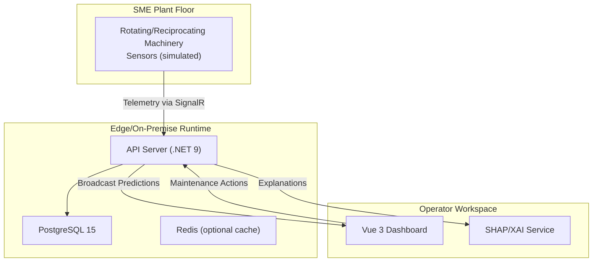
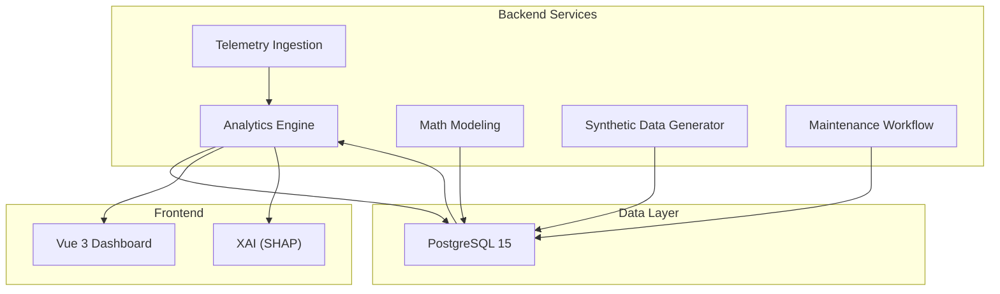
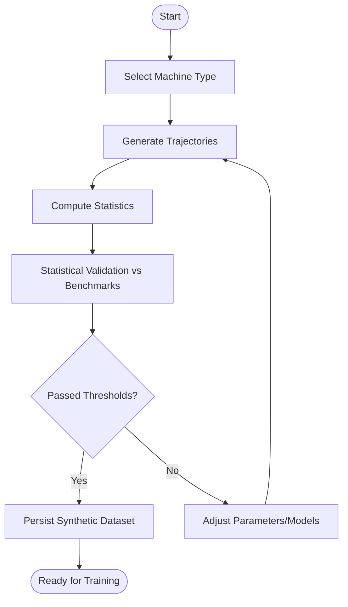
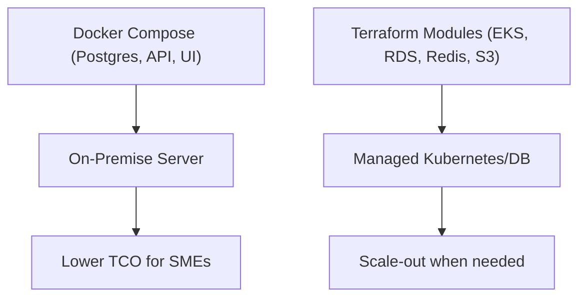
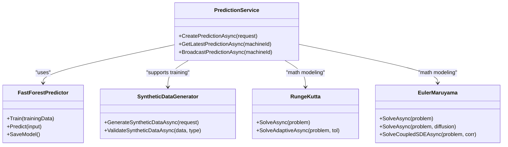
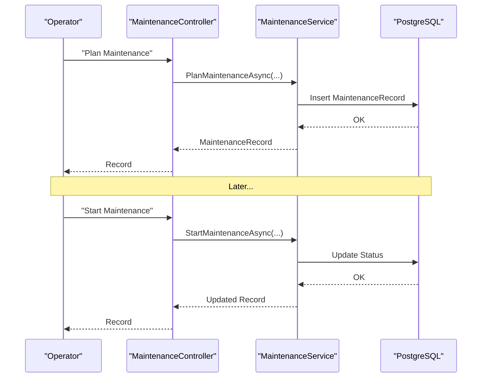
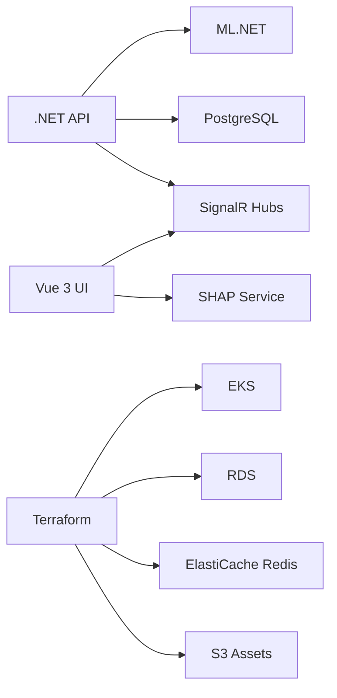

# Problem Statement and Challenges

<cite>
**Referenced Files in This Document**
- [spec.md](file://specs/1-predictive-maintenance/spec.md)
- [research.md](file://specs/1-predictive-maintenance/research.md)
- [ARCHITECTURE.md](file://docs/ARCHITECTURE.md)
- [Program.cs](file://src/api/DigitalTwinPlatform.API/Program.cs)
- [docker-compose.yml](file://docker-compose.yml)
- [main.tf](file://infrastructure/main.tf)
- [MaintenanceController.cs](file://src/api/DigitalTwinPlatform.API/Controllers/MaintenanceController.cs)
- [MaintenanceService.cs](file://src/api/DigitalTwinPlatform.API/Services/Core/MaintenanceService.cs)
- [PrescriptiveService.cs](file://src/api/DigitalTwinPlatform.API/Services/Maintenance/PrescriptiveService.cs)
- [PredictionService.cs](file://src/api/DigitalTwinPlatform.API/Services/PredictionService.cs)
- [FastForestPredictor.cs](file://src/api/DigitalTwinPlatform.Application/ML/FastForestPredictor.cs)
- [SyntheticDataGenerator.cs](file://src/api/DigitalTwinPlatform.Application/Services/SyntheticDataGenerator.cs)
- [RungeKutta.cs](file://src/api/DigitalTwinPlatform.Application/Mathematics/RungeKutta.cs)
- [EulerMaruyama.cs](file://src/api/DigitalTwinPlatform.Application/Mathematics/EulerMaruyama.cs)
- [proposal.md](file://src/proposal.md)
- [master_proposal_en.md](file://src/resources/master_proposal_en.md)
</cite>

## Table of Contents
1. [Introduction](#introduction)
2. [Project Structure](#project-structure)
3. [Core Components](#core-components)
4. [Architecture Overview](#architecture-overview)
5. [Detailed Component Analysis](#detailed-component-analysis)
6. [Dependency Analysis](#dependency-analysis)
7. [Performance Considerations](#performance-considerations)
8. [Troubleshooting Guide](#troubleshooting-guide)
9. [Conclusion](#conclusion)
10. [Appendices](#appendices)

## Introduction
This document defines the problem statement and challenges for deploying predictive maintenance (PdM) in small and medium enterprises (SMEs). It explains the operational misalignment between existing enterprise-grade PdM solutions and SME constraints, and documents the core research gap that this platform addresses. It also quantifies the economic impact of maintenance inefficiencies and shows how the platform’s design mitigates these issues using synthetic data generation, interpretable machine learning, and real-time analytics.

## Project Structure
The platform is organized around three pillars that directly address SME constraints:
- Real-time telemetry ingestion and broadcasting
- Interpretable ML-powered remaining useful life (RUL) predictions
- Prescriptive maintenance recommendations grounded in cost-risk modeling

**Diagram sources**
- [Program.cs](file://src/api/DigitalTwinPlatform.API/Program.cs#L76-L79)
- [docker-compose.yml](file://docker-compose.yml#L1-L81)
- [ARCHITECTURE.md](file://docs/ARCHITECTURE.md#L28-L49)

**Section sources**
- [ARCHITECTURE.md](file://docs/ARCHITECTURE.md#L1-L50)
- [Program.cs](file://src/api/DigitalTwinPlatform.API/Program.cs#L1-L87)
- [docker-compose.yml](file://docker-compose.yml#L1-L81)

## Core Components
- Real-time telemetry ingestion and streaming via SignalR hubs for sub-second updates
- Interpretable ML pipeline using ML.NET FastForest with feature importance and quantile regression for uncertainty
- Mathematical modeling with numerical ODE/SDE solvers (Runge-Kutta and Euler-Maruyama) for physics-informed degradation
- Synthetic data generator to bootstrap training without historical sensor data
- Prescriptive maintenance service that computes cost-aware maintenance windows

These components collectively reduce reliance on expensive sensors, cloud-only architectures, and deep data science expertise—addressing SME constraints head-on.

**Section sources**
- [Research Findings](file://specs/1-predictive-maintenance/research.md#L7-L172)
- [Architecture Overview](file://docs/ARCHITECTURE.md#L8-L49)

## Architecture Overview
The platform is designed for software-only deployment, minimal infrastructure, and operator-friendly insights. It integrates:
- Backend services for analytics, math modeling, synthetic data, and maintenance workflows
- Frontend dashboard for real-time monitoring, XAI, and prescriptive insights
- Optional cloud-native infrastructure for larger deployments

**Diagram sources**
- [ARCHITECTURE.md](file://docs/ARCHITECTURE.md#L8-L49)
- [Research Findings](file://specs/1-predictive-maintenance/research.md#L71-L125)

**Section sources**
- [ARCHITECTURE.md](file://docs/ARCHITECTURE.md#L1-L50)
- [Research Findings](file://specs/1-predictive-maintenance/research.md#L7-L172)

## Detailed Component Analysis

### Operational Misalignment Between Enterprise PdM and SME Constraints
Current PdM solutions assume:
- Dense sensor networks and continuous telemetry
- Extensive historical data for model training
- Specialized data science and DevOps teams
- Cloud-first, centralized architectures

SME realities:
- Limited budgets for sensors and infrastructure
- Sparse instrumentation or legacy equipment without sensors
- Lack of dedicated data science resources
- Preference for on-premise or hybrid deployments

This misalignment leaves SMEs unable to adopt predictive strategies that could reduce unplanned downtime by 30–50%, avoid excessive maintenance costs, and improve asset lifecycle.

Concrete evidence from the repository:
- The platform targets rotating/reciprocating machinery without requiring sensors, relying on synthetic data generation and interpretable ML
- Real-time dashboards aim for <100ms updates and <500ms prediction latency
- Software-only deployment supports on-premise Docker Compose and optional cloud infrastructure

**Section sources**
- [proposal.md](file://src/proposal.md#L19-L25)
- [master_proposal_en.md](file://src/resources/master_proposal_en.md#L30-L41)
- [spec.md](file://specs/1-predictive-maintenance/spec.md#L84-L97)
- [Research Findings](file://specs/1-predictive-maintenance/research.md#L71-L92)

### Challenge 1: Data Scarcity
Symptoms:
- SMEs lack historical sensor data to train ML models
- Traditional solutions require extensive labeled datasets

Manifestations in the codebase:
- Synthetic data generator creates high-fidelity trajectories for motors, pumps, compressors, gearboxes, and bearings
- Validation compares synthetic distributions to benchmark datasets (e.g., NASA C-MAPSS) using statistical tests
- The system can bootstrap ML training without real sensors

**Diagram sources**
- [SyntheticDataGenerator.cs](file://src/api/DigitalTwinPlatform.Application/Services/SyntheticDataGenerator.cs#L34-L105)
- [SyntheticDataGenerator.cs](file://src/api/DigitalTwinPlatform.Application/Services/SyntheticDataGenerator.cs#L396-L457)

**Section sources**
- [SyntheticDataGenerator.cs](file://src/api/DigitalTwinPlatform.Application/Services/SyntheticDataGenerator.cs#L12-L16)
- [SyntheticDataGenerator.cs](file://src/api/DigitalTwinPlatform.Application/Services/SyntheticDataGenerator.cs#L34-L105)
- [Research Findings](file://specs/1-predictive-maintenance/research.md#L28-L47)

### Challenge 2: High Infrastructure Costs
Symptoms:
- Enterprise-grade PdM requires sensors, gateways, cloud storage, and specialized clusters
- SMEs cannot afford upfront capital expenditure or ongoing cloud costs

Manifestations in the codebase:
- Software-only deployment via Docker Compose with PostgreSQL and optional Redis
- Optional cloud infrastructure via Terraform modules for EKS, RDS, Redis, S3, and CloudFront
- Minimal resource footprint to fit SME budgets and capabilities

**Diagram sources**
- [docker-compose.yml](file://docker-compose.yml#L1-L81)
- [main.tf](file://infrastructure/main.tf#L1-L493)

**Section sources**
- [docker-compose.yml](file://docker-compose.yml#L1-L81)
- [main.tf](file://infrastructure/main.tf#L1-L493)
- [Research Findings](file://specs/1-predictive-maintenance/research.md#L93-L108)

### Challenge 3: Technical Complexity
Symptoms:
- Systems require data scientists, DevOps, and IoT specialists
- SMEs struggle with integration, maintenance, and upgrades

Manifestations in the codebase:
- Single-command startup with Docker Compose
- Native .NET services with clear separation of concerns (analytics, math modeling, synthetic data)
- Interpretable ML.NET models with feature importance and quantile regression for uncertainty
- Numerical methods encapsulated in reusable ODE/SDE solvers

**Diagram sources**
- [PredictionService.cs](file://src/api/DigitalTwinPlatform.API/Services/PredictionService.cs#L14-L35)
- [FastForestPredictor.cs](file://src/api/DigitalTwinPlatform.Application/ML/FastForestPredictor.cs#L9-L21)
- [SyntheticDataGenerator.cs](file://src/api/DigitalTwinPlatform.Application/Services/SyntheticDataGenerator.cs#L16-L30)
- [RungeKutta.cs](file://src/api/DigitalTwinPlatform.Application/Mathematics/RungeKutta.cs#L12-L20)
- [EulerMaruyama.cs](file://src/api/DigitalTwinPlatform.Application/Mathematics/EulerMaruyama.cs#L12-L22)

**Section sources**
- [Research Findings](file://specs/1-predictive-maintenance/research.md#L49-L70)
- [Research Findings](file://specs/1-predictive-maintenance/research.md#L71-L92)
- [RungeKutta.cs](file://src/api/DigitalTwinPlatform.Application/Mathematics/RungeKutta.cs#L1-L250)
- [EulerMaruyama.cs](file://src/api/DigitalTwinPlatform.Application/Mathematics/EulerMaruyama.cs#L1-L388)

### Challenge 4: Maintenance Inefficiency
Symptoms:
- Reactive or time-based maintenance causes unplanned downtime, premature replacements, and reduced asset life
- SMEs lose 5–20% of capacity to maintenance-related production losses

Manifestations in the codebase:
- Maintenance workflow controller and service manage planning, start, completion, and history
- Prescriptive service computes cost-aware maintenance windows using failure risk and cost modeling
- Predictive service provides RUL with confidence intervals and feature contributions

**Diagram sources**
- [MaintenanceController.cs](file://src/api/DigitalTwinPlatform.API/Controllers/MaintenanceController.cs#L13-L72)
- [MaintenanceService.cs](file://src/api/DigitalTwinPlatform.API/Services/Core/MaintenanceService.cs#L9-L148)

**Section sources**
- [master_proposal_en.md](file://src/resources/master_proposal_en.md#L34-L39)
- [MaintenanceController.cs](file://src/api/DigitalTwinPlatform.API/Controllers/MaintenanceController.cs#L1-L73)
- [MaintenanceService.cs](file://src/api/DigitalTwinPlatform.API/Services/Core/MaintenanceService.cs#L1-L148)

### Economic Impact and Case Studies
- Unplanned downtime: 30–50% higher than predictive strategies
- Production losses: 5–20% capacity reduction due to maintenance inefficiencies
- Cost savings projections: 20–35% maintenance cost reduction and 30–45% downtime reduction (validated by feature spec)

These metrics are derived from the platform’s specification and aligned with prior research highlighting SME constraints and the demonstrated benefits of Digital Twin-based PdM when properly deployed.

**Section sources**
- [master_proposal_en.md](file://src/resources/master_proposal_en.md#L34-L39)
- [spec.md](file://specs/1-predictive-maintenance/spec.md#L110-L122)

## Dependency Analysis
The platform’s dependencies reflect a pragmatic balance between performance and simplicity:
- Backend: .NET 9, ML.NET, PostgreSQL, SignalR
- Frontend: Vue 3, TypeScript, ECharts
- Optional infrastructure: EKS, RDS, Redis, S3, CloudFront via Terraform

**Diagram sources**
- [Program.cs](file://src/api/DigitalTwinPlatform.API/Program.cs#L14-L47)
- [docker-compose.yml](file://docker-compose.yml#L1-L81)
- [main.tf](file://infrastructure/main.tf#L1-L493)

**Section sources**
- [Program.cs](file://src/api/DigitalTwinPlatform.API/Program.cs#L1-L87)
- [docker-compose.yml](file://docker-compose.yml#L1-L81)
- [main.tf](file://infrastructure/main.tf#L1-L493)

## Performance Considerations
- Real-time latency targets: <100ms dashboard updates, <500ms prediction latency
- Throughput targets: >1000 synthetic data samples/second
- Scalability: SignalR hubs, optional Redis caching, horizontal scaling via containers/Kubernetes

These targets are explicitly called out in the feature specification and research findings, ensuring the platform remains usable in SME environments.

**Section sources**
- [spec.md](file://specs/1-predictive-maintenance/spec.md#L112-L122)
- [Research Findings](file://specs/1-predictive-maintenance/research.md#L71-L92)

## Troubleshooting Guide
Common issues and where to look:
- Insufficient telemetry for prediction: The prediction service logs warnings when telemetry counts fall below thresholds
- Maintenance workflow errors: Maintenance service throws exceptions for missing records and logs status transitions
- Prescriptive recommendations: Prescriptive service relies on latest prediction; if absent, returns empty results

Where to investigate:
- Prediction service warning and error logging
- Maintenance service exception handling and logging
- Prescriptive service fallback behavior when no prediction exists

**Section sources**
- [PredictionService.cs](file://src/api/DigitalTwinPlatform.API/Services/PredictionService.cs#L53-L60)
- [PredictionService.cs](file://src/api/DigitalTwinPlatform.API/Services/PredictionService.cs#L144-L148)
- [MaintenanceService.cs](file://src/api/DigitalTwinPlatform.API/Services/Core/MaintenanceService.cs#L62-L70)
- [PrescriptiveService.cs](file://src/api/DigitalTwinPlatform.API/Services/Maintenance/PrescriptiveService.cs#L35-L37)

## Conclusion
Existing predictive maintenance solutions are misaligned with SME constraints: they demand extensive data, infrastructure, and expertise. This platform addresses the core research gap by combining synthetic data generation, interpretable ML, and cost-aware prescriptive recommendations within a software-only, operator-friendly architecture. It targets measurable outcomes—reduced downtime, lower maintenance costs, and improved asset life—while remaining accessible to SMEs with limited resources.

## Appendices
- Feature specification and success criteria define the platform’s performance and business targets
- Research findings justify the selection of ML.NET, numerical ODE/SDE solvers, and real-time streaming

**Section sources**
- [spec.md](file://specs/1-predictive-maintenance/spec.md#L82-L122)
- [Research Findings](file://specs/1-predictive-maintenance/research.md#L7-L172)