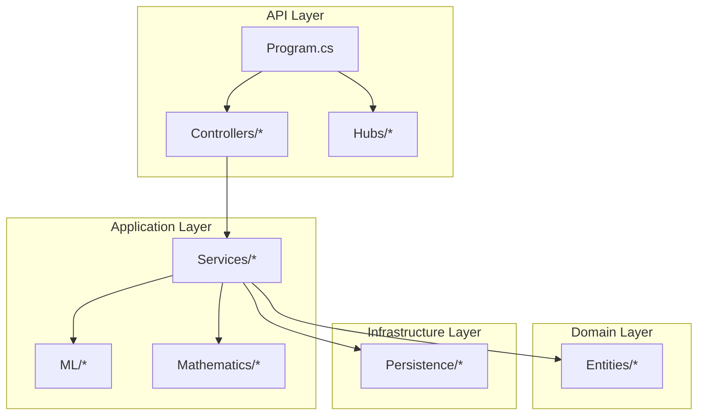
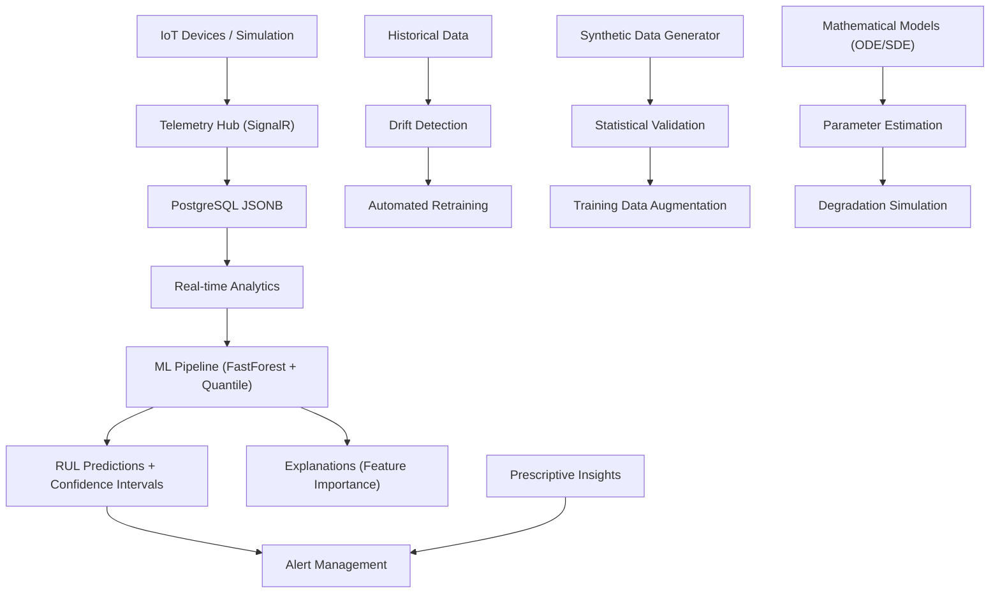
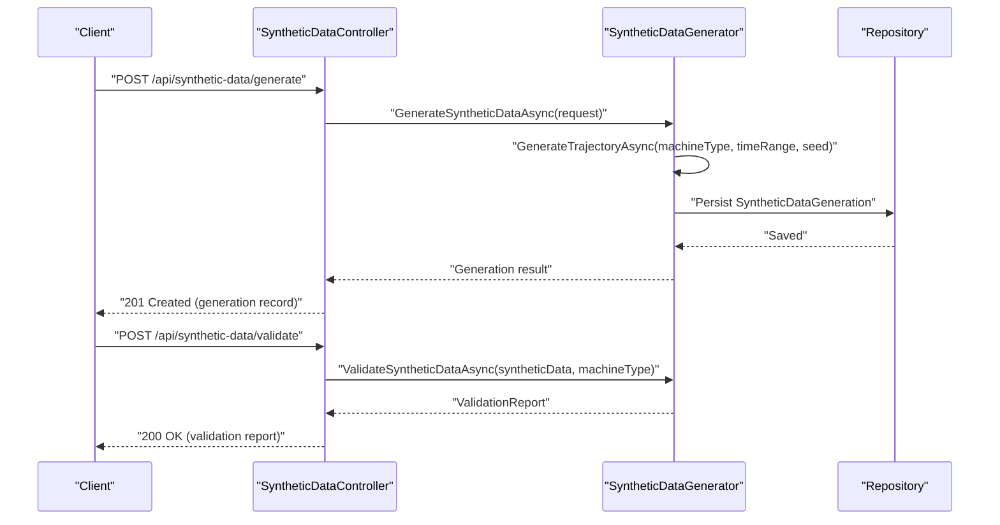
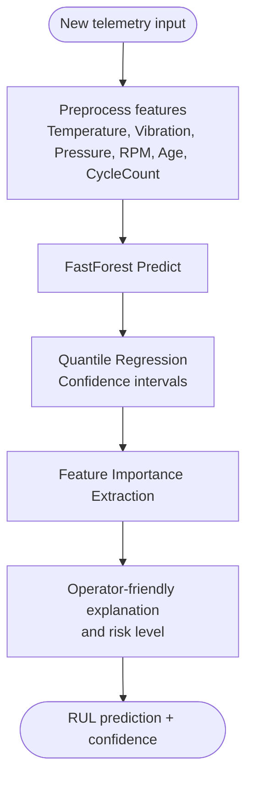
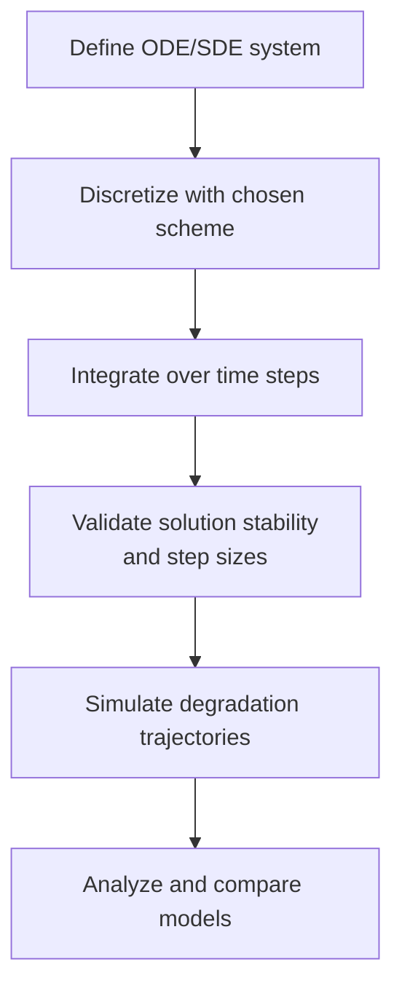
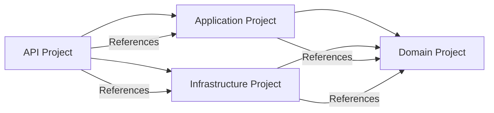
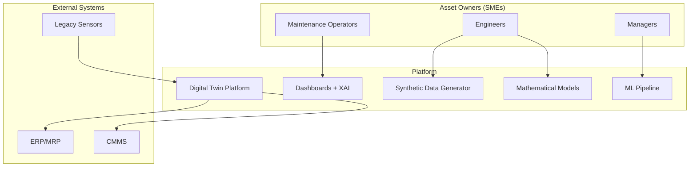

# Project Overview

<cite>
**Referenced Files in This Document**
- [ARCHITECTURE.md](file://docs/ARCHITECTURE.md)
- [spec.md](file://specs/1-predictive-maintenance/spec.md)
- [Program.cs](file://src/api/DigitalTwinPlatform.API/Program.cs)
- [DigitalTwinPlatform.API.csproj](file://src/api/DigitalTwinPlatform.API/DigitalTwinPlatform.API.csproj)
- [SyntheticDataController.cs](file://src/api/DigitalTwinPlatform.API/Controllers/SyntheticDataController.cs)
- [SyntheticDataGenerator.cs](file://src/api/DigitalTwinPlatform.Application/Services/SyntheticDataGenerator.cs)
- [FastForestPredictor.cs](file://src/api/DigitalTwinPlatform.Application/ML/FastForestPredictor.cs)
- [EulerMaruyama.cs](file://src/api/DigitalTwinPlatform.Application/Mathematics/EulerMaruyama.cs)
- [SyntheticDataGeneration.cs](file://src/api/DigitalTwinPlatform.Domain/Entities/SyntheticDataGeneration.cs)
</cite>

## Table of Contents
1. [Introduction](#introduction)
2. [Project Structure](#project-structure)
3. [Core Components](#core-components)
4. [Architecture Overview](#architecture-overview)
5. [Detailed Component Analysis](#detailed-component-analysis)
6. [Dependency Analysis](#dependency-analysis)
7. [Performance Considerations](#performance-considerations)
8. [Troubleshooting Guide](#troubleshooting-guide)
9. [Conclusion](#conclusion)
10. [Appendices](#appendices)

## Introduction
The Digital Twin Platform for Predictive and Prescriptive Maintenance targets Small and Medium Enterprises (SMEs) to reduce unplanned downtime and maintenance costs by enabling proactive, data-driven decisions. It unifies three pillars:
- Real-time telemetry ingestion and visualization
- Mathematically grounded degradation modeling
- Interpretable machine learning with synthetic data bootstrapping

The platform’s innovative approach combines physics-informed synthetic data generation with explainable ML to deliver accurate Remaining Useful Life (RUL) predictions and actionable maintenance insights—without requiring extensive historical data or cloud dependencies. This positions the platform as a practical, software-only solution for non-technical operators while maintaining scientific rigor for engineers.

## Project Structure
At a high level, the platform is organized into layered .NET projects with clear separation of concerns:
- API layer: ASP.NET Core Web API exposing REST endpoints and SignalR hubs
- Application layer: Business logic, ML pipelines, mathematical modeling, and services
- Domain layer: Entities, enums, and value objects defining the maintenance domain
- Infrastructure layer: Persistence, migrations, and cross-cutting concerns
- Frontend: Vue 3 dashboard for real-time monitoring, XAI explanations, and prescriptive insights

**Diagram sources**
- [Program.cs](file://src/api/DigitalTwinPlatform.API/Program.cs#L1-L87)
- [DigitalTwinPlatform.API.csproj](file://src/api/DigitalTwinPlatform.API/DigitalTwinPlatform.API.csproj#L1-L54)

**Section sources**
- [Program.cs](file://src/api/DigitalTwinPlatform.API/Program.cs#L1-L87)
- [DigitalTwinPlatform.API.csproj](file://src/api/DigitalTwinPlatform.API/DigitalTwinPlatform.API.csproj#L1-L54)

## Core Components
- Real-time telemetry ingestion and streaming via SignalR hubs for low-latency dashboards
- Simulation engine for synthetic telemetry generation and degradation trajectory simulation
- Analytics engine for RUL predictions, anomaly detection, and drift detection
- ML pipeline leveraging ML.NET FastForest and quantile regression for robust predictions and confidence intervals
- Mathematical modeling module implementing numerical ODE/SDE solvers (Runge-Kutta, Euler-Maruyama)
- Synthetic data generator with statistical validation against benchmarks
- Prescriptive insights service for maintenance action recommendations

Key SME-focused capabilities:
- Software-only deployment with optional containerization
- Interpretable ML with feature importance and SHAP-style explanations
- Bootstrapping ML with synthetic data when historical data is unavailable
- Real-time dashboards with <100ms update latency and <500ms prediction latency

**Section sources**
- [ARCHITECTURE.md](file://docs/ARCHITECTURE.md#L1-L50)
- [spec.md](file://specs/1-predictive-maintenance/spec.md#L82-L122)

## Architecture Overview
The platform follows a modular, event-driven architecture with clear data flow across components:

**Diagram sources**
- [ARCHITECTURE.md](file://docs/ARCHITECTURE.md#L28-L49)

**Section sources**
- [ARCHITECTURE.md](file://docs/ARCHITECTURE.md#L1-L50)

## Detailed Component Analysis

### Synthetic Data Generation and Validation
Purpose:
- Generate high-fidelity synthetic sensor data for rotating and reciprocating machinery
- Validate synthetic data against benchmark datasets using statistical tests
- Support rapid prototyping and training without real sensors

Key capabilities:
- Trajectory generation per machine type (motor, pump, compressor, gearbox, bearing)
- Physics-informed degradation models (Wiener processes, exponential, and physics-based)
- Statistical validation with benchmark comparisons and recommendation engine
- Persistence of generation records and statistics for auditing and reuse

**Diagram sources**
- [SyntheticDataController.cs](file://src/api/DigitalTwinPlatform.API/Controllers/SyntheticDataController.cs#L1-L143)
- [SyntheticDataGenerator.cs](file://src/api/DigitalTwinPlatform.Application/Services/SyntheticDataGenerator.cs#L34-L105)
- [SyntheticDataGeneration.cs](file://src/api/DigitalTwinPlatform.Domain/Entities/SyntheticDataGeneration.cs#L10-L23)

Practical example for SMEs:
- A small manufacturer with limited sensors can generate thousands of synthetic trajectories for a gearbox in seconds, validate them against NASA C-MAPSS-like benchmarks, and immediately augment their training dataset for RUL modeling.

Validation criteria:
- Throughput: >1000 samples/second for all machine types
- Statistical fidelity: Kolmogorov-Smirnov tests and benchmark alignment (>95% confidence)
- Operational: Runs without external cloud dependencies; supports software-only deployment

**Section sources**
- [SyntheticDataController.cs](file://src/api/DigitalTwinPlatform.API/Controllers/SyntheticDataController.cs#L1-L143)
- [SyntheticDataGenerator.cs](file://src/api/DigitalTwinPlatform.Application/Services/SyntheticDataGenerator.cs#L1-L533)
- [SyntheticDataGeneration.cs](file://src/api/DigitalTwinPlatform.Domain/Entities/SyntheticDataGeneration.cs#L1-L77)
- [spec.md](file://specs/1-predictive-maintenance/spec.md#L26-L55)

### Interpretable Machine Learning Pipeline
Purpose:
- Provide accurate RUL predictions with confidence intervals and clear explanations
- Enable non-technical operators to trust and act on AI-driven insights

Implementation highlights:
- FastForest regression for robust baseline predictions
- Quantile regression for probabilistic forecasts and 95% confidence intervals
- Feature importance extraction and plain-language explanations
- Model persistence and lifecycle management

**Diagram sources**
- [FastForestPredictor.cs](file://src/api/DigitalTwinPlatform.Application/ML/FastForestPredictor.cs#L23-L86)

Operational outcomes for SMEs:
- <500ms end-to-end prediction latency
- Clear explanations of contributing factors to build trust
- Confidence intervals enable cost-risk trade-off decisions

**Section sources**
- [FastForestPredictor.cs](file://src/api/DigitalTwinPlatform.Application/ML/FastForestPredictor.cs#L1-L158)
- [spec.md](file://specs/1-predictive-maintenance/spec.md#L58-L71)

### Mathematical Degradation Modeling
Purpose:
- Provide scientifically grounded degradation models tailored to industrial assets
- Enable parameter estimation and simulation of failure paths under varying conditions

Capabilities:
- Numerical ODE/SDE solvers (Runge-Kutta 4th order, Euler-Maruyama)
- Correlated stochastic processes for multi-variable degradation
- Stability validation and step-size diagnostics
- Integration with parameter estimation workflows

**Diagram sources**
- [EulerMaruyama.cs](file://src/api/DigitalTwinPlatform.Application/Mathematics/EulerMaruyama.cs#L26-L161)

**Section sources**
- [EulerMaruyama.cs](file://src/api/DigitalTwinPlatform.Application/Mathematics/EulerMaruyama.cs#L1-L388)
- [spec.md](file://specs/1-predictive-maintenance/spec.md#L42-L55)

### Real-time Telemetry and Dashboards
Purpose:
- Deliver intuitive, real-time monitoring with <100ms dashboard updates
- Visualize health trends, RUL forecasts, and confidence envelopes
- Provide XAI insights and prescriptive recommendations

Key technologies:
- SignalR hubs for real-time streaming
- Premium Vue 3 dashboard with ECharts and TailwindCSS
- Operator-centric UX with color-coded health indicators and actionable alerts

**Section sources**
- [ARCHITECTURE.md](file://docs/ARCHITECTURE.md#L19-L27)

## Dependency Analysis
The API layer orchestrates application and infrastructure services, wiring up controllers, hubs, middleware, and health checks. The application layer encapsulates business logic and ML/mathematical components, while the domain layer defines core entities and enums.

**Diagram sources**
- [DigitalTwinPlatform.API.csproj](file://src/api/DigitalTwinPlatform.API/DigitalTwinPlatform.API.csproj#L49-L52)

**Section sources**
- [DigitalTwinPlatform.API.csproj](file://src/api/DigitalTwinPlatform.API/DigitalTwinPlatform.API.csproj#L1-L54)

## Performance Considerations
- Latency targets:
  - Real-time dashboard updates: <100ms
  - End-to-end prediction: <500ms
- Throughput targets:
  - Synthetic data generation: >1000 samples/second
- Scalability:
  - SignalR connection pooling and efficient JSON serialization
  - PostgreSQL JSONB for flexible telemetry storage
- Observability:
  - Structured logging, metrics, and health checks
  - Automated retraining triggered by drift detection

[No sources needed since this section provides general guidance]

## Troubleshooting Guide
Common scenarios and mitigations:
- Synthetic data generation fails statistical validation:
  - Review benchmark alignment and adjust drift/diffusion parameters
  - Inspect validation recommendations embedded in the report
- Real-time telemetry interruptions:
  - Verify SignalR hub connectivity and connection pooling
  - Confirm storage availability and JSONB indexing
- Mathematical model parameter ranges:
  - Validate parameter bounds and initial conditions
  - Use solver stability diagnostics to detect numerical issues
- Confidence intervals exceed acceptable thresholds:
  - Recalculate with quantile regression and review feature importance
  - Re-train models using drift-detection triggers

**Section sources**
- [SyntheticDataGenerator.cs](file://src/api/DigitalTwinPlatform.Application/Services/SyntheticDataGenerator.cs#L396-L457)
- [EulerMaruyama.cs](file://src/api/DigitalTwinPlatform.Application/Mathematics/EulerMaruyama.cs#L330-L375)

## Conclusion
The Digital Twin Platform offers SMEs a practical, software-only solution to modernize maintenance operations. By combining synthetic data generation with interpretable machine learning and mathematically grounded degradation models, it reduces reliance on costly sensors and deep data science expertise. The platform’s real-time dashboards, confidence-aware predictions, and prescriptive insights position it as a scalable foundation for predictive and prescriptive maintenance ecosystems.

[No sources needed since this section summarizes without analyzing specific files]

## Appendices

### Platform Positioning in the Industrial Maintenance Ecosystem

[No sources needed since this diagram shows conceptual workflow, not actual code structure]