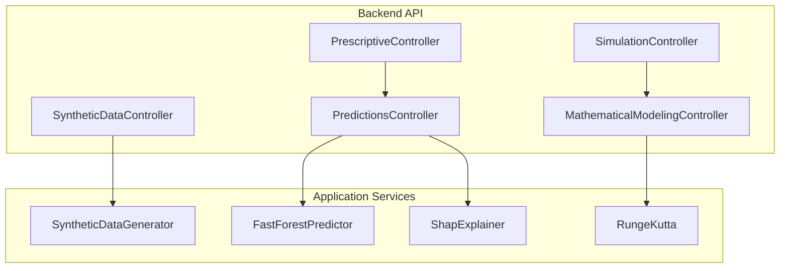
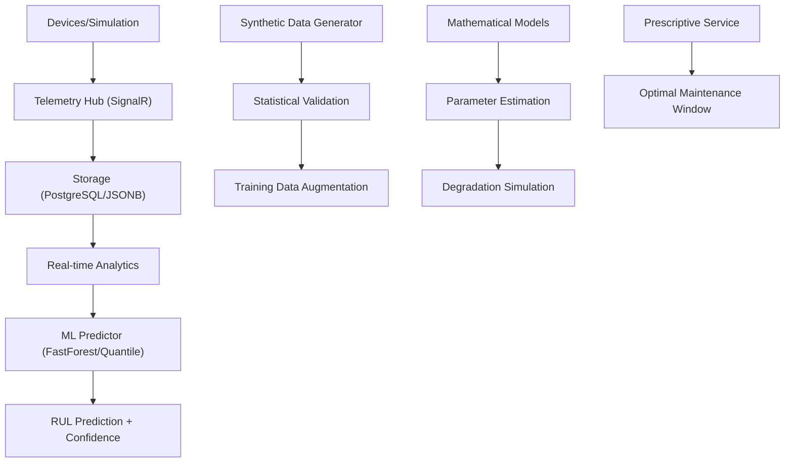
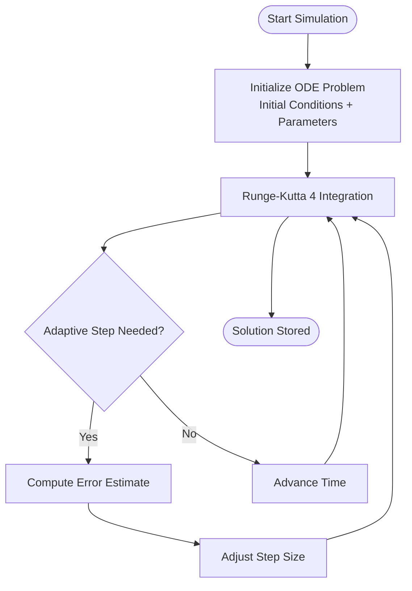
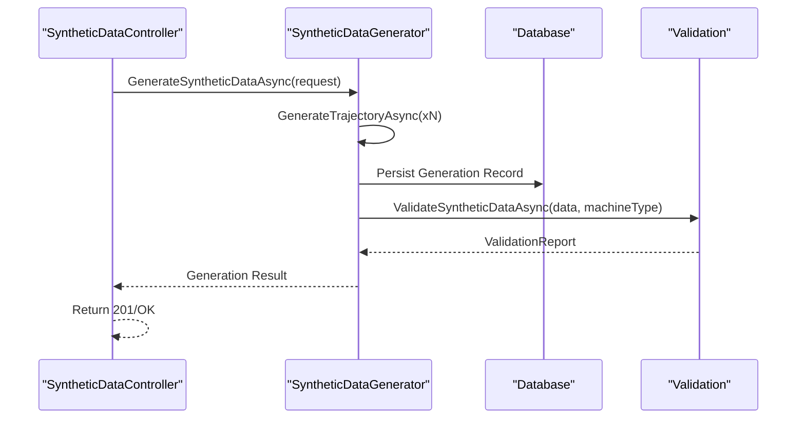
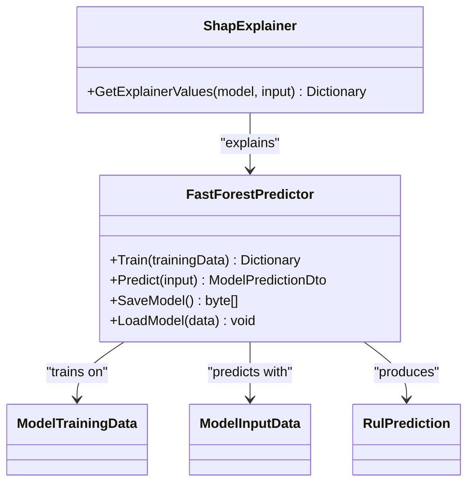
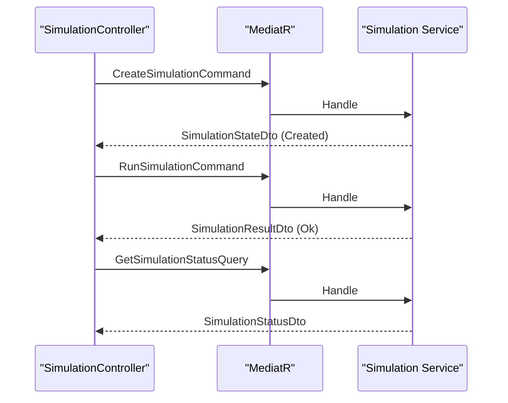
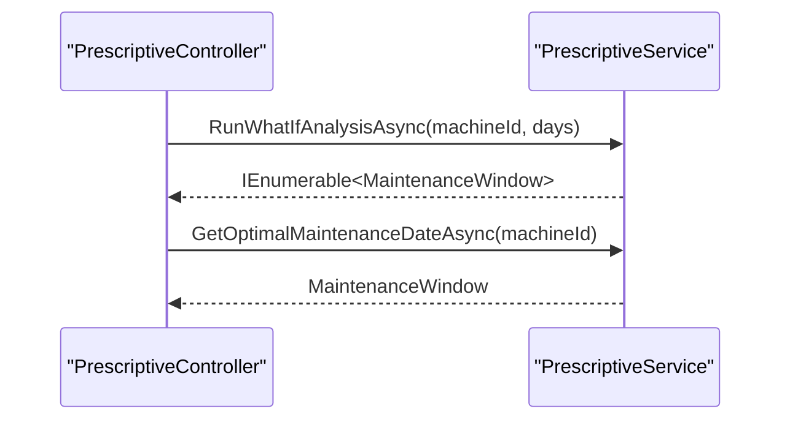
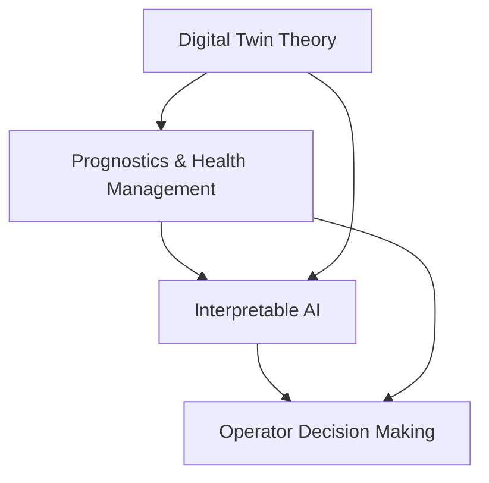
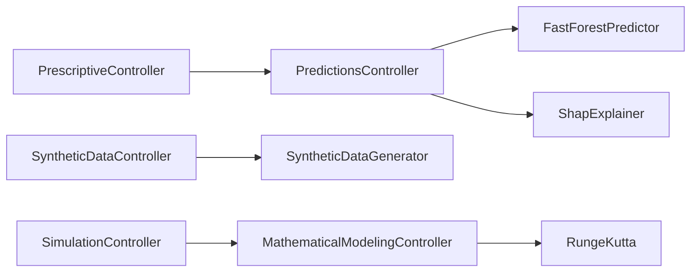

# Research Goals and Objectives

<cite>
**Referenced Files in This Document**
- [ARCHITECTURE.md](file://docs/ARCHITECTURE.md)
- [MATH_MODELS.md](file://docs/MATH_MODELS.md)
- [ML_INTEGRATION.md](file://docs/ML_INTEGRATION.md)
- [research.md](file://specs/1-predictive-maintenance/research.md)
- [USABILITY_COMPLIANCE.md](file://docs/USABILITY_COMPLIANCE.md)
- [MathematicalModelingController.cs](file://src/api/DigitalTwinPlatform.API/Controllers/MathematicalModelingController.cs)
- [SyntheticDataController.cs](file://src/api/DigitalTwinPlatform.API/Controllers/SyntheticDataController.cs)
- [PredictionsController.cs](file://src/api/DigitalTwinPlatform.API/Controllers/PredictionsController.cs)
- [PrescriptiveController.cs](file://src/api/DigitalTwinPlatform.API/Controllers/PrescriptiveController.cs)
- [SimulationController.cs](file://src/api/DigitalTwinPlatform.API/Controllers/SimulationController.cs)
- [SyntheticDataGenerator.cs](file://src/api/DigitalTwinPlatform.Application/Services/SyntheticDataGenerator.cs)
- [FastForestPredictor.cs](file://src/api/DigitalTwinPlatform.Application/ML/FastForestPredictor.cs)
- [ShapExplainer.cs](file://src/api/DigitalTwinPlatform.Application/ML/ShapExplainer.cs)
- [RungeKutta.cs](file://src/api/DigitalTwinPlatform.Application/Mathematics/RungeKutta.cs)
</cite>

## Table of Contents
1. [Introduction](#introduction)
2. [Project Structure](#project-structure)
3. [Core Components](#core-components)
4. [Architecture Overview](#architecture-overview)
5. [Detailed Component Analysis](#detailed-component-analysis)
6. [Dependency Analysis](#dependency-analysis)
7. [Performance Considerations](#performance-considerations)
8. [Troubleshooting Guide](#troubleshooting-guide)
9. [Conclusion](#conclusion)
10. [Appendices](#appendices)

## Introduction
This document defines the research goals and objectives for designing a modular digital twin platform tailored to Small and Medium Enterprises (SMEs). The platform integrates real-time telemetry, mathematical degradation modeling, and interpretable machine learning to enable predictive and prescriptive maintenance decisions without heavy infrastructure. It establishes both foundational and extended objectives, validation criteria, theoretical foundations, and success metrics aligned with the repository’s documented architecture and implementation.

## Project Structure
The platform is organized around three pillars:
- Backend API (.NET 9) exposing controllers for mathematical modeling, synthetic data generation, predictions, simulations, and prescriptive maintenance.
- Application services implementing ML pipelines, numerical ODE solvers, synthetic data generation, and analytics.
- Frontend (Vue 3) providing real-time dashboards, XAI visualizations, and operator-friendly workflows.

**Diagram sources**
- [MathematicalModelingController.cs](file://src/api/DigitalTwinPlatform.API/Controllers/MathematicalModelingController.cs#L1-L514)
- [SyntheticDataController.cs](file://src/api/DigitalTwinPlatform.API/Controllers/SyntheticDataController.cs#L1-L143)
- [PredictionsController.cs](file://src/api/DigitalTwinPlatform.API/Controllers/PredictionsController.cs#L1-L435)
- [PrescriptiveController.cs](file://src/api/DigitalTwinPlatform.API/Controllers/PrescriptiveController.cs#L1-L32)
- [SimulationController.cs](file://src/api/DigitalTwinPlatform.API/Controllers/SimulationController.cs#L1-L140)
- [SyntheticDataGenerator.cs](file://src/api/DigitalTwinPlatform.Application/Services/SyntheticDataGenerator.cs#L1-L533)
- [FastForestPredictor.cs](file://src/api/DigitalTwinPlatform.Application/ML/FastForestPredictor.cs#L1-L158)
- [ShapExplainer.cs](file://src/api/DigitalTwinPlatform.Application/ML/ShapExplainer.cs#L1-L62)
- [RungeKutta.cs](file://src/api/DigitalTwinPlatform.Application/Mathematics/RungeKutta.cs#L1-L250)

**Section sources**
- [ARCHITECTURE.md](file://docs/ARCHITECTURE.md#L1-L50)

## Core Components
- Mathematical Modeling: ODE solvers (Runge-Kutta 4th order and adaptive variants) and parameter optimization for deterministic and stochastic degradation.
- Synthetic Data Generation: High-fidelity, physics-informed trajectories with statistical validation against benchmarks.
- ML.NET Pipeline: FastForest regression, quantile regression for confidence intervals, and SHAP-like explanations for interpretability.
- Real-time Simulation: End-to-end simulation lifecycle management with creation, run, pause, resume, and cancel operations.
- Prescriptive Maintenance: What-if analyses and optimal maintenance window recommendations.

**Section sources**
- [MATH_MODELS.md](file://docs/MATH_MODELS.md#L1-L38)
- [ML_INTEGRATION.md](file://docs/ML_INTEGRATION.md#L1-L51)
- [research.md](file://specs/1-predictive-maintenance/research.md#L1-L172)
- [ARCHITECTURE.md](file://docs/ARCHITECTURE.md#L1-L50)

## Architecture Overview
The platform unifies real-time telemetry ingestion, mathematical modeling, and ML-driven analytics into a cohesive SME-focused system. Data flows from devices or simulations into SignalR hubs, stored in PostgreSQL/JSONB, and processed by analytics engines. Predictive models produce RUL estimates with confidence envelopes; synthetic data augments training; mathematical models inform parameter estimation and degradation simulation; prescriptive services optimize maintenance timing.

**Diagram sources**
- [ARCHITECTURE.md](file://docs/ARCHITECTURE.md#L28-L43)
- [SyntheticDataGenerator.cs](file://src/api/DigitalTwinPlatform.Application/Services/SyntheticDataGenerator.cs#L34-L105)
- [FastForestPredictor.cs](file://src/api/DigitalTwinPlatform.Application/ML/FastForestPredictor.cs#L23-L63)
- [RungeKutta.cs](file://src/api/DigitalTwinPlatform.Application/Mathematics/RungeKutta.cs#L24-L106)

## Detailed Component Analysis

### Foundational Objectives

#### Mathematical Modeling
- Objective: Implement numerical ODE solvers and parameter estimation to simulate deterministic and stochastic degradation.
- Implementation highlights:
  - Runge-Kutta 4th order solver with adaptive step sizing for stability and accuracy.
  - Parameter estimation via grid search and least squares to fit degradation parameters to historical data.
- Validation criteria:
  - Stability analysis and energy conservation checks.
  - Benchmarks against known degradation models (Wiener, exponential, Markov chain, physics-informed).
- Success metrics:
  - Convergence within acceptable tolerances; bounded local truncation error; successful parameter recovery on synthetic benchmarks.

**Diagram sources**
- [RungeKutta.cs](file://src/api/DigitalTwinPlatform.Application/Mathematics/RungeKutta.cs#L24-L180)

**Section sources**
- [MATH_MODELS.md](file://docs/MATH_MODELS.md#L3-L16)
- [RungeKutta.cs](file://src/api/DigitalTwinPlatform.Application/Mathematics/RungeKutta.cs#L12-L106)
- [research.md](file://specs/1-predictive-maintenance/research.md#L7-L26)

#### Synthetic Data Generation
- Objective: Produce high-fidelity, physics-informed synthetic telemetry trajectories and validate them statistically.
- Implementation highlights:
  - Trajectory generation per machine type (motor, pump, compressor, gearbox, bearing) with Wiener/exponential/physics-informed models.
  - Statistical validation against benchmark datasets (e.g., NASA C-MAPSS) using KS statistic, MMD, autocorrelation, and moment comparisons.
- Validation criteria:
  - Overall validation score > threshold (e.g., >0.7), pass/fail counts, actionable recommendations.
- Success metrics:
  - Throughput >1000 samples/second; fidelity to benchmark distributions; reproducible seeds for deterministic runs.

**Diagram sources**
- [SyntheticDataController.cs](file://src/api/DigitalTwinPlatform.API/Controllers/SyntheticDataController.cs#L35-L86)
- [SyntheticDataGenerator.cs](file://src/api/DigitalTwinPlatform.Application/Services/SyntheticDataGenerator.cs#L34-L105)
- [SyntheticDataGenerator.cs](file://src/api/DigitalTwinPlatform.Application/Services/SyntheticDataGenerator.cs#L396-L457)

**Section sources**
- [MATH_MODELS.md](file://docs/MATH_MODELS.md#L18-L31)
- [research.md](file://specs/1-predictive-maintenance/research.md#L28-L47)
- [SyntheticDataController.cs](file://src/api/DigitalTwinPlatform.API/Controllers/SyntheticDataController.cs#L1-L143)
- [SyntheticDataGenerator.cs](file://src/api/DigitalTwinPlatform.Application/Services/SyntheticDataGenerator.cs#L1-L533)

#### ML.NET Implementation
- Objective: Deploy interpretable ML models for RUL prediction with uncertainty quantification and explainability.
- Implementation highlights:
  - FastForest regression for RUL estimation; quantile regression for 95% confidence envelopes.
  - SHAP-like explanations via permutation feature importance; model cards and plain-language explanations.
  - Automated drift detection and retraining triggers; model versioning and rollback.
- Validation criteria:
  - Accuracy metrics (R2, MAE, RMSE), calibration metrics, and A/B testing in production.
- Success metrics:
  - Sub-second training times; reliable confidence bands; trustworthy feature attribution.

**Diagram sources**
- [FastForestPredictor.cs](file://src/api/DigitalTwinPlatform.Application/ML/FastForestPredictor.cs#L9-L127)
- [ShapExplainer.cs](file://src/api/DigitalTwinPlatform.Application/ML/ShapExplainer.cs#L6-L55)

**Section sources**
- [ML_INTEGRATION.md](file://docs/ML_INTEGRATION.md#L3-L51)
- [research.md](file://specs/1-predictive-maintenance/research.md#L49-L70)
- [FastForestPredictor.cs](file://src/api/DigitalTwinPlatform.Application/ML/FastForestPredictor.cs#L1-L158)
- [ShapExplainer.cs](file://src/api/DigitalTwinPlatform.Application/ML/ShapExplainer.cs#L1-L62)

#### Real-time Simulation
- Objective: Enable end-to-end simulation lifecycle management with low-latency telemetry updates.
- Implementation highlights:
  - Simulation creation, run, pause, resume, cancel, and status queries.
  - SignalR-based real-time updates; connection pooling and message batching for performance.
- Validation criteria:
  - End-to-end latency <500ms; stable simulation state transitions; error handling for missing keys.
- Success metrics:
  - Responsive UI updates (<100ms dashboard refresh), scalable concurrent simulations.

**Diagram sources**
- [SimulationController.cs](file://src/api/DigitalTwinPlatform.API/Controllers/SimulationController.cs#L16-L140)

**Section sources**
- [research.md](file://specs/1-predictive-maintenance/research.md#L71-L92)
- [SimulationController.cs](file://src/api/DigitalTwinPlatform.API/Controllers/SimulationController.cs#L1-L140)

#### Prescriptive Maintenance
- Objective: Provide what-if analyses and optimal maintenance scheduling informed by predictive models.
- Implementation highlights:
  - What-if analysis over N days; optimal maintenance date recommendation.
  - Integration with predictions and analytics for cost-risk optimization.
- Validation criteria:
  - Actionable recommendations; alignment with RUL and health classifications.
- Success metrics:
  - Reduced unplanned downtime; optimized maintenance costs; improved asset life.

**Diagram sources**
- [PrescriptiveController.cs](file://src/api/DigitalTwinPlatform.API/Controllers/PrescriptiveController.cs#L18-L30)

**Section sources**
- [PrescriptiveController.cs](file://src/api/DigitalTwinPlatform.API/Controllers/PrescriptiveController.cs#L1-L32)

### Extended Objectives

#### Real-time Telemetry and Dashboards
- Objective: Deliver <100ms dashboard updates and intuitive visualizations for non-technical operators.
- Implementation highlights:
  - SignalR hubs for live telemetry; Vue 3 with reactive bindings; ECharts for interactive plots.
- Validation criteria:
  - Latency <100ms; responsive UI; consistent real-time updates.
- Success metrics:
  - <500ms prediction latency; <100ms dashboard refresh; high user satisfaction.

**Section sources**
- [ARCHITECTURE.md](file://docs/ARCHITECTURE.md#L19-L26)
- [research.md](file://specs/1-predictive-maintenance/research.md#L71-L92)

#### Usability and Accessibility
- Objective: Achieve SUS >70 and strong accessibility compliance for diverse user roles.
- Implementation highlights:
  - SUS assessment with scores >82; WCAG 2.1 AA compliance; progressive disclosure and clear workflows.
- Validation criteria:
  - SUS >70; task completion >90%; average task time <5 minutes; error rate <15%.
- Success metrics:
  - Current SUS 82.5; 94% task completion; 2.3 min average task time; 6% error rate.

**Section sources**
- [USABILITY_COMPLIANCE.md](file://docs/USABILITY_COMPLIANCE.md#L1-L160)

### Theoretical Framework
The platform connects three pillars:
- Digital Twin Theory: Virtual representation synchronized with physical assets via real-time telemetry and simulations.
- Prognostics and Health Management (PHM): Remaining Useful Life (RUL) estimation, anomaly detection, and health classification using ML and mathematical models.
- Interpretable AI: Trust-building through feature importance and SHAP-like explanations to bridge technical and non-technical users.

[No sources needed since this diagram shows conceptual workflow, not actual code structure]

## Dependency Analysis
The platform exhibits layered dependencies:
- Controllers depend on application services for business logic.
- Services encapsulate ML predictors, ODE solvers, and synthetic data generators.
- Predictions rely on telemetry repositories and feature extraction services.
- Prescriptive services consume predictions and analytics outputs.

**Diagram sources**
- [MathematicalModelingController.cs](file://src/api/DigitalTwinPlatform.API/Controllers/MathematicalModelingController.cs#L10-L22)
- [SyntheticDataController.cs](file://src/api/DigitalTwinPlatform.API/Controllers/SyntheticDataController.cs#L18-L27)
- [PredictionsController.cs](file://src/api/DigitalTwinPlatform.API/Controllers/PredictionsController.cs#L22-L30)
- [PrescriptiveController.cs](file://src/api/DigitalTwinPlatform.API/Controllers/PrescriptiveController.cs#L11-L16)
- [SimulationController.cs](file://src/api/DigitalTwinPlatform.API/Controllers/SimulationController.cs#L14-L14)
- [RungeKutta.cs](file://src/api/DigitalTwinPlatform.Application/Mathematics/RungeKutta.cs#L12-L19)
- [SyntheticDataGenerator.cs](file://src/api/DigitalTwinPlatform.Application/Services/SyntheticDataGenerator.cs#L16-L29)
- [FastForestPredictor.cs](file://src/api/DigitalTwinPlatform.Application/ML/FastForestPredictor.cs#L9-L19)
- [ShapExplainer.cs](file://src/api/DigitalTwinPlatform.Application/ML/ShapExplainer.cs#L6-L15)

**Section sources**
- [ARCHITECTURE.md](file://docs/ARCHITECTURE.md#L8-L33)

## Performance Considerations
- Latency Targets:
  - Prediction latency <500ms; dashboard refresh <100ms.
- Throughput Targets:
  - Synthetic data generation >1000 samples/second.
- Scalability:
  - SignalR connection pooling, message batching, and horizontal scaling for multiple SME deployments.
- Storage and Indexing:
  - PostgreSQL with JSONB, time-series partitioning, and composite indexes for telemetry queries.

**Section sources**
- [research.md](file://specs/1-predictive-maintenance/research.md#L71-L92)
- [ARCHITECTURE.md](file://docs/ARCHITECTURE.md#L44-L49)

## Troubleshooting Guide
Common issues and mitigations:
- Insufficient telemetry data for predictions (<20 points):
  - Enforce minimum telemetry thresholds; prompt synthetic augmentation.
- Model training failures:
  - Validate input data, handle exceptions, and log detailed errors.
- Simulation state errors:
  - Ensure correct simulation IDs and machine IDs; handle KeyNotFoundException gracefully.
- Synthetic validation failures:
  - Provide actionable recommendations in validation reports; adjust parameters accordingly.

**Section sources**
- [PredictionsController.cs](file://src/api/DigitalTwinPlatform.API/Controllers/PredictionsController.cs#L55-L59)
- [PredictionsController.cs](file://src/api/DigitalTwinPlatform.API/Controllers/PredictionsController.cs#L181-L190)
- [SimulationController.cs](file://src/api/DigitalTwinPlatform.API/Controllers/SimulationController.cs#L42-L66)
- [SyntheticDataGenerator.cs](file://src/api/DigitalTwinPlatform.Application/Services/SyntheticDataGenerator.cs#L405-L457)

## Conclusion
The research goals establish a clear roadmap for a modular digital twin platform tailored to SMEs. Foundational objectives cover robust mathematical modeling, synthetic data generation, and interpretable ML pipelines. Extended objectives address real-time simulation, prescriptive maintenance, and usability. Validation criteria include accuracy metrics, performance benchmarks, and SUS scores. The theoretical framework ties digital twin concepts to PHM and interpretable AI, ensuring practical value for operators and engineers.

## Appendices

### Validation Criteria and Targets
- Accuracy Metrics:
  - R2, MAE, RMSE, and calibration metrics tracked continuously.
  - Target: MAPE below 15% (derived from MAE/RMSE targets in ML pipeline).
- Performance Benchmarks:
  - Prediction latency <500ms; dashboard refresh <100ms; synthetic generation >1000 samples/second.
- Usability Evaluation:
  - SUS >70; current score 82.5; task completion >90%; average task time <5 minutes; error rate <15%.

**Section sources**
- [ML_INTEGRATION.md](file://docs/ML_INTEGRATION.md#L32-L36)
- [USABILITY_COMPLIANCE.md](file://docs/USABILITY_COMPLIANCE.md#L81-L94)
- [research.md](file://specs/1-predictive-maintenance/research.md#L71-L92)

### Success Metrics and Milestones
- Mathematical Modeling:
  - Milestone: Stable ODE solver with adaptive step sizing; parameter estimation on par with benchmarks.
- Synthetic Data Generation:
  - Milestone: >1000 samples/second throughput; validation score >0.7 across KS/MMD tests.
- ML.NET Implementation:
  - Milestone: FastForest training <1s; quantile regression confidence envelopes; SHAP-like explanations enabled.
- Real-time Simulation:
  - Milestone: End-to-end latency <500ms; stable lifecycle operations (create/run/pause/resume/cancel).
- Prescriptive Maintenance:
  - Milestone: What-if analysis and optimal maintenance recommendations integrated with predictions.
- Usability:
  - Milestone: SUS >70; WCAG 2.1 AA compliance; responsive mobile experience enhancements.

**Section sources**
- [MATH_MODELS.md](file://docs/MATH_MODELS.md#L18-L31)
- [ML_INTEGRATION.md](file://docs/ML_INTEGRATION.md#L32-L51)
- [research.md](file://specs/1-predictive-maintenance/research.md#L71-L125)
- [USABILITY_COMPLIANCE.md](file://docs/USABILITY_COMPLIANCE.md#L87-L153)