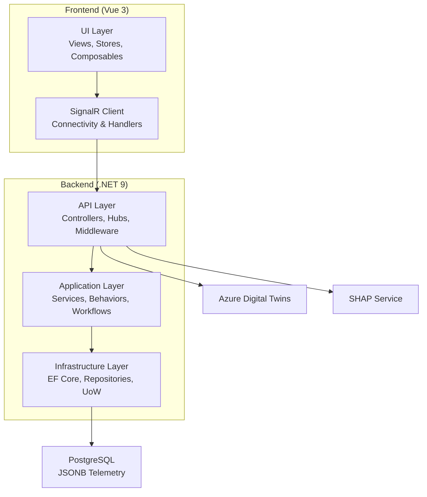
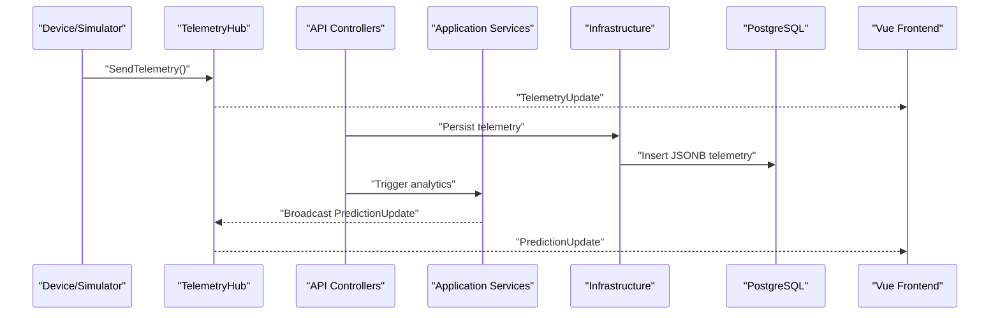
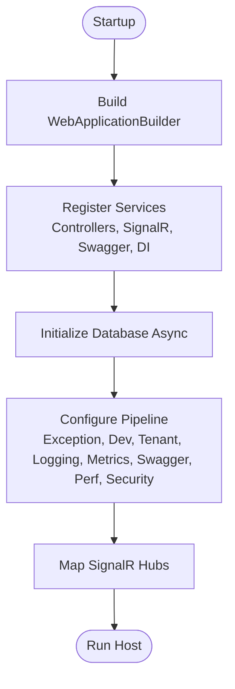
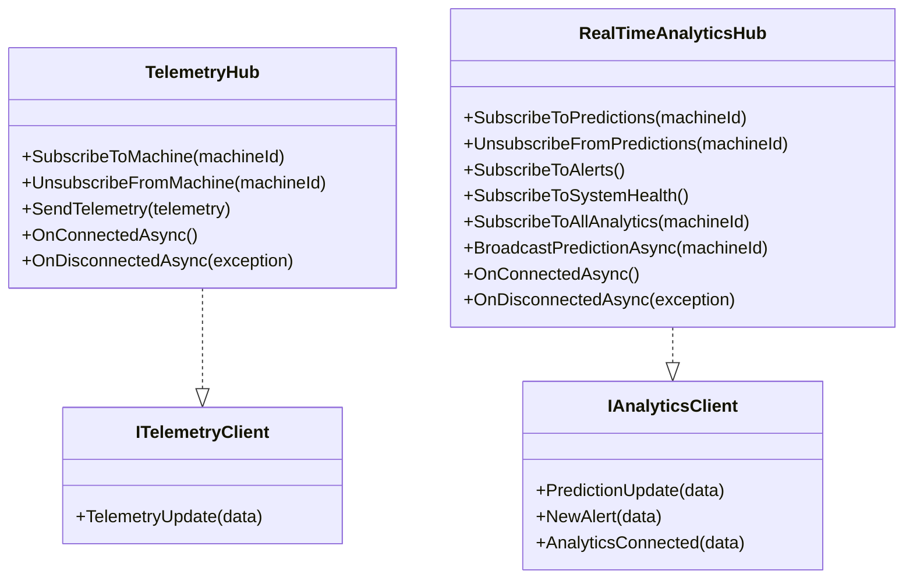
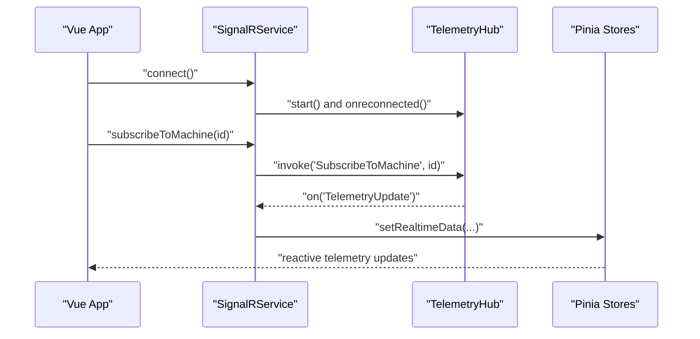
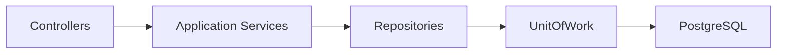
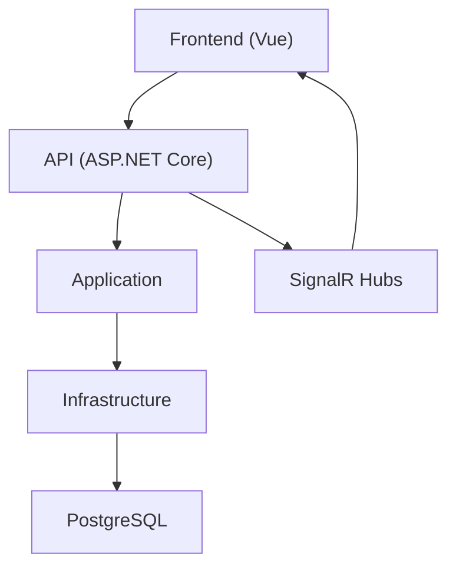
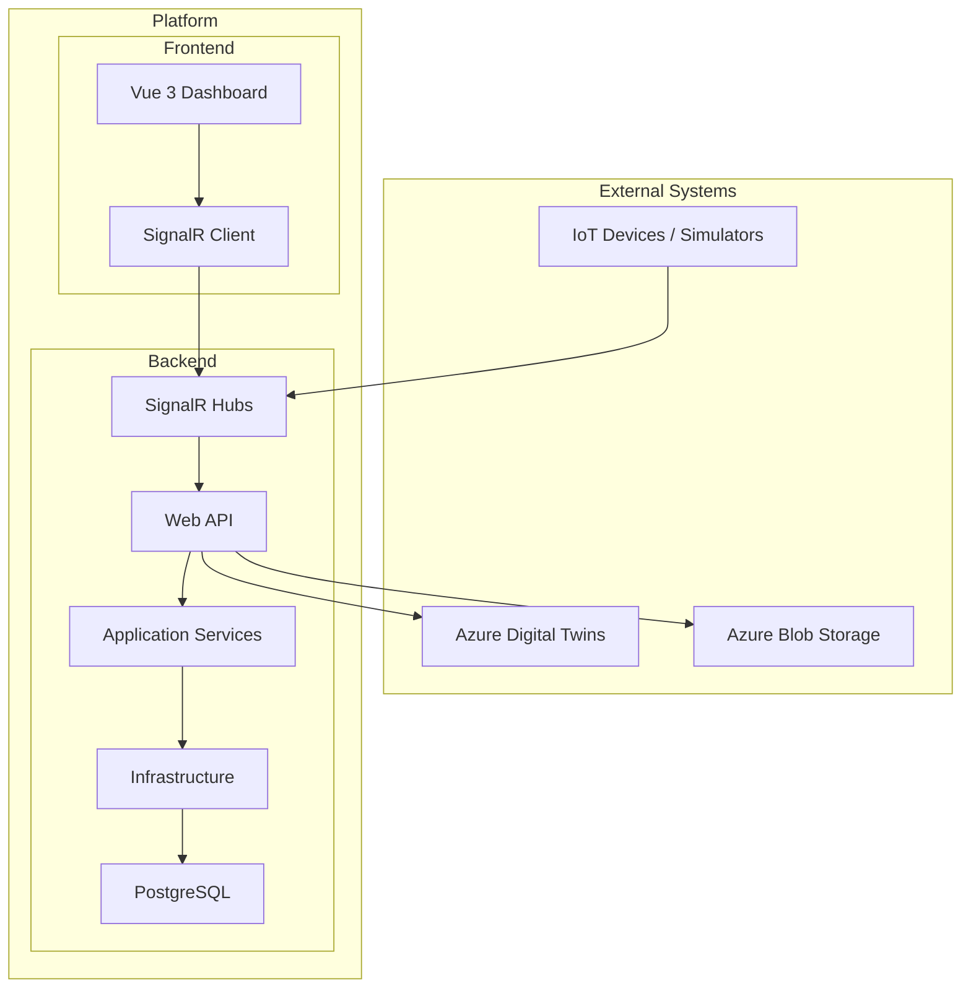

# System Architecture Overview

<cite>
**Referenced Files in This Document**
- [Program.cs](file://src/api/DigitalTwinPlatform.API/Program.cs)
- [ServiceCollectionExtensions.cs](file://src/api/DigitalTwinPlatform.API/Extensions/ServiceCollectionExtensions.cs)
- [TelemetryHub.cs](file://src/api/DigitalTwinPlatform.API/Hubs/TelemetryHub.cs)
- [RealTimeAnalyticsHub.cs](file://src/api/DigitalTwinPlatform.API/Hubs/RealTimeAnalyticsHub.cs)
- [appsettings.json](file://src/api/DigitalTwinPlatform.API/appsettings.json)
- [Dockerfile.api](file://src/api/DigitalTwinPlatform.API/Dockerfile.api)
- [Dockerfile.ui](file://src/frontend/Dockerfile.ui)
- [main.ts](file://src/frontend/src/main.ts)
- [signalr.ts](file://src/frontend/src/services/signalr.ts)
- [useSignalRCharts.ts](file://src/frontend/src/composables/useSignalRCharts.ts)
- [DependencyInjection.cs (Application)](file://src/api/DigitalTwinPlatform.Application/DependencyInjection.cs)
- [DependencyInjection.cs (Infrastructure)](file://src/api/DigitalTwinPlatform.Infrastructure/DependencyInjection.cs)
- [ARCHITECTURE.md](file://docs/ARCHITECTURE.md)
</cite>

## Table of Contents
1. [Introduction](#introduction)
2. [Project Structure](#project-structure)
3. [Core Components](#core-components)
4. [Architecture Overview](#architecture-overview)
5. [Detailed Component Analysis](#detailed-component-analysis)
6. [Dependency Analysis](#dependency-analysis)
7. [Performance Considerations](#performance-considerations)
8. [Troubleshooting Guide](#troubleshooting-guide)
9. [Conclusion](#conclusion)
10. [Appendices](#appendices)

## Introduction
This document presents the system architecture for a modular, domain-oriented Digital Twin Platform tailored for Small and Medium Enterprises (SMEs). The platform integrates synthetic data generation, digital twin simulation core, prognostic analytics, interpretability layer, data and API layer, and a web-based visualization layer. It follows an event-driven interaction model powered by SignalR for real-time telemetry and analytics, backed by .NET 9 for the backend, Vue 3 for the frontend, PostgreSQL for persistence, and optional integrations with Azure Digital Twins and storage.

The architecture emphasizes:
- Modularity: Clear separation of concerns across domains (simulation, analytics, math modeling, ML, telemetry).
- Configuration over code: Extensive use of configuration for models, thresholds, and feature sets.
- Extensibility: Pluggable services, hosted workers, and environment-aware integrations.

## Project Structure
The repository is organized into layered modules:
- API Layer: ASP.NET Core Web API hosting controllers, SignalR hubs, middleware, and DI configuration.
- Application Layer: Domain services, workflows, validators, and cross-cutting behaviors.
- Infrastructure Layer: Persistence, repositories, unit of work, and tenant isolation.
- Frontend: Vue 3 application with Pinia stores, SignalR client, and real-time charting composables.
- Supporting: Docs, Terraform, monitoring, and Dockerfiles for containers.

**Diagram sources**
- [Program.cs](file://src/api/DigitalTwinPlatform.API/Program.cs#L12-L80)
- [DependencyInjection.cs (Application)](file://src/api/DigitalTwinPlatform.Application/DependencyInjection.cs#L15-L56)
- [DependencyInjection.cs (Infrastructure)](file://src/api/DigitalTwinPlatform.Infrastructure/DependencyInjection.cs#L16-L44)
- [signalr.ts](file://src/frontend/src/services/signalr.ts#L55-L110)

**Section sources**
- [Program.cs](file://src/api/DigitalTwinPlatform.API/Program.cs#L12-L80)
- [DependencyInjection.cs (Application)](file://src/api/DigitalTwinPlatform.Application/DependencyInjection.cs#L15-L56)
- [DependencyInjection.cs (Infrastructure)](file://src/api/DigitalTwinPlatform.Infrastructure/DependencyInjection.cs#L16-L44)
- [ARCHITECTURE.md](file://docs/ARCHITECTURE.md#L1-L50)

## Core Components
- Backend (.NET 9 Web API)
  - Controllers expose domain capabilities (machines, telemetry, predictions, alerts, simulations).
  - SignalR hubs provide real-time telemetry and analytics streaming.
  - DI extensions register analytics, simulation, ML, math modeling, and infrastructure services.
  - Middleware pipeline handles global exceptions, performance metrics, security, and tenant context.
- Application Layer
  - MediatR-based pipeline with validation, logging, exception handling, performance, retry, authorization, audit, and caching behaviors.
  - Domain services for predictive analytics, simulation orchestration, parameter estimation, and maintenance.
- Infrastructure Layer
  - Entity Framework DbContext with tenant schema interceptor.
  - Repositories and Unit of Work for transactional boundaries.
  - Exporters and hosted services for telemetry and simulation.
- Frontend (Vue 3)
  - SignalR client connects to hubs, maps backend DTOs to frontend types, and manages reconnections.
  - Composables buffer and render real-time telemetry and predictions with configurable rates.
  - Stores manage state for telemetry, alerts, machines, and predictions.

**Section sources**
- [Program.cs](file://src/api/DigitalTwinPlatform.API/Program.cs#L14-L80)
- [ServiceCollectionExtensions.cs](file://src/api/DigitalTwinPlatform.API/Extensions/ServiceCollectionExtensions.cs#L106-L132)
- [DependencyInjection.cs (Application)](file://src/api/DigitalTwinPlatform.Application/DependencyInjection.cs#L20-L56)
- [DependencyInjection.cs (Infrastructure)](file://src/api/DigitalTwinPlatform.Infrastructure/DependencyInjection.cs#L22-L43)
- [signalr.ts](file://src/frontend/src/services/signalr.ts#L43-L110)
- [useSignalRCharts.ts](file://src/frontend/src/composables/useSignalRCharts.ts#L26-L145)

## Architecture Overview
The system follows a domain-driven, event-driven architecture:
- Event producers: Telemetry devices or simulation engine emit sensor data.
- Event consumers: SignalR hubs distribute telemetry and analytics to subscribed clients.
- Domain processors: Application services transform data into predictions, alerts, and insights.
- Persistence: PostgreSQL stores structured and JSONB telemetry for fast queries and analytics.
- Optional integrations: Azure Digital Twins for digital twin lifecycle and Azure Blob Storage for artifacts.

**Diagram sources**
- [TelemetryHub.cs](file://src/api/DigitalTwinPlatform.API/Hubs/TelemetryHub.cs#L109-L118)
- [RealTimeAnalyticsHub.cs](file://src/api/DigitalTwinPlatform.API/Hubs/RealTimeAnalyticsHub.cs#L196-L222)
- [DependencyInjection.cs (Application)](file://src/api/DigitalTwinPlatform.Application/DependencyInjection.cs#L52-L54)
- [DependencyInjection.cs (Infrastructure)](file://src/api/DigitalTwinPlatform.Infrastructure/DependencyInjection.cs#L33-L43)

## Detailed Component Analysis

### Backend Entry Point and Middleware Pipeline
- Program.cs orchestrates builder setup, DI registration, database initialization, middleware, Swagger, and hub mapping.
- Middleware includes global exception handling, development diagnostics, tenant context, structured logging, metrics, performance monitoring, and security middleware.
- SignalR hubs are mapped at /hubs/telemetry and /hubs/analytics.

**Diagram sources**
- [Program.cs](file://src/api/DigitalTwinPlatform.API/Program.cs#L12-L80)

**Section sources**
- [Program.cs](file://src/api/DigitalTwinPlatform.API/Program.cs#L12-L80)

### SignalR Hubs: Telemetry and Real-Time Analytics
- TelemetryHub
  - Manages per-machine groups for targeted streaming.
  - Supports subscription/unsubscription and broadcasting telemetry events.
  - Tracks connections and cleans up on disconnect.
- RealTimeAnalyticsHub
  - Subscribes clients to predictions, alerts, and system health.
  - Broadcasts latest predictions to subscribed groups.
  - Emits connection confirmations and handles graceful disconnects.

**Diagram sources**
- [TelemetryHub.cs](file://src/api/DigitalTwinPlatform.API/Hubs/TelemetryHub.cs#L12-L184)
- [RealTimeAnalyticsHub.cs](file://src/api/DigitalTwinPlatform.API/Hubs/RealTimeAnalyticsHub.cs#L14-L245)

**Section sources**
- [TelemetryHub.cs](file://src/api/DigitalTwinPlatform.API/Hubs/TelemetryHub.cs#L12-L184)
- [RealTimeAnalyticsHub.cs](file://src/api/DigitalTwinPlatform.API/Hubs/RealTimeAnalyticsHub.cs#L14-L245)

### Frontend SignalR Client and Real-Time Charting
- signalr.ts
  - Establishes SignalR connection with automatic reconnection and token-based access.
  - Registers handlers for telemetry, alerts, and predictions.
  - Maps backend DTOs to frontend types and updates stores.
- useSignalRCharts.ts
  - Buffers incoming updates to limit rendering overhead.
  - Computes normalized sensor readings and exposes reactive chart datasets.
  - Subscribes/unsubscribes to machine streams and manages lifecycle.

**Diagram sources**
- [signalr.ts](file://src/frontend/src/services/signalr.ts#L55-L110)
- [signalr.ts](file://src/frontend/src/services/signalr.ts#L148-L166)
- [useSignalRCharts.ts](file://src/frontend/src/composables/useSignalRCharts.ts#L137-L164)

**Section sources**
- [signalr.ts](file://src/frontend/src/services/signalr.ts#L43-L110)
- [signalr.ts](file://src/frontend/src/services/signalr.ts#L148-L266)
- [useSignalRCharts.ts](file://src/frontend/src/composables/useSignalRCharts.ts#L26-L145)

### Data and API Layer: Controllers, Services, and Persistence
- Controllers (e.g., MachinesController, TelemetryController, PredictionsController) expose domain capabilities.
- Application services encapsulate analytics, simulation, ML, and maintenance logic.
- Infrastructure provides EF Core DbContext, repositories, and Unit of Work with tenant isolation.

**Diagram sources**
- [DependencyInjection.cs (Application)](file://src/api/DigitalTwinPlatform.Application/DependencyInjection.cs#L20-L56)
- [DependencyInjection.cs (Infrastructure)](file://src/api/DigitalTwinPlatform.Infrastructure/DependencyInjection.cs#L33-L43)

**Section sources**
- [DependencyInjection.cs (Application)](file://src/api/DigitalTwinPlatform.Application/DependencyInjection.cs#L15-L56)
- [DependencyInjection.cs (Infrastructure)](file://src/api/DigitalTwinPlatform.Infrastructure/DependencyInjection.cs#L16-L44)

### Technology Stack and Configuration
- Backend: .NET 9, ASP.NET Core, SignalR, MediatR, FluentValidation, AutoMapper, Swagger.
- Frontend: Vue 3, TypeScript, Pinia, Axios, ApexCharts, TailwindCSS.
- Database: PostgreSQL with JSONB for telemetry.
- Real-time: SignalR hubs with connection pooling and reconnection.
- Optional integrations: Azure Digital Twins and Blob Storage.
- Configuration: appsettings.json defines JWT, SignalR, Simulation, ML, Performance, SHAP, and Drift Detection settings.

**Section sources**
- [appsettings.json](file://src/api/DigitalTwinPlatform.API/appsettings.json#L1-L93)
- [ARCHITECTURE.md](file://docs/ARCHITECTURE.md#L35-L49)

## Dependency Analysis
The system exhibits clean layering with explicit dependencies:
- API depends on Application and Infrastructure.
- Application depends on domain abstractions and registers MediatR behaviors.
- Infrastructure depends on EF Core and provides repositories and UoW.
- Frontend depends on SignalR client and communicates with API endpoints and hubs.

**Diagram sources**
- [Program.cs](file://src/api/DigitalTwinPlatform.API/Program.cs#L42-L47)
- [DependencyInjection.cs (Application)](file://src/api/DigitalTwinPlatform.Application/DependencyInjection.cs#L15-L56)
- [DependencyInjection.cs (Infrastructure)](file://src/api/DigitalTwinPlatform.Infrastructure/DependencyInjection.cs#L16-L44)

**Section sources**
- [Program.cs](file://src/api/DigitalTwinPlatform.API/Program.cs#L42-L47)
- [DependencyInjection.cs (Application)](file://src/api/DigitalTwinPlatform.Application/DependencyInjection.cs#L15-L56)
- [DependencyInjection.cs (Infrastructure)](file://src/api/DigitalTwinPlatform.Infrastructure/DependencyInjection.cs#L16-L44)

## Performance Considerations
- Real-time throughput: SignalR hubs configured with keep-alive, handshake timeouts, and maximum receive sizes.
- Frontend buffering: Chart composables limit updates to reduce rendering overhead while preserving responsiveness.
- Prediction caching: ML prediction caching reduces repeated computation.
- Latency thresholds: Configuration defines acceptable thresholds for digital twin updates, prediction generation, and simulation steps.
- Container optimizations: .NET 9 Alpine images with trimming, single-file publishing, and non-root users.

**Section sources**
- [ServiceCollectionExtensions.cs](file://src/api/DigitalTwinPlatform.API/Extensions/ServiceCollectionExtensions.cs#L115-L129)
- [useSignalRCharts.ts](file://src/frontend/src/composables/useSignalRCharts.ts#L12-L17)
- [appsettings.json](file://src/api/DigitalTwinPlatform.API/appsettings.json#L74-L78)
- [Dockerfile.api](file://src/api/DigitalTwinPlatform.API/Dockerfile.api#L33-L51)

## Troubleshooting Guide
- SignalR connectivity
  - Verify hub URLs and token injection in the frontend SignalR client.
  - Inspect connection state and last error refs for reconnection logs.
- Authentication and authorization
  - Ensure JWT key length and issuer/audience match configuration.
  - Confirm antiforgery cookie settings and CORS origins.
- Database initialization
  - Confirm connection string and migrations applied during startup.
- Real-time streaming
  - Check hub group membership and subscription cleanup on disconnect.
  - Validate maximum message size and parallel invocations per client.

**Section sources**
- [signalr.ts](file://src/frontend/src/services/signalr.ts#L55-L110)
- [ServiceCollectionExtensions.cs](file://src/api/DigitalTwinPlatform.API/Extensions/ServiceCollectionExtensions.cs#L377-L401)
- [Program.cs](file://src/api/DigitalTwinPlatform.API/Program.cs#L55-L58)
- [TelemetryHub.cs](file://src/api/DigitalTwinPlatform.API/Hubs/TelemetryHub.cs#L150-L183)

## Conclusion
The Digital Twin Platform employs a modular, domain-oriented architecture with clear separation of concerns and robust real-time capabilities. The event-driven model, powered by SignalR, enables low-latency telemetry and analytics delivery to the Vue-based frontend. Extensive configuration supports SME-friendly operation, while DI and layered architecture promote maintainability and extensibility. Optional integrations with Azure services and containerized deployments further enhance scalability and portability.

## Appendices

### System Context Diagram

**Diagram sources**
- [ARCHITECTURE.md](file://docs/ARCHITECTURE.md#L28-L34)
- [Program.cs](file://src/api/DigitalTwinPlatform.API/Program.cs#L76-L78)
- [ServiceCollectionExtensions.cs](file://src/api/DigitalTwinPlatform.API/Extensions/ServiceCollectionExtensions.cs#L406-L421)

### Deployment Topology Notes
- Containers
  - API: .NET 9 Alpine with trimming and single-file publish; exposed on port 8080; health check endpoint included.
  - UI: Nginx Alpine serving built SPA; exposed on port 80.
- Observability
  - Structured logging, metrics, and health checks integrated at startup and middleware.
- Scalability
  - SignalR scaling considerations (e.g., Redis backplane) can be enabled via configuration keys.
  - Horizontal scaling supported by stateless API and shared database.

**Section sources**
- [Dockerfile.api](file://src/api/DigitalTwinPlatform.API/Dockerfile.api#L23-L70)
- [Dockerfile.ui](file://src/frontend/Dockerfile.ui#L9-L12)
- [Program.cs](file://src/api/DigitalTwinPlatform.API/Program.cs#L28-L32)
- [appsettings.json](file://src/api/DigitalTwinPlatform.API/appsettings.json#L19-L23)