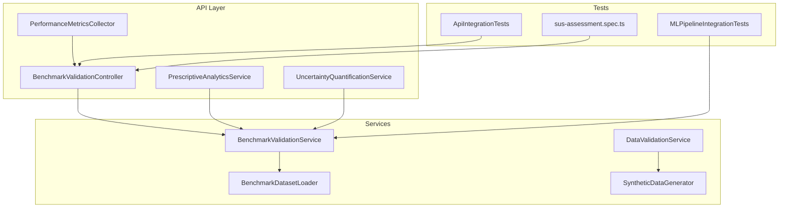
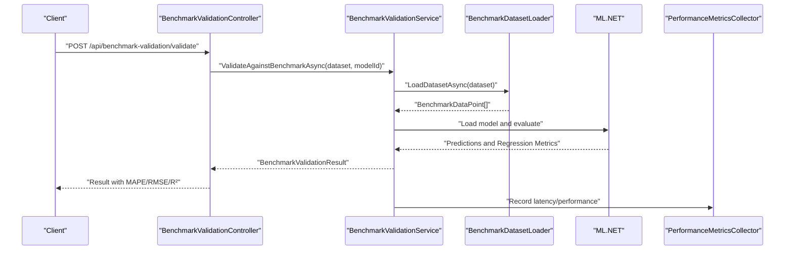
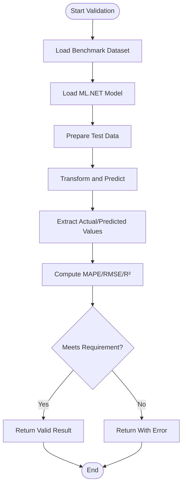
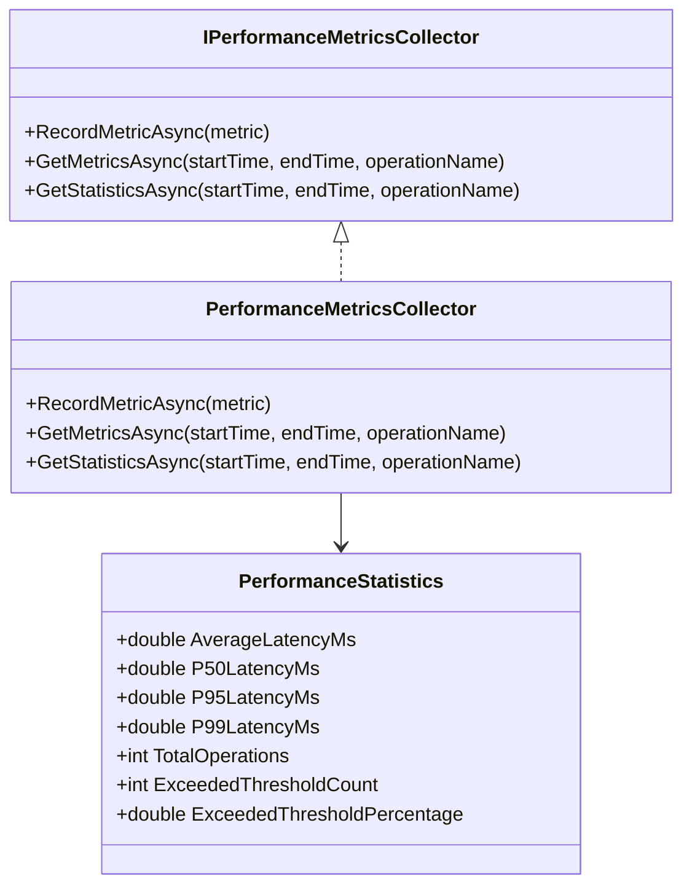
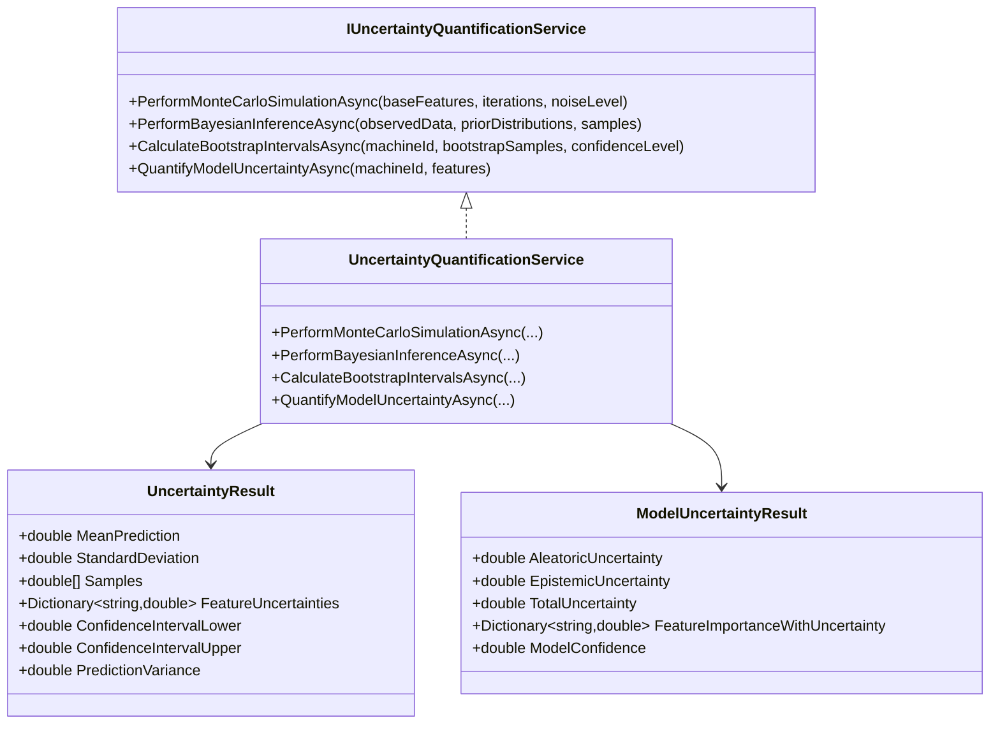
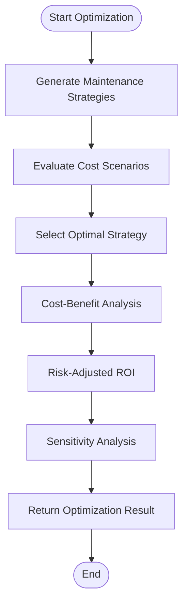
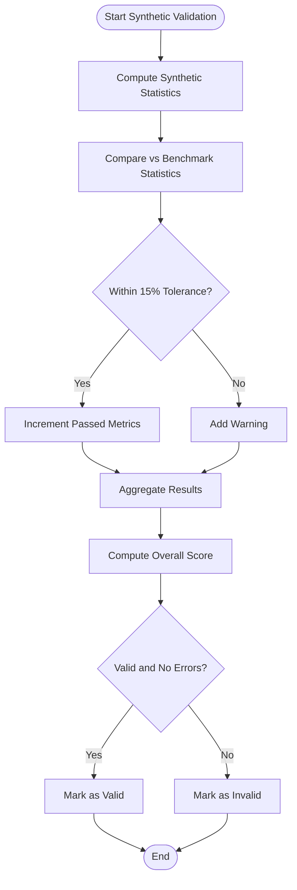
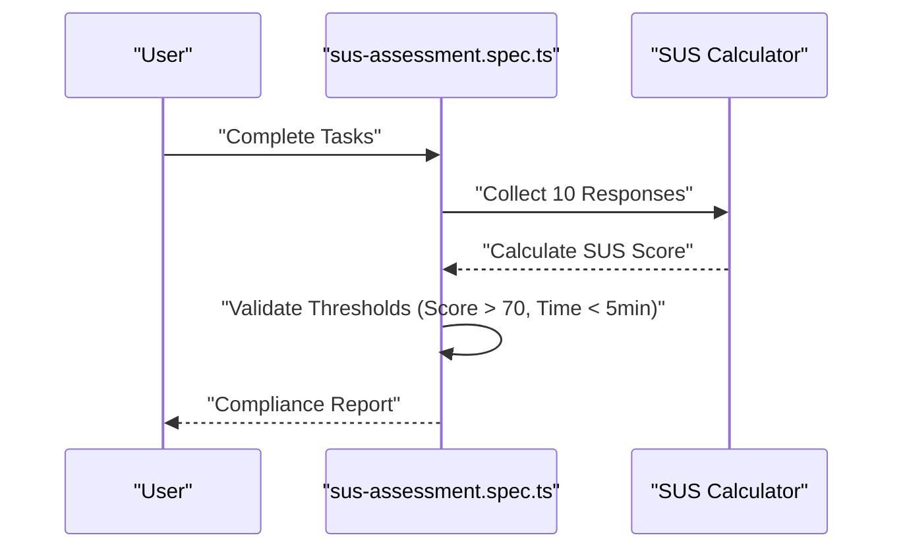
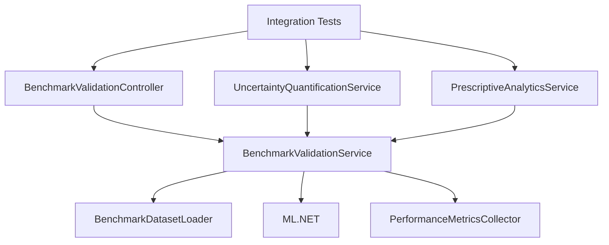

# Validation and Evaluation Methodology

<cite>
**Referenced Files in This Document**
- [BenchmarkValidationController.cs](file://src/api/DigitalTwinPlatform.API/Controllers/BenchmarkValidationController.cs)
- [IBenchmarkValidationService.cs](file://src/api/DigitalTwinPlatform.API/Services/Analytics/IBenchmarkValidationService.cs)
- [BenchmarkValidationService.cs](file://src/api/DigitalTwinPlatform.API/Services/Analytics/BenchmarkValidationService.cs)
- [IBenchmarkDatasetLoader.cs](file://src/api/DigitalTwinPlatform.API/Services/Analytics/IBenchmarkDatasetLoader.cs)
- [BenchmarkDatasetLoader.cs](file://src/api/DigitalTwinPlatform.API/Services/Analytics/BenchmarkDatasetLoader.cs)
- [IPerformanceMetricsCollector.cs](file://src/api/DigitalTwinPlatform.API/Services/Infrastructure/IPerformanceMetricsCollector.cs)
- [PerformanceMetricsCollector.cs](file://src/api/DigitalTwinPlatform.API/Services/Infrastructure/PerformanceMetricsCollector.cs)
- [IUncertaintyQuantificationService.cs](file://src/api/DigitalTwinPlatform.API/Services/Analytics/IUncertaintyQuantificationService.cs)
- [UncertaintyQuantificationService.cs](file://src/api/DigitalTwinPlatform.API/Services/Analytics/UncertaintyQuantificationService.cs)
- [PrescriptiveAnalyticsService.cs](file://src/api/DigitalTwinPlatform.API/Services/Analytics/Advanced/PrescriptiveAnalyticsService.cs)
- [ApiIntegrationTests.cs](file://src/api/DigitalTwinPlatform.Tests/Integration/ApiIntegrationTests.cs)
- [MLPipelineIntegrationTests.cs](file://src/api/DigitalTwinPlatform.Tests/Integration/MLPipelineIntegrationTests.cs)
- [sus-assessment.spec.ts](file://src/ui/digital-twin-dashboard/e2e/sus-assessment.spec.ts)
- [USABILITY_COMPLIANCE.md](file://docs/USABILITY_COMPLIANCE.md)
- [DataValidationService.cs](file://src/api/DigitalTwinPlatform.API/Services/Simulation/DataValidationService.cs)
- [SyntheticDataGenerator.cs](file://src/api/DigitalTwinPlatform.API/Services/Simulation/SyntheticDataGenerator.cs)
</cite>

## Table of Contents
1. [Introduction](#introduction)
2. [Project Structure](#project-structure)
3. [Core Components](#core-components)
4. [Architecture Overview](#architecture-overview)
5. [Detailed Component Analysis](#detailed-component-analysis)
6. [Dependency Analysis](#dependency-analysis)
7. [Performance Considerations](#performance-considerations)
8. [Troubleshooting Guide](#troubleshooting-guide)
9. [Conclusion](#conclusion)
10. [Appendices](#appendices)

## Introduction
This document defines the validation and evaluation methodology for the Digital Twin Platform. It covers quantitative metrics (prognostic accuracy, system latency and throughput, synthetic data validation), end-to-end integration testing, and qualitative usability assessment using the System Usability Scale (SUS). It also outlines extended evaluation approaches including scenario-based maintenance optimization, comparative analysis against reactive and scheduled maintenance, cost-benefit and risk trade-off assessment, and sensitivity analysis under uncertainty. Specific benchmark datasets (NASA C-MAPSS and FEMTO Bearing Dataset) are integrated into the validation pipeline, alongside synthetic datasets for controlled experiments.

## Project Structure
The validation and evaluation capabilities are distributed across:
- API controllers and services for benchmark validation and uncertainty quantification
- Performance metrics collection and reporting
- Prescriptive analytics for maintenance optimization and cost-benefit analysis
- Frontend E2E tests for SUS assessment
- Integration tests covering ML pipeline, synthetic data generation, and drift detection

**Diagram sources**
- [BenchmarkValidationController.cs](file://src/api/DigitalTwinPlatform.API/Controllers/BenchmarkValidationController.cs#L1-L114)
- [PrescriptiveAnalyticsService.cs](file://src/api/DigitalTwinPlatform.API/Services/Analytics/Advanced/PrescriptiveAnalyticsService.cs#L280-L881)
- [UncertaintyQuantificationService.cs](file://src/api/DigitalTwinPlatform.API/Services/Analytics/UncertaintyQuantificationService.cs#L1-L384)
- [PerformanceMetricsCollector.cs](file://src/api/DigitalTwinPlatform.API/Services/Infrastructure/PerformanceMetricsCollector.cs#L38-L130)
- [BenchmarkDatasetLoader.cs](file://src/api/DigitalTwinPlatform.API/Services/Analytics/BenchmarkDatasetLoader.cs#L69-L211)
- [BenchmarkValidationService.cs](file://src/api/DigitalTwinPlatform.API/Services/Analytics/BenchmarkValidationService.cs#L76-L171)
- [DataValidationService.cs](file://src/api/DigitalTwinPlatform.API/Services/Simulation/DataValidationService.cs#L1-L77)
- [SyntheticDataGenerator.cs](file://src/api/DigitalTwinPlatform.API/Services/Simulation/SyntheticDataGenerator.cs#L160-L305)
- [ApiIntegrationTests.cs](file://src/api/DigitalTwinPlatform.Tests/Integration/ApiIntegrationTests.cs#L1-L465)
- [MLPipelineIntegrationTests.cs](file://src/api/DigitalTwinPlatform.Tests/Integration/MLPipelineIntegrationTests.cs#L1-L743)
- [sus-assessment.spec.ts](file://src/ui/digital-twin-dashboard/e2e/sus-assessment.spec.ts#L85-L350)

**Section sources**
- [BenchmarkValidationController.cs](file://src/api/DigitalTwinPlatform.API/Controllers/BenchmarkValidationController.cs#L1-L114)
- [BenchmarkValidationService.cs](file://src/api/DigitalTwinPlatform.API/Services/Analytics/BenchmarkValidationService.cs#L76-L171)
- [BenchmarkDatasetLoader.cs](file://src/api/DigitalTwinPlatform.API/Services/Analytics/BenchmarkDatasetLoader.cs#L69-L211)
- [PerformanceMetricsCollector.cs](file://src/api/DigitalTwinPlatform.API/Services/Infrastructure/PerformanceMetricsCollector.cs#L38-L130)
- [PrescriptiveAnalyticsService.cs](file://src/api/DigitalTwinPlatform.API/Services/Analytics/Advanced/PrescriptiveAnalyticsService.cs#L280-L881)
- [UncertaintyQuantificationService.cs](file://src/api/DigitalTwinPlatform.API/Services/Analytics/UncertaintyQuantificationService.cs#L1-L384)
- [ApiIntegrationTests.cs](file://src/api/DigitalTwinPlatform.Tests/Integration/ApiIntegrationTests.cs#L1-L465)
- [MLPipelineIntegrationTests.cs](file://src/api/DigitalTwinPlatform.Tests/Integration/MLPipelineIntegrationTests.cs#L1-L743)
- [sus-assessment.spec.ts](file://src/ui/digital-twin-dashboard/e2e/sus-assessment.spec.ts#L85-L350)

## Core Components
- Benchmark validation pipeline: Loads datasets, evaluates ML models using MAPE, RMSE, and R², and produces detailed metrics and acceptability criteria.
- Performance metrics collector: Aggregates latency percentiles and threshold exceedances for operational SLA monitoring.
- Uncertainty quantification: Provides Monte Carlo, Bayesian, bootstrap confidence intervals, and model uncertainty decomposition.
- Prescriptive analytics: Implements scenario-based maintenance optimization, cost-benefit analysis, risk-adjusted ROI, and sensitivity analysis.
- Synthetic data validation: Compares generated data statistics against benchmarks with pass/fail thresholds.
- Integration tests: Validate end-to-end workflows including ML training, benchmark validation, drift detection, and uncertainty analysis.
- SUS usability assessment: Quantifies user experience using standardized SUS scoring and task completion metrics.

**Section sources**
- [IBenchmarkValidationService.cs](file://src/api/DigitalTwinPlatform.API/Services/Analytics/IBenchmarkValidationService.cs#L1-L57)
- [BenchmarkValidationService.cs](file://src/api/DigitalTwinPlatform.API/Services/Analytics/BenchmarkValidationService.cs#L76-L171)
- [IPerformanceMetricsCollector.cs](file://src/api/DigitalTwinPlatform.API/Services/Infrastructure/IPerformanceMetricsCollector.cs#L1-L26)
- [PerformanceMetricsCollector.cs](file://src/api/DigitalTwinPlatform.API/Services/Infrastructure/PerformanceMetricsCollector.cs#L38-L130)
- [IUncertaintyQuantificationService.cs](file://src/api/DigitalTwinPlatform.API/Services/Analytics/IUncertaintyQuantificationService.cs#L1-L72)
- [UncertaintyQuantificationService.cs](file://src/api/DigitalTwinPlatform.API/Services/Analytics/UncertaintyQuantificationService.cs#L1-L384)
- [PrescriptiveAnalyticsService.cs](file://src/api/DigitalTwinPlatform.API/Services/Analytics/Advanced/PrescriptiveAnalyticsService.cs#L280-L881)
- [DataValidationService.cs](file://src/api/DigitalTwinPlatform.API/Services/Simulation/DataValidationService.cs#L1-L77)
- [SyntheticDataGenerator.cs](file://src/api/DigitalTwinPlatform.API/Services/Simulation/SyntheticDataGenerator.cs#L160-L305)
- [ApiIntegrationTests.cs](file://src/api/DigitalTwinPlatform.Tests/Integration/ApiIntegrationTests.cs#L1-L465)
- [MLPipelineIntegrationTests.cs](file://src/api/DigitalTwinPlatform.Tests/Integration/MLPipelineIntegrationTests.cs#L1-L743)
- [sus-assessment.spec.ts](file://src/ui/digital-twin-dashboard/e2e/sus-assessment.spec.ts#L85-L350)

## Architecture Overview
The validation and evaluation architecture integrates ML model evaluation, system performance monitoring, uncertainty quantification, and usability assessment into cohesive workflows.

**Diagram sources**
- [BenchmarkValidationController.cs](file://src/api/DigitalTwinPlatform.API/Controllers/BenchmarkValidationController.cs#L21-L65)
- [BenchmarkValidationService.cs](file://src/api/DigitalTwinPlatform.API/Services/Analytics/BenchmarkValidationService.cs#L76-L171)
- [BenchmarkDatasetLoader.cs](file://src/api/DigitalTwinPlatform.API/Services/Analytics/BenchmarkDatasetLoader.cs#L69-L211)
- [PerformanceMetricsCollector.cs](file://src/api/DigitalTwinPlatform.API/Services/Infrastructure/PerformanceMetricsCollector.cs#L38-L130)

## Detailed Component Analysis

### Benchmark Validation Pipeline
- Inputs: Model identifier or path, benchmark dataset name, model type.
- Process:
  - Load benchmark dataset (NASA C-MAPSS, FEMTO Bearing Dataset, or synthetic).
  - Load ML.NET model and prepare test data.
  - Transform data and extract actual vs predicted values.
  - Compute MAPE, RMSE, R², and additional descriptive metrics.
  - Enforce acceptance criterion (e.g., MAPE < 15%).
- Outputs: BenchmarkValidationResult with metrics, detailed metrics, and per-sample comparisons.

**Diagram sources**
- [BenchmarkValidationService.cs](file://src/api/DigitalTwinPlatform.API/Services/Analytics/BenchmarkValidationService.cs#L76-L171)
- [IBenchmarkDatasetLoader.cs](file://src/api/DigitalTwinPlatform.API/Services/Analytics/IBenchmarkDatasetLoader.cs#L1-L23)

**Section sources**
- [BenchmarkValidationController.cs](file://src/api/DigitalTwinPlatform.API/Controllers/BenchmarkValidationController.cs#L21-L65)
- [IBenchmarkValidationService.cs](file://src/api/DigitalTwinPlatform.API/Services/Analytics/IBenchmarkValidationService.cs#L1-L57)
- [BenchmarkValidationService.cs](file://src/api/DigitalTwinPlatform.API/Services/Analytics/BenchmarkValidationService.cs#L76-L171)
- [IBenchmarkDatasetLoader.cs](file://src/api/DigitalTwinPlatform.API/Services/Analytics/IBenchmarkDatasetLoader.cs#L1-L23)
- [BenchmarkDatasetLoader.cs](file://src/api/DigitalTwinPlatform.API/Services/Analytics/BenchmarkDatasetLoader.cs#L69-L211)

### Performance Metrics Collection
- Captures operation latencies, computes percentiles (P50, P95, P99), and tracks threshold exceedances.
- Supports SLA monitoring and operational reporting.

**Diagram sources**
- [IPerformanceMetricsCollector.cs](file://src/api/DigitalTwinPlatform.API/Services/Infrastructure/IPerformanceMetricsCollector.cs#L1-L26)
- [PerformanceMetricsCollector.cs](file://src/api/DigitalTwinPlatform.API/Services/Infrastructure/PerformanceMetricsCollector.cs#L38-L130)

**Section sources**
- [IPerformanceMetricsCollector.cs](file://src/api/DigitalTwinPlatform.API/Services/Infrastructure/IPerformanceMetricsCollector.cs#L1-L26)
- [PerformanceMetricsCollector.cs](file://src/api/DigitalTwinPlatform.API/Services/Infrastructure/PerformanceMetricsCollector.cs#L38-L130)

### Uncertainty Quantification
- Monte Carlo simulation: Samples feature perturbations and estimates prediction distribution.
- Bayesian inference: Builds posterior distributions given priors and observed data.
- Bootstrap confidence intervals: Computes prediction intervals from historical samples.
- Model uncertainty: Decomposes aleatoric and epistemic uncertainty and assesses feature importance.

**Diagram sources**
- [IUncertaintyQuantificationService.cs](file://src/api/DigitalTwinPlatform.API/Services/Analytics/IUncertaintyQuantificationService.cs#L1-L72)
- [UncertaintyQuantificationService.cs](file://src/api/DigitalTwinPlatform.API/Services/Analytics/UncertaintyQuantificationService.cs#L1-L384)

**Section sources**
- [IUncertaintyQuantificationService.cs](file://src/api/DigitalTwinPlatform.API/Services/Analytics/IUncertaintyQuantificationService.cs#L1-L72)
- [UncertaintyQuantificationService.cs](file://src/api/DigitalTwinPlatform.API/Services/Analytics/UncertaintyQuantificationService.cs#L1-L384)

### Prescriptive Analytics and Scenario-Based Maintenance Optimization
- Generates maintenance strategies (e.g., optimal preventive, minimal reactive, comprehensive).
- Evaluates cost scenarios, computes net benefit, ROI, break-even point, and risk-adjusted ROI.
- Performs sensitivity analysis to measure stability of ROI across scenarios.

**Diagram sources**
- [PrescriptiveAnalyticsService.cs](file://src/api/DigitalTwinPlatform.API/Services/Analytics/Advanced/PrescriptiveAnalyticsService.cs#L280-L881)

**Section sources**
- [PrescriptiveAnalyticsService.cs](file://src/api/DigitalTwinPlatform.API/Services/Analytics/Advanced/PrescriptiveAnalyticsService.cs#L280-L881)

### Synthetic Data Validation
- Compares synthetic feature means and standard deviations against benchmark statistics.
- Applies 15% tolerance threshold and generates overall score and validity status.

**Diagram sources**
- [SyntheticDataGenerator.cs](file://src/api/DigitalTwinPlatform.API/Services/Simulation/SyntheticDataGenerator.cs#L160-L305)
- [DataValidationService.cs](file://src/api/DigitalTwinPlatform.API/Services/Simulation/DataValidationService.cs#L1-L77)

**Section sources**
- [SyntheticDataGenerator.cs](file://src/api/DigitalTwinPlatform.API/Services/Simulation/SyntheticDataGenerator.cs#L160-L305)
- [DataValidationService.cs](file://src/api/DigitalTwinPlatform.API/Services/Simulation/DataValidationService.cs#L1-L77)

### Usability Evaluation Using SUS
- Administers SUS questionnaire across tasks (e.g., error recovery, help features, mathematical modeling).
- Calculates SUS score using standard formula and validates compliance thresholds.
- Logs task completion times and validates targets.

**Diagram sources**
- [sus-assessment.spec.ts](file://src/ui/digital-twin-dashboard/e2e/sus-assessment.spec.ts#L85-L350)
- [USABILITY_COMPLIANCE.md](file://docs/USABILITY_COMPLIANCE.md#L1-L160)

**Section sources**
- [sus-assessment.spec.ts](file://src/ui/digital-twin-dashboard/e2e/sus-assessment.spec.ts#L85-L350)
- [USABILITY_COMPLIANCE.md](file://docs/USABILITY_COMPLIANCE.md#L1-L160)

## Dependency Analysis
The validation pipeline exhibits clear separation of concerns:
- Controller depends on BenchmarkValidationService.
- BenchmarkValidationService depends on BenchmarkDatasetLoader and ML.NET.
- UncertaintyQuantificationService depends on predictive analytics and telemetry repositories.
- PerformanceMetricsCollector supports latency and throughput reporting.
- Integration tests validate end-to-end workflows across ML, drift detection, and uncertainty analysis.

**Diagram sources**
- [BenchmarkValidationController.cs](file://src/api/DigitalTwinPlatform.API/Controllers/BenchmarkValidationController.cs#L1-L114)
- [BenchmarkValidationService.cs](file://src/api/DigitalTwinPlatform.API/Services/Analytics/BenchmarkValidationService.cs#L76-L171)
- [BenchmarkDatasetLoader.cs](file://src/api/DigitalTwinPlatform.API/Services/Analytics/BenchmarkDatasetLoader.cs#L69-L211)
- [PerformanceMetricsCollector.cs](file://src/api/DigitalTwinPlatform.API/Services/Infrastructure/PerformanceMetricsCollector.cs#L38-L130)
- [UncertaintyQuantificationService.cs](file://src/api/DigitalTwinPlatform.API/Services/Analytics/UncertaintyQuantificationService.cs#L1-L384)
- [PrescriptiveAnalyticsService.cs](file://src/api/DigitalTwinPlatform.API/Services/Analytics/Advanced/PrescriptiveAnalyticsService.cs#L280-L881)
- [ApiIntegrationTests.cs](file://src/api/DigitalTwinPlatform.Tests/Integration/ApiIntegrationTests.cs#L1-L465)
- [MLPipelineIntegrationTests.cs](file://src/api/DigitalTwinPlatform.Tests/Integration/MLPipelineIntegrationTests.cs#L1-L743)

**Section sources**
- [BenchmarkValidationController.cs](file://src/api/DigitalTwinPlatform.API/Controllers/BenchmarkValidationController.cs#L1-L114)
- [BenchmarkValidationService.cs](file://src/api/DigitalTwinPlatform.API/Services/Analytics/BenchmarkValidationService.cs#L76-L171)
- [BenchmarkDatasetLoader.cs](file://src/api/DigitalTwinPlatform.API/Services/Analytics/BenchmarkDatasetLoader.cs#L69-L211)
- [PerformanceMetricsCollector.cs](file://src/api/DigitalTwinPlatform.API/Services/Infrastructure/PerformanceMetricsCollector.cs#L38-L130)
- [UncertaintyQuantificationService.cs](file://src/api/DigitalTwinPlatform.API/Services/Analytics/UncertaintyQuantificationService.cs#L1-L384)
- [PrescriptiveAnalyticsService.cs](file://src/api/DigitalTwinPlatform.API/Services/Analytics/Advanced/PrescriptiveAnalyticsService.cs#L280-L881)
- [ApiIntegrationTests.cs](file://src/api/DigitalTwinPlatform.Tests/Integration/ApiIntegrationTests.cs#L1-L465)
- [MLPipelineIntegrationTests.cs](file://src/api/DigitalTwinPlatform.Tests/Integration/MLPipelineIntegrationTests.cs#L1-L743)

## Performance Considerations
- Latency percentiles (P50, P95, P99) and throughput are computed from recorded metrics to ensure SLA compliance.
- Threshold exceedances are logged for proactive remediation.
- Synthetic data validation and uncertainty quantification introduce computational overhead; batch sizes and iteration counts should be tuned for production workloads.

[No sources needed since this section provides general guidance]

## Troubleshooting Guide
- Benchmark validation failures: Verify dataset availability, model path correctness, and feature alignment.
- Performance threshold exceeded: Investigate slow operations, adjust resource allocation, or optimize data preparation steps.
- Uncertainty computation errors: Ensure sufficient historical data for bootstrap intervals and valid feature inputs for Monte Carlo simulations.
- Integration test flakiness: Confirm deterministic synthetic data generation and adequate wait times for asynchronous operations.

**Section sources**
- [BenchmarkValidationService.cs](file://src/api/DigitalTwinPlatform.API/Services/Analytics/BenchmarkValidationService.cs#L76-L171)
- [PerformanceMetricsCollector.cs](file://src/api/DigitalTwinPlatform.API/Services/Infrastructure/PerformanceMetricsCollector.cs#L38-L130)
- [UncertaintyQuantificationService.cs](file://src/api/DigitalTwinPlatform.API/Services/Analytics/UncertaintyQuantificationService.cs#L1-L384)
- [MLPipelineIntegrationTests.cs](file://src/api/DigitalTwinPlatform.Tests/Integration/MLPipelineIntegrationTests.cs#L580-L621)

## Conclusion
The validation and evaluation methodology combines rigorous quantitative assessments (accuracy, latency, throughput, uncertainty) with qualitative usability insights (SUS) and scenario-based optimization. The pipeline leverages standardized benchmark datasets, synthetic data validation, and comprehensive integration tests to ensure robustness and production readiness.

[No sources needed since this section summarizes without analyzing specific files]

## Appendices

### Validation Pipeline Definition
- Inputs: Model identifier or path, benchmark dataset, model type.
- Processing: Load dataset, load model, evaluate predictions, compute metrics, enforce acceptance criteria.
- Outputs: BenchmarkValidationResult with MAPE, RMSE, R², detailed metrics, and acceptability flag.

**Section sources**
- [BenchmarkValidationController.cs](file://src/api/DigitalTwinPlatform.API/Controllers/BenchmarkValidationController.cs#L21-L65)
- [IBenchmarkValidationService.cs](file://src/api/DigitalTwinPlatform.API/Services/Analytics/IBenchmarkValidationService.cs#L1-L57)
- [BenchmarkValidationService.cs](file://src/api/DigitalTwinPlatform.API/Services/Analytics/BenchmarkValidationService.cs#L76-L171)

### Extended Evaluation Approach
- Scenario-based maintenance optimization: Generate strategies, evaluate cost scenarios, select optimal strategy, compute ROI and risk-adjusted metrics.
- Comparative analysis: Contrast reactive and scheduled maintenance outcomes using cost-benefit frameworks.
- Sensitivity analysis: Measure ROI variance and stability across scenarios to inform risk trade-offs.

**Section sources**
- [PrescriptiveAnalyticsService.cs](file://src/api/DigitalTwinPlatform.API/Services/Analytics/Advanced/PrescriptiveAnalyticsService.cs#L280-L881)

### Benchmark Datasets
- NASA C-MAPSS: Commercial Modular Aero-Propulsion System Simulation dataset.
- FEMTO Bearing Dataset: Prognostics-focused bearing degradation dataset.
- Synthetic: Programmatically generated dataset with configurable statistics.

**Section sources**
- [BenchmarkDatasetLoader.cs](file://src/api/DigitalTwinPlatform.API/Services/Analytics/BenchmarkDatasetLoader.cs#L91-L148)

### Statistical Tests and Acceptance Criteria
- Benchmark validation: MAPE < 15% acceptable; RMSE and R² reported; detailed metrics include mean absolute error, max/min/median error.
- Synthetic data validation: 15% tolerance threshold for feature means and standard deviations; overall score ≥ 80% and no errors.
- Integration tests: Functional assertions for ML pipeline, drift detection, and uncertainty analysis; timeouts and retries handled gracefully.

**Section sources**
- [BenchmarkValidationService.cs](file://src/api/DigitalTwinPlatform.API/Services/Analytics/BenchmarkValidationService.cs#L129-L147)
- [SyntheticDataGenerator.cs](file://src/api/DigitalTwinPlatform.API/Services/Simulation/SyntheticDataGenerator.cs#L188-L254)
- [MLPipelineIntegrationTests.cs](file://src/api/DigitalTwinPlatform.Tests/Integration/MLPipelineIntegrationTests.cs#L96-L113)

### Qualitative Usability Assessment
- SUS scoring: Standard 10-question scale; compliance requires SUS > 70, average task time < 5 minutes, and high task completion rate.
- Accessibility: WCAG 2.1 AA compliance validated across navigation, focus management, and screen reader support.

**Section sources**
- [sus-assessment.spec.ts](file://src/ui/digital-twin-dashboard/e2e/sus-assessment.spec.ts#L327-L339)
- [USABILITY_COMPLIANCE.md](file://docs/USABILITY_COMPLIANCE.md#L87-L107)